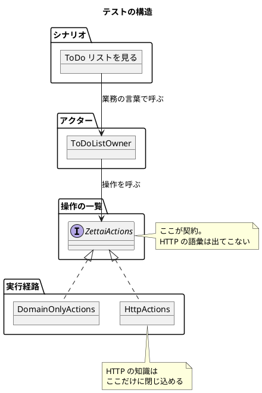

# 第 3 章 ドメインの定義とテスト

前章でウォーキングスケルトンを通しました。HTTP のリクエストから HTML まで、道筋ができています。

この章では、その道筋を確かめているテストのほうを見直します。今のテストには問題があります。**実装を変えると壊れる**のです。

## 受け入れテストを改善する

前章で書いたテストを、もう一度見てみます。

<!-- code-check: ignore 第 2 章時点のテスト。この章で書き換えるため現在のファイルには存在しない -->

```kotlin
@Test
fun `ToDo リストの項目が HTML に含まれる`() {
    val response = zettai(Request(Method.GET, "/todo/uberto/book"))

    expectThat(response.status).isEqualTo(Status.OK)
    items.forEach { expectThat(response.bodyString()).contains(it) }
}
```

動いています。縦串も確かめています。では何が問題なのか。

### このテストが知りすぎていること

このテストは、確かめたいこと以外をたくさん知っています。

| テストが知っていること | 本当に確かめたいことか |
| :--- | :--- |
| URL が `/todo/uberto/book` であること | いいえ。URL は変わりうる |
| HTTP のステータスが 200 であること | いいえ。HTTP を使うこと自体が実装の選択 |
| レスポンスが文字列で、項目がその中に含まれること | いいえ。HTML かどうかは表示の都合 |
| **uberto が book というリストの項目を見られること** | **はい。これが確かめたいこと** |

4 行のうち、業務として意味があるのは最後の 1 つだけです。残り 3 つは **今の実装がたまたまそうなっている**にすぎません。

### 何が起きるか

実装を変えたときに何が起きるかを考えます。

- URL を `/lists/{user}/{name}` に変えたら → テストが壊れる。業務は何も変わっていないのに
- HTML をテンプレートエンジンで組み立てるように変えたら（第 11 章） → `contains` の判定が通らなくなるかもしれない
- エラーの表現を `Outcome` に変えたら（第 7 章） → ステータスコードの扱いが変わる

**テストがリファクタリングの足かせになります。** これは本末転倒です。テストはリファクタリングを安全にするためにあるのに、テストがあるせいでリファクタリングが怖くなる。

### 目指す形

テストにこう書けるようにします。

```text
uberto は book というリストを持っている
uberto は book のリストを見られる
```

業務の言葉だけです。HTTP も HTML も出てきません。

## 高階関数を使う

どうすれば業務の言葉だけで書けるのか。

テストが「どうやるか」を知っているから問題なのでした。ならば、**「どうやるか」を外から渡せばいい**。関数を受け取る関数、つまり高階関数の出番です。

### 操作の一覧を決める

まず、テストが使える操作を決めます。

```kotlin
interface ZettaiActions : DdtActions<DdtProtocol> {
    fun setUp(user: User, list: ToDoList)

    fun getToDoList(user: User, listName: ListName): List<ToDoItem>?
}
```

2 つだけです。「リストを用意する」と「リストを取り出す」。

ここに HTTP の言葉は 1 つも出てきません。引数も戻り値もドメインの型です。**この一覧が、テストと実装の間の契約になります。**

（`DdtActions` を継承しているのはこの章の後半で扱います。今は「操作の一覧を宣言した」とだけ読んでください。）

### 実装を 2 つ用意する

同じ操作を、違うやり方で実装します。

1 つめは、ドメインを直接呼ぶやり方です。

```kotlin
/** ドメインを直接呼ぶ経路。HTTP を経由しないので速い。 */
class DomainOnlyActions : ZettaiActions {
    override val protocol: DdtProtocol = DomainOnly

    private val lists = mutableMapOf<User, List<ToDoList>>()

    override fun setUp(user: User, list: ToDoList) {
        lists[user] = lists.getOrDefault(user, emptyList()) + list
    }

    override fun getToDoList(user: User, listName: ListName): List<ToDoItem>? =
        inMemoryFetcher(lists)(user, listName)?.items
}
```

2 つめは、HTTP を経由するやり方です。

```kotlin
/** HTTP 経由の経路。レスポンスの HTML から項目を取り出す。 */
class HttpActions : ZettaiActions {
    override val protocol: DdtProtocol = Http("http4k")

    private val lists = mutableMapOf<User, List<ToDoList>>()

    override fun getToDoList(user: User, listName: ListName): List<ToDoItem>? {
        val zettai = Zettai(inMemoryFetcher(lists))
        val response = zettai(Request(Method.GET, "/todo/${user.name}/${listName.name}"))

        if (response.status != Status.OK) return null

        return response.bodyString().extractItems()
    }
}
```

HTTP の知識（URL の形、ステータスコード、HTML のパース）が、**すべてこのクラスの中に閉じ込められました**。

### シナリオを書く

テストはこうなります。

```kotlin
    @TestFactory
    fun `ToDo リストを見る`() = ddtScenario {
        val uberto = ToDoListOwner("uberto")

        play(
            uberto.`has a list`("book", listOf("write chapter", "publish book")),
            uberto.`can see the list`("book", listOf("write chapter", "publish book"))
        )
    }
```

目指した形になりました。URL もステータスコードも出てきません。

## ドメインとインフラストラクチャの分離

ここで起きたことを整理します。



**シナリオは、実行経路を知りません。** 経路を差し替えても、シナリオは 1 文字も変わりません。

そしてこの構造には、もう 1 つの意味があります。

### 2 つの経路で同じシナリオを走らせる

経路を 2 つ用意したので、**同じシナリオを両方で実行できます**。

```kotlin
    companion object {
        val allActions = listOf(DomainOnlyActions(), HttpActions())
    }
```

これが効きます。両方で同じ結果になるということは、**HTTP のアダプタが業務の振る舞いを変えていない**ということです。アダプタはドメインを外に公開しているだけで、判断を加えていない。

逆に、片方だけ失敗したら、そこに業務ロジックが漏れ出しています。**分離できているかどうかを、テストが教えてくれる**のです。

これは Gherkin + Cucumber では得にくい性質です。シナリオを 1 経路でしか実行しないのが普通だからです。この判断は [ADR-002](../../../adr/ADR-002-ddt-pesticide.md) に記録しました。

### 状態の漏れに注意する

経路のオブジェクトは複数のシナリオで使い回されます。そのため、**シナリオごとに状態を初期化しないと、実行順序で結果が変わります**。

```kotlin
    /** シナリオごとに状態を初期化する。テスト間で状態が漏れると、実行順序で結果が変わる。 */
    override fun prepare(): DomainSetUp {
        lists.clear()
        return Ready
    }
```

これは実際に踏みました。初期化を入れる前は、先に走ったシナリオが登録した空のリストが残り、後のシナリオが「項目が 2 つあるはず」の判定に失敗していました。

第 1 章で「テストの中に可変のフィールドを持たず」と書きました。ここでは経路の中に状態を持っています。**持つなら、いつ消えるかを明示する**必要があります。

## ドメインからテストを駆動する

アクターを見ておきます。シナリオの言葉を提供している部分です。

```kotlin
data class ToDoListOwner(override val name: String) : DdtActor<ZettaiActions>() {

    val user = User(name)

    fun `has a list`(listName: String, items: List<String>) =
        step(listName, items) {
            setUp(user, ToDoList(ListName(listName), items.map(::ToDoItem)))
        }

    fun `can see the list`(listName: String, items: List<String>) =
        step(listName, items) {
            expectThat(getToDoList(user, ListName(listName)))
                .isEqualTo(items.map(::ToDoItem))
        }
}
```

`step` に渡しているラムダの中で `setUp` や `getToDoList` を、レシーバーなしで呼んでいます。これらは `ZettaiActions` のメソッドです。**ラムダのレシーバーが `ZettaiActions` になっている**ため、そのまま呼べます。

この形の利点は、**アクターが経路を知らない**ことです。`ToDoListOwner` は「リストを持っている」「リストを見られる」という業務の操作しか知りません。

### 名前の付け方

メソッド名を英語のバッククォート記法にしています。第 1 章ではテスト名を日本語で書いていたので、方針が違うように見えます。

理由があります。**ここで書いているのはドメインの語彙**だからです。`ToDoList`・`ToDoItem`・`ListName` はコードの中で英語です。シナリオだけ日本語にすると、`` uberto.`book というリストを持っている` `` のように、日本語と英語が混ざります。

読者が原著と行き来できることも考えました。原著のシナリオは英語で書かれています。記事の本文は日本語で説明し、コードの語彙は原著に合わせる。この使い分けを [ADR-002](../../../adr/ADR-002-ddt-pesticide.md) に記録しています。

## DDT を Pesticide に変換する

ここまで作ってきたものには名前があります。**DDT（Domain Driven Test）** です。

要素を整理すると、こうなります。

| 要素 | 役割 |
| :--- | :--- |
| シナリオ | 業務の流れを、業務の言葉で書く |
| アクター | 業務の操作を提供する |
| 操作の一覧 | シナリオと実行経路の契約 |
| 実行経路 | 操作を実際にどう行うかの実装 |

この構造は Zettai に固有のものではありません。どのアプリケーションでも同じ形が使えます。だからライブラリになっています。それが [Pesticide](https://github.com/uberto/pesticide) です。

### 何が提供されるのか

この章では最初から Pesticide の型を使ってきました。改めて対応を見ます。

| 自前で作るなら | Pesticide |
| :--- | :--- |
| 操作の一覧のインターフェース | `DdtActions<P>` |
| アクターの基底クラス | `DdtActor<D>` |
| シナリオの組み立て | `ddtScenario { play(...) }` |
| ステップの定義 | `step(...) { }` |
| 経路の種類を表す値 | `DomainOnly`・`Http(...)` |
| 経路ごとの初期化 | `prepare()` / `tearDown()` |

テストの出力を見ると、経路ごとにステップが展開されているのが分かります。

```text
SeeATodoListDdt > ToDo リストを見る() > DomainOnlyActions > DomainOnly - uberto has a list PASSED
SeeATodoListDdt > ToDo リストを見る() > DomainOnlyActions > DomainOnly - uberto can see the list PASSED
SeeATodoListDdt > ToDo リストを見る() > HttpActions > Http http4k - uberto has a list PASSED
SeeATodoListDdt > ToDo リストを見る() > HttpActions > Http http4k - uberto can see the list PASSED
```

**1 つのシナリオが、経路の数だけ実行されています。** そして失敗したときは、どの経路のどのステップで落ちたかが出ます。

### ライブラリに寄せることの代償

Pesticide は原著者の個人プロジェクトです。更新が止まる可能性はあります。

それでも採用したのは、**依存が浅いところに留まる**からです。シナリオ（`SeeATodoListDdt`）とアクター（`ToDoListOwner`）が使っているのは `ddtScenario`・`play`・`step` だけで、これらは自前でも数十行で書けます。もし Pesticide が使えなくなっても、置き換えるのは基盤部分だけで、シナリオの記述は残ります。

**ライブラリを採用するかどうかは、「やめるときに何を捨てるか」で判断できます。**

## まとめ

この章でやったことを振り返ります。

- **テストが知りすぎている問題を特定しました。** 4 行のうち業務として意味があるのは 1 つで、残りは実装がたまたまそうなっているだけでした
- **高階関数で実行経路を外に出しました。** テストが使える操作を一覧として宣言し、「どうやるか」を実装側に閉じ込めました
- **ドメインとインフラストラクチャが分離されました。** 分離できたことは、同じシナリオが 2 経路で通ることで確かめられます。片方だけ落ちたら、そこに業務ロジックが漏れています
- **DDT を Pesticide に載せました。** 構造に名前が付き、ライブラリとして提供されているものに寄せました。やめるときに捨てるものが少ないことを確かめた上での判断です

この章で作った受け入れテストの入口を、**残りの 10 章すべてが使います**。第 9 章で永続化が入ったら「PostgreSQL 経由」の経路を足すだけで、既存のシナリオがそのまま新しい経路でも実行されます。

次の章からは、ドメインの中身を作っていきます。第 4 章では、第 2 章で引いた矢印（`ToDoListFetcher`）を一般化して、関数型の依存性注入を扱います。

---

## この章で書いたコード

- 受け入れテスト: `apps/kotlin/zettai/zettai-step1-http/src/test/kotlin/zettai/ddt/`
  - `ZettaiActions.kt`（操作の一覧）
  - `DomainOnlyActions.kt` / `HttpActions.kt`（実行経路）
  - `ToDoListOwner.kt`（アクター）
  - `SeeATodoListDdt.kt`（シナリオ）

本文のコードは上のファイルからの転記です。逐語でない抜粋にはマーカーを置いています。この対応は CI で機械的に検査しています。

## 参照

- Uberto Barbini『From Objects to Functions』第 3 章。DDT という考え方と Pesticide は本書の著者によるものです。本連載のコードはすべて書き起こした自作実装です
- [Pesticide](https://github.com/uberto/pesticide)
