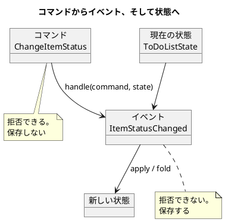

# 第 6 章 コマンドを実行してイベントを生成する

前章で、状態を出来事の積み重ねとして表しました。ただし出来事を作っていたのはテストです。本来なら、利用者の操作から生まれるはずです。

この章では、利用者の意図を型にします。

## 新しい ToDo リストの作成

これまで Zettai は読むだけでした。項目を追加できません。受け入れテストを足します。

```kotlin
    @TestFactory
    fun `項目を追加できる`() = ddtScenario {
        val uberto = ToDoListOwner("uberto")

        play(
            uberto.`creates a list`("book"),
            uberto.`adds an item`("book", "write chapter"),
            uberto.`adds an item`("book", "publish book"),
            uberto.`sees items`("book", listOf("write chapter", "publish book"))
        )
    }
```

もう 1 つ、第 4 章で型に場所を作っただけだった `status` を動かします。

```kotlin
    @TestFactory
    fun `項目に着手できる`() = ddtScenario {
        val uberto = ToDoListOwner("uberto")

        play(
            uberto.`creates a list`("book"),
            uberto.`adds an item`("book", "write chapter"),
            uberto.`starts working on`("book", "write chapter"),
            uberto.`sees the item in progress`("book", "write chapter")
        )
    }
```

そしてもう 1 つ。**できてはいけないこと**も書きます。

```kotlin
    @TestFactory
    fun `完了した項目は再開できない`() = ddtScenario {
        val uberto = ToDoListOwner("uberto")

        play(
            uberto.`creates a list`("book"),
            uberto.`adds an item`("book", "write chapter"),
            uberto.`completes`("book", "write chapter"),
            uberto.`cannot reopen`("book", "write chapter")
        )
    }
```

3 つめが重要です。**できることだけを確かめると、「何でもできる」実装でも green になります。**

## コマンドを使って状態を変更する

利用者の意図を型にします。

```kotlin
/**
 * 利用者の意図。
 *
 * コマンドは命令形で名付ける（CreateToDoList）。まだ起きていないので拒否できる。
 * イベントは過去形で名付ける（ListCreated）。すでに起きたので拒否できない。
 * この違いが、両方を持つ理由そのものである。
 */
sealed interface ToDoListCommand {
    val user: User
    val listName: ListName
}

data class CreateToDoList(override val user: User, override val listName: ListName) : ToDoListCommand
```

### コマンドとイベントは冗長ではないか

当然の疑問です。`CreateToDoList`（コマンド）と `ListCreated`（イベント）は、ほとんど同じ情報を持っています。片方で足りるのではないか。

違いは 1 つだけです。**コマンドは拒否できますが、イベントは拒否できません。**

| | コマンド | イベント |
| :--- | :--- | :--- |
| 名前 | 命令形（`CreateToDoList`） | 過去形（`ListCreated`） |
| 時点 | まだ起きていない | すでに起きた |
| 拒否 | **できる** | できない |
| 数 | 1 つのコマンドから 0 個以上のイベント | — |
| 保存 | しない（意図は記録しない） | する（事実を記録する） |

「1 つのコマンドから 0 個以上のイベント」が肝です。

- `CreateToDoList` が受け入れられる → `ListCreated` が 1 つ
- 同じ名前のリストが既にある → イベントは 0 個（拒否）
- （将来）リストをテンプレートから作る → `ListCreated` + `ItemAdded` が複数

**コマンドを受けてから、何が起きるかを決める余地がある。** これが分ける理由です。片方だけにすると、「起きたこと」に拒否の概念を持ち込むか、「意図」を事実として保存することになります。

### コマンドを 3 つ定義する

```kotlin
data class AddToDoItem(
    override val user: User,
    override val listName: ListName,
    val item: ToDoItem
) : ToDoListCommand

data class ChangeItemStatus(
    override val user: User,
    override val listName: ListName,
    val description: String,
    val newStatus: ToDoStatus
) : ToDoListCommand
```

## 状態とイベントによるドメインのモデリング

状態の遷移を決めます。**コードを書く前に、表を作ります。**

| 現在 | → Todo | → InProgress | → Done | → Blocked |
| :--- | :--- | :--- | :--- | :--- |
| Todo | — | 許す | 許す | 許さない |
| InProgress | 許さない | — | 許す | 許す |
| Done | 許さない | 許さない | — | 許さない |
| Blocked | 許さない | 許す | 許さない | — |

判断したことを 2 つ書き残します。

**`Done` からは戻れません。** 一度完了した項目を再開するのは、新しい項目を作るのと同じことだと決めました。業務上の判断です。

**`Todo` から `Blocked` へは行けません。** まだ着手していないものが「妨げられている」状態は、`Todo` と区別できないと考えました。

表にすると、**判断が漏れたマスが目に見えます**。コードから書き始めると、`when` の分岐を書いたところで満足して、書いていない組み合わせに気づきません。

### 表をコードにする

```kotlin
/**
 * 許される状態遷移。
 *
 * 遷移表をコードにしたもの。ここに無い遷移は許さない。
 * 表を先に作ってからコードにすると、「許さない遷移」を書き漏らさない。
 */
private val allowed: Map<ToDoStatus, Set<ToDoStatus>> = mapOf(
    ToDoStatus.Todo to setOf(ToDoStatus.InProgress, ToDoStatus.Done),
    ToDoStatus.InProgress to setOf(ToDoStatus.Done, ToDoStatus.Blocked),
    ToDoStatus.Blocked to setOf(ToDoStatus.InProgress),
    ToDoStatus.Done to emptySet()
)

/** この状態から次の状態へ遷移できるか。同じ状態への遷移は変化が無いので許さない。 */
fun ToDoStatus.canTransitionTo(next: ToDoStatus): Boolean = next in allowed.getValue(this)
```

### 表をテストにする

テストも表から起こします。**16 マスすべてです。**

```kotlin
    /** 遷移表。行が現在の状態、列が次の状態。 */
    private val table: Map<ToDoStatus, Map<ToDoStatus, Boolean>> = mapOf(
        ToDoStatus.Todo to mapOf(
            ToDoStatus.Todo to false,
            ToDoStatus.InProgress to true,
            ToDoStatus.Done to true,
            ToDoStatus.Blocked to false
        ),
```

<details>
<summary>残りの 3 行（InProgress・Done・Blocked）</summary>

```kotlin
        ToDoStatus.InProgress to mapOf(
            ToDoStatus.Todo to false,
            ToDoStatus.InProgress to false,
            ToDoStatus.Done to true,
            ToDoStatus.Blocked to true
        ),
        ToDoStatus.Done to mapOf(
            ToDoStatus.Todo to false,
            ToDoStatus.InProgress to false,
            ToDoStatus.Done to false,
            ToDoStatus.Blocked to false
        ),
        ToDoStatus.Blocked to mapOf(
            ToDoStatus.Todo to false,
            ToDoStatus.InProgress to true,
            ToDoStatus.Done to false,
            ToDoStatus.Blocked to false
        )
    )
```

</details>

表から動的にテストを生成します。

```kotlin
    @TestFactory
    fun `遷移表のすべてのマス`(): List<DynamicTest> =
        table.flatMap { (from, row) ->
            row.map { (to, expected) ->
                val verb = if (expected) "許す" else "許さない"
                DynamicTest.dynamicTest("$from から $to へは$verb") {
                    expectThat(from.canTransitionTo(to)).isEqualTo(expected)
                }
            }
        }
```

さらに、**表が 16 マスあること自体**も確かめます。

```kotlin
            expectThat(table.values.sumOf { it.size }).isEqualTo(16)
```

状態を 1 つ足したときに、表に行と列を足し忘れたら、このテストが落ちます。

## 関数型ステートマシンを記述する

コマンドと現在の状態から、何が起きるかを決めます。

```kotlin
/**
 * コマンドと現在の状態から、起こったことを決める。
 *
 * これが関数型のステートマシン。状態を書き換えるのではなく、
 * 「この状態でこのコマンドなら、この出来事が起きる」を返す。
 * 許されない操作では出来事が起きないので、空のリストを返す。
 */
fun handle(command: ToDoListCommand, state: ToDoListState): List<ToDoListEvent> =
    when (command) {
        is CreateToDoList ->
            if (state.listFor(command.user, command.listName) != null) {
                emptyList()
            } else {
                listOf(ListCreated(command.user, command.listName))
            }
```

<details>
<summary>残りの 2 つのコマンド</summary>

```kotlin
        is AddToDoItem ->
            if (state.listFor(command.user, command.listName) == null) {
                emptyList()
            } else {
                listOf(ItemAdded(command.user, command.listName, command.item))
            }

        is ChangeItemStatus -> {
            val item = state.listFor(command.user, command.listName)
                ?.items
                ?.firstOrNull { it.description == command.description }

            if (item == null || !item.status.canTransitionTo(command.newStatus)) {
                emptyList()
            } else {
                listOf(ItemStatusChanged(command.user, command.listName, command.description, command.newStatus))
            }
        }
    }
```

</details>

### 何が「関数型」なのか

`handle` は**純粋関数**です。

- 引数はコマンドと状態。それ以外を見ません
- 戻り値はイベントのリスト。それ以外を変えません
- 状態を書き換えません。書き換えは第 5 章の `apply` と `fold` の仕事です

普通のステートマシンは、内部に現在の状態を持ち、遷移で書き換えます。この実装は状態を持ちません。**状態は引数として渡されます。**

だからテストが書きやすい。状態を組み立てて `handle` を呼び、返ってきたイベントを見るだけです。

```kotlin
    @Test
    fun `許されない状態変更はイベントにならない`() {
        val state = stateOf(
            ListCreated(user, listName),
            ItemAdded(user, listName, ToDoItem("write chapter")),
            ItemStatusChanged(user, listName, "write chapter", ToDoStatus.Done)
        )

        val events = handle(ChangeItemStatus(user, listName, "write chapter", ToDoStatus.InProgress), state)

        expectThat(events).isEmpty()
    }
```

状態を作るのに使っているのは**イベントの列**です。第 5 章の畳み込みをそのまま使っています。

```kotlin
    private fun stateOf(vararg events: ToDoListEvent): ToDoListState =
        events.toList().replayFrom(ToDoListState.empty)
```

テストのための特別な状態構築器を書いていません。**本番と同じ経路で状態を作っています。**

### 空のリストで拒否を表すことの問題

`handle` は拒否を「空のイベントリスト」で表しています。動きますが、呼び出し側から見ると困ります。

**「何も起きなかった」と「拒否された」を区別できません。**

第 7 章でここを直します。この章では素朴なままにします。

## ハブと接続する

ハブがコマンドを受け付けるようにします。アダプタが 2 つ増えます。

```kotlin
/** 現在の状態を取り出す。 */
typealias StateFetcher = () -> ToDoListState

/** 起きた出来事を保存する。 */
typealias EventPersister = (List<ToDoListEvent>) -> Unit
```

どちらも関数の型です。第 4 章と同じ方針です。

```kotlin
class ToDoListHub(
    private val fetchList: ToDoListFetcher,
    private val fetchState: StateFetcher = { ToDoListState.empty },
    private val persist: EventPersister = { }
) {
```

### 引数を足したら、末尾ラムダが壊れた

ここで 1 つ踏みました。第 4 章では、テストでこう書けていました。

<!-- code-check: ignore 第 4 章時点の書き方。この章で名前付き引数に直した -->

```kotlin
val hub = ToDoListHub { u, l -> ... }
```

Kotlin の末尾ラムダの記法です。引数が 1 つのときは括弧を省けます。

引数を 3 つにしたところ、**この書き方が `persist` に束縛されるようになりました。** 末尾ラムダは「最後の引数」に渡されるからです。コンパイルエラーになって気づきました。

名前付き引数に直しました。

<!-- code-check: ignore 第 6 章時点のコード。第 7 章で null が Failure に変わる -->

```kotlin
        val hub = ToDoListHub(fetchList = { _, _ -> null })
```

**引数の追加が、呼び出し側の書き方を壊すことがある。** インターフェースなら起きない種類の問題です。関数の型を使う設計の、小さなコストとして記録しておきます。

### 保存先はアダプタが決める

受け入れテストの経路では、出来事をリストに溜めます。

<!-- code-check: ignore 第 6 章時点のコード。第 7 章で fetchList が Outcome を返すように変わる -->

```kotlin
    /** ハブを組み立てる。出来事の保存先はこのオブジェクトが持つリスト。 */
    private fun hub() = ToDoListHub(
        fetchList = { u, l -> state.listFor(u, l) },
        fetchState = { state },
        persist = { events += it }
    )
```

第 9 章では、この `persist` が PostgreSQL への書き込みになります。ハブのコードは変わりません。

### 表示に状態を出す

ここで 1 つ問題が出ました。HTTP 経由の受け入れテストが、項目の状態を確かめられません。**HTML に状態を表示していなかった**からです。

表示を足しました。

```kotlin
private fun renderRow(item: ToDoItem): String =
    "        <tr><td>${item.description}</td><td>${item.status}</td><td>${item.dueDate ?: ""}</td></tr>"
```

**受け入れテストが、表示の不足を教えてくれました。** 「ドメインに状態があるのに画面に出ていない」という不整合です。ドメイン直接の経路では通り、HTTP 経由の経路では落ちたので、原因が表示側だと分かりました。

第 3 章で 2 経路を用意した価値が、ここで出ています。

## コマンドとイベントを深く知る

この章で作った構造を整理します。



流れは一方向です。コマンドは状態を直接変えません。**イベントを経由します。**

### この形の見返り

| 得られるもの | 理由 |
| :--- | :--- |
| 「なぜ今この状態か」に答えられる | イベントが残っている |
| 業務ルールが 1 箇所に集まる | 拒否の判断はすべて `handle` にある |
| テストが状態を組み立てやすい | イベントの列を渡すだけ |
| 状態の再現ができる | 同じイベントの列から同じ状態が得られる |
| 将来の拡張に場所がある | 1 コマンドから複数イベントを返せる |

### 代償

正直に書きます。

| 失うもの | 内容 |
| :--- | :--- |
| コード量 | コマンドとイベントで型が 2 倍になる |
| 直感 | 「リストを作る」だけで 2 つの型を追うことになる |
| 現在の状態を知るコスト | 毎回イベントを畳み込む（第 9 章で対策する） |

**小さなアプリケーションなら、上書きのほうが素直です。** イベントが効いてくるのは、過去を問われるとき、業務ルールが増えるとき、状態の再現が必要になるときです。

Zettai は小さなアプリケーションですが、**この設計を説明するための題材**なので採用しています。実務では、得られるものと代償を並べて判断してください。

## まとめ

この章でやったことを振り返ります。

- **利用者の意図をコマンドにしました。** コマンドは命令形、イベントは過去形。**コマンドは拒否できて、イベントは拒否できない**ことが、両方を持つ理由です
- **遷移表を先に作りました。** 16 マスすべてをテストにし、表が 16 マスあること自体も確かめました。コードから書き始めると、書いていない組み合わせに気づきません
- **関数型のステートマシンを書きました。** 状態を持たず、コマンドと状態を引数に取り、イベントを返す純粋関数です
- **ハブにアダプタを 2 つ足しました。** その結果、末尾ラムダの書き方が壊れました。関数の型を使う設計の小さなコストです
- **受け入れテストが表示の不足を教えてくれました。** 2 経路で実行していたので、原因が表示側だと分かりました

拒否を「空のイベントリスト」で表しているのが、この章で残した課題です。呼び出し側が「何も起きなかった」と「拒否された」を区別できません。

次の章で、失敗を型に載せます。第 2 章から持ち越してきた `null` の問題も、そこで片付けます。

---

## この章で書いたコード

- コマンド: `apps/kotlin/zettai/zettai-step2-domain/src/main/kotlin/zettai/domain/commands/ToDoListCommand.kt`
- ステートマシン: `.../commands/CommandHandler.kt`
- 遷移表: `.../domain/ToDoStatusTransition.kt`
- ハブ: `.../domain/ToDoListHub.kt`
- テスト: `.../test/kotlin/zettai/domain/ToDoStatusTransitionTest.kt`、`.../commands/CommandHandlerTest.kt`

## 参照

- Uberto Barbini『From Objects to Functions』第 6 章。コマンドとイベントを分ける設計、関数型ステートマシンという考え方は本書に拠っています。本連載のコードはすべて書き起こした自作実装です
