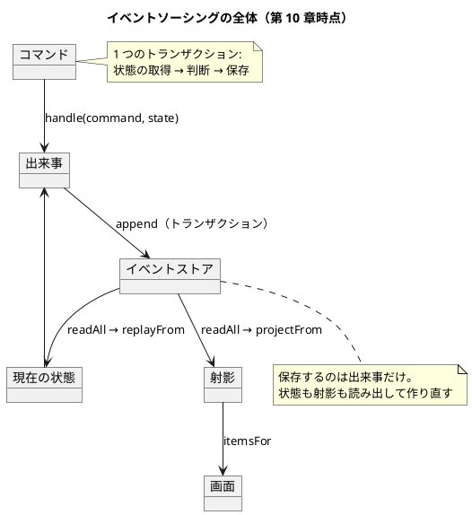

# 第 10 章 コンテキストを読み込み、コマンドを処理する

前章で `ContextReader` を作り、こう書きました。

> **同じ文脈（接続）を両方に渡しています。** これが効きます。2 つの操作が同じ接続で実行されるので、トランザクションにできます（第 10 章で扱います）。

この章でそれをやります。そして、**設計を 2 回間違えます。**

## モナドでデータベースにアクセスする

まず、今のままだと何が困るかを確かめます。

### 操作ごとに接続が作られる

第 9 章の `runOn` は、こうなっていました。

```kotlin
fun <T> DbAction<T>.runOn(connect: () -> Connection): Outcome<ZettaiError, T> =
    try {
        connect().use { connection -> runWith(connection).asSuccess() }
    } catch (e: Exception) {
        PersistenceError("データベースの操作に失敗しました: ${e.message}").asFailure()
    }
```

`connect()` で接続を作り、`use` で閉じます。**操作ごとに 1 回です。**

JDBC の既定では `autoCommit` が有効なので、INSERT した時点でコミットされます。つまり、操作を 2 つ続けて実行すると別々のトランザクションになります。

### 半分だけ残る

テストで確かめました。

```kotlin
    @Test
    fun `トランザクションを使わないと途中までの書き込みが残る`() {
        val first: List<ToDoListEvent> = listOf(ListCreated(user, book))

        // 同じ操作を runOn（autoCommit）で実行する。1 つめは commit されてしまう
        val outcome = PostgresEventStore.append(entityId, first)
            .flatMap<Unit> { error("2 つめの操作で失敗させる") }
            .runOn(TestDatabase::connect)

        expectThat(outcome).isA<Failure<*>>()

        // これがトランザクションを使う理由。失敗したのに 1 件残っている
        expectThat(storedCount()).isEqualTo(1)
    }
```

**失敗を返しているのに、1 件残っています。** 「リストを作る」が半分だけ成功した状態です。

利用者から見ると困ります。エラーが出たので作られていないと思っていたら、実は作られている。もう一度作ろうとすると「既にある」と言われる。

### 何をすればいいか

やることは JDBC の話としては単純です。

1. `autoCommit` を切る
2. 複数の操作を**同じ接続**で実行する
3. 全部成功したら `commit`、途中で失敗したら `rollback`

2 番目が設計の問題です。**操作が「どの接続で実行するか」を自分で決めている**と、同じ接続を共有できません。

第 9 章で作った `ContextReader` がここで効きます。

## ContextReader を使用したコマンドの処理

`ContextReader` は「文脈を受け取ってから値を返す計算」でした。**実行を後回しにしている**ので、後から文脈を渡せます。

### まず素朴に書いてみる

`runInTransaction` を作ります。

```kotlin
/** ハブの操作を 1 つのトランザクションとして実行する。 */
fun <T> HubAction<T>.runInTransaction(connect: () -> Connection): Outcome<ZettaiError, T> =
    try {
        connect().use { connection ->
            connection.autoCommit = false

            try {
                val result = runWith(JdbcContext(connection))
                connection.commit()
                result.asSuccess()
            } catch (e: Exception) {
                connection.rollback()
                throw e
            }
        }
    } catch (e: Exception) {
        PersistenceError("トランザクションが失敗しました: ${e.message}").asFailure()
    }
```

`runWith` を 1 回だけ呼びます。**`flatMap` で繋いだ操作は、すべてこの 1 つの接続を受け取ります。**

確かめます。

```kotlin
    @Test
    fun `途中で失敗したら 1 件も残らない`() {
        val first: List<ToDoListEvent> = listOf(ListCreated(user, book))

        val outcome = PostgresEventStore.append(entityId, first)
            .flatMap<Unit> { error("2 つめの操作で失敗させる") }
            .asHubAction()
            .runInTransaction(TestDatabase::connect)

        expectThat(outcome).isA<Failure<*>>()
        expectThat(storedCount()).isEqualTo(0)
    }
```

**0 件です。** ロールバックが効いています。

### テストは「失敗が起きたこと」まで確かめる

このテストで大事なのは `storedCount()` の行です。

`expectThat(outcome).isA<Failure<*>>()` だけでは足りません。**失敗を返していても書き込みが残っていたら、トランザクションになっていない**からです。前の節のテストがまさにそれでした。

「失敗が正しく起きたか」は、失敗の戻り値だけでは確かめられません。**副作用が残っていないことを別に見る**必要があります。

## トランザクションの境界を決める

どこからどこまでを 1 つの単位にするか。**コマンド 1 つの処理**にしました。

```text
1 つのトランザクション = 状態の取得 + コマンドの判断 + 出来事の保存
```

理由は、**コマンドが業務上の 1 つの意図**だからです。「リストを作る」が半分だけ成功する状態に意味はありません。

境界を HTTP リクエスト 1 つに広げる案もありました。採らなかったのは、1 リクエストで複数のコマンドを処理する場面が今なく、広げると「どこまでが 1 つの単位か」がコードから読み取りにくくなるからです。

判断は [ADR-011](../../../adr/ADR-011-transaction-boundary.md) に記録しました。

### ハブを書き換える

ポート 3 つの戻り値を、実行を後回しにする形に変えます。

```kotlin
/** 現在の状態を取り出す。コマンド側が業務ルールを判断するために使う。 */
typealias StateFetcher = () -> HubAction<ToDoListState>

/** 表示用の射影を取り出す。クエリ側が使う。 */
typealias ProjectionFetcher = () -> HubAction<ToDoListProjection>

/** 起きた出来事を保存する。 */
typealias EventPersister = (List<ToDoListEvent>) -> HubAction<Unit>
```

コマンドの処理は `flatMap` で繋ぎます。

```kotlin
    fun handle(command: ToDoListCommand): HubAction<Outcome<ZettaiError, List<ToDoListEvent>>> =
        fetchState().flatMap { state ->
            val events = handle(command, state)

            if (events.isEmpty()) {
                pure(failure(command.rejected()))
            } else {
                persist(events).map { success(events) }
            }
        }
```

**状態の取得と出来事の保存が `flatMap` で繋がっているので、同じ文脈で実行されます。** `runInTransaction` で走らせれば、まとめてコミットされます。

### また前提が崩れる

第 7 章で `Outcome` を導入したとき、ポートの型を変えて 6 ファイルが変わりました。今回も同じことが起きます。

**7 ファイル変更 + 3 ファイル新設**でした。

そして今回は、**失敗の表現も変わりました。** 第 9 章では `EventPersister` が `Outcome` を返していましたが、`HubAction<Unit>` になったので、ポートの型から失敗が見えません。失敗は実行時（`runInTransaction`）に捕らえて `Outcome` に変えます。

**型で表せていたものが、型から消えました。** これは後退です。得たもの（トランザクション）と失ったもの（型に現れる失敗）を並べておきます。

## 設計を 2 回間違えた

ここが、この章でいちばん書きたかったところです。

計画の段階で、懸念を書いていました。

> インメモリの経路が「接続を使わない `DbAction`」を返すことになるのが、この変更のいちばん不自然な点です。**接続が不要な実装に接続を受け取らせるのは、抽象が漏れている兆候かもしれません。**

懸念は当たりました。**そして、書いておいたのに防げませんでした。**

### 1 回目: null を Connection にキャストした

最初はこう書きました。

<!-- code-check: ignore 誤った実装。現在のコードには存在しない -->

```kotlin
typealias HubAction<T> = ContextReader<Connection, T>

// インメモリの経路
fun <T> runWithoutContext(action: HubAction<T>): T = action.runWith(null as Connection)
```

インメモリの経路は接続を必要としません。でも型が `Connection` を要求するので、`null` を渡そうとしました。

**実行したら `NullPointerException` でした。** Kotlin では非 null 型への `null` キャストは実行時に落ちます。`@Suppress("UNCHECKED_CAST")` を付けてコンパイルを通していたので、気づいたのはテストを走らせたときです。

第 7 章で `@UnsafeVariance` を付けて `ClassCastException` を踏んだのと、**同じ形の誤り**です。警告を黙らせる注釈を付けたら、黙らせた先で落ちました。

### 2 回目: 文脈に接続を持たせた

次に、文脈を型にしました。

<!-- code-check: ignore 誤った実装。現在のコードには存在しない -->

```kotlin
fun interface TxContext {
    fun connection(): Connection
}

val noConnection = TxContext { error("この文脈は接続を持たない") }
```

インメモリの経路には「接続を持たない文脈」を渡します。接続を要求したら失敗する。これで動きました。

**しかし `DomainBoundaryTest` が落ちました。**

```text
DomainBoundaryTest > ドメインと fp はフレームワークを import しない() FAILED
```

`TxContext` は `zettai.domain` にあります。`connection(): Connection` を持たせたので、**ドメインが `java.sql.Connection` を import していました。**

第 2 章で引いた境界を、自分で破っていました。

### 3 回目: 文脈を空にした

正解はこうでした。

```kotlin
/**
 * ハブの操作が必要とする文脈。
 *
 * **中身は空である。** ドメインは「文脈がある」ことだけを知り、それが何かを知らない。
 * 接続なのかインメモリなのかを決めるのはアダプタ側。
 *
 * 最初は connection(): Connection を持たせようとしたが、
 * DomainBoundaryTest が「ドメインが JDBC を import した」と検出した。
 * 文脈の中身をドメインに持ち込んではいけない。
 */
interface TxContext

/** 接続を持たない文脈。インメモリの実装が使う。 */
object InMemoryContext : TxContext
```

**中身が空です。** ドメインは「文脈がある」ことだけを知ります。

接続という具体は `zettai.persistence` に閉じ込めます。

```kotlin
data class JdbcContext(val connection: Connection) : TxContext
```

`DbAction` を `HubAction` に持ち上げるときに取り出します。

```kotlin
fun <T> DbAction<T>.asHubAction(): HubAction<T> =
    ContextReader { context ->
        require(context is JdbcContext) { "この操作は接続を必要とするが、文脈が JdbcContext ではない: $context" }

        runWith(context.connection)
    }
```

### 何を学んだか

**懸念を書いておくだけでは防げませんでした。** 計画に「抽象が漏れている兆候かもしれない」と書いたのに、1 回目も 2 回目も漏らしました。

止めたのは**テスト**です。1 回目は NPE で、2 回目は境界のテストで落ちました。

境界のテストは Unit 2（第 3 章のあと）で作ったものです。「`domain` パッケージがフレームワークを import しない」という 1 行の規則を、import を走査するテストにしただけです。

```kotlin
    @Test
    fun `ドメインと fp はフレームワークを import しない`() {
        val violations = domainSources.flatMap { file ->
            file.readLines()
                .filter { it.trimStart().startsWith("import ") }
                .filter { line -> frameworks.any { line.contains(it) } }
                .map { "${file.name}: ${it.trim()}" }
        }.toList()

        expectThat(violations).isEmpty()
    }
```

**このテストがなければ、ドメインに JDBC が入ったまま先へ進んでいました。** コンパイルは通り、テストも通り、動いていたからです。

設計の規則は、**気をつけるものではなく、検査するもの**です。

## データベースに対する射影のクエリ

クエリ側も同じ形にします。

```kotlin
    fun itemsFor(user: User, listName: ListName): HubAction<Outcome<ZettaiError, List<ToDoItem>>> =
        fetchProjection().map { projection ->
            projection.itemsFor(user, listName)
                ?.let(::success)
                ?: failure(ListNotFound("${listName.name} が見つかりません"))
        }
```

`map` を使っています。**クエリは書き込まないので、前の結果から次の計算を決める必要がありません。** `flatMap` は要りません。

第 9 章で書いたことがここで効きます。

> 「強い」というのは「できることが多い」という意味で、「偉い」という意味ではありません。**`map` で足りるなら `map` を使います。**

### 経路ごとの実装

PostgreSQL の経路は `DbAction` を持ち上げます。

```kotlin
            fetchState = { PostgresEventStore.readAll().asHubAction().map { it.replayFrom(ToDoListState.empty) } },
```

インメモリの経路は `pure` で包みます。

```kotlin
        fetchState = { pure(events.replayFrom(ToDoListState.empty)) },
```

`pure` は「文脈を使わずに値を返す計算」でした（第 9 章）。**文脈に触らないので、`InMemoryContext` を渡しても何も起きません。**

### 型では防げなかったこと

正直に書きます。`TxContext` が空なので、**型は「この操作が接続を必要とするか」を表せません。**

インメモリの文脈に永続化の操作を渡すと、`require` で実行時に落ちます。

型で防ぐには、文脈の種類ごとにポートを分ける（`InMemoryPort` と `JdbcPort`）ことになります。それはハブを 2 つ持つことに近く、CQRS とは別の分岐を持ち込みます。**実行時の検査で妥協しました。**

## イベントソーシングによるドメインのモデリング

ここまでで、イベントソーシングの形が揃いました。整理します。



### 何が揃ったか

| 部品 | 章 | 役割 |
| :--- | :--- | :--- |
| イベント | 5 | 起きたこと。過去形。拒否できない |
| 畳み込み（モノイド） | 5 | 出来事の列から状態を作る |
| コマンド | 6 | 利用者の意図。命令形。拒否できる |
| 関数型ステートマシン | 6 | 状態とコマンドから出来事を決める |
| `Outcome`（ファンクタ） | 7 | 失敗を型に載せる |
| 射影（ファンクタ） | 8 | 表示用のモデル。CQRS |
| イベントストア | 9 | 出来事だけを保存する |
| `ContextReader`（モナド） | 9・10 | 文脈つきの計算。トランザクション |

**8 つの部品のうち 4 つが、代数的な構造として名前を持っています。** そしてどれも「知っていたことに名前が付いた」形で導入しました。

### イベントソーシングの向き不向き

第 6 章で代償を書きました。第 9 章でも限界を書きました。ここでまとめます。

| 向いている | 向いていない |
| :--- | :--- |
| 「なぜ今この状態か」を問われる | 現在の状態だけが必要 |
| 業務ルールが多く、変更の拒否が頻繁 | 単純な CRUD |
| 監査が必要 | 記録の重複を避けたい |
| 複数の見せ方（射影）が要る | 画面が 1 つ |
| 読み出しより書き込みが少ない | 読み出しが極端に多い（対策が必要） |

**Zettai は右側の列にかなり当てはまります。** 画面は 1 つで、業務ルールも少ない。それでもイベントソーシングを採ったのは、**この設計を説明するための題材**だからです。

実務で採用するときは、右側の列を確かめてください。

## まとめ

この章でやったことを振り返ります。

- **トランザクションを作りました。** `autoCommit` を切り、`flatMap` で繋いだ操作を同じ接続で実行し、失敗したらロールバックします
- **境界をコマンド 1 つの処理に置きました。** コマンドが業務上の 1 つの意図だからです
- **ポートの戻り値を `HubAction` にしました。** 7 ファイル変更 + 3 ファイル新設。第 7 章（6 ファイル）と同じ規模です
- **型に現れていた失敗が、型から消えました。** 得たもの（トランザクション）と失ったもの（型に現れる失敗）を並べました
- **設計を 2 回間違えました。** `null` を `Connection` にキャストして NPE、文脈に接続を持たせてドメインが JDBC を import。どちらもテストが止めました
- **クエリ側は `map` で足りました。** 書き込まないので `flatMap` は要りません

いちばんの学びは 5 番目です。**計画に「抽象が漏れている兆候かもしれない」と書いておいたのに、2 回漏らしました。**

止めたのは Unit 2 で作った 20 行の境界テストです。設計の規則は、気をつけるものではなく検査するものだと分かりました。

次の章では、入力の検証を扱います。ここまで失敗は「最初の 1 つ」しか返していませんでしたが、複数の誤りをまとめて返せるようにします。そこで 4 つめの構造が現れます。

---

## この章で書いたコード

- 文脈: `apps/kotlin/zettai/zettai-step4-context/src/main/kotlin/zettai/domain/TxContext.kt`
- トランザクション: `.../persistence/PostgresEventStore.kt`（`runInTransaction`・`JdbcContext`・`asHubAction`）
- ハブ（変更）: `.../domain/ToDoListHub.kt`
- テスト: `.../test/kotlin/zettai/persistence/TransactionTest.kt`

この章から `zettai-step4-context` モジュールに移ります。

## 参照

- Uberto Barbini『From Objects to Functions』第 10 章。`ContextReader` によるコマンド処理という考え方は本書に拠っています。本連載のコードはすべて書き起こした自作実装です
- [ADR-011 トランザクションの境界をコマンド 1 つの処理に置き文脈を不透明な型にする](../../../adr/ADR-011-transaction-boundary.md)
