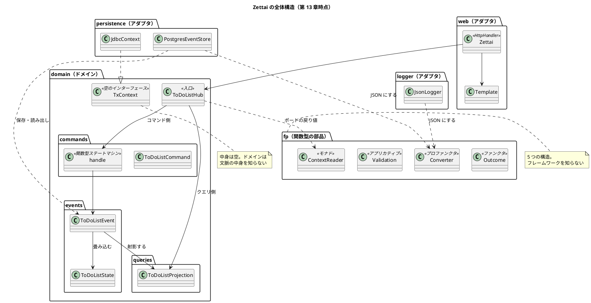
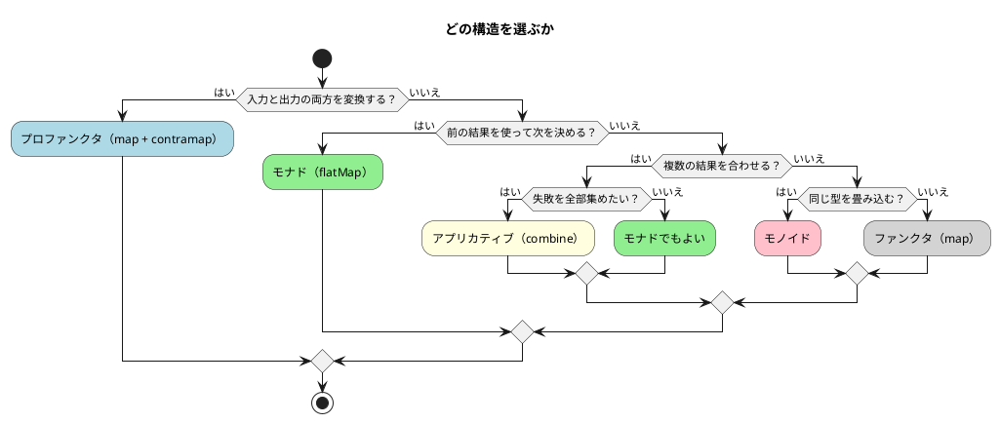

# 第 13 章 関数型アーキテクチャの設計

12 章かけて Zettai を作りました。この章ではコードをほとんど書きません。

**積み上げたものが全体として何だったのか**を整理します。そして**扱わなかったこと**も書きます。

## シンプルさを追い求めて

「シンプルな設計」はよく言われます。しかし**何をシンプルと呼ぶか**は人によって違います。

この連載が実際にシンプルと呼んだものを、振り返って整理します。

### 少ないことがシンプルではなかった

コード量で見ると、Zettai は素朴な実装より**多い**です。

| 要素 | 素朴な実装 | Zettai |
| :--- | :--- | :--- |
| 状態の変更 | `map[key] = value` | イベント + 畳み込み + コマンド + ステートマシン |
| 失敗 | 例外か null | `Outcome` + `ZettaiError` 5 種 |
| 表示 | 状態から直接作る | 射影（別のモデル） |
| 永続化 | ORM で状態を保存 | イベントストア + `ContextReader` |
| 検証 | if を並べる | `Validation` + `combine` |

**どれも増えています。** 型が増え、ファイルが増え、覚えることが増えました。

では何がシンプルになったのか。

### 「知らなくてよいことが増えた」ことがシンプルさだった

振り返ると、この連載が一貫して作ってきたのは **「知らなくてよいこと」** でした。

| 誰が | 何を知らないか | どの章で |
| :--- | :--- | :--- |
| ドメイン | HTTP のこと | 2・3 |
| ドメイン | JDBC・Exposed のこと | 9・10 |
| ドメイン | ログのこと | 12 |
| ドメイン | 文脈の中身が接続かどうか | 10 |
| `Zettai`（HTTP の層） | リストをどこから取るか | 2・4 |
| `ToDoListHub` | インメモリか PostgreSQL か | 4・9 |
| 受け入れテストのシナリオ | どの経路で実行されるか | 3 |
| コマンドの処理 | 状態をどこから取るか | 6 |
| テンプレート | 値がどう作られたか | 11 |

**「知らない」の数が増えるほど、1 箇所を変えたときに影響する範囲が狭くなります。**

これを測った回がありました。

| 変更 | 波及 | 波及しなかったもの |
| :--- | :--- | :--- |
| 第 7 章: ポートの戻り値を `Outcome` に | 6 ファイル | ドメインの型・畳み込み・コマンド・**受け入れテストのシナリオ** |
| 第 10 章: ポートを `HubAction` に | 7 変更 + 3 新設 | 同じ |
| 第 12 章: ログを足す | **0 ファイル**（包むだけ） | すべて |

第 7 章で「型が変わらなければ上のコードは変わらない」と書き、実際に型を変えて条件付きだったことが分かりました。正確にはこうです。

> 型が変われば、**その型を触る場所だけ**が変わる。

そして「触る場所」が少ないのは、**多くの場所がその型を知らないから**です。

### 短いコードはシンプルさの結果ではない

一方で、**短く書こうとして失敗した回**もありました。

第 4 章で `Zettai` のハンドラを `.let(fetchList)` で繋ごうとして、型推論が壊れました。素直に書き直したら通りました。

> 教材コードで凝る理由はない。読者が読む前に自分が読めなくなる。

第 12 章の `Converter` も、出来事 ↔ 文字列を直接書けました。2 段（出来事 ↔ 並び ↔ 文字列）にしたのは、**それぞれを小さくするため**です。全体の行数は増えました。

**シンプルさは短さではなく、1 つずつが小さいことでした。**

## システム全体の設計

13 章で組み上げた構造を 1 枚にします。



### 依存の向き

**依存は常にアダプタからドメインへ、一方向です。** 例外はありません。

これを保証しているのは 20 行のテストです。

```kotlin
    @Test
    fun `ドメインと fp はフレームワークを import しない`() {
        val violations = domainSources.flatMap { file ->
            file.readLines()
                .filter { it.trimStart().startsWith("import ") }
                .filter { line -> frameworks.any { line.contains(it) } }
                .map { "${file.name}: ${it.trim()}" }
        }.toList()

        expectThat(violations).isEmpty()
    }
```

**第 10 章でこのテストに止められました。** 文脈に `Connection` を持たせて、ドメインが JDBC を import していました。コンパイルは通り、他のテストも通り、動いていました。

**設計の規則は、気をつけるものではなく検査するものです。**

### 受け入れテストの入口が 10 章を支えた

第 3 章で作った受け入れテストの構造が、最後まで効きました。

| 章 | 起きたこと | シナリオの変更 |
| :--- | :--- | :--- |
| 5 | 状態を Map からイベントの畳み込みに置き換え | **なし** |
| 7 | ポートの戻り値を `Outcome` に | **なし** |
| 8 | クエリ側を射影に分離（CQRS） | **なし** |
| 9 | PostgreSQL 経由の経路を追加 | **なし**（経路を足しただけ） |
| 10 | ポートを `HubAction` に | **なし** |

**ドメインの内部を 5 回作り替えて、シナリオは 1 文字も変わりませんでした。**

理由は、シナリオが業務の言葉で書かれているからです。

```kotlin
        play(
            uberto.`creates a list`("book"),
            uberto.`adds an item`("book", "write chapter"),
            uberto.`renames the list`("book", "reading"),
            uberto.`sees items`("reading", listOf("write chapter"))
        )
```

HTTP もデータベースも出てきません。第 3 章でこう書きました。

> 分離できたことは、同じシナリオが 2 経路で通ることで確かめられます。片方だけ落ちたら、そこに業務ロジックが漏れています

**10 章後に、3 経路でその証拠が立っています。**

## コードへの翻訳

5 つの構造を、**いつ選ぶか**で整理します。これがこの章のいちばんの目的です。

### 5 つの構造

| 構造 | 持つもの | 選ぶとき | 章 |
| :--- | :--- | :--- | :--- |
| **モノイド** | 合成と単位元 | 同じ型のものを**畳み込みたい** | 5 |
| **ファンクタ** | `map` | 箱の**中身だけ**を変えたい | 7・8 |
| **アプリカティブ** | `map` + `combine` | **独立な計算を合わせ、失敗を全部集めたい** | 11 |
| **モナド** | `map` + `flatMap` + `pure` | **前の結果を使って次を決めたい** | 9・10 |
| **プロファンクタ** | `map` + `contramap` | **入力と出力の両方を変換したい** | 12 |

### 判断の手順

実際には、この順で考えると決まります。



**上から順に「いいえ」なら下へ**です。強い構造から確かめて、要らなければ弱いものにします。

### 強い構造が偉いわけではない

これを 3 回書きました。

| 章 | 書いたこと |
| :--- | :--- |
| 9 | 「強い」とは「できることが多い」という意味で、「偉い」という意味ではない。**`map` で足りるなら `map` を使う** |
| 10 | クエリ側は書き込まないので `flatMap` は要らない。`map` で足りた |
| 11 | **モナドのほうが強いのに、失敗の扱いでは劣る** |

11 章の対比がいちばん分かりやすいです。

```text
モナド:       前の結果を使う → 前が失敗したら次を決められない → 止まる
アプリカティブ: 前の結果を使わない → 独立に走らせられる → 全部集まる
```

**できることを増やすと、できなくなることがあります。** モナドは「前の結果を使う」能力を得た代わりに、「失敗を集める」能力を失いました。

**必要な強さを選ぶ。** これが 5 つの構造から得た唯一の実用的な結論です。

### 12 件の ADR に通底するもの

設計判断を 12 件の ADR に記録しました。並べると、**同じ形の判断が繰り返されています**。

| ADR | 判断 | 形 |
| :--- | :--- | :--- |
| [004](../../../adr/ADR-004-static-analysis.md) | 静的解析を入れない | **既製品を試して合わなかった** |
| [005](../../../adr/ADR-005-property-based-testing.md) | プロパティテストのライブラリを入れない | 調べて、自前 20 行で足りた |
| [008](../../../adr/ADR-008-event-store-single-table.md) | ORM を使わない | 解決する問題が起きなかった |
| [009](../../../adr/ADR-009-integration-test-database.md) | Testcontainers を使わない | 読者に実体を見せたかった |
| [010](../../../adr/ADR-010-own-template.md) | テンプレートエンジンを使わない | 調べて、要求（`Outcome` を返す）を満たさなかった |
| [012](../../../adr/ADR-012-own-json-converter.md) | Kondor を使わない | 独自の `Outcome` を持ち込む |

**6 件が「既製品を使わない」判断です。** しかも全部、**調べてから決めています**。

これは「自作が好き」ではありません。**この連載の要求が特殊**だからです。

| 要求 | 既製品との衝突 |
| :--- | :--- |
| 教材として説明できること | ライブラリの使い方の説明に紙面が要る |
| 記事のコードが縦長にならないこと | ktlint の整形と衝突した |
| 自作の `Outcome` を中心に置くこと | Kondor の `Outcome` と並ぶ |
| 未適用のタグを失敗にすること | テンプレートエンジンは例外を投げる |

**実務なら逆の判断になります。** ライブラリを使ったほうが速く、保守されます。

判断の形を残したのは、**「なぜ入れなかったか」が分かれば、条件が変わったときに入れられる**からです。**「入れない」と決めた 6 件には、全件に再検討の条件を書きました**（どの事象が起きたら入れるか）。実際に Unit 5 で ADR-004・005 を再検討しました。

### もう 1 つの型: 試してから決める

ADR-004 だけ形が違います。**ktlint を実際に導入して動かしてから**、採用しませんでした。

前の判断（Unit 2）では試していませんでした。試したので「合わなかった」ことを具体的に書けました。

| | 試さずに決める | 試してから決める |
| :--- | :--- | :--- |
| 結論 | 同じになることもある | 同じ |
| 根拠の強さ | 弱い | **強い** |
| 後から蒸し返されるか | されやすい | されにくい |

**「入れない」判断は、入れてみてから下すほうが強い**と分かりました。

## 最後の考察

### 扱わなかったこと

**この設計をそのまま実務に出せません。** 扱わなかったことを挙げます。

| # | 扱わなかったこと | 章 | 実務ではどうするか |
| :--- | :--- | :--- | :--- |
| 1 | **認証・認可** | 全章 | `User` をパスに含めているだけで、本人確認をしていない。誰でも他人のリストを操作できる。認証（誰か）と認可（何ができるか）の両方が必須 |
| 2 | **HTML エスケープ** | 11 | 利用者の入力をそのまま HTML に差し込んでいる。`<script>` を入れられる。差し込む値をすべてエスケープする |
| 3 | **CSRF 対策** | 11 | フォームを作るならトークンが必須 |
| 4 | **スナップショット / リードモデルの永続化** | 9 | 状態を読むたびに全出来事を畳み込む。出来事が増えると遅くなる。ある時点の状態を保存するか、射影を永続化する |
| 5 | **JSON のエスケープ** | 12 | 値に `"` が入ると壊れる。既製のライブラリを使うか、エスケープを実装する |

**1 番目がいちばん重大です。** 認証が無いので、Zettai は「誰でも誰のリストでも操作できるアプリケーション」です。

これらを扱わなかったのは、**連載の主題が「オブジェクト指向から関数型へ設計を移すこと」**だからです。認証もエスケープも重要ですが、関数型の設計とは別の主題です。

とはいえ、**黙っていれば読者が誤解します。** ここに書いておきます。

### 何を扱ったのか

逆に、この連載が実際に扱ったことを並べます。

| 扱ったこと | 得られたもの |
| :--- | :--- |
| テストを先に書く | 設計が導かれた。13 章で 690 のテストが残った |
| 受け入れテストを業務の言葉で書く | ドメインを 5 回作り替えてもシナリオが変わらなかった |
| 依存を関数の型で表す | テスト用の実装クラスが要らなくなった。ただし**境界の位置のほうが効いた** |
| 状態を出来事として残す | 「なぜ今この状態か」に答えられる。射影を後から足せた |
| 失敗を型に載せる | 呼び出し側が失敗を無視できない。理由を区別できる |
| コマンドとイベントを分ける | 業務ルールが 1 箇所に集まった |
| 代数的な性質を法則として確かめる | 組み替えが安全になった。**同じ形のテストを 5 回書けた** |
| 設計の規則をテストにする | 2 回止められた。気をつけるだけでは防げなかった |

### 関数型は目的ではなかった

この連載は「関数型で書く」ことを目指しました。しかし振り返ると、**関数型そのものが目的だった場面はありません。**

| やったこと | 理由 |
| :--- | :--- |
| 純粋関数にした | テストが書きやすいから |
| イミュータブルにした | 過去が失われないから |
| 依存を関数の型にした | テスト用のクラスが要らないから |
| 法則を確かめた | 組み替えが安全になるから |

**どれも「関数型だから」ではなく「そのほうが変更が楽で安全だから」でした。**

第 1 章でこう書きました。

> ToDo リストは、一見すると平凡です。

平凡な題材を選んだのは、設計に集中するためでした。13 章書いて、扱っていたのは結局**変更を楽に安全にする方法**でした。関数型はその手段です。

### 次に何をするか

読者が次にやることを提案します。

**1. 自分のコードで「知らなくてよいこと」を 1 つ作る。**

全部を作り替える必要はありません。1 つの依存を関数の型にする、1 つのポートをインターフェースの向こうに隠す。それだけで、変更の波及が狭くなります。

**2. 設計の規則を 1 つテストにする。**

「この層はあれを import しない」という規則を、20 行のテストにします。この連載では 2 回、それに止められました。

**3. 法則を 1 つ確かめる。**

すでに書いている `map` が、恒等則と合成則を満たしているか確かめてみてください。満たしていなければ、それは `map` と呼ぶべきではないかもしれません。

**4. ADR を 1 件書く。**

「なぜ入れなかったか」を残すと、条件が変わったときに判断を戻せます。再検討の条件も書いてください。

---

## 連載を終えて

13 章、690 のテスト、12 件の ADR。

**5 つの代数構造に名前を与えました。** どれも「知っていたことに名前が付いた」形で導入しました。整数の足し算、`List.map`、`List.flatMap`、`List.zip`、`Comparator`。すべて既に使っていたものです。

**そして 5 回とも、同じ形のテストで法則を確かめました。** 新しい概念が出るたびに新しい道具を覚える必要はありませんでした。

最後に、この連載でいちばん繰り返した言葉を置きます。

> **必要な強さを選ぶ。**

強い構造も、多くのライブラリも、厳しい静的解析も、それ自体が良いわけではありません。**目の前の問題に必要なものを選ぶ。** それが 13 章を通じて変わらなかった判断の基準でした。

---

## この章で書いたコード

ありません。この章は総括です。

全 13 章のコードは `apps/kotlin/zettai/` にあります。章の区切りごとにモジュールが分かれています（[ADR-007](../../../adr/ADR-007-module-per-unit.md)）。

| モジュール | 章 |
| :--- | :--- |
| `zettai-step1-http` | 1〜3 |
| `zettai-step2-domain` | 4〜7 |
| `zettai-step3-persistence` | 8〜9 |
| `zettai-step4-context` | 10〜11 |
| `zettai-step5-monitoring` | 12〜13 |

## 参照

- Uberto Barbini『From Objects to Functions』第 13 章。題材・章構成・設計の道筋は本書に拠っています。本連載のコードはすべて書き起こした自作実装です
- 設計判断の記録: [ADR 索引](../../../adr/index.md)（12 件）
- 設計ドキュメント: [バックエンドアーキテクチャ](../../../design/architecture_backend.md)・[ドメインモデル](../../../design/domain-model.md)・[データモデル](../../../design/data-model.md)・[UI 設計](../../../design/ui_design.md)
