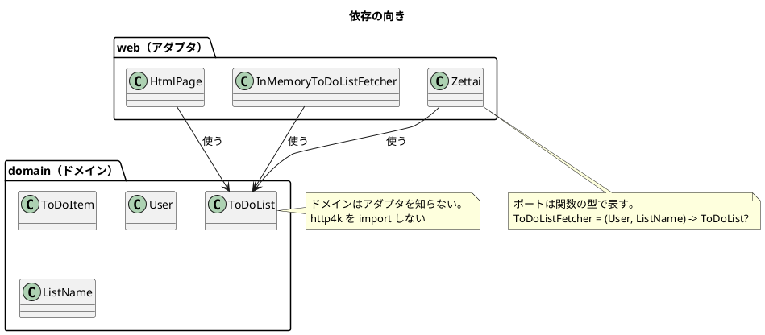

# バックエンドアーキテクチャ設計 - Zettai

ToDo リストアプリケーション Zettai（Kotlin 版）のバックエンド構成を定義します。連載の進行にあわせて構造が変わるため、**現時点の構造と、どの章で何が変わるか**を並べて書きます。

実装は `apps/kotlin/zettai/` にあります。

## 全体方針

ヘキサゴナルアーキテクチャ（ポートとアダプタ）を、**関数の型**で表現します。インターフェースを定義してクラスで実装するのではなく、ポートを関数の型（`typealias`）として宣言し、アダプタはその型の値（ラムダや関数参照）として渡します。



依存は常に **アダプタ → ドメイン** の一方向です。

## ドメインとアダプタの境界

境界の定義は 1 つだけです。

> **`zettai.domain` と `zettai.fp` パッケージのファイルは、フレームワークを import しない。**

現時点では http4k が対象で、第 9 章以降は JDBC / Exposed が、第 12 章では Kondor が加わります。第 7 章で `zettai.fp` を新設し、検査対象に加えました。

この定義を採る理由は、**破ろうとしたときに目に見える**ことです。コメントや命名規約と違い、import 文は書けば残ります。レビューで検出でき、将来は依存関係のテストで機械的に止められます。

| 確認方法 | 状態 |
| :--- | :--- |
| ドメイン層のテストがフレームワークなしで通る | 実施中（`zettai.domain` のテスト） |
| import を機械的に検査する | **実施中**（`DomainBoundaryTest`。http4k・JDBC・Exposed・Kondor を検査） |

## モジュール分割

Gradle のマルチプロジェクトとし、**章の進行にあわせてモジュールを増やします**。読者が「その章の時点のコード」を丸ごと参照できるようにするためです。

```text
apps/kotlin/zettai/
├── settings.gradle.kts          # モジュールを include
├── build.gradle.kts             # 全モジュール共通（jvmToolchain(21)・テスト依存・Kover）
├── gradle/libs.versions.toml    # 依存バージョンの集中管理
└── zettai-stepN-<テーマ>/
```

モジュールは **Unit の境界（= 2 章）** で切ります。原著の 7 段階には合わせません（[ADR-007](../adr/ADR-007-module-per-unit.md)）。

| モジュール | 章 | Unit | 状態 |
| :--- | :--- | :--- | :--- |
| `zettai-step1-http` | 1〜3 | Unit 1〜2 | 作成済み |
| `zettai-step2-domain` | 4〜7 | Unit 3〜4 | 作成済み |
| `zettai-step3-persistence` | 8〜9 | Unit 5 | 作成済み |
| `zettai-step4-context` | 10〜11 | Unit 6 | **作成済み** |
| `zettai-step5-*` | 12〜13 | Unit 7 | 未作成 |

### 命名規約

- モジュール名は `zettai-stepN-<テーマ>`。原著のコンパニオンコード（`zettai_stepN_*`）に対応させ、Gradle の慣習にあわせてハイフン区切りにする
- パッケージのルートは `zettai`。原著（`com.ubertob.fotf.*`）とは分ける。自作実装であることを明確にするため
- 依存バージョンは `gradle/libs.versions.toml` の 1 箇所に書く。`build.gradle.kts` にリテラルのバージョンを書かない

## パッケージ構成

```text
src/main/kotlin/zettai/
├── domain/     ドメイン。フレームワークを知らない
└── web/        HTTP アダプタ

src/test/kotlin/zettai/
├── ddt/        受け入れテスト（Pesticide）
├── smoke/      実行環境のスモークテスト
└── web/        アダプタのテスト
```

章の進行で増える予定のパッケージは次のとおりです。

| パッケージ | 章 | 内容 |
| :--- | :--- | :--- |
| `domain/events/` | 5 | イベントと畳み込み（**作成済み**） |
| `domain/commands/` | 6 | コマンドと関数型ステートマシン（**作成済み**） |
| `domain/queries/` | 8 | 射影（クエリ側のモデル）（**作成済み**） |
| `fp/` | 7・9 | `Outcome`・`ContextReader`（**作成済み**） |
| `persistence/` | 9 | PostgreSQL のイベントストア（**作成済み**） |
| `ui/` | 11 | 自前のテンプレート機構（**作成済み**。[ADR-010](../adr/ADR-010-own-template.md)） |
| `domain/commands/` | 6 | コマンドと関数型ステートマシン |
| `fp/` | 7・9・10・11 | `Outcome`・`ContextReader`・`Validation` |
| `domain/queries/` | 8 | 射影（CQRS のクエリ側） |
| `persistence/` | 9 | PostgreSQL アダプタ |
| `logger/` | 12 | 構造化ロギング |

## ポートの一覧

ポートは `ToDoListHub` が受け取ります（第 4 章以降）。HTTP の層はハブしか知りません。

| ポート | 型 | アダプタ | 章 |
| :--- | :--- | :--- | :--- |
| 現在の状態の取得 | `StateFetcher = () -> HubAction<ToDoListState>` | イベントを畳み込む実装（コマンド側） | 6、**10（`HubAction`）** |
| 表示用の射影の取得 | `ProjectionFetcher = () -> HubAction<ToDoListProjection>` | イベントを射影に畳み込む実装（クエリ側） | 8、**10（`HubAction`）** |
| 出来事の保存 | `EventPersister = (List<ToDoListEvent>) -> HubAction<Unit>` | インメモリのリスト、または PostgreSQL | 6、9、**10（`HubAction`）** |

`HubAction<T>` は `ContextReader<TxContext, T>` です。**実行を後回しにすることで、複数の操作が同じ文脈を受け取り 1 つのトランザクションになります**（[ADR-011](../adr/ADR-011-transaction-boundary.md)）。

第 4 章の `ToDoListFetcher` は第 8 章の CQRS 化で使わなくなりました（クエリ側が射影を見るため）。

**第 10 章でポートの型から失敗が消えました。** 第 9 章までは `Outcome` を返していましたが、`HubAction` になったため、失敗は実行時（`runInTransaction`）に捕らえて `Outcome` に変えます。得たもの（トランザクション）と失ったもの（型に現れる失敗）のトレードオフです。

第 8 章でハブをコマンド側とクエリ側に分けました（CQRS）。`ToDoListFetcher` は使わなくなり、クエリ側は射影を見ます。

第 9 章で PostgreSQL 版のアダプタが加わります。

**「ポートの型が変わらなければ、ハブより上のコードは変わらない」という説明は条件付きでした。** 第 7 章で `ToDoListFetcher` の戻り値を `Outcome` に変えたとき、6 ファイルが変わりました。正確にはこうです。

> 型が変われば、**その型を触る場所だけ**が変わる。

ドメインの型・イベントの畳み込み・コマンドとステートマシン・受け入れテストのシナリオには波及しませんでした。波及しなかったのは、**ドメインがポートを知らず、シナリオが実装を知らないから**です。詳細は [ADR-006](../adr/ADR-006-outcome-port-type.md)。

`ToDoListFetcher` の定義は第 4 章で `zettai.web` から `zettai.domain` へ移しました。**ポートはドメインが決めるもの**だからです。

エラーを `null` で表しているのは暫定です。第 7 章で `Outcome` に置き換えます。

## テストの構成

| 種別 | 対象 | 実行経路 |
| :--- | :--- | :--- |
| 受け入れテスト（DDT） | シナリオ全体 | ドメイン直接 / HTTP 経由の 2 経路 |
| ユニットテスト | ドメイン層 | 直接 |
| スモークテスト | 実行環境とサイト構成 | 直接 |

受け入れテストは [Pesticide](https://github.com/uberto/pesticide) を使い、**同じシナリオを複数の経路で実行**します。経路を差し替えても確かめている内容が変わらないことが、ドメインとインフラが分離できている証拠になります。

BDD / Gherkin（Cucumber）は採用していません。理由は [開発戦略](../development/development_strategy.md) と ADR-002 にあります。

## 品質ゲート

`./gradlew check` にコンパイル・テスト・カバレッジ検証を集約します。ローカルと CI で同じコマンドを実行し、判定を一致させます。

| ゲート | 基準 |
| :--- | :--- |
| テスト | 全件 green |
| カバレッジ（Kover） | ドメイン層 80% 以上 |
| 静的解析 | 導入しない（[ADR-004](../adr/ADR-004-static-analysis.md)。Unit 5 で再検討） |
| ドメインの境界 | `DomainBoundaryTest` が green |
| 代数的性質 | プロパティベーステストで検証（モノイド・ファンクタ・モナド。[ADR-005](../adr/ADR-005-property-based-testing.md)） |
| 結合テスト | `check` に含める。別ジョブに分けない（[ADR-009](../adr/ADR-009-integration-test-database.md)） |
| トランザクション | 失敗時に書き込みが 1 件も残らないことを結合テストで確認（[ADR-011](../adr/ADR-011-transaction-boundary.md)） |
| テンプレート | 未適用のタグが残ったら `Outcome` の失敗（[ADR-010](../adr/ADR-010-own-template.md)） |
| コードの読みやすさ | 行長 120 以下・`import` の並び。汎用の静的解析は入れない（[ADR-004](../adr/ADR-004-static-analysis.md)） |
| 記事のコード例検査 | CI の独立したジョブ。違反 0 件 |

## なでしこ3 版での差分

設計そのものは対象言語をまたいで共通です。変わるのは実現手段だけなので、差分だけをここに書きます。

### ポートとアダプタの表し方

Kotlin 版はポートを**型**（`typealias` による関数の型）で宣言し、アダプタをその型の値として渡します。なでしこ3 には型がないので、**関数の名前と助詞、そして返す辞書のキー**が契約です。

| 観点 | Kotlin 版 | なでしこ3 版 |
| :--- | :--- | :--- |
| ポートの宣言 | `ToDoListFetcher = (User, ListName) -> ToDoList?` | `●(保管庫で利用者とリスト名の)リスト取得` の名前と助詞 |
| 契約の保証 | コンパイラ | **契約テスト**（辞書のキーの有無と値の型を確かめる） |
| アダプタの差し替え | 関数の値を渡す | 関数値を辞書に詰めて渡す（`{"リスト参照":{関数}…}`） |

**辞書を返す関数それぞれに、契約テストを 1 本置きます。** 型検査の代わりになるものがこれしかないためです。

第 7 章でポートの契約が変わりました（`空` → 結果辞書。[ADR-018](../adr/ADR-018-outcome-dict-port.md)）。**型が無いので波及が静かです。** 契約テストを実装より先に変えて波及を測ったところ、先に 3 件、実装を変えて実行してさらに 2 件、**合わせて 5 箇所**でした。型があれば一度に分かります。**契約テストの無い場所は教えてくれません。**

### モジュール分割

Kotlin 版は Gradle のモジュールを Unit の境界で切ります（[ADR-007](../adr/ADR-007-module-per-unit.md)）。なでしこ3 にはモジュール機構がなく、**ファイル単位**です。

```text
apps/nadesiko/zettai/src/
├── domain.nako3   ドメイン。プラグインを取り込まない
├── web.nako3      HTTP アダプタ
└── main.nako3     配線（サーバの起動とルーティング）
```

公開範囲を制御する仕組みはありません。`!「./domain.nako3」を取り込む` と書いた側からは、そのファイルの関数がすべて見えます。

### 境界の定義と検査

境界の定義は Kotlin 版と同じ形です。

> **`src/domain.nako3` は簡易 HTTP サーバのプラグインを取り込まない。**

依存の向きは**取り込みの向き**で表します。`web.nako3` は `domain.nako3` を取り込み、逆はありません。**取り込みの不在が境界**なので、不在を機械で検査します（`test/stepN/boundary_test.nako3`）。ファイルの中身を読んで `plugin_httpserver` の出現回数が 0 であることを確かめるだけの素朴な検査ですが、わざと取り込みを足すと落ちます。

検査の項目は章とともに増え、第 12 章で 5 つになりました。

| # | 確かめること | 章 |
| :--- | :--- | :--- |
| 1 | 簡易 HTTP サーバのプラグインを取り込まない | 2 |
| 2 | ファイルに書かない（`へ保存`） | 10 |
| 3 | ファイルを読まない（`を開く`） | 10 |
| 4 | 文脈の中身（`保管先`）を読まない | 10 |
| 5 | **記録の手段を知らない**（`記録`） | 12 |

対象はドメインの 7 ファイル（`domain`・`events`・`outcome`・`commands`・`projection`・`validation`・`template`）です。**1 ファイル決め打ちにすると、増えたファイルが検査から漏れます**（第 4 章で実際に漏れかけました）。

### 入出力をする場所（第 12 章時点）

入出力をするファイルは 2 つだけです。どちらも**関数値で注入せず、呼び出しの順序で使います**。

| ファイル | 役割 | 呼ぶ側 |
| :--- | :--- | :--- |
| `store.nako3` | イベントログの読み書き | `tx.nako3`（文脈経由） |
| `log_sink.nako3` | 記録の書き出し | `tx.nako3`（アダプタ層） |

**記録を `store.nako3` の中に置くことはできませんでした。** 読み出しを関数値ごしに呼ぶ経路（受け入れテストの保管経由）があり、中に書き出し（非同期）が入った瞬間に Promise が返ります（既知の制約 1 の 5 度目）。

**関数値ごしに呼べるかどうかは「中で何を呼ぶか」で決まります。** 純粋な関数は注入できます（双方向変換は関数値を 2 つ持ちますが、中で入出力をしないので問題ありません）。入出力をする関数は注入できません。この線引きが、この版のポートの形をすべて決めています。

### 品質ゲート

| 項目 | なでしこ3 版 |
| :--- | :--- |
| 文法検査 | `cnako3 -A` の標準エラー出力が空（`lint` / `format` は cnako3 に無い。[ADR-014](../adr/ADR-014-own-test-framework.md)） |
| テスト | 全件 green。判定は終了コードと出力のエラー表示の 2 つで見る |
| カバレッジ | **計測できない。** 代わりに `doctest/` の受け入れシナリオ数を記録する |
| ドメインの境界 | `test/boundary_test.nako3` が green |
| 契約 | 辞書を返す関数それぞれに契約テストが 1 本 |
| 記事のコード例検査 | Kotlin 版と共通のスクリプト（言語非依存） |

`make check` に文法検査・テスト・受け入れシナリオを集約します。ローカルと CI で同じコマンドを実行します。

### 永続化（第 9 章）

**ポートを関数値で注入しません。** 関数値ごしに呼ぶと非同期の組み込み命令が待たれないためです（[ADR-019](../adr/ADR-019-file-event-log.md)）。

| 観点 | Kotlin 版 | なでしこ3 版 |
| :--- | :--- | :--- |
| ポートの表し方 | `EventPersister = (List<ToDoListEvent>) -> HubAction<Unit>` を注入 | **呼び出しの順序**。読む → ドメインに渡す → 返ったイベント列を書く |
| 入出力の場所 | アダプタの実装 | `src/stepN/store.nako3` **1 ファイルだけ** |
| ドメインが知ること | 保存先を知らない | 同じく知らない |

**副作用を端に寄せた結果、ドメインはより純粋になりました。** 制約に押された判断ですが、関数型の設計としては素直な形です。

### 受け入れテストの構成

同じシナリオを 2 経路（ドメイン直接・HTTP 経由）で走らせるところは Kotlin 版と同じです。実現手段が違います。

- シナリオは業務の言葉だけで書き、実行経路は**関数値を詰めた辞書**で差し替える
- **HTTP 経由の経路は入出力をしない。** 関数値ごしに呼ぶと非同期の組み込み命令が待たれず Promise がそのまま返るため、応答を先に記録しておき、シナリオに渡す関数は記録を引くだけにする
- サーバの起動と停止は `Makefile` が持つ。テストの中からサーバを起こすと親プロセスが返らない
- **第 9 章から 3 経路目（永続化経由）が加わる**（[ADR-020](../adr/ADR-020-third-route.md)）。3 経路が同じ結果になることを、永続化がドメインに漏れていない証拠とする

---

## 関連ドキュメント

- [ドメインモデル設計](domain-model.md)
- [データモデル設計](data-model.md)
- [UI 設計](ui_design.md)
- [ADR-001 Kotlin 2.2 / JDK 21 の採用](../adr/ADR-001-kotlin-toolchain.md)
- [ADR-003 http4k 6.x の採用](../adr/ADR-003-http4k-6.md)
- [ADR-004 静的解析を入れない判断](../adr/ADR-004-static-analysis.md)
- [開発戦略](../development/development_strategy.md)
