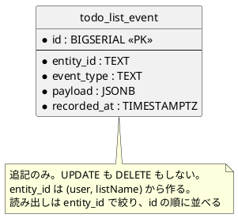

# データモデル設計 - Zettai

Zettai の永続化スキーマを定義します。第 9 章（Unit 5）で導入します。

## 方針: 状態を保存せず、出来事だけを保存する

第 5 章で、状態を上書きせず出来事として残す設計にしました。その帰結として、**データベースにも状態を保存しません**。

| 保存するもの | 保存しないもの |
| :--- | :--- |
| 出来事（`ListCreated`・`ItemAdded`・`ItemStatusChanged`） | ToDo リスト、ToDo 項目、その状態 |

現在の状態は、出来事を読み出して畳み込んで得ます（`replayFrom`）。表示用のモデルも同じく射影で得ます（`projectFrom`）。

### テーブルは 1 つだけ

普通の設計なら `todo_list` と `todo_item` のテーブルを作り、外部キーで繋ぎます。この設計ではどちらも作りません。



**関連するテーブルが無いので、外部キーもありません。** ER 図が 1 エンティティだけになるのは、イベントソーシングの帰結です。

## テーブル定義

### todo_list_event

| カラム | 型 | 制約 | 説明 |
| :--- | :--- | :--- | :--- |
| `id` | `BIGSERIAL` | PK | 追記順。**読み出しの順序を決める唯一の根拠** |
| `entity_id` | `TEXT` | NOT NULL | 出来事が属する対象。`{user}/{listName}` の形 |
| `event_type` | `TEXT` | NOT NULL | 出来事の種類（`ListCreated` など） |
| `payload` | `JSONB` | NOT NULL | 出来事の内容 |
| `recorded_at` | `TIMESTAMPTZ` | NOT NULL, DEFAULT `now()` | 記録した時刻 |

```sql
CREATE TABLE IF NOT EXISTS todo_list_event (
    id          BIGSERIAL PRIMARY KEY,
    entity_id   TEXT        NOT NULL,
    event_type  TEXT        NOT NULL,
    payload     JSONB       NOT NULL,
    recorded_at TIMESTAMPTZ NOT NULL DEFAULT now()
);

CREATE INDEX IF NOT EXISTS idx_todo_list_event_entity
    ON todo_list_event (entity_id, id);
```

### 判断したこと

**`id` を `BIGSERIAL` にしました。** 出来事の順序は追記順で決まります。`recorded_at` を順序の根拠にしません。同じ時刻に複数の出来事が記録されうるからです。

**`payload` を `JSONB` にしました。** 出来事の種類ごとにカラムを用意すると、出来事を追加するたびにスキーマ変更が必要になります。`JSONB` なら追加はアプリケーション側で済みます。第 12 章で JSON の扱いを扱うので、そこでシリアライズを整えます。

**`entity_id` を `{user}/{listName}` の複合文字列にしました。** `user` と `list_name` を別カラムにする案もありましたが、読み出しは常に両方で絞るため分ける利益がありません。将来 `user` だけで絞る必要が出たら、そのときにカラムを分けます。

**インデックスは `(entity_id, id)` の複合 1 つだけです。** 読み出しのパターンが「ある対象の出来事を追記順に全部」の 1 つしかないためです。

### 正規化を論じない理由

イベントストアは**追記のみ**で、更新も削除もしません。正規化が解決する問題（更新時の不整合、重複データの矛盾）が起きません。

正規化を考えるのは、射影を永続化するようになったときです。現在は射影をメモリ上で作り直しているので、その必要がありません。永続化した射影（リードモデル）が必要になったら、その時点で設計します。

## 制約と運用

| 事項 | 方針 |
| :--- | :--- |
| マイグレーション | 第 9 章の時点では `CREATE TABLE IF NOT EXISTS` を起動時に実行する。マイグレーションツールは入れない（テーブルが 1 つで、追記のみなので変更が起きにくい） |
| 削除 | しない。誤って作ったリストも出来事として残る。取り消しは「取り消した」という出来事を足して表す（第 9 章では未実装） |
| バックアップ | 連載の対象外 |
| 接続情報 | `docker-compose.yml` の `zettai-db` サービス（`localhost:5432`・DB `zettai`・ユーザー `zettai`）。**連載用のローカル環境のみで、本番の設定ではない** |

## 章ごとの変化

| 章 | 変化 |
| :--- | :--- |
| 9 | `todo_list_event` テーブルを作る。イベントの追記と読み出し |
| 10 | トランザクション文脈（`ContextReader`）で複数の操作をまとめる |
| 12 | `payload` の JSON を Kondor で扱う |

第 8 章までのデータはインメモリで、テーブルはありません。

## 関連ドキュメント

- [ドメインモデル設計](domain-model.md)
- [バックエンドアーキテクチャ設計](architecture_backend.md)
- [第 9 章](../article/zettai/kotlin/chapter09.md)（公開後）
