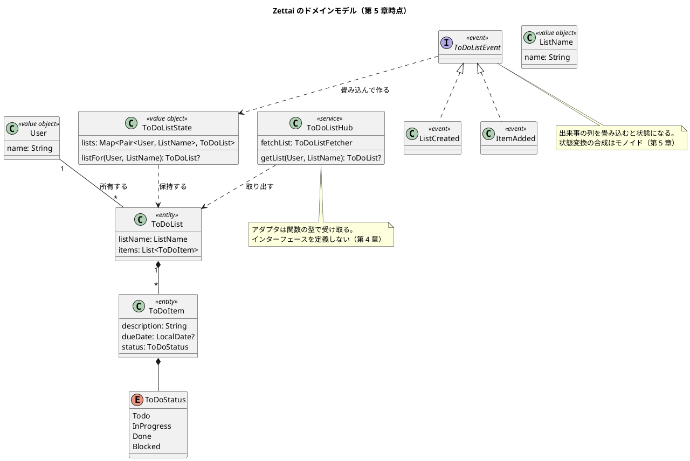
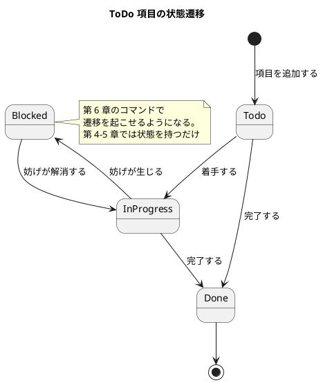
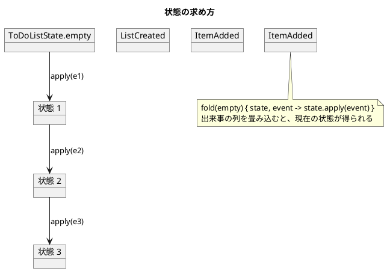

# ドメインモデル設計 - Zettai

Zettai のドメインモデルを定義します。連載の進行にあわせてモデルが成長するため、**現時点のモデルと、どの章で何が増えるか**を並べて書きます。

実装は `apps/kotlin/zettai/zettai-step2-domain/src/main/kotlin/zettai/domain/` にあります。

## ユビキタス言語

コードの語彙は原著『From Objects to Functions』に合わせて英語です。記事の本文は日本語なので、対訳を定めます。**章をまたいで改名しません。**

| 英語（コード） | 日本語（記事） | 意味 |
| :--- | :--- | :--- |
| `User` | 利用者 | ToDo リストの持ち主 |
| `ListName` | リスト名 | リストを識別する名前 |
| `ToDoList` | ToDo リスト | 名前と項目の並びを持つ |
| `ToDoItem` | ToDo 項目 | 説明・期限・状態を持つ |
| `ToDoStatus` | 状態 | 項目の進み具合 |
| `ToDoListHub` | ハブ | ドメインの入口 |
| `ToDoListEvent` | 出来事 / イベント | 起きたこと |
| `ToDoListState` | 状態（全体） | 出来事を適用した結果 |
| `StateTransition` | 状態変換 | 状態から状態への関数 |
| `ToDoListCommand` | コマンド | 利用者の意図 |
| `Outcome` | 結果 | 成功か失敗 |
| `ZettaiError` | 失敗 | 失敗の理由 |

## 要素表

### 値オブジェクト

| 名前 | フィールド | 制約 | 章 |
| :--- | :--- | :--- | :--- |
| `User` | `name: String` | — | 2 |
| `ListName` | `name: String` | — | 2 |

第 11 章でバリデーションを導入する際に、生成時の制約（空文字を許さないなど）が加わります。

### エンティティ

| 名前 | フィールド | 章 |
| :--- | :--- | :--- |
| `ToDoList` | `listName: ListName`、`items: List<ToDoItem>` | 2 |
| `ToDoItem` | `description: String`、`dueDate: LocalDate?`（既定 null）、`status: ToDoStatus`（既定 `Todo`） | 2（`description`）、4（`dueDate`・`status`） |

`dueDate` が null 許容なのは「期限が無いことが正常」だからです。**「見つからない」を表す null（`ToDoListFetcher` の戻り値）とは意味が違います。** 後者は第 7 章で `Outcome` に置き換えます。

### 列挙型

| 名前 | 値 | 用途 | 章 |
| :--- | :--- | :--- | :--- |
| `ToDoStatus` | `Todo`、`InProgress`、`Done`、`Blocked` | ToDo 項目の進み具合 | 4 |

### ドメインサービス

| 名前 | 責務 | 受け取るアダプタ | 章 |
| :--- | :--- | :--- | :--- |
| `ToDoListHub` | ドメインの入口。HTTP の層はこれしか知らない | `ToDoListFetcher`・`StateFetcher`・`EventPersister` | 4（新設）、6（アダプタ 2 つ追加）、7（戻り値が `Outcome`） |
| `handle(command, state)` | 関数型ステートマシン。コマンドと状態からイベントを決める | なし（純粋関数） | 6 |
| `canTransitionTo` | 状態遷移が許されるかを判定する | なし（純粋関数） | 6 |

アダプタはインターフェースではなく**関数の型**で受け取ります。理由は [バックエンドアーキテクチャ設計](architecture_backend.md) を参照。

### イベント

| 名前 | フィールド | 意味 | 章 |
| :--- | :--- | :--- | :--- |
| `ListCreated` | `user`、`listName` | リストが作られた | 5 |
| `ItemAdded` | `user`、`listName`、`item` | 項目が追加された | 5 |
| `ItemStatusChanged` | `user`、`listName`、`description`、`newStatus` | 項目の状態が変わった | 6 |

### コマンド

| 名前 | フィールド | 意味 | 章 |
| :--- | :--- | :--- | :--- |
| `CreateToDoList` | `user`、`listName` | リストを作れ | 6 |
| `AddToDoItem` | `user`、`listName`、`item` | 項目を追加せよ | 6 |
| `ChangeItemStatus` | `user`、`listName`、`description`、`newStatus` | 項目の状態を変えよ | 6 |

コマンドは**命令形**、イベントは**過去形**で名付けます。コマンドは拒否できますが、イベントは拒否できません。この違いが両方を持つ理由です。

### 失敗の型

| 名前 | 意味 | HTTP | 章 |
| :--- | :--- | :--- | :--- |
| `ListNotFound` | リストが見つからない | 404 | 7 |
| `ItemNotFound` | 項目が見つからない | 404 | 7 |
| `ListAlreadyExists` | 同名のリストが既にある | 400 | 7 |
| `InvalidTransition` | 許されない状態遷移 | 400 | 7 |

`ZettaiError` は `sealed` なので、失敗を 1 種類足すと扱い忘れている場所がコンパイルエラーになります。

イベントは**過去形**で名付けます。すでに起きたことなので取り消せません。

第 6 章でコマンドが加わり、コマンドからイベントが生成される形になります。

### 関数型の部品

| 名前 | 型 | 意味 | 章 |
| :--- | :--- | :--- | :--- |
| `StateTransition` | `(ToDoListState) -> ToDoListState` | 状態から状態への変換 | 5 |
| `identityTransition` | `StateTransition` | 何もしない変換（合成の単位元） | 5 |
| `andThen` | `StateTransition.(StateTransition) -> StateTransition` | 変換の合成 | 5 |
| `Outcome<E, T>` | `Success<T>` / `Failure<E>` | 成功か失敗。`map` がファンクタ | 7 |

## モデル図

## 状態遷移

**第 6 章で実装済みです。** `ChangeItemStatus` コマンドが遷移を起こし、許されない遷移は `InvalidTransition` として拒否されます。

遷移表（4×4 の 16 マス）は `zettai.domain.ToDoStatusTransition` にあり、**16 マスすべてがテストされています**。許す遷移だけを確かめると「実は何でも通る」実装でも green になるためです。

| 現在 | → Todo | → InProgress | → Done | → Blocked |
| :--- | :--- | :--- | :--- | :--- |
| Todo | — | 許す | 許す | 許さない |
| InProgress | 許さない | — | 許す | 許す |
| Done | 許さない | 許さない | — | 許さない |
| Blocked | 許さない | 許す | 許さない | — |

## イベントと状態の関係

状態は保存しません。**出来事の列から計算します。**

### 満たす法則

状態変換（`StateTransition`）の合成はモノイドです。次の 3 つをプロパティベーステストで検証しています（ランダム入力 200 回）。

| 法則 | 対象 | 内容 |
| :--- | :--- | :--- |
| 恒等則（ファンクタ） | `Outcome.map` | `map { it }` == 何もしない |
| 合成則（ファンクタ） | `Outcome.map` | `map(f).map(g)` == `map { g(f(it)) }` |
| 結合律（モノイド） | `StateTransition` | `(f andThen g) andThen h` == `f andThen (g andThen h)` |
| 単位元（モノイド） | `StateTransition` | `identityTransition andThen f` == `f` == `f andThen identityTransition` |
| 列の連結との対応 | `StateTransition` | `(a + b).asTransition()` == `a.asTransition() andThen b.asTransition()` |

3 つめが実用上重要です。**出来事をまとめて処理しても 1 つずつ処理しても、同じ状態になる**ことを保証します。第 9 章で永続化を入れるとき、バッチで読み込むか逐次で読み込むかを自由に選べます。

## 章ごとの成長

| 章 | 増えるもの |
| :--- | :--- |
| 2 | `User`・`ListName`・`ToDoList`・`ToDoItem`（説明のみ） |
| 4 | `ToDoListHub`・`ToDoStatus`・`ToDoItem` の `dueDate` と `status` |
| 5 | `ToDoListEvent`（`ListCreated`・`ItemAdded`）・`ToDoListState`・`StateTransition` |
| 6 | コマンドと関数型ステートマシン。状態遷移が実装された（**実装済み**） |
| 7 | `Outcome` と `ZettaiError`。`null` によるエラー表現を置き換えた（**実装済み**）。ポートの型が変わった（[ADR-006](../adr/ADR-006-outcome-port-type.md)） |
| 8 | 射影（クエリ側のモデル） |
| 11 | 値オブジェクトの生成時バリデーション |

## 関連ドキュメント

- [バックエンドアーキテクチャ設計](architecture_backend.md)
- [UI 設計](ui_design.md)
- [ADR-005 プロパティベーステストの方針](../adr/ADR-005-property-based-testing.md)
- [ADR-006 失敗を `Outcome` で表しポートの型を変える](../adr/ADR-006-outcome-port-type.md)
- [第 4 章](../article/zettai/kotlin/chapter04.md) / [第 5 章](../article/zettai/kotlin/chapter05.md)
