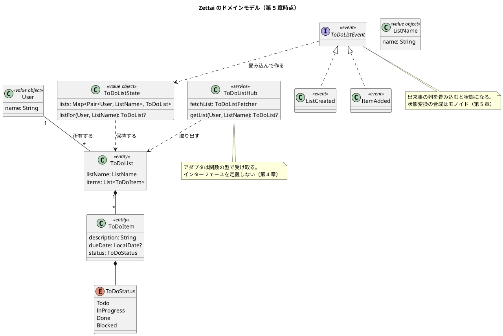
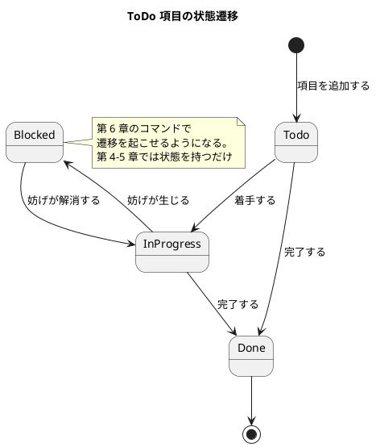
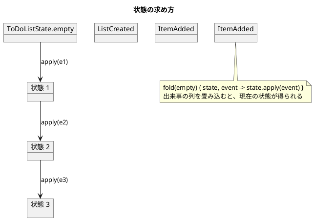

# ドメインモデル設計 - Zettai

Zettai のドメインモデルを定義します。連載の進行にあわせてモデルが成長するため、**現時点のモデルと、どの章で何が増えるか**を並べて書きます。

実装は `apps/kotlin/zettai/zettai-step2-domain/src/main/kotlin/zettai/domain/` にあります。

## ユビキタス言語

コードの語彙は原著『From Objects to Functions』に合わせて英語です。記事の本文は日本語なので、対訳を定めます。**章をまたいで改名しません。**

| 英語（コード） | 日本語（記事） | 意味 |
| :--- | :--- | :--- |
| `User` | 利用者 | ToDo リストの持ち主 |
| `ListName` | リスト名 | リストを識別する名前 |
| `ToDoList` | ToDo リスト | 名前と項目の並びを持つ |
| `ToDoItem` | ToDo 項目 | 説明・期限・状態を持つ |
| `ToDoStatus` | 状態 | 項目の進み具合 |
| `ToDoListHub` | ハブ | ドメインの入口 |
| `ToDoListEvent` | 出来事 / イベント | 起きたこと |
| `ToDoListState` | 状態（全体） | 出来事を適用した結果 |
| `StateTransition` | 状態変換 | 状態から状態への関数 |
| `ToDoListCommand` | コマンド | 利用者の意図 |
| `Outcome` | 結果 | 成功か失敗 |
| `ContextReader` | 文脈つきの計算 | 文脈を受け取ってから値を返す |
| `ToDoListProjection` | 射影 | 表示のためのモデル |
| `Validation` | 検証結果 | 成功か、失敗の一覧 |
| `TxContext` | 文脈 | 操作を実行する文脈。中身はアダプタが決める |
| `Template` | テンプレート | 画面の雛形 |
| `ZettaiError` | 失敗 | 失敗の理由 |

## 要素表

### 値オブジェクト

| 名前 | フィールド | 制約 | 章 |
| :--- | :--- | :--- | :--- |
| `User` | `name: String` | — | 2 |
| `ListName` | `name: String` | — | 2 |

第 11 章でバリデーションを導入する際に、生成時の制約（空文字を許さないなど）が加わります。

### エンティティ

| 名前 | フィールド | 章 |
| :--- | :--- | :--- |
| `ToDoList` | `listName: ListName`、`items: List<ToDoItem>` | 2 |
| `ToDoItem` | `description: String`、`dueDate: LocalDate?`（既定 null）、`status: ToDoStatus`（既定 `Todo`） | 2（`description`）、4（`dueDate`・`status`） |

`dueDate` が null 許容なのは「期限が無いことが正常」だからです。**「見つからない」を表す null（`ToDoListFetcher` の戻り値）とは意味が違います。** 後者は第 7 章で `Outcome` に置き換えます。

### 列挙型

| 名前 | 値 | 用途 | 章 |
| :--- | :--- | :--- | :--- |
| `ToDoStatus` | `Todo`、`InProgress`、`Done`、`Blocked` | ToDo 項目の進み具合 | 4 |

### 検証

| 名前 | 責務 | 章 |
| :--- | :--- | :--- |
| `validateListName` | リスト名の検証。空でないこと・40 文字以内であることを**独立に**確かめ、両方だめなら両方の理由を返す | 11 |

`Outcome`（モナド）で書くと最初の失敗で止まり、2 つめの条件を確かめられません。`Validation`（アプリカティブ）は止まらず、失敗を全部集めます。

### ドメインサービス

| 名前 | 責務 | 受け取るアダプタ | 章 |
| :--- | :--- | :--- | :--- |
| `ToDoListHub` | ドメインの入口。HTTP の層はこれしか知らない | `ToDoListFetcher`・`StateFetcher`・`EventPersister` | 4（新設）、6（アダプタ 2 つ追加）、7（戻り値が `Outcome`） |
| `handle(command, state)` | 関数型ステートマシン。コマンドと状態からイベントを決める | なし（純粋関数） | 6 |
| `canTransitionTo` | 状態遷移が許されるかを判定する | なし（純粋関数） | 6 |

アダプタはインターフェースではなく**関数の型**で受け取ります。理由は [バックエンドアーキテクチャ設計](architecture_backend.md) を参照。

### イベント

| 名前 | フィールド | 意味 | 章 |
| :--- | :--- | :--- | :--- |
| `ListCreated` | `user`、`listName` | リストが作られた | 5 |
| `ItemAdded` | `user`、`listName`、`item` | 項目が追加された | 5 |
| `ItemStatusChanged` | `user`、`listName`、`description`、`newStatus` | 項目の状態が変わった | 6 |
| `ListRenamed` | `user`、`listName`、`newName` | リスト名が変わった | 11 |

### コマンド

| 名前 | フィールド | 意味 | 章 |
| :--- | :--- | :--- | :--- |
| `CreateToDoList` | `user`、`listName` | リストを作れ | 6 |
| `AddToDoItem` | `user`、`listName`、`item` | 項目を追加せよ | 6 |
| `ChangeItemStatus` | `user`、`listName`、`description`、`newStatus` | 項目の状態を変えよ | 6 |
| `RenameToDoList` | `user`、`listName`、`newName` | リスト名を変えよ | 11 |

コマンドは**命令形**、イベントは**過去形**で名付けます。コマンドは拒否できますが、イベントは拒否できません。この違いが両方を持つ理由です。

### 失敗の型

| 名前 | 意味 | HTTP | 章 |
| :--- | :--- | :--- | :--- |
| `ListNotFound` | リストが見つからない | 404 | 7 |
| `ItemNotFound` | 項目が見つからない | 404 | 7 |
| `ListAlreadyExists` | 同名のリストが既にある | 400 | 7 |
| `InvalidTransition` | 許されない状態遷移 | 400 | 7 |
| `PersistenceError` | データベースへの接続・読み書きの失敗 | 500 | 9 |

`ZettaiError` は `sealed` なので、失敗を 1 種類足すと扱い忘れている場所がコンパイルエラーになります。

イベントは**過去形**で名付けます。すでに起きたことなので取り消せません。

第 6 章でコマンドが加わり、コマンドからイベントが生成される形になります。

### 関数型の部品

| 名前 | 型 | 意味 | 章 |
| :--- | :--- | :--- | :--- |
| `StateTransition` | `(ToDoListState) -> ToDoListState` | 状態から状態への変換 | 5 |
| `identityTransition` | `StateTransition` | 何もしない変換（合成の単位元） | 5 |
| `andThen` | `StateTransition.(StateTransition) -> StateTransition` | 変換の合成 | 5 |
| `Outcome<E, T>` | `Success<T>` / `Failure<E>` | 成功か失敗。`map` がファンクタ | 7 |
| `ToDoListProjection` | イベントの畳み込み先 | 表示用のモデル。`map` がファンクタ | 8 |
| `ContextReader<CTX, T>` | `(CTX) -> T` | 文脈つきの計算。`flatMap` があるのでモナド | 9 |
| `TxContext` | 中身が空のインターフェース | 操作を実行する文脈。ドメインは中身を知らない（[ADR-011](../adr/ADR-011-transaction-boundary.md)） | 10 |
| `Validation<T>` | `Valid<T>` / `Invalid` | 検証結果。`combine` があるのでアプリカティブ | 11 |

## モデル図

## 状態遷移

**第 6 章で実装済みです。** `ChangeItemStatus` コマンドが遷移を起こし、許されない遷移は `InvalidTransition` として拒否されます。

遷移表（4×4 の 16 マス）は `zettai.domain.ToDoStatusTransition` にあり、**16 マスすべてがテストされています**。許す遷移だけを確かめると「実は何でも通る」実装でも green になるためです。

| 現在 | → Todo | → InProgress | → Done | → Blocked |
| :--- | :--- | :--- | :--- | :--- |
| Todo | — | 許す | 許す | 許さない |
| InProgress | 許さない | — | 許す | 許す |
| Done | 許さない | 許さない | — | 許さない |
| Blocked | 許さない | 許す | 許さない | — |

## イベントと状態の関係

状態は保存しません。**出来事の列から計算します。**

### 満たす法則

状態変換（`StateTransition`）の合成はモノイドです。次の 3 つをプロパティベーステストで検証しています（ランダム入力 200 回）。

| 法則 | 対象 | 内容 |
| :--- | :--- | :--- |
| 恒等則（ファンクタ） | `Outcome.map`・`ToDoListProjection.map`・`Validation.map` | `map { it }` == 何もしない |
| 合成則（ファンクタ） | `Outcome.map` | `map(f).map(g)` == `map { g(f(it)) }` |
| 結合律（モノイド） | `StateTransition` | `(f andThen g) andThen h` == `f andThen (g andThen h)` |
| 単位元（モノイド） | `StateTransition` | `identityTransition andThen f` == `f` == `f andThen identityTransition` |
| 列の連結との対応 | `StateTransition` | `(a + b).asTransition()` == `a.asTransition() andThen b.asTransition()` |

3 つめが実用上重要です。**出来事をまとめて処理しても 1 つずつ処理しても、同じ状態になる**ことを保証します。第 9 章で永続化を入れるとき、バッチで読み込むか逐次で読み込むかを自由に選べます。

## 章ごとの成長

| 章 | 増えるもの |
| :--- | :--- |
| 2 | `User`・`ListName`・`ToDoList`・`ToDoItem`（説明のみ） |
| 4 | `ToDoListHub`・`ToDoStatus`・`ToDoItem` の `dueDate` と `status` |
| 5 | `ToDoListEvent`（`ListCreated`・`ItemAdded`）・`ToDoListState`・`StateTransition` |
| 6 | コマンドと関数型ステートマシン。状態遷移が実装された（**実装済み**） |
| 7 | `Outcome` と `ZettaiError`。`null` によるエラー表現を置き換えた（**実装済み**）。ポートの型が変わった（[ADR-006](../adr/ADR-006-outcome-port-type.md)） |
| 8 | 射影（クエリ側のモデル）。ハブをコマンド側とクエリ側に分けた（**実装済み**） |
| 9 | `ContextReader`（モナド）と PostgreSQL への永続化。`PersistenceError`（**実装済み**） |
| 10 | `TxContext`（トランザクションの文脈）。ポート 3 つが `HubAction` を返す形に（**実装済み**） |
| 11 | `Validation`（アプリカティブ）と `Template`。`validateListName` による生成時バリデーション（**実装済み**） |
| 12 | 構造化ロギングと関数型 JSON（プロファンクタ） |
| 13 | 総括（実装追加は最小） |

## なでしこ3 版での差分

ドメインモデルそのものは対象言語をまたいで共通です。ユビキタス言語も同じです。変わるのは**契約の表し方**だけなので、差分だけをここに書きます。

### 型ではなく辞書のキーが契約

なでしこ3 には型システムもクラス構文もありません。ドメインの概念は**辞書**で表し、**キーの有無と値の型を契約テストが守ります**（[ADR-014](../adr/ADR-014-own-test-framework.md)）。

Kotlin 版の型定義に相当するのが、次の表です。**辞書を返す関数それぞれに契約テストが 1 本あります。**

| 概念 | Kotlin 版の型 | なでしこ3 版の辞書のキー | 作る関数 | 章 |
| :--- | :--- | :--- | :--- | :--- |
| ToDo 項目 | `ToDoItem(description, dueDate, status)` | `説明`（文字列）・`期限`（文字列）・`状態`（文字列） | `ToDo項目作成` / `ToDo項目詳細作成` | 2・4 |
| ToDo リスト | `ToDoList(listName, items)` | `リスト名`（文字列）・`項目`（配列） | `ToDoリスト作成` | 2 |
| ハブ | `ToDoListHub` | `リスト取得`（関数値） | `ハブ作成` | 4 |
| イベント（作成） | `ListCreated(user, listName)` | `種別`=`"ListCreated"`・`利用者`・`リスト名` | `リスト作成イベント` | 5 |
| イベント（追加） | `ItemAdded(user, listName, item)` | `種別`=`"ItemAdded"`・`利用者`・`リスト名`・`項目` | `項目追加イベント` | 5 |
| 全体の状態 | `ToDoListState` | `リスト表`（辞書。鍵は `利用者/リスト名`） | `空状態` / `畳込` | 5 |
| 状態変換 | `StateTransition = (ToDoListState) -> ToDoListState` | 関数値 | `状態変換作成` / `恒等変換` / `変換合成` | 5 |
| コマンド（作成） | `CreateToDoList(user, listName)` | `種別`=`"CreateToDoList"`・`利用者`・`リスト名` | `リスト作成コマンド` | 6 |
| コマンド（追加） | `AddToDoItem(user, listName, item)` | `種別`=`"AddToDoItem"`・`利用者`・`リスト名`・`項目` | `項目追加コマンド` | 6 |
| コマンド（状態変更） | `ChangeItemStatus(user, listName, description, newStatus)` | `種別`=`"ChangeItemStatus"`・`利用者`・`リスト名`・`説明`・`新状態` | `状態変更コマンド` | 6 |
| イベント（状態変更） | `ItemStatusChanged` | `種別`=`"ItemStatusChanged"`・`利用者`・`リスト名`・`説明`・`新状態` | `項目状態変更イベント` | 6 |
| 結果 | `Outcome<E, T>` | `成功`（真偽）・`値` または `理由` | `成功` / `失敗` / `結果マップ` | 7 |
| 失敗の理由 | `ZettaiError`（`sealed`） | 文字列 **6 種類**（第 9 章で `PersistenceError`、第 11 章で `TemplateNotFilled` を追加）。`失敗理由一覧` に集める | — | 7・9・11 |
| 射影 | `ToDoListProjection` | `表`（辞書。鍵は `利用者/リスト名`、値は `リスト名`・`説明列`） | `空射影` / `射影畳込` / `射影マップ` | 8 |
| 永続化 | `EventPersister`（ポート） | **関数値で注入しない。** `store.nako3` の `保管追記` / `保管読出` を呼び出しの順序で使う | `保管追記` / `保管読出` / `保管消去` | 9 |
| モナド | `ContextReader`（Kotlin 版） | **`結果連鎖`**（結果をつなぐ操作）。文脈を持ち回らないため題材が違う | `結果連鎖` | 9 |
| 文脈 | `TxContext`（不透明な型） | `保管先`（文字列）。**接続ではなく「どこを読み書きするか」**（[ADR-021](../adr/ADR-021-context-as-path.md)） | `文脈作成` / `文脈内読出` / `文脈内追記` | 10 |
| 境界 | `ContextReader` の実行 | 読む → 判断 → 書くを 1 つの関数に閉じ込める | `文脈内コマンド実行` / `射影問合` | 10 |
| コマンド（名前変更） | `RenameToDoList(user, listName, newName)` | `種別`=`"RenameToDoList"`・`利用者`・`リスト名`・`新リスト名` | `リスト名変更コマンド` | 11 |
| イベント（名前変更） | `ListRenamed` | `種別`=`"ListRenamed"`・`利用者`・`リスト名`・`新リスト名` | `リスト名変更イベント` | 11 |
| 検証結果 | `Validated<E, T>` | `成功`（真偽）・`値` または **`理由列`（配列）**。失敗を並びで持つ | `検証結果成功` / `検証結果失敗` / `検証結果マップ` / `検証結果結合` | 11 |
| テンプレート | `HtmlPage` のテンプレート | 雛形は `『』` の文字列、埋め込みは `{{名前}}`。**未適用のタグが残れば失敗**（[ADR-022](../adr/ADR-022-template-with-unfilled-check.md)） | `テンプレート適用` / `HTML安全化` | 11 |
| 記録 | 構造化ログ | `時刻`・`水準`（3 種）・`事象` + 付帯情報。1 行 1 レコードの JSON | `記録作成` / `記録整形` / `記録出力` | 12 |
| 双方向変換 | `Converter`（プロファンクタ） | `書出`（値 → 文字列）と `読込`（文字列 → 結果）を **1 つの辞書**に入れる。組み込みの JSON の上に置く（[ADR-023](../adr/ADR-023-builtin-json-with-converter.md)） | `変換作成` / `変換出力写像` / `変換入力写像` | 12 |

**直和型を表す手段がありません。** イベントの種類は `種別` キーの文字列で区別します。Kotlin 版の `sealed interface ToDoListEvent` が持つ「これで全部」という保証はありません。

### 列挙型が無い

`ToDoStatus` の 4 値（`Todo`・`InProgress`・`Done`・`Blocked`）は文字列です。取りうる値を `状態一覧` という関数 1 つに集め、**契約テストが 4 値の網羅を守ります**。

第 6 章の状態遷移では、Kotlin 版は `when` の網羅がコンパイラに守られます。なでしこ3 版は**遷移表の 16 マスすべてをテストする**ことで代えます（Kotlin 版も 16 マス全件をテストしているので、結果として同じ検査になります）。

`ZettaiError` の 4 種類も同じ形です。`sealed` の代わりに `失敗理由一覧` に集め、契約テストが網羅を守ります。理由と HTTP のステータスコードの対応表は `outcome.nako3` に置き、**ドメインは HTTP を知らないまま**、HTTP の層が対応表だけを見ます（[ADR-018](../adr/ADR-018-outcome-dict-port.md)）。

### 満たす法則の確かめ方

状態変換の合成がモノイドであることは、両版とも性質テストで確かめます。手段が違います。

| 観点 | Kotlin 版 | なでしこ3 版 |
| :--- | :--- | :--- |
| 枠組み | 自前のプロパティベーステスト（[ADR-005](../adr/ADR-005-property-based-testing.md)） | 自作。`乱整数` と `比較用文字列` を `test/helper.nako3` に置く |
| 状態の比較 | `equals` | **JSON にして文字列で比べる。** 辞書どうしを比べる手段が無い |
| 試行回数 | 200 回 | 200 回（`make check` が 30 秒に収まる範囲で決めた） |
| 検査の妥当性 | — | **法則を破る実装を入れて落ちることを確かめている**（[ADR-017](../adr/ADR-017-own-property-testing.md)） |

検出率は法則によって大きく違います。**壊し方によっては、ある法則がまったく検出しないこともあります。**

| 構造 | 壊し方 | 検出（200 回中） |
| :--- | :--- | :--- |
| モノイド（第 5 章） | 非結合的な合成 | 結合律 13 / 単位元 8 |
| モノイド（第 5 章） | 恒等変換が状態を変える | 結合律 0 / 単位元 100 |
| ファンクタ・結果（第 7 章） | 失敗も `map` する | 恒等則 104 / **合成則 0** |
| ファンクタ・射影（第 8 章） | `F` を 2 回適用する | **恒等則 0** / 合成則 78 |
| モナド（第 9 章） | 失敗も連鎖する | 左単位元 0 / **右単位元 58** / 結合律 0 |
| モナド（第 9 章） | 値を 1 足す | 左単位元 200 / 右単位元 135 / 結合律 138 |
| アプリカティブ（第 11 章） | 右側を見ず左だけで決める | 115 |
| プロファンクタ（第 12 章） | 出力側と入力側を取り違える | **200** |
| プロファンクタ（第 12 章） | 出力側の合成順を入れ替える | **0** |

**法則が複数あるのは飾りではありません。** モナドの「失敗も連鎖する」は、3 つのうち右単位元でしか見つかりません。

アプリカティブの 115 / 200 も全部ではありません。**左が失敗していれば、右を見なくても結果は同じ**になる入力があるためです。

プロファンクタの 200 / 200 は、法則が強いからではありません。取り違えると**文字列用の関数を結果辞書に当てる**ことになり、必ず食い違うためです。同じプロファンクタでも、可換な 2 つの写像の順序を入れ替える壊し方は **1 回も検出しません**。

### なでしこ3 版でモナドの題材が違う理由

Kotlin 版は第 9 章のモナドを `ContextReader`（文脈つきの計算）にしています。データベースの接続という文脈を持ち回るためです。

**なでしこ3 版には持ち回る文脈がありません。** ファイルに追記するだけで、接続もトランザクションもありません。そこで**題材を `結果連鎖`（失敗しうる処理をつなぐ操作）にしました。** `ContextReader` 相当は第 10 章で扱いました（[ADR-011](../adr/ADR-011-transaction-boundary.md) の移植判断は [ADR-021](../adr/ADR-021-context-as-path.md)）。

### 失敗が 1 つか、並びか（第 11 章）

第 7 章の結果は失敗の理由を**1 つ**しか持ちません。連鎖（モナド）は最初の失敗で止まるので、それで足りていました。

画面の入力を確かめるときは、だめな箇所を**全部**返したい。そこで理由を並びで持つ別の形（`検証結果`）を用意しました。2 つの形が混ざらないよう、契約テストが両方の形を守ります。

| 観点 | 結果（第 7 章） | 検証結果（第 11 章） |
| :--- | :--- | :--- |
| 失敗のキー | `理由`（文字列 1 つ） | `理由列`（配列） |
| つなぐ操作 | `結果連鎖`（モナド） | `検証結果結合`（アプリカティブ） |
| 次の処理 | 前の値に依存できる | 依存できない |
| 失敗したとき | そこで止まる | 最後まで走る |
| 向くもの | 読む → 判断 → 書く（第 10 章） | 画面の入力の検証（第 11 章） |

**成功側のキー（`成功`・`値`）は揃えました。** 第 7 章の `成功判定` がそのまま使えます。境界で片方に落とすときは `検証結果変換` を使い、理由が 1 つに減ることを承知で使います。

計測した違いは次のとおりです。両方だめな入力を乱数で作ったところ、**連鎖は 69 回中 69 回（100%）で理由を 1 件しか返しませんでした。** 欠陥ではなく、連鎖が「前の値に依存できる」ことの代償です。

### 記録はドメインの外（第 12 章）

ドメインは「何が起きたか」を返すだけで、それを誰がどこに書くかを知りません。境界検査がドメイン 7 ファイル × 5 項目で守ります。

記録の置き場所は 2 度動きました。

| 置いた場所 | 結果 |
| :--- | :--- |
| `store.nako3`（保管の読み書きの中） | **受け入れテストが落ちた。** 読み出しを関数値ごしに呼ぶ経路があり、中に書き出し（非同期）が入った瞬間に Promise が返る（既知の制約 1 の 5 度目） |
| `tx.nako3`（アダプタ層。呼び出しの順序） | 通った。**記録するかどうかは呼び出し側が決める** |

**関数値ごしに呼べるかどうかは「中で何を呼ぶか」で決まります。** 既存の関数に書き出しを足すと、それまで注入できていた経路が壊れます。

記録先は**文脈が持ちます**（[ADR-021](../adr/ADR-021-context-as-path.md) の「どこを読み書きするか」に、記録の行き先も同じ資格で入る）。テストが自分の記録先を持てるので、並列に走らせても件数が混ざりません。

### 不変性

Kotlin 版の `data class` は不変です。なでしこ3 の辞書と配列は**参照で、破壊的に書き換えられます**。状態変換は変換のたびに辞書と配列を写してから足します（`辞書写し`・`配列複製`）。**不変性は言語ではなく約束が守ります。**

---

## 関連ドキュメント

- [バックエンドアーキテクチャ設計](architecture_backend.md)
- [UI 設計](ui_design.md)
- [ADR-005 プロパティベーステストの方針](../adr/ADR-005-property-based-testing.md)
- [ADR-006 失敗を `Outcome` で表しポートの型を変える](../adr/ADR-006-outcome-port-type.md)
- [ADR-008 イベントストアを 1 テーブルで持ち状態を保存しない](../adr/ADR-008-event-store-single-table.md)
- [データモデル設計](data-model.md)
- [第 4 章](../article/zettai/kotlin/chapter04.md) / [第 5 章](../article/zettai/kotlin/chapter05.md)
