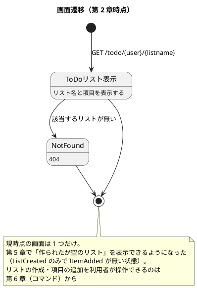

# UI 設計 - Zettai

Zettai の画面を定義します。連載の進行にあわせて画面が増えるため、**現時点の画面と、どの章で何が増えるか**を並べて書きます。

## 画面一覧

| 画面 | URL | 内容 | 章 |
| :--- | :--- | :--- | :--- |
| ToDo リスト表示 | `GET /todo/{user}/{listname}` | 指定した利用者の ToDo リストの項目を一覧表示する。**作成直後の空のリストも表示できる**（第 5 章） | 2・5 |

章の進行で増える予定の画面は次のとおりです。

| 画面 | URL（予定） | 章 |
| :--- | :--- | :--- |
| ToDo リスト一覧 | `GET /todo/{user}` | 5 |
| 新しいリストの作成 | `POST /todo/{user}` | 6 |
| 項目の追加 | `POST /todo/{user}/{listname}` | 6 |

## URL 規約

- リソースの階層をそのままパスにする（`/todo/{user}/{listname}`）
- 利用者はパスに含める。認証は本連載の対象外
- 一覧は複数形にせず、`/todo` で統一する

## ワイヤーフレーム

### ToDo リスト表示

```plantuml
@startsalt
{+
  Zettai
  ==
  book
  {#
    write chapter
    insert code
    publish book
  }
}
@endsalt
```

作られたばかりのリストは、項目が 0 件で表示されます（第 5 章）。

```plantuml
@startsalt
{+
  Zettai
  ==
  shopping
  {#
  }
}
@endsalt
```

現時点では、リスト名と項目の説明だけを表示します。

第 4 章で項目に期限と状態が加わるため、表の列が増えます。第 11 章でテンプレートエンジンを導入し、HTML の組み立て方が変わります。**見た目の作り込みは連載の主題ではない**ため、必要になるまで最小限にとどめます。

## 画面遷移

## HTML の組み立て方針

現時点では Kotlin の文字列テンプレートで組み立てています（`zettai.web.renderHtml`）。テンプレートエンジンは使っていません。

| 段階 | 方式 | 章 |
| :--- | :--- | :--- |
| 現在 | 文字列テンプレート | 2 |
| 今後 | テンプレートエンジン | 11 |

第 2 章の時点では「HTML を返せること」が本質で、その作り方は本質ではないためです。第 11 章でバリデーションのエラー表示が必要になった時点で置き換えます。

## ナビゲーション

現時点では画面が 1 つしかないため、ナビゲーションはありません。第 5 章で ToDo リストの一覧画面が加わった時点で定義します。

## 関連ドキュメント

- [バックエンドアーキテクチャ設計](architecture_backend.md)
- [ドメインモデル設計](domain-model.md)
- [第 2 章 関数を使って HTTP を扱う](../article/zettai/kotlin/chapter02.md)
