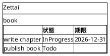
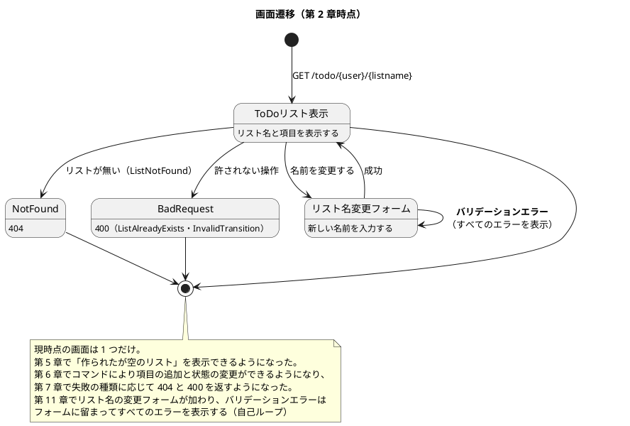

# UI 設計 - Zettai

Zettai の画面を定義します。連載の進行にあわせて画面が増えるため、**現時点の画面と、どの章で何が増えるか**を並べて書きます。

## 画面一覧

| 画面 | URL | 内容 | 章 |
| :--- | :--- | :--- | :--- |
| ToDo リスト表示 | `GET /todo/{user}/{listname}` | 指定した利用者の ToDo リストの項目を一覧表示する。**作成直後の空のリストも表示できる**（第 5 章） | 2・5 |

章の進行で増える予定の画面は次のとおりです。

| 画面 | URL（予定） | 章 |
| :--- | :--- | :--- |
| ToDo リスト一覧 | `GET /todo/{user}` | 未定 |
| 新しいリストの作成 | `POST /todo/{user}` | 未定 |
| 項目の追加 | `POST /todo/{user}/{listname}` | 未定 |
| **リスト名の変更フォーム** | `GET` / `POST /todo/{user}/{listname}/rename` | **11** |

第 6 章でコマンドを導入しましたが、**画面から操作できるようにはしていません**。受け入れテストがハブを直接呼んでいます。第 11 章でリスト名の変更フォームを作り、**画面からコマンドを送る経路を初めて通します**。

## URL 規約

- リソースの階層をそのままパスにする（`/todo/{user}/{listname}`）
- 利用者はパスに含める。認証は本連載の対象外
- 一覧は複数形にせず、`/todo` で統一する

## ワイヤーフレーム

### ToDo リスト表示

```plantuml
@startsalt
{+
  Zettai
  ==
  book
  {#
    write chapter
    insert code
    publish book
  }
}
@endsalt
```



作られたばかりのリストは、項目が 0 件で表示されます（第 5 章）。

```plantuml
@startsalt
{+
  Zettai
  ==
  shopping
  {#
  }
}
@endsalt
```



リスト名と、項目の説明・状態・期限を表示します（状態と期限は第 6 章で追加）。



第 11 章でテンプレートエンジンを導入し、HTML の組み立て方が変わります。**見た目の作り込みは連載の主題ではない**ため、必要になるまで最小限にとどめます。

## 画面遷移



## HTML の組み立て方針

現時点では Kotlin の文字列テンプレートで組み立てています（`zettai.web.renderHtml`）。テンプレートエンジンは使っていません。

| 段階 | 方式 | 章 |
| :--- | :--- | :--- |
| 第 2〜10 章 | Kotlin の文字列テンプレート | 2 |
| 第 11 章以降 | **自前の小さなテンプレート機構** | 11 |

第 2 章の時点では「HTML を返せること」が本質で、その作り方は本質ではないためです。

第 11 章で置き換えますが、**既製のテンプレートエンジン（Handlebars・Pebble・Thymeleaf）は使いません。** 自前で小さな機構を書きます。狙いは「テンプレートの書き方」ではなく、**タグの適用を型で安全にすること**です。

| 要素 | 役割 |
| :--- | :--- |
| `Template` | テンプレート本体（文字列） |
| `TemplateTag`（`StringTag`・`ListTag`・`BooleanTag`） | 差し込む値の種類 |
| `renderTemplate(data): Outcome<TemplateError, String>` | 適用結果。**未適用のタグが残っていたら失敗** |

最後の性質が肝です。テンプレートにタグを書いたのにデータを渡し忘れると、既製のエンジンでは空文字になったり、そのまま出力されたりします。**失敗として扱えば、画面が壊れる前に気づけます。**

判断は ADR-010 に記録しています。

## ナビゲーション

現時点では画面が 1 つしかないため、ナビゲーションはありません。第 5 章で ToDo リストの一覧画面が加わった時点で定義します。

## なでしこ3 版での差分

画面・URL・遷移は対象言語をまたいで共通です。変わるのは組み立て方だけです。

### HTML の組み立て

Kotlin 版は Kotlin の文字列テンプレートで組み立てます。なでしこ3 も同じ考え方で、文字列の `{}` 展開と `&` 連結を使います。テンプレートエンジンは使いません。

```text
「<html><body><h1>{ToDoリスト["リスト名"]}</h1><ul>{項目行}</ul></body></html>」
```

段階も同じです。第 2〜10 章は文字列の組み立て、第 11 章から自前の小さなテンプレート機構（[ADR-022](../adr/ADR-022-template-with-unfilled-check.md)）。

第 11 章の雛形には 2 点の差分があります。

- **雛形は `『』` で書きます。** `「」` は中の `{...}` を式として展開するので、`{{名前}}` を書くと字句解析エラーになります
- **埋めそこねを実行時に止めます。** 型が無いので渡し忘れをコンパイラが教えません。置換後に `{{` が残っていれば `TemplateNotFilled` で失敗を返し、画面は 500 になります

値は骨組みに入る前に無害化します（`&`・`<`・`>`・`"`）。ただし項目の並び（`<li>`）は骨組みなので無害化を通しません。

### URL とルーティング

URL 規約（`/todo/{user}/{listname}`、利用者はパスに含める、一覧は複数形にしない）は共通です。

ただし**ルーティングの仕組みが違います。** 簡易 HTTP サーバのプラグインは URL の**前方一致**でしか振り分けられません。`/todo` に登録すると `/todo/uberto/book` も届くので、**パスの分解は自前で書きます**。パスパラメータを取り出す仕組みはありません。

生のパスは `GETデータ["?URL"]`、クエリの値は `GETデータ["x"]`、フォームの値は `POSTデータ["name"]` で取れます。

### 名前を変える画面（第 11 章）

画面から書く経路が初めて入ります。

| メソッド | URL | 役割 | 応答 |
| :--- | :--- | :--- | :--- |
| `GET` | `/todo/{user}/{listname}/rename` | フォームを出す | 200 |
| `POST` | `/todo/{user}/{listname}/rename` | 名前を変える | 成功なら 302、検証に落ちたら 400、業務のルールで断ったら理由に応じたコード |

遷移は次のとおりです。リストの画面に「名前を変える」導線が付きます。

```text
/todo/uberto/book  --「名前を変える」-->  /todo/uberto/book/rename
/todo/uberto/book/rename  --POST 成功-->  302  -->  /todo/uberto/reading
/todo/uberto/book/rename  --POST 失敗-->  400（同じ画面に理由を並べて再表示）
```

**成功したら新しい名前の画面へ送ります（PRG）。** 再読み込みで同じ POST が飛ばないようにするためです。

**検証に落ちたときは理由を全部並べます。** 利用者名とリスト名を独立に確かめ、両方だめなら 2 件とも表示します（第 11 章のアプリカティブ）。1 件ずつ返すと利用者が 2 往復することになります。

ルーティングには注意点があります。前方一致でしか振り分けられないため、**`/rename` で終わるパスかどうかを自前で判定**しないと、`/todo/{user}/{listname}` への POST まで名前変更として処理してしまいます（Unit 6 で実際に踏みました）。

### 失敗の理由とステータスコード

第 7 章から、失敗の理由がそのまま画面に出ます。

| 理由 | ステータス | 本文 |
| :--- | :--- | :--- |
| `ListNotFound` / `ItemNotFound` | 404 | `<h1>404</h1><p>ListNotFound</p>` |
| `ListAlreadyExists` / `InvalidTransition` | 400 | 同じ形 |
| `TemplateNotFilled` | 500 | 同じ形（第 11 章。`{{...}}` を利用者に見せない） |
| 検証の理由（`EmptyUser` / `EmptyName` / `NameTooLong`） | 400 | 入力画面を理由の一覧つきで再表示（第 11 章） |

対応表は `src/stepN/outcome.nako3` にあり、**ドメインは HTTP を知りません**。HTTP の層が対応表だけを見ます。

### ステータスコード

404 の返し方が違います。

```text
    応答["状態"]で{"Content-Type":"text/html; charset=utf-8"}を簡易HTTPサーバヘッダ出力
```

助詞は **で** と **を** です。

### 空のリスト

第 5 章で空のリストを表示できるようにします。なでしこ3 では、**空の配列を回すループが逆向きに回る**という罠があるため（`繰り返す` は開始が終了より大きくても空回りしない）、項目が 0 件のときの分岐を明示的に書きます。

---

## Rust 版での差分

画面の構成も URL 規約も共通です。変わるのは **HTML の組み立て方**と、**フォームの値の受け取り方**です。

### HTML の組み立て

| 段階 | 方式 | 章 |
| :--- | :--- | :--- |
| 第 2〜10 章 | `format!` の直書き | 2 |
| 第 11 章以降 | **`tera`（既製品）** | 11 |

**3 対象で初めて既製品に寄せました**（[ADR-036](../adr/ADR-036-tera.md)）。

Kotlin 版・なでしこ3 版は自作しています。理由は「既製品は未適用のタグを空文字か例外にするだけで、失敗として扱えない」でした（[ADR-010](../adr/ADR-010-own-template.md)）。**Rust では成り立ちません。**

```text
tera: Err(Error { kind: RenderingError(... message: "Variable `forgotten` is not defined." ...) })
```

`tera` は既定で `Result` を返し、足りない変数の名前まで挙げます。

**ただし自動エスケープは既定では効きません。** テンプレート名の拡張子で決まるので、`"list.html"` のように名づけます。**「既製品を入れたから安全」ではありません。**

第 10 章までの `format!` 直書きには**エスケープがありませんでした**。第 11 章で入りました。

### フォームの値

**パーセントエンコードされて届きます。**

```text
body="user=&newname=%E8%AA%AD%E3%82%80+%E6%9C%AC%26%22%3Cx%3E%22"
```

空白は `+`、それ以外は `%XX` です。`tiny_http` は戻しません（[ADR-025](../adr/ADR-025-tiny-http.md)）。

**第 4 章の `description_in` は `+` しか戻していませんでした。** ASCII だけの説明を使っていたので、受け入れテストは通り続けていました。第 11 章で直しています。

値の中の `&` と `=` は `%26` / `%3D` で届くので、**分割してから戻す**順序で正しくなります。

### 経路の振り分け

`tiny_http` にルーティングはありません。パスを `/` で割って組で照合します。

```rust
if let ["todo", user, list_name, "rename"] = parts.as_slice() {
```

**`/rename` で終わるかどうかを先に見ます。** なでしこ3 版は前方一致だけで振り分け、`/rename` 以外への POST まで名前変更として処理していました。**受け入れシナリオに入れて防いでいます。**

### エラーの表示

複数の理由をまとめて出します（[ADR-035](../adr/ADR-035-validated-applicative.md)）。理由を画面の言葉に写す `describe` は `match` なので、**理由を足すとコンパイルが止まります**。第 6 章から 5 回止まりました。

| 状況 | 状態コード | 画面 |
| :--- | :--- | :--- |
| 変更できた | **302** | 新しい名前の画面へ |
| 検証に落ちた | **400** | 同じフォームに**理由をすべて**並べて再表示 |
| リストが無い | 404 | — |

**`curl -L` は 302 のあとに POST を再送します**（なでしこ3 版で踏みました）。テストでは使いません。

## 関連ドキュメント

- [バックエンドアーキテクチャ設計](architecture_backend.md)
- [ドメインモデル設計](domain-model.md)
- [第 2 章 関数を使って HTTP を扱う](../article/zettai/kotlin/chapter02.md)
