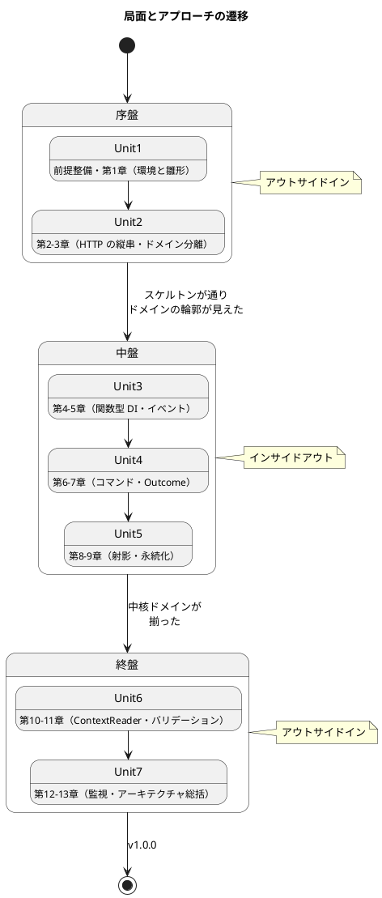
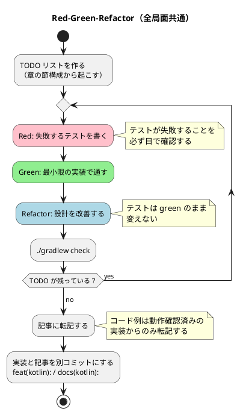
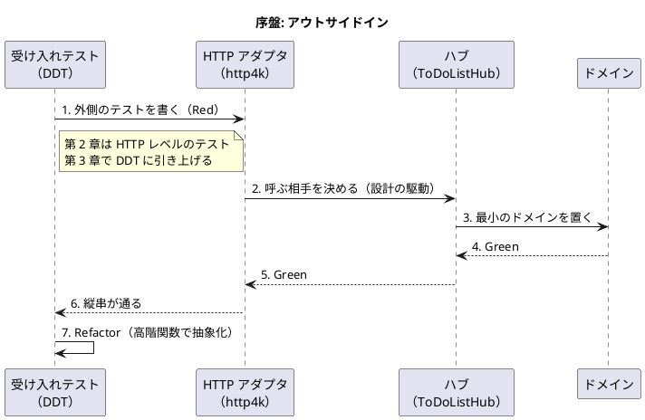
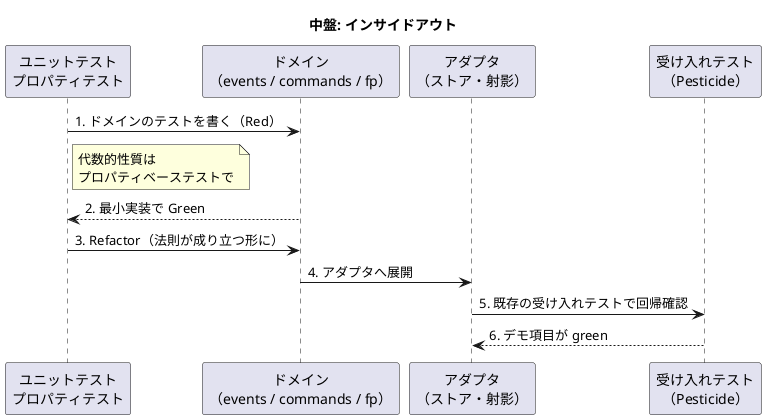
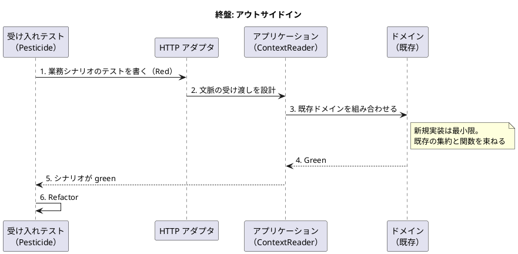

# 開発戦略 - Zettai 連載（Kotlin 版 / なでしこ3 版）

## 概要

本ドキュメントは、リリース計画で定義した 7 つの Unit を **序盤・中盤・終盤** の 3 局面に分け、各局面で採用する TDD アプローチと横断的な進め方を定義します。個々の Bolt 計画（`iteration_plan-N.md`）の上位に位置し、「どの Unit でどちらのアプローチを採るか」「Unit の完了をどう受け入れ判定するか」「承認ゲートをどの密度で置くか」という戦略レイヤーを担います。

本プロジェクトは AI-DLC で開発するため、本戦略は [リリース・イテレーション計画ガイド（AI-DLC 版）](../reference/リリース・イテレーション計画ガイド_AI-DLC版.md) の読み替え表に従い、**最初の Bolt をウォーキングスケルトンとし、以降のゲート密度をここで決める** 役割も担います。

参照元と Single Source of Truth は次のとおりです。

| 内容 | 正となる参照元 |
| :--- | :--- |
| Intent・Unit 分解・依存 DAG・エントロピー評価 | [リリース計画（Kotlin 版）](release_plan.md) / [同（なでしこ3 版）](release_plan-nadesiko.md)（Level 1 計画） |
| 各 Unit の満足条件・Bolt のステップ計画・承認ゲート | `iteration_plan-N.md`（現在は [Unit 1 の Bolt 計画](iteration_plan-1.md) のみ確定） |
| AI-DLC の原則・承認ゲート・エントロピー評価 | [リリース・イテレーション計画ガイド（AI-DLC 版）](../reference/リリース・イテレーション計画ガイド_AI-DLC版.md)、[AI-DLC 導入ガイド](../reference/AI-DLC導入ガイド.md) |
| 章構成・執筆規約・原著コンパニオンコードとの対応 | [執筆計画](../article/outline.md)、[章構成マインドマップ](../article/draft.md) |
| TDD の三原則・Red-Green-Refactor・アプローチ選択フロー・品質基準・コミット規約 | [コーディングとテストガイド](../reference/コーディングとテストガイド.md)、[同 AI-DLC 版](../reference/コーディングとテストガイド_AI-DLC版.md) |
| テスト種別・テストピラミッド | [テスト戦略ガイド](../reference/テスト戦略ガイド.md) |
| 受け入れテストを Gherkin で書く場合の記法・処理系 | [BDD 導入ガイド](../reference/BDD導入ガイド.md)（本プロジェクトでは不採用。理由は後述） |

本戦略は Bolt 計画を前提とします。現時点で確定しているのは Unit 1（完了）と Unit 2 です。Unit 3 以降の局面割り当ては**暫定案**であり、各 Bolt 計画が確定した時点で、対象ストーリーとデモ項目を本ドキュメントに追従させます。

**本ドキュメントは 2 つの対象を扱います。** 「## 戦略の全体像」から「## 局面移行時の一貫性維持」までは **Kotlin 版**（完結済み）の戦略です。シリーズ 2 言語目の **なでしこ3 版** の戦略は「[なでしこ3 版の局面別アプローチ](#なでしこ3-版の局面別アプローチ)」の節にまとめ、Kotlin 版との差分だけを書きます。差分に書いていない事項は Kotlin 版の記述をそのまま適用します。

### この連載固有の事情

通常の開発では「動くソフトウェア」が成果物ですが、本プロジェクトの成果物は **記事とサンプル実装の対** です。そのため戦略に次の制約が加わります。

- **設計の到達順序が章順で固定されている。** 原著の章立てが「HTTP → ドメイン分離 → イベント → コマンド → `Outcome` → 射影 → 永続化 → …」と進むため、通常なら先に固めたいデータ層が第 9 章まで現れません。局面の割り当ては、この固定された順序に従うほかありません
- **リファクタリングそれ自体が題材である。** 各章は前章の設計を意図的に作り替えます。「作り直しは失敗」ではなく、作り直しの過程を記事で見せることが価値です
- **記事に載せないコードを書いてはいけない。** 先回りして実装すると、記事で説明できないコードが残ります。TDD の「先回りして実装しない」規律が、執筆規約としても効きます

---

## 戦略の全体像

| 局面 | Unit | 章 | 主アプローチ | ゲート密度 | 狙い |
| :--- | :--- | :--- | :--- | :--- | :--- |
| 序盤 | Unit 1〜2 | 前提整備・1〜3 | アウトサイドイン | 密 | 縦切りでウォーキングスケルトンを通し、実行環境とアーキテクチャ基盤の妥当性、そして AI の出力品質を早期に検証する |
| 中盤 | Unit 3〜5 | 4〜9 | インサイドアウト | Unit 3-4 は実績次第で疎。Unit 5 は密 | イベント・コマンド・`Outcome`・射影・永続化という中核ドメインを内側から堅牢に作り込み、貧血ドメインモデルを避ける |
| 終盤 | Unit 6〜7 | 10〜13 | アウトサイドイン | 疎 | 出来上がったドメインを業務シナリオ起点で結合し、シリーズ全体の設計の一貫性を担保する |



### アプローチ選択の根拠

[コーディングとテストガイド](../reference/コーディングとテストガイド.md) の実装アプローチ選択フローに対応づけて説明します。局面が機械的な区切りではなく、その時点の実装状況から導かれる選択であることを示します。

- **序盤（アウトサイドイン）**: 基本 CRUD も API も未実装です。選択フローの「API 未実装 → アウトサイドイン活用」に当たり、外側（HTTP のリクエスト／受け入れテスト）のニーズから内側の設計を導出するのが安全です。加えて第 2 章の主題そのものが「関数合成で HTTP を扱い、動く最小の縦串を通す」ことなので、アプローチと章の主題が一致します
- **中盤（インサイドアウト）**: 基本実装は済んでいますが、ここから扱うイベントの畳み込み・モノイド・関数型ステートマシン・`Outcome`・射影・モナドは、いずれも**ドメイン層の中で完結する設計**です。選択フローの「基盤未確立 → インサイドアウト推奨」に当たり、外側から入ると「HTTP ハンドラに業務ロジックが漏れた貧血ドメインモデル」になります。第 4 章で関数型の依存性注入（`ToDoListHub`、`Fetcher`）が入り、ドメインをアダプタから切り離してテストできるようになるので、内側から作る条件が整います
- **終盤（アウトサイドイン）**: 基本実装済みでドメインが複雑という状態です。選択フローの「基本実装済み × ドメイン複雑 → アウトサイドイン推奨」に当たります。`ContextReader` によるトランザクション文脈の受け渡しとアプリカティブなバリデーションは、単体で意味を持たず「複数の要素を業務シナリオとして束ねたときに効く」設計なので、外側の受け入れテストから駆動します。第 13 章の総括も、全体を外から眺める視点を要求します

中核が単純な CRUD なら中盤を省略できますが、本プロジェクトは関数型の設計パターンを段階的に導入することが主題であり、中盤こそが連載の核です。省略しません。

---

## 共通の TDD サイクル

局面ごとに変えるのは **テストの入口** と **レイヤー貫通の順序** のみです。サイクルそのものは全局面で不変とします。

### TDD の三原則（不変）

1. 失敗するテストを書くまでプロダクションコードを書かない
2. 失敗させるのに十分なテストしか書かない
3. テストを通すのに十分なプロダクションコードしか書かない

本プロジェクトでは第 3 原則が特に重要です。先回りして実装したコードは、記事で説明できないまま残ります。

### Red-Green-Refactor



### テスト種別とレイヤーの対応

| テスト種別 | 対象レイヤー | 主に書く局面 | 本プロジェクトでの具体 |
| :--- | :--- | :--- | :--- |
| 受け入れテスト（DDT） | システム全体（HTTP 越し） | 序盤・終盤 | 第 3 章で導入する DDT、第 3 章後半以降は Pesticide |
| 結合テスト | アダプタ + 外部リソース | 中盤（Unit 5） | 第 9 章の PostgreSQL 永続化 |
| ユニットテスト | ドメイン層・関数 | 全局面（中盤が主） | イベントの畳み込み、`Outcome`、射影、`Validation` の性質 |
| プロパティベーステスト | ドメイン層の代数的性質 | 中盤 | モノイド則（第 5 章）、モナド則（第 9 章）、ファンクタ則（第 7・8 章） |

代数的性質を扱う章では、例示的なユニットテストだけでは法則の成立を示せません。モノイド則・ファンクタ則・モナド則はプロパティベーステストで書き、記事でも「なぜ例示では足りないのか」を説明します。

### 品質チェック

コミット前に `apps/kotlin/zettai/` で次を通します。

```text
./gradlew check
```

`check` にコンパイル・ユニットテスト・（Unit 5 以降は）結合テストを集約し、コマンドを 1 本に保ちます。静的解析（ktlint / detekt）を `check` に組み込むかは、**Unit 2 で決めて ADR-004 に記録します**（Unit 1 で決める予定だったが積み残した）。CI（`.github/workflows/kotlin-zettai.yml`、Unit 2 で新設）でも同じコマンドを実行し、ローカルと CI の判定を一致させます。

### コミット規約

実装と記事はコミットを分けます（[執筆計画](../article/outline.md) の方針）。

- `feat(kotlin): ...` — サンプル実装の追加・変更
- `test(kotlin): ...` — テストのみの追加
- `refactor(kotlin): ...` — 振る舞いを変えない設計改善
- `docs(kotlin): ...` — 記事の追加・変更

分ける理由は 2 つあります。実装だけ・記事だけのコミットが残っていれば「その章は未完了」と機械的に判定できること。そして章の差分を読者に見せるとき、実装の変更履歴が記事の変更履歴に埋もれないことです。

---

## 承認ゲートとゲート密度

AI-DLC では、進捗共有のための定例会議の代わりに **承認ゲート** で人が検証します。ゲートでの検証は損失関数であり、誤りが下流で膨らむ前に刈り取るための仕組みです。ゲートを省くほど速くなりますが、手戻りのリスクが増えます。

### 局面ごとのゲート密度

| 局面 | Unit | ゲート密度 | 根拠 |
| :--- | :--- | :--- | :--- |
| 序盤 | Unit 1〜2 | **密**（各ステップでゲート） | AI の出力品質が未知。Unit 1 は未解決の仮定が HIGH、Unit 2 はウォーキングスケルトンで以降の全 Unit の土台が決まる |
| 中盤 | Unit 3〜4 | Unit 1-2 の実績で決める | エントロピー評価が全軸 LOW〜MED。変更依頼が少なければ自律実行に寄せる |
| 中盤 | Unit 5 | **密**（必ず戻す） | 検証の不確実性とリスクが HIGH。PostgreSQL の導入（確認必須のデータベース変更）と結合テストの安定性 |
| 終盤 | Unit 6〜7 | **疎**（失敗時と最終ステップ） | 既存ドメインの組み合わせが主で、新規実装が最小。第 13 章は実装追加をほぼ伴わない |

ゲート密度の見直しは **ウォーキングスケルトンのゲートを通過した時点で 1 回だけ**行います（Unit 2 の完了時）。そのたびに決め直すと、判断のコストがゲートの節約分を上回ります。

### 局面によらず必ず停止する操作

自律実行を選んだ Unit でも、次に該当するときは必ず停止して人の判断を待ちます。`CLAUDE.md` の「確認必須」と一致させています。

- テストが失敗した
- 未確認の仮定が生じた（「たぶんこうだろう」で進めるしかない状態）
- 新規ファイル・ディレクトリの作成
- 構造変更（`flake.nix`・ビルド構成・モジュール分割）
- データベース（`docker-compose.yml` への PostgreSQL 追加、スキーマ変更）
- 外部ライブラリの新規導入
- 記事の構成と全文（自動判定できず、後戻りコストが最大）

最後の項目は本プロジェクト固有です。実装は `./gradlew check` で機械的に判定できますが、記事が読者に伝わるかは人が読むしかありません。記事のステップは自律実行の対象にしません。

### 状態ファイルとしての Bolt 計画

各 Bolt 計画（`iteration_plan-N.md`）のステップ一覧が、そのままステップの状態を表す状態ファイルになります。記号は `[ ]` 未着手／`[-]` 進行中／`[?]` 承認待ち／`[R]` 修正中／`[x]` 完了／`[S]` スキップ。AI はステップを完了するたびにチェックボックスを更新し、ゲートで停止します。

### 変更依頼が 3 回続いたとき

同じステップで変更依頼が 3 回以上続いたら、「現状で受け入れて進む」ことを選択肢にします。完璧な計画を求めて止まるより、動くものを作って確かめるほうが情報が得られます。受け入れた場合はその判断をジャーナルに記録し、次の Unit のガードレール（`CLAUDE.md`・スキル）に反映します。

---

## デモ項目を受け入れ基準とする

各 `iteration_plan-N.md` のデモ項目を、局面横断の受け入れ基準として扱います。受け入れテストはテストピラミッドの最上段で本数は最小ですが、「読者が手元で再現できるか」という本プロジェクトの価値そのものを担保する最終ゲートです。

- **序盤**: Unit 1 は受け入れテストの基盤がまだないため、デモ項目を手動実演で判定します。Unit 2 で第 3 章の DDT を導入した時点で、Unit 1 のデモ項目（devShell 起動・`./gradlew check` green・サイトの nav 到達）をスモークテストとして自動化します
- **中盤・終盤**: 各 Unit のデモ項目をそのままパスする受け入れテストを追加し、当該 Unit の受け入れ基準とします。デモ項目を「HTTP リクエストの系列」に翻訳してテスト化します
- **判定**: 当該 Unit のデモ項目テストがすべて green であることを Deployment Unit の DoD に含めます。green でなければ Unit を完了と数えません（部分完了は 0）。追加したテストは以降も実行し、既存デモ項目の回帰を防ぎます

### アウトサイドインの入口: BDD / Gherkin は採用せず DDT / Pesticide を使う

[BDD 導入ガイド](../reference/BDD導入ガイド.md) の Gherkin + Cucumber-JVM は本プロジェクトでは**採用しません**。理由は次の 2 点です。

1. **連載の主題とぶつかる。** 第 3 章の主題が「受け入れテストを高階関数で抽象化し、DDT を Pesticide に変換する」ことです。原著が示す受け入れテストの構築過程そのものが教材なので、外から Cucumber を持ち込むと、読者が学ぶべき DDT の組み立てが「既に解決済みの問題」に見えてしまいます
2. **二重の受け入れテスト層を持つコストに見合わない。** Cucumber と DDT の両方を維持すると、同じシナリオを 2 箇所で表現することになります。1 名体制で全 13 章を書き切るには、層を増やさない判断が要ります

代わりに、BDD が狙う「シナリオが仕様であり、そのまま実行できる」性質は DDT / Pesticide で満たします。アウトサイドイン局面のサイクルは次の順で進みます。

1. デモ項目を DDT のシナリオ（ドメイン語彙で書かれた受け入れテスト）に翻訳する
2. シナリオを実行する。呼び出す内側がないので **Red** になる
3. シナリオから呼ぶインターフェースを決める。ここで「まだ無い内側」の設計が駆動される
4. 内側へ一段下りて（HTTP アダプタ → ハブ → ドメイン → ストア）、各層を TDD で **Green** にする
5. リファクタリングする。シナリオはドメイン語彙のまま変えない

シナリオの記述言語は、ドメイン用語を原著と揃える必要があるため **英語の関数名 + 日本語のコメント** とします。記事本文は日本語ですが、コードの中の語彙（`ToDoList`、`ToDoItem`、`ListName`）は原著のユビキタス言語をそのまま使い、記事側で対訳を示します。連載の読者が原著と行き来できるようにするための判断です。

BDD の不採用は第 3 章の設計判断として ADR に記録します。

---

## 序盤: アウトサイドイン（Unit 1〜2）

### 目的

読者が手元で再現できる実行環境を用意し、HTTP のリクエストから ToDo リストが表示されるまでの縦串（ウォーキングスケルトン）を最小の厚みで通します。ここでアーキテクチャの骨格と受け入れテストの入口が決まるので、以降の 10 章はその骨格の内側を作り込む作業になります。

### 対象ユーザーストーリー

| Unit | Bolt | US | 内容 | 状態 |
| :--- | :--- | :--- | :--- | :--- |
| Unit 1 | Bolt 1-1 | US-000 | 実行環境とサンプル実装の雛形 | **完了**（[Bolt 終了報告](bolt_report-1.md)） |
| Unit 1 | Bolt 1-2 | US-001 | 第 1 章「新しいアプリケーションを準備する」 | **完了** |
| Unit 2 | Bolt 2-1 | US-002 | 第 2 章「関数を使って HTTP を扱う」 | 計画確定（[Unit 2 の Bolt 計画](iteration_plan-2.md)） |
| Unit 2 | Bolt 2-2 | US-003 | 第 3 章「ドメインの定義とテスト」 | 計画確定 |

### ワークフロー



### 手順

1. Unit 1（Bolt 1-1）で実行環境（`ops/nix/environments/kotlin/shell.nix`・`flake.nix` の `devShells`）と Gradle マルチプロジェクトの雛形を作り、`./gradlew check` を green にする
2. Unit 1（Bolt 1-2）で第 1 章の関数型ユニットテストを書く。ここは縦串ではなく、テストの書き方の基準を決める段階
3. Unit 2（Bolt 2-1）の第 2 章で http4k による最小の縦串を通す。**ここがウォーキングスケルトン**
4. 縦串が通った直後に CI（`.github/workflows/kotlin-zettai.yml`）を新設し、`./gradlew check` を CI でも green にする
5. Unit 2（Bolt 2-2）の第 3 章で受け入れテストを高階関数で抽象化し、DDT として組み直す。ドメインとインフラストラクチャを分離する
6. 第 3 章後半で DDT を Pesticide に変換し、以降の受け入れテストの土台にする

### 完了条件

- [ ] `nix develop .#kotlin` と `./gradlew check` がローカルで green
- [ ] CI が green（Unit 2）
- [ ] 第 2 章の縦串が受け入れテストで検証されている
- [ ] 第 3 章の DDT / Pesticide が動き、以降の章の受け入れテストの入口になっている
- [ ] Unit 1・Unit 2 のデモ項目がすべて実演できる（Unit 2 時点で Unit 1 のデモ項目はスモークテストとして自動化済み）
- [ ] 第 1〜3 章が公開され、Release v0.1.0 のリリース条件を満たしている

---

## 中盤: インサイドアウト（Unit 3〜5）

### 目的

イベントの畳み込み・関数型ステートマシン・`Outcome`・射影・モナドによる永続化という、この連載の核となるドメイン設計を内側から作り込みます。外側から入ると HTTP ハンドラに業務ロジックが漏れるので、ドメイン層で設計を完結させてから上位へ展開します。

### 対象ユーザーストーリー（暫定）

| Unit | Bolt | US | 章 | ドメインの到達点 |
| :--- | :--- | :--- | :--- | :--- |
| Unit 3 | Bolt 3-1 | US-004 | 4 | 関数型の依存性注入（`ToDoListHub`、`Fetcher`） |
| Unit 3 | Bolt 3-2 | US-005 | 5 | `events/` の畳み込みとモノイド |
| Unit 4 | Bolt 4-1 | US-006 | 6 | `commands/` と関数型ステートマシン |
| Unit 4 | Bolt 4-2 | US-007 | 7 | `Outcome` とファンクタ |
| Unit 5 | Bolt 5-1 | US-008 | 8 | `queries/` による射影と CQRS |
| Unit 5 | Bolt 5-2 | US-009 | 9 | PostgreSQL 結合テストとモナド則 |

Bolt 計画の確定時に、各 Unit のデモ項目を本表に追記します。

### ワークフロー



### 手順

1. その章で導入する概念（モノイド・ファンクタ・モナド）の**法則をテストで表現する**。例示テストだけでは法則の成立を示せないため、プロパティベーステストを使う
2. ドメイン層で Red-Green-Refactor を回し、概念が成立する形に設計する
3. アダプタ（ストア・射影）へ展開する。Unit 5 の第 9 章では PostgreSQL の結合テストを追加する
4. 既存の受け入れテスト（Pesticide）を実行し、回帰がないことを確認する
5. 当該 Unit のデモ項目を受け入れテストとして追加し、green にする
6. 設計判断が `docs/design/` の内容と食い違ったら、その場で `docs/design/` を更新する

### 完了条件

- [ ] 各章で導入した概念の法則がプロパティベーステストで green
- [ ] 既存の受け入れテストに回帰がない
- [ ] 当該 Unit のデモ項目テストが green
- [ ] Unit 5 で PostgreSQL の結合テストが CI でも安定して green
- [ ] 第 4〜9 章が公開され、Release v0.2.0 のリリース条件を満たしている

### 中盤で特に注意すること

第 9 章の PostgreSQL 導入は `docker-compose.yml` の変更を伴います。データベースに関わる変更は確認必須なので、Unit 5 の該当ステップで停止して人の承認を得ます。起動・停止が必要なら `ops/scripts/` に一時スクリプトを置かず、`operating-script` スキルで正式な Gulp タスクとして追加します。

---

## 終盤: アウトサイドイン（Unit 6〜7）

### 目的

`ContextReader` によるトランザクション文脈の受け渡しとアプリカティブなバリデーションは、単体では意味を持たず、業務シナリオとして束ねたときに効く設計です。外側の受け入れテストから駆動し、最後に全 13 章の設計判断をアーキテクチャとして総括します。

### 対象ユーザーストーリー（暫定）

| Unit | Bolt | US | 章 | 到達点 |
| :--- | :--- | :--- | :--- | :--- |
| Unit 6 | Bolt 6-1 | US-010 | 10 | `ContextReader` によるコマンド処理 |
| Unit 6 | Bolt 6-2 | US-011 | 11 | `fp/Validation` とテンプレートエンジン |
| Unit 7 | Bolt 7-1 | US-012 | 12 | `logger/`、Kondor による JSON、プロファンクタ |
| Unit 7 | Bolt 7-2 | US-013 | 13 | アーキテクチャの総括（実装追加は最小） |

### ワークフロー



### 手順

1. デモ項目を受け入れテスト（Pesticide）のシナリオに翻訳し、Red を確認する
2. シナリオから呼ぶインターフェースを決める。`ContextReader` や `Validation` の合成の形がここで決まる
3. 既存のドメインを組み合わせて Green にする。**新規のドメイン実装は最小限にとどめる**。終盤で新しい集約が必要になったら、中盤で見落としがあった合図なので、設計を見直す
4. 第 13 章は実装追加を最小とし、ここまでの設計判断を ADR とアーキテクチャの節に総括する
5. リリース完了報告書を作成する

### 完了条件

- [ ] 全 13 章が公開されている（[シリーズ索引](../article/zettai/index.md) の「公開済みの章」が 13 / 13）
- [ ] 全 Unit のデモ項目テストが green（回帰なし）
- [ ] 第 13 章の総括が、各章で作成した ADR と整合している
- [ ] リリース完了報告書を作成済み
- [ ] Release v1.0.0 のリリース条件を満たしている

---

## 進捗管理の手段

### GitHub には同期しない

[リリース・イテレーション計画ガイド（AI-DLC 版）](../reference/リリース・イテレーション計画ガイド_AI-DLC版.md) は「Unit を Milestone、Bolt のステップを Issue に同期する」としていますが、**本連載では GitHub Project / Issue / Milestone に同期しません。**

| 判断 | 理由 |
| :--- | :--- |
| 同期しない | 開発者が 1 名で、Issue による作業の割り当てが不要。Bolt 計画のステップ一覧がそのまま状態ファイルとして機能している（`[ ]` / `[?]` / `[x]`）。同期すると同じ情報を 2 箇所で維持することになる |
| 代わりに使うもの | `docs/development/` の Bolt 計画・Bolt 終了報告・`index.md` の進捗表 |

**Unit 1〜4 の計画時に毎回この判断を確認していましたが、Unit 4 で方針として確定しました。** 以降の計画では確認しません。人が増える、あるいは外部から進捗を追う必要が出た時点で見直します。

### ユーザーマニュアルは作らない

**Zettai にはエンドユーザーがいません。** 連載の題材として作っているアプリケーションであり、読者は「Zettai を使う人」ではなく「Zettai を作る過程を読む人」です。

| 読者の立場 | 必要なもの | 本連載での提供 |
| :--- | :--- | :--- |
| 作る過程を読む | 設計の説明と動くコード | 記事そのもの |
| 手元で動かす | 起動手順と確認方法 | 各章の記事 + `apps/kotlin/zettai/README.md` |
| 運用する | — | 該当者がいない |

よって `creating-manual` の対象外とします。**Unit 2・3 では「次の Unit で再判断」としていましたが、Unit 4 で打ち切りました。** 以降の計画で蒸し返しません。

---

## イテレーションごとの設計ドキュメント整合

各 Unit で `iteration_plan-N.md`（Bolt 計画）の設計トピックと `docs/design/` の整合を、着手時・実装中・完了時に確認します。Bolt 計画は局所ビュー、`docs/design/` は全体の正です。実装で設計判断が変わったら、その場で `docs/design/` を更新します（計画側だけに書いて放置しない）。

現在 `docs/design/` は索引のみです。設計ドキュメントは章が進むにつれて成長するため、次の対応で埋めていきます。

| 設計ドキュメント | 初回作成 | 以降の更新 |
| :--- | :--- | :--- |
| アーキテクチャ設計 | Unit 2（第 2 章でヘキサゴナルの輪郭が出る） | Unit 3（関数型 DI）、Unit 5（CQRS）、Unit 7（総括） |
| ドメインモデル設計 | Unit 3（第 4〜5 章でドメインの骨格が固まる） | Unit 4（コマンド・状態遷移）、Unit 6（バリデーション） |
| データモデル設計 | Unit 5（第 9 章で永続化スキーマが決まる） | 以降変更があれば |
| UI 設計 | Unit 2（第 2 章の HTML ページ） | Unit 6（第 11 章のテンプレートエンジン） |
| ADR | Unit 1（ADR-001 ツールチェーン選定） | 設計判断が生じた各 Unit |

着手時は `validating-iteration-plan` で計画と上流設計の整合を検証し、構造変更を伴う場合はフルテストで裏取りします。

---

## 局面移行時の一貫性維持

アプローチが変わっても、次の規律は不変です。局面の切り替えを「やり方を変える口実」にしません。

- **TDD の三原則とサイクル**: Red の失敗を必ず目で確認する。先回りして実装しない
- **1 コミット 1 変更**: 実装と記事、リファクタリングと機能追加を混ぜない
- **品質基準**: `./gradlew check` が green でないコミットを積まない
- **ユビキタス言語**: コードの語彙は原著の用語（`ToDoList`、`ToDoItem`、`ListName`、`Outcome`）に揃え、章をまたいで改名しない。改名が必要になったら記事側でも旧名との対応を示す
- **記事とコードの一致**: 記事のコード例は必ず動作確認済みの実装から転記する

局面が移るとき（Unit 2 → Unit 3、Unit 5 → Unit 6）には、移行の直前に次を確認します。

1. 前局面の受け入れテストがすべて green であること（回帰していない）
2. 前局面で作った設計が `docs/design/` に反映されていること
3. 次局面のアプローチがその時点の実装状況に照らして妥当であること。妥当でなければ本戦略を更新する

3 番目が重要です。本戦略の局面割り当ては計画時点の想定であり、実装が進んで前提が変われば戦略ごと見直します。戦略を守るために不自然な進め方をするのは本末転倒です。

---

## なでしこ3 版の局面別アプローチ

シリーズ 2 言語目の **なでしこ3 版**（[リリース計画](release_plan-nadesiko.md)）の戦略です。ここに書いていない事項は、上の Kotlin 版の記述をそのまま適用します。

### この対象固有の事情

Kotlin 版の 3 つの事情（章順の固定・リファクタリングが題材・記事に載せないコードを書かない）に加えて、次が乗ります。

- **型検査という網が無い。** 型システム・ユーザー定義型・代数的データ型が存在しないため、Kotlin 版でコンパイラが担っていた保証をテストが肩代わりします。戦略上の帰結は 1 つで、**契約テスト（辞書のキーの有無と値の型を確かめるテスト）を全 Bolt 共通の承認ゲート項目に置く**ことです
- **テストフレームワークが無い。** 検証関数・型比較・結果集計・テストランナーを Unit 1 で自作します。序盤のウォーキングスケルトンより前に「テストの土台そのもの」を作る段階が挟まります
- **1 言語目の設計が既知である。** 各章の到達点は Kotlin 版で確定済みです。構造的不確実性が下がるぶん、中盤以降のゲートを Kotlin 版より早く緩められます。逆に、既知であることが「Kotlin 版の焼き直し」を生むリスクにもなります

### 戦略の全体像

局面の割り当ては **Kotlin 版と同一**にします。章の位置を対象間で比べられることが、このシリーズで比較コンテンツを成立させる前提だからです。

| 局面 | Unit | 章 | 主アプローチ | ゲート密度 | Kotlin 版との差 |
| :--- | :--- | :--- | :--- | :--- | :--- |
| 序盤 | Unit 1〜2 | 前提整備・1〜3 | アウトサイドイン | **密** | Unit 1 の内訳が「環境＋雛形」から「環境＋**テスト基盤の自作**＋雛形」に変わる |
| 中盤 | Unit 3〜5 | 4〜9 | インサイドアウト | Unit 3-4 は実績次第で疎。Unit 5 は**中**（密には戻さない） | Unit 5 が DB ではなくファイル永続化になり、リスクが HIGH から MED に下がる |
| 終盤 | Unit 6〜7 | 10〜13 | アウトサイドイン | 疎 | 第 13 章に Kotlin 版との対比という主題が加わる |

### アプローチ選択の根拠（差分）

- **序盤（アウトサイドイン）**: Kotlin 版と同じく API 未実装からの出発です。ただし Unit 1 / Bolt 1-1 は縦串ではなく「テストの土台を作る」段階で、アウトサイドインの対象外です。**ウォーキングスケルトンは Kotlin 版と同じく第 2 章**（簡易 HTTP サーバとハンドラ関数の合成）に置きます
- **中盤（インサイドアウト）**: 型が無いぶん、外側から入ると「辞書がどんなキーを持つか」が誰にも分からないまま HTTP ハンドラまで伝播します。**インサイドアウトの必要性は Kotlin 版より高い**と判断します。ドメイン層で辞書の契約を確定させ、契約テストで固定してから上位へ展開します
- **終盤（アウトサイドイン）**: Kotlin 版と同じ根拠です。加えて第 13 章では 2 言語を並べて「型で保証する」と「約束とテストで保証する」を対比するため、外から全体を眺める視点がいっそう要ります

### 共通の TDD サイクル（差分）

TDD の三原則と Red-Green-Refactor のサイクルは不変です。変わるのは次の 4 点です。

#### Red の確認の仕方

なでしこ3 は動的型付けで、綴りの誤りや未定義の単語も**実行するまで分かりません**。Red の確認では、テストが失敗したことに加えて**失敗の理由が意図どおりか**（文法エラーではなく表明の失敗か）を毎回目で確かめます。記事にも実際のエラー出力をそのまま貼ります。

#### テスト種別とレイヤーの対応

| テスト種別 | 対象レイヤー | 主に書く局面 | なでしこ3 版での具体 |
| :--- | :--- | :--- | :--- |
| 受け入れテスト | システム全体（HTTP 越し） | 序盤・終盤 | 第 3 章で高階関数によるシナリオ記述を自作する（Kotlin 版の DDT / Pesticide に相当するライブラリが無いため） |
| **契約テスト** | 辞書を返す関数 | **全局面（全 Bolt 必須）** | キーの有無と値の型を `変数型確認` で確かめる。Kotlin 版のコンパイラに相当する |
| 結合テスト | アダプタ + 外部リソース | 中盤（Unit 5） | 第 9 章の追記型イベントログ（ファイル I/O） |
| ユニットテスト | ドメイン層・関数 | 全局面（中盤が主） | イベントの畳み込み、結果辞書、射影、検証の合成 |
| 性質テスト | ドメイン層の代数的性質 | 中盤 | モノイド則（第 5 章）、ファンクタ則（第 7・8 章）、モナド則（第 9 章）。プロパティベーステストのライブラリが無いため、乱数で入力を生成して法則を確かめる簡易な性質テストを `test/helper.nako3` に自作する |

契約テストがこの対象の要です。Kotlin 版で `sealed class Outcome<E, T>` が型として保証していたことを、なでしこ3 では「その辞書が `"成功"` キーを持ち、値が真偽値である」というテストが保証します。**契約テストの無い辞書を Bolt の成果物に含めません。**

#### 品質チェック

コミット前に `apps/nadesiko/zettai/` で次を通します。

```text
make check
```

`check` に lint・format 検査・テスト・受け入れテスト（`doctest/`）を集約し、コマンドを 1 本に保ちます。cnako3 に lint / format があるかは未確認で、**Unit 1 の承認ゲートで実機確認し、無ければ「入れない」判断を ADR に記録します**（Kotlin 版で ADR-004 として残したのと同じ形）。CI（`.github/workflows/nadesiko-zettai.yml`、Unit 2 で新設）でも同じコマンドを実行します。

カバレッジは計測できません（計測機能が無い）。Kotlin 版の kover 80% 下限の代わりに、**`doctest/` の受け入れシナリオ数を Unit ごとに記録**し、増えていることを完了条件に含めます。

#### コミット規約

スコープを `nadesiko` にします。`feat(nadesiko):` / `test(nadesiko):` / `refactor(nadesiko):` / `docs(nadesiko):`。分ける理由は Kotlin 版と同じです。

### 承認ゲートとゲート密度（差分）

| 局面 | Unit | ゲート密度 | 根拠 |
| :--- | :--- | :--- | :--- |
| 序盤 | Unit 1 | **密**（各ステップ） | 未解決の仮定・構造的不確実性・検証の不確実性がいずれも HIGH。テスト基盤を自作するため、ここが崩れると以降すべてが崩れる |
| 序盤 | Unit 2 | **密** | ウォーキングスケルトン。加えて簡易 HTTP サーバが Zettai のルーティングと POST に足りるかの検証を含む |
| 中盤 | Unit 3〜4 | Unit 1-2 の実績で決める | エントロピー評価が LOW〜MED。Kotlin 版で同じ章を書いた実績があるぶん、自律実行に寄せやすい |
| 中盤 | Unit 5 | **中**（Bolt 末と永続化の設計判断時） | Kotlin 版は DB 導入のため密だったが、ファイル永続化に置き換わりリスクが MED に下がる。ただし「置き換えても第 9 章の主題を保てるか」は人が判断する |
| 終盤 | Unit 6〜7 | **疎**（失敗時と最終ステップ） | Kotlin 版と同じ |

ゲート密度の見直しは、Kotlin 版（Unit 2 完了時）より 1 段階早く、**Unit 1 の完了時に 1 回**行います。未知がすべて Unit 1 に集中しており、そこを抜けた時点で以降の見通しが立つためです。

#### 全 Bolt 共通のゲート項目

局面やゲート密度によらず、Bolt を閉じる前に必ず次の 4 点を人が確認します（[リリース計画](release_plan-nadesiko.md) の承認ゲート方針と同一）。

| 項目 | 確認すること |
| :--- | :--- |
| 契約テストがあるか | 辞書を返す関数ごとに、キーの有無と値の型を確かめるテストが 1 本あるか |
| 厳密比較になっているか | 値の比較の前に `変数型確認` 同士を比較しているか（`=` は型を区別せず、`3` と `「3」` が等しくなる） |
| 記事のコード例が実装からの転記か | `check_article_code.py` が green か。逐語でないブロックに `<!-- code-check: ignore 理由 -->` があるか |
| つまずき節があるか | その章に、なでしこ3 固有の制約とその回避策が書かれているか |

最後の項目は「Kotlin 版の焼き直しにしない」ためのゲートです。**つまずき節に書くことが無い章は、まだ書けていない**と判断します。

#### 局面によらず必ず停止する操作

Kotlin 版の一覧から「データベース（`docker-compose.yml` への PostgreSQL 追加、スキーマ変更）」が外れ、代わりに次が入ります。

- **永続化フォーマットの決定・変更**（追記型イベントログの 1 行の形式。後方互換が壊れると過去のログが読めなくなる）
- **辞書の契約の変更**（キー名・値の型。型検査が無いため、変更しても静かに壊れる）

### デモ項目を受け入れ基準とする（差分）

Kotlin 版と同じく、各 Bolt 計画のデモ項目を受け入れ基準とします。BDD / Gherkin を採らない判断も引き継ぎます（処理系が無く、第 3 章の主題である受け入れテストの自作とぶつかるため。Kotlin 版より不採用の根拠は強くなります）。

異なるのは入口です。Kotlin 版は第 3 章で DDT を Pesticide に変換しますが、なでしこ3 には相当するライブラリがありません。**第 3 章で高階関数によるシナリオ記述を自作**し、これを以降の受け入れテストの土台にします。シナリオの語彙は Kotlin 版と揃えますが、**識別子にひらがなを使えない**（助詞として分割される）ため、漢字・カタカナ・英数字で組みます。

### 設計ドキュメント整合（差分）

`docs/design/` の 4 本（アーキテクチャ・ドメインモデル・データモデル・UI）は Kotlin 版で作成済みです。なでしこ3 版では**新しい設計ドキュメントを作らず、既存の 4 本に「なでしこ3 版での差分」節を足します**。設計そのものは対象間で共通で、変わるのは実現手段だけだからです。

| 設計ドキュメント | なでしこ3 版で追記する Unit | 追記する内容 |
| :--- | :--- | :--- |
| アーキテクチャ設計 | Unit 2 | ファイル単位のモジュール分割と取り込みの向きで依存を表す方法 |
| ドメインモデル設計 | Unit 3〜4 | 型ではなく辞書のキーで表した契約の一覧 |
| データモデル設計 | Unit 5 | 追記型イベントログの 1 行の形式 |
| UI 設計 | Unit 2・6 | Kotlin 版との差分のみ（HTML は共通） |

ADR は Kotlin 版からの連番を継続し（ADR-013 以降）、フロントマターの `tags` に `nadesiko` を入れて対象を区別します。判断が Kotlin 版の ADR と対になる場合は、両方から相互に参照します。

### 局面移行時の一貫性維持（差分）

Kotlin 版の 5 つの不変（TDD の三原則・1 コミット 1 変更・品質基準・ユビキタス言語・記事とコードの一致）はそのまま適用し、次を加えます。

- **辞書の契約を章をまたいで改名しない。** 型が無いため、改名しても壊れたことに気づけません。改名が必要なら契約テストを先に直し、Red を確認してから実装を追います
- **ユビキタス言語は Kotlin 版と同じ語彙を使う。** ただし識別子にひらがなを使えないため、`ToDoList` は `ToDoリスト` のようにカタカナと英数字で組み、記事側で Kotlin 版の識別子との対応を示します

局面が移るとき（Unit 2 → Unit 3、Unit 5 → Unit 6）の 3 つの確認に、**「Kotlin 版の同じ局面と比べて、変更依頼数が同数以下か」**を加えます。上回っていれば、1 言語目のガードレールが効いていないということなので、原因を特定してから次の局面へ進みます。

---

## 更新履歴

| 日付 | 更新内容 | 更新者 |
|------|---------|--------|
| 2026-09-28 | なでしこ3 版の局面別アプローチを追記。局面割り当ては Kotlin 版と同一に保ちつつ、型検査の不在を補う契約テストを全 Bolt 共通のゲート項目に置き、テスト基盤の自作・ファイル永続化・ゲート密度見直しの前倒し（Unit 1 完了時）・設計ドキュメントへの差分追記の方針を定義 | claude-code/claude-opus-5 |
| 2026-09-27 | 進捗管理の手段の節を追加。GitHub に同期しない判断とユーザーマニュアルを作らない判断を、連載を通じての方針として確定した（計画のたびに確認しない） | claude-code/claude-opus-5 |
| 2026-09-26 | Unit 1 の完了と Unit 2 の計画確定を反映。静的解析の判断を Unit 2 に移した | claude-code/claude-opus-5 |
| 2026-09-26 | 初版作成（AI-DLC 準拠）。7 つの Unit を 3 局面に割り当て、アプローチ選択の根拠、共通の TDD サイクル、デモ項目を受け入れ基準とする方針（BDD 不採用・DDT / Pesticide 採用）、承認ゲートとゲート密度、設計ドキュメント整合、局面移行時の一貫性維持を定義。Unit 2 以降の対象ストーリーは暫定 | claude-code/claude-opus-5 |

---

## 関連ドキュメント

- [リリース計画（Kotlin 版）](release_plan.md) / [リリース計画（なでしこ3 版）](release_plan-nadesiko.md)
- [Unit 1 の Bolt 計画](iteration_plan-1.md)
- [リリース・イテレーション計画ガイド（AI-DLC 版）](../reference/リリース・イテレーション計画ガイド_AI-DLC版.md)
- [執筆計画](../article/outline.md)
- [コーディングとテストガイド](../reference/コーディングとテストガイド.md)
- [BDD 導入ガイド](../reference/BDD導入ガイド.md)（本プロジェクトでは不採用。判断の根拠は本戦略に記載）
