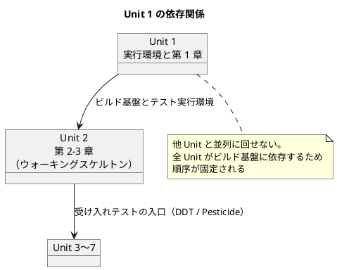
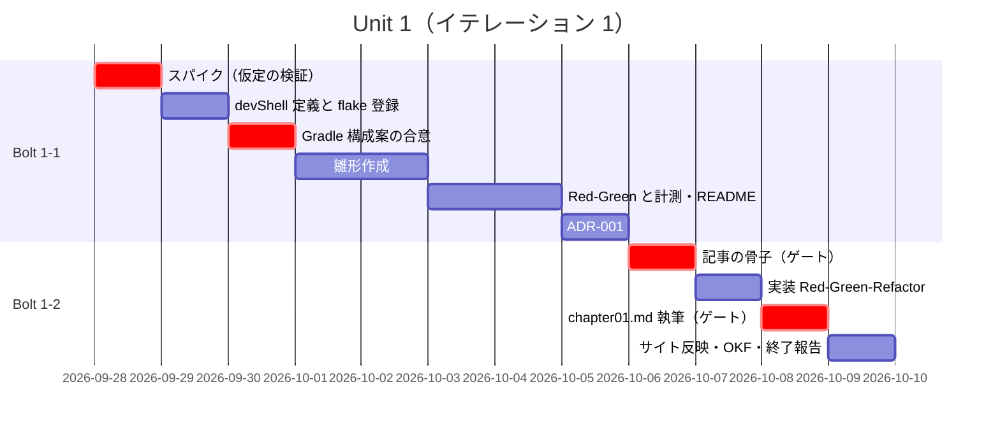
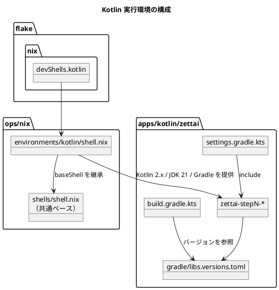

# Unit 1 の Bolt 計画（イテレーション 1）- Zettai 連載（Kotlin 版）

## 概要

本ドキュメントは AI-DLC の **Bolt 計画** です。[リリース・イテレーション計画ガイド（AI-DLC 版）](../reference/リリース・イテレーション計画ガイド_AI-DLC版.md) の第 2 章に従い、Unit 1 を構築するための Bolt とステップを定義します。XP 版のイテレーション計画に相当しますが、単位が Bolt（時間〜日）になり、見積もりがストーリーポイントから **エントロピー評価** に、進捗共有がデイリースタンドアップから **承認ゲート** に置き換わっています。

| 項目 | 内容 |
|------|------|
| **イテレーション** | 1 |
| **Unit** | Unit 1 実行環境と第 1 章 |
| **期間** | 2026-09-28 〜 2026-10-09（2 週間） |
| **Bolt 数** | 2（Bolt 1-1 / Bolt 1-2） |
| **局面** | 序盤（アウトサイドイン。[開発戦略](development_strategy.md)） |
| **人の検証負荷** | 8 ポイント（AI-DLC ではポイントは「人が検証に費やす時間の相対的な大きさ」を表す） |

### テンプレートとの差分

本ドキュメントは `docs/template/イテレーション計画.md`（XP 版）の主要セクション（概要・ゴール・ユーザーストーリー・スケジュール・設計・リスクと対策・完了条件・更新履歴・関連ドキュメント）をすべて備えたうえで、AI-DLC 固有のセクション（Intent と Unit・エントロピー評価・スコープと深さとテスト戦略・Bolt ごとのステップ計画・承認ゲート・指標）を追加しています。意図的に変えた点は次の 2 つです。

- **タスク表 → Bolt ごとのステップ計画**: AI-DLC ではタスクを「人が実装する作業」ではなく「AI が 1 回のやり取りで完結させるステップ」として書き、完了判定と人の確認要否を各ステップに持たせます
- **目標 SP → 検証負荷とエントロピー評価**: ポイントは人が検証に費やす時間の相対値を表します

参照元と正は次のとおりです。

| 内容 | 正となる参照元 |
| :--- | :--- |
| Intent・Unit 分解・依存 DAG・エントロピー評価 | [リリース計画](release_plan.md) |
| 局面とアプローチ・ゲート密度の方針 | [開発戦略](development_strategy.md) |
| 章構成・執筆規約 | [執筆計画](../article/outline.md)、[章構成マインドマップ](../article/draft.md) |
| TDD の三原則・品質基準・コミット規約 | [コーディングとテストガイド（AI-DLC 版）](../reference/コーディングとテストガイド_AI-DLC版.md) |

---

## Intent と Unit 1

### Intent（再掲）

> オブジェクト指向から関数型への設計移行を TDD で辿る過程を、読者が手元で再現できる動くサンプル実装つきの全 13 章の連載として公開する。

### Unit 1 の位置づけ

Unit 1 は Intent の最初の Unit であり、**ウォーキングスケルトンの土台** です。AI-DLC の原則に従い、最初の Bolt で AI の出力品質を確かめ、その結果で以降のゲート密度を決めます。



本プロジェクトの Unit 依存はチェーン状（章順に固定）で、並列に回せる Unit がありません。これは題材の性質上避けられないため、並列化ではなく **1 Unit あたりのリードタイム短縮** で速度を出します。

---

## ゴール

### Unit 完了時の達成状態

1. **実行環境が再現できる**: `nix develop .#kotlin` で JDK 21・Gradle・Kotlin が揃った devShell に入れる
2. **サンプル実装が動く**: `apps/kotlin/zettai/` の Gradle マルチプロジェクトで `./gradlew check` が green になる
3. **第 1 章が公開されている**: `docs/article/zettai/kotlin/chapter01.md` が MkDocs の nav から開け、記事のコード例が実装と一致している
4. **AI の出力品質が分かっている**: 承認ゲートの通過数と変更依頼数が記録され、Unit 2 のゲート密度を決められる

4 番目が最初の Unit 固有のゴールです。AI-DLC ではウォーキングスケルトンで AI の出力品質を確かめ、以降のゲート密度を決めます。

### 成功基準

- [x] `nix flake show` で `kotlin` devShell が認識され、既存 13 devShell も認識される
- [x] `./gradlew check` が green（関数型ユニットテスト 1 本を含む）
- [x] 第 1 章の節構成が [章構成マインドマップ](../article/draft.md) の第 1 章と一致している
- [x] 記事のコード例がすべて `apps/kotlin/zettai/` の動作確認済み実装からの転記である
- [x] `mkdocs.yml` の nav、[シリーズ索引](../article/zettai/index.md) の進捗管理表、[執筆計画](../article/outline.md) の対象一覧が揃っている
- [x] 承認ゲート 8 箇所の通過数・変更依頼数・リードタイムが記録されている

本 Unit はテストカバレッジの計測対象外とします。実装が関数型ユニットテスト 1 本のみで、カバレッジ値が設計品質を表さないためです。計測は Unit 2 でウォーキングスケルトンが通ってから開始し、リリース計画のメトリクス（80% 以上）を適用します。

---

## 局面とアプローチ

[開発戦略](development_strategy.md) の局面割り当てでは、Unit 1 は **序盤（アウトサイドイン）**、ゲート密度は **密** です。ただし本 Unit には次の例外があります。

- **受け入れテストの入口がまだ作れません。** アウトサイドインは「一番外側のテストから内へ向かう」アプローチですが、第 1 章の時点では HTTP のエンドポイントもドメインも存在せず、外側に置くテストがありません。そのため Bolt 1-2 は**ユニットテスト起点**で進めます
- **アウトサイドインの本格適用は Unit 2（第 2 章）からです。** 第 2 章で http4k の縦串が通ってはじめて、外側のテストから内側を駆動できます。**ウォーキングスケルトンそのものは Unit 2 で作られ、Unit 1 はその土台（実行環境とビルド基盤）を用意する Unit** です
- ゲート密度は戦略どおり**密**を採ります。根拠は後述のエントロピー評価（未解決の仮定が HIGH、最初の Bolt で AI の出力品質が未知）です

この例外は戦略からの逸脱ではなく、序盤の局面内で「外側が存在しない最初の Unit」に対する適用の仕方です。Unit 2 以降は戦略のワークフロー図どおりに進めます。

---

## Unit 1 の満足条件

### ユーザーストーリー

| ID | ユーザーストーリー | 検証負荷 | 優先度 |
|----|-------------------|----|----|
| US-000 | 読者が手元で再現できるよう、Kotlin の実行環境とサンプル実装の雛形を用意する | 5 | 必須 |
| US-001 | 第 1 章「新しいアプリケーションを準備する」を公開する | 3 | 必須 |
| **合計** | | **8** | |

#### US-000: 実行環境とサンプル実装の雛形を用意する

**ストーリー**:
> 読者として、記事に書かれた手順どおりに環境を用意したい。なぜなら、自分の手元で動かせないコードは学びにならないからだ。

**受入条件**（人と AI の契約）:

1. `nix develop .#kotlin` で devShell に入ると、JDK 21・Gradle・Kotlin のバージョンが表示される
2. `nix flake show` の出力に `kotlin` devShell が含まれる
3. `apps/kotlin/zettai/` で `./gradlew check` が green になる
4. 依存ライブラリのバージョンが `gradle/libs.versions.toml` に集中管理されている
5. 環境構築の手順が第 1 章の記事から辿れる

#### US-001: 第 1 章「新しいアプリケーションを準備する」を公開する

**ストーリー**:
> 読者として、これから何を作るのかと、なぜテストに開発をガイドさせるのかを知りたい。なぜなら、題材と進め方が分からないまま手を動かしても身に付かないからだ。

**受入条件**:

1. 節構成が [章構成マインドマップ](../article/draft.md) の第 1 章（サンプルアプリケーションを定義する／Zettai: イノベーティブな ToDo リストアプリケーション／テストに開発をガイドさせる／プロジェクトをセットアップする／ユニットテストを関数型にする／まとめ）と一致している
2. 関数型ユニットテストの例が `apps/kotlin/zettai/` の動作確認済みコードからの転記である
3. 原著のコードや文章をそのまま転載していない。参照した箇所は出典として示している
4. `mkdocs.yml` の nav から第 1 章が開ける
5. [シリーズ索引](../article/zettai/index.md) の全章構成表の第 1 章が記事へのリンクになっている

### NFR 定義（Unit 1 固有）

| NFR | 内容 | 判定方法 |
| :--- | :--- | :--- |
| 再現性 | クリーンな環境で `nix develop .#kotlin` → `./gradlew check` が追加手順なしで green になる | 手順を第 1 章に書き、書いた手順だけで通ることを確認する |
| ビルド時間 | `./gradlew check` がキャッシュなしで 3 分以内 | Unit 1 時点で計測し、超えたら Unit 2 の CI 設計に持ち込む |
| バージョン集中管理 | 依存バージョンの記述箇所が `gradle/libs.versions.toml` の 1 箇所のみ | `build.gradle.kts` にリテラルのバージョンが無いことを確認する |

### リスク記述

リスクは [リスクと対策](#リスクと対策) にまとめています。

### 測定基準（ビジネス意図へのトレース）

| 測定基準 | Unit 1 での目標 | Intent とのつながり |
| :--- | :--- | :--- |
| 再現できた読者の割合 | 手順の記述漏れ 0 件（自己検証） | 「読者が手元で再現できる」という Intent の中核 |
| 公開済みの章 | 1 / 13 | 全 13 章公開という Intent の進捗 |
| 記事とコードの一致 | 100%（コード例はすべて実装からの転記） | 「動くサンプル実装つき」という Intent の条件 |

---

## エントロピー評価

[リリース・イテレーション計画ガイド（AI-DLC 版）](../reference/リリース・イテレーション計画ガイド_AI-DLC版.md) のステップ 4 の 5 軸で、AI がどれだけ自律的に進められるかを評価します。

| 評価軸 | 評価 | 根拠 | 高いときの対応 |
| :--- | :--- | :--- | :--- |
| 意図の曖昧さ | **LOW** | 受入条件がコマンドの実行結果（`nix flake show`・`./gradlew check`）で一意に判定できる。第 1 章の節構成も [章構成マインドマップ](../article/draft.md) で確定している | — |
| 構造的不確実性 | **MED** | `ops/nix/environments/` の既存 13 環境と `flake.nix` の構造は把握済み。一方 `apps/` は空で、Gradle マルチプロジェクトの構成は未確定 | ステップ 1-1.3 の前に既存 `java/shell.nix` と `flake.nix` を読み、構成案を人に提示して承認を得る |
| 検証の不確実性 | **MED** | ビルドとテストは自動判定できる。しかし「記事が読者に伝わるか」「節構成がマインドマップと一致しているか」は人が読まないと判定できない | 記事のステップは必ず人が全文を読む承認ゲートを置く |
| リスク | **MED** | 新規ファイル作成と `flake.nix` の構造変更が含まれる（確認必須）。セキュリティ・データ・本番環境への影響はない | 新規ファイル作成と `flake.nix` 変更のステップで停止する |
| 未解決の仮定 | **HIGH** | 「nixpkgs の `kotlin` で Kotlin 2.x が入る」「Gradle の Kotlin プラグインと nixpkgs の JDK 21 が組み合わせて動く」「Strikt を assertion ライブラリに使う」がいずれも未検証の仮定 | 仮定を Bolt 1-1 の冒頭でスパイクとして検証し、結果を人に報告してから本実装に入る |

**総合**: HIGH が 1 軸、MED が 3 軸。**最初の Bolt であり AI の出力品質が未知**でもあるため、本 Unit は**各ステップで承認ゲートを通す密なゲート密度**で進めます。

未解決の仮定が HIGH なので、Bolt 1-1 の最初のステップを**スパイク**にします。仮定を先に潰さないと、後続のステップが全部やり直しになります。

---

## スコープ・深さ・テスト戦略

| 軸 | 選択 | 理由 |
| :--- | :--- | :--- |
| スコープ | **実装中心** | 設計成果物（ドメインモデル・データモデル・UI）はまだ対象がない。第 2 章以降で現れる。ADR は 1 件のみ作成する |
| 深さ | **Standard** | 学習用の連載だが、記事として公開するため手順とコードの正確さが要る。規制対象ではないので Comprehensive は過剰 |
| テスト戦略 | **Minimal** | 本 Unit の実装は関数型ユニットテスト 1 本のみ。テスト対象のコンポーネントがまだ存在しない。Unit 2 で Standard に上げる |

テスト戦略を Minimal にできるのは、Unit 1 が**本番機能を持たない基盤 Unit** だからです。ガイドの「本番機能はテスト戦略を Standard 未満にしない」規律は Unit 2 以降に適用します。この判断を承認ゲートで明示的に確認します。

---

## Bolt 1-1: 実行環境とビルド基盤

### Bolt ゴール

> `nix develop .#kotlin` から `./gradlew check` までを通し、Kotlin 2.x / JDK 21 / Gradle の組み合わせがこのリポジトリで成立することを確かめる。**確認したい仮説**: nixpkgs の `kotlin` と Gradle の Kotlin プラグインを併用しても衝突せず、既存 13 devShell に影響を与えずに 14 番目を足せる。

### ステップ計画

状態記号は `[ ]` 未着手／`[-]` 進行中／`[?]` 承認待ち／`[R]` 修正中／`[x]` 完了／`[S]` スキップ。

- [x] **1-1.0 スパイク**: nixpkgs の `kotlin` のバージョン、JDK 21 との組み合わせ、Strikt の最新版を調べ、選択肢と根拠を提示する
  - 入力: `ops/nix/environments/java/shell.nix`、`flake.nix`、`flake.lock`
  - 完了判定: 採用するバージョンの組み合わせが根拠つきで 1 案に絞られている
  - **人の確認が必要**（未解決の仮定が HIGH。結果を見てから本実装に入る）
  - **結果**: nixpkgs は kotlin 2.3.0 / jdk21 21.0.8 / gradle 8.14.3。Maven Central の最新安定版は kotlin-gradle-plugin 2.2.0 / junit-bom 5.12.2 / strikt-core 0.35.1。CLI（2.3.0）とビルド（2.2.0）でバージョンが食い違うため、ビルドの正を Gradle 側に置く。[ADR-001](../adr/ADR-001-kotlin-toolchain.md) に記録
- [x] **1-1.1 devShell の定義**: `ops/nix/environments/kotlin/shell.nix` を新設する
  - 入力: `ops/nix/environments/java/shell.nix`（雛形）、`ops/nix/shells/shell.nix`（baseShell）
  - 完了判定: `baseShell` を継承し、`kotlin`・JDK 21・Gradle を `buildInputs` に足した定義になっている
  - **人の確認が必要**（新規ファイル作成）
- [x] **1-1.2 flake への登録**: `flake.nix` の `devShells` に `kotlin` を 1 行追加する
  - 完了判定: `nix flake show` に `kotlin` が現れ、**既存 13 devShell もすべて認識される**
  - **人の確認が必要**（構造変更。既存 devShell への影響を確認する）
- [x] **1-1.3 Gradle マルチプロジェクトの構成案**: `apps/kotlin/zettai/` のディレクトリ構成とモジュール命名を提示する
  - 入力: `references/fotf/settings.gradle`（読むだけ）、[執筆計画](../article/outline.md) の章とモジュールの対応
  - 完了判定: モジュール名・`libs.versions.toml` の項目・`jvmToolchain` の指定方針が確定している
  - **人の確認が必要**（新規ファイル作成が広範。構成を先に合意する）
- [x] **1-1.4 雛形の作成**: `settings.gradle.kts`・`build.gradle.kts`・`gradle/libs.versions.toml`・最初のモジュールを作成する
  - 完了判定: `./gradlew projects` でモジュールが認識される
- [x] **1-1.5 最小のテストを書く（Red）**: 失敗するテスト 1 本を書き、**失敗することを確認する**
  - 完了判定: テストが実行され、期待どおり失敗する
- [x] **1-1.6 最小の実装で通す（Green）**: テストを通す最小限の実装を書く
  - 完了判定: `./gradlew check` が green
- [x] **1-1.7 ビルド時間の計測**: キャッシュを消して `./gradlew check` の所要時間を測る
  - 完了判定: NFR の 3 分以内を満たすか判定し、超えた場合は Unit 2 に持ち込む課題として記録する
  - **結果**: クリーンビルドで 34 秒。NFR を満たす
- [x] **1-1.8 README の作成**: `apps/kotlin/zettai/README.md` にディレクトリ規約と実行コマンドを書く
  - **人の確認が必要**（新規ファイル作成）
- [x] **1-1.9 ADR-001 の作成**: ツールチェーン選定（Kotlin 2.x / JDK 21）の判断を ADR に記録する
  - 入力: `docs/template/ADR.md`、1-1.0 のスパイク結果
  - **人の確認が必要**（設計判断の記録。`creating-adr` スキル）

### Bolt 1-1 の完了条件

- [x] `nix develop .#kotlin` で JDK 21・Gradle・Kotlin のバージョンが表示される
- [x] `nix flake show` に `kotlin` と既存 13 devShell がすべて現れる
- [x] `./gradlew check` が green
- [x] ADR-001 を作成済み
- [x] 確認したい仮説に答えが出ている（Kotlin 2.x / JDK 21 / Gradle の組み合わせが成立するか）
- [x] `feat(kotlin): ...` のコミットに分かれている

---

## Bolt 1-2: 第 1 章の公開

### Bolt ゴール

> 関数型ユニットテスト 1 本を実装し、それを題材に第 1 章を公開する。**確認したい仮説**: AI が生成する日本語の技術記事が、執筆規約（節構成の一致・実装からの転記・原著の非転載）を守った状態でどこまで出せるか。人の修正がどのくらい必要かが分かる。

この仮説は Unit 1 で最も重要です。全 13 章を書き切れるかは、1 章あたりの人の修正量で決まります。

### ステップ計画

- [x] **1-2.1 記事の骨子**: [章構成マインドマップ](../article/draft.md) の第 1 章から節見出しを起こし、各節で何を書くかを 1 行ずつ添える
  - 完了判定: 節見出しがマインドマップと一字一句一致し、各節の主題が書かれている
  - **人の確認が必要**（記事の構成は契約。ここでずれると全文を書き直すことになる）
- [x] **1-2.2 関数型ユニットテストを書く（Red）**: 記事で見せるテストを、失敗する状態で書く
  - 入力: `references/fotf/bowlingkata`（読むだけ。転載しない）
  - 完了判定: テストが実行され、期待どおり失敗する
- [x] **1-2.3 実装して通す（Green）**: 最小限の実装でテストを通す
  - 完了判定: `./gradlew check` が green
- [x] **1-2.4 リファクタリング**: 記事に載せる形に整える。テストは green のまま
  - 完了判定: `./gradlew check` が green で、コードが記事の説明順に読める構造になっている
- [x] **1-2.5 chapter01.md の執筆**: コード例は 1-2.4 の実装から転記する
  - 完了判定: 受入条件 1〜3 を満たしている
  - **人の確認が必要**（全文を読む。検証の不確実性が MED の理由がここ）
- [x] **1-2.6 サイト反映**: `mkdocs.yml` の nav、[シリーズ索引](../article/zettai/index.md) の全章構成表と進捗管理表、[執筆計画](../article/outline.md) の対象一覧を更新する
  - 完了判定: `gulp mkdocs:build` が通り、nav から第 1 章に到達できる
- [x] **1-2.7 OKF 規約の適用**: `chapter01.md` にフロントマターを付け、`docs/log.md` に追記する
  - 完了判定: `gulp okf:check` が ERROR 0（`apply-okf` スキル）
- [x] **1-2.8 Bolt 終了報告**: Unit 1 の実績（承認ゲート通過数・変更依頼数・リードタイム）を記録し、判断と学びをジャーナルに転記する
  - 完了判定: 次の Unit のゲート密度を決める材料が揃っている

### Bolt 1-2 の完了条件

- [x] 第 1 章が公開され、nav から到達できる
- [x] 記事のコード例がすべて動作確認済み実装からの転記である
- [x] `gulp okf:check` が ERROR 0
- [x] 実装（`feat(kotlin):`／`test(kotlin):`）と記事（`docs(kotlin):`）のコミットが分かれている
- [x] 確認したい仮説に答えが出ている（1 章あたりの人の修正量）

---

## 受入条件とステップの対応

受入条件がステップ計画で漏れなくカバーされていることを確認するための対応表です。空欄があればステップが足りません。

| ストーリー | 受入条件 | カバーするステップ | 判定方法 |
| :--- | :--- | :--- | :--- |
| US-000 | 1. devShell で JDK 21・Gradle・Kotlin のバージョンが表示される | 1-1.1 | `nix develop .#kotlin` の出力 |
| US-000 | 2. `nix flake show` に `kotlin` が含まれる | 1-1.2 | コマンド出力 |
| US-000 | 3. `./gradlew check` が green | 1-1.5・1-1.6 | コマンド終了コード |
| US-000 | 4. 依存バージョンが `libs.versions.toml` に集中管理されている | 1-1.3・1-1.4 | `build.gradle.kts` にリテラルのバージョンが無いこと |
| US-000 | 5. 環境構築の手順が第 1 章の記事から辿れる | 1-1.8・1-2.5 | `README.md` の手順が第 1 章「プロジェクトをセットアップする」の節から参照されていること |
| US-001 | 1. 節構成がマインドマップの第 1 章と一致 | 1-2.1・1-2.5 | 見出しの突合（人の検証） |
| US-001 | 2. コード例が動作確認済み実装からの転記 | 1-2.2〜1-2.5 | 記事のコードと実装ファイルの差分が無いこと |
| US-001 | 3. 原著のコード・文章を転載していない | 1-2.5 | 人の検証。参照箇所に出典があること |
| US-001 | 4. nav から第 1 章が開ける | 1-2.6 | `gulp mkdocs:build` が通り、nav から到達 |
| US-001 | 5. シリーズ索引の第 1 章が記事へのリンク | 1-2.6 | リンク切れが無いこと |

US-000 の受入条件 5 は Bolt 1-1（README）と Bolt 1-2（記事）にまたがります。Bolt 1-1 だけでは満たせないため、Unit の完了判定でのみ検証します。

---

## 承認ゲートとゲート密度

### 本 Unit のゲート密度: 密（各ステップでゲート）

エントロピー評価で未解決の仮定が HIGH、構造的不確実性・検証の不確実性・リスクが MED であり、かつ**最初の Bolt で AI の出力品質が未知**であるため、ガイドの表に従い「各ステップでゲート」を選びます。

ただし全ステップで人が立ち会うわけではありません。次のステップは**停止して承認を待ちます**（上のステップ計画で「人の確認が必要」と記したもの）。

| ステップ | 停止理由 |
| :--- | :--- |
| 1-1.0 | 未解決の仮定（HIGH）の検証結果を人が判断する |
| 1-1.1 / 1-1.3 / 1-1.8 | 新規ファイル作成（確認必須） |
| 1-1.2 | `flake.nix` の構造変更（確認必須） |
| 1-1.9 | 設計判断の記録（ADR） |
| 1-2.1 | 記事の構成は人と AI の契約。後戻りコストが最大 |
| 1-2.5 | 記事の全文検証。自動判定できない |

それ以外のステップ（1-1.4〜1-1.7、1-2.2〜1-2.4、1-2.6〜1-2.8）は AI が連続して進め、**テスト失敗・未確認の仮定の発生・確認必須の操作に該当したときは必ず停止**します。

### ゲート密度の見直し

Unit 1 の完了時（Bolt 1-2 のステップ 1-2.8）に、承認ゲート通過数と変更依頼数を集計し、Unit 2 のゲート密度を 1 回だけ決めます。変更依頼が少なければ Unit 2 を「自律実行」に寄せます。この判断は [開発戦略](development_strategy.md) の方針に従います。

### モブの集中時間

想定稼働は 10 時間/週です。承認ゲートが 8 箇所あり、うち記事の全文検証（1-2.5）とスパイク結果の判断（1-1.0）は連続した集中時間を要します。**Week 2 の Day 8-9 に 2 時間以上の連続した時間を先に確保します**。ガイドが指摘するとおり、AI の生成時間ではなく人の検証時間がボトルネックです。

---

## スケジュール



`crit` で示したステップが承認ゲートで止まる箇所です。ここに人の時間を確保します。

---

## 設計

### 本 Unit で省略する設計図

イテレーション計画では対象スコープの 4 図（ドメインモデル図・状態遷移図・ER 図・画面遷移図）を掲載しますが、本 Unit はアプリケーションの実行環境と雛形を作る段階のため、いずれも対象がありません。省略の理由を明記します。

| 設計図 | 本 Unit での扱い | 初回作成 |
| :--- | :--- | :--- |
| ドメインモデル図 | **省略**。ドメインの型がまだ 1 つも無い | Unit 3（第 4〜5 章） |
| 状態遷移図 | **省略**。状態を持つ集約が無い | Unit 4（第 6 章のコマンドと状態遷移） |
| ER 図 | **省略**。永続化を扱わない（インメモリのみ） | Unit 5（第 9 章の PostgreSQL） |
| 画面遷移図 | **省略**。画面を伴わない | Unit 2（第 2 章の HTML ページ） |

代わりに、本 Unit の実装対象である実行環境とビルド構成の図を掲載します。

**ユーザーマニュアル（`creating-manual`）も本 Unit では対象外です。** 画面を伴わず、読者向けの操作手順は第 1 章の記事そのものが担うためです。画面が現れる Unit 2 以降でマニュアルの要否を再判断します。

### `docs/design/` への反映（注）

本 Unit の時点で `docs/design/` は索引のみです。以下は Unit 完了時ではなく、対応する Unit で反映します（[開発戦略](development_strategy.md) の設計ドキュメント整合を参照）。

| 反映先 | 内容 | 反映する Unit |
| :--- | :--- | :--- |
| `docs/design/architecture_backend.md`（未作成） | 本 Unit で決めた Gradle マルチプロジェクトのモジュール分割と命名規約（`zettai-stepN-*`） | Unit 2（ヘキサゴナルの輪郭が出た時点で構成ごと記述する） |
| `docs/adr/ADR-001-*.md` | ツールチェーン選定（Kotlin 2.x / JDK 21） | **本 Unit**（ステップ 1-1.9） |

モジュール命名は本 Unit で確定しますが、アーキテクチャ設計ドキュメント自体は Unit 2 まで作りません。第 1 章の時点で書けるのはディレクトリ構成だけで、アーキテクチャと呼べる構造がまだ無いためです。

### 実行環境の構成



既存の `ops/nix/environments/java/shell.nix` が `shells/shell.nix` の `baseShell` を継承して `jdk`・`maven`・`gradle` を足す形なので、`kotlin/shell.nix` も同じ形にします。既存 13 環境と構造を揃えることで、環境定義の読み方を一つに保ちます。

### ディレクトリ構成

```text
ops/nix/environments/kotlin/
└── shell.nix                    # 新設（要確認）

apps/kotlin/zettai/
├── settings.gradle.kts          # 新設（モジュールを include）
├── build.gradle.kts             # 新設（共通設定・jvmToolchain(21)）
├── gradle/
│   └── libs.versions.toml       # 新設（バージョン集中管理）
├── README.md                    # 新設（ディレクトリ規約と実行コマンド）
└── zettai-step1-http/           # 新設（最初のモジュール）
    ├── build.gradle.kts
    └── src/
        ├── main/kotlin/
        └── test/kotlin/

docs/article/zettai/kotlin/
└── chapter01.md                 # 新設

docs/adr/
└── ADR-001-kotlin-toolchain.md   # 新設
```

モジュール名は参照元 `references/fotf/` の `zettai_stepN_*` に対応させつつ、Gradle の慣習に合わせてハイフン区切り（`zettai-stepN-*`）にします。この命名はステップ 1-1.3 で人の承認を得ます。

### ADR

| ADR | タイトル | ステータス |
|-----|---------|-----------|
| `ADR-001` | サンプル実装に Kotlin 2.x / JDK 21 を採用する（原著は Kotlin 1.8.20 / JDK 11） | 提案 |

---

## リスクと対策

リスク台帳（[リリース計画](release_plan.md) のリスク管理）と対応づけます。AI-DLC では、各リスクに**どの承認ゲートで止めるか**を必ず紐づけます。

| リスク | 影響度 | 台帳との対応 | 対策 | 承認ゲート |
| :--- | :--- | :--- | :--- | :--- |
| 原著（Kotlin 1.8.20 / JDK 11）と自作実装（Kotlin 2.x / JDK 21）のツールチェーン差異 | 中 | [リリース計画](release_plan.md) 技術リスク 1 | ADR-001 で判断を記録し、章ごとに差異を注記する | ステップ 1-1.9 で停止 |
| nixpkgs の `kotlin` が期待バージョンでない、Gradle と組み合わせて動かない | 中 | 新規（本 Bolt で台帳に追加） | ビルドの正を Gradle 側とし、devShell の `kotlin` は CLI 利用にとどめる | ステップ 1-1.0（スパイク）で停止 |
| 新規ファイル・ディレクトリの作成が広範（`ops/nix/environments/kotlin/`、`apps/kotlin/zettai/`） | 中 | 確認必須（`CLAUDE.md`「新規ファイル作成」） | ディレクトリ構成を先に確定し、人の承認を得てから作成する | ステップ 1-1.1・1-1.3・1-1.8 で停止 |
| `flake.nix` の変更が既存 13 devShell に影響する | 高 | 確認必須（構造変更） | 既存 devShell の定義を変えず、行の追加のみとする。`nix flake show` で全 devShell が認識されることを確認する | ステップ 1-1.2 で停止 |
| 承認ゲートが 8 箇所あり、人の検証時間が確保できないと Unit が止まる | 高 | [リリース計画](release_plan.md) スケジュールリスク | Week 2 の Day 8-9 に 2 時間以上の連続した集中時間を先に確保する | — |
| 記事の執筆が積み残り、実装だけ終わった状態になる | 高 | [リリース計画](release_plan.md) スケジュールリスク | 記事公開とシリーズ索引の更新までを Unit の完了定義に含める。部分完了は 0 と数える | ステップ 1-2.5 で全文検証 |

---

## Deployment Unit としての完了条件

AI-DLC では Unit は **Deployment Unit**（テスト済みで運用可能な単位）として検証されたときに完了します。部分完了は 0 と数えます。

### Definition of Done

- [x] `nix develop .#kotlin` が動作し、JDK 21・Gradle・Kotlin のバージョンが表示される
- [x] `nix flake show` に `kotlin` と既存 13 devShell がすべて現れる
- [x] `apps/kotlin/zettai/` で `./gradlew check` が green
- [x] 第 1 章が公開され、コード例が実装と一致している
- [x] `mkdocs.yml` の nav、シリーズ索引の進捗管理表、執筆計画の対象一覧が揃っている
- [x] `gulp okf:check` が ERROR 0
- [x] 実装と記事のコミットが分かれている
- [x] ADR-001 を作成済み
- [x] 全承認ゲートを通過した（または変更依頼 3 回以上で現状受け入れを判断した）
- [x] Bolt 終了報告を作成し、判断と学びをジャーナルに転記した
- [x] デモ項目がすべて実演できる

### デモ項目

1. `nix develop .#kotlin` で devShell に入り、JDK 21・Gradle・Kotlin のバージョンが表示される
2. `apps/kotlin/zettai/` で `./gradlew check` を実行し、関数型ユニットテスト 1 本が green になる
3. 関数型ユニットテストのコードを開き、第 1 章の該当節に載っているコードと一致していることを示す
4. `gulp mkdocs:serve` でサイトを開き、nav から第 1 章に到達できる

デモ項目 1・2・4 は [開発戦略](development_strategy.md) の方針に従い、Unit 2 で受け入れテスト（スモーク）として自動化します。Unit 1 の時点では手動実演で判定します。

---

## 指標（Bolt 終了報告へ引き継ぐ）

AI-DLC ではベロシティを完了 Unit 数と承認ゲート通過数に置き換えます。次を計測し、ステップ 1-2.8 で記録します。

| 指標 | 計画 | 実績 |
| :--- | :--- | :--- |
| 完了 Unit 数 | 1 | **1** |
| 承認ゲート通過数 | 8（予定） | **8** |
| 変更依頼数 | - | **1**（記事の OO 版コード例が実装されておらず、執筆規約違反として自己修正） |
| リードタイム（Unit 着手から Deployment Unit まで） | 10 営業日 | **1 日** |
| エントロピー評価の的中 | 未解決の仮定 HIGH・他 MED/LOW | **的中**。スパイクで CLI とビルドのバージョン差が判明し、ADR-001 の判断につながった |

変更依頼数が多かった軸は、エントロピー評価で見落としたものです。次の Unit の評価に反映し、人が修正した振る舞いは `CLAUDE.md` またはスキルにガードレールとして反映します。

---

## 更新履歴

| 日付 | 更新内容 | 更新者 |
|------|---------|--------|
| 2026-09-26 | Unit 1 完了。全 18 ステップと承認ゲート 8 箇所を通過し、Deployment Unit として検証。実績を指標に記録 | claude-code/claude-opus-5 |
| 2026-09-26 | 初版作成（AI-DLC 準拠）。Unit 1 の満足条件・5 軸のエントロピー評価・スコープと深さとテスト戦略の選択・Bolt 1-1 と Bolt 1-2 のステップ計画（18 ステップ・承認ゲート 8 箇所）・ゲート密度の決定・Deployment Unit の完了条件を定義 | claude-code/claude-opus-5 |

---

## 関連ドキュメント

- [リリース計画](release_plan.md)
- [開発戦略](development_strategy.md)
- [リリース・イテレーション計画ガイド（AI-DLC 版）](../reference/リリース・イテレーション計画ガイド_AI-DLC版.md)
- [コーディングとテストガイド（AI-DLC 版）](../reference/コーディングとテストガイド_AI-DLC版.md)
- [執筆計画](../article/outline.md)
- Unit 1 の Bolt 終了報告（`bolt_report-1.md`。Unit 完了時に作成）
