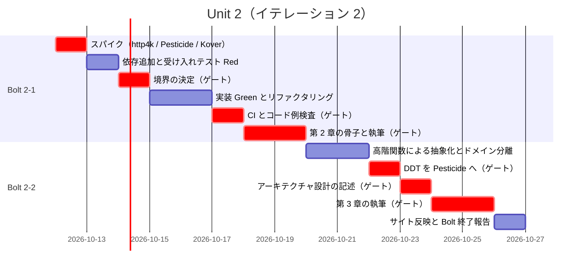
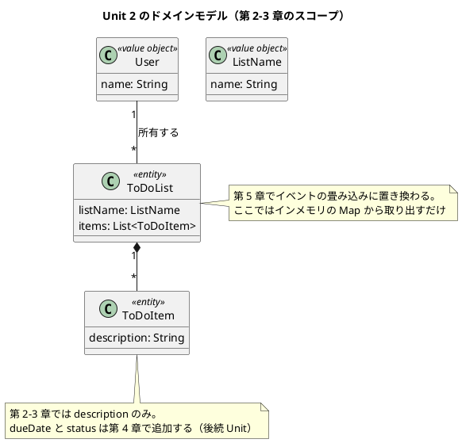
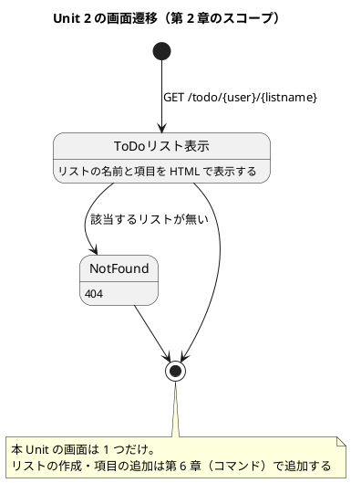

# Unit 2 の Bolt 計画（イテレーション 2）- Zettai 連載（Kotlin 版）

## 概要

本ドキュメントは AI-DLC の **Bolt 計画** です。[リリース・イテレーション計画ガイド（AI-DLC 版）](../reference/リリース・イテレーション計画ガイド_AI-DLC版.md) の第 2 章に従い、Unit 2 を構築するための Bolt とステップを定義します。

| 項目 | 内容 |
|------|------|
| **イテレーション** | 2 |
| **Unit** | Unit 2 ウォーキングスケルトンとドメイン分離 |
| **期間** | 2026-10-12 〜 2026-10-23（2 週間） |
| **Bolt 数** | 2（Bolt 2-1 第 2 章 / Bolt 2-2 第 3 章） |
| **局面** | 序盤（アウトサイドイン。[開発戦略](development_strategy.md)） |
| **人の検証負荷** | 13 ポイント |
| **前 Unit** | [Unit 1](iteration_plan-1.md)（完了。[Bolt 終了報告](bolt_report-1.md)） |

参照元と正は Unit 1 と同じです（[リリース計画](release_plan.md) / [開発戦略](development_strategy.md) / [執筆計画](../article/outline.md) / [章構成マインドマップ](../article/draft.md)）。

---

## Unit 1 からの持ち込み

[Unit 1 の Bolt 終了報告](bolt_report-1.md) で挙げた 5 項目を、本 Unit のステップに落とし込みます。**どのステップで消化するかを明示します。** 持ち込み項目を計画の外に置くと、次の Unit へさらに繰り越されます。

| # | 持ち込み項目 | 消化するステップ | 根拠 |
| :--- | :--- | :--- | :--- |
| 1 | `.github/workflows/kotlin-zettai.yml` を新設する | 2-1.7 | 縦串が通った直後に CI を作る（[開発戦略](development_strategy.md) 序盤の手順 4） |
| 2 | 記事のコードブロックが実装に存在するかを検査する仕組みを CI に入れる | 2-1.8 | Unit 1 の変更依頼 1 件の再発防止。学び 2 |
| 3 | テストカバレッジの計測を開始する | 2-1.7 | Unit 2 から本番機能が入るため。Kover を `check` に組み込む |
| 4 | `docs/design/architecture_backend.md` を作成する | 2-2.7 | Unit 1 で決めたモジュール分割と、本 Unit で現れるヘキサゴナルの輪郭をまとめて記述する |
| 5 | `BuildSmokeTest` を削除する | 2-1.5 | 縦串の受け入れテストが通れば役割を終える |
| 6 | Unit 1 のデモ項目をスモークテストとして自動化する | 2-2.6 | [開発戦略](development_strategy.md) が「Unit 2 で DDT を導入した時点で自動化する」と定めている |
| 7 | 静的解析（ktlint / detekt）を `check` に組み込むかを決める | 2-1.1 | [開発戦略](development_strategy.md) は「Unit 1 の Gradle 雛形作成時に決めて ADR に記録する」としていたが、**Unit 1 で決めていない**。本 Unit で消化する |
| 8 | `docs/design/ui_design.md` を作成する | 2-2.7 | [開発戦略](development_strategy.md) の設計ドキュメント整合表が「UI 設計の初回作成は Unit 2（第 2 章の HTML ページ）」としている |

項目 6〜8 は本計画の検証（`validating-design` の軸 A）で見つかった、開発戦略が Unit 2 に割り当てているのに Bolt 終了報告の持ち込みに挙がっていなかったものです。**終了報告の持ち込みだけを入力にすると、戦略側の割り当てを取りこぼします。** 両方を入力にします。

Unit 1 の学び 3（リードタイムの実績を額面どおり受け取らない）と学び 4（逐語でない抜粋は種類を明示する）は、見積もりと執筆規約として本計画に織り込んでいます（後述）。

---

## ゴール

### Unit 完了時の達成状態

1. **ウォーキングスケルトンが通っている**: HTTP のリクエストを受けて ToDo リストを HTML で返す縦串が、受け入れテストで検証されている
2. **ドメインとインフラが分離されている**: ToDo リストのドメイン型が HTTP アダプタから独立し、ドメインだけをテストできる
3. **受け入れテストの入口ができている**: DDT を Pesticide に載せ替え、Unit 3 以降の受け入れテストの土台になっている
4. **CI が緑で回っている**: `./gradlew check` と記事のコード例検査が GitHub Actions で動く
5. **第 2〜3 章が公開されている**: Release v0.1.0 の条件を満たす

3 番目が本 Unit の最重要項目です。ここで作る受け入れテストの入口を、残り 10 章すべてが使います。

### 成功基準

- [x] `GET /todo/{user}/{listname}` が ToDo リストの HTML を返す
- [x] 縦串を検証する受け入れテストが green
- [x] ドメイン層のテストが HTTP に依存せず単独で実行できる
- [x] DDT が Pesticide 上で動き、同じシナリオが green
- [x] CI（`.github/workflows/kotlin-zettai.yml`）が green
- [x] 記事のコード例検査が CI で動き、第 1〜3 章で違反 0 件
- [x] テストカバレッジが 80% 以上（ドメイン層。アダプタ層は受け入れテストで担保）
- [x] 第 2〜3 章の節構成が [章構成マインドマップ](../article/draft.md) と一致している
- [x] `BuildSmokeTest` が削除されている
- [x] `docs/design/architecture_backend.md` と `docs/design/ui_design.md` が作成されている
- [x] Unit 1 のデモ項目がスモークテストとして自動化されている
- [x] 静的解析を `check` に組み込むかの判断が ADR に記録されている

---

## 局面とアプローチ

[開発戦略](development_strategy.md) の割り当てどおり **序盤（アウトサイドイン）**、ゲート密度は **密** です。Unit 1 で設けた例外（外側に置くテストが存在しないためユニットテスト起点）は、本 Unit から解消します。

**本 Unit がウォーキングスケルトンそのものです。** 進め方は戦略のワークフロー図に従います。

1. 外側（HTTP レベルのテスト）を Red にする
2. 呼ぶ相手を決める。ここで設計が駆動される
3. 内側へ一段下りて、最小のドメインを置く
4. Green にする
5. リファクタリングで高階関数による抽象化を入れる（第 3 章）

**薄く通すことを優先します。** 第 2 章の時点でドメインを作り込みません。ToDo リストを表示するのに要る型だけを置き、第 4 章以降で肉付けします。先に作り込むと、記事で説明していないコードが残ります。

---

## Unit 2 の満足条件

### ユーザーストーリー

| ID | ユーザーストーリー | 検証負荷 | 優先度 |
|----|-------------------|----|----|
| US-002 | 第 2 章「関数を使って HTTP を扱う」を公開する（ウォーキングスケルトン） | 8 | 必須 |
| US-003 | 第 3 章「ドメインの定義とテスト」を公開する | 5 | 必須 |
| **合計** | | **13** | |

#### US-002: 第 2 章「関数を使って HTTP を扱う」を公開する

**ストーリー**:
> 読者として、HTTP のリクエストが最終的に画面になるまでの道筋を、最小のコードで一度通して見たい。なぜなら、全体の形が見えないまま部分を作り込んでも、その部分がどこに収まるのか分からないからだ。

**受入条件**:

1. `GET /todo/{user}/{listname}` が ToDo リストの項目を含む HTML を返す
2. 存在しないリストへのリクエストが 404 を返す
3. HTTP ハンドラが `(Request) -> Response` の関数として表現されている
4. ToDo リストのデータがインメモリの `Map` から供給されている（永続化は第 9 章）
5. 縦串を検証するテストがあり、green である
6. 節構成が [章構成マインドマップ](../article/draft.md) の第 2 章（プロジェクトのキックオフ／関数型で HTML ページを提供する／Zettai の開発を始める／矢印で設計する／ToDo リストをマップで提供する／まとめ）と一致している

#### US-003: 第 3 章「ドメインの定義とテスト」を公開する

**ストーリー**:
> 読者として、受け入れテストを「画面を叩く手順」ではなく「業務の言葉」で書きたい。なぜなら、手順で書いたテストは実装を変えるたびに壊れ、テストがリファクタリングの足かせになるからだ。

**受入条件**:

1. 受け入れテストが業務の言葉（ToDo リスト・項目）で書かれ、HTTP の詳細を直接扱わない
2. テストの入口が高階関数で抽象化され、実行方法（HTTP 経由／ドメイン直接）を差し替えられる
3. ドメイン層が HTTP に依存せず、ドメインだけをテストできる
4. DDT が Pesticide 上で動作し、同じシナリオが green である
5. 節構成が [章構成マインドマップ](../article/draft.md) の第 3 章（受け入れテストを改善する／高階関数を使う／ドメインとインフラストラクチャの分離／ドメインからテストを駆動する／DDT を Pesticide に変換する／まとめ）と一致している

### NFR 定義（Unit 2 固有）

| NFR | 内容 | 判定方法 |
| :--- | :--- | :--- |
| テスト実行時間 | `./gradlew check` が 2 分以内（CI のキャッシュあり） | CI のジョブ時間 |
| ドメインの独立性 | ドメイン層のコードが http4k に依存しない | ドメイン層のテストが http4k をクラスパスに持たずに通ること |
| 記事とコードの一致 | 記事のコードブロックが実装に存在する（逐語でない 3 種類を除く） | CI の検査スクリプトで違反 0 件 |
| カバレッジ | ドメイン層 80% 以上 | Kover のレポート |

### 測定基準（ビジネス意図へのトレース）

| 測定基準 | Unit 2 での目標 | Intent とのつながり |
| :--- | :--- | :--- |
| 公開済みの章 | 3 / 13 | 全 13 章公開という Intent の進捗 |
| 記事とサンプル実装の一致 | 100%（CI で機械検証） | 「動くサンプル実装つき」という Intent の条件 |
| 読者が再現できるか | 第 2 章の手順だけでローカルにサーバーが立つ | 「読者が手元で再現できる」という Intent の中核 |

---

## エントロピー評価

| 評価軸 | 評価 | 根拠 | 対応 |
| :--- | :--- | :--- | :--- |
| 意図の曖昧さ | **LOW** | 受入条件が HTTP のレスポンスとテストの green で判定できる。節構成もマインドマップで確定している | — |
| 構造的不確実性 | **MED** | ビルド基盤は Unit 1 で把握済み。一方、ドメインとアダプタの境界をどこに引くかは本 Unit で初めて決める。ここで引いた線が残り 10 章を縛る | 境界の案をステップ 2-1.3 で人に提示し、承認を得てから実装に入る |
| 検証の不確実性 | **MED** | ビルドとテストは自動判定できる。記事が読者に伝わるかは人が読むしかない（Unit 1 と同じ） | 記事のステップは全文検証のゲートを置く |
| リスク | **MED** | 新規ライブラリ 3 件（http4k・Pesticide・Kover）の導入と、CI ワークフローの新設が含まれる（いずれも確認必須） | 各導入ステップで停止する |
| 未解決の仮定 | **HIGH** | 「http4k 6.x が原著の 4.x と API 互換でどこまで違うか」「Pesticide 1.6.6 が Kotlin 2.2 / JUnit 5.12 で動くか」が未検証。**Pesticide は原著者の個人プロジェクトで、更新が止まっていれば代替を考える必要がある** | Bolt 2-1 の先頭でスパイクし、結果を人に報告してから本実装に入る |

**総合**: HIGH が 1 軸、MED が 3 軸。Unit 1 と同じ構成です。ゲート密度は **密** のまま据え置きます（[Bolt 終了報告](bolt_report-1.md) の判断）。

Unit 1 と同じく未解決の仮定が HIGH なので、**ステップ 2-1.0 をスパイクにします**。Unit 1 でこの判断が効いた（CLI とビルドのバージョン差を事前に発見できた）ため、同じ形を踏襲します。

とくに Pesticide の生存確認は重要です。動かない場合、第 3 章の後半（DDT を Pesticide に変換する）の構成そのものを変える必要があり、影響が記事にまで及びます。

---

## スコープ・深さ・テスト戦略

| 軸 | 選択 | 理由 |
| :--- | :--- | :--- |
| スコープ | **全ステージ** | 本 Unit から本番機能が入る。ドメイン設計・実装・テスト・CI までを通す |
| 深さ | **Standard** | 記事として公開するため手順とコードの正確さが要る。規制対象ではない |
| テスト戦略 | **Standard**（コンポーネントごとに 5〜8） | 本番機能に相当するため Standard 未満にしない（[リリース計画](release_plan.md) の方針） |

Unit 1 は Minimal でしたが、本 Unit から Standard に上げます。ウォーキングスケルトンが以降 10 章の土台になるため、ここのテストが薄いと後続すべてに響きます。

---

## Bolt 2-1: ウォーキングスケルトン（第 2 章）

### Bolt ゴール

> HTTP のリクエストから ToDo リストの HTML までを最小の厚みで通し、第 2 章として公開する。**確認したい仮説**: http4k 6.x で原著（4.x）の設計がそのまま書けるか。書けない場合、どこがどう違うかを記事に注記できる粒度で特定できるか。

### ステップ計画

状態記号は `[ ]` 未着手／`[-]` 進行中／`[?]` 承認待ち／`[R]` 修正中／`[x]` 完了／`[S]` スキップ。

- [x] **2-1.0 スパイク**: http4k 6.15.1.0 / Pesticide 1.6.6 / Kover 0.9.1 が Kotlin 2.2・JUnit 5.12 で動くことを確かめ、原著（http4k 4.x）との API 差分を洗い出す
  - 入力: `apps/kotlin/zettai/gradle/libs.versions.toml`、`references/fotf/zettai_step1_http`（読むだけ）
  - 完了判定: 3 ライブラリが解決でき、最小のサーバーが起動する。API 差分が一覧になっている。**Pesticide が動かない場合は代替案（自前の DDT 基盤）を提示する**
  - **人の確認が必要**（未解決の仮定が HIGH。Pesticide の可否は第 3 章の構成に影響する）
  - **結果**: 3 ライブラリとも Kotlin 2.2 / JUnit 5.12 で動作した。**Pesticide 1.6.6 は使える**（Kotlin 1.5.30 stdlib・JUnit 5.7.2 に依存しているが、実行時は問題なし）。API は `DdtActions` / `DdtActor` / `DomainOnly` / `Ready` / `ddtScenario` / `play` / `step` で、原著（1.6.5）と同じ。http4k 6.15 は第 2 章で使う範囲で 4.48 と API 差分なし（[ADR-003](../adr/ADR-003-http4k-6.md)）。Kover は `check` に組み込んだ
- [x] **2-1.1 依存の追加と静的解析の判断**（**持ち込み 7**）: `libs.versions.toml` に http4k・Pesticide・Kover を追加する。あわせて静的解析（ktlint / detekt）を `check` に組み込むかを決め、ADR-004 に記録する
  - 完了判定: 依存が解決でき、静的解析の採否が根拠つきで決まっている
  - **結果**: 静的解析は `check` に組み込まない。代わりに記事のコード例検査を CI に入れる（[ADR-004](../adr/ADR-004-static-analysis.md)）。再検討は Unit 5
  - **人の確認が必要**（外部ライブラリの新規導入・設計判断）
- [x] **2-1.2 受け入れテストを書く（Red）**: `GET /todo/{user}/{listname}` が ToDo リストの項目を含む HTML を返すことを、HTTP レベルで確かめるテストを書く
  - 完了判定: テストが実行され、期待どおり失敗する
- [x] **2-1.3 ドメインとアダプタの境界を決める**: パッケージ構成と、ドメインに置く型（`User`・`ListName`・`ToDoList`・`ToDoItem`）を提示する
  - 完了判定: 境界と型の一覧が確定している。**第 4 章以降で増える型は含めない**
  - **人の確認が必要**（ここで引いた線が残り 10 章を縛る。構造的不確実性 MED の理由）
- [x] **2-1.4 最小のドメインとハンドラを実装する（Green）**: 受け入れテストを通す
  - 完了判定: 2-1.2 のテストが green
- [x] **2-1.5 リファクタリングと後片付け**: `HttpHandler` を `(Request) -> Response` の型として扱う形に整える。`BuildSmokeTest` を削除する（**持ち込み 5**）
  - 完了判定: `./gradlew check` が green。`BuildSmokeTest` が存在しない
- [x] **2-1.6 404 の扱いを追加する（Red → Green）**: 存在しないリストへのリクエストが 404 を返すことを確かめる
  - 完了判定: テストが green。エラーの表現は第 7 章（`Outcome`）まで素朴な形にとどめる
- [x] **2-1.7 CI の新設**（**持ち込み 1・3**）: `.github/workflows/kotlin-zettai.yml` を作成し、`./gradlew check` と Kover のカバレッジ計測を実行する
  - 完了判定: GitHub Actions のジョブが green。カバレッジがレポートされる
  - **人の確認が必要**（新規ファイル作成・外部サービス連携）
- [x] **2-1.8 記事のコード例検査を CI に入れる**（**持ち込み 2**）: 記事のコードブロックが実装に存在するかを検査するスクリプトを追加する
  - 完了判定: 第 1 章に対して実行し、逐語でない 3 種類（使用例・リファクタリング前の履歴・`...` を含む省略）を除いて違反 0 件になる
  - **結果**: `ops/scripts/article/check_article_code.py` を作成。**Unit 1 で人が見つけた 4 行をそのまま検出した**。記事側に `<!-- code-check: ignore 理由 -->` マーカーを置いて除外し、違反 0 件になった
  - **人の確認が必要**（新規ファイル作成。検査の除外ルールは人が判断する）
- [x] **2-1.9 第 2 章の骨子**: マインドマップの第 2 章から節見出しを起こす
  - **人の確認が必要**（記事の構成は契約。後戻りコストが最大）
- [x] **2-1.10 chapter02.md の執筆**: コード例は実装から転記する。http4k 6.x と原著 4.x の差分を注記する
  - **人の確認が必要**（全文検証）
- [x] **2-1.11 サイト反映**: nav・シリーズ索引・Kotlin 版トップ・執筆計画を更新する

### Bolt 2-1 の完了条件

- [x] `GET /todo/{user}/{listname}` が HTML を返し、404 も扱える
- [x] 受け入れテストが green
- [x] `BuildSmokeTest` が削除されている
- [x] CI が green（`check` + カバレッジ + 記事のコード例検査）
- [x] 第 2 章が公開されている
- [x] 確認したい仮説に答えが出ている（http4k 6.x と 4.x の差分）

---

## Bolt 2-2: ドメイン分離と DDT（第 3 章）

### Bolt ゴール

> 受け入れテストを業務の言葉で書けるようにし、実行方法を差し替えられる形（DDT）にして第 3 章として公開する。**確認したい仮説**: 同じシナリオを「HTTP 経由」と「ドメイン直接」の 2 通りで実行できる形にしたとき、テストの記述が実装の詳細から本当に切り離せるか。

### ステップ計画

- [x] **2-2.1 受け入れテストの問題を言語化する**: 2-1.2 で書いたテストの、実装に結合している箇所を特定する
  - 完了判定: 第 3 章の「受け入れテストを改善する」で説明できる粒度になっている
- [x] **2-2.2 高階関数で入口を抽象化する（Red → Green）**: テストが呼ぶ操作を関数として受け取る形にする
  - 完了判定: 既存の受け入れテストが、抽象化した入口経由で green
- [x] **2-2.3 ドメインとインフラを分離する（Refactor）**: ドメイン層が http4k に依存しない状態にする
  - 完了判定: ドメイン層のテストが http4k をクラスパスに持たずに通る（NFR）
- [x] **2-2.4 ドメイン直接の実行経路を足す（Red → Green）**: 同じシナリオを HTTP を介さずに実行できるようにする
  - 完了判定: 同一シナリオが 2 経路とも green
- [x] **2-2.5 DDT を Pesticide に載せ替える**: 2-1.0 のスパイク結果に従う。Pesticide が使えない場合は自前の DDT 基盤を維持し、その判断を ADR に記録する
  - 完了判定: 同じシナリオが Pesticide 上で green
  - **人の確認が必要**（外部ライブラリの導入、または代替案の採用判断）
- [x] **2-2.6 カバレッジの確認と Unit 1 デモ項目の自動化**（**持ち込み 6**）: ドメイン層のカバレッジが 80% 以上であることを確かめる。あわせて Unit 1 のデモ項目（devShell 起動・`./gradlew check` green・サイトの nav 到達）をスモークテストとして自動化する
  - 完了判定: Kover のレポートで基準を満たす。Unit 1 のデモ項目が手動実演なしで判定できる
- [x] **2-2.7 設計ドキュメントの作成**（**持ち込み 4・8**）: `docs/design/architecture_backend.md` に Gradle のモジュール分割・命名規約・ドメインとアダプタの境界を、`docs/design/ui_design.md` に画面一覧（`/todo/{user}/{listname}`）・ワイヤーフレーム・画面遷移図を記述する
  - 完了判定: 本 Unit の設計図（ドメインモデル図・画面遷移図）が `docs/design/` 側に反映されている
  - **人の確認が必要**（新規ファイル作成・設計ドキュメントの起点）
- [x] **2-2.8 第 3 章の骨子**
  - **人の確認が必要**（記事の構成）
- [x] **2-2.9 chapter03.md の執筆**
  - **人の確認が必要**（全文検証）
- [x] **2-2.10 サイト反映と OKF 適用**: nav・索引・進捗表を更新し、`gulp okf:check` を ERROR 0 にする
- [x] **2-2.11 Bolt 終了報告**: Unit 2 の実績を記録し、判断と学びをジャーナルに転記する。**Unit 3 のゲート密度をここで決める**（ウォーキングスケルトンのゲートを通過した時点の 1 回だけの判断）

### Bolt 2-2 の完了条件

- [x] 受け入れテストが業務の言葉で書かれ、2 経路で実行できる
- [x] ドメイン層が http4k に依存しない
- [x] DDT が Pesticide（または代替）上で green
- [x] カバレッジ 80% 以上
- [x] `docs/design/architecture_backend.md` が作成されている
- [x] 第 3 章が公開されている
- [x] Unit 3 のゲート密度が決まっている

---

## 受入条件とステップの対応

| ストーリー | 受入条件 | カバーするステップ | 判定方法 |
| :--- | :--- | :--- | :--- |
| US-002 | 1. ToDo リストの HTML を返す | 2-1.2・2-1.4 | 受け入れテスト |
| US-002 | 2. 存在しないリストは 404 | 2-1.6 | 受け入れテスト |
| US-002 | 3. ハンドラが `(Request) -> Response` | 2-1.5 | 型の定義を目視 |
| US-002 | 4. インメモリの `Map` から供給 | 2-1.4 | 実装を目視。永続化の依存が無いこと |
| US-002 | 5. 縦串のテストが green | 2-1.2・2-1.4 | `./gradlew check` |
| US-002 | 6. 節構成がマインドマップと一致 | 2-1.9・2-1.10 | 見出しの突合（人の検証） |
| US-003 | 1. 業務の言葉で書かれている | 2-2.1・2-2.2 | 人の検証 |
| US-003 | 2. 入口が高階関数で抽象化 | 2-2.2 | 実行経路を差し替えられること |
| US-003 | 3. ドメインが HTTP に非依存 | 2-2.3 | ドメイン層のテストが単独で通る |
| US-003 | 4. DDT が Pesticide で green | 2-2.5 | `./gradlew check` |
| US-003 | 5. 節構成がマインドマップと一致 | 2-2.8・2-2.9 | 見出しの突合（人の検証） |

---

## 承認ゲートとゲート密度

### 本 Unit のゲート密度: 密（据え置き）

[Bolt 終了報告](bolt_report-1.md) の判断に従い、Unit 1 と同じ密度で進めます。**本 Unit がウォーキングスケルトンそのもの**であり、密度の見直しは本 Unit の完了時（ステップ 2-2.11）に 1 回だけ行います。

停止するステップは次の 11 箇所です。

| ステップ | 停止理由 |
| :--- | :--- |
| 2-1.0 | 未解決の仮定（HIGH）。Pesticide の可否が第 3 章の構成を左右する |
| 2-1.1 | 外部ライブラリの新規導入（確認必須） |
| 2-1.3 | ドメインとアダプタの境界。残り 10 章を縛る |
| 2-1.7 / 2-1.8 | 新規ファイル作成・外部サービス連携（確認必須） |
| 2-1.9 / 2-2.8 | 記事の構成。後戻りコストが最大 |
| 2-1.10 / 2-2.9 | 記事の全文検証。自動判定できない |
| 2-2.5 | 外部ライブラリの導入、または代替案の採用判断 |
| 2-2.7 | 新規ファイル作成・設計ドキュメントの起点 |

Unit 1 の 8 箇所から 11 箇所に増えています。本番機能・外部ライブラリ・CI が入るためです。

### モブの集中時間

想定稼働は 10 時間/週です。記事の全文検証が 2 回（2-1.10・2-2.9）あり、それぞれ連続した時間を要します。**Week 1 の Day 5 と Week 2 の Day 9 に、2 時間以上の連続した時間を先に確保します。**

Unit 1 の学び 3 に従い、Unit 1 のリードタイム（1 日）を本 Unit の見積もりに使いません。本 Unit は本番機能と記事 2 章分を含み、人が読む時間が支配的になります。

---

## スケジュール



`crit` が承認ゲートで止まる箇所です。

---

## 設計

### ドメインモデル図（本 Unit のスコープ）



**薄く通すことを優先します。** ToDo 項目の期限と状態は第 4 章の主題なので、本 Unit では追加しません。

### 画面遷移図（本 Unit のスコープ）



### 状態遷移図・ER 図（省略）

| 設計図 | 本 Unit での扱い | 初回作成 |
| :--- | :--- | :--- |
| 状態遷移図 | **省略**。本 Unit の `ToDoItem` はまだ状態を持たない（`status` は第 4 章で追加） | Unit 4（第 6 章のコマンドと状態遷移） |
| ER 図 | **省略**。永続化を扱わない。データはインメモリの `Map` に置く | Unit 5（第 9 章の PostgreSQL） |

**ユーザーマニュアル（`creating-manual`）は本 Unit でも対象外です。** 画面は出ますが、読者向けの操作手順は第 2 章の記事そのものが担います。エンドユーザー向けのマニュアルが要るのは、Zettai が操作可能なアプリケーションになる第 6 章（コマンド）以降です。Unit 4 で要否を再判断します。

### API 設計

| メソッド | パス | 説明 | 章 |
| :--- | :--- | :--- | :--- |
| GET | `/todo/{user}/{listname}` | 指定した利用者の ToDo リストを HTML で返す | 2 |

本 Unit で定義するエンドポイントは 1 つだけです。

### ディレクトリ構成

```text
apps/kotlin/zettai/zettai-step1-http/src/
├── main/kotlin/zettai/
│   ├── domain/                  # 新設。http4k に依存しない
│   │   ├── ToDoList.kt
│   │   └── ToDoItem.kt
│   ├── web/                     # 新設。HTTP アダプタ
│   │   └── ZettaiHttp.kt
│   ├── BowlingGame.kt           # 第 1 章。そのまま残す
│   └── BowlingGameOO.kt         # 第 1 章。そのまま残す
└── test/kotlin/zettai/
    ├── domain/
    ├── ddt/                     # 新設。受け入れテスト（DDT）
    └── web/

.github/workflows/
└── kotlin-zettai.yml            # 新設

docs/design/
└── architecture_backend.md      # 新設（持ち込み 4）
```

パッケージ名（`domain` / `web`）はステップ 2-1.3 で確定させます。本 Unit で引いた境界が残り 10 章を縛るためです。

### ADR

| ADR | タイトル | ステータス |
|-----|---------|-----------|
| [`ADR-002`](../adr/ADR-002-ddt-pesticide.md) | 受け入れテストを Cucumber ではなく DDT / Pesticide で書く | **提案** |
| [`ADR-003`](../adr/ADR-003-http4k-6.md) | http4k 6.x を採用し、原著の 4.x との差分は章ごとに注記する | **提案** |
| [`ADR-004`](../adr/ADR-004-static-analysis.md) | 静的解析を `check` に組み込まず、記事のコード例検査を優先する | **提案** |

ADR-002 は [開発戦略](development_strategy.md) で決めた方針を、第 3 章の実装とともに正式な記録にするものです。ADR-003 はスパイク（2-1.0）の結果次第で内容が決まります。Pesticide が使えない場合は「自前の DDT 基盤を維持する」判断を ADR-002 に含めます。

---

## リスクと対策

| リスク | 影響度 | 台帳との対応 | 対策 | 承認ゲート |
| :--- | :--- | :--- | :--- | :--- |
| **Pesticide（1.6.6）が Kotlin 2.2 / JUnit 5.12 で動かない** | 高 | 新規（本 Bolt で台帳に追加） | スパイクで先に確かめる。動かない場合は自前の DDT 基盤を維持し、第 3 章の後半の構成を「DDT を自前で組む」に差し替える | ステップ 2-1.0 で停止 |
| http4k 6.x が原著の 4.x と大きく異なり、原著の設計をなぞれない | 中 | [リリース計画](release_plan.md) 技術リスク 1 | 差分を一覧化し、章ごとに注記する（ADR-001 の決定 5） | ステップ 2-1.0 で停止 |
| ドメインとアダプタの境界を誤ると、残り 10 章で手戻りする | 高 | 新規 | 境界の案を実装前に人に提示する。第 4 章以降で増える型を先取りしない | ステップ 2-1.3 で停止 |
| 記事のコード例検査が誤検知だらけで運用できない | 中 | 新規 | 逐語でない 3 種類（使用例・リファクタリング前の履歴・省略）の除外ルールを人が決める。第 1 章で違反 0 件になるまで調整する | ステップ 2-1.8 で停止 |
| 承認ゲートが 11 箇所に増え、人の検証時間が確保できない | 高 | [リリース計画](release_plan.md) スケジュールリスク | Week 1 Day 5 と Week 2 Day 9 に 2 時間以上の連続した時間を先に確保する | — |
| 縦串を通す過程でドメインを作り込みすぎ、記事で説明できないコードが残る | 中 | 新規 | 「薄く通す」を Bolt ゴールに明記した。第 4 章以降の型を追加しない | ステップ 2-1.3・2-1.4 |

---

## Deployment Unit としての完了条件

### Definition of Done

- [x] `GET /todo/{user}/{listname}` が HTML を返し、存在しないリストは 404
- [x] 受け入れテストが 2 経路（HTTP 経由・ドメイン直接）で green
- [x] DDT が Pesticide（または代替）上で green
- [x] ドメイン層が http4k に依存しない
- [x] カバレッジ 80% 以上（ドメイン層）
- [x] `BuildSmokeTest` が削除されている
- [x] CI が green（`check` + カバレッジ + 記事のコード例検査）
- [x] 記事のコード例検査が第 1〜3 章で違反 0 件
- [x] 第 2〜3 章が公開され、節構成がマインドマップと一致している
- [x] `docs/design/architecture_backend.md` と `docs/design/ui_design.md` が作成されている
- [x] Unit 1 のデモ項目がスモークテストとして自動化されている
- [x] ADR-002・ADR-003・ADR-004 を作成済み
- [x] `gulp okf:check` が ERROR 0
- [x] 実装と記事のコミットが分かれている
- [x] 全承認ゲート（11 箇所）を通過した
- [x] Bolt 終了報告を作成し、**Unit 3 のゲート密度を決めた**
- [x] Release v0.1.0 のリリース条件を満たしている
- [x] デモ項目がすべて実演できる

### デモ項目

1. ローカルでサーバーを起動し、ブラウザで `/todo/{user}/{listname}` を開くと ToDo リストが表示される
2. 存在しないリスト名を指定すると 404 が返る
3. 受け入れテストのコードを開き、業務の言葉で書かれていることと、実行経路を差し替えられることを示す
4. ドメイン層のテストだけを実行し、http4k なしで通ることを示す
5. GitHub Actions のジョブが green であることと、カバレッジのレポートを示す
6. 記事のコード例検査を意図的に失敗させ（記事に存在しないコードを一時的に足す）、CI が検知することを示す

デモ項目 6 は、持ち込み 2（再発防止）が実際に機能することの確認です。**仕組みを作っただけで検知を確かめないと、動かない安全網を持つことになります。**

---

## 指標（Bolt 終了報告へ引き継ぐ）

| 指標 | 計画 | 実績 |
| :--- | :--- | :--- |
| 完了 Unit 数 | 1（累計 2 / 7） | **1（累計 2 / 7）** |
| 承認ゲート通過数 | 11（予定） | **11** |
| 変更依頼数 | - | **1**（第 3 章の実装で第 2 章の記事が壊れ、コード例検査が検出） |
| リードタイム | 10 営業日 | **1 日** |
| テスト実行時間（NFR 2 分以内） | - | **10 秒未満**（22 テスト） |
| カバレッジ（ドメイン層） | 80% 以上 | **100%** |
| 持ち込み項目の消化 | 8 / 8 | **8 / 8** |

最後の行を追加しています。Unit 1 の持ち込みが本 Unit で消化されたかを、次の終了報告で明示的に数えるためです。**持ち込みが繰り越され続けることが、計画が形骸化する典型的な経路です。**

---

## 更新履歴

| 日付 | 更新内容 | 更新者 |
|------|---------|--------|
| 2026-09-26 | Unit 2 完了。全 23 ステップと承認ゲート 11 箇所を通過し、Deployment Unit として検証。持ち込み 8 項目をすべて消化し、計画外で DomainBoundaryTest を追加 | claude-code/claude-opus-5 |
| 2026-09-26 | 検証（`validating-design` 軸 A）で、開発戦略が Unit 2 に割り当てているのに持ち込みに挙がっていなかった 3 項目（Unit 1 デモ項目の自動化・静的解析の判断・UI 設計の作成）を追加。ADR-004 を追加 | claude-code/claude-opus-5 |
| 2026-09-26 | 初版作成（AI-DLC 準拠）。Unit 1 からの持ち込み 5 項目の消化先、Unit 2 の満足条件、5 軸のエントロピー評価、Bolt 2-1 / 2-2 のステップ計画 23 件・承認ゲート 11 箇所、設計 4 図（ドメインモデル図・画面遷移図を掲載、状態遷移図・ER 図は理由を明記して省略）、Deployment Unit の完了条件を定義 | claude-code/claude-opus-5 |

---

## 関連ドキュメント

- [リリース計画](release_plan.md)
- [開発戦略](development_strategy.md)
- [Unit 1 の Bolt 計画](iteration_plan-1.md)
- [Unit 1 の Bolt 終了報告](bolt_report-1.md)
- [執筆計画](../article/outline.md)
- Unit 2 の Bolt 終了報告（`bolt_report-2.md`。Unit 完了時に作成）
