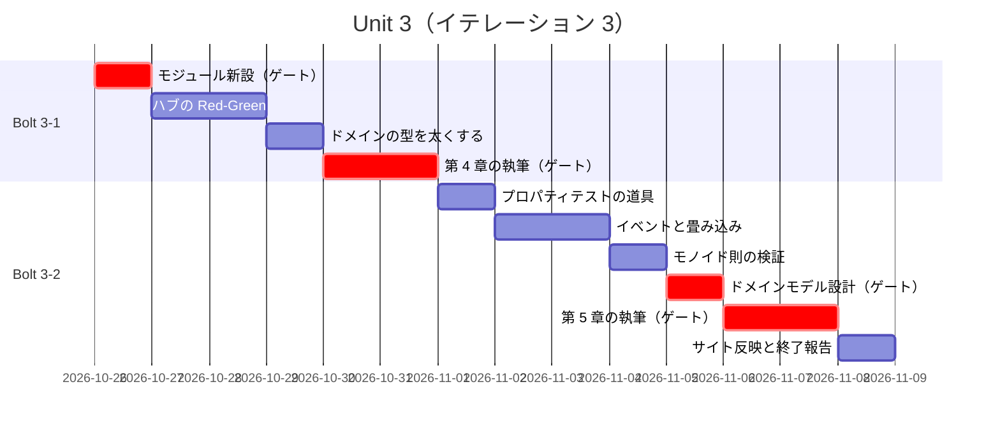
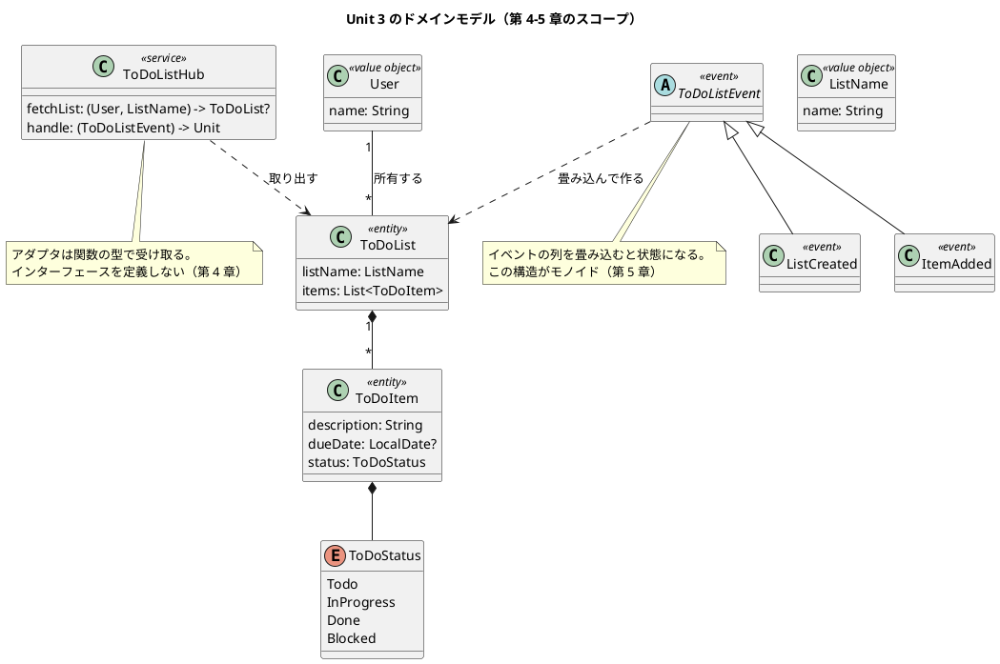
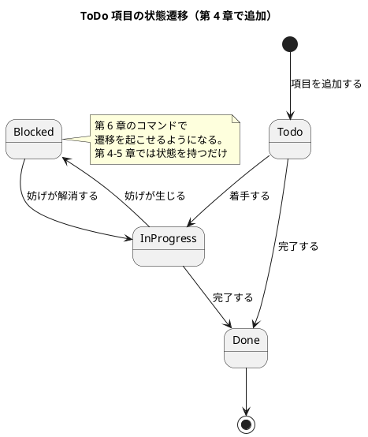

# Unit 3 の Bolt 計画（イテレーション 3）- Zettai 連載（Kotlin 版）

## 概要

| 項目 | 内容 |
|------|------|
| **イテレーション** | 3 |
| **Unit** | Unit 3 関数型 DI とイベント |
| **期間** | 2026-10-26 〜 2026-11-06（2 週間） |
| **Bolt 数** | 2（Bolt 3-1 第 4 章 / Bolt 3-2 第 5 章） |
| **局面** | **中盤（インサイドアウト）**。序盤からの移行 |
| **ゲート密度** | **疎**（[Unit 2 の Bolt 終了報告](bolt_report-2.md) の判断） |
| **人の検証負荷** | 13 ポイント |
| **前 Unit** | [Unit 2](iteration_plan-2.md)（完了。[Bolt 終了報告](bolt_report-2.md)） |

参照元と正は Unit 1・2 と同じです。本 Unit から [バックエンドアーキテクチャ設計](../design/architecture_backend.md) と [UI 設計](../design/ui_design.md) が `docs/design/` 側の正になります。

---

## 局面移行の確認

本 Unit は **序盤 → 中盤** の境界です。[開発戦略](development_strategy.md) が定める移行時の 3 点を、計画の着手前に確認しました。

| 確認事項 | 結果 |
| :--- | :--- |
| 1. 前局面の受け入れテストがすべて green | ✅ `./gradlew check` が green（22 テスト） |
| 2. 前局面で作った設計が `docs/design/` に反映されている | ✅ `architecture_backend.md`・`ui_design.md` を作成済み |
| 3. 次局面のアプローチが実装状況に照らして妥当か | ✅ 妥当（下記） |

### アプローチをインサイドアウトに切り替える根拠

[コーディングとテストガイド](../reference/コーディングとテストガイド.md) の実装アプローチ選択フローに当てはめます。

| 判断 | 現在の状況 | 導かれるアプローチ |
| :--- | :--- | :--- |
| 基本 CRUD 実装済みか | **はい**（第 2 章で表示、第 3 章で受け入れテストの入口） | 次の判断へ |
| ドメインロジックが複雑か | **はい**（イベントの畳み込み・モノイド） | ドメインモデル中心 |
| API 実装済みか | **はい**（`GET /todo/{user}/{listname}`） | **インサイドアウト活用** |

選択フローの「API 実装済み → インサイドアウト活用」に当たります。既存の API を利用しつつ、内部実装を改善していく段階です。

**本 Unit から扱う内容が、ドメイン層の中で完結する設計**であることも理由です。イベントの畳み込みもモノイドも、HTTP から見れば何も変わりません。外側から入ると、確かめたいこと（畳み込みが正しいか、モノイド則が成り立つか）に届く前に HTTP の層を通ることになります。

### 受け入れテストの扱い

インサイドアウトに切り替えても、**Unit 2 で作った受け入れテストは毎回実行します**。ドメインを作り替えたときに、外から見た振る舞いが変わっていないことを確かめるためです。

- 新しいシナリオを追加するのは、外から見える振る舞いが増えたときだけ（第 5 章のリスト作成表示）
- ドメインの中の設計変更（畳み込みへの置き換え）では、既存シナリオが green のままであることを確認する

---

## Unit 2 からの持ち込み

| # | 持ち込み項目 | 消化するステップ | 根拠 |
| :--- | :--- | :--- | :--- |
| 1 | `zettai-step2-domain` モジュールを新設する | 3-1.1 | 章の進行でモジュールを増やす方針（[アーキテクチャ設計](../design/architecture_backend.md)） |
| 2 | `ToDoItem` に期限（`dueDate`）と状態（`status`）を追加する | 3-1.3 | 第 4 章の「関数型ドメインモデリング」で必要になる |
| 3 | `docs/design/domain-model.md` を作成する | 3-2.7 | [開発戦略](development_strategy.md) が Unit 3 を初回作成としている |
| 4 | 状態遷移図を作成する | 3-2.7 | `status` が入るため。Unit 2 では対象が無く省略した |
| 5 | `null` によるエラー表現の問題を第 7 章まで持ち越すことを記事で再確認する | 3-1.6 | 読者が「なぜ直さないのか」を疑問に持ったまま進まないようにする |

Unit 2 の学びのうち、次の 2 つを本計画に織り込んでいます。

- **学び 1（前の章の記事は構造的に古くなる）**: 第 4 章で `ToDoItem` にフィールドを追加すると、第 2〜3 章のコード例が古くなります。**記事のコード例検査が検出するので、検出されたら第 2〜3 章にマーカーを足す**ことをステップ 3-1.7 に入れました
- **学び 3（状態の漏れ）**: 第 5 章でイベントを扱うと状態の管理が増えます。DDT の経路オブジェクトの `prepare()` を見直すステップを 3-2.5 に入れました

---

## ゴール

### Unit 完了時の達成状態

1. **アダプタが差し替え可能になっている**: 関数型の依存性注入により、ドメインの中核（ハブ）がアダプタの実装を知らない
2. **状態変更がイベントで表されている**: ToDo リストの状態が、イベントの列を畳み込んだ結果として得られる
3. **モノイドが見えている**: 畳み込みの構造が代数的性質を持つことを、プロパティベーステストで示せている
4. **ドメインモデルが文書化されている**: `docs/design/domain-model.md` と状態遷移図がある
5. **第 4〜5 章が公開されている**

### 成功基準

- [x] `zettai-step2-domain` モジュールで `./gradlew check` が green
- [x] ハブ（`ToDoListHub`）がアダプタの具体実装に依存しない
- [x] ToDo リストの状態がイベントの畳み込みで得られる
- [x] モノイド則（結合律・単位元）がプロパティベーステストで green
- [x] 既存の受け入れテスト（Unit 2 の DDT）が 2 経路とも green のまま（回帰なし）
- [x] 第 5 章のリスト作成表示が新しいシナリオとして DDT に追加されている
- [x] カバレッジ 80% 以上（ドメイン層）
- [x] 記事のコード例検査が第 1〜5 章で違反 0 件
- [x] `docs/design/domain-model.md` と状態遷移図が作成されている

---

## Unit 3 の満足条件

### ユーザーストーリー

| ID | ユーザーストーリー | 検証負荷 | 優先度 |
|----|-------------------|----|----|
| US-004 | 第 4 章「ドメインとアダプタのモデリング」を公開する | 5 | 必須 |
| US-005 | 第 5 章「イベントで状態を変更する」を公開する | 8 | 必須 |
| **合計** | | **13** | |

#### US-004: 第 4 章「ドメインとアダプタのモデリング」を公開する

**ストーリー**:
> 読者として、ドメインの中核がアダプタの都合に引きずられない書き方を知りたい。なぜなら、永続化やフレームワークを変えるたびに業務ロジックを書き直すことになるからだ。

**受入条件**:

1. ハブ（`ToDoListHub`）が、アダプタを関数の型として受け取る
2. ハブのテストが、アダプタの実装を用意せずにラムダで書ける
3. `ToDoItem` に期限（`dueDate`）と状態（`status`）が追加されている
4. `zettai-step2-domain` モジュールで `./gradlew check` が green
5. 節構成が [章構成マインドマップ](../article/draft.md) の第 4 章（ToDo リストを変更するための新しいストーリーを始める／関数型の「依存性の注入」を使う／関数型コードをデバックする／関数型ドメインモデリング／まとめ）と一致している

#### US-005: 第 5 章「イベントで状態を変更する」を公開する

**ストーリー**:
> 読者として、状態の変更を「上書き」ではなく「出来事の積み重ね」として表す方法を知りたい。なぜなら、上書きでは「なぜ今この状態なのか」が失われるからだ。

**受入条件**:

1. ToDo リストの状態が、イベントの列を畳み込んだ結果として得られる
2. 畳み込みが再帰と `fold` の両方で書かれ、対応が説明されている
3. モノイド則（結合律・単位元）がプロパティベーステストで検証されている
4. リストの作成が画面に反映され、DDT の新しいシナリオが green
5. 節構成が [章構成マインドマップ](../article/draft.md) の第 5 章（ToDo リストの作成の表示／状態変更の保存／再帰の力を解き放つ／イベントを畳み込む／モノイドの発見／まとめ）と一致している

### NFR 定義（Unit 3 固有）

| NFR | 内容 | 判定方法 |
| :--- | :--- | :--- |
| ドメインの独立性 | `zettai.domain` がフレームワークを import しない | `DomainBoundaryTest`（Unit 2 で作成） |
| テスト実行時間 | `./gradlew check` が 2 分以内 | CI のジョブ時間 |
| カバレッジ | ドメイン層 80% 以上 | Kover |
| 記事とコードの一致 | 第 1〜5 章で違反 0 件 | CI の記事コード例検査 |

### 測定基準

| 測定基準 | Unit 3 での目標 | Intent とのつながり |
| :--- | :--- | :--- |
| 公開済みの章 | 5 / 13 | 全 13 章公開 |
| 記事とサンプル実装の一致 | 100%（CI で機械検証） | 「動くサンプル実装つき」 |
| 既存シナリオの回帰 | 0 件 | 章をまたいで設計を作り替えても壊れない |

---

## エントロピー評価

| 評価軸 | 評価 | 根拠 | 対応 |
| :--- | :--- | :--- | :--- |
| 意図の曖昧さ | **LOW** | 節構成が確定し、受入条件がテストで判定できる | — |
| 構造的不確実性 | **LOW** | ドメインとアダプタの境界は Unit 2 で確定済み。本 Unit はその内側を太くする | — |
| 検証の不確実性 | **MED** | 代数的性質（モノイド則）を例示テストで示すのは不十分で、プロパティベーステストが要る。**その道具がまだ無い** | ステップ 3-2.1 で導入方法を決める。ライブラリ導入なら停止 |
| リスク | **LOW** | データベース・セキュリティへの影響なし。新規ライブラリはプロパティベーステストの分のみ | ライブラリ導入時のみ停止 |
| 未解決の仮定 | **LOW** | 使う道具（http4k・Pesticide・Kover）はすべて Unit 2 で検証済み | — |

**総合**: MED が 1 軸、残り LOW。[Unit 2 の Bolt 終了報告](bolt_report-2.md) の判断どおり、**ゲート密度は疎**とします。

Unit 1・2 と違い、**スパイクを先頭に置きません**。未解決の仮定が LOW だからです。ただしプロパティベーステストの道具は未定なので、ステップ 3-2.1 で決めます。

---

## スコープ・深さ・テスト戦略

| 軸 | 選択 | 理由 |
| :--- | :--- | :--- |
| スコープ | **全ステージ** | 本番機能。ドメイン設計・実装・テスト・設計ドキュメントまで通す |
| 深さ | **Standard** | Unit 2 と同じ |
| テスト戦略 | **Standard** | 本番機能。加えて代数的性質はプロパティベーステストで担保する |

---

## Bolt 3-1: 関数型の依存性注入（第 4 章）

### Bolt ゴール

> ドメインの中核をハブとして切り出し、アダプタを関数の型で受け取る形にして第 4 章として公開する。**確認したい仮説**: 第 2 章で 1 本引いた矢印（`ToDoListFetcher`）を一般化したとき、インターフェースを使う設計と比べて何が具体的に楽になるかを、記事で示せる粒度で言語化できるか。

### ステップ計画

- [x] **3-1.1 モジュールの新設**（**持ち込み 1**）: `zettai-step2-domain` を作り、`zettai-step1-http` の内容を引き継ぐ
  - 完了判定: `./gradlew :zettai-step2-domain:check` が green
  - **人の確認が必要**（新規ファイル・構造変更）
- [x] **3-1.2 ハブのテストを書く（Red）**: ToDo リストを取得する操作をハブ経由にするテストを書く
- [x] **3-1.3 ドメインの型を太くする**（**持ち込み 2**）: `ToDoItem` に `dueDate`（任意）と `status` を追加する
  - 完了判定: 既存のテストが通るように既定値を与えるか、テスト側を更新する
- [x] **3-1.4 ハブを実装する（Green）**: `ToDoListHub` がアダプタを関数の型で受け取る形にする
- [x] **3-1.5 リファクタリングとデバッグの観察**: 関数型のコードをデバッガで追うときに何が見えるかを確かめ、記事の材料にする
- [x] **3-1.6 第 4 章の骨子と執筆**（**持ち込み 5**）: `null` によるエラー表現を第 7 章まで持ち越す理由を読者に再確認する節を含める
  - **人の確認が必要**（記事の構成と全文。疎いゲート密度でも記事は止める）
- [x] **3-1.7 記事のコード例検査と前章の追従**（**学び 1**）: 検査を全章に対して実行し、`ToDoItem` の変更で古くなった第 2〜3 章のコード例にマーカーを足す
  - 完了判定: 第 1〜4 章で違反 0 件
- [x] **3-1.8 サイト反映**

### Bolt 3-1 の完了条件

- [x] `zettai-step2-domain` で `./gradlew check` が green
- [x] ハブがアダプタの具体実装に依存しない
- [x] `ToDoItem` に `dueDate` と `status` がある
- [x] 既存の受け入れテストが 2 経路とも green（回帰なし）
- [x] 第 4 章が公開されている
- [x] 確認したい仮説に答えが出ている

---

## Bolt 3-2: イベントで状態を変更する（第 5 章）

### Bolt ゴール

> ToDo リストの状態をイベントの畳み込みで表し、その構造がモノイドであることをプロパティベーステストで示して第 5 章として公開する。**確認したい仮説**: 「モノイド」という言葉を使わずに構造を説明し、最後に名前を与える順序で書いたとき、読者がその抽象に到達できる記事になるか。

### ステップ計画

- [x] **3-2.1 プロパティベーステストの道具を決める**: 既存のテストライブラリ（JUnit 5 の `@ParameterizedTest`、自前のジェネレータ、kotest-property）から選ぶ
  - 完了判定: 選択が根拠つきで決まり、モノイド則を書ける見通しが立っている
  - **人の確認が必要**（新規ライブラリを導入する場合のみ）
- [x] **3-2.2 イベントのテストを書く（Red）**: リストの作成・項目の追加をイベントとして表し、畳み込んだ結果が期待する状態になることを確かめる
- [x] **3-2.3 再帰で畳み込みを実装する（Green）**: まず再帰で書く。第 1 章のボウリングと同じ形が現れることを確かめる
- [x] **3-2.4 `fold` に置き換える（Refactor）**: 再帰と `fold` の対応を示す。テストは green のまま
- [x] **3-2.5 DDT に新しいシナリオを追加する**（**学び 3**）: リスト作成の表示をシナリオにする。経路オブジェクトの `prepare()` が新しい状態も初期化しているか確認する
  - 完了判定: 新旧すべてのシナリオが 2 経路で green
- [x] **3-2.6 モノイド則をプロパティベーステストで示す**: 結合律と単位元を確かめる
- [x] **3-2.7 設計ドキュメントの作成と反映**（**持ち込み 3・4**）: `docs/design/domain-model.md` にドメインモデル図・状態遷移図・ユビキタス言語の対訳表を書く。あわせて「注（設計ドキュメントへの反映が必要）」の 4 項目を反映する
  - 完了判定: `domain-model.md` があり、`architecture_backend.md` と `ui_design.md` が本 Unit の実装と一致している
  - **人の確認が必要**（新規ファイル作成・設計ドキュメントの起点）
- [x] **3-2.8 第 5 章の骨子と執筆**
  - **人の確認が必要**（記事の構成と全文）
- [x] **3-2.9 サイト反映と OKF 適用**
- [x] **3-2.10 Bolt 終了報告**: 実績を記録し、判断と学びをジャーナルに転記する。**疎いゲート密度が機能したかを評価する**

### Bolt 3-2 の完了条件

- [x] 状態がイベントの畳み込みで得られる
- [x] 再帰と `fold` の対応が示されている
- [x] モノイド則がプロパティベーステストで green
- [x] 新旧すべての DDT シナリオが 2 経路で green
- [x] `docs/design/domain-model.md` が作成されている
- [x] 第 5 章が公開されている

---

## 受入条件とステップの対応

| ストーリー | 受入条件 | カバーするステップ | 判定方法 |
| :--- | :--- | :--- | :--- |
| US-004 | 1. ハブがアダプタを関数の型で受け取る | 3-1.4 | 型の定義を目視 |
| US-004 | 2. ハブのテストがラムダで書ける | 3-1.2 | テストコードに実装クラスが無いこと |
| US-004 | 3. `ToDoItem` に `dueDate` と `status` | 3-1.3 | 型の定義 |
| US-004 | 4. `zettai-step2-domain` が green | 3-1.1 | `./gradlew check` |
| US-004 | 5. 節構成が一致 | 3-1.6 | 見出しの突合（人の検証） |
| US-005 | 1. 状態が畳み込みで得られる | 3-2.2・3-2.3 | ドメインのテスト |
| US-005 | 2. 再帰と `fold` の対応 | 3-2.3・3-2.4 | 記事の記述（人の検証） |
| US-005 | 3. モノイド則の検証 | 3-2.6 | プロパティベーステスト |
| US-005 | 4. リスト作成の表示と DDT | 3-2.5 | `./gradlew check` |
| US-005 | 5. 節構成が一致 | 3-2.8 | 見出しの突合（人の検証） |

---

## 承認ゲートとゲート密度

### 本 Unit のゲート密度: 疎（自律実行に寄せる）

[Unit 2 の Bolt 終了報告](bolt_report-2.md) で決めた方針に従います。エントロピー評価も MED が 1 軸のみで、この判断を裏付けています。

停止するステップは **5 箇所**です（Unit 2 は 11 箇所）。

| ステップ | 停止理由 |
| :--- | :--- |
| 3-1.1 | 新規ファイル・構造変更（確認必須） |
| 3-1.6 / 3-2.8 | 記事の構成と全文検証。**疎にしても記事は止める** |
| 3-2.1 | 新規ライブラリを導入する場合のみ（確認必須） |
| 3-2.7 | 新規ファイル作成・設計ドキュメントの起点 |

それ以外は AI が連続して進め、**テスト失敗・未確認の仮定の発生・確認必須の操作に該当したときは必ず停止**します。

### 疎にしたことの評価

本 Unit の終了報告で、**疎いゲート密度が機能したかを評価します**。指標は変更依頼数です。Unit 1・2 はいずれも 1 件でした。疎にして変更依頼が増えるなら、ゲートが手戻りを防いでいたことになります。

---

## スケジュール



---

## 設計

### ドメインモデル図（本 Unit のスコープ）



イベントの具体的な型は第 5 章、コマンドは第 6 章（Unit 4）です。本 Unit では**イベントを状態変更の表現として導入するところまで**とし、コマンドからイベントを生成する仕組みには踏み込みません。

### 状態遷移図（本 Unit のスコープ）



**持ち込み 4 を消化しています。** Unit 2 では対象が無く省略していた図です。

### ディレクトリ構成

[バックエンドアーキテクチャ設計](../design/architecture_backend.md) のパッケージ構成表では、`domain/events/` の初回作成を第 5 章としています。本 Unit で作ります。

```text
apps/kotlin/zettai/
├── settings.gradle.kts              # zettai-step2-domain を include（3-1.1）
└── zettai-step2-domain/             # 新設
    ├── build.gradle.kts
    └── src/
        ├── main/kotlin/zettai/
        │   ├── domain/
        │   │   ├── ToDoList.kt      # dueDate・status を追加（3-1.3）
        │   │   ├── ToDoListHub.kt   # 新設（3-1.4）
        │   │   └── events/          # 新設（3-2.2）
        │   │       └── ToDoListEvent.kt
        │   └── web/
        └── test/kotlin/zettai/
            ├── domain/
            ├── ddt/                 # 新しいシナリオを追加（3-2.5）
            └── smoke/

docs/design/
└── domain-model.md                  # 新設（3-2.7）
```

`zettai-step1-http` はそのまま残します。読者が「第 3 章時点のコード」を参照できるようにするためです（[アーキテクチャ設計](../design/architecture_backend.md) のモジュール分割方針）。

### 注（設計ドキュメントへの反映が必要）

検証（`validating-design` 軸 B）で、[アーキテクチャ設計](../design/architecture_backend.md) に反映が要る項目を検出しました。**ステップ 3-2.7 で反映します。**

| 反映先 | 内容 |
| :--- | :--- |
| `architecture_backend.md` のポートの一覧 | `ToDoListHub` が受け取るアダプタ（イベントの保存・取得）を行として追加する。現在は `ToDoListFetcher` の 1 行のみ |
| `architecture_backend.md` のモジュール一覧 | `zettai-step2-domain` を「作成済み」に更新する |
| `architecture_backend.md` のパッケージ構成 | `domain/events/` を「作成済み」に更新する |
| `ui_design.md` の画面一覧・画面遷移図 | リスト作成の表示（第 5 章）を追加する |

### ER 図・画面遷移図

| 設計図 | 本 Unit での扱い |
| :--- | :--- |
| ER 図 | **省略**。永続化は第 9 章（Unit 5）。データはインメモリのまま |
| 画面遷移図 | **第 5 章で更新**。リスト作成の表示が加わるため、[UI 設計](../design/ui_design.md) の画面遷移図に反映する（ステップ 3-2.7） |

**ユーザーマニュアルは本 Unit でも対象外です。** 画面は増えますが、操作可能なアプリケーションになるのは第 6 章（コマンド）以降です。Unit 4 で要否を再判断します。

### ADR

| ADR | タイトル | ステータス |
|-----|---------|-----------|
| [`ADR-005`](../adr/ADR-005-property-based-testing.md) | プロパティベーステストを自前で書き kotest-property を導入しない | **提案** |

ライブラリを導入しない判断（既存の仕組みで書く）になった場合も、その根拠を ADR に残します。**入れない判断こそ、後から蒸し返されやすいためです**（ADR-004 と同じ理由）。

---

## リスクと対策

| リスク | 影響度 | 対策 | 承認ゲート |
| :--- | :--- | :--- | :--- |
| `ToDoItem` にフィールドを追加すると、第 2〜3 章のコード例が古くなる | 中 | 記事のコード例検査が検出する。検出されたらマーカーを足す（ステップ 3-1.7） | — |
| モノイドの説明が抽象的になり、読者が離れる | 高 | 「モノイド」という言葉を使わずに構造を説明し、**最後に名前を与える**順序で書く。Bolt ゴールの仮説として明示した | ステップ 3-2.8 で全文検証 |
| プロパティベーステストの道具を入れると依存が増える | 低 | 既存の仕組みで書けないかを先に検討する。入れるなら ADR に残す | ステップ 3-2.1 |
| ゲートを疎にしたことで手戻りが増える | 中 | 変更依頼数を計測し、終了報告で評価する。増えたら Unit 4 で密に戻す | — |
| 局面移行でアプローチが変わり、進め方がぶれる | 中 | 不変の規律（TDD の三原則・1 コミット 1 変更・品質基準・ユビキタス言語・記事とコードの一致）は変えない。変わるのはテストの入口だけ | — |

---

## Deployment Unit としての完了条件

### Definition of Done

- [x] `zettai-step2-domain` で `./gradlew check` が green
- [x] ハブがアダプタの具体実装に依存しない
- [x] 状態がイベントの畳み込みで得られる
- [x] モノイド則がプロパティベーステストで green
- [x] 新旧すべての DDT シナリオが 2 経路で green（回帰なし）
- [x] カバレッジ 80% 以上（ドメイン層）
- [x] `DomainBoundaryTest` が green（ドメインがフレームワークに依存しない）
- [x] 記事のコード例検査が第 1〜5 章で違反 0 件
- [x] 第 4〜5 章が公開され、節構成がマインドマップと一致している
- [x] `docs/design/domain-model.md` が作成され、[アーキテクチャ設計](../design/architecture_backend.md)（ポート・モジュール・パッケージ）と [UI 設計](../design/ui_design.md)（画面一覧・画面遷移図）が本 Unit の実装と一致している
- [x] ADR-005 を作成済み（導入・不導入のいずれでも）
- [x] `gulp okf:check` が ERROR 0
- [x] 実装と記事のコミットが分かれている
- [x] 承認ゲート 5 箇所を通過した
- [x] Bolt 終了報告を作成し、**疎いゲート密度の評価**を記録した
- [x] デモ項目がすべて実演できる

### デモ項目

1. ハブのテストを開き、アダプタをラムダで差し替えていることを示す
2. `ToDoItem` の定義を開き、期限と状態が追加されていることを示す
3. イベントの列から状態を組み立てるテストを実行し、green になることを示す
4. モノイド則のプロパティベーステストを実行し、ランダムな入力で green になることを示す
5. 既存の DDT シナリオが 2 経路とも green のままであることを示す（回帰なし）
6. リスト作成の表示を新しいシナリオで実演する

---

## 指標（Bolt 終了報告へ引き継ぐ）

| 指標 | 計画 | 実績 |
| :--- | :--- | :--- |
| 完了 Unit 数 | 1（累計 3 / 7） | **1（累計 3 / 7）** |
| 承認ゲート通過数 | 5（予定。Unit 2 は 11） | **5** |
| 変更依頼数 | - | **0** |
| リードタイム | 10 営業日 | **1 日** |
| カバレッジ（ドメイン層） | 80% 以上 | **100%** |
| 持ち込み項目の消化 | 5 / 5 | **5 / 5** |
| 既存シナリオの回帰 | 0 件 | **0 件** |

**ゲート数を 11 → 5 に減らした影響**を、変更依頼数と回帰件数で見ます。

---

## 更新履歴

| 日付 | 更新内容 | 更新者 |
|------|---------|--------|
| 2026-09-27 | Unit 3 完了。全 18 ステップと承認ゲート 5 箇所を通過し、Deployment Unit として検証。疎いゲート密度で変更依頼 0 件・回帰 0 件を達成 | claude-code/claude-opus-5 |
| 2026-09-27 | 検証（`validating-design` 軸 B）で 2 件の不整合を修正。ディレクトリ構成の節を追加（`domain/events/` の初回作成が抜けていた）、アーキテクチャ設計への反映が必要な 4 項目を「注」として明記しステップ 3-2.7 に組み込んだ | claude-code/claude-opus-5 |
| 2026-09-27 | 初版作成（AI-DLC 準拠）。序盤から中盤への局面移行の確認、アプローチをインサイドアウトに切り替える根拠、Unit 2 からの持ち込み 5 項目と学び 2 件の織り込み、エントロピー評価、疎いゲート密度（5 箇所）、ドメインモデル図と状態遷移図、Deployment Unit の完了条件を定義 | claude-code/claude-opus-5 |

---

## 関連ドキュメント

- [リリース計画](release_plan.md)
- [開発戦略](development_strategy.md)
- [Unit 2 の Bolt 計画](iteration_plan-2.md) / [Bolt 終了報告](bolt_report-2.md)
- [バックエンドアーキテクチャ設計](../design/architecture_backend.md) / [UI 設計](../design/ui_design.md)
- Unit 3 の Bolt 終了報告（`bolt_report-3.md`。Unit 完了時に作成）
