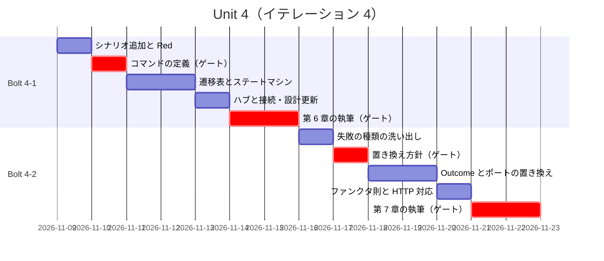
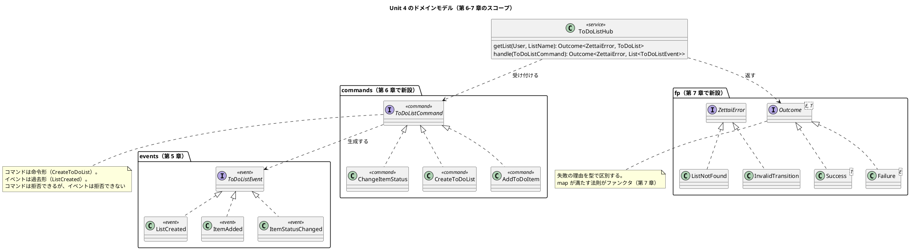
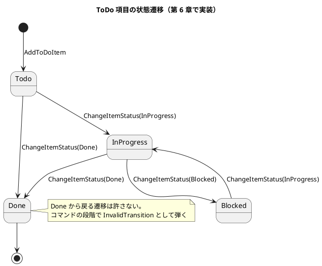
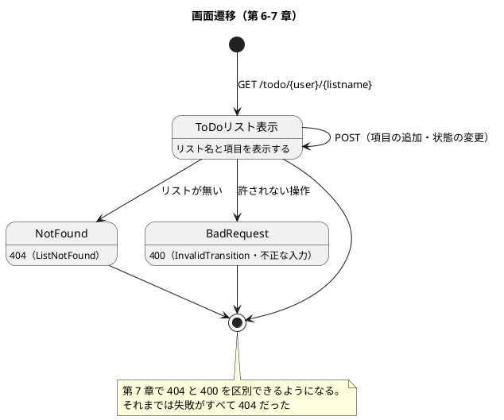

# Unit 4 の Bolt 計画（イテレーション 4）- Zettai 連載（Kotlin 版）

## 概要

| 項目 | 内容 |
|------|------|
| **イテレーション** | 4 |
| **Unit** | Unit 4 コマンドとエラーハンドリング |
| **期間** | 2026-11-09 〜 2026-11-20（2 週間） |
| **Bolt 数** | 2（Bolt 4-1 第 6 章 / Bolt 4-2 第 7 章） |
| **局面** | 中盤（インサイドアウト） |
| **ゲート密度** | **疎**（据え置き。停止 4 箇所。ポートの型変更にゲートを 1 つ足す） |
| **人の検証負荷** | 10 ポイント |
| **前 Unit** | [Unit 3](iteration_plan-3.md)（完了。[Bolt 終了報告](bolt_report-3.md)） |

---

## この Unit の山: ポートの型が変わる

本 Unit には、これまでと性質の違う作業が 1 つあります。**第 7 章で `ToDoListFetcher` の戻り値が `ToDoList?` から `Outcome<...>` に変わります。**

第 2 章から「ポートの型が変わらなければ、上のコードは変わらない」と書いてきました。今回は**型そのものが変わる**ので、その前提が効きません。

| 影響先 | 変更の内容 |
| :--- | :--- |
| `ToDoListFetcher` | 戻り値が `ToDoList?` → `Outcome<ZettaiError, ToDoList>` |
| `ToDoListHub` | `getList` の戻り値も連動して変わる |
| `Zettai`（HTTP アダプタ） | `?:` による 404 の分岐を、`Outcome` の分岐に変える |
| DDT の 2 経路 | `getToDoList` の戻り値の扱いが変わる |
| 第 2・4 章の記事 | コード例が古くなる（検査が検出する） |

**第 2 章から積み上げた「矢印で依存を表す」設計が、本当に変更を楽にしているかが試されます。** 楽でなかった場合、その事実を記事に書きます。設計の宣伝ではなく、実際に起きたことを書くのが本連載の方針です。

この置き換えの方針を決めるステップ（4-2.2）は、**疎いゲート密度でも停止させます**。影響範囲が広く、後から方針を変えると全部やり直しになるためです。

---

## Unit 3 からの持ち込み

| # | 持ち込み項目 | 消化するステップ | 根拠 |
| :--- | :--- | :--- | :--- |
| 1 | コマンド（`domain/commands/`）を新設する | 4-1.2 | [アーキテクチャ設計](../design/architecture_backend.md) が第 6 章を初回作成としている |
| 2 | `ToDoStatus` の状態遷移を実装する | 4-1.5 | 第 4 章では型に場所を作っただけ。[ドメインモデル設計](../design/domain-model.md) の状態遷移図を実装する |
| 3 | `fp/Outcome` を新設する | 4-2.3 | 第 7 章の主題 |
| 4 | `ToDoListFetcher` の戻り値を `Outcome` にする | 4-2.4 | 上記「この Unit の山」 |
| 5 | ファンクタ則をプロパティベーステストで検証する | 4-2.5 | モノイドと同じ形で書ける（[ADR-005](../adr/ADR-005-property-based-testing.md)） |
| 6 | ユーザーマニュアルの要否を判断する | **完了**（4-1.8。作らない判断を [開発戦略](development_strategy.md) に記載済み） | 第 6 章で操作可能になるため |
| 7 | `domain-model.md` の状態遷移図の注記を更新する | 4-1.7 | 「第 6 章で実装される」→「実装済み」 |

### 持ち込み 6 の判断: ユーザーマニュアルは作らない

**Zettai にはエンドユーザーがいません。** 連載の題材として作っているアプリケーションであり、読者は「Zettai を使う人」ではなく「Zettai を作る過程を読む人」です。

| 読者の立場 | 必要なもの | 本連載での提供 |
| :--- | :--- | :--- |
| 作る過程を読む | 設計の説明と動くコード | 記事そのもの |
| 手元で動かす | 起動手順と確認方法 | 各章の記事 + `apps/kotlin/zettai/README.md` |
| 運用する | — | **該当者がいない** |

よって `creating-manual` の対象外とします。**これは Unit 4 限りの判断ではなく、本連載を通じての判断です。** 以降の Unit で繰り返し判断しません（Unit 2・3 では「次の Unit で再判断」としていましたが、ここで打ち切ります）。

判断は [開発戦略](development_strategy.md) の「進捗管理の手段」に反映済みです（本計画の作成時に反映）。計画のたびに蒸し返しません。

### Unit 3 の学びの織り込み

| 学び | 本計画への織り込み |
| :--- | :--- |
| ゲートを外せるのは、人が見ていた判断を機械に移せたときだけ | 疎いゲート密度を据え置くが、**機械化できていない判断（記事の全文、`Outcome` 置き換えの方針）は停止させる** |
| スパイクは儀式ではなく、未解決の仮定への対処 | 未解決の仮定が LOW のためスパイクを置かない |
| 抽象概念は名前を最後に出す | 第 7 章のファンクタも「構造 → 性質 → 名前 → 身の回りの例」の順で書く（Bolt 4-2 のゴールに明記） |
| 教材の題材は後の章で回収されるように選ぶ | 第 7 章のファンクタは、第 5 章のモノイドと**同じ検証の形**（プロパティベーステスト）で書けることを示す |

---

## ゴール

### Unit 完了時の達成状態

1. **利用者の意図がコマンドで表されている**: リストの作成・項目の追加・状態の変更がコマンドとして表され、コマンドからイベントが生成される
2. **状態遷移が実装されている**: `ToDoStatus` の遷移が、許される遷移だけ通るようになっている
3. **失敗が型に載っている**: `null` ではなく `Outcome` で失敗を表し、失敗の理由が区別できる
4. **ファンクタが見えている**: `Outcome` の `map` が満たす法則を、プロパティベーステストで示せている
5. **第 6〜7 章が公開されている**

### 成功基準

- [x] コマンドからイベントが生成され、状態が変わる
- [x] 許されない状態遷移が弾かれる（`Done` から `InProgress` へ戻らない等）
- [x] `ToDoListFetcher` の戻り値が `Outcome` になり、失敗の理由が区別できる
- [x] ファンクタ則（恒等・合成）がプロパティベーステストで green
- [x] 既存の DDT シナリオが 2 経路とも green（型が変わっても回帰なし）
- [x] 新しいシナリオ（項目の追加・状態の変更）が green
- [x] カバレッジ 80% 以上（ドメイン層）
- [x] 記事のコード例検査が第 1〜7 章で違反 0 件
- [x] `domain-model.md` の状態遷移図が「実装済み」に更新されている
- [x] ユーザーマニュアルを作らない判断が [開発戦略](development_strategy.md) に反映されている

---

## Unit 4 の満足条件

### ユーザーストーリー

| ID | ユーザーストーリー | 検証負荷 | 優先度 |
|----|-------------------|----|----|
| US-006 | 第 6 章「コマンドを実行してイベントを生成する」を公開する | 5 | 必須 |
| US-007 | 第 7 章「関数型手法によるエラーハンドリング」を公開する | 5 | 必須 |
| **合計** | | **10** | |

#### US-006: 第 6 章「コマンドを実行してイベントを生成する」を公開する

**ストーリー**:
> 利用者として、ToDo リストを作ったり項目を追加したりしたい。なぜなら、読むだけのアプリケーションでは役に立たないからだ。

**受入条件**:

1. コマンド（`CreateToDoList`・`AddToDoItem`・`ChangeItemStatus`）が定義されている
2. コマンドを処理するとイベントが生成され、状態が変わる
3. 許されない状態遷移がコマンドの段階で弾かれる
4. ハブがコマンドを受け付ける
5. 節構成が [章構成マインドマップ](../article/draft.md) の第 6 章（新しい ToDo リストの作成／コマンドを使って状態を変更する／状態とイベントによるドメインのモデリング／関数型ステートマシンを記述する／ハブと接続する／コマンドとイベントを深く知る／まとめ）と一致している

#### US-007: 第 7 章「関数型手法によるエラーハンドリング」を公開する

**ストーリー**:
> 利用者として、操作が失敗したときに何が起きたのか知りたい。なぜなら、「見つかりません」だけでは次に何をすればいいか分からないからだ。

**受入条件**:

1. `Outcome` 型があり、成功と失敗を区別できる
2. 失敗の理由が型で区別できる（見つからない・許されない遷移・不正な入力）
3. `ToDoListFetcher` と `ToDoListHub` の戻り値が `Outcome` になっている
4. `Outcome` に `map`（および `transform`）があり、ファンクタ則を満たす
5. HTTP アダプタが失敗の種類に応じてステータスコードを返す
6. 節構成が [章構成マインドマップ](../article/draft.md) の第 7 章（より適切なエラー処理／ファンクタと圏を学ぶ／ファンクタを使ったエラーハンドリング／`Outcome` を使って実装する／まとめ）と一致している

### NFR 定義（Unit 4 固有）

| NFR | 内容 | 判定方法 |
| :--- | :--- | :--- |
| ドメインの独立性 | `zettai.domain` と `zettai.fp` がフレームワークを import しない | `DomainBoundaryTest`（検査対象に `fp` を追加する） |
| 後方互換の破棄の明示 | ポートの型が変わったことが記事と設計ドキュメントに書かれている | 人の検証 |
| カバレッジ | ドメイン層 80% 以上 | Kover |
| 記事とコードの一致 | 第 1〜7 章で違反 0 件 | CI の記事コード例検査 |

### 測定基準

| 測定基準 | Unit 4 での目標 | Intent とのつながり |
| :--- | :--- | :--- |
| 公開済みの章 | 7 / 13 | 全 13 章公開 |
| 既存シナリオの回帰 | 0 件 | **ポートの型が変わっても回帰しないこと**が、積み上げた設計の価値を示す |
| 記事とサンプル実装の一致 | 100% | 「動くサンプル実装つき」 |

---

## エントロピー評価

| 評価軸 | 評価 | 根拠 | 対応 |
| :--- | :--- | :--- | :--- |
| 意図の曖昧さ | **LOW** | 節構成が確定し、受入条件がテストで判定できる | — |
| 構造的不確実性 | **MED** | ドメインの境界は確定済み。しかし **`Outcome` の導入でポートの型が変わり、影響が全レイヤーに及ぶ**。どこまで一度に変えるかの判断が要る | ステップ 4-2.2 で置き換えの方針を決め、人の承認を得る |
| 検証の不確実性 | **MED** | ファンクタ則はプロパティベーステストで書ける（モノイドで確立した形）。一方、**状態遷移の網羅性**は例示テストで漏れやすい | 遷移表を作り、許される遷移と許されない遷移を表から起こす |
| リスク | **LOW** | データベース・セキュリティへの影響なし。新規ライブラリなし | — |
| 未解決の仮定 | **LOW** | 道具はすべて検証済み。`Outcome` は自前で書く | — |

**総合**: MED が 2 軸、残り LOW。Unit 3（MED 1 軸）より 1 軸増えています。

ゲート密度は**疎のまま据え置き**ますが、**構造的不確実性 MED の原因（ポートの型変更）に対してゲートを 1 つ足します**（ステップ 4-2.2）。Unit 3 の学び「機械に移せていない判断のゲートは外せない」に従った判断です。この判断は自動判定できません。

---

## スコープ・深さ・テスト戦略

| 軸 | 選択 | 理由 |
| :--- | :--- | :--- |
| スコープ | **全ステージ** | 本番機能。設計・実装・テスト・設計ドキュメントまで通す |
| 深さ | **Standard** | Unit 2・3 と同じ |
| テスト戦略 | **Standard** | 本番機能。加えて状態遷移は遷移表から網羅し、ファンクタ則はプロパティベーステストで担保する |

---

## Bolt 4-1: コマンドと関数型ステートマシン（第 6 章）

### Bolt ゴール

> 利用者の意図をコマンドとして表し、コマンドからイベントを生成する関数型ステートマシンを書いて第 6 章として公開する。**確認したい仮説**: コマンドとイベントを分けることの利益を、「両方あると冗長では」という読者の当然の疑問に答える形で示せるか。

### ステップ計画

- [x] **4-1.1 新しいシナリオを DDT に追加する（Red）**: 項目を追加する、項目の状態を変えるシナリオを書く
  - 完了判定: シナリオが実行され、期待どおり失敗する
- [x] **4-1.2 コマンドを定義する**（**持ち込み 1**）: `domain/commands/` に `CreateToDoList`・`AddToDoItem`・`ChangeItemStatus` を置く
  - **人の確認が必要**（新規ファイル・パッケージの新設）
- [x] **4-1.3 遷移表を作る**: `ToDoStatus` の許される遷移と許されない遷移を表にする
  - 完了判定: [ドメインモデル設計](../design/domain-model.md) の状態遷移図と一致している
- [x] **4-1.4 コマンドの処理をテストから書く（Red）**: 遷移表の各行をテストにする。**許されない遷移のテストも書く**
- [x] **4-1.5 関数型ステートマシンを実装する（Green）**（**持ち込み 2**）: コマンドと現在の状態からイベントを生成する関数を書く
  - 完了判定: 遷移表のすべての行が green
- [x] **4-1.6 ハブと接続する**: ハブがコマンドを受け付け、生成されたイベントを保存する
  - 完了判定: 4-1.1 のシナリオが 2 経路とも green
- [x] **4-1.7 設計ドキュメントの更新**（**持ち込み 7**）: `domain-model.md` の状態遷移図の注記を「実装済み」にし、コマンドを要素表に追加する
- [x] **4-1.8 開発戦略の更新**（**持ち込み 6**）: ユーザーマニュアルを作らない判断と、GitHub に同期しない判断を記載する（**本計画の作成時に完了**）
- [x] **4-1.9 第 6 章の骨子と執筆**
  - **人の確認が必要**（記事の構成と全文）
- [x] **4-1.10 記事のコード例検査と前章の追従・サイト反映**

### Bolt 4-1 の完了条件

- [x] コマンドからイベントが生成され、状態が変わる
- [x] 遷移表のすべての行が green（許されない遷移を含む）
- [x] 新旧すべての DDT シナリオが 2 経路で green
- [x] `domain-model.md` と [開発戦略](development_strategy.md) が更新されている
- [x] 第 6 章が公開されている
- [x] 確認したい仮説に答えが出ている

---

## Bolt 4-2: Outcome によるエラーハンドリング（第 7 章）

### Bolt ゴール

> 失敗を `null` ではなく型で表し、その `map` が満たす法則を確かめて第 7 章として公開する。**確認したい仮説**: ポートの型が変わるという「これまでの前提が崩れる変更」を通して、第 2 章から積み上げた設計が実際に変更を楽にしているかを測れるか。楽でなかったならその事実を書く。

### ステップ計画

- [x] **4-2.1 失敗の種類を洗い出す**: 現在 `null` で表している失敗が、実際には何種類あるかを列挙する
  - 完了判定: 失敗の型（見つからない・許されない遷移・不正な入力）が確定している
- [x] **4-2.2 置き換えの方針を決める**: `Outcome` への置き換えをどこまで一度に行うかを決める
  - 完了判定: 影響範囲（ポート・ハブ・HTTP アダプタ・DDT の 2 経路・第 2・4 章の記事）と、一度に変える範囲が確定している
  - **人の確認が必要**（**疎いゲート密度の例外**。構造的不確実性 MED の原因であり、後から方針を変えると全部やり直しになる）
- [x] **4-2.3 `Outcome` をテストから書く（Red → Green）**（**持ち込み 3**）: `fp/Outcome.kt` に成功と失敗を表す型を置く
  - 完了判定: `map`・`transform`・`orElse` 相当の操作が動く
- [x] **4-2.4 ポートの型を置き換える**（**持ち込み 4**）: `ToDoListFetcher` と `ToDoListHub` の戻り値を `Outcome` にし、影響先をすべて直す
  - 完了判定: `./gradlew check` が green。**既存の DDT シナリオが 2 経路とも green（回帰なし）**
  - 完了後に**変更が必要だったファイル数を記録する**（設計の価値を測る材料）
- [x] **4-2.5 ファンクタ則をプロパティベーステストで示す**（**持ち込み 5**）: 恒等則と合成則を確かめる
  - 完了判定: ランダム入力で green。モノイドと同じ形で書けていること
- [x] **4-2.6 HTTP アダプタを失敗の種類に対応させる**: 404 と 400 を区別する
  - 完了判定: DDT に失敗のシナリオを追加し、green
- [x] **4-2.7 第 7 章の骨子と執筆**: ファンクタは「構造 → 性質 → 名前 → 身の回りの例」の順で書く
  - **人の確認が必要**（記事の構成と全文）
- [x] **4-2.8 記事のコード例検査・サイト反映・OKF 適用**
- [x] **4-2.9 Bolt 終了報告**: 実績を記録する。**ポートの型変更で何ファイル変わったかを記録し、設計の価値を評価する**

### Bolt 4-2 の完了条件

- [x] `Outcome` があり、失敗の理由が型で区別できる
- [x] ポートの型が `Outcome` になり、影響先がすべて直っている
- [x] ファンクタ則がプロパティベーステストで green
- [x] 既存の DDT シナリオが 2 経路とも green（回帰なし）
- [x] HTTP アダプタが 404 と 400 を区別する
- [x] 第 7 章が公開されている
- [x] **ポートの型変更で変わったファイル数が記録されている**

---

## 受入条件とステップの対応

| ストーリー | 受入条件 | カバーするステップ | 判定方法 |
| :--- | :--- | :--- | :--- |
| US-006 | 1. コマンドが定義されている | 4-1.2 | 型の定義 |
| US-006 | 2. コマンドからイベントが生成される | 4-1.5 | ドメインのテスト |
| US-006 | 3. 許されない遷移が弾かれる | 4-1.3・4-1.4・4-1.5 | 遷移表のテスト |
| US-006 | 4. ハブがコマンドを受け付ける | 4-1.6 | DDT |
| US-006 | 5. 節構成が一致 | 4-1.9 | 見出しの突合（人の検証） |
| US-007 | 1. `Outcome` が成功と失敗を区別 | 4-2.3 | 型のテスト |
| US-007 | 2. 失敗の理由が型で区別できる | 4-2.1・4-2.3 | 型の定義 |
| US-007 | 3. ポートとハブの戻り値が `Outcome` | 4-2.4 | 型の定義・`./gradlew check` |
| US-007 | 4. ファンクタ則を満たす | 4-2.5 | プロパティベーステスト |
| US-007 | 5. HTTP が失敗の種類に応じる | 4-2.6 | DDT |
| US-007 | 6. 節構成が一致 | 4-2.7 | 見出しの突合（人の検証） |

---

## 承認ゲートとゲート密度

### 本 Unit のゲート密度: 疎（ただし 1 つ足す）

Unit 3 で疎が機能したため据え置きます。停止するのは **4 箇所**です（Unit 3 は 5 箇所）。

| ステップ | 停止理由 |
| :--- | :--- |
| 4-1.2 | 新規ファイル・パッケージの新設（確認必須） |
| 4-1.9 / 4-2.7 | 記事の構成と全文検証。機械化できていない |
| **4-2.2** | **本 Unit で足したゲート。** ポートの型変更の方針。構造的不確実性 MED の原因で、後から変えると全部やり直しになる |

Unit 3 の学び「機械に移せていない判断のゲートは外せない」に従い、**エントロピー評価で MED が増えた原因にゲートを当てています**。ゲートの数を機械的に維持するのではなく、不確実性のある場所に置きます。

---

## スケジュール

---

## 設計

### ドメインモデル図（本 Unit のスコープ）

### 状態遷移図（本 Unit で実装される）

**遷移表（ステップ 4-1.3 で確定させ、4-1.4 のテストの元にする）**

| 現在 | → Todo | → InProgress | → Done | → Blocked |
| :--- | :--- | :--- | :--- | :--- |
| Todo | — | 許す | 許す | 許さない |
| InProgress | 許さない | — | 許す | 許す |
| Done | 許さない | 許さない | — | 許さない |
| Blocked | 許さない | 許す | 許さない | — |

**許さない遷移もテストにします。** 許す遷移だけを確かめると、「実は何でも通る」実装でも green になります。

### 画面遷移図（本 Unit で更新）

### ER 図

**省略**。永続化は第 9 章（Unit 5）。データはインメモリのまま。

### ユーザーマニュアル

**作りません。** Zettai にエンドユーザーがいないためです（前述「持ち込み 6 の判断」）。この判断は [開発戦略](development_strategy.md) の「進捗管理の手段」に反映済みで、以降の計画では蒸し返しません。

### ADR

| ADR | タイトル | ステータス |
|-----|---------|-----------|
| [`ADR-006`](../adr/ADR-006-outcome-port-type.md) | 失敗を `Outcome` で表しポートの型を変える | **提案** |

**後方互換を壊す変更**なので ADR に残します。第 2 章から「ポートの型が変わらなければ上は変わらない」と書いてきた前提を、自分で破ることになります。その判断の理由を記録しないと、後から読んだ人が混乱します。

---

## リスクと対策

| リスク | 影響度 | 対策 | 承認ゲート |
| :--- | :--- | :--- | :--- |
| **`Outcome` の導入で影響が広がり、途中で手が止まる** | 高 | ステップ 4-2.2 で一度に変える範囲を決めてから着手する。ポート → ハブ → HTTP → DDT の順に、各段階で `check` を green に保つ | 4-2.2 で停止 |
| 状態遷移のテストが「許す遷移」だけになり、網羅性が落ちる | 中 | 遷移表を先に作り、**16 マスすべて**をテストの元にする | — |
| ファンクタの説明が抽象的になる | 高 | モノイドで機能した「構造 → 性質 → 名前 → 身の回りの例」の順序を使う。Bolt ゴールに明記した | 4-2.7 で全文検証 |
| コマンドとイベントの両方があることを読者が冗長に感じる | 中 | 「コマンドは拒否できるが、イベントは拒否できない」という違いを最初に示す。Bolt 4-1 の仮説として明示した | 4-1.9 で全文検証 |
| 第 2・4 章の記事のコード例が古くなる | 中 | 記事のコード例検査が検出する。検出されたらマーカーを足す | — |
| ポートの型が変わったことで、積み上げた設計の価値に疑問が生じる | 中 | **変更が必要だったファイル数を記録し、事実として記事に書く。** 設計を弁護せず、起きたことを書く | 4-2.9 |

---

## Deployment Unit としての完了条件

### Definition of Done

- [x] コマンドからイベントが生成され、状態が変わる
- [x] 遷移表の 16 マスすべてがテストされている
- [x] `Outcome` があり、失敗の理由が型で区別できる
- [x] ポートとハブの戻り値が `Outcome` になっている
- [x] ファンクタ則がプロパティベーステストで green
- [x] 新旧すべての DDT シナリオが 2 経路で green（回帰なし）
- [x] HTTP アダプタが 404 と 400 を区別する
- [x] カバレッジ 80% 以上（ドメイン層）
- [x] `DomainBoundaryTest` の検査対象に `fp` パッケージが追加され green
- [x] 記事のコード例検査が第 1〜7 章で違反 0 件
- [x] 第 6〜7 章が公開され、節構成がマインドマップと一致している
- [x] `domain-model.md` にコマンドが追加され、状態遷移図が「実装済み」になっている
- [x] [開発戦略](development_strategy.md) にユーザーマニュアルを作らない判断が記載されている
- [x] ADR-006 を作成済み
- [x] `gulp okf:check` が ERROR 0
- [x] 承認ゲート 4 箇所を通過した
- [x] Bolt 終了報告を作成し、**ポートの型変更で変わったファイル数**を記録した
- [x] デモ項目がすべて実演できる

### デモ項目

1. コマンドを処理してイベントが生成され、状態が変わることを示す
2. 許されない状態遷移（`Done` → `InProgress`）がコマンドの段階で弾かれることを示す
3. 遷移表の 16 マスに対応するテストが green であることを示す
4. `Outcome` の失敗が理由ごとに区別できることを示す
5. ファンクタ則のプロパティベーステストが green であることを示す
6. HTTP で存在しないリストは 404、許されない操作は 400 が返ることを示す
7. **既存の DDT シナリオが 2 経路とも green であることを示す**（ポートの型が変わっても回帰していない）

デモ項目 7 が本 Unit の要点です。**型を変えても外から見た振る舞いが変わらないこと**が、第 3 章で作った受け入れテストの入口の価値を示します。

---

## 指標（Bolt 終了報告へ引き継ぐ）

| 指標 | 計画 | 実績 |
| :--- | :--- | :--- |
| 完了 Unit 数 | 1（累計 4 / 7） | **1（累計 4 / 7）** |
| 承認ゲート通過数 | 4（Unit 3 は 5） | **4** |
| 変更依頼数 | - | **0** |
| リードタイム | 10 営業日 | **1 日** |
| カバレッジ（ドメイン層） | 80% 以上 | **99%** |
| 持ち込み項目の消化 | 7 / 7 | **7 / 7** |
| 既存シナリオの回帰 | 0 件 | **0 件** |
| **ポートの型変更で変わったファイル数** | - | **6** |

最後の行が本 Unit 固有です。**第 2 章から積み上げた設計が変更を楽にしているかを測る唯一の数字**なので、必ず記録します。

---

## 更新履歴

| 日付 | 更新内容 | 更新者 |
|------|---------|--------|
| 2026-09-27 | Unit 4 完了。全 19 ステップと承認ゲート 4 箇所を通過し、Deployment Unit として検証。ポートの型変更の波及は 6 ファイル。ドメインの中核と受け入れテストのシナリオには波及しなかった | claude-code/claude-opus-5 |
| 2026-09-27 | 初版作成（AI-DLC 準拠）。ポートの型が変わる影響の見積もり、Unit 3 からの持ち込み 7 項目と学び 4 件の織り込み、ユーザーマニュアルを作らない判断（連載を通じての判断として確定）、エントロピー評価（MED 2 軸）、疎いゲート密度に 1 つ足す判断、遷移表 16 マス、Deployment Unit の完了条件を定義 | claude-code/claude-opus-5 |

---

## 関連ドキュメント

- [リリース計画](release_plan.md) / [開発戦略](development_strategy.md)
- [Unit 3 の Bolt 計画](iteration_plan-3.md) / [Bolt 終了報告](bolt_report-3.md)
- [ドメインモデル設計](../design/domain-model.md) / [バックエンドアーキテクチャ設計](../design/architecture_backend.md) / [UI 設計](../design/ui_design.md)
- Unit 4 の Bolt 終了報告（`bolt_report-4.md`。Unit 完了時に作成）
