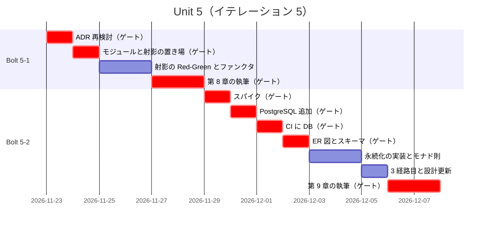
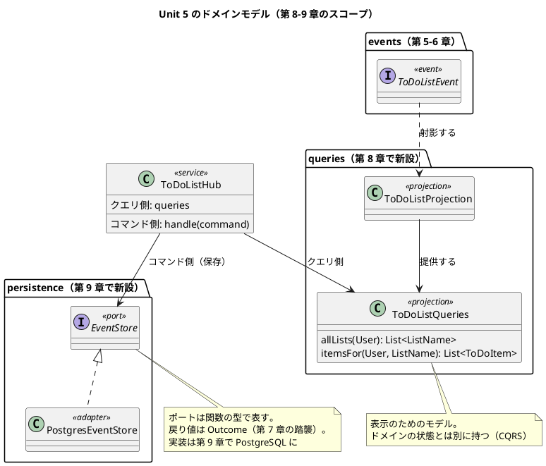
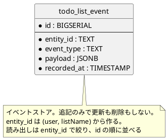

# Unit 5 の Bolt 計画（イテレーション 5）- Zettai 連載（Kotlin 版）

## 概要

| 項目 | 内容 |
|------|------|
| **イテレーション** | 5 |
| **Unit** | Unit 5 射影と永続化 |
| **期間** | 2026-11-23 〜 2026-12-04（2 週間） |
| **Bolt 数** | 2（Bolt 5-1 第 8 章 / Bolt 5-2 第 9 章） |
| **局面** | 中盤（インサイドアウト）。Phase 2 の最後 |
| **ゲート密度** | **密に戻す**（停止 8 箇所。Unit 4 は 4 箇所） |
| **人の検証負荷** | 13 ポイント |
| **前 Unit** | [Unit 4](iteration_plan-4.md)（完了。[Bolt 終了報告](bolt_report-4.md)） |

---

## ゲート密度を密に戻す

Unit 3・4 は疎（5 箇所・4 箇所）で変更依頼 0 件でした。それでも本 Unit は**密に戻します**。

[リリース計画](release_plan.md) のエントロピー評価で、Unit 5 は **検証の不確実性 HIGH / リスク HIGH** です。

| 新しく現れる判断 | 機械に移せているか |
| :--- | :--- |
| `docker-compose.yml` への PostgreSQL 追加 | **いいえ**（`CLAUDE.md` の確認必須） |
| 結合テストがローカルと CI で安定するか | **いいえ**（実際に走らせるまで分からない） |
| イベントをどう保存するか（スキーマ設計） | **いいえ** |
| 結合テストを `check` に組み込むか | **いいえ**（CI の実行時間との兼ね合い） |
| ER 図とデータモデルの設計 | **いいえ**（初回作成） |

Unit 3・4 で疎にできたのは「**人が見ていた判断を機械に移せていたから**」です（[Unit 3 の Bolt 終了報告](bolt_report-3.md) の学び 1）。本 Unit で現れる判断は、まだどれも機械に移せていません。**減らしたまま突っ込みません。**

---

## Unit 4 からの持ち込み

| # | 持ち込み項目 | 消化するステップ | 根拠 |
| :--- | :--- | :--- | :--- |
| 1 | モジュールの扱いを決める（章とモジュールの対応が 2 章ずれている） | **本計画で判断済み**（後述） | [アーキテクチャ設計](../design/architecture_backend.md) のモジュール表と実態が乖離している |
| 2 | 射影（`domain/queries/`）を新設する | 5-1.2 | [アーキテクチャ設計](../design/architecture_backend.md) が第 8 章を初回作成としている |
| 3 | `docker-compose.yml` に PostgreSQL を追加する | 5-2.2 | **確認必須**（`CLAUDE.md` のデータベース） |
| 4 | `docs/design/data-model.md` と ER 図を作成する | 5-2.7 | [開発戦略](development_strategy.md) が Unit 5 を初回作成としている |
| 5 | モナド則をプロパティベーステストで検証する | 5-2.6 | モノイド・ファンクタと同じ形 |
| 6 | 静的解析の導入を再検討する | 5-1.1 | [ADR-004](../adr/ADR-004-static-analysis.md) が Unit 5 を再検討時期としている |
| 7 | プロパティベーステストのライブラリ導入を再検討する | 5-1.1 | [ADR-005](../adr/ADR-005-property-based-testing.md) が Unit 5 を目安としている |
| 8 | 結合テストを `check` に組み込むかを決める | 5-2.3 | CI の実行時間との兼ね合い |

### 持ち込み 1 の判断: モジュールは Unit の境界で切る

[アーキテクチャ設計](../design/architecture_backend.md) のモジュール表は、原著のコンパニオンコードの 7 段階（`zettai_stepN_*`）に対応させる前提で書かれていました。実態と乖離しています。

| 計画時の想定 | 実態 |
| :--- | :--- |
| `zettai-step2-domain` は第 4〜5 章 | 第 4〜7 章を含む |
| `zettai-step3-events` は第 5〜6 章 | **作られなかった** |
| `zettai-step4-projections` は第 7〜8 章 | 未作成 |

原著の段階と本連載の章の区切りが一致しないためです（[執筆計画](../article/outline.md) に「7 段階しかなく 13 章と 1 対 1 に対応しない」と書いてあったとおり）。

**モジュールは Unit の境界（= 2 章）で切ります。** 名前は内容を表すものにし、原著の段階番号には合わせません。

| モジュール | 章 | Unit |
| :--- | :--- | :--- |
| `zettai-step1-http` | 1〜3 | Unit 1〜2 |
| `zettai-step2-domain` | 4〜7 | Unit 3〜4 |
| `zettai-step3-persistence` | 8〜9 | **Unit 5（本 Unit で新設）** |

理由は、**読者が「その Unit の終わりの状態」を丸ごと参照できる**ことです。章ごとに切ると細かすぎ、全部 1 つにすると過去の状態が残りません。

この変更を [アーキテクチャ設計](../design/architecture_backend.md) に反映します（ステップ 5-1.2）。

### Unit 4 の学びの織り込み

| 学び | 本計画への織り込み |
| :--- | :--- |
| コンパイルが通ったから正しいとは限らない（`@UnsafeVariance`） | モナドの実装で `flatMap` の変性を扱う。**型パラメータに `@UnsafeVariance` を使う場面が出たら、必ず実行時のテストを書く**（ステップ 5-2.5 の完了判定に含めた） |
| 受け入れテストが表示の不足を教えてくれた（2 経路） | 第 9 章で**3 経路目（PostgreSQL 経由）**を追加する。既存 2 経路と同じシナリオが通ることを確認する |
| 表を先に作ると判断の漏れが見える | ER 図とテーブル定義を、実装より先に作る（ステップ 5-2.4 を 5-2.5 より前に置いた） |
| 引数を足すと呼び出し側の書き方が壊れる | ハブにアダプタを足す際、既存の呼び出しが壊れないか確認する |
| 「入れない」判断には期限を付ける | 本 Unit で 2 件（ADR-004・005）の期限が来た。**期限が来た判断は必ず見直す**（ステップ 5-1.1） |

---

## ゴール

### Unit 完了時の達成状態

1. **クエリ側が分離されている**: 表示のためのモデルが、イベントの射影として得られる
2. **CQRS に到達している**: コマンド側とクエリ側が別の経路を持つ
3. **永続化されている**: イベントが PostgreSQL に保存され、再起動しても状態が復元される
4. **モナドが見えている**: データベースアクセスの合成が満たす法則を、プロパティベーステストで示せている
5. **第 8〜9 章が公開されている**
6. **Release v0.2.0 の条件を満たしている**（Phase 2 の完了）

### 成功基準

- [ ] 射影が動き、クエリ側のモデルが得られる
- [ ] イベントが PostgreSQL に保存され、読み戻せる
- [ ] 結合テストがローカルで green
- [ ] 結合テストが CI で green（安定して）
- [ ] モナド則（左恒等・右恒等・結合律）がプロパティベーステストで green
- [ ] DDT の**3 経路**（ドメイン直接・HTTP 経由・PostgreSQL 経由）で同じシナリオが green
- [ ] カバレッジ 80% 以上（ドメイン層）
- [ ] 記事のコード例検査が第 1〜9 章で違反 0 件
- [ ] `docs/design/data-model.md` と ER 図が作成されている
- [ ] ADR-004・ADR-005 の再検討結果が記録されている
- [ ] Release v0.2.0 のリリース条件を満たしている

---

## Unit 5 の満足条件

### ユーザーストーリー

| ID | ユーザーストーリー | 検証負荷 | 優先度 |
|----|-------------------|----|----|
| US-008 | 第 8 章「ファンクタを使ってイベントを射影する」を公開する | 5 | 必須 |
| US-009 | 第 9 章「モナドによる安全なデータ永続化」を公開する | 8 | 必須 |
| **合計** | | **13** | |

#### US-008: 第 8 章「ファンクタを使ってイベントを射影する」を公開する

**ストーリー**:
> 読者として、表示のためのデータを状態から毎回組み立てずに済む方法を知りたい。なぜなら、画面が増えるたびにドメインの状態を読み替える処理が散らばるからだ。

**受入条件**:

1. 射影（`domain/queries/`）があり、イベントから表示用のモデルを作れる
2. 射影がファンクタとして振る舞う（第 7 章の `map` と同じ形で合成できる）
3. コマンド側（`handle`）とクエリ側（射影）が別の経路になっている
4. 既存の DDT シナリオが 2 経路とも green（回帰なし）
5. 節構成が [章構成マインドマップ](../article/draft.md) の第 8 章（イベントを射影する／ファンクタに対するクエリの実行／ファンクタの観点から考察する／コマンドクエリ責務分離(CQRS)／まとめ）と一致している

#### US-009: 第 9 章「モナドによる安全なデータ永続化」を公開する

**ストーリー**:
> 利用者として、アプリケーションを再起動しても ToDo リストが残っていてほしい。なぜなら、消えるなら記録する意味がないからだ。

**受入条件**:

1. イベントが PostgreSQL に保存され、読み戻せる
2. 結合テストがローカルと CI の両方で green
3. データベースアクセスが合成可能な形（モナド）で組み立てられている
4. **永続化の失敗が `Outcome` で表されている。** 第 7 章で確立した `ZettaiError` に `PersistenceError` を加え、DB 接続の失敗を `null` や例外で表さない
5. モナド則（左恒等・右恒等・結合律）がプロパティベーステストで検証されている
6. DDT に PostgreSQL 経由の経路が追加され、既存シナリオが green
7. 節構成が [章構成マインドマップ](../article/draft.md) の第 9 章（安全に永続化する／PostgreSQL と結合テスト／Kotlin でデータベースに接続する／データベースを準備する／関数型スタイルでリモートデータにアクセスする／モナドの力を探る／まとめ）と一致している

### NFR 定義（Unit 5 固有）

| NFR | 内容 | 判定方法 |
| :--- | :--- | :--- |
| ドメインの独立性 | `zettai.domain` と `zettai.fp` が JDBC / Exposed を import しない | `DomainBoundaryTest`（検査対象に既に含まれている） |
| 結合テストの安定性 | 同じテストを 3 回連続で実行して 3 回 green | ローカルと CI で確認 |
| テスト実行時間 | `./gradlew check` が 5 分以内（結合テストを含む場合） | CI のジョブ時間。超えたら分離を検討 |
| 起動の再現性 | クリーンな環境で `docker compose up` → `./gradlew check` が追加手順なしで green | 第 9 章の記事の手順だけで通ること |
| カバレッジ | ドメイン層 80% 以上 | Kover |

### 測定基準

| 測定基準 | Unit 5 での目標 | Intent とのつながり |
| :--- | :--- | :--- |
| 公開済みの章 | 9 / 13 | 全 13 章公開 |
| 再現手順の完全性 | 第 9 章の手順だけで DB を含む環境が動く | 「読者が手元で再現できる」 |
| 既存シナリオの回帰 | 0 件 | 永続化を入れても外から見た振る舞いは変わらない |

---

## エントロピー評価

| 評価軸 | 評価 | 根拠 | 対応 |
| :--- | :--- | :--- | :--- |
| 意図の曖昧さ | **LOW** | 節構成が確定し、受入条件がテストで判定できる | — |
| 構造的不確実性 | **MED** | ドメインとアダプタの境界は確定済み。一方、**射影をどこに置くか**（ドメインかアダプタか）と**イベントストアの形**が未確定 | ステップ 5-1.2・5-2.4 で人の承認を得る |
| 検証の不確実性 | **HIGH** | **結合テストがローカルと CI で安定するかが未知。** Docker の起動待ち、ポートの衝突、テスト間のデータ残留が起きうる | 3 回連続 green を NFR にした。不安定なら原因を特定し、リトライで隠さない |
| リスク | **HIGH** | **`docker-compose.yml` の変更は確認必須。** CI に DB サービスが増え、実行時間とコストが上がる | ステップ 5-2.2 で停止。CI の設計も同時に決める |
| 未解決の仮定 | **HIGH** | 「Exposed 0.61.0 が Kotlin 2.2 で動く」「Testcontainers を使わず docker-compose で CI が回る」「イベントの追記だけなら ORM は不要か」がいずれも未検証 | **ステップ 5-2.1 をスパイクにする** |

**総合**: HIGH が 3 軸。Unit 1 以来もっとも不確実性が高い Unit です。

**スパイクを置きます**（Unit 3・4 では置きませんでした）。[Unit 3 の Bolt 終了報告](bolt_report-3.md) の学びどおり、**スパイクは儀式ではなく未解決の仮定への対処**です。今回は仮定が 3 つあります。

---

## スコープ・深さ・テスト戦略

| 軸 | 選択 | 理由 |
| :--- | :--- | :--- |
| スコープ | **全ステージ** | 本番機能。データモデル設計が加わる |
| 深さ | **Standard** | Unit 2〜4 と同じ |
| テスト戦略 | **Standard** | 本番機能。加えて結合テストとモナド則のプロパティベーステストを追加する |

---

## Bolt 5-1: 射影と CQRS（第 8 章）

### Bolt ゴール

> イベントから表示用のモデルを作る射影を書き、コマンド側とクエリ側を分けて第 8 章として公開する。**確認したい仮説**: CQRS を「パターンの導入」ではなく「困りごとの解決」として説明できるか。第 5 章から状態を 1 つの `ToDoListState` で持ってきたことの限界を示せるか。

### ステップ計画

- [ ] **5-1.1 期限が来た判断を見直す**（**持ち込み 6・7**）: [ADR-004](../adr/ADR-004-static-analysis.md)（静的解析）と [ADR-005](../adr/ADR-005-property-based-testing.md)（プロパティベーステストのライブラリ）の再検討条件を確認し、入れるか入れないかを判断する
  - 完了判定: 両方について判断が決まり、ADR に追記されている（**入れない場合も次の再検討時期を書く**）
  - **人の確認が必要**（新規ライブラリの導入可否）
- [ ] **5-1.2 モジュールと射影の置き場を決める**（**持ち込み 1・2**）: `zettai-step3-persistence` を新設し、射影を `domain/queries/` に置く。[アーキテクチャ設計](../design/architecture_backend.md) のモジュール表を実態に合わせる
  - **人の確認が必要**（新規ファイル・構造変更・設計ドキュメントの修正）
- [ ] **5-1.3 射影のテストを書く（Red）**: イベントの列から表示用のモデルを作るテストを書く
- [ ] **5-1.4 射影を実装する（Green）**: 第 5 章の畳み込みを、表示用のモデルに対して行う
- [ ] **5-1.5 射影がファンクタであることを確かめる**: 第 7 章の `map` と同じ形で合成できることをテストで示す
- [ ] **5-1.6 コマンド側とクエリ側を分ける（Refactor）**: ハブのクエリ経路を射影経由にする
  - 完了判定: 既存の DDT シナリオが 2 経路とも green（回帰なし）
- [ ] **5-1.7 第 8 章の骨子と執筆**
  - **人の確認が必要**（記事の構成と全文）
- [ ] **5-1.8 記事のコード例検査と前章の追従・サイト反映**

### Bolt 5-1 の完了条件

- [ ] 射影が動き、クエリ側のモデルが得られる
- [ ] 射影がファンクタとして合成できる
- [ ] コマンド側とクエリ側が別の経路になっている
- [ ] 既存の DDT シナリオが 2 経路とも green
- [ ] ADR-004・ADR-005 の再検討結果が記録されている
- [ ] 第 8 章が公開されている

---

## Bolt 5-2: PostgreSQL への永続化（第 9 章）

### Bolt ゴール

> イベントを PostgreSQL に保存し、データベースアクセスを合成可能な形に組み立てて第 9 章として公開する。**確認したい仮説**: 結合テストがローカルと CI の両方で安定して green になるか。ならない場合、原因を特定して記事に書けるか（リトライで隠さない）。

### ステップ計画

- [ ] **5-2.1 スパイク**: Exposed 0.61.0 / PostgreSQL ドライバ 42.7.7 が Kotlin 2.2 で動くことを確かめ、**ORM を使うか生の JDBC で足りるか**を判断する。あわせて CI での DB の用意方法（`docker-compose` / GitHub Actions のサービスコンテナ / Testcontainers）を比較する
  - 入力: `docker-compose.yml`、`.github/workflows/kotlin-zettai.yml`、[執筆計画](../article/outline.md)（既存 compose に追加する方針）
  - 完了判定: 採用する構成が根拠つきで 1 案に絞られている。**イベントの追記と読み出しだけなら ORM が不要である可能性**を検討済み
  - **人の確認が必要**（未解決の仮定が HIGH。外部ライブラリの導入判断）
- [ ] **5-2.2 PostgreSQL の追加**（**持ち込み 3**）: `docker-compose.yml` にサービスを追加し、起動・停止の手順を決める
  - 完了判定: `docker compose up -d` で DB が起動し、接続できる
  - **人の確認が必要**（**データベース。`CLAUDE.md` の確認必須**）
  - 注: 起動・停止に運用タスクが必要なら `ops/scripts/` に一時スクリプトを置かず、`operating-script` スキルで正式な Gulp タスクとして追加する
- [ ] **5-2.3 CI に DB を用意する**（**持ち込み 8**）: 5-2.1 で決めた方法で CI に DB を追加し、結合テストを `check` に組み込むかを決める
  - 完了判定: CI が green。実行時間が NFR（5 分以内）を満たす。組み込まない場合は別ジョブに分ける
  - **人の確認が必要**（CI の構成変更）
- [ ] **5-2.4 ER 図とテーブル定義を作る**（**持ち込み 4**）: `docs/design/data-model.md` にイベントストアのスキーマを書く。**実装より先に作る**
  - 完了判定: ER 図・テーブル定義・インデックスの方針が決まっている
  - **人の確認が必要**（スキーマ設計。`CLAUDE.md` のデータベース）
- [ ] **5-2.5 永続化のテストを書き実装する（Red → Green）**: イベントの追記と読み出しを結合テストで確かめる
  - 完了判定: 結合テストが green。**3 回連続で green**（NFR）。失敗が `Outcome`（`PersistenceError`）で表されている。`@UnsafeVariance` を使う場面が出たら実行時のテストを必ず書く（Unit 4 の学び 1）
- [ ] **5-2.6 モナド則をプロパティベーステストで示す**（**持ち込み 5**）: 左恒等・右恒等・結合律を確かめる
  - 完了判定: ランダム入力で green。モノイド・ファンクタと同じ形で書けていること
- [ ] **5-2.7 DDT に 3 経路目を追加する**: PostgreSQL 経由の経路を追加し、既存シナリオが green になることを確認する
  - 完了判定: 3 経路すべてで同じシナリオが green
- [ ] **5-2.8 設計ドキュメントの更新**: [アーキテクチャ設計](../design/architecture_backend.md) のポート一覧・パッケージ構成、[ドメインモデル設計](../design/domain-model.md) の章ごとの成長を更新する
- [ ] **5-2.9 第 9 章の骨子と執筆**
  - **人の確認が必要**（記事の構成と全文）
- [ ] **5-2.10 サイト反映と OKF 適用・Release v0.2.0 の確認**
- [ ] **5-2.11 Bolt 終了報告**: 実績を記録する。**結合テストの安定性と、密に戻したことの評価**を含める

### Bolt 5-2 の完了条件

- [ ] イベントが PostgreSQL に保存され、読み戻せる
- [ ] 結合テストがローカルと CI で green（3 回連続）
- [ ] 永続化の失敗が `Outcome`（`PersistenceError`）で表されている
- [ ] モナド則がプロパティベーステストで green
- [ ] DDT の 3 経路で同じシナリオが green
- [ ] `docs/design/data-model.md` と ER 図がある
- [ ] 第 9 章が公開されている
- [ ] Release v0.2.0 のリリース条件を満たしている

---

## 受入条件とステップの対応

| ストーリー | 受入条件 | カバーするステップ | 判定方法 |
| :--- | :--- | :--- | :--- |
| US-008 | 1. 射影がある | 5-1.2・5-1.4 | ドメインのテスト |
| US-008 | 2. 射影がファンクタ | 5-1.5 | プロパティベーステスト |
| US-008 | 3. コマンド側とクエリ側が別経路 | 5-1.6 | 実装を目視 |
| US-008 | 4. 既存シナリオが green | 5-1.6 | `./gradlew check` |
| US-008 | 5. 節構成が一致 | 5-1.7 | 見出しの突合（人の検証） |
| US-009 | 1. イベントが保存され読み戻せる | 5-2.5 | 結合テスト |
| US-009 | 2. 結合テストがローカルと CI で green | 5-2.3・5-2.5 | CI のジョブ |
| US-009 | 3. DB アクセスが合成可能 | 5-2.5・5-2.6 | 型の定義とテスト |
| US-009 | 4. モナド則の検証 | 5-2.6 | プロパティベーステスト |
| US-009 | 5. 3 経路目の追加 | 5-2.7 | `./gradlew check` |
| US-009 | 6. 節構成が一致 | 5-2.9 | 見出しの突合（人の検証） |

---

## 承認ゲートとゲート密度

### 本 Unit のゲート密度: 密（8 箇所）

| ステップ | 停止理由 |
| :--- | :--- |
| 5-1.1 | 新規ライブラリの導入可否（ADR-004・005 の再検討） |
| 5-1.2 | 新規ファイル・構造変更・設計ドキュメントの修正 |
| 5-1.7 / 5-2.9 | 記事の構成と全文検証 |
| 5-2.1 | 未解決の仮定（HIGH）。スパイクの結果判断 |
| 5-2.2 | **データベース（確認必須）** |
| 5-2.3 | CI の構成変更 |
| 5-2.4 | スキーマ設計（確認必須） |

Unit 4 の 4 箇所から 8 箇所に増えています。**増やした箇所はすべて、新しく現れた「機械に移せていない判断」です。**

### モブの集中時間

想定稼働は 10 時間/週です。記事の全文検証 2 回に加え、スパイク結果の判断・DB とスキーマの設計・CI の構成という判断が集中します。**Week 1 の Day 1（スパイク）と Week 2 の Day 6-7（DB と CI）に、2 時間以上の連続した時間を先に確保します。**

---

## スケジュール



ゲートが 8 箇所あり、スケジュールの半分以上が `crit` です。**それが密なゲート密度の意味です。**

---

## 設計

### ドメインモデル図（本 Unit のスコープ）



### ポートの型（第 7 章の `Outcome` を踏襲する）

**検証（`validating-design` 軸 C）で検出した項目です。** 第 7 章で `null` によるエラー表現を `Outcome` に置き換えたのに、本 Unit のポートを素朴な型で書くと、また `null` や例外に戻ってしまいます。

| ポート | 型（案） | 章 |
| :--- | :--- | :--- |
| イベントの保存 | `(List<ToDoListEvent>) -> Outcome<ZettaiError, Unit>` | 9 |
| イベントの読み出し | `(EntityId) -> Outcome<ZettaiError, List<ToDoListEvent>>` | 9 |
| クエリ（射影） | `(User, ListName) -> Outcome<ZettaiError, List<ToDoItem>>` | 8 |

あわせて `ZettaiError` に失敗の型を 1 つ加えます。

| 名前 | 意味 | HTTP |
| :--- | :--- | :--- |
| `PersistenceError` | データベースへの接続・読み書きの失敗 | 500 |

`ZettaiError` は `sealed` なので、追加すると [第 7 章](../article/zettai/kotlin/chapter07.md) の `toResponse` がコンパイルエラーになります。**そこで扱い忘れに気づける**のが `sealed` を使う理由です。500 を返す分岐を足します。

第 6 章の `EventPersister = (List<ToDoListEvent>) -> Unit` も `Outcome` を返す形に変えます。インメモリでは失敗しませんが、PostgreSQL では失敗します。**ポートの型は「もっとも失敗しうる実装」に合わせます。**

### ER 図（本 Unit で初回作成）

**実装より先に作ります**（Unit 4 の学び 3）。現時点の案です。詳細はステップ 5-2.4 で確定させます。



**テーブルは 1 つだけです。** イベントソーシングでは状態を保存しないため、`todo_list` や `todo_item` のテーブルを作りません。この判断をステップ 5-2.4 で確定させ、記事にも書きます。

### 状態遷移図

**省略**。第 6 章で実装済みで、本 Unit で変更しません。[ドメインモデル設計](../design/domain-model.md) を参照。

### 画面遷移図

**省略**。本 Unit で画面は増えません。射影はクエリ側の内部構造の変更で、外から見た画面は変わりません。第 11 章（Unit 6）でテンプレートエンジンを導入する際に更新します。

### ユーザーマニュアル

**作りません**（[開発戦略](development_strategy.md) の「進捗管理の手段」で確定した方針）。

### ディレクトリ構成

```text
apps/kotlin/zettai/
├── settings.gradle.kts              # zettai-step3-persistence を include（5-1.2）
└── zettai-step3-persistence/        # 新設
    └── src/
        ├── main/kotlin/zettai/
        │   ├── domain/
        │   │   ├── events/
        │   │   ├── commands/
        │   │   └── queries/         # 新設（5-1.2）
        │   ├── fp/
        │   ├── persistence/         # 新設（5-2.5）
        │   └── web/
        └── test/kotlin/zettai/
            ├── ddt/                 # 3 経路目を追加（5-2.7）
            └── persistence/         # 結合テスト（5-2.5）

docs/design/
└── data-model.md                    # 新設（5-2.4）
```

### ADR

| ADR | タイトル | ステータス |
|-----|---------|-----------|
| `ADR-004`（追記） | 静的解析の再検討結果 | ステップ 5-1.1 |
| `ADR-005`（追記） | プロパティベーステストのライブラリの再検討結果 | ステップ 5-1.1 |
| `ADR-007` | モジュールを Unit の境界で切る | ステップ 5-1.2 |
| `ADR-008` | イベントストアを 1 テーブルで持ち、状態を保存しない | ステップ 5-2.4 |
| `ADR-009` | 結合テストの DB をどう用意するか（CI を含む） | ステップ 5-2.1・5-2.3 |

---

## リスクと対策

| リスク | 影響度 | 対策 | 承認ゲート |
| :--- | :--- | :--- | :--- |
| **結合テストが不安定になる（ローカルまたは CI）** | 高 | 3 回連続 green を NFR にした。**不安定ならリトライで隠さず、原因を特定して記事に書く**。データ残留はテストごとにスキーマを作り直すかトランザクションをロールバックする | 5-2.3・5-2.5 |
| CI の実行時間が伸びる | 中 | NFR を 5 分以内とし、超えたら結合テストを別ジョブに分ける | 5-2.3 |
| Exposed 0.61.0 が Kotlin 2.2 で動かない | 中 | スパイクで先に確かめる。**イベントの追記と読み出しだけなら ORM が不要な可能性**も検討する | 5-2.1 |
| `docker-compose.yml` の変更が既存サービス（dev・mkdocs・plantuml）に影響する | 中 | サービスの追加のみとし、既存の定義を変えない。`docker compose config` で検証する | 5-2.2 |
| スキーマ設計を誤ると後続の章に波及する | 高 | ER 図を実装より先に作り、人の承認を得る。**イベントストアは追記のみなのでスキーマ変更の余地が小さい**ことを利点として活かす | 5-2.4 |
| 永続化の失敗を `Outcome` で表さず、例外や `null` に戻す | 中 | ポートの型を設計節に明記した。`ZettaiError` に `PersistenceError` を加えると `sealed` の `when` がコンパイルエラーになるので、扱い忘れに気づける | 5-2.4 |
| 射影の置き場（ドメインかアダプタか）を誤る | 中 | 射影はドメインの知識（何を表示するか）なので `domain/queries/` に置く案を提示し、承認を得る | 5-1.2 |
| ゲートが 8 箇所あり、人の検証時間が確保できない | 高 | Week 1 Day 1 と Week 2 Day 6-7 に連続した時間を先に確保する | — |
| モナドの説明が抽象的になる | 高 | モノイド・ファンクタで機能した「構造 → 性質 → 名前 → 身の回りの例」の順序を使う | 5-2.9 |

---

## Deployment Unit としての完了条件

### Definition of Done

- [ ] 射影が動き、クエリ側のモデルが得られる
- [ ] コマンド側とクエリ側が別の経路になっている
- [ ] イベントが PostgreSQL に保存され、読み戻せる
- [ ] 結合テストがローカルで 3 回連続 green
- [ ] 結合テストが CI で green
- [ ] モナド則がプロパティベーステストで green
- [ ] DDT の 3 経路で同じシナリオが green
- [ ] カバレッジ 80% 以上（ドメイン層）
- [ ] `DomainBoundaryTest` が green（ドメインが JDBC / Exposed を知らない）
- [ ] 記事のコード例検査が第 1〜9 章で違反 0 件
- [ ] 第 8〜9 章が公開され、節構成がマインドマップと一致している
- [ ] `docs/design/data-model.md` と ER 図がある
- [ ] [アーキテクチャ設計](../design/architecture_backend.md) のモジュール表が実態と一致している
- [ ] ADR-004・005 の再検討結果、ADR-007・008・009 を記録済み
- [ ] `gulp okf:check` が ERROR 0
- [ ] 承認ゲート 8 箇所を通過した
- [ ] Bolt 終了報告を作成し、**結合テストの安定性と密に戻した判断の評価**を記録した
- [ ] **Release v0.2.0 のリリース条件を満たしている**
- [ ] デモ項目がすべて実演できる

### デモ項目

1. 射影のテストを実行し、イベントから表示用のモデルが得られることを示す
2. コマンド側とクエリ側が別の経路であることをコードで示す
3. `docker compose up -d` で DB を起動し、結合テストが green になることを示す
4. 結合テストを 3 回連続で実行し、3 回 green であることを示す
5. モナド則のプロパティベーステストが green であることを示す
6. **DDT の 3 経路（ドメイン直接・HTTP 経由・PostgreSQL 経由）で同じシナリオが green であることを示す**
7. アプリケーションを再起動し、ToDo リストが残っていることを示す
8. CI のジョブが green で、実行時間が 5 分以内であることを示す

デモ項目 6 と 7 が本 Unit の要点です。**永続化を入れても外から見た振る舞いが変わらないこと**と、**再起動しても残ること**を両方示します。

---

## 指標（Bolt 終了報告へ引き継ぐ）

| 指標 | 計画 | 実績 |
| :--- | :--- | :--- |
| 完了 Unit 数 | 1（累計 5 / 7） | - |
| 承認ゲート通過数 | 8（Unit 4 は 4） | - |
| 変更依頼数 | - | - |
| リードタイム | 10 営業日 | - |
| カバレッジ（ドメイン層） | 80% 以上 | - |
| 持ち込み項目の消化 | 8 / 8 | - |
| 既存シナリオの回帰 | 0 件 | - |
| **結合テストの連続 green 回数** | 3 / 3 | - |
| **CI の実行時間** | 5 分以内 | - |

最後の 2 行が本 Unit 固有です。検証の不確実性が HIGH な原因を、数字で確かめます。

---

## 更新履歴

| 日付 | 更新内容 | 更新者 |
|------|---------|--------|
| 2026-09-27 | 検証（`validating-design` 軸 C）で、第 7 章の `Outcome` を永続化のポートに踏襲する記述が抜けていたため「ポートの型」の節を追加。`PersistenceError` の追加と `EventPersister` の戻り値変更を明記した | claude-code/claude-opus-5 |
| 2026-09-27 | 初版作成（AI-DLC 準拠）。ゲート密度を密に戻す根拠、Unit 4 からの持ち込み 8 項目と学び 5 件の織り込み、モジュールを Unit の境界で切る判断、エントロピー評価（HIGH 3 軸）とスパイクの再導入、ER 図の初回作成案、ADR-004・005 の再検討、Deployment Unit の完了条件を定義 | claude-code/claude-opus-5 |

---

## 関連ドキュメント

- [リリース計画](release_plan.md) / [開発戦略](development_strategy.md)
- [Unit 4 の Bolt 計画](iteration_plan-4.md) / [Bolt 終了報告](bolt_report-4.md)
- [ドメインモデル設計](../design/domain-model.md) / [バックエンドアーキテクチャ設計](../design/architecture_backend.md) / [UI 設計](../design/ui_design.md)
- [ADR-004](../adr/ADR-004-static-analysis.md) / [ADR-005](../adr/ADR-005-property-based-testing.md)（本 Unit で再検討）
- Unit 5 の Bolt 終了報告（`bolt_report-5.md`。Unit 完了時に作成）
