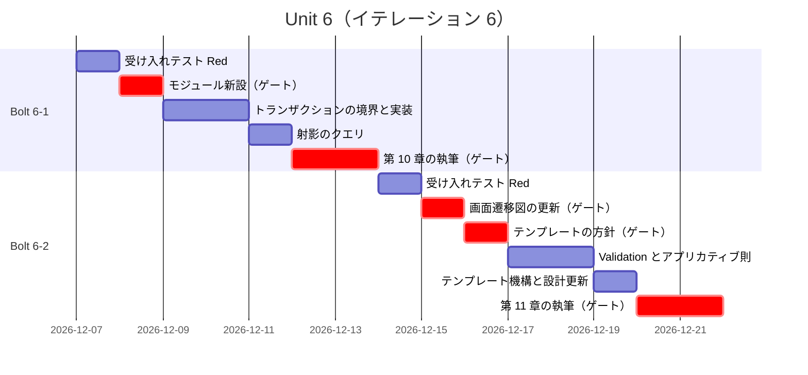
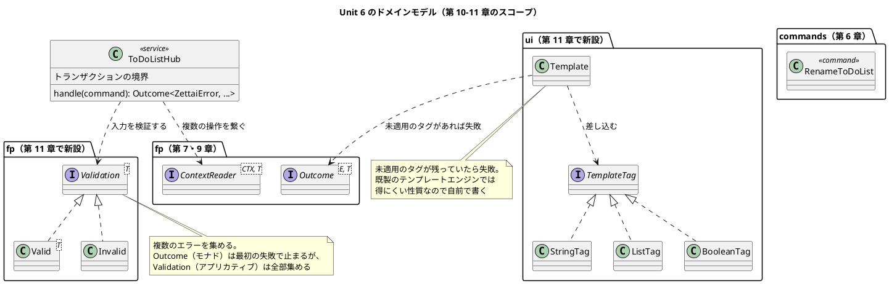
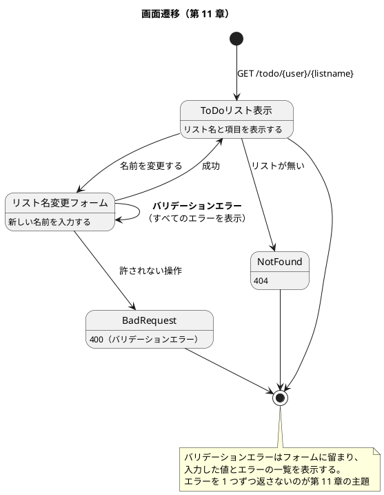

# Unit 6 の Bolt 計画（イテレーション 6）- Zettai 連載（Kotlin 版）

## 概要

| 項目 | 内容 |
|------|------|
| **イテレーション** | 6 |
| **Unit** | Unit 6 文脈の受け渡しとバリデーション |
| **期間** | 2026-12-07 〜 2026-12-18（2 週間） |
| **Bolt 数** | 2（Bolt 6-1 第 10 章 / Bolt 6-2 第 11 章） |
| **局面** | **終盤（アウトサイドイン）**。中盤からの移行 |
| **ゲート密度** | **疎**（停止 6 箇所。Unit 5 は 8 箇所） |
| **人の検証負荷** | 10 ポイント |
| **前 Unit** | [Unit 5](iteration_plan-5.md)（完了。[Bolt 終了報告](bolt_report-5.md)） |

---

## 局面移行の確認（中盤 → 終盤）

[開発戦略](development_strategy.md) が定める移行時の 3 点を、計画の着手前に確認しました。

| 確認事項 | 結果 |
| :--- | :--- |
| 1. 前局面の受け入れテストがすべて green | ✅ `./gradlew check` が green（3 経路 27 ステップを含む約 190 テスト） |
| 2. 前局面で作った設計が `docs/design/` に反映されている | ✅ `architecture_backend.md`・`domain-model.md`・`data-model.md`・`ui_design.md` の 4 本 |
| 3. 次局面のアプローチが実装状況に照らして妥当か | ✅ 妥当（下記） |

### アプローチをアウトサイドインに戻す根拠

[コーディングとテストガイド](../reference/コーディングとテストガイド.md) の実装アプローチ選択フローに当てはめます。

| 判断 | 現在の状況 | 導かれるアプローチ |
| :--- | :--- | :--- |
| 基本 CRUD 実装済みか | **はい**（表示・作成・項目追加・状態変更・永続化） | 次の判断へ |
| ドメインロジックが複雑か | **はい**（イベント・コマンド・射影・モナド） | ドメインモデル中心 → **アウトサイドイン推奨** |

選択フローの「基本実装済み × ドメイン複雑 → アウトサイドイン推奨」に当たります。

**本 Unit で扱う内容が「単体では意味を持たない」**ことも理由です。

| 内容 | 単体で確かめられるか |
| :--- | :--- |
| `ContextReader` によるトランザクション（第 10 章） | **いいえ**。「複数の操作がまとめて成功または失敗する」は、複数の操作を並べないと確かめられない |
| アプリカティブによるバリデーション（第 11 章） | **いいえ**。「複数のエラーをまとめて返す」は、複数の入力を同時に検証しないと確かめられない |

どちらも**業務シナリオとして束ねたときに効く**設計です。外側の受け入れテストから駆動します。

### 中盤から引き継ぐもの

インサイドアウトで作ったドメインは変えません。本 Unit は**既存のドメインを組み合わせる**のが主です。[開発戦略](development_strategy.md) の終盤の手順どおりです。

> 既存のドメインを組み合わせて Green にする。**新規のドメイン実装は最小限にとどめる**。終盤で新しい集約が必要になったら、中盤で見落としがあった合図なので、設計を見直す。

---

## Unit 5 からの持ち込み

| # | 持ち込み項目 | 消化するステップ | 根拠 |
| :--- | :--- | :--- | :--- |
| 1 | `zettai-step4-*` モジュールを新設する | 6-1.2 | [ADR-007](../adr/ADR-007-module-per-unit.md) の方針（Unit の境界で切る） |
| 2 | `ContextReader` でトランザクションを実装する | 6-1.4 | 第 10 章の主題。`flatMap` が同じ接続を渡すことを利用する |
| 3 | `fp/Validation` を新設し、アプリカティブ則を検証する | 6-2.4・6-2.5 | 第 11 章の主題 |
| 4 | テンプレートエンジンを選定する | **本計画で前提を訂正**（後述） | 第 11 章「ユーザインタフェースの改善」 |
| 5 | `ui_design.md` の HTML の組み立て方針を更新する | 6-2.7 | 第 11 章でテンプレート機構に置き換える |
| 6 | 値オブジェクトの生成時バリデーションを設計に反映する | 6-2.7 | [ドメインモデル設計](../design/domain-model.md) が第 11 章としている |
| 7 | 画面遷移図を更新する | 6-2.7 | 第 11 章でバリデーションエラーの表示が加わる |
| 8 | スナップショットまたはリードモデルの永続化を扱うか判断する | **本計画で判断済み**（後述） | 第 9 章で限界として書いた |

### 持ち込み 4 の訂正: テンプレートエンジンは選定しない

持ち込み項目には「**テンプレートエンジンを選定する**（新規ライブラリなのでゲートを置く）」と書いていました。**前提が誤っていました。**

原著のコンパニオンコード（`references/fotf/zettai_step6_validation/src/main/kotlin/com/ubertob/fotf/zettai/ui/TemplateEngine.kt`）を確認したところ、**既製のライブラリを使わず、自前で小さなテンプレート機構を書いています。**

| 原著の実装 | 内容 |
| :--- | :--- |
| `Template = CharSequence` | テンプレートは文字列そのもの |
| `TemplateTag`（`StringTag`・`ListTag`・`BooleanTag`） | 差し込む値の種類 |
| `renderTemplate(data: TagMap): TemplateOutcome` | 適用結果を `Outcome` で返す。**未適用のタグが残っていたら失敗** |

第 11 章の主題は「テンプレートエンジンの使い方」ではなく、**タグの適用を型で安全にすること**です。とくに「未適用のタグが残っていたら失敗にする」は、既製のライブラリでは得にくい性質です。

**本連載も自前で書きます。** http4k には `http4k-template-handlebars` などのモジュールがありますが、使いません。理由は [ADR-004](../adr/ADR-004-static-analysis.md)・[ADR-005](../adr/ADR-005-property-based-testing.md)・[ADR-008](../adr/ADR-008-event-store-single-table.md) と同じ形です。**この章の主題が「自分で書く」ことなので、既製品を使うと教材になりません。**

したがって**新規ライブラリのゲートは不要**です。代わりに「自前で書く判断」を ADR に残します（ステップ 6-2.3）。

### 持ち込み 8 の判断: スナップショットとリードモデルは扱わない

第 9 章で限界を書きました。

> 状態を読むたびに全出来事を畳み込みます。出来事が増えると遅くなります。

対策（スナップショット、射影の永続化）を**本連載では扱いません。**

| 理由 | 内容 |
| :--- | :--- |
| 残りが 4 章しかない | 第 10〜13 章で、文脈・バリデーション・監視・総括を扱う。性能対策を入れる余地がない |
| 主題がずれる | 本連載の主題は「オブジェクト指向から関数型へ設計を移す」こと。性能対策は別の主題 |
| すでに限界として書いた | 第 9 章に「実務ではスナップショットかリードモデルが必要になる」と明記した |

**第 13 章（総括）で、この判断を「本連載が扱わなかったこと」として明示します**（ステップ 6-2.8 で第 13 章への持ち込みとして記録）。扱わないことを黙っていると、読者が「この設計で実務に出せる」と誤解します。

### Unit 5 の学びの織り込み

| 学び | 本計画への織り込み |
| :--- | :--- |
| 試してから「入れない」と決める | テンプレート機構は自前で書くが、**http4k のテンプレートモジュールで書けないかを先に確かめる**（ステップ 6-2.3 の完了判定に含めた） |
| 評価が当たることと原因を予測できることは別 | エントロピー評価で MED を付けた軸に、**予想した原因だけに備えない**。トランザクションの検証は「まとめて失敗する」ことを実際に起こして確かめる |
| 検査そのものにも漏れがある | 記事のコード例検査が誤検出したら、**記事ではなく検査を疑う**（ステップ 6-2.9 の注記） |
| 3 つめの法則も同じ形で書けた | アプリカティブ則も `forAllRandom` で書く。記事の構成も「構造 → 性質 → 名前 → 身の回りの例」で 4 回目 |
| 実装より先に図を作る | 画面遷移図（バリデーションエラーの表示）を実装より先に更新する（ステップ 6-2.2 を 6-2.6 より前に置いた） |

---

## ゴール

### Unit 完了時の達成状態

1. **複数の操作が 1 つのトランザクションになっている**: コマンドの処理と射影の更新が、まとめて成功または失敗する
2. **射影をデータベースから引ける**: 射影のクエリが `ContextReader` として組み立てられている
3. **複数のエラーをまとめて返せる**: バリデーションが「最初のエラーで止まる」のではなく、すべてのエラーを集める
4. **アプリカティブが見えている**: `Validation` の合成が満たす法則を、プロパティベーステストで示せている
5. **画面がテンプレートから作られている**: 未適用のタグが残っていたら失敗になる
6. **第 10〜11 章が公開されている**

### 成功基準

- [x] 複数の操作が同じ接続で実行され、失敗時にまとめてロールバックされる
- [x] 射影のクエリが `ContextReader` として書かれている
- [x] ポート 3 つが `DbAction` を返す形になり、変わったファイル数が記録されている
- [x] バリデーションが複数のエラーを集めて返す
- [x] アプリカティブ則がプロパティベーステストで green
- [x] テンプレートの未適用タグが検出され、`Outcome` の失敗になる
- [x] 既存の DDT シナリオが 3 経路とも green（回帰なし）
- [x] バリデーションエラーの表示が新しいシナリオで green
- [x] カバレッジ 80% 以上（ドメイン層）
- [x] 記事のコード例検査が第 1〜11 章で違反 0 件
- [x] `ui_design.md` と `domain-model.md` が更新されている
- [x] 第 13 章への持ち込み（扱わなかったこと）が記録されている

---

## Unit 6 の満足条件

### ユーザーストーリー

| ID | ユーザーストーリー | 検証負荷 | 優先度 |
|----|-------------------|----|----|
| US-010 | 第 10 章「コンテキストを読み込み、コマンドを処理する」を公開する | 5 | 必須 |
| US-011 | 第 11 章「アプリカティブによるデータバリデーション」を公開する | 5 | 必須 |
| **合計** | | **10** | |

#### US-010: 第 10 章「コンテキストを読み込み、コマンドを処理する」を公開する

**ストーリー**:
> 利用者として、操作が途中で失敗したときに半分だけ反映された状態にならないでほしい。なぜなら、どこまで進んだか分からない状態から復旧するのは難しいからだ。

**受入条件**:

1. コマンドの処理が 1 つのトランザクションで実行される
2. 途中で失敗したら、それまでの書き込みがロールバックされる
3. 射影のクエリが `ContextReader` として組み立てられている
4. トランザクションの境界がコードから読み取れる（どこからどこまでが 1 つの単位か）
5. 節構成が [章構成マインドマップ](../article/draft.md) の第 10 章（モナドでデータベースにアクセスする／`ContextReader` を使用したコマンドの処理／データベースに対する射影のクエリ／イベントソーシングによるドメインのモデリング／まとめ）と一致している

#### US-011: 第 11 章「アプリカティブによるデータバリデーション」を公開する

**ストーリー**:
> 利用者として、入力の誤りをまとめて教えてほしい。なぜなら、1 つずつ直して送り直すのは手間だからだ。

**受入条件**:

1. リストの名前変更ができる
2. 複数のパラメータを同時に検証し、**すべてのエラーを集めて返す**（最初のエラーで止まらない）
3. `Validation` があり、アプリカティブ則を満たす
4. 画面がテンプレートから作られ、**未適用のタグが残っていたら失敗**になる
5. バリデーションエラーが画面に表示される
6. 節構成が [章構成マインドマップ](../article/draft.md) の第 11 章（ToDo リストの名前変更／2 つのパラメータを持った検証／バリデーションを使った検証／アプリカティブファンクタの結合／ユーザインタフェースの改善／まとめ）と一致している

### NFR 定義（Unit 6 固有）

| NFR | 内容 | 判定方法 |
| :--- | :--- | :--- |
| ドメインの独立性 | `zettai.domain` と `zettai.fp` がフレームワークを import しない | `DomainBoundaryTest` |
| トランザクションの原子性 | 途中で失敗したとき、書き込みが 1 件も残らない | 結合テストで意図的に失敗させて確認 |
| テンプレートの安全性 | 未適用のタグが残ったら実行時に失敗する | テンプレートのテスト |
| テスト実行時間 | `./gradlew check` が 5 分以内 | CI のジョブ時間 |
| カバレッジ | ドメイン層 80% 以上 | Kover |

### 測定基準

| 測定基準 | Unit 6 での目標 | Intent とのつながり |
| :--- | :--- | :--- |
| 公開済みの章 | 11 / 13 | 全 13 章公開 |
| 既存シナリオの回帰 | 0 件 | 終盤で組み合わせても既存の振る舞いが変わらない |
| 扱わなかったことの明示 | 第 13 章への持ち込みとして記録 | 読者が「実務に出せる」と誤解しないため |

---

## エントロピー評価

| 評価軸 | 評価 | 根拠 | 対応 |
| :--- | :--- | :--- | :--- |
| 意図の曖昧さ | **LOW** | 節構成が確定し、受入条件がテストで判定できる | — |
| 構造的不確実性 | **LOW** | ドメイン・アダプタ・fp の境界は確定済み。本 Unit は既存のドメインを組み合わせる | — |
| 検証の不確実性 | **MED** | アプリカティブ則はプロパティベーステストで書ける（3 回書いた形）。一方**トランザクションのロールバックは「失敗を意図的に起こす」テストが要る**。また**未適用タグの検出**はテンプレートの走査に漏れが出やすい | ロールバックは結合テストで実際に失敗させる。テンプレートは「タグを 1 つ残す」ケースを明示的にテストする |
| リスク | **LOW** | 新規ライブラリなし（テンプレートは自前）。スキーマ変更なし。既存の `docker-compose.yml` をそのまま使う | — |
| 未解決の仮定 | **LOW** | 道具はすべて検証済み。`ContextReader` は第 9 章で動作確認済み | — |

**総合**: MED が 1 軸、残り LOW。Unit 3（MED 1 軸）と同じ構成です。

**スパイクは置きません。** 未解決の仮定が LOW です（[Unit 3 の Bolt 終了報告](bolt_report-3.md) の学び「スパイクは儀式ではなく未解決の仮定への対処」）。

ただし Unit 5 の学び（**評価が当たっても原因は予測できない**）に従い、検証の不確実性 MED に対して**予想した原因だけに備えません**。ロールバックとテンプレートの両方を、実際に失敗させて確かめます。

---

## スコープ・深さ・テスト戦略

| 軸 | 選択 | 理由 |
| :--- | :--- | :--- |
| スコープ | **全ステージ** | 本番機能。設計ドキュメントの更新を含む |
| 深さ | **Standard** | Unit 2〜5 と同じ |
| テスト戦略 | **Standard** | 本番機能。加えてアプリカティブ則のプロパティベーステストと、トランザクションのロールバックの結合テストを追加する |

---

## Bolt 6-1: 文脈の受け渡し（第 10 章）

### Bolt ゴール

> 複数の操作を 1 つのトランザクションにまとめ、射影のクエリも `ContextReader` として組み立てて第 10 章として公開する。**確認したい仮説**: 第 9 章で「`flatMap` が同じ文脈を両方に渡す」と書いたことが、トランザクションという具体的な利益として示せるか。

### ステップ計画

- [x] **6-1.1 受け入れテストを書く（Red）**: 「途中で失敗したら何も残らない」シナリオを DDT に追加する
  - 完了判定: シナリオが実行され、期待どおり失敗する
- [x] **6-1.2 モジュールの新設**（**持ち込み 1**）: `zettai-step4-context` を作る（[ADR-007](../adr/ADR-007-module-per-unit.md) の方針）
  - **人の確認が必要**（新規ファイル・構造変更）
- [x] **6-1.3 トランザクションの境界とポートの型を決める**: どこからどこまでを 1 つの単位にするかと、ポート 3 つを `DbAction` を返す形に変えるかを提示する
  - 完了判定: 「コマンド 1 つの処理」を単位とする案が確定している。**接続の生成場所が 1 箇所に集まっている**。インメモリ経路が「接続を使わない `DbAction`」を返すことの妥当性を検討済み
  - **人の確認が必要**（**ポートの型変更。第 7 章で 6 ファイルに波及した種類の変更**）
- [x] **6-1.4 トランザクションを実装する（Green）**（**持ち込み 2**）: `ContextReader` の `flatMap` で操作を繋ぎ、`runOn` で `autoCommit = false` にしてまとめてコミットする
  - 完了判定: 6-1.1 のシナリオが green。**意図的に失敗させたとき書き込みが 1 件も残らない**（NFR）
- [x] **6-1.5 射影のクエリを `ContextReader` にする**: 射影をデータベースから引く経路を作る
  - 完了判定: クエリもトランザクションの中で実行できる
- [x] **6-1.6 第 10 章の骨子と執筆**
  - **人の確認が必要**（記事の構成と全文）
- [x] **6-1.7 記事のコード例検査と前章の追従・サイト反映**

### Bolt 6-1 の完了条件

- [x] 複数の操作が 1 つのトランザクションで実行される
- [x] 意図的に失敗させたとき、書き込みが 1 件も残らない
- [x] 射影のクエリが `ContextReader` として書かれている
- [x] 既存の DDT シナリオが 3 経路とも green（回帰なし）
- [x] 第 10 章が公開されている
- [x] 確認したい仮説に答えが出ている

---

## Bolt 6-2: アプリカティブによるバリデーション（第 11 章）

### Bolt ゴール

> 複数のエラーを集めて返すバリデーションを作り、テンプレート機構で画面を組み立てて第 11 章として公開する。**確認したい仮説**: 「最初のエラーで止まる」（モナド）と「すべてのエラーを集める」（アプリカティブ）の違いを、読者が自分の実装で判断できる形で示せるか。

### ステップ計画

- [x] **6-2.1 受け入れテストを書く（Red）**: リストの名前変更と、複数のエラーがまとめて返るシナリオを追加する
- [x] **6-2.2 画面遷移図を更新する**（**持ち込み 7**）: バリデーションエラーの表示を [UI 設計](../design/ui_design.md) に反映する。**実装より先に作る**（Unit 5 の学び）
  - **人の確認が必要**（設計ドキュメントの更新）
- [x] **6-2.3 テンプレート機構の方針を決める**（**持ち込み 4 の訂正分**）: 自前で書く判断を ADR に残す。**先に http4k のテンプレートモジュールで「未適用タグの検出」が書けないかを確かめる**（Unit 5 の学び「試してから入れないと決める」）
  - 完了判定: 既製品で書けるか確かめた結果と、自前で書く判断が ADR に記録されている
  - **人の確認が必要**（設計判断）
- [x] **6-2.4 `Validation` を実装する（Red → Green）**（**持ち込み 3**）: 複数のエラーを集める型を作る
  - 完了判定: 2 つ以上のエラーが同時に返る
- [x] **6-2.5 アプリカティブ則をプロパティベーステストで示す**（**持ち込み 3**）: `forAllRandom` で書く
  - 完了判定: ランダム入力で green。モノイド・ファンクタ・モナドと同じ形で書けていること
- [x] **6-2.6 テンプレート機構を実装する**: 未適用のタグが残ったら `Outcome` の失敗にする
  - 完了判定: タグを 1 つ残したケースで失敗する（検証の不確実性 MED への対応）
- [x] **6-2.7 設計ドキュメントの更新**（**持ち込み 5・6**）: [UI 設計](../design/ui_design.md) の HTML 組み立て方針、[ドメインモデル設計](../design/domain-model.md) の値オブジェクトの生成時バリデーションを更新する
- [x] **6-2.8 第 13 章への持ち込みを記録する**（**持ち込み 8**）: 本連載が扱わなかったこと（スナップショット・リードモデルの永続化）を Bolt 終了報告に記録する
- [x] **6-2.9 第 11 章の骨子と執筆**: アプリカティブも「構造 → 性質 → 名前 → 身の回りの例」の順で書く
  - 注: 記事のコード例検査が誤検出したら、**記事ではなく検査を疑う**（Unit 5 の学び）
  - **人の確認が必要**（記事の構成と全文）
- [x] **6-2.10 サイト反映と OKF 適用**
- [x] **6-2.11 Bolt 終了報告**: 実績を記録する。**終盤に移った最初の Unit の評価**を含める

### Bolt 6-2 の完了条件

- [x] 複数のエラーが集まって返る
- [x] アプリカティブ則がプロパティベーステストで green
- [x] 未適用のタグが検出され、失敗になる
- [x] バリデーションエラーが画面に表示される
- [x] 新旧すべての DDT シナリオが 3 経路で green
- [x] `ui_design.md` と `domain-model.md` が更新されている
- [x] 第 11 章が公開されている

---

## 受入条件とステップの対応

| ストーリー | 受入条件 | カバーするステップ | 判定方法 |
| :--- | :--- | :--- | :--- |
| US-010 | 1. 1 つのトランザクションで実行 | 6-1.3・6-1.4 | 結合テスト |
| US-010 | 2. 失敗時にロールバック | 6-1.4 | 結合テスト（意図的に失敗させる） |
| US-010 | 3. 射影のクエリが `ContextReader` | 6-1.5 | 型の定義 |
| US-010 | 4. トランザクションの境界が読み取れる | 6-1.3 | 人の検証（記事で説明できるか） |
| US-010 | 5. 節構成が一致 | 6-1.6 | 見出しの突合（人の検証） |
| US-011 | 1. リストの名前変更 | 6-2.1・6-2.4 | DDT |
| US-011 | 2. すべてのエラーを集める | 6-2.4 | ドメインのテスト |
| US-011 | 3. アプリカティブ則を満たす | 6-2.5 | プロパティベーステスト |
| US-011 | 4. 未適用タグで失敗 | 6-2.6 | テンプレートのテスト |
| US-011 | 5. エラーが画面に表示される | 6-2.6・6-2.1 | DDT |
| US-011 | 6. 節構成が一致 | 6-2.9 | 見出しの突合（人の検証） |

---

## 承認ゲートとゲート密度

### 本 Unit のゲート密度: 疎（6 箇所）

[Unit 5 の Bolt 終了報告](bolt_report-5.md) の判断に従い、疎に戻します。基準は Unit 3 で確立した「**新しく現れる判断が機械に移せているか**」です。

| ステップ | 停止理由 |
| :--- | :--- |
| 6-1.2 | 新規ファイル・構造変更（確認必須） |
| **6-1.3** | **ポートの型変更。第 7 章で 6 ファイルに波及した種類の変更**（検証で追加） |
| 6-1.6 / 6-2.9 | 記事の構成と全文検証。機械化できていない |
| 6-2.2 | 設計ドキュメントの更新（実装より先に作る） |
| 6-2.3 | テンプレート機構の方針（設計判断） |

**新規ライブラリのゲートは置きません。** テンプレートを自前で書くため、導入するライブラリがないからです（持ち込み 4 の訂正）。

Unit 5 の 8 箇所から 6 箇所に減りました（検証でポートの型変更のゲートを 1 つ足しました）。**減った分はすべて、Unit 5 で判断が済んだもの**です（DB の追加、スキーマ設計、CI の構成、ADR の再検討）。

---

## スケジュール



---

## 設計

### ドメインモデル図（本 Unit のスコープ）



**新しい集約は作りません。** [開発戦略](development_strategy.md) の終盤の方針どおり、既存のドメインを組み合わせます。追加するのは `RenameToDoList` コマンド 1 つと、`fp` / `ui` の部品です。

### ポートの型の変化（第 10 章）

**検証（`validating-design` 軸 C）で検出した項目です。** 第 10 章でトランザクションを導入すると、[アーキテクチャ設計](../design/architecture_backend.md) のポート 3 つがいずれも変わります。計画に書いていませんでした。

| ポート | 現在（第 6・8・9 章） | 第 10 章 |
| :--- | :--- | :--- |
| 現在の状態の取得 | `StateFetcher = () -> ToDoListState` | `() -> DbAction<ToDoListState>` |
| 表示用の射影の取得 | `ProjectionFetcher = () -> ToDoListProjection` | `() -> DbAction<ToDoListProjection>` |
| 出来事の保存 | `EventPersister = (List<ToDoListEvent>) -> Outcome<ZettaiError, Unit>` | `(List<ToDoListEvent>) -> DbAction<Unit>` |

`DbAction<T>` は `ContextReader<Connection, T>` です（第 9 章で定義済み）。

### なぜ型を変えるのか

**同じトランザクションの中で複数の操作を実行するには、接続を共有する必要があります。** 現在のポートは接続を内部で作って閉じているので、操作ごとに別のトランザクションになります。

`DbAction` を返す形にすると、**実行が後回しになり、`flatMap` で繋いだときに同じ接続が渡されます**。これが第 9 章で書いた「`flatMap` が同じ文脈を両方に渡す」の実際の利益です。

### 波及の見積もり

第 7 章（`Outcome` の導入）で**ポートの型を変えたら 6 ファイルが変わりました**。今回も同じことが起きます。

| 影響先 | 変更の内容 |
| :--- | :--- |
| ポートの型定義（`ToDoListHub.kt`） | 3 つの型エイリアス |
| `ToDoListHub` | `handle` と クエリ側が `DbAction` を繋いで `runOn` する |
| DDT の 3 経路 | アダプタが `DbAction` を返す形になる。インメモリの 2 経路は「接続を使わない `DbAction`」を返す |
| 第 6・8・9 章の記事 | コード例が古くなる（検査が検出する） |

**インメモリの経路が「接続を使わない `DbAction`」を返すことになるのが、この変更のいちばん不自然な点です。** 接続が不要な実装に接続を受け取らせるのは、抽象が漏れている兆候かもしれません。記事でこの点に触れ、**代替案（インメモリ経路を別のインターフェースにする）を検討した結果も書きます**。

ステップ 6-1.3 で方針を決め、**変更が必要だったファイル数を記録します**（第 7 章と比べるため）。

### 画面遷移図（本 Unit で更新）



**自己ループの遷移（バリデーションエラーでフォームに留まる）が本 Unit の追加分です。** 実装より先にこの図を [UI 設計](../design/ui_design.md) に反映します（ステップ 6-2.2）。

### 状態遷移図

**省略**。第 6 章で実装済みで、本 Unit で変更しません。[ドメインモデル設計](../design/domain-model.md) を参照。

### ER 図

**省略**。第 9 章で作成済みで、本 Unit でスキーマを変更しません。テーブルは `todo_list_event` の 1 つのままです。リストの名前変更も「名前が変わった」という出来事を追記するだけで、スキーマは変わりません。

### ユーザーマニュアル

**作りません**（[開発戦略](development_strategy.md) の「進捗管理の手段」で確定した方針）。

### ディレクトリ構成

```text
apps/kotlin/zettai/
├── settings.gradle.kts              # zettai-step4-context を include（6-1.2）
└── zettai-step4-context/            # 新設
    └── src/
        ├── main/kotlin/zettai/
        │   ├── domain/
        │   │   ├── commands/        # RenameToDoList を追加（6-2.1）
        │   │   ├── events/          # ListRenamed を追加（6-2.1）
        │   │   └── queries/
        │   ├── fp/
        │   │   ├── ContextReader.kt # 第 9 章
        │   │   └── Validation.kt    # 新設（6-2.4）
        │   ├── persistence/
        │   ├── ui/                  # 新設（6-2.6）
        │   │   └── Template.kt
        │   └── web/
        └── test/kotlin/zettai/
            ├── ddt/                 # 新しいシナリオを追加（6-1.1・6-2.1）
            ├── fp/
            ├── persistence/         # ロールバックの結合テスト（6-1.4）
            └── ui/                  # テンプレートのテスト（6-2.6）
```

### ADR

| ADR | タイトル | ステータス |
|-----|---------|-----------|
| [`ADR-010`](../adr/ADR-010-own-template.md) | テンプレート機構を自前で書き既製のテンプレートエンジンを使わない | **提案** |
| [`ADR-011`](../adr/ADR-011-transaction-boundary.md) | トランザクションの境界をコマンド 1 つの処理に置き文脈を不透明な型にする | **提案** |

---

## リスクと対策

| リスク | 影響度 | 対策 | 承認ゲート |
| :--- | :--- | :--- | :--- |
| **ロールバックのテストが「失敗を起こせていない」まま緑になる** | 高 | 意図的に失敗させたあと、**書き込みが 1 件も残らないことを SELECT で確かめる**。件数 0 を確認するまでテストを信じない | — |
| 未適用タグの検出に漏れが出る | 中 | 「タグを 1 つ残す」ケースを明示的にテストする。タグの種類（`String`・`List`・`Boolean`）ごとに書く | 6-2.6 |
| アプリカティブとモナドの違いが読者に伝わらない | 高 | 「最初のエラーで止まる」と「すべてのエラーを集める」の違いを、**同じ入力で結果を比べる形**で示す。Bolt ゴールの仮説として明示した | 6-2.9 |
| テンプレートを自前で書く判断が「車輪の再発明」に見える | 中 | **先に http4k のテンプレートモジュールで書けないかを確かめ**、結果を ADR に残す（Unit 5 の学び） | 6-2.3 |
| 終盤で新しい集約が必要になる | 中 | [開発戦略](development_strategy.md) が「中盤で見落としがあった合図」としている。必要になったら設計を見直し、その事実を記事に書く | 6-1.3 |
| 残り 4 章で扱えないことが積み残る | 中 | 本 Unit で「扱わないこと」を第 13 章への持ち込みとして記録する（ステップ 6-2.8） | — |

---

## Deployment Unit としての完了条件

### Definition of Done

- [x] 複数の操作が 1 つのトランザクションで実行される
- [x] 意図的に失敗させたとき、書き込みが 1 件も残らない（SELECT で件数 0 を確認）
- [x] 射影のクエリが `ContextReader` として書かれている
- [x] ポート 3 つが `DbAction` を返す形になり、変わったファイル数が記録されている
- [x] バリデーションが複数のエラーを集めて返す
- [x] アプリカティブ則がプロパティベーステストで green
- [x] 未適用のタグが検出され、`Outcome` の失敗になる
- [x] バリデーションエラーが画面に表示される
- [x] 新旧すべての DDT シナリオが 3 経路で green（回帰なし）
- [x] カバレッジ 80% 以上（ドメイン層）
- [x] `DomainBoundaryTest` が green
- [x] 記事のコード例検査が第 1〜11 章で違反 0 件
- [x] コードの読みやすさ検査（行長・`import` 順）が違反 0 件
- [x] 第 10〜11 章が公開され、節構成がマインドマップと一致している
- [x] `ui_design.md` の画面遷移図と HTML 組み立て方針、`domain-model.md` の値オブジェクトのバリデーションが更新されている
- [x] ADR-010・ADR-011 を作成済み
- [x] `gulp okf:check` が ERROR 0
- [x] 承認ゲート 6 箇所を通過した
- [x] Bolt 終了報告を作成し、**終盤に移った最初の Unit の評価**と**第 13 章への持ち込み**を記録した
- [x] デモ項目がすべて実演できる

### デモ項目

1. コマンドの処理が 1 つのトランザクションで実行されることをコードで示す
2. **意図的に失敗させ、書き込みが 1 件も残らないことを SELECT で示す**
3. 射影のクエリが `ContextReader` として組み立てられていることを示す
4. 不正な入力を 2 つ同時に送り、**エラーが 2 つまとめて返ることを示す**
5. アプリカティブ則のプロパティベーステストが green であることを示す
6. テンプレートのタグを 1 つ消し忘れた状態を作り、失敗になることを示す
7. バリデーションエラーが画面に表示されることを示す
8. 既存の DDT シナリオが 3 経路とも green であることを示す（回帰なし）

デモ項目 2・4・6 が本 Unit の要点です。**いずれも「失敗が正しく起きること」を確かめています。** 成功の確認より漏れやすい領域です。

---

## 指標（Bolt 終了報告へ引き継ぐ）

| 指標 | 計画 | 実績 |
| :--- | :--- | :--- |
| 完了 Unit 数 | 1（累計 6 / 7） | **1（累計 6 / 7）** |
| 承認ゲート通過数 | 6（Unit 5 は 8） | **6** |
| 変更依頼数 | - | **0** |
| リードタイム | 10 営業日 | **1 日** |
| カバレッジ（ドメイン層） | 80% 以上 | **80% 以上** |
| 持ち込み項目の消化 | 8 / 8 | **8 / 8** |
| 既存シナリオの回帰 | 0 件 | **0 件** |
| **ロールバック後の残存レコード数** | 0 | **0** |
| **ポートの型変更で変わったファイル数** | - | **7 変更 + 3 新設** |
| **第 13 章への持ち込み件数** | - | **4** |

最後の 3 行が本 Unit 固有です。1 つめは「失敗が正しく起きたか」を数字で確かめます。2 つめは第 7 章（6 ファイル）と比べるためです。3 つめは、扱わなかったことを総括の章へ確実に渡すための記録です。

---

## 更新履歴

| 日付 | 更新内容 | 更新者 |
|------|---------|--------|
| 2026-09-27 | Unit 6 完了。全 18 ステップと承認ゲート 6 箇所を通過し、Deployment Unit として検証。文脈の型を決めるのに 3 回かかり、境界のテストが 2 つめの誤りを止めた。構造的不確実性の評価（LOW）を外した | claude-code/claude-opus-5 |
| 2026-09-27 | 検証（`validating-design` 軸 C）で、第 10 章のトランザクション導入に伴うポート 3 つの型変更が計画に書かれていなかったため「ポートの型の変化」の節を追加。ステップ 6-1.3 にゲートを 1 つ足し（5 → 6 箇所）、変わったファイル数を指標に加えた | claude-code/claude-opus-5 |
| 2026-09-27 | 初版作成（AI-DLC 準拠）。中盤から終盤への局面移行の確認、アプローチをアウトサイドインに戻す根拠、Unit 5 からの持ち込み 8 項目（テンプレートエンジンの前提の訂正とスナップショットを扱わない判断を含む）と学び 5 件の織り込み、エントロピー評価、疎いゲート密度（5 箇所）、画面遷移図の更新案、Deployment Unit の完了条件を定義 | claude-code/claude-opus-5 |

---

## 関連ドキュメント

- [リリース計画](release_plan.md) / [開発戦略](development_strategy.md)
- [Unit 5 の Bolt 計画](iteration_plan-5.md) / [Bolt 終了報告](bolt_report-5.md)
- [ドメインモデル設計](../design/domain-model.md) / [バックエンドアーキテクチャ設計](../design/architecture_backend.md) / [UI 設計](../design/ui_design.md) / [データモデル設計](../design/data-model.md)
- [ADR-007 モジュールを Unit の境界で切る](../adr/ADR-007-module-per-unit.md)
- Unit 6 の Bolt 終了報告（`bolt_report-6.md`。Unit 完了時に作成）
