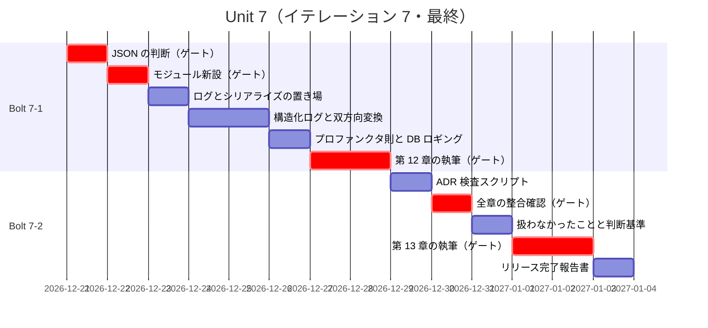
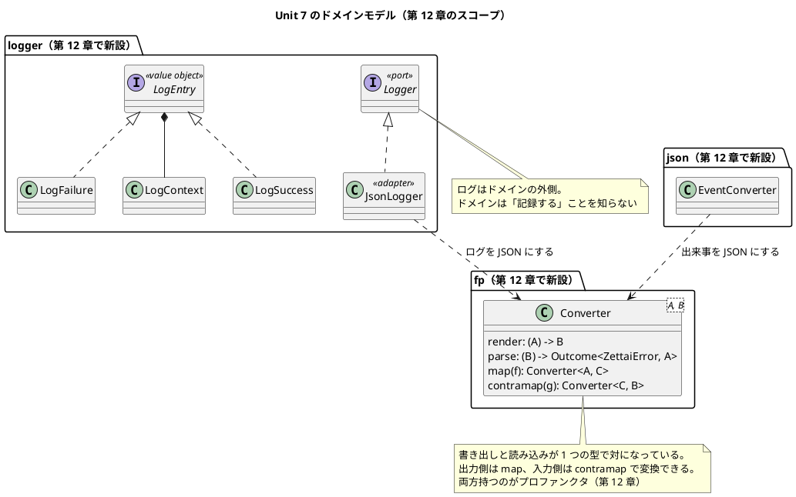

# Unit 7 の Bolt 計画（イテレーション 7）- Zettai 連載（Kotlin 版）

> **実績（2026-09-27 追記）**: Unit 7 は完了しました。実績は [Bolt 終了報告](bolt_report-7.md) と [リリース完了報告（v1.0.0）](release_report-1.0.0.md) にあります。本計画は「ADR 11 件」「扱わなかったこと 4 件」と書いていますが、第 12 章で ADR-012 と JSON エスケープが加わったため、**実績は ADR 12 件・扱わなかったこと 5 件**です。JSON は Kondor を調べて不採用とし、自前の `Converter` にしました。ポートの型変更は目標どおり **0 ファイル**でした。

## 概要

| 項目 | 内容 |
|------|------|
| **イテレーション** | 7（**最終**） |
| **Unit** | Unit 7 監視とアーキテクチャ総括 |
| **期間** | 2026-12-21 〜 2027-01-01（2 週間） |
| **Bolt 数** | 2（Bolt 7-1 第 12 章 / Bolt 7-2 第 13 章） |
| **局面** | 終盤（アウトサイドイン）。Unit 6 と同じ局面なので**移行の確認は不要** |
| **ゲート密度** | **疎**（停止 4 箇所。Unit 6 は 6 箇所） |
| **人の検証負荷** | 8 ポイント |
| **前 Unit** | [Unit 6](iteration_plan-6.md)（完了。[Bolt 終了報告](bolt_report-6.md)） |
| **完了時** | **Release v1.0.0**。全 13 章公開 |

---

## この Unit の特殊性: 最後の Unit

本 Unit は連載の最後です。ほかの Unit と 3 点で違います。

| 違い | 内容 |
| :--- | :--- |
| **実装追加が最小** | 第 13 章は総括で、コードをほとんど書かない。[リリース計画](release_plan.md) がスコープを「設計中心」としている |
| **全章を見渡す作業がある** | 第 13 章で 13 章分の設計判断と ADR 11 件の整合を確認する。**過去の章に矛盾が見つかったら直す** |
| **扱わなかったことを明示する** | [Unit 6 の Bolt 終了報告](bolt_report-6.md) で 4 件を一覧にした。黙っていると読者が「実務に出せる」と誤解する |

加えて、**リリース完了報告書**を作成します（`creating-release-report`）。

---

## Unit 6 からの持ち込み

| # | 持ち込み項目 | 消化するステップ | 根拠 |
| :--- | :--- | :--- | :--- |
| 1 | `zettai-step5-*` モジュールを新設する | 7-1.2 | [ADR-007](../adr/ADR-007-module-per-unit.md) の方針 |
| 2 | 構造化ロギング（`logger/`）を実装する | 7-1.4 | 第 12 章の主題 |
| 3 | JSON の扱いを決める（既製品を先に調べる） | 7-1.1 | Unit 5・6 と同じ順序（[ADR-004](../adr/ADR-004-static-analysis.md)・[ADR-010](../adr/ADR-010-own-template.md) の教訓） |
| 4 | プロファンクタ則をプロパティベーステストで検証する | 7-1.6 | **5 回目**。モノイド・ファンクタ・モナド・アプリカティブと同じ形 |
| 5 | 第 9 章の手書き JSON シリアライズを置き換える | 7-1.5 | 第 12 章で双方向変換を型にする |
| 6 | 第 13 章で「扱わなかったこと」4 件を明示する | 7-2.3 | Unit 6 の終了報告の一覧を使う |
| 7 | 第 13 章で全 13 章の設計判断と ADR 11 件の整合を確認する | 7-2.2 | **矛盾が見つかったら過去の章を直す** |
| 8 | リリース完了報告書を作成する | 7-2.7 | Release v1.0.0 |
| 9 | 局面移行の確認 | **不要**（Unit 6・7 とも終盤） | [開発戦略](development_strategy.md) |

### Unit 6 の学びの織り込み

| 学び | 本計画への織り込み |
| :--- | :--- |
| **懸念を書くだけでは防げない。検査が止める** | 第 13 章の整合確認を目視だけにしない。**ADR と記事の対応を機械的に検査するスクリプトを書く**（ステップ 7-2.1） |
| `@Suppress` を書いたらその行を実行するテストを必ず書く | プロファンクタの実装で変性（`in`/`out`）を扱う。**注釈を付けたら実行時のテストを書く**（ステップ 7-1.6 の完了判定） |
| 強い構造が常に良いわけではない | プロファンクタも「できることが多い」だけで偉くないと書く。第 13 章の総括で 5 つの構造を並べる |
| 既製品を調べてから自前で書いた（2 回） | JSON も**先に Kondor を調べる**（ステップ 7-1.1） |
| リスク欄とエントロピー評価を突き合わせる | **本計画で実施**。リスク欄に書いた懸念をエントロピー評価に反映した（後述） |

---

## ゴール

### Unit 完了時の達成状態

1. **アプリケーションの動きが外から見える**: 構造化ログが出力され、コマンドとデータベース呼び出しが追える
2. **JSON の変換が双方向で型になっている**: 書き出しと読み込みが 1 つの型で対になっている
3. **プロファンクタが見えている**: 双方向変換の合成が満たす法則を、プロパティベーステストで示せている
4. **全 13 章の設計が総括されている**: 5 つの代数構造、11 件の ADR、扱わなかったこと 4 件が一貫して説明されている
5. **全 13 章が公開されている**
6. **Release v1.0.0 の条件を満たしている**

### 成功基準

- [x] 構造化ログが JSON で出力され、コマンドの処理とデータベース呼び出しが追える
- [x] 第 9 章の手書きシリアライズが双方向変換の型に置き換わっている
- [x] プロファンクタ則がプロパティベーステストで green
- [x] 既存の DDT シナリオが 3 経路とも green（回帰なし）
- [x] カバレッジ 80% 以上（ドメイン層）
- [x] 記事のコード例検査が第 1〜13 章で違反 0 件
- [x] **ADR と記事の対応を検査するスクリプトが違反 0 件**
- [x] 第 13 章に「扱わなかったこと」4 件が明記されている
- [x] 第 13 章の総括が ADR 11 件と矛盾しない
- [x] リリース完了報告書が作成されている
- [x] Release v1.0.0 のリリース条件を満たしている

---

## Unit 7 の満足条件

### ユーザーストーリー

| ID | ユーザーストーリー | 検証負荷 | 優先度 |
|----|-------------------|----|----|
| US-012 | 第 12 章「監視と関数型 JSON」を公開する | 5 | 中 |
| US-013 | 第 13 章「関数型アーキテクチャの設計」を公開する | 3 | 必須 |
| **合計** | | **8** | |

US-012 の優先度は [リリース計画](release_plan.md) で「中」です。スコープバッファを消費する場合、**作り込みの深さを下げるのはこの章から**です。

#### US-012: 第 12 章「監視と関数型 JSON」を公開する

**ストーリー**:
> 運用する人として、アプリケーションが何をしたのか後から追いたい。なぜなら、問題が起きたときに何が起きたか分からないと直せないからだ。

**受入条件**:

1. 構造化ログ（JSON）が出力される
2. コマンドの処理とデータベース呼び出しがログから追える
3. JSON の書き出しと読み込みが 1 つの型で対になっている
4. その型が `map`（出力側）と `contramap`（入力側）を持ち、プロファンクタ則を満たす
5. 第 9 章の手書きシリアライズが置き換わっている
6. 節構成が [章構成マインドマップ](../article/draft.md) の第 12 章（アプリケーションを監視する／構造化されたロギング／JSON を関数型にする／プロファンクタとの出会い／データベース呼び出しのロギング／まとめ）と一致している

#### US-013: 第 13 章「関数型アーキテクチャの設計」を公開する

**ストーリー**:
> 読者として、13 章で積み上げた設計が全体として何だったのかを知りたい。なぜなら、部分を覚えても全体の判断基準が分からないと自分の仕事に使えないからだ。

**受入条件**:

1. 5 つの代数構造（モノイド・ファンクタ・モナド・アプリカティブ・プロファンクタ）が並べて説明されている
2. **どの構造をいつ選ぶかの判断基準**が書かれている
3. 11 件の ADR が総括され、記事の記述と矛盾しない
4. **扱わなかったこと 4 件**（スナップショット・HTML エスケープ・CSRF・認証認可）が明記されている
5. 「シンプルさ」について、この連載が何をシンプルと呼んだかが書かれている
6. 節構成が [章構成マインドマップ](../article/draft.md) の第 13 章（シンプルさを追い求めて／システム全体の設計／コードへの翻訳／最後の考察）と一致している

### NFR 定義（Unit 7 固有）

| NFR | 内容 | 判定方法 |
| :--- | :--- | :--- |
| ドメインの独立性 | `zettai.domain` と `zettai.fp` がフレームワークを import しない | `DomainBoundaryTest` |
| ログの構造 | ログが 1 行 1 JSON で出力され、パースできる | ログのテスト |
| 変換の往復 | 任意の出来事を書き出して読み込むと元に戻る | プロパティベーステスト |
| ADR と記事の対応 | 記事が参照する ADR がすべて存在し、ADR が参照する章がすべて存在する | 検査スクリプト |
| カバレッジ | ドメイン層 80% 以上 | Kover |

### 測定基準

| 測定基準 | Unit 7 での目標 | Intent とのつながり |
| :--- | :--- | :--- |
| 公開済みの章 | **13 / 13** | 全 13 章公開という Intent の達成 |
| 扱わなかったことの明示 | 4 件すべて第 13 章に記載 | 読者が誤解しないため |
| ADR と記事の整合 | 違反 0 件 | 「設計判断が記録され追跡できる」というビジネス価値 |

---

## エントロピー評価

**Unit 6 の学びに従い、リスク欄に書いた懸念を評価に反映しました。**

| 評価軸 | 評価 | 根拠 | 対応 |
| :--- | :--- | :--- | :--- |
| 意図の曖昧さ | **MED** | 第 12 章の受入条件はテストで判定できる。一方**第 13 章の「総括」は完了の判定基準が曖昧**。「一貫している」を何で測るか | ADR と記事の対応を検査スクリプトにする（機械で測れる部分を作る） |
| 構造的不確実性 | **MED** | 第 12 章でログとシリアライズを入れる場所（ドメインか、アダプタか、横断関心事か）が未確定。**Unit 6 で「境界は確定済み」と評価して外したので、同じ誤りを避ける** | ステップ 7-1.3 で置き場を決め、人の承認を得る |
| 検証の不確実性 | **MED** | プロファンクタ則はプロパティベーステストで書ける（5 回目）。一方**第 13 章の整合は人が読むしかない部分が残る** | 機械で測れる部分（ADR 参照）と人が読む部分（論の一貫性）を分ける |
| リスク | **LOW** | 新規ライブラリは JSON の判断次第。スキーマ変更なし。データベースへの影響なし | 既製品を入れる場合のみ停止 |
| 未解決の仮定 | **MED** | 「Kondor 3.5.2 が Kotlin 2.2 で動くか」「第 9 章の手書きをプロファンクタに発展させられるか」が未検証 | ステップ 7-1.1 で確かめる |

**総合**: MED が 4 軸。HIGH はありませんが、**LOW が 1 軸だけ**です。Unit 6（LOW 4 軸・MED 1 軸）より不確実性が高い評価になりました。

理由は**第 13 章の総括が「完了の判定が曖昧」**だからです。コードは書かないのに、不確実性は下がりません。

ゲート密度は**疎（4 箇所）**に保ちますが、**第 13 章の整合確認にゲートを置きます**。

---

## スコープ・深さ・テスト戦略

| 軸 | 選択 | 理由 |
| :--- | :--- | :--- |
| スコープ | **設計中心** | 第 13 章は実装追加が最小。[リリース計画](release_plan.md) の選択どおり |
| 深さ | **Standard** | Unit 2〜6 と同じ |
| テスト戦略 | **Standard** | 第 12 章は本番機能。第 13 章はコードを書かないのでテストも増えない |

---

## Bolt 7-1: 監視と関数型 JSON（第 12 章）

### Bolt ゴール

> 構造化ログを出し、JSON の書き出しと読み込みを 1 つの型で対にして第 12 章として公開する。**確認したい仮説**: 「双方向の変換」という身近な題材から、プロファンクタという 5 つめの構造に到達できるか。そして 5 回目の「構造 → 性質 → 名前 → 身の回りの例」が機能するか。

### ステップ計画

- [x] **7-1.1 JSON の扱いを決める**（**持ち込み 3**）: Kondor 3.5.2 が Kotlin 2.2 で動くかを確かめ、入れるか第 9 章の手書きを発展させるかを判断する
  - 完了判定: 既製品で「双方向変換を 1 つの型にする」が書けるか確かめた結果と、判断が ADR に記録されている
  - **人の確認が必要**（新規ライブラリの導入可否。未解決の仮定が MED） |
- [x] **7-1.2 モジュールの新設**（**持ち込み 1**）: `zettai-step5-monitoring` を作る
  - **人の確認が必要**（新規ファイル・構造変更）
- [x] **7-1.3 ログとシリアライズの置き場を決める**: `logger/` と `json/` をどこに置くかを提示する。**ドメインに入れない**
  - 完了判定: 置き場が確定し、`DomainBoundaryTest` の検査対象に加えるかが決まっている
  - 注: Unit 6 で「境界は確定済み」と評価して外した。**新しい種類の関心事（横断関心事）が現れる可能性を疑う**
- [x] **7-1.4 構造化ログを実装する（Red → Green）**（**持ち込み 2**）: ログを 1 行 1 JSON で出力する
  - 完了判定: ログをパースでき、コマンドの処理とデータベース呼び出しが追える
- [x] **7-1.5 双方向変換を型にする**（**持ち込み 5**）: 第 9 章の手書きシリアライズを、書き出しと読み込みが対になった型に置き換える
  - 完了判定: 既存の結合テスト（往復）が green。第 9 章の `toJson`・`eventFrom` が新しい型に統合されている
- [x] **7-1.6 プロファンクタ則をプロパティベーステストで示す**（**持ち込み 4**）: `map`（出力側）と `contramap`（入力側）の法則を確かめる
  - 完了判定: `zettai.property.forAllRandom` を使ってランダム入力で green。**第 5 章（モノイド）・第 7 章（ファンクタ）・第 9 章（モナド）・第 11 章（アプリカティブ）と同じヘルパー・同じ形で書けていること**（5 回目）
  - 完了判定: **変性の注釈（`in`／`out`／`@UnsafeVariance`）を付けたら、その行を実行するテストを書く**（Unit 6 の学び）
- [x] **7-1.7 データベース呼び出しのロギング**: `ContextReader` を包んでログを出す
  - 完了判定: トランザクションの中の操作がログから追える。**既存の DDT が 3 経路とも green**
  - 注（**検証で追加**）: ここで `DbAction`（`ContextReader<Connection, T>`）と `HubAction`（`ContextReader<TxContext, T>`）を包むことになる。**ポートの型そのものは変えない。** 第 7 章（6 ファイル）と第 10 章（7 ファイル + 3 新設）でポートの型を変えたが、今回は**包むだけ**で型を変えずに済むかを確かめる。変えざるをえない場合は停止して判断する
- [x] **7-1.8 第 12 章の骨子と執筆**
  - **人の確認が必要**（記事の構成と全文）
- [x] **7-1.9 記事のコード例検査と前章の追従・サイト反映**

### Bolt 7-1 の完了条件

- [x] 構造化ログが JSON で出力され、パースできる
- [x] 双方向変換が 1 つの型になり、第 9 章の手書きが置き換わっている
- [x] プロファンクタ則がプロパティベーステストで green
- [x] 既存の DDT シナリオが 3 経路とも green
- [x] 第 12 章が公開されている
- [x] 確認したい仮説に答えが出ている

---

## Bolt 7-2: 関数型アーキテクチャの総括（第 13 章）

### Bolt ゴール

> 13 章で積み上げた設計を総括し、扱わなかったことも明示して第 13 章として公開する。**確認したい仮説**: 「どの構造をいつ選ぶか」という判断基準を、読者が自分の仕事に持ち帰れる形で書けるか。連載の途中で出した判断（ADR 11 件）と矛盾せずに書けるか。

### ステップ計画

- [x] **7-2.1 ADR と記事の対応を検査するスクリプトを書く**（**Unit 6 の学び**）: 記事が参照する ADR がすべて存在し、ADR が参照する章がすべて存在することを確かめる
  - 完了判定: 全章・全 ADR に対して実行し、違反 0 件。CI に追加済み
  - 注: Unit 6 の学び「懸念を書くだけでは防げない。検査が止める」に従い、**目視の整合確認を機械化する**
- [x] **7-2.2 全 13 章と ADR 11 件の整合を確認する**（**持ち込み 7**）: 論の一貫性を人が読んで確かめる。**矛盾が見つかったら過去の章を直す**
  - 完了判定: 矛盾の一覧が空、または見つかった矛盾を修正済み
  - **人の確認が必要**（機械で測れない部分。検証の不確実性 MED の理由）
- [x] **7-2.3 扱わなかったことを整理する**（**持ち込み 6**）: [Unit 6 の Bolt 終了報告](bolt_report-6.md) の 4 件を、第 13 章に書く形に整える
  - 完了判定: 4 件それぞれに「なぜ扱わなかったか」「実務ではどうするか」が書かれている
- [x] **7-2.4 判断基準を整理する**: 5 つの構造を「いつ選ぶか」の観点で並べる
  - 完了判定: 「`map` で足りるなら `map`」「強い構造が偉いわけではない」という連載を通じた主張と一貫している
- [x] **7-2.5 第 13 章の骨子と執筆**
  - **人の確認が必要**（記事の構成と全文）
- [x] **7-2.6 サイト反映と OKF 適用**
- [x] **7-2.7 リリース完了報告書の作成**（**持ち込み 8**）: `creating-release-report` で Release v1.0.0 の報告書を作る
  - 完了判定: 7 Unit の実績（完了 Unit 数・ゲート通過数・変更依頼数・リードタイム）が集計されている
- [x] **7-2.8 Bolt 終了報告**: 実績を記録する。**連載全体を通じた学び**を含める

### Bolt 7-2 の完了条件

- [x] ADR と記事の対応を検査するスクリプトが違反 0 件で CI に入っている
- [x] 全 13 章と ADR 11 件に矛盾がない（または修正済み）
- [x] 扱わなかったこと 4 件が第 13 章に明記されている
- [x] 5 つの構造の判断基準が書かれている
- [x] 第 13 章が公開されている
- [x] リリース完了報告書が作成されている
- [x] Release v1.0.0 のリリース条件を満たしている

---

## 受入条件とステップの対応

| ストーリー | 受入条件 | カバーするステップ | 判定方法 |
| :--- | :--- | :--- | :--- |
| US-012 | 1. 構造化ログが出力される | 7-1.4 | ログのテスト |
| US-012 | 2. コマンドと DB 呼び出しが追える | 7-1.4・7-1.7 | ログのテスト |
| US-012 | 3. 書き出しと読み込みが 1 つの型 | 7-1.5 | 型の定義 |
| US-012 | 4. プロファンクタ則を満たす | 7-1.6 | プロパティベーステスト |
| US-012 | 5. 第 9 章の手書きが置き換わっている | 7-1.5 | 結合テスト（往復） |
| US-012 | 6. 節構成が一致 | 7-1.8 | 見出しの突合（人の検証） |
| US-013 | 1. 5 つの構造が並べて説明されている | 7-2.4・7-2.5 | 人の検証 |
| US-013 | 2. **いつ選ぶかの判断基準** | 7-2.4 | 人の検証 |
| US-013 | 3. ADR 11 件と矛盾しない | 7-2.1・7-2.2 | **検査スクリプト + 人の検証** |
| US-013 | 4. 扱わなかったこと 4 件 | 7-2.3 | 記事の記述 |
| US-013 | 5. シンプルさの定義 | 7-2.5 | 人の検証 |
| US-013 | 6. 節構成が一致 | 7-2.5 | 見出しの突合（人の検証） |

---

## 承認ゲートとゲート密度

### 本 Unit のゲート密度: 疎（4 箇所）

| ステップ | 停止理由 |
| :--- | :--- |
| 7-1.1 | 新規ライブラリの導入可否（未解決の仮定 MED） |
| 7-1.2 | 新規ファイル・構造変更（確認必須） |
| 7-1.8 / 7-2.5 | 記事の構成と全文検証 |
| **7-2.2** | **全 13 章と ADR の整合確認。機械で測れない部分** |

表の行は 4 つですが、**停止するステップは 5 つ**です（7-1.8 と 7-2.5 が同じ行）。

Unit 6 の 6 箇所から減りました。減った分は Unit 6 で判断が済んだもの（ポートの型・設計ドキュメントの更新・テンプレートの方針）です。

---

## スケジュール



---

## 設計

### ドメインモデル図（本 Unit のスコープ）



**ログとシリアライズはドメインに入れません。** ドメインは「記録する」ことを知りません。置き場はステップ 7-1.3 で確定させます。

### ポートの型は変えない

**検証（`validating-design` 軸 C）で明記した方針です。**

| 章 | ポートの型 | 変更 |
| :--- | :--- | :--- |
| 7 | `ToDoListFetcher` を `Outcome` に | 6 ファイル |
| 10 | ポート 3 つを `HubAction` に | 7 ファイル変更 + 3 新設 |
| **12** | **変えない** | **0（目標）** |

ログは**横断関心事**なので、ポートの型を変えずに `DbAction` / `HubAction` を**包む**形で入れます。

```text
logged(action) = ContextReader { context -> ログを出す; action.runWith(context) }
```

包むだけなら、ポートの型は変わらず、呼び出し側も変わりません。**2 回続けてポートの型を変えたので、3 回目は変えずに済む方法を先に探します。**

型を変えざるをえない場合はステップ 7-1.7 で停止して判断します。

### 状態遷移図・ER 図・画面遷移図

| 設計図 | 本 Unit での扱い |
| :--- | :--- |
| 状態遷移図 | **省略**。第 6 章で実装済みで変更しない |
| ER 図 | **省略**。第 9 章で作成済みでスキーマを変更しない。ログはファイル（または標準出力）に出す |
| 画面遷移図 | **省略**。本 Unit で画面は増えない |

**第 13 章は既存の図を再掲して総括します。** 新しい図は作りません（ただし全体像を 1 枚にまとめた図は作る可能性があり、その場合は既存の図の合成であることを明記します）。

### ユーザーマニュアル

**作りません**（[開発戦略](development_strategy.md) の確定方針）。

### ディレクトリ構成

```text
apps/kotlin/zettai/
├── settings.gradle.kts              # zettai-step5-monitoring を include（7-1.2）
└── zettai-step5-monitoring/         # 新設
    └── src/
        ├── main/kotlin/zettai/
        │   ├── domain/              # 変更しない
        │   ├── fp/
        │   │   └── Converter.kt     # 新設（7-1.5）
        │   ├── json/                # 新設（7-1.5）
        │   ├── logger/              # 新設（7-1.4）
        │   ├── persistence/
        │   ├── ui/
        │   └── web/
        └── test/kotlin/zettai/
            ├── fp/                  # プロファンクタ則（7-1.6）
            ├── json/
            └── logger/

ops/scripts/article/
└── check_adr_references.py          # 新設（7-2.1）
```

### ADR

| ADR | タイトル | ステータス |
|-----|---------|-----------|
| `ADR-012` | JSON の扱い（既製品か自前か） | ステップ 7-1.1 |
| `ADR-013` | ログをドメインの外側に置く | ステップ 7-1.3（置き場が非自明な場合） |

ADR-013 は、置き場の判断が自明なら作りません。**自明かどうかをステップ 7-1.3 で判断します。**

---

## リスクと対策

**Unit 6 の学びに従い、ここに書いた懸念をエントロピー評価に反映しています。**

| リスク | 影響度 | エントロピー評価への反映 | 対策 | 承認ゲート |
| :--- | :--- | :--- | :--- | :--- |
| **第 13 章の「総括」は完了の判定基準が曖昧** | 高 | 意図の曖昧さ **MED** | 機械で測れる部分（ADR 参照の検査）と人が読む部分（論の一貫性）を分ける。前者はスクリプト、後者はゲート | 7-2.2 |
| ログとシリアライズの置き場が未確定。**横断関心事という新しい種類の関心事**かもしれない | 中 | 構造的不確実性 **MED** | Unit 6 で「境界は確定済み」と評価して外した。同じ誤りを避け、置き場を決めるステップを独立させた | 7-1.3 |
| 第 13 章の整合は人が読むしかない部分が残る | 中 | 検証の不確実性 **MED** | 検査スクリプトで機械化できる部分を先に潰し、人が読む範囲を狭める | 7-2.2 |
| Kondor 3.5.2 が Kotlin 2.2 で動くか未検証 | 低 | 未解決の仮定 **MED** | ステップ 7-1.1 で確かめる。動かなければ自前で書く（第 9 章の手書きを発展させる） | 7-1.1 |
| 過去の章に矛盾が見つかり、修正が広範になる | 中 | — | 検査スクリプトを先に走らせ、機械的な不整合を潰す。論の矛盾は第 13 章で「当時はこう考えたが」と書く形も選べる | 7-2.2 |
| プロファンクタの説明が抽象的になる | 高 | — | 4 回機能した「構造 → 性質 → 名前 → 身の回りの例」を使う。題材は「双方向の変換」という身近なもの | 7-1.8 |
| US-012 の優先度が「中」なので、遅延時に削られる | 中 | — | 削るのは**作り込みの深さ**（ログの項目数、変換の対応型の数）。章そのものは削らない | — |

---

## Deployment Unit としての完了条件

### Definition of Done

- [x] 構造化ログが JSON で出力され、パースできる
- [x] コマンドの処理とデータベース呼び出しがログから追える
- [x] 双方向変換が 1 つの型になり、第 9 章の手書きが置き換わっている
- [x] プロファンクタ則がプロパティベーステストで green
- [x] 既存の DDT シナリオが 3 経路とも green（回帰なし）
- [x] カバレッジ 80% 以上（ドメイン層）
- [x] `DomainBoundaryTest` が green（ドメインがログ・JSON を知らない）
- [x] 記事のコード例検査が第 1〜13 章で違反 0 件
- [x] コードの読みやすさ検査が違反 0 件
- [x] **ADR と記事の対応を検査するスクリプトが違反 0 件で CI に入っている**
- [x] 第 12〜13 章が公開され、節構成がマインドマップと一致している
- [x] **第 13 章に「扱わなかったこと」4 件が明記されている**
- [x] 第 13 章に 5 つの構造の判断基準が書かれている
- [x] 全 13 章と ADR 11 件に矛盾がない（または修正済み）
- [x] ADR-012（および必要なら ADR-013）を作成済み
- [x] `gulp okf:check` が ERROR 0
- [x] 承認ゲート 5 箇所を通過した
- [x] **リリース完了報告書を作成済み**
- [x] Bolt 終了報告を作成し、**連載全体を通じた学び**を記録した
- [x] **Release v1.0.0 のリリース条件を満たしている**
- [x] デモ項目がすべて実演できる

### デモ項目

1. アプリケーションを動かしてログを出力し、1 行 1 JSON であることを示す
2. ログからコマンドの処理を追えることを示す
3. ログからデータベース呼び出しを追えることを示す
4. 出来事を書き出して読み込むと元に戻ることを示す（往復）
5. プロファンクタ則のプロパティベーステストが green であることを示す
6. 既存の DDT シナリオが 3 経路とも green であることを示す（回帰なし）
7. **ADR と記事の対応を検査するスクリプトを実行し、違反 0 件であることを示す**
8. 第 13 章を開き、扱わなかったこと 4 件が書かれていることを示す
9. **サイトを開き、全 13 章が nav から辿れることを示す**

デモ項目 9 が Intent の達成そのものです。

---

## 指標（Bolt 終了報告へ引き継ぐ）

| 指標 | 計画 | 実績 |
| :--- | :--- | :--- |
| 完了 Unit 数 | 1（累計 **7 / 7**） | - |
| 承認ゲート通過数 | 5（Unit 6 は 6） | - |
| 変更依頼数 | - | - |
| リードタイム | 10 営業日 | - |
| カバレッジ（ドメイン層） | 80% 以上 | - |
| 持ち込み項目の消化 | 9 / 9 | - |
| 既存シナリオの回帰 | 0 件 | - |
| **公開済みの章** | **13 / 13** | - |
| **ADR と記事の整合違反** | 0 | - |
| **第 13 章で明示した「扱わなかったこと」** | 4 | - |
| **過去の章に見つかった矛盾** | - | - |

最後の行が本 Unit 固有です。**0 件であることが目標ではありません。** 見つかったら直し、直したことを記録します。13 章書いて矛盾が 1 つも無いほうが不自然です。

---

## 更新履歴

| 日付 | 更新内容 | 更新者 |
|------|---------|--------|
| 2026-09-27 | 検証（`validating-design` 軸 C）で 2 件を修正。プロファンクタ則のテストで `forAllRandom` を使い 5 回目の一貫性を保つことを完了判定に明記し、ログの導入でポートの型を変えない方針（包むだけ）を設計節に追加した | claude-code/claude-opus-5 |
| 2026-09-27 | 初版作成（AI-DLC 準拠）。最終 Unit の特殊性（実装最小・全章の見渡し・扱わなかったことの明示）、Unit 6 からの持ち込み 9 項目と学び 5 件の織り込み、**リスク欄をエントロピー評価に反映**（Unit 6 の学び）、ADR と記事の対応を機械検査する方針、Release v1.0.0 の完了条件を定義 | claude-code/claude-opus-5 |

---

## 関連ドキュメント

- [リリース計画](release_plan.md) / [開発戦略](development_strategy.md)
- [Unit 6 の Bolt 計画](iteration_plan-6.md) / [Bolt 終了報告](bolt_report-6.md)
- [ドメインモデル設計](../design/domain-model.md) / [バックエンドアーキテクチャ設計](../design/architecture_backend.md) / [データモデル設計](../design/data-model.md) / [UI 設計](../design/ui_design.md)
- ADR 11 件（[索引](../adr/index.md)）
- Unit 7 の Bolt 終了報告（`bolt_report-7.md`）とリリース完了報告書（Unit 完了時に作成）
