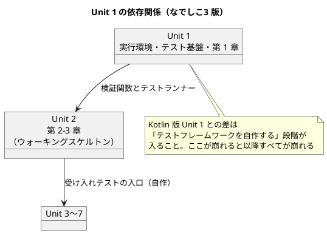
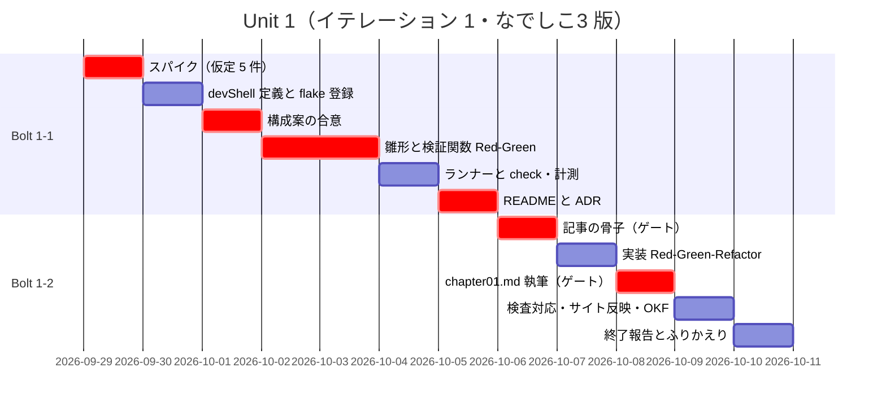
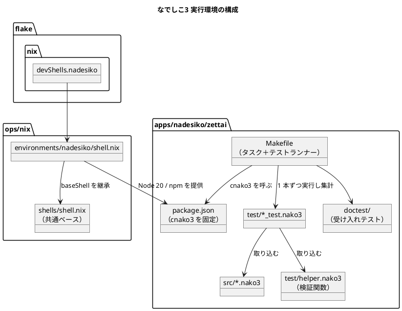

# Unit 1 の Bolt 計画（イテレーション 1）- Zettai 連載（なでしこ3 版）

## 概要

本ドキュメントは AI-DLC の **Bolt 計画** です。[リリース・イテレーション計画ガイド（AI-DLC 版）](../reference/リリース・イテレーション計画ガイド_AI-DLC版.md) の第 2 章に従い、なでしこ3 版 Unit 1 を構築するための Bolt とステップを定義します。

| 項目 | 内容 |
|------|------|
| **イテレーション** | 1（なでしこ3 版） |
| **Unit** | Unit 1 実行環境・テスト基盤と第 1 章 |
| **期間** | 2026-09-29 〜 2026-10-10（2 週間） |
| **Bolt 数** | 2（Bolt 1-1 / Bolt 1-2） |
| **局面** | 序盤（アウトサイドイン。[開発戦略](development_strategy.md) の「なでしこ3 版の局面別アプローチ」） |
| **人の検証負荷** | 11 ポイント |
| **承認ゲート** | 10 箇所 |

参照元と正は次のとおりです。

| 内容 | 正となる参照元 |
| :--- | :--- |
| Intent・Unit 分解・依存 DAG・エントロピー評価 | [リリース計画（なでしこ3 版）](release_plan-nadesiko.md) |
| 局面とアプローチ・ゲート密度の方針・全 Bolt 共通のゲート項目 | [開発戦略](development_strategy.md) |
| 章構成・執筆規約・なでしこ3 での実現手段 | [執筆計画](../article/outline.md)、[章構成マインドマップ](../article/draft.md) |
| TDD の三原則・品質基準・コミット規約 | [コーディングとテストガイド（AI-DLC 版）](../reference/コーディングとテストガイド_AI-DLC版.md) |
| 前リリースの学び | [Unit 7 のふりかえり（Kotlin 版）](retrospective-7.md) |

### Kotlin 版 Unit 7 のふりかえりから引き継いだこと

本計画は [Unit 7 のふりかえり](retrospective-7.md) の Try を入力にしています。反映先を明記します。

| Try | 本計画での反映 |
| :--- | :--- |
| Try 1 章をまたぐ引用の検査を CI に入れる | 本 Unit は記事が 1 章のみで章をまたぐ引用が発生しないため、**Unit 2 に持ち越す**。本 Unit では引用そのものを書かない方針をステップ 1-2.5 の確認項目に含める |
| Try 2 節構成 ↔ マインドマップの一致を検査に入れる | ステップ 1-2.1 の承認ゲートで人が突合し、**検査のスクリプト化は Unit 2**（章が 2 本以上になってから）。本 Unit では突合の手順を記録に残す |
| Try 3 記事に書く数値を検査対象にする | 本 Unit では第 1 章に件数の主張を書かない。検査の追加は Unit 2 |
| Try 4 計画の本文には件数を書かず索引へのリンクで示す | **本計画で適用済み**。ADR の件数・テスト数を本文に書かず、索引へのリンクで示す |
| Try 5 各 Unit のクローズで KPT を独立した文書にする | **DoD に含めた**（`retrospective-nadesiko-1.md` の作成） |
| Try 6 リードタイムの代わりに「人が検証に使った時間」を測る | **指標に追加した**。Kotlin 版では全 Unit のリードタイムが「1 日」になり見積もりに使えなかったため、本 Unit から人の検証時間を主指標にする |

Try 6 は [リリース計画（なでしこ3 版）](release_plan-nadesiko.md) の指標定義に反映漏れがありました。本計画で指標を追加し、リリース計画側も同じコミットで揃えます。

---

## Intent と Unit 1

### Intent（再掲）

> オブジェクト指向から関数型への設計移行を、型システムを持たない日本語プログラミング言語で辿り直し、設計が言語機能ではなく約束とテストで支えられることを、動くサンプル実装つきの全 13 章として公開する。

### Unit 1 の位置づけ

Unit 1 は **ウォーキングスケルトンの土台** です。Kotlin 版 Unit 1 との決定的な違いは、**テストの土台そのものを作る段階が挟まる**ことです。Kotlin 版は Gradle と JUnit が最初から揃っていましたが、なでしこ3 にはテストフレームワークが存在しません。



---

## ゴール

### Unit 完了時の達成状態

1. **実行環境が再現できる**: `nix develop .#nadesiko` で Node 20 と cnako3 が揃った devShell に入れる
2. **テストが書ける**: `test/helper.nako3` の検証関数で Red-Green が回り、`make check` が green になる
3. **第 1 章が公開されている**: `docs/article/zettai/nadesiko/chapter01.md` が MkDocs の nav から開け、記事のコード例が実装と一致している
4. **型検査の不在を補う型が決まっている**: 契約テストと厳密比較の書き方が確定し、以降の全 Bolt で同じ形が使える

4 番目がこの対象に固有のゴールです。ここで決めた形が、Kotlin 版のコンパイラに相当する網になります。

### 成功基準

- [ ] `nix flake show` で `nadesiko` devShell が認識され、既存 13 devShell も認識される
- [ ] `make check` が green（検証 1 本を含む）
- [ ] 検証関数が、値の比較の前に `変数型確認` 同士を比較している（`3` と `「3」` を区別する）
- [ ] 第 1 章の節構成が [章構成マインドマップ](../article/draft.md) の第 1 章と一致している
- [ ] 記事のコード例がすべて `apps/nadesiko/zettai/` の動作確認済み実装からの転記である（`check_article_code.py` が green）
- [ ] `mkdocs.yml` の nav、[シリーズ索引](../article/zettai/index.md) の全章構成表と進捗管理表、[執筆計画](../article/outline.md) の対象一覧が揃っている
- [ ] 承認ゲート 10 箇所の通過数・変更依頼数・**人が検証に使った時間**が記録されている

カバレッジは計測できないため（計測機能が無い）、本 Unit でも以降の Unit でも計測対象にしません。代わりに `doctest/` の受け入れシナリオ数を記録します。本 Unit の時点では 0 件で、Unit 2 から増やします。

---

## 局面とアプローチ

[開発戦略](development_strategy.md) では Unit 1 は **序盤（アウトサイドイン）**、ゲート密度は **密** です。Kotlin 版 Unit 1 と同じ例外が適用されます。

- **受け入れテストの入口がまだ作れません。** 第 1 章の時点で HTTP のエンドポイントもドメインも無く、外側に置くテストがありません。Bolt 1-2 は**ユニットテスト起点**で進めます
- **Bolt 1-1 はアウトサイドインの対象外です。** テストの土台を作る段階であり、テストを書く側の基盤そのものを用意します
- **ウォーキングスケルトンは Unit 2（第 2 章）です。** 本 Unit はその土台を用意します

---

## Unit 1 の満足条件

### ユーザーストーリー

| ID | ユーザーストーリー | 検証負荷 | 優先度 |
|----|-------------------|----|----|
| US-000 | 読者が手元で再現できるよう、なでしこ3 の実行環境・テストヘルパ・テストランナー・サンプル実装の雛形を用意する | 8 | 必須 |
| US-001 | 第 1 章「新しいアプリケーションを準備する」を公開する | 3 | 必須 |
| **合計** | | **11** | |

#### US-000: 実行環境とテスト基盤を用意する

**ストーリー**:
> 読者として、記事に書かれた手順どおりに環境を用意し、テストを書き始めたい。なぜなら、テストフレームワークの無い言語では「どうテストを書くか」から始まるからだ。

**受入条件**（人と AI の契約）:

1. `nix develop .#nadesiko` で devShell に入ると、Node と cnako3 のバージョンが表示される
2. `nix flake show` の出力に `nadesiko` devShell が含まれ、既存の devShell もすべて認識される
3. `apps/nadesiko/zettai/` で `make check` が green になる
4. cnako3 のバージョンが `package.json` の 1 箇所で固定されている
5. `test/helper.nako3` の検証関数が、期待と実際の**型が違えば失敗する**（`3` と `「3」` を区別する）
6. テストが失敗したとき、どのテストがなぜ失敗したかが出力から分かる
7. 環境構築の手順が第 1 章の記事から辿れる

#### US-001: 第 1 章「新しいアプリケーションを準備する」を公開する

**ストーリー**:
> 読者として、これから何を作るのかと、型の無い言語でテストに開発をガイドさせるとはどういうことかを知りたい。なぜなら、題材と進め方が分からないまま手を動かしても身に付かないからだ。

**受入条件**:

1. 節構成が [章構成マインドマップ](../article/draft.md) の第 1 章と一致している
2. コード例が `apps/nadesiko/zettai/` の動作確認済みコードからの転記である
3. 原著のコードや文章をそのまま転載していない。参照した箇所は出典として示している
4. **なでしこ3 でのつまずき**を扱う節があり、Kotlin 版の第 1 章に無い内容を 1 つ以上含む
5. `mkdocs.yml` の nav から第 1 章が開ける
6. [シリーズ索引](../article/zettai/index.md) の全章構成表の第 1 章が記事へのリンクになっている

受入条件 4 は本対象に固有です。[開発戦略](development_strategy.md) の全 Bolt 共通のゲート項目「つまずき節があるか」に対応し、「Kotlin 版の焼き直しにしない」ためのものです。

### NFR 定義（Unit 1 固有）

| NFR | 内容 | 判定方法 |
| :--- | :--- | :--- |
| 再現性 | クリーンな環境で `nix develop .#nadesiko` → `make check` が追加手順なしで green になる | 手順を第 1 章に書き、書いた手順だけで通ることを確認する |
| テスト実行時間 | `make check` が 30 秒以内 | Unit 1 時点で計測し、超えたら Unit 2 の CI 設計に持ち込む |
| バージョン固定 | cnako3 のバージョンの記述箇所が `package.json` の 1 箇所のみ | `Makefile`・`shell.nix` にバージョンのリテラルが無いことを確認する |
| 失敗の可読性 | 検証が失敗したとき、テスト名・期待・実際・型が出力される | 意図的に失敗するテストを 1 本走らせて出力を見る |

### 測定基準（ビジネス意図へのトレース）

| 測定基準 | Unit 1 での目標 | Intent とのつながり |
| :--- | :--- | :--- |
| 再現できた読者の割合 | 手順の記述漏れ 0 件（自己検証） | 「読者が手元で再現できる」という Intent の中核 |
| 公開済みの章 | 1 / 13 | 全 13 章公開という Intent の進捗 |
| 記事とコードの一致 | `check_article_code.py` が green | 「動くサンプル実装つき」という Intent の条件 |
| Kotlin 版との差分の可視化 | 第 1 章につまずき節がある | 「約束とテストで保証する」を示すという Intent の中核 |

---

## エントロピー評価

| 評価軸 | 評価 | 根拠 | 高いときの対応 |
| :--- | :--- | :--- | :--- |
| 意図の曖昧さ | **LOW** | 受入条件がコマンドの実行結果で一意に判定できる。第 1 章の節構成も [章構成マインドマップ](../article/draft.md) で確定している | — |
| 構造的不確実性 | **HIGH** | テストヘルパ・テストランナーの構造が未確定。参考実装（`references/getting-started-tdd/apps/nadesiko/`）は **gonako 向け**で、cnako3 でそのまま動く保証がない | ステップ 1-1.0 のスパイクで組み込み命令の実在を確かめ、構造案を人に提示して承認を得る |
| 検証の不確実性 | **HIGH** | 「テストが失敗したとき理由が分かるか」「記事が読者に伝わるか」は人が見ないと判定できない。加えて**型検査が無いため、通ったことが正しさを意味しない** | 意図的に失敗させる確認を入れる。記事のステップは人が全文を読む |
| リスク | **MED** | 新規ファイル作成と `flake.nix` の構造変更が含まれる（確認必須）。セキュリティ・データ・本番環境への影響はない | 新規ファイル作成と `flake.nix` 変更のステップで停止する |
| 未解決の仮定 | **HIGH** | 「cnako3 3.8.7 が Node 20 で動く」「`【A】と【B】がASSERT等` が cnako3 に存在する」「`変数型確認` が cnako3 に存在する」「cnako3 に lint / format がある」「簡易 HTTP サーバのプラグインが cnako3 から使える」がいずれも未検証 | ステップ 1-1.0 をスパイクにし、全仮定を実機で潰してから本実装に入る |

**総合**: HIGH が 3 軸、MED が 1 軸。Kotlin 版 Unit 1（HIGH 1 軸）より高く、**なでしこ3 版で最も重い Unit** です。ゲート密度は**密（各ステップでゲート）**とします。

未解決の仮定が 5 件あり、いずれも後続すべてを揺らします。**ステップ 1-1.0 で 5 件すべてに答えを出すまで、本実装に入りません。**

---

## スコープ・深さ・テスト戦略

| 軸 | 選択 | 理由 |
| :--- | :--- | :--- |
| スコープ | **実装中心** | 設計成果物（ドメインモデル・データモデル・UI）はまだ対象がない。ADR は処理系とテスト基盤の判断のみ |
| 深さ | **Standard** | 学習用の連載だが、記事として公開するため手順とコードの正確さが要る |
| テスト戦略 | **Minimal** | 本 Unit の実装は検証 1 本のみ。テスト対象のコンポーネントがまだ存在しない。Unit 2 で Standard に上げる |

テスト戦略を Minimal にできるのは、Unit 1 が**本番機能を持たない基盤 Unit** だからです。ただし**テストヘルパ自身はテストします**（自作するため、これが壊れていると以降すべてのテストが嘘をつく）。

---

## Bolt 1-1: 実行環境とテスト基盤

### Bolt ゴール

> `nix develop .#nadesiko` から `make check` までを通し、テストフレームワークの無い言語で TDD を回す土台を作る。**確認したい仮説**: cnako3 の組み込みの表明命令と `変数型確認` を土台にすれば、検証関数とランナーを自作して Red-Green が回る。

### ステップ計画

状態記号は `[ ]` 未着手／`[-]` 進行中／`[?]` 承認待ち／`[R]` 修正中／`[x]` 完了／`[S]` スキップ。

- [ ] **1-1.0 スパイク**: 未解決の仮定 5 件を実機で潰す
  - 入力: `references/getting-started-tdd/apps/nadesiko/`（読むだけ）、`ops/nix/environments/node/shell.nix`
  - 確かめること: (1) cnako3 3.8.7 が Node 20 で動く (2) `【A】と【B】がASSERT等` が cnako3 に存在する (3) `変数型確認` が存在する (4) `cnako3` に lint / format があるか (5) 簡易 HTTP サーバのプラグインが cnako3 から読み込める
  - 完了判定: 5 件すべてに「ある／ない」と、無い場合の代替が根拠つきで示されている
  - **人の確認が必要**（未解決の仮定が HIGH。結果を見てから本実装に入る）
- [ ] **1-1.1 devShell の定義**: `ops/nix/environments/nadesiko/shell.nix` を新設する
  - 入力: `ops/nix/environments/node/shell.nix`（雛形）、`ops/nix/shells/shell.nix`（baseShell）
  - 完了判定: `baseShell` を継承し、Node 20 と npm を `buildInputs` に足した定義になっている。cnako3 は `package.json` 経由でローカル導入する
  - **人の確認が必要**（新規ファイル作成）
- [ ] **1-1.2 flake への登録**: `flake.nix` の `devShells` に `nadesiko` を 1 行追加する
  - 完了判定: `nix flake show` に `nadesiko` が現れ、**既存 13 devShell もすべて認識される**
  - **人の確認が必要**（構造変更。既存 devShell への影響を確認する）
- [ ] **1-1.3 ディレクトリ構成とテスト基盤の構成案**: `apps/nadesiko/zettai/` の構成、検証関数のインターフェース、ランナーの方式を提示する
  - 入力: 1-1.0 のスパイク結果、参考実装の `test/helper.nako3` と `Makefile`
  - 完了判定: ファイル配置・検証関数の引数と助詞・失敗時の出力形式・ランナーの集計方式が確定している
  - **人の確認が必要**（新規ファイル作成が広範。構造的不確実性が HIGH なので構成を先に合意する）
- [ ] **1-1.4 雛形の作成**: `package.json`（cnako3 のバージョン固定）と `Makefile` の骨格を作る
  - 完了判定: `make run` で `src/main.nako3` が実行できる
- [ ] **1-1.5 検証関数を書く（Red）**: `test/helper.nako3` の検証関数が「まだ無い」状態で、それを使うテストを 1 本書き、**失敗することを確認する**
  - 完了判定: テストが実行され、期待どおり失敗する。失敗が文法エラーではなく「関数が無い」ことによると確認できる
- [ ] **1-1.6 検証関数の実装（Green）**: 検証関数を実装する。**値の比較の前に `変数型確認` 同士を比較する**
  - 完了判定: テストが green。`3` と `「3」` を比較すると失敗することを、意図的に失敗するテストで確認できる
  - **人の確認が必要**（型検査の不在を補う中核。ここで決めた形を全 Bolt で使う）
- [ ] **1-1.7 テストランナーの実装**: `Makefile` の `test` が `test/*_test.nako3` を順に実行し、終了コードで集計する
  - 完了判定: 失敗するテストを 1 本混ぜると `make test` が非ゼロで終わり、どのテストが失敗したか分かる
- [ ] **1-1.8 `make check` の組み立てと計測**: lint・format 検査（スパイクで存在が確認できた場合）・テストを `check` に集約し、所要時間を測る
  - 完了判定: `make check` が green。NFR の 30 秒以内を満たすか判定し、超えたら Unit 2 に持ち込む課題として記録する
- [ ] **1-1.9 README の作成**: `apps/nadesiko/zettai/README.md` にディレクトリ規約と実行コマンドを書く
  - **人の確認が必要**（新規ファイル作成）
- [ ] **1-1.10 ADR-013 の作成**: 処理系に cnako3 を採用し gonako を採らない判断を記録する
  - 入力: `docs/template/ADR.md`、[執筆計画](../article/outline.md) の採用理由の表
  - **人の確認が必要**（設計判断の記録。`creating-adr` スキル）
- [ ] **1-1.11 ADR-014 の作成**: テストフレームワークを自作する判断（検証関数・ランナー・厳密比較の方式）を記録する。lint / format が無かった場合は「静的解析を入れない」判断も ADR として残す
  - 完了判定: 再検討の条件が**時期ではなく事象**で書かれている（Kotlin 版 ADR-004 と同じ形）
  - **人の確認が必要**（設計判断の記録）

### Bolt 1-1 の完了条件

- [ ] `nix develop .#nadesiko` で Node と cnako3 のバージョンが表示される
- [ ] `nix flake show` に `nadesiko` と既存 13 devShell がすべて現れる
- [ ] `make check` が green
- [ ] 意図的に失敗させたテストで、失敗の理由が出力から分かる
- [ ] 型が違うときに検証が失敗することを確認した
- [ ] ADR を作成済み（[ADR 索引](../adr/index.md)）
- [ ] 確認したい仮説に答えが出ている
- [ ] `feat(nadesiko): ...` のコミットに分かれている

---

## Bolt 1-2: 第 1 章の公開

### Bolt ゴール

> 関数型ユニットテスト 1 本を実装し、それを題材に第 1 章を公開する。**確認したい仮説**: 型の無い言語で書いた第 1 章が、Kotlin 版の焼き直しにならずに成立する。つまずき節に書くことが実際に出てくる。

### ステップ計画

- [ ] **1-2.1 記事の骨子**: [章構成マインドマップ](../article/draft.md) の第 1 章から節見出しを起こし、各節で何を書くかを 1 行ずつ添える。**つまずき節の位置と内容も決める**
  - 完了判定: 節見出しがマインドマップと一字一句一致し、各節の主題が書かれている。つまずき節に書く内容が 1 つ以上ある
  - **人の確認が必要**（記事の構成は契約。ここでずれると全文を書き直すことになる）
- [ ] **1-2.2 関数型ユニットテストを書く（Red）**: 記事で見せるテストを、失敗する状態で書く
  - 完了判定: テストが実行され、期待どおり失敗する。**失敗の理由が意図どおり**（文法エラーではなく表明の失敗）であることを確認する
- [ ] **1-2.3 実装して通す（Green）**: 最小限の実装でテストを通す
  - 完了判定: `make check` が green
- [ ] **1-2.4 リファクタリング**: 記事に載せる形に整える。テストは green のまま
  - 完了判定: `make check` が green で、コードが記事の説明順に読める構造になっている
- [ ] **1-2.5 chapter01.md の執筆**: コード例は 1-2.4 の実装から転記する。Red の直後には実際のエラー出力を `bash` ブロックで貼る
  - 完了判定: 受入条件 1〜4 を満たしている。**引用を書かない**（Kotlin 版 Try 1 の対象になる誤りを本 Unit で作らない）
  - **人の確認が必要**（全文を読む。検証の不確実性が HIGH の理由がここ）
- [ ] **1-2.6 記事検査のなでしこ3 対応**: `ops/scripts/article/check_article_code.py` の `SOURCE_GLOBS` に `apps/**/*.nako3`、`CHECKED_LANGUAGES` に `nako3` を追加する
  - 完了判定: `check_article_code.py` が第 1 章を検査し、違反 0 件。既存の Kotlin 記事の検査結果が変わらない
  - 注: [執筆計画](../article/outline.md) の前提整備では Unit 2 の項目として並べていたが、**第 1 章の時点で `nako3` のコードブロックが出るため本 Unit に前倒しする**。執筆計画側も同じコミットで揃える
- [ ] **1-2.7 サイト反映**: `mkdocs.yml` の nav、[シリーズ索引](../article/zettai/index.md) の全章構成表と進捗管理表、[執筆計画](../article/outline.md) の対象一覧を更新する
  - 完了判定: `gulp mkdocs:build` が通り、nav から第 1 章に到達できる
- [ ] **1-2.8 OKF 規約の適用**: `chapter01.md` にフロントマターを付け、`docs/log.md` に追記する
  - 完了判定: `gulp okf:check` が ERROR 0（`apply-okf` スキル）
- [ ] **1-2.9 Bolt 終了報告とふりかえり**: 実績（承認ゲート通過数・変更依頼数・**人が検証に使った時間**）を記録し、KPT を独立した文書（`retrospective-nadesiko-1.md`）に残す
  - 完了判定: Unit 2 のゲート密度を決める材料が揃っている（Kotlin 版 Try 5 の反映）

### Bolt 1-2 の完了条件

- [ ] 第 1 章が公開され、nav から到達できる
- [ ] `check_article_code.py` が green
- [ ] つまずき節に、Kotlin 版の第 1 章に無い内容が 1 つ以上ある
- [ ] `gulp okf:check` が ERROR 0
- [ ] 実装（`feat(nadesiko):`／`test(nadesiko):`）と記事（`docs(nadesiko):`）のコミットが分かれている
- [ ] 確認したい仮説に答えが出ている

---

## 受入条件とステップの対応

| ストーリー | 受入条件 | カバーするステップ | 判定方法 |
| :--- | :--- | :--- | :--- |
| US-000 | 1. devShell で Node と cnako3 のバージョンが表示される | 1-1.1・1-1.4 | `nix develop .#nadesiko` の出力 |
| US-000 | 2. `nix flake show` に `nadesiko` と既存 devShell が含まれる | 1-1.2 | コマンド出力 |
| US-000 | 3. `make check` が green | 1-1.7・1-1.8 | コマンド終了コード |
| US-000 | 4. cnako3 のバージョンが `package.json` の 1 箇所で固定 | 1-1.4 | `Makefile`・`shell.nix` にバージョンのリテラルが無いこと |
| US-000 | 5. 型が違えば検証が失敗する | 1-1.5・1-1.6 | `3` と `「3」` の比較が失敗することを確認 |
| US-000 | 6. 失敗の理由が出力から分かる | 1-1.7 | 意図的に失敗するテストの出力 |
| US-000 | 7. 環境構築の手順が第 1 章から辿れる | 1-1.9・1-2.5 | `README.md` の手順が第 1 章の該当節から参照されていること |
| US-001 | 1. 節構成がマインドマップの第 1 章と一致 | 1-2.1・1-2.5 | 見出しの突合（人の検証） |
| US-001 | 2. コード例が動作確認済み実装からの転記 | 1-2.2〜1-2.6 | `check_article_code.py` が green |
| US-001 | 3. 原著のコード・文章を転載していない | 1-2.5 | 人の検証。参照箇所に出典があること |
| US-001 | 4. つまずき節に Kotlin 版に無い内容がある | 1-2.1・1-2.5 | 人の検証。Kotlin 版第 1 章との突合 |
| US-001 | 5. nav から第 1 章が開ける | 1-2.7 | `gulp mkdocs:build` が通り、nav から到達 |
| US-001 | 6. シリーズ索引の第 1 章が記事へのリンク | 1-2.7 | リンク切れが無いこと |

US-000 の受入条件 7 は Bolt 1-1（README）と Bolt 1-2（記事）にまたがるため、Unit の完了判定でのみ検証します。

---

## 承認ゲートとゲート密度

### 本 Unit のゲート密度: 密（各ステップでゲート）

エントロピー評価で HIGH が 3 軸（構造的不確実性・検証の不確実性・未解決の仮定）であり、Kotlin 版 Unit 1 より高いため、**密**を採ります。停止するステップは次の 10 箇所です。

| ステップ | 停止理由 |
| :--- | :--- |
| 1-1.0 | 未解決の仮定 5 件の検証結果を人が判断する |
| 1-1.1 / 1-1.3 / 1-1.9 | 新規ファイル作成（確認必須） |
| 1-1.2 | `flake.nix` の構造変更（確認必須） |
| 1-1.6 | 型検査の不在を補う中核。ここで決めた形を全 Bolt で使う |
| 1-1.10 / 1-1.11 | 設計判断の記録（ADR） |
| 1-2.1 | 記事の構成は人と AI の契約。後戻りコストが最大 |
| 1-2.5 | 記事の全文検証。自動判定できない |

それ以外のステップは AI が連続して進め、**テスト失敗・未確認の仮定の発生・確認必須の操作に該当したときは必ず停止**します。

### 全 Bolt 共通のゲート項目

[開発戦略](development_strategy.md) で定めた 4 項目のうち、本 Unit で適用できるものを示します。

| 項目 | 本 Unit での扱い |
| :--- | :--- |
| 契約テストがあるか | **対象なし**。辞書を返す関数がまだ無い。Unit 2 から適用 |
| 厳密比較になっているか | **適用**。検証関数そのものがこの規律を実装する（ステップ 1-1.6） |
| 記事のコード例が実装からの転記か | **適用**（ステップ 1-2.6 で検査を有効化してから判定） |
| つまずき節があるか | **適用**（US-001 の受入条件 4） |

### ゲート密度の見直し

[開発戦略](development_strategy.md) の方針に従い、**本 Unit の完了時（ステップ 1-2.9）に 1 回だけ**、Unit 2 以降のゲート密度を決めます。Kotlin 版（Unit 2 完了時）より 1 段階早いのは、未知がすべて本 Unit に集中しているためです。

### モブの集中時間

想定稼働は 10 時間/週です。承認ゲートが 10 箇所あり、うちスパイク結果の判断（1-1.0）・検証関数の形の合意（1-1.6）・記事の全文検証（1-2.5）は連続した集中時間を要します。**Week 1 の Day 1 と Week 2 の Day 8-9 に 2 時間以上の連続した時間を先に確保します。**

---

## スケジュール



`crit` で示した区間が承認ゲートで止まる箇所です。ここに人の時間を確保します。

---

## 設計

### 本 Unit で省略する設計図

| 設計図 | 本 Unit での扱い | 初回作成 |
| :--- | :--- | :--- |
| ドメインモデル図 | **省略**。ドメインの概念がまだ 1 つも無い | Unit 3（第 4〜5 章） |
| 状態遷移図 | **省略**。状態を持つ集約が無い | Unit 4（第 6 章） |
| ER 図 | **省略**。永続化を扱わない | Unit 5（第 9 章のイベントログの形式） |
| 画面遷移図 | **省略**。画面を伴わない | Unit 2（第 2 章の HTML ページ） |

**ユーザーマニュアル（`creating-manual`）も本 Unit では対象外です。** 画面を伴わず、そもそも [開発戦略](development_strategy.md) のとおり Zettai にはエンドユーザーがいません。以降の Unit でも作りません。

### `docs/design/` への反映（注）

[開発戦略](development_strategy.md) の方針に従い、なでしこ3 版は新しい設計ドキュメントを作らず、既存の 4 本に差分節を足します。

| 反映先 | 内容 | 反映する Unit |
| :--- | :--- | :--- |
| `docs/design/architecture_backend.md` | ファイル単位のモジュール分割と取り込みの向きで依存を表す方法 | Unit 2 |
| `docs/adr/` | 処理系の選定（ADR-013）、テスト基盤の自作（ADR-014） | **本 Unit**（ステップ 1-1.10・1-1.11） |

### 実行環境の構成



Kotlin 版との構造上の違いは 2 点です。**テストランナーが `Makefile` の中にある**こと（フレームワークが無いため）と、**`helper.nako3` が型検査の代わりを担う**ことです。

### ディレクトリ構成

```text
ops/nix/environments/nadesiko/
└── shell.nix                    # 新設（要確認）

apps/nadesiko/zettai/
├── package.json                 # 新設（cnako3 のバージョン固定）
├── Makefile                     # 新設（check / test / lint / format / run）
├── README.md                    # 新設（ディレクトリ規約と実行コマンド）
├── src/
│   └── main.nako3               # 新設
├── test/
│   ├── helper.nako3             # 新設（検証関数・型比較・結果集計）
│   └── *_test.nako3             # 新設
└── doctest/                     # 新設（Unit 2 から使う）

docs/article/zettai/nadesiko/
├── index.md                     # 新設（なでしこ3 版トップ）
└── chapter01.md                 # 新設

docs/adr/
├── ADR-013-*.md                 # 新設（処理系の選定）
└── ADR-014-*.md                 # 新設（テスト基盤の自作）
```

ディレクトリ構成はステップ 1-1.3 で人の承認を得ます。

---

## リスクと対策

[リリース計画（なでしこ3 版）](release_plan-nadesiko.md) のリスク台帳と対応づけます。各リスクに**どの承認ゲートで止めるか**を紐づけます。

| リスク | 影響度 | 台帳との対応 | 対策 | 承認ゲート |
| :--- | :--- | :--- | :--- | :--- |
| 参考実装が gonako 向けで、cnako3 に同じ組み込み命令が無い | 高 | 新規（本 Bolt で台帳に追加） | スパイクで命令の実在を確かめる。無ければ代替を探し、それも無ければ処理系の選定からやり直す | ステップ 1-1.0 で停止 |
| テストフレームワークの自作が想定より伸びる | 高 | 技術リスク 2 | 参考実装を手本にする。半日で終わらなければ検証の粒度を下げ、まず 1 本通す | ステップ 1-1.3・1-1.6 で停止 |
| cnako3 に lint / format が無く、静的解析の扱いが決まらない | 低 | 技術リスク 5 | スパイクで確認し、無ければ「入れない」判断を ADR に記録する | ステップ 1-1.0・1-1.11 で停止 |
| 自作した検証関数自体が壊れていて、テストが嘘をつく | 高 | 新規（本 Bolt で台帳に追加） | 検証関数をテストする。型が違うとき・値が違うときに**失敗すること**を意図的に確認する | ステップ 1-1.6 で停止 |
| 新規ファイル・ディレクトリの作成が広範 | 中 | 確認必須（`CLAUDE.md`） | ディレクトリ構成を先に確定し、人の承認を得てから作成する | ステップ 1-1.1・1-1.3・1-1.9 で停止 |
| `flake.nix` の変更が既存 13 devShell に影響する | 高 | 確認必須（構造変更） | 既存 devShell の定義を変えず、行の追加のみとする | ステップ 1-1.2 で停止 |
| 第 1 章が Kotlin 版の焼き直しになる | 中 | スケジュールリスク 2 | つまずき節を受入条件にする。書くことが無ければ章は未完了と判断する | ステップ 1-2.1・1-2.5 で停止 |
| 承認ゲートが 10 箇所あり、人の検証時間が確保できないと Unit が止まる | 高 | スケジュールリスク 4 | Week 1 Day 1 と Week 2 Day 8-9 に 2 時間以上の連続した集中時間を先に確保する | — |

---

## Deployment Unit としての完了条件

### Definition of Done

- [ ] `nix develop .#nadesiko` が動作し、Node と cnako3 のバージョンが表示される
- [ ] `nix flake show` に `nadesiko` と既存 13 devShell がすべて現れる
- [ ] `apps/nadesiko/zettai/` で `make check` が green
- [ ] 型が違うときに検証が失敗することを確認済み
- [ ] 第 1 章が公開され、コード例が実装と一致している（`check_article_code.py` が green）
- [ ] 第 1 章につまずき節があり、Kotlin 版の第 1 章に無い内容を含む
- [ ] `mkdocs.yml` の nav、シリーズ索引の全章構成表と進捗管理表、執筆計画の対象一覧が揃っている
- [ ] `gulp okf:check` が ERROR 0
- [ ] 実装と記事のコミットが分かれている
- [ ] ADR を作成済み（[ADR 索引](../adr/index.md)）
- [ ] 全承認ゲートを通過した（または変更依頼 3 回以上で現状受け入れを判断した）
- [ ] Bolt 終了報告を作成した
- [ ] **ふりかえり（KPT）を独立した文書 `retrospective-nadesiko-1.md` として作成した**（Kotlin 版 Try 5）
- [ ] デモ項目がすべて実演できる

### デモ項目

1. `nix develop .#nadesiko` で devShell に入り、Node と cnako3 のバージョンが表示される
2. `apps/nadesiko/zettai/` で `make check` を実行し、検証 1 本が green になる
3. `3` と `「3」` を比べるテストを 1 本足して `make test` を実行し、**失敗する**ことと失敗の理由が出力から分かることを示す
4. 関数型ユニットテストのコードを開き、第 1 章の該当節に載っているコードと一致していることを示す
5. `gulp mkdocs:serve` でサイトを開き、nav から第 1 章に到達できる

デモ項目 3 がこの対象に固有です。**テストの土台が正しく失敗することを見せる**のが、型検査の無い言語での最初の受け入れ基準です。デモ項目 1・2・5 は Unit 2 で `doctest/` のスモークとして自動化します。

---

## 指標（Bolt 終了報告へ引き継ぐ）

| 指標 | 計画 | 実績 |
| :--- | :--- | :--- |
| 完了 Unit 数 | 1 | - |
| 承認ゲート通過数 | 10（予定） | - |
| 変更依頼数 | Kotlin 版 Unit 1（[Bolt 終了報告](bolt_report-1.md)）以下 | - |
| **人が検証に使った時間** | 計測（本 Unit から導入） | - |
| リードタイム | 10 営業日（**参考値**） | - |
| 受け入れシナリオ数 | 0（Unit 2 から増やす） | - |
| エントロピー評価の的中 | HIGH 3 軸・MED 1 軸・LOW 1 軸 | - |

リードタイムを参考値に下げ、**人が検証に使った時間**を主指標にしたのは Kotlin 版 Try 6 の反映です。Kotlin 版では全 Unit のリードタイムが「1 日」になり、AI の実装速度に支配されて見積もりに使えませんでした。

---

## 更新履歴

| 日付 | 更新内容 | 更新者 |
|------|---------|--------|
| 2026-09-28 | 初版作成（AI-DLC 準拠）。Unit 1 の満足条件・5 軸のエントロピー評価・Bolt 1-1 と Bolt 1-2 のステップ計画（21 ステップ・承認ゲート 10 箇所）・ゲート密度の決定・Deployment Unit の完了条件を定義。Kotlin 版 Unit 7 のふりかえり Try 4・5・6 を反映し、Try 1・2・3 は Unit 2 への持ち越しとして明記 | claude-code/claude-opus-5 |

---

## 関連ドキュメント

- [リリース計画（なでしこ3 版）](release_plan-nadesiko.md)
- [開発戦略](development_strategy.md)
- [Unit 7 のふりかえり（Kotlin 版）](retrospective-7.md)
- [Unit 1 の Bolt 計画（Kotlin 版）](iteration_plan-1.md)（本計画の雛形）
- [執筆計画](../article/outline.md)
- [リリース・イテレーション計画ガイド（AI-DLC 版）](../reference/リリース・イテレーション計画ガイド_AI-DLC版.md)
- [コーディングとテストガイド（AI-DLC 版）](../reference/コーディングとテストガイド_AI-DLC版.md)
- Unit 1 の Bolt 終了報告（`bolt_report-nadesiko-1.md`。Unit 完了時に作成）
