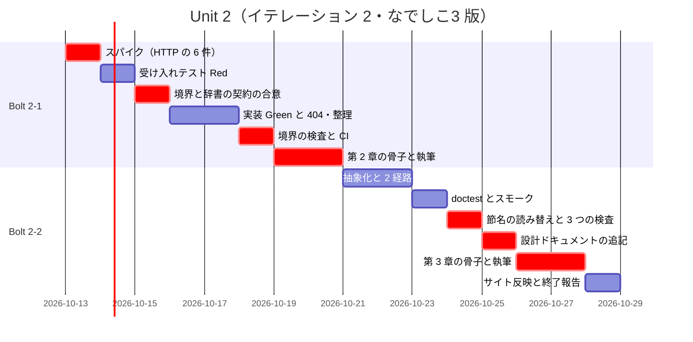
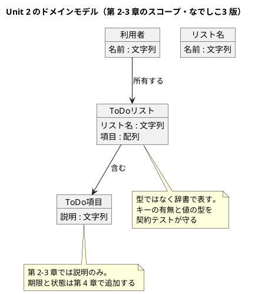
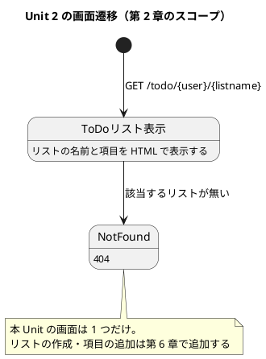

# Unit 2 の Bolt 計画（イテレーション 2）- Zettai 連載（なでしこ3 版）

## 概要

| 項目 | 内容 |
|------|------|
| **イテレーション** | 2（なでしこ3 版） |
| **Unit** | Unit 2 ウォーキングスケルトンとドメイン分離 |
| **期間** | 2026-10-13 〜 2026-10-24（2 週間） |
| **Bolt 数** | 2（Bolt 2-1 第 2 章 / Bolt 2-2 第 3 章） |
| **局面** | 序盤（アウトサイドイン。[開発戦略](development_strategy.md)） |
| **人の検証負荷** | 11 ポイント |
| **承認ゲート** | 11 箇所 |

参照元と正は [Unit 1 の Bolt 計画](iteration_plan-nadesiko-1.md) と同じです。加えて、本 Unit から上流設計ドキュメントとの突合が始まります。

| 内容 | 正となる参照元 |
| :--- | :--- |
| 画面と URL | [UI 設計](../design/ui_design.md) |
| ユビキタス言語と要素表 | [ドメインモデル設計](../design/domain-model.md) |
| ドメインとアダプタの境界・ポート | [バックエンドアーキテクチャ](../design/architecture_backend.md) |
| 節構成 | [章構成マインドマップ](../article/draft.md) |

### 承認ゲートの運用形態（Unit 1 Try 4）

**本 Unit のゲートは「同期停止」で運用します。** 該当ステップで AI は停止し、人の承認を待ってから次へ進みます。

Unit 1 では 10 箇所のゲートを計画しながら 0 箇所しか機能しませんでした（連続実行したため）。運用形態を書いていなかったことが原因です。本 Unit では明記します。**連続実行に切り替える場合は、実行前に本節を書き換えて合意します。** 事後に「実はゲートを通っていなかった」という状態を作りません。

あわせて、各ゲートで**人が検証に使った時間**を記録します（Kotlin 版 Try 6。Unit 1 では計測できませんでした）。

---

## Unit 1 からの持ち込み

[Bolt 終了報告](bolt_report-nadesiko-1.md) の 8 件と、[ふりかえり](retrospective-nadesiko-1.md) の Try 5 件を入力にしています。Kotlin 版 Unit 2 の学び「終了報告の持ち込みだけを入力にすると戦略側の割り当てを取りこぼす」に従い、[開発戦略](development_strategy.md) の Unit 2 の割り当ても入力にしました。

| # | 持ち込み | 出典 | 消化するステップ |
| :--- | :--- | :--- | :--- |
| 1 | CI ワークフローの新設 | 終了報告 1 | 2-1.7 |
| 2 | 章をまたぐ引用の検査（Kotlin 版 Try 1） | 終了報告 2 | 2-2.7 |
| 3 | 節構成 ↔ マインドマップの一致検査（Kotlin 版 Try 2） | 終了報告 3 | 2-2.7 |
| 4 | 記事に書く数値の検査（Kotlin 版 Try 3） | 終了報告 4 | 2-2.7 |
| 5 | `doctest/` の受け入れシナリオを書き始める | 終了報告 5 | 2-2.4 |
| 6 | 簡易 HTTP サーバのフォーム POST とクエリ文字列の実機確認 | 終了報告 6 | 2-1.0 |
| 7 | 承認ゲートの運用形態を明記する | 終了報告 7 / Try 4 | 本計画の「承認ゲートの運用形態」節 |
| 8 | `architecture_backend.md` になでしこ3 版の差分を追記 | 終了報告 8 / 戦略 | 2-2.8 |
| 9 | 計画に環境の値を確定値として書かない | Try 1 | 本計画の「スパイクで確かめる項目」節 |
| 10 | テストランナーを作った直後にわざと壊して確かめる | Try 3 | 2-2.4（`doctest` のランナー） |
| 11 | スパイクで見つけた制約をその場でチェックリストにする | Try 5 | 2-1.0 の完了判定 |
| 12 | `ui_design.md` になでしこ3 版の差分を追記 | 戦略 | 2-2.8 |

---

## ゴール

### Unit 完了時の達成状態

1. **ウォーキングスケルトンが通っている**: HTTP のリクエストを受けて ToDo リストを HTML で返す縦串が、受け入れテストで検証されている
2. **ドメインとアダプタが分離されている**: ToDo リストのドメインがファイル単位で HTTP から独立し、ドメインだけをテストできる
3. **受け入れテストの入口ができている**: 業務の言葉で書いたシナリオを、実行経路を差し替えて回せる。**残り 10 章がこれを使う**
4. **辞書の契約が決まっている**: ドメインを辞書で表す形と、その契約テストの書き方が確定している
5. **CI が緑で回っている**: `make check` と記事に対する検査が GitHub Actions で動く
6. **第 2〜3 章が公開されている**: Release v0.1.0 の条件を満たす

3 番目と 4 番目が本 Unit の最重要項目です。**型の無い言語では、辞書の契約の決め方が Kotlin 版の型設計に相当します。** ここで決めた形を残り 10 章が使います。

### 成功基準

- [ ] `GET /todo/{user}/{listname}` が ToDo リストの項目を含む HTML を返す
- [ ] 存在しないリストへのリクエストが 404 を返す
- [ ] 縦串を検証する受け入れテストが green
- [ ] 同じシナリオが 2 経路（HTTP 経由・ドメイン直接）で green
- [ ] ドメインのファイルが簡易 HTTP サーバのプラグインを取り込んでいない
- [ ] 辞書を返す関数それぞれに契約テストが 1 本ある
- [ ] CI が green（`make check` と記事に対する検査）
- [ ] 記事のコード例検査が第 1〜3 章で違反 0 件
- [ ] 節構成が [章構成マインドマップ](../article/draft.md) と一致している（検査で機械的に確かめる）
- [ ] `doctest/` の受け入れシナリオが 1 件以上あり、`make check` から実行される
- [ ] `architecture_backend.md` と `ui_design.md` になでしこ3 版の差分節がある
- [ ] 各承認ゲートで人が検証に使った時間が記録されている

カバレッジは計測できません（[ADR-014](../adr/ADR-014-own-test-framework.md)）。代替指標は `doctest/` の受け入れシナリオ数で、**本 Unit の目標は 1 件以上**です。

---

## スパイクで確かめる項目（Unit 1 Try 1）

**以下は仮定であり、確定値ではありません。** ステップ 2-1.0 で実機確認し、結果を本計画に追記してから実装に入ります。Unit 1 では「Node 20」を確定値として 3 ファイルに書き、スパイクで覆って全部直しました。同じことを繰り返しません。

| # | 確かめること | 現時点の想定 | 外れたときの影響 |
| :--- | :--- | :--- | :--- |
| 1 | 簡易 HTTP サーバが**パスパラメータ**を扱えるか（`/todo/{user}/{listname}`） | 『簡易HTTPサーバ受信時』は URL の**前方一致**でしか振り分けられないため、パスの分解は自前で書く必要がある | URL 設計か、ルーティングの実装方針が変わる |
| 2 | フォーム POST が書けるか（`POSTデータ`） | 書ける | 第 6 章の到達点が変わる |
| 3 | クエリ文字列が取れるか（`GETデータ`） | 取れる | 第 8 章の射影の入口が変わる |
| 4 | ステータスコードを制御できるか（404 を返す） | 『簡易HTTPサーバヘッダ出力』で制御できる | 受入条件 2 が成立しない |
| 5 | HTTP 経由の受け入れテストをどう書くか（テスト中にサーバを起動して落とせるか） | `コマンド実行` で別プロセスとして起動し、`AJAX` 系の命令で叩く | ドメイン直接の経路だけになり、2 経路の比較ができない |
| 6 | 文字列の `{}` 展開で HTML を組み立てられるか | 組み立てられる。HTML エスケープは扱わない（教材のため） | テンプレートの方針が第 11 章より前に必要になる |

**完了判定**: 6 件すべてに「できる／できない」と、できない場合の代替が根拠つきで示され、**制約がチェックリストとして残っている**こと（Try 5）。

### スパイクの結果（2026-09-28）

| # | 結果 |
| :--- | :--- |
| 1 | **想定どおり。** 『簡易HTTPサーバ受信時』は URL の前方一致で振り分ける。`/todo` に登録すると `/todo/uberto/book` も届く。生のパスは `GETデータ["?URL"]` で取れる（クエリは除かれる）ので、`/` で区切って自前で分解する |
| 2 | **書ける。** `POSTデータ["name"]` でフォームの値が取れる |
| 3 | **取れる。** `GETデータ["x"]` でクエリの値が取れる |
| 4 | **制御できる。** `404で{"Content-Type":"text/html; charset=utf-8"}を簡易HTTPサーバヘッダ出力`。助詞は**で / を**（に / と ではない） |
| 5 | **書ける。ただし想定と違う。** サーバを**なでしこ3 のテストの中から起動できない**（`起動` で起こすと親プロセスが返らない）。`Makefile` 側でサーバを起動・停止し、テストは `AJAXテキスト取得` で叩くだけにする |
| 6 | **組み立てられる。** 文字列の `{}` 展開と `&` 連結で足りる。HTML エスケープは扱わない（教材のため） |

### 制約チェックリスト（Try 5）

本 Unit の実装で必ず踏まえること。

- [ ] プラグインの取り込みは相対パスで書く（`!「./node_modules/nadesiko3/src/plugin_httpserver.mjs」を取り込む`）。パッケージ名だけでは解決しない
- [ ] ルーティングは前方一致。パスの分解は自前で書く
- [ ] `簡易HTTPサーバヘッダ出力` の助詞は **で / を**
- [ ] HTTP 経由の受け入れテストは、サーバの起動・停止を `Makefile` に置く。テストの中から起動しない
- [ ] 待機は `N秒待機`（`Nミリ秒待機` は無い）
- [ ] 文字列の部分一致は `Sで「X」の出現回数`（`含む` は無い）

---

## 局面とアプローチ

序盤（アウトサイドイン）、ゲート密度 **密**。手順は Kotlin 版 Unit 2 と同じ 5 手順です。

1. 外側（HTTP レベルのテスト）を Red にする
2. 呼ぶ相手を決める。**ここで設計が駆動される**
3. 内側へ一段下りて、最小のドメインを置く
4. Green にする
5. リファクタリングする（第 3 章で高階関数による抽象化）

**薄く通すことを優先します。** ドメインを作り込むと、記事で説明していないコードが残ります。

### なでしこ3 固有の注意

型が無いので、手順 2 の「呼ぶ相手を決める」が Kotlin 版より曖昧になります。Kotlin 版は `ToDoListFetcher = (User, ListName) -> ToDoList?` という型を書けば契約が決まりました。なでしこ3 では**関数の名前と助詞、そして返す辞書のキー**が契約です。**決めたらその場で契約テストを書きます。** 書かないと、契約がどこにも残りません。

---

## Unit 2 の満足条件

### ユーザーストーリー

| ID | ユーザーストーリー | 検証負荷 | 優先度 |
|----|-------------------|----|----|
| US-002 | 第 2 章「関数を使って HTTP を扱う」を公開する（ウォーキングスケルトン） | 6 | 必須 |
| US-003 | 第 3 章「ドメインの定義とテスト」を公開する | 5 | 必須 |
| **合計** | | **11** | |

#### US-002: 第 2 章を公開する

**ストーリー**:
> 読者として、HTTP のリクエストが最終的に画面になるまでの道筋を、最小のコードで一度通して見たい。なぜなら、全体の形が見えないまま部分を作り込んでも、その部分がどこに収まるのか分からないからだ。

**受入条件**:

1. `GET /todo/{user}/{listname}` が ToDo リストの項目を含む HTML を返す（[UI 設計](../design/ui_design.md) の URL 規約に従う）
2. 存在しないリストへのリクエストが 404 を返す
3. HTTP ハンドラが**関数値**として表現され、ルーティングに渡されている
4. ToDo リストのデータがインメモリの辞書から供給されている（永続化は第 9 章）
5. 縦串を検証するテストがあり、green である
6. ドメインの辞書（`ToDoリスト`・`ToDo項目`）に契約テストが 1 本ずつある
7. 節構成が [章構成マインドマップ](../article/draft.md) の第 2 章（プロジェクトのキックオフ／関数型で HTML ページを提供する／Zettai の開発を始める／矢印で設計する／ToDo リストをマップで提供する／まとめ）と一致している

#### US-003: 第 3 章を公開する

**ストーリー**:
> 読者として、受け入れテストを「画面を叩く手順」ではなく「業務の言葉」で書きたい。なぜなら、手順で書いたテストは実装を変えるたびに壊れ、テストがリファクタリングの足かせになるからだ。

**受入条件**:

1. 受け入れテストが業務の言葉（ToDo リスト・項目）で書かれ、HTTP の詳細を直接扱わない
2. テストの入口が高階関数で抽象化され、実行方法（HTTP 経由／ドメイン直接）を差し替えられる
3. ドメインのファイルが簡易 HTTP サーバのプラグインを取り込まず、ドメインだけをテストできる
4. 同じシナリオが 2 経路とも green である
5. 節構成がマインドマップの第 3 章と一致している（**第 5 節の読み替えは後述**）

### 節名の不整合と読み替え（設計との突合で検出）

[章構成マインドマップ](../article/draft.md) の第 3 章 第 5 節は **「DDT を Pesticide に変換する」** です。Pesticide は Kotlin のライブラリで、なでしこ3 には存在しません。

執筆規約は「章内の節は draft.md のマインドマップに一致させる」としていますが、**この節名だけは 1 言語目のライブラリ名を含んでいます**。多言語シリーズの一次情報としては不適切です。

**本 Unit で次のとおり解消します。**

1. `draft.md` の該当節に、言語別の読み替えを注記する（マインドマップ本体は変えない。Kotlin 版の既存記事が参照しているため）
2. なでしこ3 版の第 3 章 第 5 節は **「DDT を共通の仕組みに変換する」** とする
3. [執筆計画](../article/outline.md) の執筆規約に「節名が特定言語のライブラリ名を含む場合、対象言語での対応物に読み替え、`draft.md` に注記する」を追記する

この判断はステップ 2-2.9 の承認ゲートで確認します。**設計（draft.md）が正なので、勝手に節名を変えません。** 読み替えを設計側に登録してから記事を書きます。

### NFR 定義（Unit 2 固有）

| NFR | 内容 | 判定方法 |
| :--- | :--- | :--- |
| テスト実行時間 | `make check` が 30 秒以内（受け入れテストを含む） | CI とローカルの両方で計測する |
| ドメインの独立性 | ドメインのファイルが簡易 HTTP サーバのプラグインを取り込まない | `!「...plugin_httpserver.mjs」を取り込む` の有無を機械的に検査する |
| 記事とコードの一致 | 逐語でない抜粋を除き違反 0 件 | CI の `check_article_code.py` |
| 辞書の契約 | 辞書を返す関数それぞれに契約テストが 1 本 | 人の検証（全 Bolt 共通のゲート項目） |

### 測定基準

| 測定基準 | Unit 2 での目標 | Intent とのつながり |
| :--- | :--- | :--- |
| 公開済みの章 | 3 / 13 | 全 13 章公開という Intent の進捗 |
| 受け入れシナリオ数 | 1 件以上 | カバレッジの代替。品質の定量指標 |
| 記事とサンプル実装の一致 | 100%（CI で機械検証） | 「動くサンプル実装つき」という Intent の条件 |
| 読者が再現できるか | 第 2 章の手順だけでローカルにサーバーが立つ | 「読者が手元で再現できる」という Intent の中核 |

---

## エントロピー評価

| 評価軸 | 評価 | 根拠 | 高いときの対応 |
| :--- | :--- | :--- | :--- |
| 意図の曖昧さ | **LOW** | 受入条件がコマンドと HTTP の応答で判定できる。節構成も確定している（第 3 章 第 5 節の読み替えを除く） | — |
| 構造的不確実性 | **MED** | ドメインとアダプタの境界は [バックエンドアーキテクチャ](../design/architecture_backend.md) にあるが、**型ではなくファイルと辞書で表す形**が未確定 | ステップ 2-1.3 で境界と辞書の契約を人に提示して合意する |
| 検証の不確実性 | **MED** | HTTP の応答は自動判定できる。記事は人が読むしかない | 記事のステップは全文検証のゲートを置く |
| リスク | **MED** | CI の新設（外部サービス連携）と、簡易 HTTP サーバの挙動 6 件が未確認 | 2-1.0 のスパイクと 2-1.7 のゲートで止める |
| 未解決の仮定 | **MED** | Unit 1 で処理系とテスト基盤は確定した。残るのは HTTP の扱い 6 件で、いずれも代替がある | スパイクで潰す |

**総合**: MED が 4 軸、HIGH が 0 軸。Unit 1（HIGH 3 軸）より下がりました。それでもゲート密度は**密**を維持します。理由は 2 つです。

- ウォーキングスケルトンで以降の全 Unit の土台が決まる（[開発戦略](development_strategy.md) の方針）
- **Unit 1 のゲートが実際には 1 つも機能していない**ため、AI の出力品質がまだ人の目で確かめられていない

[リリース計画](release_plan-nadesiko.md) は「ゲート密度の見直しは Unit 1 の完了時に 1 回」としていましたが、**見直しの前提（Unit 1 での実績）が得られていません。** 見直しは本 Unit の完了時に繰り延べます。

---

## スコープ・深さ・テスト戦略

| 軸 | 選択 | 理由 |
| :--- | :--- | :--- |
| スコープ | **全ステージ** | 実装・テスト・記事・設計ドキュメント・CI のすべてを触る |
| 深さ | **Standard** | 記事として公開するため手順とコードの正確さが要る |
| テスト戦略 | **Standard** | 本番機能に相当する。Unit 1 の Minimal から上げる |

Standard の中身には**契約テスト**が含まれます（[開発戦略](development_strategy.md)）。辞書を返す関数ごとに 1 本置きます。

---

## Bolt 2-1: ウォーキングスケルトン（第 2 章）

### Bolt ゴール

> HTTP のリクエストから ToDo リストの HTML までを最小の厚みで通し、第 2 章として公開する。**確認したい仮説**: 簡易 HTTP サーバのプラグインで、Zettai のルーティングと HTML の応答が過不足なく書ける。

### ステップ計画

- [ ] **2-1.0 スパイク**: 「スパイクで確かめる項目」の 6 件を実機で潰し、制約をチェックリストとして残す（持ち込み 6・11）
  - 完了判定: 6 件すべてに答えが出て、制約が箇条書きで残っている
  - **人の確認が必要**（結果で実装方針が変わる）
- [ ] **2-1.1 受け入れテストを書く（Red）**: `GET /todo/uberto/book` が項目を含む HTML を返すことを確かめるテストを書き、**失敗の理由が意図どおりか**を確認する
  - 完了判定: テストが実行され、期待どおり失敗する（文法エラーではない）
- [ ] **2-1.2 ドメインとアダプタの境界を決める**: ファイル分割と、`ToDoリスト`・`ToDo項目` の辞書のキーを提示する
  - 入力: [ドメインモデル設計](../design/domain-model.md) の要素表（章 2 の行）、[バックエンドアーキテクチャ](../design/architecture_backend.md) の境界の定義
  - 完了判定: キー名がユビキタス言語の対訳表と対応し、契約テストの書き方が決まっている
  - **人の確認が必要**（残り 10 章を縛る。型が無いぶん、後から変えても静かに壊れる）
- [ ] **2-1.3 最小のドメインとハンドラを実装する（Green）**: 辞書を返す関数と契約テストを同時に書く
  - 完了判定: `make check` が green。受け入れテストが通る
- [ ] **2-1.4 404 を返す（Red → Green）**: 存在しないリストへのリクエストに 404 を返す
  - 完了判定: 受入条件 2 を満たすテストが green
- [ ] **2-1.5 リファクタリング**: ハンドラを関数値として扱い、ルーティングから切り離す
  - 完了判定: `make check` が green で、ドメインのファイルがプラグインを取り込んでいない
- [ ] **2-1.6 境界の検査を足す**: ドメインのファイルが簡易 HTTP サーバのプラグインを取り込んでいないことを機械的に検査する
  - 完了判定: わざと取り込みを足すと検査が落ちる（Kotlin 版の `DomainBoundaryTest` に相当）
- [ ] **2-1.7 CI の新設**: `.github/workflows/nadesiko-zettai.yml` を作る（持ち込み 1）
  - 入力: `.github/workflows/kotlin-zettai.yml`（雛形。PostgreSQL のサービスは不要）
  - 完了判定: `make check` と記事に対する検査が GitHub Actions で green
  - **人の確認が必要**（新規ファイル作成・外部サービス連携）
- [ ] **2-1.8 第 2 章の骨子**: マインドマップの第 2 章から節見出しを起こし、つまずき節の内容を決める
  - **人の確認が必要**（記事の構成は契約）
- [ ] **2-1.9 chapter02.md の執筆**: コード例は実装から転記する
  - **人の確認が必要**（全文検証）
- [ ] **2-1.10 サイト反映**: nav・シリーズ索引・執筆計画を揃える

### Bolt 2-1 の完了条件

- [ ] `GET /todo/{user}/{listname}` が HTML を返し、存在しないリストは 404
- [ ] 受け入れテストと契約テストが green
- [ ] ドメインの境界の検査が入っている
- [ ] CI が green
- [ ] 第 2 章が公開されている
- [ ] 確認したい仮説に答えが出ている

---

## Bolt 2-2: ドメイン分離と受け入れテストの入口（第 3 章）

### Bolt ゴール

> 受け入れテストを業務の言葉で書けるようにし、実行経路を差し替えられる形にして第 3 章として公開する。**確認したい仮説**: ライブラリの無い言語でも、高階関数だけで実行経路を差し替えられる形が作れる。

### ステップ計画

- [ ] **2-2.1 受け入れテストの問題を言語化する**: 2-1.1 で書いたテストが何を知りすぎているかを書き出す
  - 完了判定: 業務として意味のある行と、実装がたまたまそうなっている行が分かれている
- [ ] **2-2.2 高階関数で入口を抽象化する（Red → Green）**: 操作の一覧を宣言し、実行経路を関数値で差し替えられるようにする
  - 完了判定: シナリオが業務の言葉だけで書けている
- [ ] **2-2.3 ドメイン直接の実行経路を足す（Red → Green）**: 同じシナリオを HTTP を通さずに実行する
  - 完了判定: 同一のシナリオが 2 経路とも green。片方だけ落ちる状態にならない
- [ ] **2-2.4 `doctest/` の受け入れシナリオを書く**: 期待出力の形式でシナリオを 1 件以上置き、`make check` から実行する（持ち込み 5・10）
  - 完了判定: **わざと期待出力を壊すと `make check` が落ちる**ことを確認している（Try 3）
- [ ] **2-2.5 Unit 1 のデモ項目をスモークとして自動化する**: devShell の起動と `make check` の green を `doctest/` で確かめる
  - 完了判定: Unit 1 のデモ項目 1・2 が手動実演でなくなる
- [ ] **2-2.6 節名の読み替えを設計に登録する**: `draft.md` に注記を足し、`outline.md` の執筆規約に規則を追記する
  - **人の確認が必要**（設計ドキュメントの変更。マインドマップは章構成の一次情報）
- [ ] **2-2.7 記事に対する 3 つの検査を足す**（持ち込み 2・3・4。Kotlin 版 Try 1・2・3）
  - 章をまたぐ引用が引用元に実在するか
  - 記事の節構成がマインドマップと一致しているか（**読み替えを考慮する**）
  - 記事に書いた件数の主張が実物と合っているか
  - 完了判定: 3 つとも、わざと違反を作ると落ちる。CI に入っている
  - **人の確認が必要**（新規ファイル作成。誤検知だらけだと運用できない）
- [ ] **2-2.8 設計ドキュメントになでしこ3 版の差分を追記する**（持ち込み 8・12）
  - `architecture_backend.md`: ファイル単位のモジュール分割と、取り込みの向きで依存を表す方法
  - `ui_design.md`: HTML の組み立て方（文字列の `{}` 展開）と、パスの分解を自前で書くこと
  - **人の確認が必要**（設計ドキュメントの変更）
- [ ] **2-2.9 第 3 章の骨子**: 節見出しを起こす（第 5 節は読み替え後の名前）
  - **人の確認が必要**（記事の構成は契約。読み替えの確認を含む）
- [ ] **2-2.10 chapter03.md の執筆**
  - **人の確認が必要**（全文検証）
- [ ] **2-2.11 サイト反映と OKF 適用**: `gulp okf:check` が ERROR 0
- [ ] **2-2.12 Bolt 終了報告とふりかえり**: 実績と KPT を残し、**Unit 3 のゲート密度をここで決める**
  - 完了判定: 人が検証に使った時間が記録されている
  - **人の確認が必要**（ゲート密度の決定は人の判断）

### Bolt 2-2 の完了条件

- [ ] 業務の言葉で書いたシナリオが 2 経路で green
- [ ] ドメインのファイルがプラグインを取り込んでいない
- [ ] `doctest/` のシナリオが 1 件以上あり、壊すと落ちる
- [ ] 記事に対する 3 つの検査が CI に入っている
- [ ] 設計ドキュメント 2 本になでしこ3 版の差分節がある
- [ ] 第 3 章が公開されている
- [ ] Unit 3 のゲート密度が決まっている

---

## 受入条件とステップの対応

| ストーリー | 受入条件 | カバーするステップ | 判定方法 |
| :--- | :--- | :--- | :--- |
| US-002 | 1. HTML を返す | 2-1.1・2-1.3 | 受け入れテスト |
| US-002 | 2. 404 を返す | 2-1.4 | 受け入れテスト |
| US-002 | 3. ハンドラが関数値 | 2-1.5 | 実装を目視（人の検証） |
| US-002 | 4. インメモリの辞書から供給 | 2-1.3 | 実装を目視 |
| US-002 | 5. 縦串のテストが green | 2-1.1・2-1.3 | `make check` |
| US-002 | 6. 契約テストが 1 本ずつ | 2-1.2・2-1.3 | 人の検証（全 Bolt 共通のゲート項目） |
| US-002 | 7. 節構成がマインドマップと一致 | 2-1.8・2-1.9・2-2.7 | 2-2.7 の検査（それまでは人の突合） |
| US-003 | 1. 業務の言葉で書かれている | 2-2.1・2-2.2 | 人の検証 |
| US-003 | 2. 実行経路を差し替えられる | 2-2.2 | シナリオのコードを目視 |
| US-003 | 3. ドメインがプラグインを取り込まない | 2-1.6・2-2.3 | 2-1.6 の検査 |
| US-003 | 4. 2 経路とも green | 2-2.3 | `make check` |
| US-003 | 5. 節構成が一致（読み替え込み） | 2-2.6・2-2.9・2-2.10 | 2-2.7 の検査 |

US-002 の受入条件 7 は、検査が入る 2-2.7 より前に記事を書くため、Bolt 2-1 では人が突合します。Unit の完了判定で検査によって再確認します。

---

## 承認ゲート

### 本 Unit のゲート密度: 密（11 箇所）

| ステップ | 停止理由 |
| :--- | :--- |
| 2-1.0 | スパイクの結果で実装方針が変わる |
| 2-1.2 | ドメインとアダプタの境界と辞書の契約。残り 10 章を縛る |
| 2-1.7 | CI の新設（新規ファイル作成・外部サービス連携） |
| 2-1.8 / 2-2.9 | 記事の構成は契約。後戻りコストが最大 |
| 2-1.9 / 2-2.10 | 記事の全文検証。自動判定できない |
| 2-2.6 | 設計ドキュメント（マインドマップ）の変更 |
| 2-2.7 | 検査の新設。誤検知だらけだと運用できない |
| 2-2.8 | 設計ドキュメントの変更 |
| 2-2.12 | Unit 3 のゲート密度の決定 |

運用形態は本計画の冒頭に書いたとおり**同期停止**です。

### 全 Bolt 共通のゲート項目

Unit 1 では 4 項目のうち 1 項目（契約テスト）が対象外でしたが、**本 Unit から 4 項目すべてが対象**です。

| 項目 | 本 Unit での扱い |
| :--- | :--- |
| 契約テストがあるか | **適用**。`ToDoリスト`・`ToDo項目` を返す関数ごとに 1 本 |
| 厳密比較になっているか | 適用 |
| 記事のコード例が実装からの転記か | 適用（`check_article_code.py`） |
| つまずき節があるか | 適用。第 2・3 章それぞれに 1 つ以上 |

### 集中時間

想定稼働は 10 時間/週です。ゲートが 11 箇所あり、うち境界の合意（2-1.2）と記事の全文検証（2-1.9・2-2.10）は連続した時間を要します。**Week 1 の Day 3 と Week 2 の Day 8-9 に 2 時間以上を先に確保します。**

---

## スケジュール



---

## 設計

### Unit 2 のドメインモデル（第 2〜3 章のスコープ）



[ドメインモデル設計](../design/domain-model.md) の要素表（章 2 の行）に対応します。**ユビキタス言語は Kotlin 版と同じ**ですが、識別子にひらがなを使えないため、コード上の名前は漢字・カタカナ・英数字で組みます。対訳は記事で示します。

| ドメインモデル設計の名前 | なでしこ3 版のコード上の名前 |
| :--- | :--- |
| `User` | `利用者` |
| `ListName` | `リスト名` |
| `ToDoList` | `ToDoリスト` |
| `ToDoItem` | `ToDo項目` |

### Unit 2 の画面遷移（第 2 章のスコープ）



[UI 設計](../design/ui_design.md) の「画面遷移（第 2 章時点）」と同じです。URL 規約（`/todo/{user}/{listname}`、利用者はパスに含める、一覧は複数形にしない）もそのまま従います。

### 本 Unit で省略する設計図

| 設計図 | 本 Unit での扱い | 初回作成 |
| :--- | :--- | :--- |
| 状態遷移図 | **省略**。`ToDo項目` はまだ状態を持たない | Unit 4（第 6 章） |
| ER 図 | **省略**。永続化を扱わない。データはインメモリの辞書 | Unit 5（第 9 章） |

**ユーザーマニュアルは対象外です。** 画面は出ますが、読者向けの操作手順は第 2 章の記事そのものが担います。[開発戦略](development_strategy.md) のとおり Zettai にはエンドユーザーがいないため、以降の Unit でも作りません。

### `docs/design/` への反映

| 反映先 | 内容 | ステップ |
| :--- | :--- | :--- |
| `architecture_backend.md` | ファイル単位のモジュール分割、取り込みの向きで依存を表す方法、境界の検査 | 2-2.8 |
| `ui_design.md` | HTML の組み立て（文字列の `{}` 展開）、パスの分解を自前で書くこと | 2-2.8 |
| `domain-model.md` | 本 Unit では変更しない。辞書のキーの一覧は Unit 3〜4 で追記する | — |
| `draft.md` | 第 3 章 第 5 節の言語別の読み替えを注記する | 2-2.6 |

### ディレクトリ構成

```text
apps/nadesiko/zettai/
├── src/
│   ├── domain.nako3          # 新設（ToDoリスト・ToDo項目。プラグインを取り込まない）
│   ├── web.nako3             # 新設（簡易 HTTP サーバのアダプタ）
│   └── main.nako3            # 既存（サーバの起動に書き換える）
├── test/
│   ├── domain_test.nako3     # 新設（契約テストを含む）
│   ├── boundary_test.nako3   # 新設（境界の検査）
│   └── ddt/                  # 新設（受け入れテストの入口と 2 つの実行経路）
└── doctest/                  # シナリオを 1 件以上

.github/workflows/
└── nadesiko-zettai.yml       # 新設

ops/scripts/article/
├── check_quotes.py           # 新設（章をまたぐ引用）
├── check_sections.py         # 新設（節構成 ↔ マインドマップ）
└── check_numbers.py          # 新設（記事に書いた件数）
```

ファイル名と検査スクリプトの名前はステップ 2-1.2・2-2.7 で人の承認を得ます。

### ADR

| ADR | タイトル | 起案するステップ |
|-----|---------|-----------|
| ADR-015（予定） | 受け入れテストの入口を自作し、ライブラリを使わない | 2-2.2 |

Kotlin 版の [ADR-002](../adr/ADR-002-ddt-pesticide.md)（Cucumber ではなく DDT / Pesticide）と対になります。なでしこ3 には Pesticide が無いので、判断の中身は変わります。

---

## リスクと対策

| リスク | 影響度 | 台帳との対応 | 対策 | 承認ゲート |
| :--- | :--- | :--- | :--- | :--- |
| 簡易 HTTP サーバがパスパラメータを扱えず、URL 設計が変わる | 中 | [リリース計画](release_plan-nadesiko.md) 技術リスク 3 | パスの分解を自前で書く。[UI 設計](../design/ui_design.md) の URL 規約は変えない | 2-1.0 で停止 |
| HTTP 経由の受け入れテストが書けず、2 経路の比較ができない | 高 | 新規（本 Bolt で台帳に追加） | スパイクで先に確かめる。書けなければドメイン直接の 1 経路にし、第 3 章の主題を「経路の差し替え」から「業務の言葉で書く」に絞る | 2-1.0 で停止 |
| 辞書のキーを誤ると、残り 10 章で静かに壊れる | 高 | 技術リスク 1 | キーの案を実装前に人に提示し、決めたその場で契約テストを書く | 2-1.2 で停止 |
| 記事に対する 3 つの検査が誤検知だらけで運用できない | 中 | 新規 | 除外ルールを人が決める。誤検知が出たら検査を緩めず、まず記事を直せるか見る | 2-2.7 で停止 |
| 節名の読み替えを勝手に決めて、マインドマップと記事がずれる | 中 | 新規 | 読み替えを設計側（`draft.md`・`outline.md`）に先に登録してから記事を書く | 2-2.6 で停止 |
| ゲートが 11 箇所あり、人の検証時間が確保できない | 高 | スケジュールリスク 4 | Week 1 Day 3・Week 2 Day 8-9 に 2 時間以上確保する。**Unit 1 のようにゲートを飛ばして進めない** | — |
| 縦串を通す過程でドメインを作り込みすぎる | 中 | スケジュールリスク 2 | 「薄く通す」を Bolt ゴールに明記した | 2-1.2・2-1.3 |

---

## Deployment Unit としての完了条件

### Definition of Done

- [ ] `GET /todo/{user}/{listname}` が HTML を返し、存在しないリストは 404
- [ ] 縦串の受け入れテストが green
- [ ] 同じシナリオが 2 経路で green
- [ ] ドメインのファイルがプラグインを取り込まず、境界の検査が入っている
- [ ] 辞書を返す関数それぞれに契約テストが 1 本ある
- [ ] `doctest/` のシナリオが 1 件以上あり、壊すと `make check` が落ちる
- [ ] CI が green（`make check` と記事に対する検査）
- [ ] 記事に対する 3 つの検査が入り、第 1〜3 章で違反 0 件
- [ ] 節名の読み替えが `draft.md` と `outline.md` に登録されている
- [ ] 第 2〜3 章が公開され、それぞれにつまずき節がある
- [ ] `architecture_backend.md` と `ui_design.md` になでしこ3 版の差分節がある
- [ ] `gulp okf:check` が ERROR 0
- [ ] 実装と記事のコミットが分かれている
- [ ] **全承認ゲート 11 箇所を通過した**（Unit 1 で 0 / 10 だったため、本 Unit の最重要項目）
- [ ] 各ゲートで人が検証に使った時間が記録されている
- [ ] Bolt 終了報告とふりかえり（KPT）を作成した
- [ ] Unit 3 のゲート密度が決まっている
- [ ] Release v0.1.0 のリリース条件を満たしている
- [ ] デモ項目がすべて実演できる

### デモ項目

1. `make run` でサーバーを起動し、ブラウザで `/todo/uberto/book` を開くと ToDo リストが表示される
2. 存在しないリスト名を指定すると 404 が返る
3. 受け入れテストのコードを開き、業務の言葉で書かれていることと、実行経路を差し替えられることを示す
4. ドメインのテストだけを実行し、簡易 HTTP サーバなしで通ることを示す
5. ドメインのファイルにわざとプラグインの取り込みを足し、境界の検査が落ちることを示す
6. 記事のコード例検査を意図的に失敗させ、CI が検知することを示す
7. `doctest/` の期待出力をわざと壊し、`make check` が落ちることを示す

デモ項目 5・7 がこの対象に固有です。**検査が本当に止めることを見せる**のが、型検査の無い言語での受け入れ基準です。

---

## 指標（Bolt 終了報告へ引き継ぐ）

| 指標 | 計画 | 実績 |
| :--- | :--- | :--- |
| 完了 Unit 数 | 1（累計 2 / 7） | - |
| 承認ゲート通過数 | 11 | - |
| 変更依頼数 | Kotlin 版 Unit 2（[Bolt 終了報告](bolt_report-2.md)）以下 | - |
| **人が検証に使った時間** | ゲートごとに記録する | - |
| リードタイム | 10 営業日（参考値） | - |
| 受け入れシナリオ数 | 1 件以上 | - |
| テスト実行時間 | `make check` が 30 秒以内 | - |
| 持ち込み項目の消化 | 12 / 12 | - |
| エントロピー評価の的中 | MED 4 軸・LOW 1 軸 | - |

---

## 更新履歴

| 日付 | 更新内容 | 更新者 |
|------|---------|--------|
| 2026-09-28 | 初版作成（AI-DLC 準拠）。Unit 2 の満足条件・エントロピー評価・Bolt 2-1 と 2-2 のステップ計画（23 ステップ・承認ゲート 11 箇所）・Unit 2 のドメインモデル図と画面遷移図・Deployment Unit の完了条件を定義。Unit 1 のふりかえり Try 5 件と終了報告の持ち込み 8 件を反映。上流設計との突合で第 3 章 第 5 節の節名の不整合を検出し、解消の手順を計画に入れた | claude-code/claude-opus-5 |

---

## 関連ドキュメント

- [リリース計画（なでしこ3 版）](release_plan-nadesiko.md) / [開発戦略](development_strategy.md)
- [Unit 1 の Bolt 計画](iteration_plan-nadesiko-1.md) / [Bolt 終了報告](bolt_report-nadesiko-1.md) / [ふりかえり](retrospective-nadesiko-1.md)
- [Unit 2 の Bolt 計画（Kotlin 版）](iteration_plan-2.md)（本計画の雛形）
- [UI 設計](../design/ui_design.md) / [ドメインモデル設計](../design/domain-model.md) / [バックエンドアーキテクチャ](../design/architecture_backend.md)
- [執筆計画](../article/outline.md) / [章構成マインドマップ](../article/draft.md)
