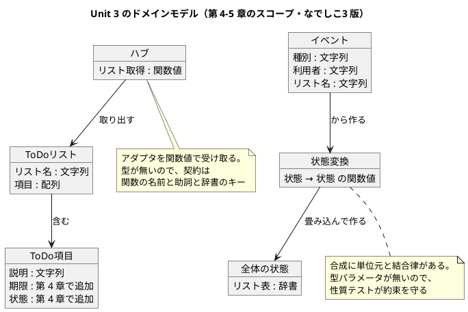

# Unit 3 の Bolt 計画（イテレーション 3）- Zettai 連載（なでしこ3 版）

## 概要

| 項目 | 内容 |
|------|------|
| **イテレーション** | 3（なでしこ3 版） |
| **Unit** | Unit 3 関数型 DI とイベント |
| **期間** | 2026-10-27 〜 2026-11-07（2 週間） |
| **Bolt 数** | 2（Bolt 3-1 第 4 章 / Bolt 3-2 第 5 章） |
| **局面** | **中盤（インサイドアウト）**。[開発戦略](development_strategy.md) |
| **人の検証負荷** | 11 ポイント |
| **承認ゲート** | **4 箇所（3 種類）**。Unit 2 の 11 箇所から絞った |

参照元と正は [Unit 2 の Bolt 計画](iteration_plan-nadesiko-2.md) と同じです。

### 承認ゲートの運用形態

**本 Unit のゲートは「同期停止」で運用します。** 該当ステップで AI は停止し、人の承認を待ちます。

> **本節は人だけが書き換えます。** AI は書き換えません。
>
> Unit 2 では「連続実行に切り替える場合は実行前に本節を書き換えて合意する」と定めましたが、AI が自分を縛るルールを書き換えようとする形になり、ツールに止められました。妥当な判断です。運用形態を変えるなら、**人が本節を書き換えてから**実行します。AI は切り替えを求められたら、書き換えずに人へ判断を仰ぎます（Unit 2 Try 2）。

### なぜゲートを 4 箇所に絞るか

Unit 1 は 10 箇所、Unit 2 は 11 箇所を計画し、**どちらも実績 0 箇所**でした。数が多いと「ここで止まる」重みが薄まります。

本 Unit は**必ず止まる 3 種類だけ**に絞ります。

| 種類 | 箇所 | 理由 |
| :--- | :--- | :--- |
| 辞書の契約の変更 | 3-1.2 | ハブはドメインの入口。残り 9 章を縛る。型が無いので後から変えても静かに壊れる |
| 設計ドキュメントの変更 | 3-2.7 | `domain-model.md` は全対象の一次情報。Kotlin 版にも影響する |
| 記事の全文検証 | 3-1.6・3-2.8 | 自動判定できない。後戻りコストが最大 |

残りのステップは連続して進め、**テスト失敗・未確認の仮定の発生・確認必須の操作に該当したときは必ず停止**します。各ゲートで人が検証に使った時間を記録します。

---

## Unit 2 からの持ち込み

| # | 持ち込み | 出典 | 消化するステップ |
| :--- | :--- | :--- | :--- |
| 1 | CI の実行確認（v0.1.0 の残件） | 終了報告 1 | 3-1.0 |
| 2 | Release v0.1.0 | 終了報告 3 | 3-1.1 |
| 3 | ゲートを絞る | 終了報告 4 / Try 1 | 本計画の「承認ゲートの運用形態」節 |
| 4 | `domain-model.md` に辞書のキーの一覧を追記 | 終了報告 5 | 3-2.7 |
| 5 | 検査を書くときに言語決め打ちをしていないか確かめる | 終了報告 6 / Try 4 | 3-2.6 |
| 6 | 新しいループに「繰り返す」のガードを入れる | 終了報告 7 / Try 5 | 全実装ステップの完了判定 |
| 7 | 運用形態の切り替えは人が行う | Try 2 | 本計画の「承認ゲートの運用形態」節 |
| 8 | 章を書く前に、その章で使う検査を先に入れる | Try 3 | 3-2.6（性質テストの検査を第 5 章の執筆前に入れる） |

`comparison/` の新設（終了報告 2）は Unit 2 で消化しました。

---

## ゴール

### Unit 完了時の達成状態

1. **アダプタが差し替え可能になっている**: ハブが関数値でアダプタを受け取り、インメモリの実装を外から渡せる
2. **状態変更がイベントの畳み込みで表されている**: `ListCreated`・`ItemAdded` を畳み込むと現在の状態になる
3. **モノイドが見えている**: 状態変換の合成に単位元と結合律があることを、性質テストで確かめている
4. **辞書の契約が育っている**: ハブ・イベント・状態の辞書のキーが決まり、契約テストがある
5. **第 4〜5 章が公開されている**

3 番目が本 Unit の山です。**型パラメータの無い言語で、代数構造をどう示すか**の最初の例になります。第 7・9・11・12 章が同じ形を使います。

### 成功基準

- [ ] ハブがアダプタを関数値で受け取り、テストから差し替えられる
- [ ] `ToDo項目` に期限と状態が加わり、契約テストが更新されている
- [ ] イベントの畳み込みで現在の状態が得られる
- [ ] 状態変換の単位元と結合律が、乱数で生成した入力に対して green
- [ ] 第 5 章の時点で、作成直後の空のリストが表示できる（[UI 設計](../design/ui_design.md)）
- [ ] 2 経路の受け入れシナリオが引き続き green
- [ ] 新しいループすべてに「繰り返す」のガードがある
- [ ] `domain-model.md` に辞書のキーの一覧がある
- [ ] 記事の 6 つの検査が違反 0 件
- [ ] 承認ゲート 4 箇所を通過し、人が検証に使った時間が記録されている

---

## スパイクで確かめる項目

**以下は仮定であり、確定値ではありません**（Unit 1 Try 1）。ステップ 3-1.0 で実機確認し、結果を本計画に追記してから実装に入ります。

| # | 確かめること | 現時点の想定 | 外れたときの影響 |
| :--- | :--- | :--- | :--- |
| 1 | 再帰が書けるか（第 5 章「再帰の力を解き放つ」） | 書ける | 節の主題が成立せず、畳み込みをループで書くことになる |
| 2 | 関数値を合成できるか（`andThen` 相当） | 関数を返す関数で手作りする。合成演算子は無い | モノイドの題材（状態変換の合成）が変わる |
| 3 | 乱数を生成できるか（性質テスト用） | できる | 性質テストが例示のテストに落ちる |
| 4 | 日付を扱えるか（`ToDo項目` の期限） | 扱える。文字列で持つ選択肢もある | 期限の表し方が変わる |
| 5 | CI が green か（v0.1.0 の残件） | green | v0.1.0 を出せない |

**完了判定**: 5 件すべてに答えが出て、制約がチェックリストとして残っていること（Unit 1 Try 5）。

### スパイクの結果（2026-09-28）

| # | 結果 |
| :--- | :--- |
| 1 | **書ける。** `●(Nの)階乗` の再帰が動く。ただし `N*((N-1)の階乗)` のように**式の中で再帰呼び出しを入れ子にすると落ちる**。一度変数に受ける |
| 2 | **書ける。** クロージャで引数の関数を捕捉する。`結果関数=関数(X) … ここまで` と変数に受けてから返す。`関数(X)` を書いて `それ` で受ける形は落ちる |
| 3 | **できる。** `Nの乱数` が 0 以上 N 未満の整数を返す |
| 4 | **扱える。** `今日` が `2026/09/28` の形の文字列を返す。日付の型は無いので**期限は文字列で持つ** |
| 5 | **未確認。** CI は push しないと判定できない。Release v0.1.0 の残件として残す |

### 制約チェックリスト

- [ ] 再帰呼び出しを式の中に入れ子にしない。一度変数に受ける
- [ ] 無名関数は変数に受けてから返す
- [ ] 期限は文字列（`YYYY/MM/DD`）で持つ。日付の型は無い
- [ ] 乱数は `Nの乱数`（0 以上 N 未満の整数）

---

## 局面とアプローチ

[開発戦略](development_strategy.md) では Unit 3 から **中盤（インサイドアウト）** です。序盤のアウトサイドインから切り替わります。

### 切り替える根拠

ここから扱うイベントの畳み込み・モノイド・状態変換は、**いずれもドメインの中で完結する設計**です。外側から入ると、HTTP のハンドラに業務ロジックが漏れます。

なでしこ3 版では、この必要性が Kotlin 版より高いと開発戦略で判断しています。**型が無いため、外から入ると「辞書がどんなキーを持つか」が誰にも分からないまま HTTP の層まで伝播する**からです。

### 手順

1. ドメインの中で辞書の契約を決め、**契約テストで固定する**
2. ドメインだけで Red-Green-Refactor を回す
3. 代数的な性質（単位元・結合律）を性質テストで確かめる
4. 固まってから上位（ハブ → HTTP アダプタ）へ展開する
5. 既存の 2 経路の受け入れシナリオが引き続き green であることを確かめる

5 番目が中盤の安全網です。**内側を作り替えても外から見た振る舞いが変わらないこと**を、Unit 2 で作った入口が保証します。

---

## Unit 3 の満足条件

### ユーザーストーリー

| ID | ユーザーストーリー | 検証負荷 | 優先度 |
|----|-------------------|----|----|
| US-004 | 第 4 章「ドメインとアダプタのモデリング」を公開する | 5 | 必須 |
| US-005 | 第 5 章「イベントで状態を変更する」を公開する | 6 | 必須 |
| **合計** | | **11** | |

#### US-004: 第 4 章を公開する

**ストーリー**:
> 読者として、データの取得元を後から差し替えられるようにしたい。なぜなら、今はインメモリの保管庫が実装の中に埋まっていて、テストのたびに同じデータしか使えないからだ。

**受入条件**:

1. ハブがアダプタ（リストの取得）を**関数値**で受け取る
2. テストからアダプタを差し替えられる（インメモリ以外の実装を渡せる）
3. `ToDo項目` に期限と状態が加わり、契約テストが更新されている
4. 状態は `Todo`・`InProgress`・`Done`・`Blocked` の 4 つ（[ドメインモデル設計](../design/domain-model.md) の `ToDoStatus`）
5. HTTP の層はハブしか知らない（[バックエンドアーキテクチャ](../design/architecture_backend.md)）
6. 節構成がマインドマップの第 4 章と一致している

#### US-005: 第 5 章を公開する

**ストーリー**:
> 読者として、「今どうなっているか」ではなく「何が起きたか」を保存したい。なぜなら、起きたことの並びからは今の状態を導けるが、今の状態からは何が起きたかを導けないからだ。

**受入条件**:

1. `ListCreated`・`ItemAdded` の 2 つのイベントがある（[ドメインモデル設計](../design/domain-model.md)）
2. イベントの並びを畳み込むと現在の状態が得られる
3. 状態変換が関数値として表され、合成できる
4. **単位元と結合律が、乱数で生成した入力に対して green**
5. 作成直後の空のリストが表示できる（[UI 設計](../design/ui_design.md)）
6. 節構成がマインドマップの第 5 章と一致している

### NFR 定義（Unit 3 固有）

| NFR | 内容 | 判定方法 |
| :--- | :--- | :--- |
| テスト実行時間 | `make check` が 30 秒以内（性質テストを含む） | 計測する。性質テストの試行回数は時間に収まる範囲で決める |
| ドメインの独立性 | ドメインのファイルがプラグインを取り込まない | `boundary_test.nako3` |
| 辞書の契約 | 辞書を返す関数それぞれに契約テストが 1 本 | 人の検証 |
| ループの安全性 | 新しいループすべてに空入力のガードがある | 実装ステップの完了判定 |

---

## エントロピー評価

| 評価軸 | 評価 | 根拠 | 高いときの対応 |
| :--- | :--- | :--- | :--- |
| 意図の曖昧さ | **LOW** | 到達点が [ドメインモデル設計](../design/domain-model.md) の要素表で確定している |  |
| 構造的不確実性 | **MED** | ハブと状態変換を**型なしでどう表すか**が未確定。Kotlin 版の構造はなぞれるが、型パラメータの置き換え先が要る | 3-1.2 で人に提示して合意する |
| 検証の不確実性 | **MED** | 性質テストを自作するため、「本当に法則を確かめているか」が自動判定できない | 法則を破る実装を意図的に入れて、性質テストが落ちることを確かめる |
| リスク | **LOW** | 新規の外部依存が無い。Unit 2 で基盤が揃った | — |
| 未解決の仮定 | **MED** | 再帰・関数合成・乱数の 3 件が未確認 | 3-1.0 のスパイクで潰す |

**総合**: MED が 3 軸。Unit 2（MED 4 軸）よりわずかに下がりました。

それでもゲート密度は**密**を維持します。[開発戦略](development_strategy.md) は「Unit 1-2 の実績で決める」としていましたが、**2 Unit 続けてゲートが同期的に機能せず、判断の材料が得られていません**。変更依頼数が 0 件なのは品質が高いからではなく、誰も見ていないからです。

代わりに**箇所を 4 つに絞りました**。密度を保ちつつ、止まる重みを戻します。

---

## スコープ・深さ・テスト戦略

| 軸 | 選択 | 理由 |
| :--- | :--- | :--- |
| スコープ | 全ステージ | 実装・テスト・記事・設計ドキュメント |
| 深さ | Standard | 記事として公開する |
| テスト戦略 | **Standard**（性質テストを追加） | 本番機能に相当する。代数的性質は例示のテストでは示せない |

---

## Bolt 3-1: 関数型の依存性注入（第 4 章）

### Bolt ゴール

> ハブがアダプタを関数値で受け取る形にし、`ToDo項目` に期限と状態を足して第 4 章として公開する。**確認したい仮説**: 型の無い言語でも、関数値とキーの約束だけで依存性注入の利点（差し替え可能性）が得られる。

### ステップ計画

- [ ] **3-1.0 スパイク**: 「スパイクで確かめる項目」の 5 件を実機で潰し、制約をチェックリストに残す（持ち込み 1）
- [ ] **3-1.1 Release v0.1.0**: CI の green を確認し、v0.1.0 のリリース条件を満たしたことを記録する（持ち込み 2）
- [ ] **3-1.2 ハブと辞書の契約を決める**: ハブの形、アダプタの助詞、`ToDo項目` に足す期限と状態のキーと値を提示する
  - 入力: [ドメインモデル設計](../design/domain-model.md) の要素表（章 4 の行）、[バックエンドアーキテクチャ](../design/architecture_backend.md) の「なでしこ3 版での差分」
  - 完了判定: キー名がユビキタス言語の対訳表と対応し、状態の 4 値が決まっている
  - **★人の確認が必要**（ドメインの入口。残り 9 章を縛る）
- [ ] **3-1.3 ドメインから書く（Red → Green）**: ハブと `ToDo項目` の拡張をドメインの中だけで実装し、契約テストを同時に書く
  - 完了判定: `make check` green。新しいループにガードがある
- [ ] **3-1.4 アダプタを差し替える**: テストからインメモリ以外の実装を渡し、同じシナリオが通ることを確かめる
  - 完了判定: 差し替えたアダプタでドメインのテストが green
- [ ] **3-1.5 上位へ展開する**: HTTP アダプタがハブしか知らない形に整える。2 経路の受け入れシナリオが引き続き green
- [ ] **3-1.6 第 4 章の骨子と執筆**: つまずき節を含める
  - **★人の確認が必要**（記事の全文検証）
- [ ] **3-1.7 サイト反映**

### Bolt 3-1 の完了条件

- [ ] ハブがアダプタを関数値で受け取り、差し替えられる
- [ ] `ToDo項目` の期限と状態に契約テストがある
- [ ] 2 経路の受け入れシナリオが green
- [ ] 第 4 章が公開されている
- [ ] Release v0.1.0 を出した
- [ ] 確認したい仮説に答えが出ている

---

## Bolt 3-2: イベントと畳み込み（第 5 章）

### Bolt ゴール

> 状態変更をイベントの畳み込みとして表し、状態変換の合成に単位元と結合律があることを性質テストで示して第 5 章として公開する。**確認したい仮説**: 型パラメータの無い言語でも、代数構造を「守る約束」としてテストで示せる。

### ステップ計画

- [ ] **3-2.1 イベントの契約を決める（Red → Green）**: `ListCreated`・`ItemAdded` の辞書のキーを決め、契約テストを書く
  - 入力: [ドメインモデル設計](../design/domain-model.md) のイベント表
- [ ] **3-2.2 畳み込みを書く（Red → Green）**: イベントの並びから状態を作る。**再帰で書けるかはスパイクの結果に従う**
  - 完了判定: 空の並び・1 件・複数件のいずれでも正しい。空でループが逆向きに回らない
- [ ] **3-2.3 状態変換を関数値にする（Refactor）**: 「イベントを適用する」を状態から状態への関数として表し、合成できるようにする
- [ ] **3-2.4 性質テストの土台を作る**: 乱数で入力を生成し、法則を確かめる仕組みを `test/helper.nako3` に足す
  - 完了判定: **法則を破る実装を入れると落ちる**ことを確かめている
- [ ] **3-2.5 単位元と結合律を確かめる**: 状態変換の合成がモノイドであることを性質テストで示す
- [ ] **3-2.6 検査を足す・見直す**: 性質テストの試行回数が記事の主張と合っているかの検査を足し、**既存 6 つの検査に言語決め打ちが無いか確かめる**（持ち込み 5・8。Unit 2 Try 3・4）
  - 完了判定: 新しい検査が、わざと違反を作ると落ちる。既存の検査に言語決め打ちが無い
- [ ] **3-2.7 設計ドキュメントを更新する**: `domain-model.md` に**辞書のキーの一覧**を追記する（持ち込み 4）。イベント・状態・ハブの契約を Kotlin 版の型定義と並べる
  - **★人の確認が必要**（全対象の一次情報。Kotlin 版にも影響する）
- [ ] **3-2.8 第 5 章の骨子と執筆**
  - **★人の確認が必要**（記事の全文検証）
- [ ] **3-2.9 サイト反映と OKF 適用**: `gulp okf:check` が ERROR 0
- [ ] **3-2.10 Bolt 終了報告とふりかえり**: **Unit 4 のゲート密度をここで決める**
  - 完了判定: 人が検証に使った時間が記録されている

### Bolt 3-2 の完了条件

- [ ] イベントの畳み込みで状態が得られる
- [ ] 単位元と結合律が性質テストで green
- [ ] 法則を破ると性質テストが落ちることを確かめた
- [ ] 空のリストが表示できる
- [ ] `domain-model.md` に辞書のキーの一覧がある
- [ ] 第 5 章が公開されている
- [ ] Unit 4 のゲート密度が決まっている

---

## 設計

### Unit 3 のドメインモデル（第 4〜5 章のスコープ）

[ドメインモデル設計](../design/domain-model.md) の要素表（章 4・5 の行）に対応します。ユビキタス言語は Kotlin 版と共通で、コード上の名前だけを漢字・カタカナ・英数字で組みます。

| ドメインモデル設計 | なでしこ3 版のコード上の名前 |
| :--- | :--- |
| `ToDoListHub` | `ハブ` |
| `ToDoStatus` | `状態`（`Todo`・`InProgress`・`Done`・`Blocked` の 4 値） |
| `ToDoListEvent` | `イベント` |
| `ToDoListState` | `全体状態` |
| `StateTransition` | `状態変換` |

**列挙型がありません。** `状態` は文字列の約束とし、4 値のいずれかであることを契約テストが確かめます。Kotlin 版は `enum class` で、取りうる値の網羅がコンパイラに保証されます。

### 状態遷移図

**本 Unit では省略します。** 第 4 章で `ToDoStatus` の 4 値が加わりますが、**遷移そのものは第 6 章（コマンド）で実装されます**（[ドメインモデル設計](../design/domain-model.md) の章の成長表）。本 Unit は値の定義までです。

### 画面遷移図

**本 Unit では省略します。** 画面は第 2 章の 1 つのままです。第 5 章で作成直後の空のリストが表示できるようになりますが、**同じ画面の中身が空になるだけ**で遷移は増えません（[UI 設計](../design/ui_design.md)）。

### ER 図

**本 Unit では省略します。** 永続化は第 9 章（Unit 5）です。データはインメモリの辞書のままです。

### ユーザーマニュアル

**対象外です。** Zettai にはエンドユーザーがいません（[開発戦略](development_strategy.md)）。

### `docs/design/` への反映

| 反映先 | 内容 | ステップ |
| :--- | :--- | :--- |
| `domain-model.md` | **辞書のキーの一覧**（ハブ・イベント・状態・状態変換）。Kotlin 版の型定義と並べる | 3-2.7 |
| `architecture_backend.md` | ハブがアダプタを関数値で受け取る形。「なでしこ3 版での差分」節に追記 | 3-1.5 |

---

## リスクと対策

| リスク | 影響度 | 対策 | 承認ゲート |
| :--- | :--- | :--- | :--- |
| 辞書のキーを誤ると、残り 9 章で静かに壊れる | 高 | キーの案を実装前に人に提示し、決めたその場で契約テストを書く | 3-1.2 で停止 |
| 性質テストが法則を確かめているつもりで確かめていない | 高 | **法則を破る実装を意図的に入れて、落ちることを確かめる**（3-2.4 の完了判定） | — |
| 再帰が書けず、第 5 章の節「再帰の力を解き放つ」が成立しない | 中 | スパイクで先に確かめる。書けなければ節の主題を「畳み込み」に寄せ、読み替えを `draft.md` に登録する | 3-1.0 で停止 |
| 列挙型が無く、状態の 4 値の網羅を保証できない | 中 | 契約テストで 4 値のいずれかであることを確かめる。第 6 章の遷移表（16 マス）を全件テストする方針は Kotlin 版と同じ | 3-1.2 で停止 |
| 性質テストで `make check` が 30 秒を超える | 低 | 試行回数を時間に収まる範囲で決める。記事にはその回数を書き、検査で実物と合わせる | — |
| ゲートを 4 箇所に絞ったことで、見るべき箇所を見落とす | 中 | 絞ったのは**止まる箇所**であり、事後のまとめ検証の対象は減らさない。終了報告に各ステップの判断を残す | — |
| 3 Unit 続けてゲートが機能しない | 高 | 運用形態の切り替えは人だけが行う（本計画の冒頭）。AI は求められたら判断を仰ぐ | — |

---

## Deployment Unit としての完了条件

### Definition of Done

- [ ] ハブがアダプタを関数値で受け取り、差し替えられる
- [ ] `ToDo項目` に期限と状態が加わり、契約テストが更新されている
- [ ] イベントの畳み込みで状態が得られる
- [ ] 単位元と結合律が性質テストで green。**法則を破ると落ちることを確かめた**
- [ ] 空のリストが表示できる
- [ ] 2 経路の受け入れシナリオが引き続き green
- [ ] 新しいループすべてに空入力のガードがある
- [ ] `domain-model.md` に辞書のキーの一覧がある
- [ ] 記事の検査が違反 0 件
- [ ] 第 4〜5 章が公開され、それぞれにつまずき節がある
- [ ] `gulp okf:check` が ERROR 0
- [ ] 実装と記事のコミットが分かれている
- [ ] **承認ゲート 4 箇所を通過した**
- [ ] 各ゲートで人が検証に使った時間が記録されている
- [ ] Bolt 終了報告とふりかえり（KPT）を作成した
- [ ] Unit 4 のゲート密度が決まっている
- [ ] デモ項目がすべて実演できる

### デモ項目

1. テストからアダプタを差し替え、同じドメインのテストが別のデータで通ることを示す
2. イベントの並びを渡すと現在の状態が得られることを示す
3. 状態変換の合成を、単位元と結合律の性質テストで示す
4. **合成の実装をわざと壊し、結合律のテストが落ちることを示す**
5. 空のリストを作り、ブラウザで表示されることを示す
6. Unit 2 の 2 経路の受け入れシナリオが引き続き green であることを示す

デモ項目 4 が本 Unit に固有です。**性質テストが本当に法則を確かめていることを見せる**のが、型パラメータの無い言語での受け入れ基準です。

---

## 指標（Bolt 終了報告へ引き継ぐ）

| 指標 | 計画 | 実績 |
| :--- | :--- | :--- |
| 完了 Unit 数 | 1（累計 3 / 7） | - |
| 承認ゲート通過数 | 4 | - |
| 変更依頼数 | Kotlin 版 Unit 3（[Bolt 終了報告](bolt_report-3.md)）以下 | - |
| **人が検証に使った時間** | ゲートごとに記録する | - |
| 受け入れシナリオ数 | 2 件以上 | - |
| 性質テストの試行回数 | 時間に収まる範囲で決める | - |
| テスト実行時間 | `make check` が 30 秒以内 | - |
| 持ち込み項目の消化 | 8 / 8 | - |

---

## 更新履歴

| 日付 | 更新内容 | 更新者 |
|------|---------|--------|
| 2026-09-28 | 初版作成（AI-DLC 準拠）。Unit 3 の満足条件・エントロピー評価・Bolt 3-1 と 3-2 のステップ計画（18 ステップ・承認ゲート 4 箇所）・Unit 3 のドメインモデル図・Deployment Unit の完了条件を定義。Unit 2 のふりかえり Try 5 件と終了報告の持ち込み 7 件を反映し、ゲートを 11 箇所から 4 箇所に絞り、運用形態の切り替えを人の作業と定めた | claude-code/claude-opus-5 |

---

## 関連ドキュメント

- [リリース計画（なでしこ3 版）](release_plan-nadesiko.md) / [開発戦略](development_strategy.md)
- [Unit 2 の Bolt 計画](iteration_plan-nadesiko-2.md) / [Bolt 終了報告](bolt_report-nadesiko-2.md) / [ふりかえり](retrospective-nadesiko-2.md)
- [Unit 3 の Bolt 計画（Kotlin 版）](iteration_plan-3.md)
- [ドメインモデル設計](../design/domain-model.md) / [バックエンドアーキテクチャ](../design/architecture_backend.md) / [UI 設計](../design/ui_design.md)
- [執筆計画](../article/outline.md) / [章構成マインドマップ](../article/draft.md)
