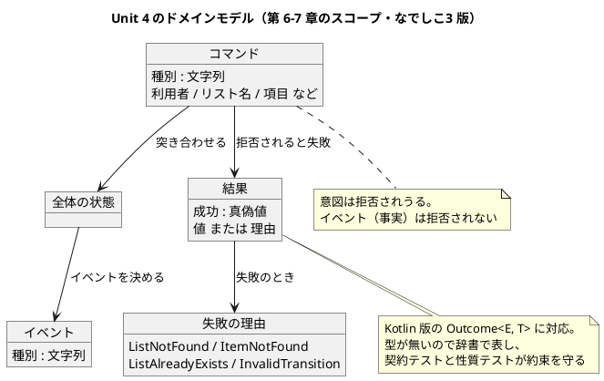
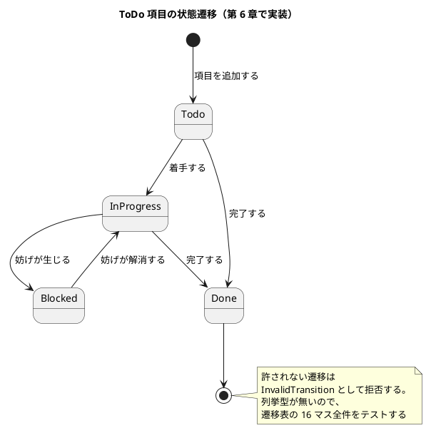

# Unit 4 の Bolt 計画（イテレーション 4）- Zettai 連載（なでしこ3 版）

## 概要

| 項目 | 内容 |
|------|------|
| **イテレーション** | 4（なでしこ3 版） |
| **Unit** | Unit 4 コマンドとエラーハンドリング |
| **期間** | 2026-11-10 〜 2026-11-21（2 週間） |
| **Bolt 数** | 2（Bolt 4-1 第 6 章 / Bolt 4-2 第 7 章） |
| **局面** | 中盤（インサイドアウト）。[開発戦略](development_strategy.md) |
| **人の検証負荷** | 11 ポイント |
| **承認ゲート** | **5 箇所（3 種類）**。Unit 3 の 4 箇所から 1 つ増やす |

### 承認ゲートの運用形態

**本 Unit のゲートは「同期停止」で運用します。** 該当ステップで AI は停止し、人の承認を待ちます。

> **本節は人だけが書き換えます。** AI は書き換えません。運用形態を変えるなら人が本節を書き換えてから実行し、AI は切り替えを求められたら書き換えずに判断を仰ぎます（Unit 2 Try 2）。

### ゲートを 1 つ増やす理由

Unit 3 のふりかえりで「箇所はこれ以上減らさない」と決めました。**今回は 1 つ増やします。**

第 7 章で**ポートの契約が変わります**。「見つからない」を `空` で表す暫定を、結果辞書に置き換えます。Kotlin 版では [ADR-006](../adr/ADR-006-outcome-port-type.md) として記録した判断で、**型の無い言語では波及が静か**です。契約が変わる箇所が 2 つ（コマンドと結果辞書）あるので、ゲートも 2 つ置きます。

| 種類 | 箇所 | 理由 |
| :--- | :--- | :--- |
| 辞書の契約の変更 | 4-1.2（コマンドと遷移表）・4-2.2（結果辞書とポート） | 残り 7 章を縛る。契約が変わる箇所が本 Unit は 2 つある |
| 設計ドキュメントと ADR | 4-2.6 | `domain-model.md` の更新と ADR 4 件。Kotlin 版にも影響する |
| 記事の全文検証 | 4-1.6・4-2.7 | 自動判定できない |

---

## Unit 3 からの持ち込み

| # | 持ち込み | 出典 | 消化するステップ |
| :--- | :--- | :--- | :--- |
| 1 | CI の実行確認と Release v0.1.0 | 終了報告 1 | 4-1.0（push は人の判断） |
| 2 | **段階ごとのコードをどう残すか決める** | 終了報告 2 / Try 1 | 4-1.1 |
| 3 | 遷移表の 16 マス全件テスト | 終了報告 3 | 4-1.4 |
| 4 | 検査を書く・直すときに「対象が増えても漏れないか」を確かめる | 終了報告 4 / Try 3 | 全検査ステップの完了判定 |
| 5 | 性質テストの試行回数と検出率をセットで記録する | 終了報告 5 / Try 4 | 4-2.5 |
| 6 | **Kotlin 版の ADR を 1 件ずつ見て移植漏れを洗い出す** | Try 2 | 4-1.1（下の表） |

### Kotlin 版 ADR の移植状況（Try 2）

12 件を 1 件ずつ見た結果です。**3 件が移植漏れでした。**

| Kotlin 版 ADR | なでしこ3 版での対応 | 状態 |
| :--- | :--- | :--- |
| [ADR-001](../adr/ADR-001-kotlin-toolchain.md) ツールチェーン | [ADR-013](../adr/ADR-013-cnako3-runtime.md) 処理系に cnako3 | **対応済み** |
| [ADR-002](../adr/ADR-002-ddt-pesticide.md) DDT / Pesticide | 第 3 章で受け入れテストの入口を自作したが**記録していない** | **漏れ → 4-2.6 で ADR 化** |
| [ADR-003](../adr/ADR-003-http4k-6.md) http4k 6.x | ADR-013 に簡易 HTTP サーバの採用として含む | 対応済み（部分） |
| [ADR-004](../adr/ADR-004-static-analysis.md) 静的解析を入れない | [ADR-014](../adr/ADR-014-own-test-framework.md) に含む | 対応済み |
| [ADR-005](../adr/ADR-005-property-based-testing.md) 性質テストを自前で書く | Unit 3 で自作したが**記録していない** | **漏れ → 4-2.6 で ADR 化** |
| [ADR-006](../adr/ADR-006-outcome-port-type.md) 失敗を `Outcome` で表しポートの型を変える | **第 7 章（本 Unit）で判断する** | 本 Unit で対応 |
| [ADR-007](../adr/ADR-007-module-per-unit.md) モジュールを Unit の境界で切る | **未対応。Unit 3 で ignore が 7 箇所増えた原因** | **漏れ → 4-1.1 で判断し ADR 化** |
| ADR-008〜012 | 永続化・DB・テンプレート・トランザクション・JSON | Unit 5 以降 |

**ADR-007 の移植漏れが一番重い**ものでした。Kotlin 版はモジュール分割で「過去の章のコードが残る」問題を解いていましたが、なでしこ3 版は `src/` が 1 つで、第 5 章の変更が第 2〜4 章のコード例を 7 箇所壊しました。

---

## ゴール

### Unit 完了時の達成状態

1. **コマンドからイベントが生まれる**: 利用者の意図（コマンド）を受け取り、状態と突き合わせてイベントを決める
2. **状態遷移が実装されている**: 遷移表の 16 マスすべてがテストされている
3. **失敗が結果辞書で運ばれる**: 例外と `空` をやめ、成功か失敗かを値で返す
4. **ファンクタが見えている**: 結果に対する `map` が恒等則と合成則を満たすことを性質テストで確かめている
5. **段階ごとのコードの残し方が決まっている**: ignore が増え続ける状態を止めた
6. **第 6〜7 章が公開されている**

3・4 番目が本 Unit の山です。**型で失敗を表せない言語で、`Outcome` と同じ安全さにどこまで近づけるか**が主題になります。

### 成功基準

- [ ] 3 つのコマンド（作成・項目追加・状態変更）がイベントを生成する
- [ ] 遷移表の 16 マスすべてにテストがある
- [ ] 許されない遷移が失敗として返る
- [ ] `空` による「見つからない」の表現が、結果辞書に置き換わっている
- [ ] 失敗に理由（`ListNotFound`・`ItemNotFound`・`ListAlreadyExists`・`InvalidTransition`）が付いている
- [ ] 結果の `map` が恒等則と合成則を満たす。**壊すと落ちることを確かめている**
- [ ] 段階ごとのコードの残し方が ADR に記録され、**ignore の件数が増えていない**
- [ ] Kotlin 版 ADR の移植漏れ 3 件が ADR 化されている
- [ ] 2 経路の受け入れシナリオが引き続き green
- [ ] 記事の検査が違反 0 件

---

## スパイクで確かめる項目

| # | 確かめること | 現時点の想定 | 外れたときの影響 |
| :--- | :--- | :--- | :--- |
| 1 | CI が green か（v0.1.0 の残件） | green | v0.1.0 を出せない |
| 2 | 段階ごとにディレクトリを分けたとき、取り込みのパスが破綻しないか | 破綻しない | 4-1.1 の選択肢が 1 つ減る |
| 3 | 関数値を辞書に詰めて「失敗の理由ごとの分岐」を書けるか | 書ける | 失敗の表し方が変わる |

**1 番は push が要ります。** 人の判断を待ちます。

---

## 局面とアプローチ

中盤（インサイドアウト）を継続します。手順は Unit 3 と同じです。

1. ドメインの中で辞書の契約を決め、契約テストで固定する
2. ドメインだけで Red-Green-Refactor を回す
3. 代数的な性質（ファンクタ則）を性質テストで確かめ、**壊して落ちることも確かめる**
4. 固まってから上位（ハブ → HTTP アダプタ）へ展開する
5. 既存の 2 経路の受け入れシナリオが引き続き green であることを確かめる

### 本 Unit に固有の注意

第 7 章はポートの契約を変えます。**型が無いので、変更の波及が静かです。** Kotlin 版は型を変えれば使っている場所が全部コンパイルエラーになりますが、こちらは何も起きません。

だから**契約テストを先に変えます。** テストを Red にしてから実装を追います。これが型検査の代わりに波及を教えてくれる唯一の仕組みです。

---

## Unit 4 の満足条件

### ユーザーストーリー

| ID | ユーザーストーリー | 検証負荷 | 優先度 |
|----|-------------------|----|----|
| US-006 | 第 6 章「コマンドを実行してイベントを生成する」を公開する | 5 | 必須 |
| US-007 | 第 7 章「関数型手法によるエラーハンドリング」を公開する | 6 | 必須 |
| **合計** | | **11** | |

#### US-006: 第 6 章を公開する

**ストーリー**:
> 読者として、利用者の意図と、その結果起きたことを分けて扱いたい。なぜなら、「項目を追加せよ」という意図は拒否されうるが、「項目が追加された」という事実は拒否されないからだ。

**受入条件**:

1. 3 つのコマンドがある（[ドメインモデル設計](../design/domain-model.md) の `CreateToDoList`・`AddToDoItem`・`ChangeItemStatus`）
2. コマンドと状態からイベントを決める関数がある（`handle` 相当。純粋関数）
3. 状態遷移の可否を判定する関数がある（`canTransitionTo` 相当）
4. **遷移表の 16 マスすべてにテストがある**（許す遷移だけを確かめると「実は何でも通る」実装でも green になる）
5. 許されない遷移が拒否される
6. 節構成がマインドマップの第 6 章と一致している

#### US-007: 第 7 章を公開する

**ストーリー**:
> 読者として、失敗したときに「何が起きなかったか」ではなく「なぜ起きなかったか」を知りたい。なぜなら、`空` が返ってきても、リストが無いのか利用者が無いのか操作が許されないのかが分からないからだ。

**受入条件**:

1. 成功か失敗かを表す結果辞書がある（`Outcome` 相当。[ドメインモデル設計](../design/domain-model.md)）
2. 失敗に理由が付いている（4 種類。`ListNotFound`・`ItemNotFound`・`ListAlreadyExists`・`InvalidTransition`）
3. ポートの契約が `空` から結果辞書に変わっている
4. 結果に対する `map` があり、**恒等則と合成則を満たす**
5. HTTP の層が失敗の理由からステータスコードを決める（404 / 400）
6. 節構成がマインドマップの第 7 章と一致している

### 節名について（判断）

第 7 章 第 4 節は「Outcome を使って実装する」です。`Outcome` は Kotlin のライブラリ名ではなく**原著の型名であり、[ドメインモデル設計](../design/domain-model.md) の対訳表に載るユビキタス言語**です。したがって**読み替えません。** コード上の名前だけを日本語にします（`結果`）。

[執筆計画](../article/outline.md) の読み替え規則は「特定言語の**ライブラリ名**を含む場合」です。ユビキタス言語は章をまたいで改名しません。

### NFR 定義（Unit 4 固有）

| NFR | 内容 | 判定方法 |
| :--- | :--- | :--- |
| テスト実行時間 | `make check` が 30 秒以内（性質テストが 2 種類に増える） | 計測する。超えたら試行回数を調整し、記事の記述も直す |
| 契約の変更の波及 | ポートの契約を変えたとき、**契約テストが先に落ちる** | 実装より先にテストを変える |
| ignore の件数 | **増えていない**（Unit 3 の 7 箇所から） | `grep -c 'code-check: ignore'` |
| 遷移の網羅 | 16 マスすべてにテストがある | テスト名を数える |

---

## エントロピー評価

| 評価軸 | 評価 | 根拠 | 高いときの対応 |
| :--- | :--- | :--- | :--- |
| 意図の曖昧さ | **LOW** | 遷移表も失敗の 4 種類も [ドメインモデル設計](../design/domain-model.md) で確定している | — |
| 構造的不確実性 | **MED** | 結果辞書の形（成功と失敗をどう区別するか、`map` をどう書くか）が未確定 | 4-2.2 で人に提示して合意する |
| 検証の不確実性 | **MED** | ファンクタ則の性質テストを新しく書く。「確かめているつもり」になりやすい | 壊して落ちることを確かめる（4-2.5） |
| リスク | **MED** | **ポートの契約が変わる。型が無いので波及が静か** | 契約テストを先に変える。4-2.2 で停止 |
| 未解決の仮定 | **LOW** | 言語の制約は Unit 1〜3 でおおむね把握した。残るのは 3 件で、いずれも代替がある | スパイクで潰す |

**総合**: MED が 3 軸。Unit 3 と同じ水準です。ゲート密度は**密**を維持し、箇所は 4 → 5 にします。

---

## スコープ・深さ・テスト戦略

| 軸 | 選択 | 理由 |
| :--- | :--- | :--- |
| スコープ | 全ステージ | 実装・テスト・記事・設計ドキュメント・ADR |
| 深さ | Standard | 記事として公開する |
| テスト戦略 | **Standard**（性質テストが 2 種類、遷移表 16 マス） | 本番機能に相当する |

---

## Bolt 4-1: コマンドと関数型ステートマシン（第 6 章）

### Bolt ゴール

> コマンドからイベントを生成する関数型ステートマシンを書き、遷移表の 16 マスをテストして第 6 章として公開する。**確認したい仮説**: 列挙型の無い言語でも、16 マス全件のテストで `when` の網羅と同じ保証が得られる。

### ステップ計画

- [ ] **4-1.0 スパイク**: 3 件を確かめる。CI の確認は push が要るので人の判断を待つ（持ち込み 1）
- [ ] **4-1.1 段階ごとのコードの残し方を決める**（持ち込み 2・6。Try 1・2）
  - 選択肢: (a) 段階ごとのディレクトリを切る（Kotlin 版 [ADR-007](../adr/ADR-007-module-per-unit.md) に対応） (b) 検査に「章時点」の概念を入れる (c) ignore を許容して上限を決める
  - 完了判定: 判断の根拠が書かれ、**ignore の件数が増えない見通しが立っている**
  - 注: ADR 化は 4-2.6 でまとめて行う
- [ ] **4-1.2 コマンドと遷移表の契約を決める**: 3 つのコマンドの辞書のキーと、遷移表の表し方を提示する
  - 入力: [ドメインモデル設計](../design/domain-model.md) のコマンド表と遷移表
  - **★人の確認が必要**（残り 7 章を縛る）
- [ ] **4-1.3 コマンドを実装する（Red → Green）**: 契約テストを同時に書く
- [ ] **4-1.4 遷移表を実装し 16 マスをテストする（Red → Green）**（持ち込み 3）
  - 完了判定: 16 マスすべてにテストがある。**「常に許す」実装に変えると落ちる**
- [ ] **4-1.5 ハブと接続する**: コマンドを受け取るアダプタをハブに足す。2 経路の受け入れシナリオが green
- [ ] **4-1.6 第 6 章の骨子と執筆**
  - **★人の確認が必要**（記事の全文検証）
- [ ] **4-1.7 サイト反映**

---

## Bolt 4-2: 結果辞書とファンクタ（第 7 章）

### Bolt ゴール

> 例外と `空` をやめ、失敗の理由を持つ結果辞書で失敗を運ぶ。その `map` がファンクタ則を満たすことを示して第 7 章として公開する。**確認したい仮説**: 型で失敗を表せない言語でも、契約テストと性質テストで `Outcome` と同じ安全さに実用上到達できる。

### ステップ計画

- [ ] **4-2.1 今の失敗の表し方の問題を言語化する**: `空` が「値が無い」「空文字列」「見つからない」を区別しないこと、`undefined` がそれとも違うこと
- [ ] **4-2.2 結果辞書とポートの契約を決める**: 成功と失敗の区別、失敗の理由 4 種類、`map` の形を提示する
  - 入力: [ドメインモデル設計](../design/domain-model.md) の `ZettaiError` 表、Kotlin 版 [ADR-006](../adr/ADR-006-outcome-port-type.md)
  - **★人の確認が必要**（ポートの契約が変わる。型が無いので波及が静か）
- [ ] **4-2.3 契約テストを先に変える（Red）**: 実装より先にテストを変え、**落ちる箇所を波及の一覧として記録する**
  - 完了判定: 落ちたテストの一覧がある。これが型検査の代わりに波及を教える
- [ ] **4-2.4 結果辞書を実装する（Green）**: ポートと `map` を実装し、落ちていたテストを通す
- [ ] **4-2.5 ファンクタ則を性質テストで確かめる**（持ち込み 5。Try 4）
  - 恒等則: `map` に「そのまま返す関数」を渡すと変わらない
  - 合成則: `map(f)` してから `map(g)` は `map(f と g の合成)` と同じ
  - 完了判定: **壊して落ちることを確かめ、試行回数と検出率をセットで記録する**
- [ ] **4-2.6 設計ドキュメントと ADR**（持ち込み 6。Try 2）
  - `domain-model.md` の辞書のキーの一覧に、コマンド・結果辞書・失敗の理由を足す
  - ADR 4 件: 段階ごとのコードの残し方 / 受け入れテストの入口を自作（ADR-002 対応） / 性質テストを自作（ADR-005 対応） / 失敗を結果辞書で表しポートの契約を変える（ADR-006 対応）
  - **★人の確認が必要**（設計ドキュメントと ADR。Kotlin 版にも影響する）
- [ ] **4-2.7 第 7 章の骨子と執筆**
  - **★人の確認が必要**（記事の全文検証）
- [ ] **4-2.8 サイト反映と OKF 適用**: `gulp okf:check` が ERROR 0
- [ ] **4-2.9 Bolt 終了報告とふりかえり**: **Unit 5 のゲート密度をここで決める**

---

## 設計

### Unit 4 のドメインモデル（第 6〜7 章のスコープ）

| ドメインモデル設計 | なでしこ3 版のコード上の名前 |
| :--- | :--- |
| `ToDoListCommand` | `コマンド` |
| `handle(command, state)` | `コマンド処理` |
| `canTransitionTo` | `遷移可否` |
| `Outcome` | `結果` |
| `ZettaiError` | `失敗理由` |
| `ItemStatusChanged` | `項目状態変更イベント` |

### 状態遷移図

**本 Unit で掲載します。** 第 6 章で遷移が実装されます。

遷移表は [ドメインモデル設計](../design/domain-model.md) の 4×4 の表をそのまま使います。**16 マスすべてにテストを置きます。** 許す遷移だけを確かめると「実は何でも通る」実装でも green になるためです。Kotlin 版も同じ方針です。

### ER 図・画面遷移図

**どちらも省略します。** 永続化は第 9 章（Unit 5）。画面は第 2 章の 1 つのままで、第 7 章で返るステータスコードが増える（404 / 400）だけです。**ユーザーマニュアルも対象外**です（Zettai にエンドユーザーはいません）。

### `docs/design/` への反映

| 反映先 | 内容 | ステップ |
| :--- | :--- | :--- |
| `domain-model.md` | 辞書のキーの一覧にコマンド・結果辞書・失敗の理由を追加 | 4-2.6 |
| `architecture_backend.md` | ポートの契約が `空` から結果辞書に変わったこと | 4-2.6 |
| `ui_design.md` | 失敗の理由とステータスコードの対応（404 / 400） | 4-2.6 |
| ADR 4 件 | 下記 | 4-2.6 |

### ADR

| ADR | タイトル（予定） | 対応する Kotlin 版 |
|-----|---------|-----------|
| ADR-015 | 段階ごとのコードをどう残すか | [ADR-007](../adr/ADR-007-module-per-unit.md) |
| ADR-016 | 受け入れテストの入口を自作する | [ADR-002](../adr/ADR-002-ddt-pesticide.md) |
| ADR-017 | 性質テストを自作する | [ADR-005](../adr/ADR-005-property-based-testing.md) |
| ADR-018 | 失敗を結果辞書で表しポートの契約を変える | [ADR-006](../adr/ADR-006-outcome-port-type.md) |

ADR-016・017 は**すでに下した判断の記録**です（第 3 章・Unit 3）。Try 2 の洗い出しで漏れが見つかったので回収します。

---

## リスクと対策

| リスク | 影響度 | 対策 | 承認ゲート |
| :--- | :--- | :--- | :--- |
| ポートの契約を変えた波及が静かに漏れる | 高 | **契約テストを先に変え、落ちる箇所を波及の一覧として記録する**（4-2.3） | 4-2.2 で停止 |
| 遷移表のテストが「許す遷移だけ」になり、何でも通る実装が green になる | 高 | 16 マス全件をテストする。**「常に許す」実装に変えて落ちることを確かめる** | 4-1.2 で停止 |
| ファンクタ則の性質テストが何も確かめていない | 高 | 壊して落ちることを確かめ、検出率を記録する（Unit 3 の Keep 1） | — |
| 段階ごとのコードの判断を先送りすると ignore が増え続ける | 中 | 4-1.1 で決める。決まるまで新しい ignore を足さない | — |
| ADR を 4 件まとめて書くと薄くなる | 中 | 2 件（016・017）はすでに下した判断の記録なので短くてよい。015・018 に紙幅を使う | 4-2.6 で停止 |
| 性質テストが 2 種類になり `make check` が 30 秒を超える | 低 | 試行回数を調整し、**記事の記述も同じコミットで直す**（検査が落ちる） | — |
| 4 Unit 続けてゲートが機能しない | 高 | 運用形態の切り替えは人だけが行う（本計画の冒頭） | — |

---

## Deployment Unit としての完了条件

### Definition of Done

- [ ] 3 つのコマンドがイベントを生成する
- [ ] 遷移表の 16 マスすべてにテストがあり、「常に許す」実装に変えると落ちる
- [ ] `空` による「見つからない」が結果辞書に置き換わっている
- [ ] 失敗に 4 種類の理由が付いている
- [ ] 結果の `map` がファンクタ則を満たし、**壊すと落ちることを確かめた**
- [ ] 性質テストの試行回数と検出率が記録されている
- [ ] HTTP の層が失敗の理由からステータスコードを決める
- [ ] 段階ごとのコードの残し方が決まり、**ignore の件数が増えていない**
- [ ] ADR 4 件を作成済み（Kotlin 版 ADR の移植漏れ 3 件を回収）
- [ ] 2 経路の受け入れシナリオが引き続き green
- [ ] 記事の検査が違反 0 件
- [ ] 第 6〜7 章が公開され、それぞれにつまずき節がある
- [ ] `gulp okf:check` が ERROR 0
- [ ] 実装と記事のコミットが分かれている
- [ ] **承認ゲート 5 箇所を通過した**
- [ ] 各ゲートで人が検証に使った時間が記録されている
- [ ] Bolt 終了報告とふりかえり（KPT）を作成した
- [ ] Unit 5 のゲート密度が決まっている
- [ ] デモ項目がすべて実演できる

### デモ項目

1. コマンドを渡すとイベントが返ることを示す
2. 許されない遷移のコマンドが失敗として返ることを示す
3. **遷移表の実装を「常に許す」に変え、16 マスのテストが落ちることを示す**
4. 存在しないリストを引くと、`空` ではなく `ListNotFound` という理由が返ることを示す
5. **`map` の実装を壊し、ファンクタ則のテストが落ちることを示す**
6. ブラウザで存在しないリストを開くと 404、許されない操作で 400 が返ることを示す
7. Unit 2・3 の受け入れシナリオと性質テストが引き続き green であることを示す

デモ項目 3・5 が本 Unit に固有です。**検査が本当に止めることを見せる**のは Unit 2 から続く形です。

---

## 指標（Bolt 終了報告へ引き継ぐ）

| 指標 | 計画 | 実績 |
| :--- | :--- | :--- |
| 完了 Unit 数 | 1（累計 4 / 7） | - |
| 承認ゲート通過数 | 5 | - |
| 変更依頼数 | Kotlin 版 Unit 4（[Bolt 終了報告](bolt_report-4.md)）以下 | - |
| **人が検証に使った時間** | ゲートごとに記録する | - |
| 性質テストの試行回数と検出率 | 2 種類とも記録する | - |
| テスト実行時間 | `make check` が 30 秒以内 | - |
| ignore の件数 | 7 件から増やさない | - |
| 持ち込み項目の消化 | 6 / 6 | - |

---

## 更新履歴

| 日付 | 更新内容 | 更新者 |
|------|---------|--------|
| 2026-09-28 | 初版作成（AI-DLC 準拠）。Unit 4 の満足条件・エントロピー評価・Bolt 4-1 と 4-2 のステップ計画（17 ステップ・承認ゲート 5 箇所）・状態遷移図・Deployment Unit の完了条件を定義。Unit 3 のふりかえり Try 4 件と終了報告の持ち込み 5 件を反映し、Kotlin 版 ADR 12 件を 1 件ずつ見て移植漏れ 3 件を特定した | claude-code/claude-opus-5 |

---

## 関連ドキュメント

- [リリース計画（なでしこ3 版）](release_plan-nadesiko.md) / [開発戦略](development_strategy.md)
- [Unit 3 の Bolt 計画](iteration_plan-nadesiko-3.md) / [Bolt 終了報告](bolt_report-nadesiko-3.md) / [ふりかえり](retrospective-nadesiko-3.md)
- [Unit 4 の Bolt 計画（Kotlin 版）](iteration_plan-4.md)
- [ドメインモデル設計](../design/domain-model.md) / [バックエンドアーキテクチャ](../design/architecture_backend.md) / [UI 設計](../design/ui_design.md)
- [執筆計画](../article/outline.md) / [章構成マインドマップ](../article/draft.md)
