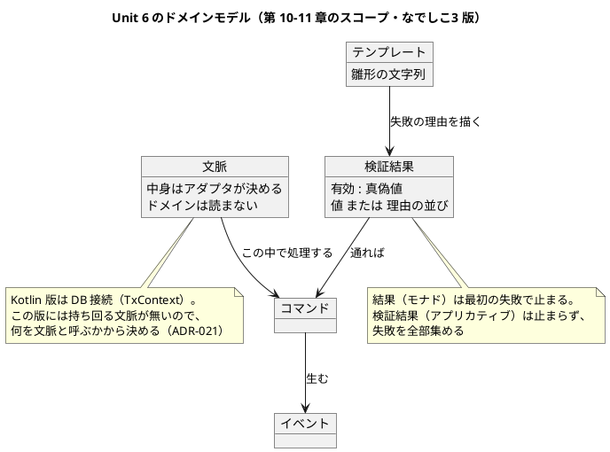
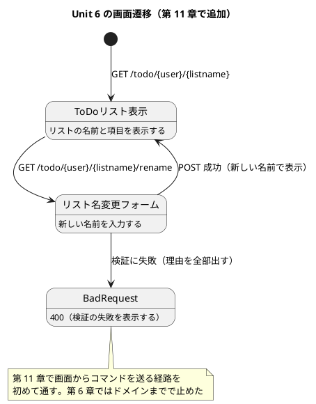

# Unit 6 の Bolt 計画（イテレーション 6）- Zettai 連載（なでしこ3 版）

## 概要

| 項目 | 内容 |
|------|------|
| **イテレーション** | 6（なでしこ3 版） |
| **Unit** | Unit 6 文脈の受け渡しとバリデーション |
| **期間** | 2026-12-08 〜 2026-12-19（2 週間） |
| **Bolt 数** | 2（Bolt 6-1 第 10 章 / Bolt 6-2 第 11 章） |
| **局面** | **終盤（アウトサイドイン）**。中盤から切り替わる。[開発戦略](development_strategy.md) |
| **人の検証負荷** | 9 ポイント |
| **承認ゲート** | **4 箇所（3 種類）** |

### 承認ゲートの運用形態

**本 Unit のゲートは「同期停止」で運用します。**

> **本節は人だけが書き換えます。** AI は書き換えません。運用形態を変えるなら人が本節を書き換えてから実行し、AI は切り替えを求められたら書き換えずに判断を仰ぎます（Unit 2 Try 2）。

| 種類 | 箇所 | 理由 |
| :--- | :--- | :--- |
| 辞書の契約の変更 | 6-1.2（文脈とトランザクション境界） | 既存のポートの呼び出し順序が変わる。残り 2 章を縛る |
| 設計ドキュメントと ADR | 6-2.6 | 節名の読み替え、ADR 2〜3 件、UI 設計の画面追加 |
| 記事の全文検証 | 6-1.6・6-2.7 | 自動判定できない |

第 11 章の検証結果とテンプレートは**新しく足すもの**で既存の契約を変えないため、6-2.6 の設計ゲートでまとめて見ます。

---

## Unit 5 からの持ち込み

| # | 持ち込み | 出典 | 消化するステップ |
| :--- | :--- | :--- | :--- |
| 1 | CI の実行確認と **Release v0.2.0** | 終了報告 1 | 6-1.0 |
| 2 | `src/step4/` を切り、**直後に NFR を測る** | 終了報告 2 / Try 2 | 6-1.1 |
| 3 | Kotlin 版 [ADR-010](../adr/ADR-010-own-template.md)・[ADR-011](../adr/ADR-011-transaction-boundary.md) の移植判断 | 終了報告 3 | 6-1.0（下の表） |
| 4 | `ContextReader` 相当を第 10 章で扱う | 終了報告 4 / Try 4 | 6-1.2 |
| 5 | アプリカティブの検出率を測る | 終了報告 5 / Try 3 | 6-2.4 |
| 6 | **既知の制約を 1 箇所に集め、設計を始める前に読む** | Try 1 | 6-1.1 |
| 7 | 構造を変える判断では NFR への影響を見積もりに入れる | Try 2 | 6-1.1 の完了判定 |

### Kotlin 版 ADR 010・011 の移植判断（持ち込み 3）

**着手前に判断します。**

| Kotlin 版 ADR | 対象章 | なでしこ3 版での判断（案） |
| :--- | :--- | :--- |
| [ADR-011](../adr/ADR-011-transaction-boundary.md) トランザクションの境界をコマンド 1 つの処理に置き、文脈を不透明な型にする | 10 | **境界の考え方は残す。文脈の中身が変わる。** ファイルにトランザクションが無いので、`TxContext`（DB 接続）に相当するものが無い。**「何を文脈と呼ぶか」を 6-1.2 で決める**。ADR-021 として記録 |
| [ADR-010](../adr/ADR-010-own-template.md) テンプレート機構を自前で書き、既製のテンプレートエンジンを使わない | 11 | **対応が要る。** なでしこ3 にもテンプレートエンジンが無いので、結論は同じになる見込み。ただし「未適用のタグが残ったら失敗」を結果辞書でどう表すかは決める。ADR-022 として記録 |

残る [ADR-012](../adr/ADR-012-own-json-converter.md)（JSON の変換）は第 12 章（Unit 7）です。**なでしこ3 には `JSONエンコード` があるので、判断の中身が変わります。**

---

## ゴール

### Unit 完了時の達成状態

1. **文脈を持ち回る形が決まっている**: 何を文脈と呼ぶかが決まり、コマンド 1 つの処理がその文脈の中で完結する
2. **失敗を集約できる**: 複数の検証を独立に行い、両方だめなら両方の理由を返す
3. **アプリカティブとモナドの違いが見えている**: モナドは最初の失敗で止まり、アプリカティブは止まらない。**その違いを検出率で示す**
4. **画面からコマンドを送れる**: リスト名の変更フォーム。**第 6 章で見送った「画面から書く経路」を初めて通す**
5. **既知の制約が 1 箇所にある**: 3 度繰り返したつまずきを止める
6. **第 10〜11 章が公開されている**

3 番目が本 Unit の山です。**アプリカティブはモナドの「弱い」版で、弱いからこそできることがある**という話を、数字で示せるかどうかが焦点です。

### 成功基準

- [ ] 文脈の中身が決まり、ADR に記録されている
- [ ] コマンド 1 つの処理が文脈の中で完結する（読む → 判断 → 書く）
- [ ] 検証が複数の失敗を集約して返す
- [ ] アプリカティブの法則を性質テストで確かめ、**壊して検出率を測った**
- [ ] **モナドとの違い（止まる／止まらない）をテストで示した**
- [ ] `GET` / `POST /todo/{user}/{listname}/rename` が動く（[UI 設計](../design/ui_design.md)）
- [ ] テンプレート機構があり、未適用のタグが残ったら失敗になる
- [ ] `src/step4/` が切られ、**見積もりと実測の両方が記録されている**（見積もり 50 秒 / 実測 35.6 秒）
- [ ] **既知の制約の一覧が 1 箇所にある**
- [ ] 第 10 章の節名の読み替え 2 件が登録されている
- [ ] ADR 2 件（021・022）を作成済み
- [ ] 4 経路（ドメイン直接・HTTP 経由・保管経由・**画面から書く**）の受け入れシナリオが green

---

## 第 10 章の節名の読み替え

| 節 | マインドマップ | 読み替え案 | 理由 |
| :--- | :--- | :--- | :--- |
| 1 | モナドでデータベースにアクセスする | **モナドで保管にアクセスする** | データベースを使わない（[ADR-019](../adr/ADR-019-file-event-log.md)） |
| 5 | データベースに対する射影のクエリ | **保管に対する射影のクエリ** | 同上 |

**`ContextReader` は読み替えません。** [ドメインモデル設計](../design/domain-model.md) の対訳表に載るユビキタス言語で、ライブラリ名ではないためです（第 7 章の `Outcome` と同じ判断）。

「設計を２回間違えた」も読み替えません。**Kotlin 版の経験談ですが、この版でも自分が間違えたことを書きます。** 間違えなければ、そのことを書きます。

---

## スパイクで確かめる項目

| # | 確かめること | 現時点の想定 | 外れたときの影響 |
| :--- | :--- | :--- | :--- |
| 1 | ~~CI が green か（v0.2.0 の残件）~~ → **確認済み（2026-09-29）。green。Release v0.2.0 を達成した** | green | — |
| 2 | `POSTデータ` でフォームの値が取れるか（Unit 2 のスパイクで一度確認済み。**画面から使うのは初めて**） | 取れる | 第 11 章のフォームが成立しない |
| 3 | `簡易HTTPサーバ移動`（302 リダイレクト）が使えるか | 使える。POST 後の遷移に使う | フォーム送信後の遷移が変わる |
| 4 | `src/step4/` を切ったとき全段階が 35 秒に収まるか | **収まらない見込み。見積もり済み（下記）** | NFR に触れる。**決める前に見積もる**（Try 2） |

### スパイクの結果（2026-09-29）

| # | 結果 |
| :--- | :--- |
| 1 | **green。Release v0.2.0 を達成した** |
| 2 | **取れる。** `POSTデータ["newname"]` でフォームの値が取れる |
| 3 | **使える。** `「/form」に簡易HTTPサーバ移動` で 302 とロケーションが返る。POST の後の遷移に使える |
| 4 | **収まらない見込み。** 下の見積もりを参照 |

**追加で分かったこと**: 文字列の中で `\"` はエスケープされず、そのまま出力されます。HTML の属性はシングルクォートで書くか、`"` を直接書きます。

### `src/step4/` を切る前の見積もり（Try 2）

段階 3 つ（70 ファイル / 35 テスト）の実測から、段階 4 つを見積もります。

| 対象 | 段階 3 つ（実測） | 段階 4 つ（見積もり） | 根拠 |
| :--- | :--- | :--- | :--- |
| lint | 約 22 秒（70 ファイル） | **約 29 秒**（93 ファイル） | ファイル数に比例。1 ファイルにつき cnako3 のプロセスが 1 つ |
| test | 約 7 秒（35 本） | 約 9 秒（46 本） | 本数に比例 |
| doctest | 約 9 秒（3 サーバ） | 約 12 秒（4 サーバ） | サーバの起動と停止に比例 |
| **合計** | **約 38 秒** | **約 50 秒** | |

**NFR（全段階 35 秒以内）を超えます。** 切ってから直すのではなく、**切る前に対処を決めます**。

### 対処（6-1.1 で実施）

| 案 | 判断 |
| :--- | :--- |
| 並列数を上げる | **不可。** 8 コアで頭打ち。Unit 5 で `JOBS=16` にしたら遅くなった |
| 過去の段階を検査しない | **不可。** [ADR-015](../adr/ADR-015-step-directories.md) の目的（過去の章のコードが動き続ける）が失われる |
| **`make check` の既定を最新段階だけにし、全段階は `make check-all`（CI が回す）に分ける** | **採る。** Unit 5 で決めた「速さが要るのは書いている間で、全段階は CI の仕事」を、既定値にまで反映する |

**上限を上げるのではなく、既定を変えます。** Unit 5 では NFR の立て方を分けましたが、コマンドは全段階のままでした。書いている間に打つコマンドが遅ければ、分けた意味が薄れます。

### 見積もりと実測（2026-09-29）

| 対象 | 見積もり | 実測 | 差 |
| :--- | :--- | :--- | :--- |
| `make check`（最新段階のみ） | — | **13.3 秒** | NFR（15 秒）内 |
| `make check-all`（全段階・100 ファイル / 51 テスト / 4 段階） | 約 50 秒 | **35.6 秒** | **見積もりが 14 秒保守的だった** |

見積もりはファイル数への単純な比例で置きました。実際は**並列化が効いて頭打ちに近づく**ぶん、伸びが緩やかでした。

全段階は 35 秒をわずかに超えています。**上限を外し、「CI が green であること」を条件にします**（下記の NFR 改訂）。全段階はもう書いている間に打つコマンドではありません。

---

## 局面とアプローチ

**中盤（インサイドアウト）から終盤（アウトサイドイン）に切り替わります。**

### 切り替える根拠

[開発戦略](development_strategy.md) の根拠がそのまま当てはまります。**`ContextReader` によるトランザクション文脈の受け渡しとアプリカティブなバリデーションは、単体で意味を持ちません。** 複数の要素を業務シナリオとして束ねたときに効く設計です。

第 11 章は画面からコマンドを送る経路を初めて通します。**外側（フォームの操作）から駆動するのが素直です。**

### 手順

1. デモ項目を受け入れシナリオに翻訳し、Red にする
2. シナリオから呼ぶ入口を決める。ここで設計が駆動される
3. 内側へ下りて（HTTP アダプタ → ハブ → ドメイン → 保管）各層を TDD で Green にする
4. リファクタリングする。シナリオは業務の言葉のまま変えない
5. 既存の 3 経路が引き続き green であることを確かめる

---

## Unit 6 の満足条件

### ユーザーストーリー

| ID | ユーザーストーリー | 検証負荷 | 優先度 |
|----|-------------------|----|----|
| US-010 | 第 10 章「コンテキストを読み込み、コマンドを処理する」を公開する | 5 | 必須 |
| US-011 | 第 11 章「アプリカティブによるデータバリデーション」を公開する | 4 | 必須 |
| **合計** | | **9** | |

#### US-010: 第 10 章を公開する

**ストーリー**:
> 読者として、1 つのコマンドの処理が途中で壊れないようにしたい。なぜなら、状態を読んで判断したあとに保存が失敗すると、判断だけが宙に浮くからだ。

**受入条件**:

1. **何を文脈と呼ぶかが決まっている**（Kotlin 版の `TxContext` に相当するもの）
2. コマンド 1 つの処理が文脈の中で完結する（[ADR-011](../adr/ADR-011-transaction-boundary.md) の境界の考え方を踏襲）
3. ドメインは文脈の中身を知らない
4. 射影のクエリも同じ文脈の形を使う
5. 節構成がマインドマップの第 10 章と一致している（**読み替え後**）

#### US-011: 第 11 章を公開する

**ストーリー**:
> 読者として、入力が 2 つとも間違っているなら 2 つとも教えてほしい。なぜなら、1 つ直して送り直したらもう 1 つが出てくるのは、二度手間だからだ。

**受入条件**:

1. リスト名の検証が**独立に 2 つの条件**を確かめる（空でない・40 文字以内。[ドメインモデル設計](../design/domain-model.md) の `validateListName`）
2. 両方だめなら**両方の理由**を返す
3. `GET /todo/{user}/{listname}/rename` でフォームが出る
4. `POST /todo/{user}/{listname}/rename` で名前が変わり、`ListRenamed` イベントが記録される
5. 検証に失敗したらフォームに理由が出る
6. テンプレート機構があり、**未適用のタグが残ったら失敗**になる
7. 節構成がマインドマップの第 11 章と一致している

### NFR 定義（Unit 6 固有）

| NFR | 内容 | 判定方法 |
| :--- | :--- | :--- |
| テスト実行時間（**再改訂**） | `make check`（最新段階）が **15 秒以内**。全段階（`make check-all`）は**時間の上限を設けず、CI が green であること** | 切る前に見積もり、切った直後に測った（Try 2）。実測 13.3 秒 / 35.6 秒。**全段階は inner loop ではないので、上限より「CI が回っていること」を条件にする** |
| 文脈の不透明性 | ドメインが文脈の中身を読まない | 人の検証。ドメインのファイルに文脈のキーが出てこないこと |
| テンプレートの安全性 | 未適用のタグが残ったら失敗 | わざとタグを残して落ちることを確かめる |
| `ignore` の件数 | 段階ごとに 4 件以下 | [ADR-015](../adr/ADR-015-step-directories.md) |

---

## エントロピー評価

| 評価軸 | 評価 | 根拠 | 高いときの対応 |
| :--- | :--- | :--- | :--- |
| 意図の曖昧さ | **MED** | **「何を文脈と呼ぶか」が決まっていない。** 設計ドキュメントは `TxContext`（DB 接続）としているが、この版には該当するものが無い | 6-1.2 で案を出して人に提示する |
| 構造的不確実性 | **HIGH** | 文脈の形が未確定で、既存のポートの呼び出し順序が変わる。第 11 章では画面から書く経路が初めて入る | 6-1.2 で停止。第 11 章は外側から駆動して形を決める |
| 検証の不確実性 | **MED** | アプリカティブとモナドの違いを検出率で示せるかが未知 | 6-2.4 で 3 通りに壊して測る |
| リスク | **MED** | 画面から書く経路が入る。POST とリダイレクトが未検証 | 6-1.0 のスパイクで潰す |
| 未解決の仮定 | **MED** | POST・リダイレクト・段階 4 つの実行時間 | スパイクで潰す |

**総合**: HIGH が 1 軸、MED が 4 軸。**Unit 5（MED 4 軸）より上がりました。** ゲート密度は**密**を維持します。

---

## スコープ・深さ・テスト戦略

| 軸 | 選択 | 理由 |
| :--- | :--- | :--- |
| スコープ | 全ステージ | 実装・テスト・記事・設計ドキュメント・ADR・UI |
| 深さ | Standard | 記事として公開する |
| テスト戦略 | **Standard**（性質テストが 4 種類目、経路が 4 つ目） | 本番機能に相当する |

---

## Bolt 6-1: 文脈とトランザクションの境界（第 10 章）

### Bolt ゴール

> 何を文脈と呼ぶかを決め、コマンド 1 つの処理がその中で完結する形にして第 10 章として公開する。**確認したい仮説**: 持ち回る文脈が無い言語でも、`ContextReader` が解いていた問題（処理の途中で壊れない）は表せる。

### ステップ計画

- [x] **6-1.0 スパイクと ADR の棚卸し**: 4 件を確かめ、Kotlin 版 ADR-010・011 の移植方針を確定する（持ち込み 1・3）
- [x] **6-1.1 既知の制約を 1 箇所に集め、`src/step4/` を切る**（持ち込み 2・6・7。Try 1・2）
  - `README.md`（または設計）に**確定した制約の一覧**を作る。3 度繰り返した「関数値ごしに非同期を呼べない」を筆頭に置く
  - **`src/step4/` を切る前に、全段階の実行時間を見積もる。** 切った直後に測って突き合わせる
  - 完了判定: 制約の一覧がある。見積もりと実測の両方が記録されている
- [x] **6-1.2 文脈の契約を決める**: 何を文脈と呼ぶか、コマンド 1 つの処理をどう包むかを提示する
  - 入力: [ADR-011](../adr/ADR-011-transaction-boundary.md)、[ドメインモデル設計](../design/domain-model.md) の `TxContext`・`ContextReader`
  - **★人の確認が必要**（残り 2 章を縛る。設計ドキュメントと形が違う）
- [x] **6-1.3 文脈を実装する（Red → Green）**: 契約テストを同時に書く
- [x] **6-1.4 コマンド 1 つの処理を文脈で包む**: 読む → 判断 → 書くが 1 つの単位になる
- [x] **6-1.5 射影のクエリも同じ形にする**: 読む側も文脈を通す
- [x] **6-1.6 第 10 章の骨子と執筆**
  - **★人の確認が必要**（記事の全文検証）
- [x] **6-1.7 サイト反映**

---

## Bolt 6-2: アプリカティブと画面からの操作（第 11 章）

### Bolt ゴール

> 複数の検証を独立に行い、失敗を集約して返す。画面からコマンドを送る経路を初めて通して第 11 章として公開する。**確認したい仮説**: モナドとアプリカティブの違い（止まる／止まらない）を、テストの検出率で示せる。

### ステップ計画

- [x] **6-2.1 受け入れシナリオを Red にする**: 「リスト名を変えられる」「空の名前は断られる」を業務の言葉で書く（アウトサイドイン）
- [x] **6-2.2 検証結果を実装する（Red → Green）**: 失敗を**並び**で持つ。契約テストを同時に書く
- [x] **6-2.3 2 つの条件を独立に確かめる**: 空でない・40 文字以内。両方だめなら両方返す
- [x] **6-2.4 アプリカティブの法則と、モナドとの違い**（持ち込み 5。Try 3）
  - 法則を性質テストで確かめ、**壊して検出率を測る**
  - **モナド（結果連鎖）で同じ検証を書くと 1 つしか返らないことをテストで示す**
  - 完了判定: 違いが数字で出ている
- [x] **6-2.5 テンプレートと画面**: `GET` / `POST /todo/{user}/{listname}/rename`。未適用のタグが残ったら失敗
- [x] **6-2.6 設計ドキュメント・節名の読み替え・ADR**
  - `draft.md` に第 10 章の読み替え 2 件
  - `domain-model.md` に検証結果・テンプレート・`ListRenamed`・`RenameToDoList` を追加
  - `ui_design.md` に rename の画面と遷移
  - ADR-021（文脈の表し方）、ADR-022（テンプレート機構）
  - **★人の確認が必要**
- [x] **6-2.7 第 11 章の骨子と執筆**
  - **★人の確認が必要**（記事の全文検証）
- [x] **6-2.8 サイト反映と OKF 適用**
- [x] **6-2.9 Bolt 終了報告とふりかえり**: **Unit 7 のゲート密度をここで決める**

---

## 設計

### Unit 6 のドメインモデル（第 10〜11 章のスコープ）

| ドメインモデル設計 | なでしこ3 版のコード上の名前（案） |
| :--- | :--- |
| `TxContext` | `文脈` |
| `ContextReader` | `文脈読取` |
| `Validation` | `検証結果` |
| `Template` | `雛形` |
| `ListRenamed` | `リスト名変更イベント` |
| `RenameToDoList` | `リスト名変更コマンド` |
| `validateListName` | `リスト名検証` |

**名前は 6-1.2・6-2.2 で確定します。** 上は案です。

### 画面遷移図（本 Unit で掲載）

[UI 設計](../design/ui_design.md) の「リスト名の変更フォーム（第 11 章）」に対応します。

### 状態遷移図・ER 図

**どちらも省略します。** 状態遷移は第 6 章で実装済み。永続化の形は第 9 章から変わりません（`ListRenamed` が 1 種類増えるだけ）。

### ユーザーマニュアル

**対象外です。** 画面が 1 つ増えますが、Zettai にエンドユーザーはいません（[開発戦略](development_strategy.md)）。第 11 章の記事が操作の説明を兼ねます。

### ADR

| ADR | タイトル（予定） | 対応する Kotlin 版 |
|-----|---------|-----------|
| ADR-021 | 何を文脈と呼ぶか（トランザクションの無い保管での境界） | [ADR-011](../adr/ADR-011-transaction-boundary.md) |
| ADR-022 | テンプレート機構を自前で書く | [ADR-010](../adr/ADR-010-own-template.md) |

**どちらも「この決定が解かないこと」を先に書きます**（Unit 4 Try 1 の定着）。

---

## リスクと対策

| リスク | 影響度 | 対策 | 承認ゲート |
| :--- | :--- | :--- | :--- |
| 「何を文脈と呼ぶか」が決まらず、第 10 章が書けない | 高 | 案を 6-1.2 で人に提示する。**決まらなければ「文脈が無い言語で ContextReader の章をどう書くか」自体を章の主題にする** | 6-1.2 で停止 |
| ファイルにトランザクションが無く、途中で落ちると壊れる | 中 | [ADR-019](../adr/ADR-019-file-event-log.md) で「解かないこと」に挙げた項目。**本 Unit で扱うか、扱わないと決めるかを 6-1.2 で判断する** | 6-1.2 で停止 |
| 画面から書く経路が初めてで、想定より時間がかかる | 中 | スパイクで POST とリダイレクトを先に確かめる。第 11 章は節が 6 つで、検証負荷 4 と軽く見積もっている | 6-1.0 |
| 段階が 4 つになり全段階が 35 秒を超える | 中 | **切る前に見積もる**（Try 2 の強化）。超える見込みなら、切る前に対処を決める | — |
| アプリカティブとモナドの違いを検出率で示せない | 中 | 示せなければ、**示せなかったことを書く**。第 9 章で「再帰が書けなかった」を書いたのと同じ | — |
| 6 Unit 続けてゲートが機能しない | 高 | 運用形態の切り替えは人だけが行う（本計画の冒頭） | — |

---

## Deployment Unit としての完了条件

### Definition of Done

- [ ] 何を文脈と呼ぶかが決まり、ADR-021 に記録されている
- [ ] コマンド 1 つの処理が文脈の中で完結する
- [ ] ドメインが文脈の中身を読まない
- [ ] 検証が複数の失敗を集約して返す
- [ ] アプリカティブの法則を性質テストで確かめ、**壊して検出率を測った**
- [ ] **モナドとの違い（止まる／止まらない）をテストで示した**
- [ ] `GET` / `POST /todo/{user}/{listname}/rename` が動く
- [ ] テンプレートで未適用のタグが残ったら失敗になる
- [ ] 4 経路の受け入れシナリオが green
- [ ] `src/step4/` が切られ、**見積もりと実測の両方が記録されている**
- [ ] **既知の制約の一覧が 1 箇所にある**
- [ ] 第 10 章の節名の読み替え 2 件が登録されている
- [ ] ADR 2 件（021・022）を作成済み
- [ ] 設計ドキュメント 3 本に差分が反映されている
- [ ] 記事の検査が違反 0 件
- [ ] 第 10〜11 章が公開され、それぞれにつまずき節がある
- [ ] `gulp okf:check` が ERROR 0
- [ ] **承認ゲート 4 箇所を通過した**
- [ ] Bolt 終了報告とふりかえり（KPT）を作成した
- [ ] Unit 7 のゲート密度が決まっている
- [ ] デモ項目がすべて実演できる

### デモ項目

1. ブラウザでリスト名の変更フォームを開き、名前を変えて、表示が変わることを示す
2. **空の名前を送り、理由が出ることを示す**
3. **空で 41 文字の名前を送り、理由が 2 つとも出ることを示す**（アプリカティブの効果）
4. **同じ検証をモナドで書いた版を走らせ、理由が 1 つしか出ないことを示す**
5. テンプレートのタグを 1 つ消し、未適用のタグが残って失敗することを示す
6. 4 経路の受け入れシナリオが green であることを示す
7. `make check`（最新段階）が 15 秒以内であることと、CI が `make check-all` で green であることを示す

デモ項目 3・4 が本 Unit の中心です。**「両方出る」と「1 つしか出ない」を並べて見せるのが、アプリカティブを説明する一番速い方法**です。

---

## 指標（Bolt 終了報告へ引き継ぐ）

| 指標 | 計画 | 実績 |
| :--- | :--- | :--- |
| 完了 Unit 数 | 1（累計 6 / 7） | - |
| 承認ゲート通過数 | 4 | - |
| 変更依頼数 | Kotlin 版 Unit 6（[Bolt 終了報告](bolt_report-6.md)）以下 | - |
| **人が検証に使った時間** | ゲートごとに記録する | - |
| アプリカティブの検出率 | 記録する。**モナドとの違いも** | - |
| テスト実行時間 | `make check`（最新段階）15 秒以内 / 全段階は CI が green | - |
| 全段階の実行時間の見積もりと実測 | **両方を記録する**（Try 2） | - |
| 受け入れシナリオの経路数 | 4 | - |
| 持ち込み項目の消化 | 7 / 7 | - |

---

## 更新履歴

| 日付 | 更新内容 | 更新者 |
|------|---------|--------|
| 2026-09-29 | 初版作成（AI-DLC 準拠）。Unit 6 の満足条件・エントロピー評価・Bolt 6-1 と 6-2 のステップ計画（16 ステップ・承認ゲート 4 箇所）・画面遷移図・Deployment Unit の完了条件を定義。Unit 5 のふりかえり Try 4 件と持ち込み 7 件を反映し、Kotlin 版 ADR-010・011 の移植方針と第 10 章の節名の読み替え 2 件を計画に入れた | claude-code/claude-opus-5 |

---

## 関連ドキュメント

- [リリース計画（なでしこ3 版）](release_plan-nadesiko.md) / [開発戦略](development_strategy.md)
- [Unit 5 の Bolt 計画](iteration_plan-nadesiko-5.md) / [Bolt 終了報告](bolt_report-nadesiko-5.md) / [ふりかえり](retrospective-nadesiko-5.md)
- [Unit 6 の Bolt 計画（Kotlin 版）](iteration_plan-6.md)
- [ドメインモデル設計](../design/domain-model.md) / [UI 設計](../design/ui_design.md) / [バックエンドアーキテクチャ](../design/architecture_backend.md)
- [執筆計画](../article/outline.md) / [章構成マインドマップ](../article/draft.md)
