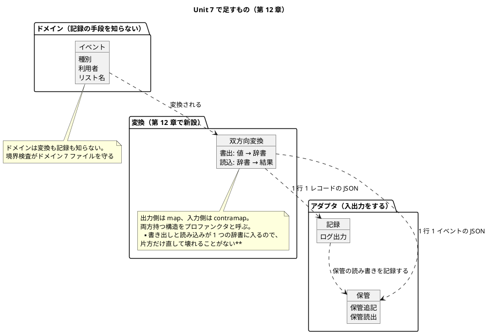

# Unit 7 の Bolt 計画（イテレーション 7）- Zettai 連載（なでしこ3 版）

## 概要

| 項目 | 内容 |
|------|------|
| **イテレーション** | 7（なでしこ3 版・**最終**） |
| **Unit** | Unit 7 監視とアーキテクチャ総括 |
| **期間** | 2026-12-22 〜 2027-01-02（2 週間） |
| **Bolt 数** | 2（Bolt 7-1 第 12 章 / Bolt 7-2 第 13 章） |
| **局面** | **終盤（アウトサイドイン）**。[開発戦略](development_strategy.md) |
| **人の検証負荷** | 4 ポイント（7 Unit で最小） |
| **承認ゲート** | **3 箇所（2 種類）+ 条件付き 1 箇所** |
| **リリース** | **Release v1.0.0**（Phase 3 完了・連載完結） |

### 承認ゲートの運用形態

**本 Unit のゲートは「同期停止」で運用します。**

> **本節は人だけが書き換えます。** AI は書き換えません。運用形態を変えるなら人が本節を書き換えてから実行し、AI は切り替えを求められたら書き換えずに判断を仰ぎます（Unit 2 Try 2）。

| 種類 | 箇所 | 理由 |
| :--- | :--- | :--- |
| 検査の構造を変える判断 | 7-1.1（NFR の超過を直す） | `lint` を作業中の検査から外すかどうか。**検査が守る範囲が変わる** |
| 記事の全文検証 | 7-1.9・7-2.5 | 自動判定できない |

**箇所は 3 です。** [Unit 6 の Bolt 終了報告](bolt_report-nadesiko-6.md) の決定は「疎・2 箇所（記事の全文検証のみ）」でしたが、[Unit 6 のふりかえり](retrospective-nadesiko-6.md) Try 1 が NFR の判断に人の確認を求めているため、1 箇所足しています。**密度は「疎」のままです**（Unit 6 は 4 箇所）。

### 局面によらず必ず停止する操作（条件付きゲート）

[開発戦略](development_strategy.md) は、密度によらず必ず停止する操作を定めています。本 Unit で該当しうるのは 1 つです。

| 操作 | 該当しうるステップ | 扱い |
| :--- | :--- | :--- |
| **永続化フォーマットの決定・変更**（追記型イベントログの 1 行の形式） | 7-1.4・7-1.5（双方向変換） | **1 行の形式に触れる場合は必ず停止する。** 触れない設計（既存の JSON 行の上に変換の層を置くだけ）なら停止しない |

**したがってゲートは 3 箇所 + 条件付き 1 箇所です。** 触れるかどうかは 7-1.4 の設計で決まるので、その時点で判定します。後方互換が壊れると過去のログが読めなくなります（[ADR-019](../adr/ADR-019-file-event-log.md)）。

### 指標の置き換え

**「人が検証に使った時間」を指標から外します。** 6 Unit 連続で空欄で、計測手段がありません。代わりに **「人が修正を入れた箇所数」**（コミット後の手直し）を数えます（[Unit 6 のふりかえり](retrospective-nadesiko-6.md)）。

---

## Unit 6 からの持ち込み

| # | 持ち込み | 出典 | 消化するステップ |
| :--- | :--- | :--- | :--- |
| 1 | **NFR の超過を直す**（`make check` 16〜17 秒 / `make check-all` 41〜42 秒） | 終了報告 1 / Try 1 | 7-1.1 |
| 2 | `src/step5/` を切る判断と、その前後の計測 | 終了報告 2 | 7-1.1 |
| 3 | `make check` の 1 度きりの失敗を追える記録を残す | 終了報告 3 / Try 3 | 7-1.2 |
| 4 | Kotlin 版 [ADR-012](../adr/ADR-012-own-json-converter.md) の移植判断 | 終了報告 4 / Try 5 | 7-1.4 |
| 5 | プロファンクタの検出率を測る | 終了報告 5 | 7-1.6 |
| 6 | **Release v1.0.0** と Kotlin 版との対比（第 13 章） | 終了報告 6 | 7-2.2・7-2.7 |
| 7 | テンプレートの「骨組みの差し込み」の穴 | 終了報告 7 | 7-1.8（判断のみ） |
| 8 | **受入条件には具体例を 1 つ書く** | Try 2 | 本計画の受入条件（下記） |
| 9 | **第 13 章で承認ゲートそのものを扱う** | Try 4 | 7-2.4 |

### Kotlin 版 ADR-012 の移植判断（持ち込み 4）

| Kotlin 版 ADR | 章 | なでしこ3 版での扱い |
| :--- | :--- | :--- |
| [ADR-012](../adr/ADR-012-own-json-converter.md) JSON の変換を自前の `Converter` で書き Kondor を導入しない | 12 | **前提が違う。** Kotlin 版は「手書きのシリアライズが書き出しと読み込みで別関数」だったが、この版は第 9 章から組み込みの `JSONエンコード` / `JSONデコード` を使っている（`store.nako3`）。**既にあるものを捨てて自前で書く理由は無い。** 判断するのは「組み込みの上に何を足すか」。7-1.4 で決め、ADR として記録する |

**Try 5 の趣旨**（「自前で書く」を惰性で続けない）をここで守ります。

---

## ゴール

> 構造化ログと辞書 ⇄ JSON の双方向変換を扱い、設計を総括して Kotlin 版と対比する（第 12〜13 章）。**確認したい仮説**: 2 言語を並べたとき、各章が言語機能の説明ではなく設計の説明だったと言える。

### Unit 完了時の達成状態

- 第 12 章・第 13 章が公開されている（**13 / 13 章。連載完結**）
- **NFR が満たされている**（`make check` 15 秒以内 / `make check-all` 35 秒以内。**段階 5 つで**）
- 構造化ログが実装され、ドメインが記録の手段を知らないことが境界検査で守られている
- 辞書 ⇄ JSON の双方向変換があり、**プロファンクタ則が性質テストで確かめられ、検出率が測られている**
- `docs/article/zettai/comparison/index.md` が全 13 章を覆っている
- **Release v1.0.0 が達成されている**（CI が green）

### 成功基準

| # | 基準 | 判定方法 | 具体例（Try 2） |
| :--- | :--- | :--- | :--- |
| 1 | NFR を満たす | `make check` と `make check-all` を 3 回ずつ測る | 段階 5 つで 15 秒 / 35 秒以内 |
| 2 | 往復が壊れない | 性質テスト | `ListRenamed` の辞書を書き出して読み込むと元に戻る（200 回） |
| 3 | プロファンクタ則が成り立つ | 性質テスト＋**壊して検出率を測る** | 出力側の `map` と入力側の `contramap` を入れ替えたとき、何回検出するか |
| 4 | ドメインが記録の手段を知らない | 境界検査（7 ファイル × **5 項目**。現在は 4 項目） | `domain`・`events`・`outcome`・`commands`・`projection`・`validation`・`template` が `ログ` を取り込まない |
| 5 | 落ちたテストが名前で分かる | わざと 1 本落として出力を見る | `-> FAILED test/step4/monoid_test.nako3` が残る（`src/step5/` を切るかは 7-1.1 で決めるので、例は現状の段階で書く） |
| 6 | 記事検査 6 本が 0 件 | `ops/scripts/article/*.py` | 第 12・13 章を含めて違反 0 |
| 7 | 比較が全章を覆う | 目視 | `comparison/index.md` の「これから増える比較」が空になる |
| 8 | Release v1.0.0 | CI の 3 ワークフローが success | `Nadesiko3 Zettai` / `Kotlin Zettai` / `Deploy MkDocs` |

---

## 第 12 章の節名の読み替え

マインドマップ（[draft.md](../article/draft.md)）の節名のうち、この版に無いものを読み替えます。規則は [執筆計画](../article/outline.md) の執筆規約にあります。

| 節 | マインドマップ | 読み替え後 | 理由 |
| :--- | :--- | :--- | :--- |
| 第 12 章 第 5 節 | データベース呼び出しのロギング | **保管の読み書きのロギング** | データベースを使わない（[ADR-019](../adr/ADR-019-file-event-log.md)）。第 9〜10 章と同じ読み替え |

**第 13 章に読み替えはありません。** 4 節（シンプルさを追い求めて／システム全体の設計／コードへの翻訳／最後の考察）はいずれも対象固有の語を含みません。章末の「連載を終えて」は定型で、節構成の検査の対象外です。

読み替えは 7-1.8 で `draft.md` の表に登録します。**登録しないと `check_sections.py` が落ちます**（Unit 6 で実際に落ちました）。

---

## スパイクで確かめる項目

第 12 章の題材が、この処理系で成立するかを先に確かめます。

| # | 確かめること | 成立しなかったときの代替 |
| :--- | :--- | :--- |
| 1 | `JSONエンコード` が入れ子の辞書・配列を往復できるか | 往復できない形を避けてドメインの辞書を設計し直す |
| 2 | `JSONエンコード` がキーの順序を保つか（比較のため） | 比較を「デコードしてから辞書どうし」に変える |
| 3 | 標準出力への書き出しが、テストから捕まえられるか | ログの出力先をファイルにし、テストは読み戻す |
| 4 | 関数値を 2 つ持つ辞書（双方向変換）が、既知の制約 1 に触れないか | **触れる場合は「呼び出しの順序」で表す**（第 9〜10 章と同じ手） |
| 5 | 段階 5 つで `make check-all` が何秒になるか（7-1.1 の前に測る） | 7-1.1 の判断材料にする |

**確認 4 が本 Unit の最大の不確実性です。** 双方向変換は関数値を 2 つ持ちます。中で入出力をしなければ制約 1 には触れないはずですが、第 3・7・9 章で 3 度踏んでいるので先に確かめます。

---

## 局面とアプローチ

**終盤（アウトサイドイン）を継続します。** 第 12 章は「動いているかどうかを外から見る」章なので、観測したいもの（ログに何を出すか）から決めます。第 13 章は実装追加をほぼ伴いません。

### 手順

1. 何をログに出したいかを、業務の言葉で先に書く（7-1.3）
2. そこから記録の形（構造化ログ）を決める
3. 辞書 ⇄ JSON の変換を、記録と保管の両方から使えるようにする
4. 第 13 章は既にあるものを並べ直すだけで、新しい実装を足さない

---

## Unit 7 の満足条件

### ユーザーストーリー

#### US-012: 第 12 章を公開する

> **読者**として、**型の無い言語で構造化ログと双方向変換を組む方法**を知りたい。**動いているかどうかを外から見られるようにする**ため。

| # | 受入条件 | 具体例（Try 2） |
| :--- | :--- | :--- |
| 1 | 構造化ログが 1 行 1 レコードの JSON で出る | `{"時刻":"...","水準":"info","事象":"ListRenamed","利用者":"uberto"}` |
| 2 | ドメインが記録の手段を知らない | 境界検査でドメイン 7 ファイルが `ログ` を取り込まないことを確かめる |
| 3 | 辞書 ⇄ JSON の双方向変換がある | 書き出しと読み込みが**1 つの辞書**に入っており、片方だけ直せない |
| 4 | 往復が壊れない | `{"種別":"ListRenamed","利用者":"uberto","リスト名":"book","新リスト名":"reading"}` を書き出して読み込むと等しい |
| 5 | プロファンクタ則が確かめられ、**検出率が測られている** | 出力側と入力側の変換を入れ替えて、200 回中何回検出するかを記事に書く |
| 6 | 保管の読み書きがログに出る | `保管読出` の前後に記録が 1 件ずつ |

#### US-013: 第 13 章を公開する

> **読者**として、**「型で保証する」と「約束とテストで保証する」の違い**を知りたい。**自分の言語でどちらを選ぶかを判断する**ため。

| # | 受入条件 | 具体例（Try 2） |
| :--- | :--- | :--- |
| 1 | 全 13 章の設計判断が 1 枚に並んでいる | 章 × 「足したもの」×「それが解いた問題」の表 |
| 2 | Kotlin 版との対比が具体的である | 「`sealed interface` 対 `種別` キー＋契約テスト」のように、**両方のコードを並べる** |
| 3 | 型の代わりに何が支えているかが数で示されている | 契約テスト・性質テスト・境界検査・受け入れシナリオの 4 種類と、その本数 |
| 4 | **うまくいかなかったことが書かれている** | 承認ゲートが 7 Unit・累計 41〜42 箇所で 1 度も同期停止しなかったこと（Try 4。実績で数え直す） |
| 5 | 比較のページが全章を覆う | `comparison/index.md` の「これから増える比較」が空になる |

### NFR 定義（Unit 7 固有）

| # | 項目 | 目標 | 測り方 |
| :--- | :--- | :--- | :--- |
| 1 | 作業中の段階の検査 | **15 秒以内**（段階 5 つで） | `make check` を 3 回 |
| 2 | 全段階の検査 | **35 秒以内**（段階 5 つで） | `make check-all` を 3 回 |
| 3 | ログの追加による遅延 | 受け入れシナリオの実行時間が 10% 以上伸びない | 7-1.3 の前後で `make doctest` を測る |
| 4 | 記事のコード例 | `ignore` は章ごとに 4 件以下 | `check_article_code.py` |

**NFR 1・2 は Unit 6 から超えたまま持ち越しています。** 段階を 1 つ足せばさらに伸びるので、**7-1.1 で構造から決め直します**。上限を上げる選択肢は採りません（Unit 5 の Keep 5）。

---

## エントロピー評価

| 軸 | 水準 | 根拠 | 対処 |
| :--- | :--- | :--- | :--- |
| 意図の曖昧さ | LOW | 第 12・13 章の主題は Kotlin 版で確定済み | — |
| 構造的不確実性 | **MED** | 双方向変換が関数値を 2 つ持つ。既知の制約 1 に触れる可能性がある | スパイク 4 で先に確かめる |
| 検証の不確実性 | LOW | 性質テストと検出率の測り方は 6 構造で確立済み（プロファンクタが 7 つめ） | — |
| リスク | **MED** | **NFR を超えたまま入る。** 段階を足すとさらに伸びる | 7-1.1 を最初に置く |
| 未解決の仮定 | LOW | 組み込みの JSON は第 9 章から使っており、実績がある | スパイク 1・2 で境界だけ確かめる |

Unit 6（構造的不確実性 HIGH）より下がっています。**残る不確実性は「制約 1 に 4 度目で触れるか」だけ**です。

---

## スコープ・深さ・テスト戦略

| 項目 | 内容 |
| :--- | :--- |
| テスト戦略の水準 | **Standard**（契約テストは削らない） |
| 段階ディレクトリ | `src/step5/` を切るかを 7-1.1 で判断する（[ADR-015](../adr/ADR-015-step-directories.md)） |
| 新しい代数構造 | プロファンクタ（**7 つめ**。モノイド・ファンクタ 2・モナド・アプリカティブに続く） |
| 画面の追加 | **無し。** 第 12 章はログ、第 13 章は総括 |
| ユーザーマニュアル | **無し。** 本連載の成果物は記事であり、利用者向けマニュアルを持たない（Unit 1 から一貫） |

---

## Bolt 7-1: 監視と関数型 JSON（第 12 章）

### Bolt ゴール

> 動いているかどうかを外から見られるようにし、辞書 ⇄ JSON の双方向変換をプロファンクタとして扱う。**確認したい仮説**: 組み込みの JSON がある言語でも、その上に置く層に設計の意味がある。

### ステップ計画

- [x] **7-1.0 スパイクと持ち込みの棚卸し**: 上の 5 件を確かめ、ADR-012 の移植方針の材料を集める（持ち込み 4）
- [x] **7-1.1 NFR の超過を直す**（持ち込み 1・2。Try 1）
  - 判断すること: `lint` を作業中の検査から外して CI に寄せるか。**`test` と `doctest` は取り込んだファイルを解析するので、`lint` が単独で守るのは「どのテストからも取り込まれないファイル」だけ**
  - あわせて `src/step5/` を切るかを決める。切るなら**切る前に見積もり、切った直後に測る**（Unit 5 Try 2）
  - 決めたことを [ADR-015](../adr/ADR-015-step-directories.md) に追記する
  - 完了判定: `make check` 15 秒以内 / `make check-all` 35 秒以内。見積もりと実測の両方が記録されている
  - **★人の確認が必要**（検査が守る範囲が変わる）
  - **実績（2026-09-28。ゲート通過 1 件目）**: 人が「`check` から `lint` を外す」「`src/step5/` を切る」を選択。段階 5 つで **`make check` 7 秒 / `make check-all` 25〜27 秒**。[ADR-015](../adr/ADR-015-step-directories.md) に追記済み
- [x] **7-1.2 テストランナーが落ちたテスト名を残す**（持ち込み 3。Try 3）
  - わざと 1 本落として、出力に名前が残ることを確かめる
- [x] **7-1.3 構造化ログを実装する（Red → Green）**: 何を出したいかを業務の言葉で先に書く。契約テストを同時に書く
- [x] **7-1.4 双方向変換の契約を決める**（持ち込み 4）
  - 組み込みの `JSONエンコード` の上に何を足すかを決める。**既にあるものを捨てない**（Try 5）
  - 入力: [ADR-012](../adr/ADR-012-own-json-converter.md)、`store.nako3` の現状
- [x] **7-1.5 双方向変換を実装する（Red → Green）**: 書き出しと読み込みを 1 つにまとめ、往復の性質テストを書く
- [x] **7-1.6 プロファンクタ則と検出率**（持ち込み 5）
  - 法則を性質テストで確かめ、**壊して検出率を測る**（[ADR-017](../adr/ADR-017-own-property-testing.md)）
  - 完了判定: **7 つめ**の構造の検出率が数字で出ている
- [x] **7-1.7 保管の読み書きをログに出す**: ドメインは記録の手段を知らない。**境界検査の項目に `ログ` を足す**（ドメイン 7 ファイルは Unit 6 で揃っており、4 項目 → 5 項目になる）
- [x] **7-1.8 設計ドキュメント・節名の読み替え・ADR**
  - `draft.md` に第 12 章第 5 節の読み替え 1 件
  - `domain-model.md` に双方向変換とログを追加し、**検出率の表に 8 行目**を足す（現在 7 行）
  - `architecture_backend.md` に記録の置き場所を追加
  - ADR（双方向変換の扱い）。**テンプレートの穴（持ち込み 7）は、画面が増えないので「見直さない」と判断して記録する**
- [x] **7-1.9 第 12 章の骨子と執筆**
  - **★人の確認が必要**（記事の全文検証）
- [x] **7-1.10 サイト反映**

---

## Bolt 7-2: アーキテクチャの総括（第 13 章）

### Bolt ゴール

> 13 章分の設計判断を 1 枚に並べ、Kotlin 版と対比して連載を閉じる。**確認したい仮説**: 各章が言語機能の説明ではなく設計の説明だったと言える。

### ステップ計画

- [x] **7-2.1 設計判断の棚卸し**: **なでしこ3 版の ADR 11 件**（013〜022 の 10 件 + 本 Unit の ADR-023）、既知の制約 23 件、検出率 7 構造、テスト 4 種類を数え直す
- [x] **7-2.2 Kotlin 版との対比表を作る**（持ち込み 6）
  - **両方のコードを並べる**（`sealed interface` 対 `種別` キー＋契約テスト、など）
  - 「型で保証する」と「約束とテストで保証する」の軸に、Unit 2 で見つけた**第 3 の要素（言語の癖）**を加える
- [x] **7-2.3 `comparison/index.md` を第 4〜9 章まで書く**
  - 現状は **Phase 1（第 1〜3 章）しか無く**、「これから増える比較」に 5 行（4〜5 / 6〜7 / 8〜9 / 10〜11 / 12〜13）が予約されたままです。**1 ステップで全部は書けません**
  - ここでは 3 行（4〜5 / 6〜7 / 8〜9）を埋める
- [x] **7-2.3b `comparison/index.md` を第 10〜13 章まで書き切る**: 残り 2 行（10〜11 / 12〜13）を埋め、「これから増える比較」を空にする
- [x] **7-2.4 承認ゲートの実践報告をまとめる**（Try 4）
  - **Unit 6 終了時点で累計 38 箇所。本 Unit の計画分を足すと 41〜42 箇所**で 1 度も同期停止しなかったという事実を、AI-DLC の実践報告として書く（[ふりかえり](retrospective-nadesiko-6.md) Try 4 の「40」はゲート 2 箇所の前提で書いた数字）
  - **うまくいかなかったことを隠さない**
- [x] **7-2.5 第 13 章の骨子と執筆**
  - **★人の確認が必要**（記事の全文検証）
- [x] **7-2.6 サイト反映と OKF 適用**
- [x] **7-2.7 Release v1.0.0**: push して CI の 3 ワークフローが green であることを確かめる
- [x] **7-2.8 Bolt 終了報告・ふりかえり・リリース完了報告**: 連載の完結として [リリース完了報告書](release_report-1.0.0.md) に相当するものをなでしこ3 版でも作る

---

## 設計

### Unit 7 のドメインモデル（第 12〜13 章のスコープ）

**第 13 章は新しいモデルを足しません。** 既にあるものを並べ直すだけです。

### 画面遷移図

**本 Unit では掲載しません。** 第 12 章はログ、第 13 章は総括で、**画面の追加も変更もありません**。最新の画面遷移は [Unit 6 の Bolt 計画](iteration_plan-nadesiko-6.md) と [UI 設計](../design/ui_design.md) にあります。

### 状態遷移図・ER 図

**本 Unit では掲載しません。** 状態遷移（ToDo 項目の 4 値・16 マス）は第 6 章で確定し、本 Unit で変わりません。ER 図は、この版がデータベースを使わないため作りません（[ADR-019](../adr/ADR-019-file-event-log.md)）。

### ユーザーマニュアル

**本 Unit では作りません。** 本連載の成果物は記事であり、利用者向けマニュアルを持ちません（Unit 1 から一貫）。画面の追加もありません。

### ADR

| ADR | 内容 | ステップ |
| :--- | :--- | :--- |
| ADR-023（予定） | 組み込みの JSON を使い、その上に双方向変換を置く（Kotlin 版 [ADR-012](../adr/ADR-012-own-json-converter.md) の移植判断） | 7-1.4・7-1.8 |
| [ADR-015](../adr/ADR-015-step-directories.md) への追記 | `lint` の位置づけと段階の増え方に対する NFR の立て方 | 7-1.1 |
| [ADR-022](../adr/ADR-022-template-with-unfilled-check.md) への追記 | 「骨組みの差し込み」の穴を見直さないという判断と、その根拠 | 7-1.8 |

---

## バッファ

[リリース計画](release_plan-nadesiko.md) のバッファ消費ルールに従います。

| 順序 | 手段 | 本 Unit での具体 |
| :--- | :--- | :--- |
| 1 | スコープバッファ（記事の作り込みの深さを下げる） | 長い完成コードを `
` に退避し、本文を差分だけに絞る |
| 2 | 低優先度ストーリーの深さを下げる | **US-012（第 12 章）** が対象。プロファンクタの検出率の測定は残し、ログの項目数を削る |
| 3 | 検証バッファ（予備イテレーション 1 本・2 週間） | **最後の手段。** Unit 7 の後ろに確保済み |

**7-1.1（NFR）が長引いた場合は手段 2 を先に使います。** 連載の完結（Release v1.0.0）を予備イテレーションに押し出すより、第 12 章の深さを下げるほうが損失が小さいためです。

---

## リスクと対策

| リスク | 影響 | 対策 | 検知 |
| :--- | :--- | :--- | :--- |
| **NFR を直せず、段階 5 つでさらに超える** | 高 | 7-1.1 を Unit の最初に置く。**直せないなら `src/step5/` を切らない**という選択肢も机上に残す | 7-1.0 のスパイク 5 |
| 双方向変換が既知の制約 1（関数値ごしの非同期）に 4 度目で触れる | 中 | 変換の中で入出力をしない設計にする。触れたら「呼び出しの順序」で表す（第 9〜10 章と同じ手） | 7-1.0 のスパイク 4 |
| 組み込みの `JSONエンコード` があるため、第 12 章の主題が薄くなる | 中 | **主題を「JSON を作ること」から「書き出しと読み込みを 1 つにすること」に寄せる。** ADR-012 の問題意識（片方だけ直せる）はこの版にも当てはまる | 7-1.4 |
| 第 13 章が感想文になる | 中 | 受入条件 2・3 で**両方のコードを並べる**ことと**数で示す**ことを求める。Try 4 で失敗も書く | 7-2.5 |
| 年末年始をまたぐ | 低 | 実装は Bolt 7-1 に寄せ、Bolt 7-2 は執筆中心にする | — |

---

## Deployment Unit としての完了条件

### Definition of Done

- [ ] 第 12 章・第 13 章が公開されている（**13 / 13 章**）
- [ ] **`make check` 15 秒以内 / `make check-all` 35 秒以内**（3 回ずつ測って記録）
- [ ] 落ちたテストの名前が出力に残る
- [ ] 構造化ログと双方向変換の契約テストがある
- [ ] プロファンクタ則の性質テストがあり、**検出率が記録されている**
- [ ] 境界検査がドメイン 7 ファイル × 5 項目に広がっている
- [ ] 受け入れシナリオが 3 経路とも green
- [ ] 記事検査 6 本が違反 0 件
- [ ] `docs/article/zettai/comparison/index.md` が全 13 章を覆っている
- [ ] ADR が索引に登録され、`check_adr_references.py` が 0 件
- [ ] `gulp okf:check` が ERROR 0
- [ ] **Release v1.0.0 が達成されている**（CI の 3 ワークフローが success）
- [ ] Bolt 終了報告・ふりかえり・リリース完了報告がある
- [ ] ユーザーマニュアル: **対象外**（上記のとおり）

#### 全 Bolt 共通のゲート項目（[開発戦略](development_strategy.md)）

密度によらず、各 Bolt を閉じる前に人が確認する 4 点です。

| 項目 | 本 Unit での扱い |
| :--- | :--- |
| 契約テストがあるか | 構造化ログと双方向変換それぞれに 1 本 |
| 厳密比較になっているか | 往復の比較は `変数型確認` を先に見る。**JSON 文字列どうしの比較で済ませない**（キーの順序に依存するため。スパイク 2） |
| 記事のコード例が実装からの転記か | `check_article_code.py` が green |
| つまずき節があるか | **第 12 章は通常どおり。第 13 章は総括章なので、つまずき節の代わりに「既知の制約 23 件が設計に与えた影響」の節を置く**（ここで扱いを決めておく） |

「つまずき節に書くことが無い章は、まだ書けていない」という判断基準を、第 13 章にだけ読み替えます。総括章に新しいつまずきは出ないためです。

### デモ項目

| # | デモ | 確認すること |
| :--- | :--- | :--- |
| 1 | サーバを起動して画面を開き、ログを見せる | 1 行 1 レコードの JSON が出る |
| 2 | 名前を変えて、保管の読み書きがログに出ることを見せる | 業務の出来事と入出力の両方が追える |
| 3 | 往復とプロファンクタ則の性質テストを走らせる | 200 回とも成り立つ |
| 4 | 法則を壊して検出率を見せる | **7 つめ**の構造の数字が出る |
| 5 | `make check` と `make check-all` を測る | 15 秒 / 35 秒以内 |
| 6 | 比較のページを開く | 全 13 章の比較が並んでいる |

---

## 指標（Bolt 終了報告へ引き継ぐ）

| 指標 | 計画 |
| :--- | :--- |
| ステップ | **20**（Bolt 7-1: 11 / Bolt 7-2: 9） |
| 承認ゲート | 3 箇所（同期停止）+ 条件付き 1 箇所 |
| 検証負荷 | 4 |
| **人が修正を入れた箇所数** | **新指標**（「人が検証に使った時間」を置き換える） |
| 公開する章 | 2（第 12〜13 章） |
| ADR | 1 新設（ADR-023）+ 2 追記（ADR-015・ADR-022） |
| `make check` / `make check-all` | 15 秒 / 35 秒以内 |
| リリース | **v1.0.0** |

---

## 更新履歴

| 日付 | 更新内容 | 更新者 |
|------|---------|--------|
| 2026-09-28 | 整合性検証（`validating-iteration-plan` / `validating-design` 相当）の指摘を反映。プロファンクタを「6 つめ」→「**7 つめ**」、検出率の表の追記先を 6 行目 → **8 行目**、境界検査を「7 ファイルに広げる」→「**項目を 4 → 5 に広げる**」（ファイルは Unit 6 で 7 つ揃済）、累計ゲート数を 40 → **41〜42**、ADR 件数を 10 → **11** に訂正。**条件付きゲート（永続化フォーマット）**・**全 Bolt 共通のゲート項目**・**バッファ**の節を追加し、`comparison` の作業を 2 ステップに分割（現状は第 1〜3 章しか無く 1 ステップで書き切れない） | claude-code/claude-opus-5 |
| 2026-09-28 | 初版作成。Unit 6 のふりかえり Try 1〜5 と持ち込み 7 件を反映。**ゲート密度は「疎」だが箇所は 3**（決定の 2 に、Try 1 が求める NFR の判断を 1 足した）。指標「人が検証に使った時間」を「人が修正を入れた箇所数」に置き換えた | claude-code/claude-opus-5 |

---

## 関連ドキュメント

- [リリース計画（なでしこ3 版）](release_plan-nadesiko.md) / [開発戦略](development_strategy.md)
- [Unit 6 の Bolt 計画](iteration_plan-nadesiko-6.md) / [Bolt 終了報告](bolt_report-nadesiko-6.md) / [ふりかえり](retrospective-nadesiko-6.md)
- [執筆計画](../article/outline.md) / [章構成マインドマップ](../article/draft.md)
- [ドメインモデル設計](../design/domain-model.md) / [バックエンドアーキテクチャ設計](../design/architecture_backend.md)
- [Kotlin 版の第 12 章](../article/zettai/kotlin/chapter12.md) / [第 13 章](../article/zettai/kotlin/chapter13.md)
