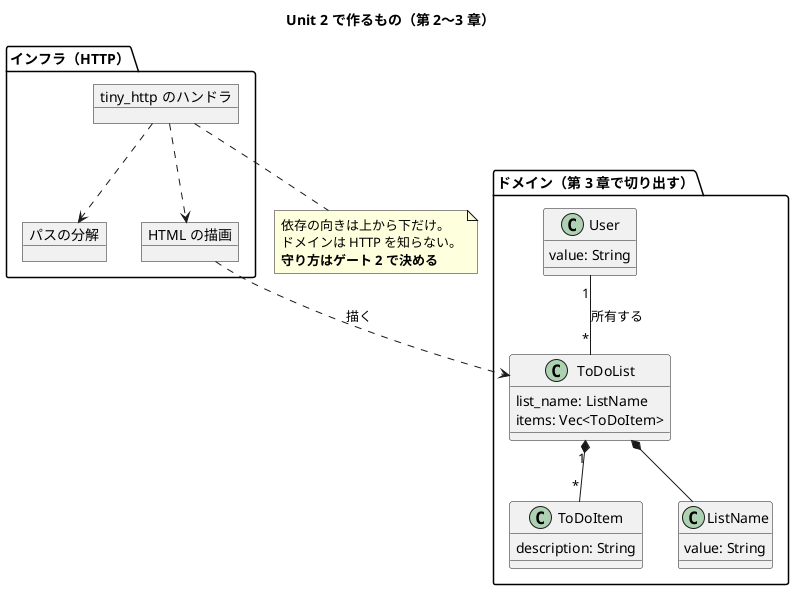

# Unit 2 の Bolt 計画（イテレーション 2）- Zettai 連載（Rust 版）

## 概要

| 項目 | 内容 |
|------|------|
| **イテレーション** | 2（Rust 版） |
| **Unit** | Unit 2 ウォーキングスケルトンとドメイン分離 |
| **期間** | 2 週間 |
| **Bolt 数** | 2（Bolt 2-1 第 2 章 / Bolt 2-2 第 3 章） |
| **局面** | **序盤（アウトサイドイン）**。[開発戦略](development_strategy.md) |
| **人の検証負荷** | 10 ポイント（第 2 章 6 / 第 3 章 4） |
| **承認ゲート** | **2 箇所** |

### 承認ゲートの運用形態

**本 Unit のゲートは「同期停止」で運用します。**

> **本節は人だけが書き換えます。** AI は書き換えません。運用形態を変えるなら人が本節を書き換えてから実行し、AI は切り替えを求められたら書き換えずに判断を仰ぎます。

| # | ゲート | ステップ | 添えるもの |
| :--- | :--- | :--- | :--- |
| 1 | **CI に Nix を入れるか** | 2-1.2 | 選択肢 3 つ、それぞれの CI 実行時間の実測、キャッシュの効き方、`just` が壊れる条件 |
| 2 | **境界をクレートで分けるか、モジュールで分けるか** | 2-2.2 | 選択肢 2 つ、それぞれの `just check` の秒数・`Cargo.toml` の数・境界検査を書くかどうか |

**箇所は 2 です。** Unit 1 は 3 / 3 で同期停止したので、[リリース計画](release_plan-rust.md) の目標（50% 以上）に対して減らす根拠がありません。計画どおり「中（2 箇所）」を維持します（Unit 1 Try 5）。

**「記事の全文検証」はゲートに置きません。** 3 対象で 14 箇所計画して 1 度も止まっていないためで、DoD のチェック項目にします。

### 目標

**2 箇所のうち 1 箇所以上が同期停止すること**（50% 以上）。下回ったら Unit 3 で箇所を減らします。

---

## Unit 1 からの持ち込み

| # | 持ち込み | 出典 | 消化するステップ |
| :--- | :--- | :--- | :--- |
| 1 | **CI（`.github/workflows/rust-zettai.yml`）を作る** | 終了報告 1 | 2-1.2 |
| 2 | 段階を切る手順を ADR に書く | 終了報告 2 | **Unit 3 へ送る**（本 Unit では段階を増やさない。下記） |
| 3 | **境界をクレートの分割で引く** | 終了報告 3 | 2-2.2 |
| 4 | カバレッジの下限の見直し | 終了報告 4 | **Unit 3 へ送る**（ドメインが育つまで意味が薄い） |
| 5 | ゲートの箇所数は減らさない | 終了報告 5 / Try 5 | 本計画のゲート節（2 箇所を維持） |
| 6 | **CI に Nix を入れるかを決める** | 終了報告 6 | 2-1.2（ゲート 1） |

### Unit 1 のふりかえり Try

| # | Try | この計画での反映 |
| :--- | :--- | :--- |
| 1 | **記事に書く主張は、テストで確かめてから書く** | 2-1.5・2-2.6 の完了判定に入れる。**主張が落ちたら主張のほうを直す** |
| 2 | **外部コマンドの出どころを両方向で確かめる** | 2-1.2 で CI を作るとき、`which` で devShell 由来かホスト由来かを見る。**「devShell に無い」と「外から叩いたらどちらが使われるか」の両方** |
| 3 | **2 対象の踏襲も「判断」として計画に書く** | 下の「2 対象から踏襲すること（判断として書く）」節 |
| 4 | **計画の数値は機械で数える** | 本計画を書いたあとに突合する（ステップ数・ゲート数・検証負荷の合計） |
| 5 | ゲートの箇所数は減らさない | 2 箇所を維持 |

**持ち込み 2 と 4 は本 Unit では消化できません。** 段階（workspace メンバー）を増やすのは第 4 章（Unit 3）からで、カバレッジの下限もドメインが育つまで意味が薄いためです。**送り先を明記しました**（「見直す」に不要と判断する条件を添える）。

---

## 2 対象から踏襲すること（判断として書く）

Unit 1 Try 3 に従い、**「2 対象と同じにする」も選択として書き出します。** 選択肢が 1 つしかなくても、書けば人が見られます。

| # | 踏襲するもの | 出典 | 選ばない場合の代替 | なぜ踏襲するか |
| :--- | :--- | :--- | :--- | :--- |
| 1 | URL 規約 `/todo/{user}/{listname}` | [UI 設計](../design/ui_design.md) | REST 風に `/users/{u}/lists/{l}` | **章の位置を対象間で比べられることが比較コンテンツの前提**（[開発戦略](development_strategy.md)） |
| 2 | ウォーキングスケルトンは第 2 章 | Kotlin 版・なでしこ3 版 | 第 1 章に前倒し | 同上。3 対象で縦串の位置を揃える |
| 3 | 受け入れシナリオを 2 経路（ドメイン直接・HTTP 経由）で走らせる | [ADR-016](../adr/ADR-016-own-acceptance-entry.md) | 1 経路だけ | なでしこ3 版 Unit 6 で**経路固有の実装欠陥**（`/rename` 以外への POST）を捕まえた実績がある |
| 4 | 受け入れテストの入口を自作する | [ADR-016](../adr/ADR-016-own-acceptance-entry.md) | `cucumber-rs` などの既製品 | **踏襲しない可能性がある。** 全 Bolt 共通のゲート項目「既製品を先に調べる」に従い、2-2.1 で調べてから決める |

**4 だけは踏襲を前提にしません。** Rust には受け入れテストの既製品があります。Unit 1 で組み込みの `#[test]` を使ったのと同じ手順で、先に調べます。

---

## ゴール

> `tiny_http` で HTTP の縦串を通し、ドメインとインフラを分ける（第 2〜3 章）。**確認したい仮説**: 所有権は縦串の段階では邪魔にならず、境界の分割ではコンパイラが味方になる。

### Unit 完了時の達成状態

- `/todo/{user}/{listname}` で ToDo リストが HTTP で見える
- ドメインとインフラが分かれ、**依存の向きが守られている**（守り方はゲート 2 で決める）
- 受け入れシナリオが 2 経路（ドメイン直接・HTTP 経由）で green
- **CI が green**（`.github/workflows/rust-zettai.yml`）
- 第 2〜3 章が公開されている（3 / 13 章）
- `comparison/index.md` に **Rust の列がある**（Phase 1 完了時に足す）
- **Release v0.1.0 が達成されている**

### 成功基準

| # | 基準 | 判定方法 | 具体例 |
| :--- | :--- | :--- | :--- |
| 1 | 縦串が通る | `curl` で確かめる | `/todo/uberto/book` が 3 件の項目を含む HTML を返す |
| 2 | 無いリストが 404 | 同上 | `/todo/uberto/nope` が 404 |
| 3 | 受け入れシナリオが 2 経路で green | `just test` | ドメイン直接と HTTP 経由で同じシナリオが通る |
| 4 | 依存の向きが守られている | ゲート 2 の決定による | クレートなら「`Cargo.toml` に依存が無い」、モジュールなら境界検査 |
| 5 | CI が green | GitHub Actions | `Rust Zettai` が success |
| 6 | 記事検査 6 本が 0 件 | `ops/scripts/article/*.py` | 第 2・3 章を含めて違反 0 |
| 7 | **ゲートの 50% 以上が同期停止した** | 実績を数える | 2 箇所中 1 箇所以上 |
| 8 | `just check` が 20 秒以内 | 3 回測る | devShell の内外の両方で測る |

---

## 第 3 章の節名の読み替え

| 節 | マインドマップ | 読み替え後 | 理由 |
| :--- | :--- | :--- | :--- |
| 第 3 章 第 5 節 | DDTをPesticideに変換する | **DDT をトレイトに変換する** | Pesticide は Kotlin のライブラリで Rust には無い。なでしこ3 版は「共通の仕組み」としたが、Rust には**トレイト**という対応物がある |

**第 2 章に読み替えはありません。**

読み替えは 2-2.7 で `draft.md` の表に登録します。**登録しないと `check_sections.py` が落ちます**（なでしこ3 版 Unit 6 で実際に落ちました）。

> **注**: 読み替え後の節名はゲート 2 の決定に依存します。境界をクレートで分けるなら「トレイト」ではなく別の語になる可能性があります。**2-2.2 の決定後に確定させます。**

---

## スパイクで確かめる項目

| # | 確かめること | 成立しなかったときの代替 | 対応するゲート |
| :--- | :--- | :--- | :--- |
| 1 | GitHub Actions の runner に Nix を入れたときの所要時間とキャッシュの効き | Nix を入れず、CI では `cargo` を直接呼ぶ（`just` を通さない） | 1 |
| 2 | 受け入れテストの既製品（`cucumber-rs` など）で 2 経路の差し替えが書けるか | 自作する（[ADR-016](../adr/ADR-016-own-acceptance-entry.md) を踏襲） | — |
| 3 | クレートを分けたときの `just check` の秒数 | モジュール分割にする | 2 |
| 4 | `tiny_http` で 404 と Content-Type を返す書き方 | — | — |

---

## 局面とアプローチ

**序盤（アウトサイドイン）です。** 第 2 章は「動くものを外から作る」段階で、Unit 1 の Bolt 1-1（判断を作る段階）と違い、アウトサイドインがそのまま当てはまります。

手順は 3 対象と同じです。

1. 業務の言葉で受け入れシナリオを書く（Red）
2. HTTP のハンドラを書いて通す（Green）
3. 第 3 章でドメインを内側に切り出す（Refactor）

**第 3 章が「分ける」章である**ことは 3 対象で共通です。違うのは分け方で、Kotlin はパッケージ、なでしこ3 はファイル、Rust は**クレートかモジュール**（ゲート 2）。

---

## Unit 2 の満足条件

### ユーザーストーリー

#### US-002: 第 2 章を公開する

> **読者**として、**所有権のある言語で HTTP の縦串をどう通すか**を知りたい。**フレームワークに隠されない形で「矢印で設計する」を見る**ため。

| # | 受入条件 | 具体例 |
| :--- | :--- | :--- |
| 1 | `/todo/{user}/{listname}` が HTML を返す | `/todo/uberto/book` が `<li>write chapter</li>` を含む |
| 2 | 無いリストが 404 | `/todo/uberto/nope` が 404 |
| 3 | パスの分解が自前で書かれている | `tiny_http` にルーティングが無いため（[ADR-025](../adr/ADR-025-tiny-http.md)） |
| 4 | **2 対象に無い内容が 1 つ以上ある** | 所有権が縦串でどう出たか（または出なかったか）。**出なかったならそう書く**（Try 1） |
| 5 | CI が green | `Rust Zettai` |

#### US-003: 第 3 章を公開する

> **読者**として、**ドメインとインフラの境界を、コンパイラに守らせられるか**を知りたい。**2 対象が検査を書いて守ったものを、型のある言語がどこまで肩代わりするか**を見るため。

| # | 受入条件 | 具体例 |
| :--- | :--- | :--- |
| 1 | ドメインとインフラが分かれている | ゲート 2 の決定による |
| 2 | 依存の向きが守られている | クレートなら `Cargo.toml` に依存が無い。**守り方を記事に書く** |
| 3 | 受け入れシナリオが 2 経路で走る | ドメイン直接・HTTP 経由で同じシナリオ |
| 4 | 節名の読み替えが `draft.md` に登録されている | 第 3 章第 5 節 |
| 5 | **2 対象に無い内容が 1 つ以上ある** | 「境界検査を書かなくてよい」ことが、2 対象の裏返しとして書かれている（クレートを選んだ場合） |

### NFR 定義（Unit 2 固有）

| # | 項目 | 目標 | 測り方 |
| :--- | :--- | :--- | :--- |
| 1 | `just check`（devShell 内） | **20 秒以内** | 3 回測る |
| 2 | `just check`（devShell 外） | **20 秒以内** | 3 回測る。Unit 1 の実測は 4〜8 秒 |
| 3 | CI の所要時間 | **10 分以内** | GitHub Actions の実測 |
| 4 | カバレッジ（行） | 80% 以上 | `just cov` |

**devShell の内外の両方を測る**のは Unit 1 の修正（`justfile` が入り直す）を受けたものです。**外から叩いても上限内であることを、Unit ごとに確かめます。**

---

## エントロピー評価

| 軸 | 水準 | 根拠 | 対処 |
| :--- | :--- | :--- | :--- |
| 意図の曖昧さ | LOW | 第 2・3 章の主題は 2 対象で確定済み | — |
| 構造的不確実性 | **MED** | **境界をクレートで分けるかモジュールで分けるかが未確定。** 残り 10 章のファイル配置を縛る | スパイク 3 → ゲート 2 |
| 検証の不確実性 | LOW | `cargo test` と受け入れシナリオの形は 3 対象で確立済み | — |
| リスク | MED | CI が未作成。Nix を入れるかで CI の形が変わる | スパイク 1 → ゲート 1 |
| 未解決の仮定 | MED | 所有権が縦串で問題になるかが未知。`tiny_http` の 404 の書き方も未確認 | スパイク 4 |

Unit 1（リスクと未解決の仮定が HIGH）より下がっています。**後戻りの効かない判断は Unit 1 で潰しました。**

---

## Bolt 2-1: ウォーキングスケルトン（第 2 章）

### Bolt ゴール

> `/todo/{user}/{listname}` を HTTP で返す縦串を通し、CI を作る。**確認したい仮説**: 所有権は縦串の段階では邪魔にならない。

### ステップ計画

- [x] **2-1.0 スパイク**: `tiny_http` で 404 と Content-Type を返す書き方を確かめる（スパイク 4）
- [x] **2-1.1 受け入れシナリオを Red にする**（アウトサイドイン）
  - 「uberto は book の項目を 3 件見られる」「無いリストは 404」を業務の言葉で書く
  - この時点では 1 経路（ドメイン直接）だけ。2 経路目は第 3 章
- [x] **2-1.2 CI を作る**（持ち込み 1・6。Try 2）
  - **Nix を入れるかを決める**。入れないなら `just` を通さず `cargo` を直接呼ぶ
  - `which` で devShell 由来かホスト由来かを両方向で確かめる
  - **★人の確認が必要（ゲート 1）**
  - 添えるもの: 選択肢 3 つ・CI 実行時間の実測・キャッシュの効き方・`just` が壊れる条件
  - **実績（2026-09-29。ゲート 1 は同期停止した）**: 2 案を**同じコミットで並べて実測**した

| 案 | 結果 | 所要時間 |
| :--- | :--- | :--- |
| A Nix + `just check-all` | success | **525 秒** |
| **B rustup + `cargo`（採用）** | success | **17 秒** |

  - 人は「案B」を選択。**代償は検査の定義が 2 か所に分かれること**
  - その代償を**検査で押さえた**: `ops/scripts/check_rust_ci_parity.py` が `justfile` の `check-all` と workflow の `run:` を突き合わせる。わざとずらして落ちることを確認済み
  - **計画では 2-1.2 が 2-1.3 より前だったが、順序を入れ替えた。** 動かないコードで CI を測っても意味がないため
- [x] **2-1.3 HTTP のハンドラを書く（Red → Green）**: パスの分解を自前で書く
- [x] **2-1.4 矢印で設計する**: リクエスト → ToDo リスト → HTML を関数の合成として表す
  - **所有権がどう出たかを記録する**（`README.md` の「設計に効くもの」の表）
- [x] **2-1.5 第 2 章の骨子と執筆**
  - **主張はテストで確かめてから書く**（Try 1）。所有権が問題にならなかったならそう書く
  - 完了判定: 2 対象に無い内容が 1 つ以上ある
- [ ] **2-1.6 サイト反映**

---

## Bolt 2-2: ドメインとインフラの分離（第 3 章）

### Bolt ゴール

> ドメインを内側に切り出し、依存の向きを守る。**確認したい仮説**: 2 対象が検査を書いて守ったものを、コンパイラが肩代わりする。

### ステップ計画

- [ ] **2-2.1 受け入れテストの既製品を調べる**（全 Bolt 共通のゲート項目）
  - `cucumber-rs` などで 2 経路の差し替えが書けるかを確かめる
  - **入れない判断も記録する**（[ADR-016](../adr/ADR-016-own-acceptance-entry.md) を踏襲するかどうか）
- [ ] **2-2.2 境界の分け方を決める**（持ち込み 3。スパイク 3）
  - 案 A: 段階メンバー 1 つの中でモジュール分割（`mod domain` / `mod http`）
  - 案 B: 段階ごとに 2 クレート（`zettai-step1-domain` / `zettai-step1-http`）
  - **★人の確認が必要（ゲート 2）**
  - 添えるもの: それぞれの `just check` の秒数・`Cargo.toml` の数・**境界検査を書くかどうか**
  - **この決定が残り 10 章のファイル配置を縛る**
- [ ] **2-2.3 ドメインを切り出す（Refactor）**: 受け入れシナリオを green に保ったまま
- [ ] **2-2.4 受け入れテストを 2 経路にする**: ドメイン直接・HTTP 経由で同じシナリオ
- [ ] **2-2.5 依存の向きを守る仕組みを入れる**: ゲート 2 の決定による
  - クレートなら**何も書かない**（コンパイラが守る）。その事実を記事に書く
  - モジュールなら境界検査を書く（2 対象と同じ）
- [ ] **2-2.6 第 3 章の骨子と執筆**
  - 節名の読み替えを確定させる（第 3 章第 5 節）
  - **主張はテストで確かめてから書く**（Try 1）
- [ ] **2-2.7 設計ドキュメント・節名の読み替え・ADR**
  - `draft.md` に第 3 章第 5 節の読み替え 1 件
  - `architecture_backend.md` に「Rust 版での差分」節を新設（境界の守り方）
  - ADR-027（境界の分け方）、ADR-028（受け入れテストの入口。既製品の採否）
- [ ] **2-2.8 サイト反映と OKF 適用**
  - **`comparison/index.md` に Rust の列を足す**（Phase 1 完了）
- [ ] **2-2.9 Release v0.1.0**: push して CI の green を確かめる
- [ ] **2-2.10 Bolt 終了報告とふりかえり**: **ゲートの同期停止率を数える**

---

## 設計

### Unit 2 のドメインモデル（第 2〜3 章のスコープ）

**第 4 章以降の要素（`ToDoStatus`・イベント・コマンド）は入れません。** 既存の [ドメインモデル設計](../design/domain-model.md) にあります。

### 画面遷移図

**本 Unit では掲載しません。** 画面は 1 つ（ToDo リストの表示）だけで、遷移がありません。遷移が生まれるのは第 11 章（名前変更のフォーム）からです。既存の [UI 設計](../design/ui_design.md) にあります。

### 状態遷移図・ER 図

**本 Unit では掲載しません。** 状態は第 4 章（Unit 3）から、永続化は第 9 章（Unit 5）からです。

### ユーザーマニュアル

**本 Unit では作りません。** 本連載の成果物は記事であり、利用者向けマニュアルを持ちません（3 対象で共通）。

### ADR

| ADR | 内容 | ステップ |
| :--- | :--- | :--- |
| ADR-027（予定） | 境界の分け方（クレートかモジュールか） | 2-2.2・2-2.7 |
| ADR-028（予定） | 受け入れテストの入口（既製品の採否） | 2-2.1・2-2.7 |
| CI の判断 | ゲート 1 の結果を **ADR-026 に追記**する（`just` と CI の関係なので新設しない） | 2-1.2 |

---

## リスクと対策

| リスク | 影響 | 対策 | 検知 |
| :--- | :--- | :--- | :--- |
| **CI の runner に Nix を入れると遅い** | 中 | スパイク 1 で実測してから決める。**遅ければ `just` を通さず `cargo` を直接呼ぶ**（`justfile` と CI が二重管理になる代償を承知で） | 2-1.2 |
| **クレートを分けると `just check` が伸びる** | 中 | スパイク 3 で実測。**20 秒を超えるならモジュール分割にする** | 2-2.2 |
| 所有権が縦串で問題になり、第 2 章が所有権の説明で埋まる | 中 | **問題にならなかったらそう書く**（Try 1）。埋まるようなら第 4 章（関数型 DI）へ送る | 2-1.4 |
| 第 2・3 章が 2 対象の焼き直しになる | **高** | 受入条件で「2 対象に無い内容を 1 つ以上」を要求する。無ければ未完了 | 2-1.5・2-2.6 |
| ゲートが止まらない | 中 | 選択肢と数字を必ず添える。**2 箇所中 1 箇所を下回ったら Unit 3 で減らす** | 2-2.10 |
| 節名の読み替えを `draft.md` に登録し忘れる | 低 | `check_sections.py` が落ちる。**なでしこ3 版 Unit 6 で実際に落ちた** | 2-2.7 |

---

## Deployment Unit としての完了条件

### Definition of Done

- [ ] `/todo/{user}/{listname}` が HTML を返し、無いリストが 404
- [ ] 受け入れシナリオが 2 経路で green
- [ ] 依存の向きが守られている（守り方はゲート 2 の決定による）
- [ ] `just check` が **20 秒以内**（devShell の**内外の両方**で 3 回測る）
- [ ] カバレッジ（行）が 80% 以上
- [ ] **CI が green**（`Rust Zettai`）
- [ ] 第 2〜3 章が公開され、**それぞれ 2 対象に無い内容が 1 つ以上ある**
- [ ] 節名の読み替えが `draft.md` に登録されている
- [ ] ADR 2 件（境界の分け方・受け入れテストの入口）と ADR-026 への追記
- [ ] `comparison/index.md` に **Rust の列がある**
- [ ] 記事検査 6 本が違反 0 件
- [ ] `gulp okf:check` が ERROR 0
- [ ] **Release v0.1.0 が達成されている**
- [ ] Bolt 終了報告とふりかえりがあり、**ゲートの同期停止率を数えた**
- [ ] ユーザーマニュアル: **対象外**

### 全 Bolt 共通のゲート項目（DoD）

| 項目 | 本 Unit での扱い |
| :--- | :--- |
| **既製品を先に調べたか** | 受け入れテストの枠組み（2-2.1）。**入れない判断も記録する** |
| 記事のコード例が実装からの転記か | `check_article_code.py` が green |
| つまずき節があるか | 第 2・3 章に **2 対象に無い** Rust 固有の内容が 1 つ以上 |
| 既知の制約の一覧が更新されているか | `apps/rust/zettai/README.md`。**所有権に押された箇所**の表も |
| 性質テストのしきい値に根拠があるか | **本 Unit では性質テストを書かない**（Unit 3 から） |
| 記事の全文検証 | **ゲートではなく DoD** |

### デモ項目

| # | デモ | 確認すること |
| :--- | :--- | :--- |
| 1 | サーバを起動して `/todo/uberto/book` を開く | 項目が 3 件見える |
| 2 | `/todo/uberto/nope` を開く | 404 |
| 3 | 受け入れシナリオを走らせる | 2 経路とも green |
| 4 | ドメインから HTTP を呼ぼうとする | **コンパイルが通らない**（クレートを選んだ場合） |
| 5 | `just check` を devShell の内外で測る | どちらも 20 秒以内 |
| 6 | CI を見る | green |

---

## 指標（Bolt 終了報告へ引き継ぐ）

| 指標 | 計画 |
| :--- | :--- |
| ステップ | **17**（Bolt 2-1: 7 / Bolt 2-2: 10） |
| 承認ゲート | 2 箇所（同期停止）。**目標は 1 箇所以上が実際に停止すること** |
| 検証負荷 | 10 |
| 変更依頼数 | ゲートで「やり直し」と判断された回数 |
| 人が修正を入れた箇所数 | 記録する |
| 公開する章 | 2（第 2〜3 章） |
| ADR | 2 新設 + 1 追記 |
| `just check` | 20 秒以内（devShell の内外） |
| リリース | **v0.1.0** |

---

## 更新履歴

| 日付 | 更新内容 | 更新者 |
|------|---------|--------|
| 2026-09-29 | 初版作成。Unit 1 の持ち込み 6 件と Try 5 件を反映。消化できない 2 件（段階を切る手順・カバレッジの下限）は送り先を明記した。**Try 3 に従い「2 対象から踏襲すること」を判断として 4 件書き出した**。ゲートは 2 箇所を維持（Unit 1 が 3 / 3 で停止したため減らす根拠が無い） | claude-code/claude-opus-5 |

---

## 関連ドキュメント

- [リリース計画（Rust 版）](release_plan-rust.md) / [開発戦略](development_strategy.md)
- [Unit 1 の Bolt 計画](iteration_plan-rust-1.md) / [Bolt 終了報告](bolt_report-rust-1.md) / [ふりかえり](retrospective-rust-1.md)
- [執筆計画](../article/outline.md) / [章構成マインドマップ](../article/draft.md)
- [ドメインモデル設計](../design/domain-model.md) / [バックエンドアーキテクチャ設計](../design/architecture_backend.md) / [UI 設計](../design/ui_design.md)
- [ADR-025 tiny_http を採用する](../adr/ADR-025-tiny-http.md) / [ADR-026 Just とカバレッジ](../adr/ADR-026-just-and-coverage.md)
- [Kotlin 版 Unit 2 の Bolt 計画](iteration_plan-2.md) / [なでしこ3 版 Unit 2 の Bolt 計画](iteration_plan-nadesiko-2.md)
