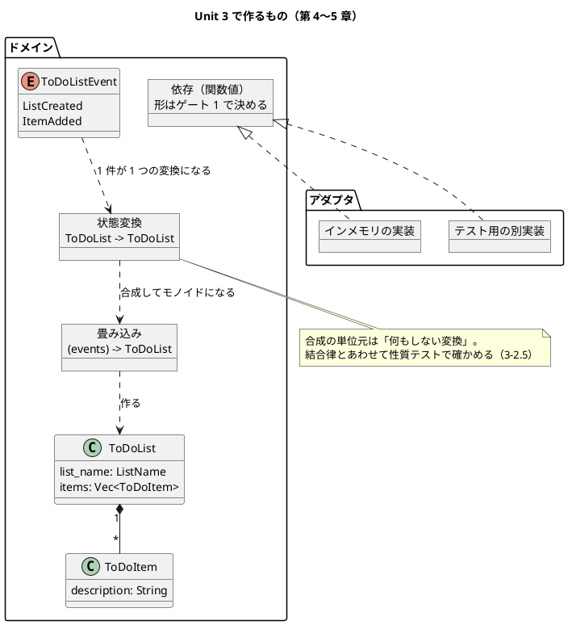
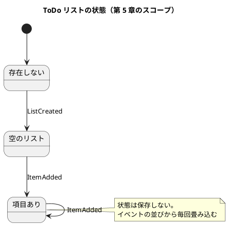

# Unit 3 の Bolt 計画（イテレーション 3）- Zettai 連載（Rust 版）

## 概要

| 項目 | 内容 |
|------|------|
| **イテレーション** | 3（Rust 版） |
| **Unit** | Unit 3 所有権のもとでの DI とイベント |
| **期間** | 2 週間 |
| **Bolt 数** | 2（Bolt 3-1 第 4 章 / Bolt 3-2 第 5 章） |
| **局面** | **中盤（インサイドアウト）**。[開発戦略](development_strategy.md) |
| **人の検証負荷** | 14 ポイント（第 4 章 8 / 第 5 章 6）。**3 対象を通して最も重い Unit** |
| **承認ゲート** | **3 箇所** |

### 承認ゲートの運用形態

**本 Unit のゲートは「同期停止」で運用します。**

> **本節は人だけが書き換えます。** AI は書き換えません。運用形態を変えるなら人が本節を書き換えてから実行し、AI は切り替えを求められたら書き換えずに判断を仰ぎます。

| # | ゲート | ステップ | 添えるもの |
| :--- | :--- | :--- | :--- |
| 1 | **関数型 DI をどの形で表すか** | 3-1.2 | 選択肢 3 つ、それぞれで**第 5 章のクロージャ合成まで書けたか**、`just check` の秒数、書き換えが要る箇所数 |
| 2 | **段階をどこで切るか** | 3-1.3 | 選択肢 2 つ、それぞれの `just check` の秒数・workspace メンバー数・**過去章の記事が落ちる件数**（実測） |
| 3 | **性質テストに既製品を入れるか** | 3-2.4 | 選択肢 3 つ、依存クレート数・ビルド時間の増分・**検出率を測れるか** |

**箇所は 3 です。** [リリース計画](release_plan-rust.md) のエントロピー評価が Unit 3 を「密（3 箇所）」としており、累計 5 / 5 で停止しているので減らす根拠がありません（Unit 2 Try 5）。

### 目標

**3 箇所のうち 2 箇所以上が同期停止すること**（50% 以上）。下回ったら Unit 4 で箇所を減らします。

---

## Unit 2 からの持ち込み

**Unit 2 Try 2 に従い、送り先を「Unit N へ」ではなく条件で書きます。**

| # | 持ち込み | 出典 | 消化する条件とステップ |
| :--- | :--- | :--- | :--- |
| 1 | **段階を切る手順を ADR に書く** | 終了報告 1（**3 回目**） | **2 つめの workspace メンバーを切るとき** = 3-1.3・3-1.9。**本 Unit で必ず消化する** |
| 2 | **カバレッジの下限の見直し** | 終了報告 2（**3 回目**） | **ドメインのクレートが単独で意味を持つ行数になったとき** = 3-2.6。**本 Unit で必ず消化する** |
| 3 | 所有権が関数型 DI とクロージャの合成にどう効くか | 終了報告 3 | 3-1.2（ゲート 1）・3-2.3 |
| 4 | 性質テストのしきい値に分布の計算を添える | 終了報告 4 / Unit 1 Try 1 | 3-2.5 |
| 5 | ゲートの箇所数は減らさない | 終了報告 5 / Try 5 | 本計画のゲート節（3 箇所） |
| 6 | `parity` 検査の対象を広げるか | 終了報告 6 | **`justfile` か workflow のどちらかを触るとき** = 3-2.6（カバレッジ下限を変えるなら両方に効く） |

### Unit 2 のふりかえり Try

| # | Try | この計画での反映 |
| :--- | :--- | :--- |
| 1 | **ステップに「前提」を 1 行書く** | **全ステップに「前提」を付けた。** 前提が満たされないステップは順序を入れ替える |
| 2 | **送る持ち込みは条件で書く** | 上表の「消化する条件」列。**「Unit N へ」と書かない** |
| 3 | **コンパイルエラーは読んでから直す** | 3-1.2・3-1.4 の所有権エラーで適用する。**`expected X, found Y` を記事に転記してから直す** |
| 4 | **新規ファイルを作った Bolt では `okf:check` の WARN も見る** | 3-1.9・3-2.9 の完了判定に「WARN も見る」を入れる |
| 5 | ゲートの箇所数は減らさない | 3 箇所を維持 |

---

## 2 対象から踏襲すること（判断として書く）

Unit 1 Try 3 に従い、**「2 対象と同じにする」も選択として書き出します。**

| # | 踏襲するもの | 出典 | 選ばない場合の代替 | なぜ踏襲するか |
| :--- | :--- | :--- | :--- | :--- |
| 1 | 第 4 章で関数型 DI、第 5 章でイベントと畳み込み | Kotlin 版・なでしこ3 版 | 順序を入れ替える | **章の位置を対象間で比べられることが比較コンテンツの前提** |
| 2 | 段階ディレクトリで過去章のコードを残す | [ADR-015](../adr/ADR-015-step-directories.md) | 最新形だけを置く | 記事が指すコードが変化しないため。**3 対象で共通** |
| 3 | 性質テストで**検出率を測ってから信用する** | [ADR-017](../adr/ADR-017-own-property-testing.md) | 法則が通ることだけ確かめる | なでしこ3 版で「通るが何も検出しない性質テスト」を実際に作った |
| 4 | 性質テストを自作する | [ADR-017](../adr/ADR-017-own-property-testing.md) | `proptest` / `quickcheck` | **踏襲を前提にしない。** Rust には既製品がある。ゲート 3 で調べてから決める |

**4 だけは踏襲を前提にしません。** Unit 2 の `cucumber` と同じ手順（依存数とビルド時間を測ってから決める）で調べます。

---

## ゴール

> 関数型 DI とイベントの畳み込みを、所有権のもとで書く（第 4〜5 章）。**確認したい仮説**: 所有権は設計を悪くせず、なでしこ3 版と同じく「押された先が正しい」形になる。

### Unit 完了時の達成状態

- ToDo リストに項目を足すストーリーが、**関数型 DI で差し替えられる形**で動く
- 状態の変更がイベントとして表され、**イベントの並びから状態が畳み込める**
- 状態変換の合成が**モノイドであることが性質テストで確かめられ、検出率が測られている**
- **2 つめの workspace メンバーが切られ、段階を切る手順が ADR にある**（持ち込み 1）
- **カバレッジの下限が見直され、根拠が記録されている**（持ち込み 2）
- 第 4〜5 章が公開されている（5 / 13 章）

### 成功基準

| # | 基準 | 判定方法 | 具体例 |
| :--- | :--- | :--- | :--- |
| 1 | アダプタを差し替えても同じシナリオが通る | `just test` | テストから別の実装を渡して green |
| 2 | イベントの並びから状態が作れる | `just test` | `[ListCreated, ItemAdded, ItemAdded]` → 項目 2 件 |
| 3 | モノイド則が性質テストで通る | `just test` | 単位元・結合律 |
| 4 | **性質テストが実際に検出する** | 法則を壊して数える | **しきい値に期待値と標準偏差の計算が添えてある**（持ち込み 4） |
| 5 | 過去章の記事が落ちない | `check_article_code.py` | 段階を切ったあとに 0 件 |
| 6 | 記事検査 6 本が 0 件 | `ops/scripts/article/*.py` | 第 4・5 章を含めて違反 0 |
| 7 | **ゲートの 50% 以上が同期停止した** | 実績を数える | 3 箇所中 2 箇所以上 |
| 8 | `just check` が 20 秒以内 | 3 回測る | devShell の内外の両方 |

---

## 節名の読み替え

**第 4 章・第 5 章に読み替えはありません。** [マインドマップ](../article/draft.md) の節名に、ライブラリ名・言語名・製品名が含まれないためです。

| 章 | 節 | 固有名の有無 |
| :--- | :--- | :--- |
| 第 4 章 | 新しいストーリー / 関数型の「依存性の注入」 / 関数型コードのデバッグ / 関数型ドメインモデリング / まとめ | 無し |
| 第 5 章 | ToDo リストの作成の表示 / 状態変更の保存 / 再帰の力を解き放つ / イベントを畳み込む / モノイドの発見 / まとめ | 無し |

**登録は不要ですが、`check_sections.py` が通ることは 3-2.9 で確かめます。**

---

## スパイクで確かめる項目

| # | 確かめること | 成立しなかったときの代替 | 対応するゲート |
| :--- | :--- | :--- | :--- |
| 1 | `impl Fn` / `Box<dyn Fn>` / ジェネリック型パラメータの 3 案で、**第 5 章のクロージャ合成まで書けるか** | 書ける案だけに絞る。**どれも書けないならトレイトオブジェクトに戻す** | 1 |
| 2 | 2 つめの workspace メンバーを足したときの `just check` の秒数 | 段階を切らず、モジュールで章を分ける | 2 |
| 3 | `proptest` / `quickcheck` の依存数・ビルド時間・**検出率を測れるか**（乱数の種を固定して試行回数を数えられるか） | 自作する（[ADR-017](../adr/ADR-017-own-property-testing.md) を踏襲） | 3 |
| 4 | 借用のもとで「状態から状態への関数」を合成できるか（`move` クロージャの所有） | 合成をやめ、畳み込みの中で直接適用する | — |

**スパイク 1 は第 5 章まで書いてから判断します。** [リリース計画](release_plan-rust.md) のリスク台帳が「それぞれで第 5 章のクロージャ合成まで書けるか」を条件に指定しているためです。**第 4 章だけを見て決めると、第 5 章で書き直しになります。**

---

## 局面とアプローチ

**中盤（インサイドアウト）です。** 第 4 章はドメインの内側（ハブと契約）から書き、外へ展開します。Unit 2（序盤・アウトサイドイン）から切り替わります。

1. ドメインの契約を決め、内側から書く（Red → Green）
2. アダプタを差し替えて、同じシナリオが通ることを確かめる
3. 上位（HTTP）へ展開する

---

## Unit 3 の満足条件

### ユーザーストーリー

#### US-004: 第 4 章を公開する

> **読者**として、**所有権のある言語で関数型の「依存性の注入」がどう書けるか**を知りたい。**関数を値として渡す設計が、所有権のもとで成り立つか**を見るため。

| # | 受入条件 | 具体例 |
| :--- | :--- | :--- |
| 1 | ToDo リストに項目を足すストーリーが動く | 項目を足すと一覧に出る |
| 2 | 依存が関数値として渡されている | ゲート 1 の決定による |
| 3 | テストから別の実装を渡せる | 同じシナリオが 2 つの実装で通る |
| 4 | **2 対象に無い内容が 1 つ以上ある** | 所有権が DI の形をどう決めたか。**決めなかったならそう書く**（Unit 1 Try 1） |
| 5 | 段階を切る手順が ADR にある | 持ち込み 1 |

#### US-005: 第 5 章を公開する

> **読者**として、**イベントの畳み込みとモノイドが、所有権のもとでどう書けるか**を知りたい。**「状態から状態への関数」を値として合成できるか**を見るため。

| # | 受入条件 | 具体例 |
| :--- | :--- | :--- |
| 1 | イベントの並びから状態が作れる | 畳み込み |
| 2 | 状態変換が合成できる | 関数値の合成 |
| 3 | モノイド則が性質テストで通る | 単位元・結合律 |
| 4 | **性質テストの検出率が測られている** | 法則を壊して数える。**しきい値に分布の計算が添えてある** |
| 5 | **2 対象に無い内容が 1 つ以上ある** | `move` と借用がクロージャの合成にどう効いたか |

### NFR 定義（Unit 3 固有）

| # | 項目 | 目標 | 測り方 |
| :--- | :--- | :--- | :--- |
| 1 | `just check`（devShell 内） | **20 秒以内** | 3 回測る。**段階を切った直後にも測る** |
| 2 | `just check`（devShell 外） | **20 秒以内** | 3 回測る |
| 3 | カバレッジ（行） | **3-2.6 で見直す**（現状 80%。実績 91.27%） | `just cov` |
| 4 | 性質テストの試行回数と所要時間 | `just check` の上限を崩さない | 3-2.5 で測る |

---

## エントロピー評価

| 軸 | 水準 | 根拠 | 対処 |
| :--- | :--- | :--- | :--- |
| 意図の曖昧さ | MED | 第 4 章の「関数型 DI」が Rust で何になるかが未確定 | スパイク 1 → ゲート 1 |
| 構造的不確実性 | **HIGH** | **DI の形と段階の切り方が、残り 9 章のコード配置を縛る** | スパイク 1・2 → ゲート 1・2 |
| 検証の不確実性 | MED | 性質テストが本当に検出するかは測るまで分からない | 3-2.5（検出率の測定） |
| リスク | MED | 所有権がクロージャの合成を書けなくする可能性 | スパイク 4 |
| 未解決の仮定 | **HIGH** | **「押された先が正しい」がこの Unit で 3 件目まで積めるか**が未知 | 3-1.8・3-2.8 で記録 |

**リリース計画の評価（意図 MED / 構造 HIGH / 検証 MED / リスク MED / 仮定 HIGH）と一致しています。** ゲートは計画どおり 3 箇所です。

---

## Bolt 3-1: 所有権のもとでの関数型 DI（第 4 章）

### Bolt ゴール

> 依存を関数値として渡す形を決め、2 つめの段階を切る。**確認したい仮説**: 所有権は DI の形を狭めるが、狭めた先は読みやすい。

### ステップ計画

**Unit 2 Try 1 に従い、各ステップに「前提」を 1 行書きます。**

- [x] **3-1.0 スパイク**: 「スパイクで確かめる項目」の 1・2・4 を実機で潰す
  - **前提**: Unit 2 の 2 クレート構成が green であること
  - スパイク 1 は**第 5 章のクロージャ合成の形まで**書いてみる（第 4 章だけで判断しない）
  - 踏んだ制約は `README.md` の「既知の制約」にその場で足す
  - **実績（2026-09-29）**: `spikes/di-shapes/` に 3 案を書き、**第 5 章の畳み込みまで**試した

| | 案 A `impl Fn` | 案 B `Box<dyn Fn>` | 案 C ジェネリクス + トレイト |
| :--- | :--- | :--- | :--- |
| 依存を差し替える（第 4 章） | できる | できる | できる |
| 2 つの変換を合成する | できる | できる | できる |
| **長さが実行時に決まる列を畳み込む（第 5 章）** | **できない**（E0308） | **できる** | **できない**（E0308） |

  - **第 4 章だけを見ていたら 3 案とも通っていた。** 第 5 章まで試して初めて 2 案が落ちた
  - スパイク 2（段階を 2 つに増やす）: `just check` は **4.07 秒 → 8.22 秒**（定常）。初回は **24.77 秒**で上限 20 秒を超える。過去章の記事は **1 件**落ちる（第 1 章の `workspace.members`）
  - スパイク 2 の副産物: **段階を増やすと `bin` の出力名が衝突する**（cargo #6313）。段階を切る手順の ADR に入れる
  - スパイク 4: `Box<dyn Fn>` は既定で `+ 'static`。**借りずに所有すれば通る**（制約 6・設計に効くもの 4）
- [x] **3-1.1 新しいストーリーを受け入れシナリオにする（Red）**
  - **前提**: 3-1.0 で所有権の形が分かっていること
  - 「uberto は book に項目を足せる」を業務の言葉で書く。2 経路とも
- [x] **3-1.2 関数型 DI の形を決める**（持ち込み 3。スパイク 1）
  - **前提**: 3-1.0 で 3 案とも第 5 章の合成まで試してあること
  - 案 A: `impl Fn` を引数に取る／案 B: `Box<dyn Fn>` を持つ／案 C: ジェネリック型パラメータ + トレイト境界
  - **★人の確認が必要（ゲート 1）**
  - 添えるもの: 3 案それぞれで**第 5 章の合成が書けたか**、`just check` の秒数、書き換えが要る箇所数
  - **この決定が残り 9 章の関数の形を縛る**
  - **実績（2026-09-29。ゲート 1 は同期停止した）**: 人は「**案 A と案 B を使い分ける**」を選択
  - **差し替えるだけの依存は `impl Fn`（静的）。並びに入れる変換は `Box<dyn Fn>`（同じ型に揃う）**
  - 第 4 章だけを見ていたら 3 案とも通っていた。**第 5 章の畳み込みで案 A と案 C が落ちた**（合成の結果が別の型になり `fold` の途中経過を揃えられない）
  - **形が 2 つになる代償を引き受けた。** 「なぜ 2 つなのか」が第 4〜5 章の主題になる
- [x] **3-1.3 段階をどこで切るかを決める**（持ち込み 1。スパイク 2）
  - **前提**: 3-1.2 で DI の形が決まっていること（形が変わると切る単位も変わる）
  - 案 A: 第 4 章で `zettai-step2-*` を切る／案 B: 第 6 章まで `step1` を使い続ける
  - **★人の確認が必要（ゲート 2）**
  - 添えるもの: それぞれの `just check` の秒数・メンバー数・**過去章の記事が落ちる件数**（`check_article_code.py` の実測）
  - **実績（2026-09-29。ゲート 2 は同期停止した）**: 人は「**第 4 章で切る。段階ごとに `bin` の名前を分ける**」を選択
  - **最初に出した数字が間違っていた。** 「初回 24.77 秒」は段階を増やした costs ではなく、**依存クレートを初めてビルドした値**だった。依存のキャッシュを揃えて測り直すと 3 構成の差は誤差だった

| 構成 | 初回（`step2` だけ clean） | 定常 |
| :--- | :--- | :--- |
| (a) 両段階が `bin` を持つ（同名） | 18.21 / 12.28 秒 | 5.32 / 5.11 秒 |
| (b) `bin` は最新段階だけ | 14.90 / 12.33 秒 | 4.97 / 5.25 秒 |
| **(c) 名前を分ける（採用）** | **14.03 / 13.57 秒** | **6.38 / 5.36 秒** |

  - **測り直したことで推奨が変わった。** (b) の利点は cargo #6313 の警告が消えることだけになり、それは (c) でも得られる。(b) は第 2 章の `src/bin/zettai.rs` の記述を 2 箇所で嘘にする
  - `[[bin]] name` だけを変え、**ファイル名は `src/bin/zettai.rs` のまま**にした。第 2 章に手を入れずに済む
- [x] **3-1.4 ドメインから書く（Red → Green）**
  - **前提**: 3-1.2・3-1.3 が決まっていること
  - 項目を足すユースケースを、決めた DI の形でドメインの中に書く
  - **コンパイルエラーは読んでから直す**（Try 3）。`expected X, found Y` は記事に転記してから直す
- [x] **3-1.5 アダプタを差し替える**
  - **前提**: 3-1.4 が green であること
  - テストから別の実装を渡し、同じシナリオが通ることを確かめる。**これが DI が効いている証拠**
- [x] **3-1.6 上位へ展開する**
  - **前提**: 3-1.5 が green であること
  - HTTP 側が具体の実装を知らない形に整える。2 経路の受け入れシナリオが引き続き green
- [x] **3-1.7 関数型コードをデバッグする**（第 4 章第 3 節）
  - **前提**: 3-1.6 が green であること
  - 関数値の中で何が起きているかをどう見るか。**Rust で実際に使った手段を書く**（`dbg!`・型注釈でのエラー誘発など）
- [x] **3-1.8 第 4 章の骨子と執筆**
  - **前提**: 3-1.7 までが green であること
  - **主張はテストで確かめてから書く**（Unit 1 Try 1）
  - 所有権に押された箇所を `README.md` の「設計に効くもの」に足す（**3 件目**）
  - 完了判定: 2 対象に無い内容が 1 つ以上ある
- [x] **3-1.9 ADR とサイト反映**
  - **前提**: 3-1.8 が書けていること
  - **ADR: 段階を切る手順**（持ち込み 1。**3 回送った。ここで消化する**）／**ADR: 関数型 DI の形**（ゲート 1 の決定）
  - **新規 ADR を作るので `okf:check` の WARN も見る**（Try 4。Unit 2 で `generated` が落ちた）

---

## Bolt 3-2: イベントの畳み込みとモノイド（第 5 章）

### Bolt ゴール

> 状態の変更をイベントで表し、畳み込みがモノイドであることを性質テストで示す。**確認したい仮説**: 「状態から状態への関数」を所有権のもとで合成できる。

### ステップ計画

- [ ] **3-2.1 イベントの契約を決める（Red → Green）**
  - **前提**: Bolt 3-1 が green であること
  - `ListCreated`・`ItemAdded` を `enum` で表す。**`enum` が言語にあることの最初の場面**
- [ ] **3-2.2 畳み込みを書く（Red → Green）**
  - **前提**: 3-2.1 が green であること
  - イベントの並びから状態を作る。**再帰で書くか `fold` で書くかはスパイク 4 の結果に従う**
- [ ] **3-2.3 状態変換を関数値にする（Refactor）**（持ち込み 3）
  - **前提**: 3-2.2 が green で、3-1.2 の DI の形が決まっていること
  - 「イベントを適用する」を状態から状態への関数として表し、合成できるようにする
  - **`move` と借用がどう効いたかを記録する**（第 5 章の「2 対象に無い内容」の候補）
- [ ] **3-2.4 性質テストの枠組みを決める**（踏襲 4。スパイク 3）
  - **前提**: 3-2.3 で確かめたい法則が定まっていること
  - 案 A: `proptest` ／案 B: `quickcheck` ／案 C: 自作（[ADR-017](../adr/ADR-017-own-property-testing.md) を踏襲）
  - **★人の確認が必要（ゲート 3）**
  - 添えるもの: 依存クレート数・ビルド時間の増分・**検出率を測れるか**（試行回数と種を握れるか）
  - **入れない判断も ADR に残す**（全 Bolt 共通のゲート項目）
- [ ] **3-2.5 単位元と結合律を確かめ、検出率を測る**（持ち込み 4）
  - **前提**: 3-2.4 で枠組みが決まっていること
  - 法則をわざと壊して検出数を数える
  - **しきい値には期待値と標準偏差の計算を添える**（なでしこ3 版 Unit 6 で、しきい値が 1.58σ だったために CI が確率 5.7% で落ちた）
- [ ] **3-2.6 カバレッジの下限を見直す**（持ち込み 2・6）
  - **前提**: ドメインのクレートが単独で意味を持つ行数になっていること（3-2.3 の完了時点）
  - クレートごとの実測を出し、`cov_min` を据え置くか上げるかを数字で決める
  - **`justfile` を触るので `check_rust_ci_parity.py` が落ちる。** CI 側も直し、**parity の対象を広げるかを同時に判断する**（持ち込み 6）
- [ ] **3-2.7 設計ドキュメントを更新する**
  - **前提**: 3-2.5 まで green であること
  - `domain-model.md` にイベントの `enum` を追記し、Kotlin 版・なでしこ3 版の表現と並べる
- [ ] **3-2.8 第 5 章の骨子と執筆**
  - **前提**: 3-2.7 までが揃っていること
  - **主張はテストで確かめてから書く**。所有権に押された箇所を `README.md` に足す
- [ ] **3-2.9 サイト反映と OKF 適用**
  - **前提**: 3-2.8 が書けていること
  - 記事検査 6 本が 0 件。`gulp okf:check` が **ERROR 0、かつ WARN も見る**（Try 4）
- [ ] **3-2.10 Bolt 終了報告とふりかえり**
  - **前提**: DoD がすべて埋まっていること
  - **ゲートの同期停止率を数える。** Unit 4 のゲート密度をここで決める（計画は「疎（1 箇所）」）

---

## 設計

### Unit 3 のドメインモデル（第 4〜5 章のスコープ）

### 状態遷移図

**第 6 章のコマンドと `ToDoStatus` は入れません。** Unit 4 のスコープです。

### ER 図

**本 Unit では掲載しません。** 永続化は第 9 章（Unit 5）からです。

### 画面遷移図

**本 Unit では掲載しません。** 遷移が生まれるのは第 11 章からです。

### ユーザーマニュアル

**本 Unit では作りません。** 本連載の成果物は記事であり、利用者向けマニュアルを持ちません（3 対象で共通）。

### ADR

| ADR | 内容 | ステップ |
| :--- | :--- | :--- |
| ADR-029（予定） | **段階を切る手順**（持ち込み 1。3 回送った） | 3-1.3・3-1.9 |
| ADR-030（予定） | 関数型 DI の形（ゲート 1 の決定） | 3-1.2・3-1.9 |
| ADR-031（予定） | 性質テストの枠組み（ゲート 3。**入れない判断も残す**） | 3-2.4・3-2.9 |
| ADR-026 への追記 | カバレッジの下限の見直し（持ち込み 2） | 3-2.6 |

---

## リスクと対策

| リスク | 影響 | 対策 | 検知 |
| :--- | :--- | :--- | :--- |
| **所有権がクロージャの合成を書けなくする** | **高** | スパイク 1 を**第 5 章の形まで**試してから決める。書けないなら合成をやめ、**「書けないこと」を第 5 章の主題にする**（なでしこ3 版第 10 章と同じ手） | 3-1.0 |
| 第 4 章だけを見て DI の形を決め、第 5 章で書き直す | 高 | ゲート 1 の添付に「第 5 章の合成が書けたか」を必須にする | 3-1.2 |
| **段階を切ると過去章の記事が落ちる** | 中 | [ADR-015](../adr/ADR-015-step-directories.md) の規則で処理する。**Unit 2 で 3 対象目として実際に起きた** | 3-1.3 |
| 性質テストが通るが何も検出しない | **高** | **検出率を測る**（[ADR-017](../adr/ADR-017-own-property-testing.md)）。なでしこ3 版で実際に作った | 3-2.5 |
| しきい値が厳しすぎて CI が確率的に落ちる | 中 | **期待値と標準偏差を計算してから置く。** なでしこ3 版 Unit 6 で 5.7% の確率で落ちた | 3-2.5 |
| `cov_min` を変えて `parity` 検査が落ちる | 低 | **落ちるのが正しい。** CI 側も同時に直す | 3-2.6 |
| 第 4・5 章が 2 対象の焼き直しになる | **高** | 受入条件で「2 対象に無い内容を 1 つ以上」を要求する。無ければ未完了 | 3-1.8・3-2.8 |
| 検証負荷 14 が 2 週間に収まらない | 中 | バッファ戦略の順序に従い、**まず作り込みの深さを下げる**（完成コードを `
` に退避） | 3-2.10 |

---

## Deployment Unit としての完了条件

### Definition of Done

- [ ] 項目を足すストーリーが動き、**アダプタを差し替えても同じシナリオが通る**
- [ ] イベントの並びから状態が畳み込める
- [ ] 状態変換の合成が**モノイド則を満たすことが性質テストで確かめられている**
- [ ] **性質テストの検出率が測られ、しきい値に期待値と標準偏差の計算が添えてある**
- [ ] **段階を切る手順が ADR にある**（持ち込み 1。3 回目）
- [ ] **カバレッジの下限が見直され、根拠が記録されている**（持ち込み 2。3 回目）
- [ ] `just check` が **20 秒以内**（devShell の内外の両方で 3 回測る）
- [ ] CI が green（`Rust Zettai` と `parity`）
- [ ] 第 4〜5 章が公開され、**それぞれ 2 対象に無い内容が 1 つ以上ある**
- [ ] ADR 3 件 + ADR-026 への追記
- [ ] 記事検査 6 本が違反 0 件
- [ ] `gulp okf:check` が **ERROR 0、WARN も確認した**
- [ ] `README.md` の「既知の制約」「設計に効くもの」が更新されている
- [ ] Bolt 終了報告とふりかえりがあり、**ゲートの同期停止率を数えた**
- [ ] ユーザーマニュアル: **対象外**

### 全 Bolt 共通のゲート項目（DoD）

| 項目 | 本 Unit での扱い |
| :--- | :--- |
| **既製品を先に調べたか** | 性質テストの枠組み（3-2.4。ゲート 3）。**入れない判断も記録する** |
| 記事のコード例が実装からの転記か | `check_article_code.py` が green |
| つまずき節があるか | 第 4・5 章に **2 対象に無い** Rust 固有の内容が 1 つ以上 |
| 既知の制約の一覧が更新されているか | `apps/rust/zettai/README.md` |
| **性質テストのしきい値に根拠があるか** | **本 Unit が初出。** 3-2.5 で期待値と標準偏差を計算する |
| 記事の全文検証 | **ゲートではなく DoD** |

### デモ項目

| # | デモ | 確認すること |
| :--- | :--- | :--- |
| 1 | 項目を足して一覧を見る | 足した項目が出る |
| 2 | テストから別の実装を渡す | 同じシナリオが通る |
| 3 | イベントの並びを畳み込む | 期待した状態になる |
| 4 | モノイド則を壊す | **性質テストが検出する**（検出数を見る） |
| 5 | `just check` を devShell の内外で測る | どちらも 20 秒以内 |

---

## 指標（Bolt 終了報告へ引き継ぐ）

| 指標 | 計画 |
| :--- | :--- |
| ステップ | **20**（Bolt 3-1: 10 / Bolt 3-2: 10） |
| 承認ゲート | 3 箇所（同期停止）。**目標は 2 箇所以上が実際に停止すること** |
| 検証負荷 | 14 |
| 変更依頼数 | ゲートで「やり直し」と判断された回数 |
| 人が修正を入れた箇所数 | 記録する |
| 公開する章 | 2（第 4〜5 章。累計 5 / 13） |
| ADR | 3 新設 + 1 追記 |
| `just check` | 20 秒以内（devShell の内外） |
| 持ち込みの消化 | **3 回送った 2 件を必ず消化する** |

---

## 更新履歴

| 日付 | 更新内容 | 更新者 |
|------|---------|--------|
| 2026-09-29 | 初版作成。Unit 2 の持ち込み 6 件と Try 5 件を反映。**Try 1 に従い全ステップに「前提」を 1 行付け、Try 2 に従い持ち込みの送り先を条件で書いた**。ゲートは計画どおり 3 箇所（累計 5 / 5 で停止しているため減らす根拠が無い） | claude-code/claude-opus-5 |

---

## 関連ドキュメント

- [リリース計画（Rust 版）](release_plan-rust.md) / [開発戦略](development_strategy.md)
- [Unit 2 の Bolt 計画](iteration_plan-rust-2.md) / [Bolt 終了報告](bolt_report-rust-2.md) / [ふりかえり](retrospective-rust-2.md)
- [執筆計画](../article/outline.md) / [章構成マインドマップ](../article/draft.md)
- [ドメインモデル設計](../design/domain-model.md) / [バックエンドアーキテクチャ設計](../design/architecture_backend.md)
- [ADR-015 段階ディレクトリ](../adr/ADR-015-step-directories.md) / [ADR-017 性質テストの自作](../adr/ADR-017-own-property-testing.md) / [ADR-026 Just とカバレッジ](../adr/ADR-026-just-and-coverage.md)
- [Kotlin 版 Unit 3 の Bolt 計画](iteration_plan-3.md) / [なでしこ3 版 Unit 3 の Bolt 計画](iteration_plan-nadesiko-3.md)
