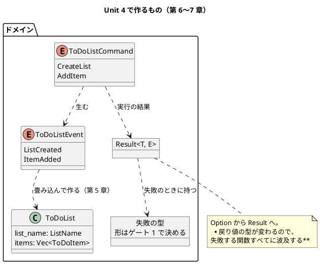
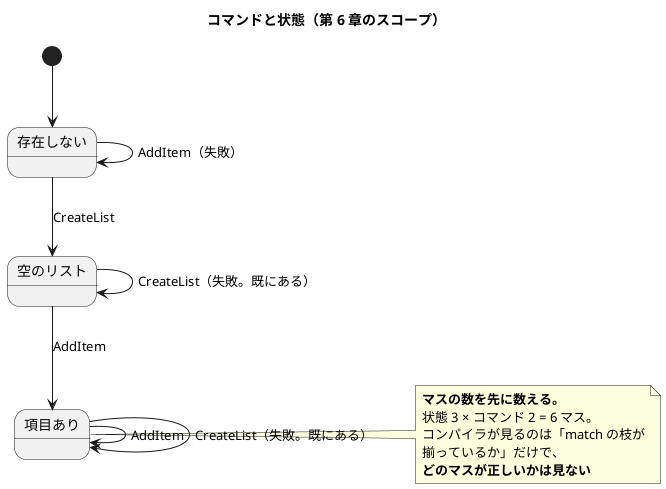

# Unit 4 の Bolt 計画（イテレーション 4）- Zettai 連載（Rust 版）

## 概要

| 項目 | 内容 |
|------|------|
| **イテレーション** | 4（Rust 版） |
| **Unit** | Unit 4 enum と Result |
| **期間** | 2 週間 |
| **Bolt 数** | 2（Bolt 4-1 第 6 章 / Bolt 4-2 第 7 章） |
| **局面** | **中盤（インサイドアウト）**。[開発戦略](development_strategy.md) |
| **人の検証負荷** | 7 ポイント（第 6 章 3 / 第 7 章 4）。**3 対象を通して最も軽い Unit** |
| **承認ゲート** | **1 箇所**（Unit 3 の 3 箇所から減らす） |

### 承認ゲートの運用形態

**本 Unit のゲートは「同期停止」で運用します。**

> **本節は人だけが書き換えます。** AI は書き換えません。運用形態を変えるなら人が本節を書き換えてから実行し、AI は切り替えを求められたら書き換えずに判断を仰ぎます。

| # | ゲート | ステップ | 添えるもの |
| :--- | :--- | :--- | :--- |
| 1 | **失敗をどう表すか**（`Result` の `E` と、既製品の採否） | 4-2.2 | 選択肢 4 つ、依存クレート数・ビルド時間の増分、**書き換えが要る箇所数**（実測）、`?` が使えるか |

**箇所を 3 から 1 に減らします。** [リリース計画](release_plan-rust.md) のエントロピー評価が Unit 4 を 5 軸すべて LOW としており、**累計 8 / 8 で停止しているので評価どおりに減らす根拠があります**（Unit 3 Try 5）。

**減らす方向に動かすのは初めてです。** これまでは「停止したから減らさない」を 2 回続けてきました。ここで減らして止まらなければ、**ゲートの密度をエントロピー評価で決める運用が正しかった**ことになります。止まれば評価が甘かったことになります。どちらでも次の Unit の材料になります。

### 目標

**1 箇所が同期停止すること**（100%）。

---

## 未解決: ADR-029 とゲート規約がぶつかっている

[ADR-029](../adr/ADR-029-cutting-a-step.md) は段階を切る判断について「**Unit の計画時に決め、ゲートに載せます**」と書いています。

一方で [リリース計画](release_plan-rust.md) のゲート規約 1 は「**選択肢と数字を添えられないものは、ゲートにしない**」です。

**本 Unit で両方を満たせません。** 段階を切るかは [ADR-029](../adr/ADR-029-cutting-a-step.md) の基準（章がコードの形を変えるとき）で答えが決まってしまい、**選択肢が立ちません**。第 7 章は失敗する関数すべての戻り値の型を変えるので、形が変わることに疑いがありません。

本計画では**規約 1 を優先し、段階を切ることは DoD の項目にします**（4-2.1 で切り、秒数を測って記録する）。あわせて **[ADR-029](../adr/ADR-029-cutting-a-step.md) の「ゲートに載せます」を「基準で決まらないときだけゲートに載せる」に追記**します（4-2.8）。

> **この扱いでよいかは、計画の承認時に判断してください。** 段階を切ることもゲートにするなら、箇所は 2 になります。

---

## Unit 3 からの持ち込み

| # | 持ち込み | 出典 | 消化する条件とステップ |
| :--- | :--- | :--- | :--- |
| 1 | **ゲートを 1 箇所に減らす** | 終了報告 1 / Try 5 | 本計画のゲート節 |
| 2 | **計算を書いたら、必ず実測と突き合わせる** | 終了報告 2 / Try 2 | **ファンクタ則の検出率を測るとき** = 4-2.6 |
| 3 | `enum` と `Result` が言語にある章で、書く設計判断が残るか | 終了報告 3 | **本 Unit の仮説そのもの。** 4-1.6・4-2.7 の完了判定 |
| 4 | 段階を切るかの判断 | 終了報告 4 | **第 7 章が戻り値の型を変えるとき** = 4-2.1 |
| 5 | `parity` 検査をさらに広げるか | 終了報告 5 | **`justfile` か workflow を触るとき。触らなければ Unit 5 へ送る** |

### Unit 3 のふりかえり Try

| # | Try | この計画での反映 |
| :--- | :--- | :--- |
| 1 | **比較の数字は、条件を書いてから測る** | 4-2.2 のゲートで、**何を clean したか・キャッシュの状態を先に書いてから 4 案を測る**。1 回の値を比較に使わない |
| 2 | **確率を計算したら、必ず実測と突き合わせる** | 4-2.6。**計算値と実測値を両方記事に書く。ずれたら計算のほうを疑う** |
| 3 | **`git stash` を使わない** | 作業ツリーの退避は WIP コミットで行う。**落とす操作を挟まない** |
| 4 | **単体の Red を立ててから実装する** | 4-1.3・4-1.4・4-2.4 の完了判定に入れる。**受け入れシナリオの Red は単体の Red の代わりにならない** |
| 5 | ゲートを 1 箇所に減らす | 本計画のゲート節 |

---

## 2 対象から踏襲すること（判断として書く）

| # | 踏襲するもの | 出典 | 選ばない場合の代替 | なぜ踏襲するか |
| :--- | :--- | :--- | :--- | :--- |
| 1 | 第 6 章でコマンド、第 7 章でエラー処理 | Kotlin 版・なでしこ3 版 | 順序を入れ替える | **章の位置を対象間で比べられることが比較コンテンツの前提** |
| 2 | 遷移表の全マスをテストする | なでしこ3 版 Unit 4 | 代表例だけ | なでしこ3 版は 16 マスを数えて**穴を 1 つ見つけた**。Rust は `match` の網羅をコンパイラが見るので、**同じ穴が出るかを確かめる価値がある** |
| 3 | 失敗の理由を型で区別する | [ADR-006](../adr/ADR-006-outcome-port-type.md)・[ADR-018](../adr/ADR-018-outcome-dict-port.md) | 文字列 1 つで表す | 2 対象とも「区別する」に落ち着いた。**ただし手段は Rust で変わる**（ゲート 1） |
| 4 | 性質テストを自作する | [ADR-017](../adr/ADR-017-own-property-testing.md)・[ADR-031 相当の判断](bolt_report-rust-3.md) | `proptest` / `quickcheck` | **Unit 3 で測って決めた。** 第 7 章のファンクタ則でも同じ仕組みを使う |

**踏襲しない可能性があるのは 3 の手段だけです。** Rust には `Result` が言語にあり、`thiserror` などの既製品もあります。

---

## ゴール

> `enum` + `match` の関数型ステートマシンと、`Result` を使ったエラーハンドリングを書く（第 6〜7 章）。**確認したい仮説**: 言語が与えるものを使う章でも、書くべき設計判断は残る。

### Unit 完了時の達成状態

- コマンドがイベントを生む形になり、**状態遷移が `enum` + `match` で表されている**
- 失敗が `Result` で表され、**理由が型で区別されている**
- ファンクタ則が性質テストで確かめられ、**検出率が測られている**（計算と実測の両方を書く）
- 第 6〜7 章が公開されている（7 / 13 章）

### 成功基準

| # | 基準 | 判定方法 | 具体例 |
| :--- | :--- | :--- | :--- |
| 1 | コマンドがイベントを生む | `just test` | `CreateList` → `ListCreated` |
| 2 | 遷移の全マスが確かめられている | `just test` | **マスの数を数えて記事に書く** |
| 3 | 失敗が型で区別される | コンパイル | 理由ごとに `match` で分岐できる |
| 4 | ファンクタ則が通り、**検出率が測られている** | `just test` | 計算値と実測値の両方 |
| 5 | 記事検査 6 本が 0 件 | `ops/scripts/article/*.py` | 第 6・7 章を含めて違反 0 |
| 6 | **ゲート 1 箇所が同期停止した** | 実績を数える | 1 / 1 |
| 7 | `just check` が 20 秒以内 | 3 回測る | devShell の内外の両方 |
| 8 | **2 対象に無い内容が各章 1 つ以上ある** | 人が読む | **言語が与える章ほど難しい。ここが本 Unit の勝負** |

---

## 節名の読み替え

**第 6 章・第 7 章に読み替えはありません。** 節名にライブラリ名・言語名・製品名が含まれないためです。

**ただし第 7 章第 4 節「Outcome を使って実装する」は注意が要ります。** `Outcome` は Kotlin 版で自作した型の名前です（[ADR-006](../adr/ADR-006-outcome-port-type.md)）。なでしこ3 版は「結果辞書」に読み替えました（[ADR-018](../adr/ADR-018-outcome-dict-port.md)）。

**Rust では `Result` が言語にあるので、読み替え先はゲート 1 の決定で決まります。** 4-2.8 で `draft.md` に登録します。**登録しないと `check_sections.py` が落ちます。**

---

## スパイクで確かめる項目

| # | 確かめること | 成立しなかったときの代替 | 対応するゲート |
| :--- | :--- | :--- | :--- |
| 1 | `thiserror` / `anyhow` の依存クレート数とビルド時間の増分 | 自前の `enum` で書く | 1 |
| 2 | 失敗の型を変えたとき、書き換えが要る箇所が何件出るか | — | 1 |
| 3 | `?` が経路をまたいで使えるか（ドメインと HTTP で `E` が違うとき） | `map_err` を挟む | 1 |
| 4 | `match` の網羅が、遷移表の穴をどこまで見るか | 表を自分で数える（なでしこ3 版と同じ） | — |

**スパイク 2 は「条件を先に書いてから測る」を適用します**（Unit 3 Try 1）。何を変えたときの件数かを決めてから数えます。

---

## 局面とアプローチ

**中盤（インサイドアウト）です。** Unit 3 と同じで、ドメインの内側から書いて外へ展開します。

第 7 章だけ形が違います。**失敗の表し方を変えると、既存のテストが先に落ちます。** なでしこ3 版 Unit 4 と同じく、**実装より先に契約を変え、落ちた箇所を波及の一覧として記録します**。

---

## Unit 4 の満足条件

### ユーザーストーリー

#### US-006: 第 6 章を公開する

> **読者**として、**`enum` と `match` が言語にある場合に、関数型ステートマシンがどう書けるか**を知りたい。**コンパイラが網羅を見てくれる範囲**を見るため。

| # | 受入条件 | 具体例 |
| :--- | :--- | :--- |
| 1 | コマンドがイベントを生む | `CreateList` → `ListCreated` |
| 2 | 状態遷移が `enum` + `match` で表されている | 遷移の追加でコンパイルが止まる |
| 3 | 遷移の全マスが確かめられている | マスの数を記事に書く |
| 4 | **2 対象に無い内容が 1 つ以上ある** | **`match` の網羅が見るものと見ないもの**の切り分け |

#### US-007: 第 7 章を公開する

> **読者**として、**`Result` が言語にある場合に、第 7 章の主題が何になるか**を知りたい。**作らない判断も判断である**ことを見るため。

| # | 受入条件 | 具体例 |
| :--- | :--- | :--- |
| 1 | 失敗が `Result` で表されている | `Option` からの置き換え |
| 2 | 理由が型で区別されている | `match` で分岐できる |
| 3 | ファンクタ則が性質テストで通る | `map` の恒等と合成 |
| 4 | **検出率に計算と実測の両方が添えてある** | Unit 3 Try 2 |
| 5 | **2 対象に無い内容が 1 つ以上ある** | **既製品を入れなかった／入れた理由**と、`?` が設計に効いたか |

### NFR 定義（Unit 4 固有）

| # | 項目 | 目標 | 測り方 |
| :--- | :--- | :--- | :--- |
| 1 | `just check`（devShell 内） | **20 秒以内** | 3 回測る。**段階を切った直後にも測る** |
| 2 | `just check`（devShell 外） | **20 秒以内** | 3 回測る |
| 3 | カバレッジ（行） | **90% 以上**（Unit 3 で見直した） | `just cov` |
| 4 | 依存クレート数 | **増やすならゲート 1 で数字を添える** | `cargo tree` |

---

## エントロピー評価

| 軸 | 水準 | 根拠 | 対処 |
| :--- | :--- | :--- | :--- |
| 意図の曖昧さ | LOW | 第 6・7 章の主題は 2 対象で確定済み | — |
| 構造的不確実性 | LOW | ハブと段階の形は Unit 3 で決まった | — |
| 検証の不確実性 | LOW | 性質テストの仕組みは Unit 3 で作った | — |
| リスク | LOW | 後戻りの効かない判断が無い。**失敗の型は変えれば済む**（件数は測る） | スパイク 2 |
| 未解決の仮定 | LOW | 「言語が与える章でも判断が残るか」は**仮説であって前提ではない**。残らなければ「残らなかった」と書く | 4-1.6・4-2.7 |

**5 軸すべて LOW です。** [リリース計画](release_plan-rust.md) の評価と一致しており、ゲートは 1 箇所です。

**ただし記事のリスクは高いままです。** 書くものが少ない章ほど、2 対象の焼き直しになりやすくなります。

---

## Bolt 4-1: コマンドと関数型ステートマシン（第 6 章）

### Bolt ゴール

> コマンドがイベントを生む形を作り、状態遷移を `enum` + `match` で表す。**確認したい仮説**: コンパイラが網羅を見る範囲は、2 対象が手で数えた範囲より狭い。

### ステップ計画

- [ ] **4-1.0 スパイク**: スパイク 4（`match` の網羅が遷移表の穴をどこまで見るか）を確かめる
  - **前提**: Unit 3 の段階 2（`zettai-step2-*`）が green であること
  - **わざと遷移を 1 つ落として**、コンパイラが止まるかを見る
- [ ] **4-1.1 コマンドを `enum` で表す（Red → Green）**
  - **前提**: 4-1.0 で網羅の範囲が分かっていること
  - **単体の Red を先に立てる**（Unit 3 Try 4）
- [ ] **4-1.2 コマンドからイベントを作る（Red → Green）**
  - **前提**: 4-1.1 が green であること
  - `CreateList` → `ListCreated`、`AddItem` → `ItemAdded`
- [ ] **4-1.3 状態と遷移を `enum` + `match` で書く（Red → Green）**
  - **前提**: 4-1.2 が green であること
  - **単体の Red を先に立てる**
- [ ] **4-1.4 遷移の全マスを数えてテストする**（踏襲 2）
  - **前提**: 4-1.3 が green であること
  - **マスの数を先に数え、テストの数と突き合わせる**。なでしこ3 版は 16 マスを数えて穴を 1 つ見つけた
  - **コンパイラが見た穴と、数えて見つけた穴を分ける**
- [ ] **4-1.5 ハブと接続する**
  - **前提**: 4-1.4 が green であること
  - コマンドを受け取る経路をハブに足す。2 経路の受け入れシナリオが引き続き green
- [ ] **4-1.6 第 6 章の骨子と執筆**
  - **前提**: 4-1.5 が green であること
  - **主張はテストで確かめてから書く**
  - 完了判定: **2 対象に無い内容が 1 つ以上ある**（無ければ未完了）
- [ ] **4-1.7 サイト反映**
  - **前提**: 4-1.6 が書けていること

---

## Bolt 4-2: Result とファンクタ（第 7 章）

### Bolt ゴール

> 失敗を `Result` で表し、理由を型で区別する。**確認したい仮説**: 言語が与えるものを使う章でも、書くべき設計判断は残る。

### ステップ計画

- [ ] **4-2.1 3 つめの段階を切る**（持ち込み 4）
  - **前提**: Bolt 4-1 が green であること
  - [ADR-029](../adr/ADR-029-cutting-a-step.md) の 7 手順に従う。**第 7 章は失敗する関数すべての戻り値の型を変える**ので、基準に当てはまる
  - `just check` を測り、上限を超えていないことを確かめる
  - `check_article_code.py` が落ちた過去章を [ADR-015](../adr/ADR-015-step-directories.md) の規則で処理する
- [ ] **4-2.2 失敗の表し方を決める**（踏襲 3。スパイク 1・2・3）
  - **前提**: 4-2.1 で新しい段階が green であること
  - **測る条件を先に書く**（Unit 3 Try 1）。何を clean するか、キャッシュの状態をどう揃えるか
  - 案 A: 自前の `enum ZettaiError` ／案 B: `thiserror` ／案 C: `anyhow` ／案 D: 文字列 1 つ
  - **★人の確認が必要（ゲート 1）**
  - 添えるもの: 依存クレート数・ビルド時間の増分・**書き換えが要る箇所数**・`?` が経路をまたいで使えるか
- [ ] **4-2.3 契約を先に変える（Red）**
  - **前提**: 4-2.2 で表し方が決まっていること
  - **実装より先にシグネチャを変え、落ちる箇所を波及の一覧として記録する**（なでしこ3 版 Unit 4 と同じ手）
  - **この一覧が「型があることの効き目」の実測値になる**
- [ ] **4-2.4 `Result` で実装する（Green）**
  - **前提**: 4-2.3 で落ちる箇所が出そろっていること
  - **単体の Red を先に立てる**（Unit 3 Try 4）
- [ ] **4-2.5 ファンクタを説明する**
  - **前提**: 4-2.4 が green であること
  - `map` が何を保つか。**`Result` の `map` は言語にあるので、書くのは説明だけ**
- [ ] **4-2.6 ファンクタ則を性質テストで確かめ、検出率を測る**（持ち込み 2。Unit 3 Try 2）
  - **前提**: 4-2.5 までが green であること
  - 恒等（`map(id) == id`）と合成（`map(f).map(g) == map(g∘f)`）
  - **見逃しのある壊し方で測る。** Unit 3 では最初の壊し方が 200 / 200 で、数えた意味が無かった
  - **計算値と実測値を両方書く。ずれたら計算のほうを疑う**
- [ ] **4-2.7 第 7 章の骨子と執筆**
  - **前提**: 4-2.6 が green であること
  - 完了判定: **2 対象に無い内容が 1 つ以上ある**
- [ ] **4-2.8 設計ドキュメント・節名の読み替え・ADR**
  - **前提**: 4-2.7 が書けていること
  - `draft.md` に第 7 章第 4 節の読み替えを登録する（**登録しないと `check_sections.py` が落ちる**）
  - `domain-model.md` の「Rust 版での差分」に失敗の型を追記
  - ADR: 失敗の表し方（ゲート 1 の決定。**入れない判断も残す**）
  - **[ADR-029](../adr/ADR-029-cutting-a-step.md) に追記**: 段階を切る判断は、基準で決まらないときだけゲートに載せる
  - **新規 ADR を作るので `okf:check` の WARN も見る**
- [ ] **4-2.9 サイト反映と OKF 適用**
  - **前提**: 4-2.8 が済んでいること
- [ ] **4-2.10 Bolt 終了報告とふりかえり**
  - **前提**: DoD がすべて埋まっていること
  - **ゲートを 1 箇所に減らして止まったかを数える。** Unit 5 のゲート密度をここで決める（計画は「中（2 箇所）」）

---

## 設計

### Unit 4 のドメインモデル（第 6〜7 章のスコープ）

### 状態遷移図

### ER 図

**本 Unit では掲載しません。** 永続化は第 9 章（Unit 5）からです。

### 画面遷移図

**本 Unit では掲載しません。** 遷移が生まれるのは第 11 章からです。

### ユーザーマニュアル

**本 Unit では作りません。** 本連載の成果物は記事であり、利用者向けマニュアルを持ちません（3 対象で共通）。

### ADR

| ADR | 内容 | ステップ |
| :--- | :--- | :--- |
| ADR-031（予定） | 失敗の表し方（ゲート 1。**既製品の採否を含む**） | 4-2.2・4-2.8 |
| ADR-029 への追記 | 段階を切る判断は、基準で決まらないときだけゲートに載せる | 4-2.8 |

---

## リスクと対策

| リスク | 影響 | 対策 | 検知 |
| :--- | :--- | :--- | :--- |
| **第 6・7 章が 2 対象の焼き直しになる** | **高** | **本 Unit で最大のリスク。** 書くものが少ないほど焼き直しになりやすい。受入条件で「2 対象に無い内容を 1 つ以上」を要求し、無ければ未完了とする | 4-1.6・4-2.7 |
| ゲートを減らして止まらない | 中 | **止まらなければ評価が甘かったということ。** Unit 5 で戻す | 4-2.10 |
| 失敗の型を変えた波及が大きすぎる | 中 | **4-2.3 で先に測る。** 件数が想定を超えたら、段階を切ってあるので前の段階に影響しない | 4-2.3 |
| ファンクタ則の検出率がまた 1 に張り付く | 中 | **見逃しのある壊し方を先に設計する**（Unit 3 の学び） | 4-2.6 |
| 節名の読み替えを登録し忘れる | 低 | `check_sections.py` が落ちる | 4-2.8 |
| 段階を切ると過去章の記事が落ちる | 低 | [ADR-029](../adr/ADR-029-cutting-a-step.md) の手順 6 | 4-2.1 |

---

## Deployment Unit としての完了条件

### Definition of Done

- [ ] コマンドがイベントを生み、状態遷移が `enum` + `match` で表されている
- [ ] **遷移の全マスが確かめられ、マスの数が記事に書かれている**
- [ ] 失敗が `Result` で表され、理由が型で区別されている
- [ ] ファンクタ則が性質テストで通り、**検出率に計算と実測の両方が添えてある**
- [ ] **3 つめの段階が切られ、[ADR-029](../adr/ADR-029-cutting-a-step.md) の 7 手順に従っている**
- [ ] `just check` が **20 秒以内**（devShell の内外の両方で 3 回測る）
- [ ] カバレッジ（行）が **90% 以上**
- [ ] CI が green（`Rust Zettai` と `parity`）
- [ ] 第 6〜7 章が公開され、**それぞれ 2 対象に無い内容が 1 つ以上ある**
- [ ] 節名の読み替えが `draft.md` に登録されている
- [ ] ADR 1 件 + ADR-029 への追記
- [ ] 記事検査 6 本が違反 0 件
- [ ] `gulp okf:check` が **ERROR 0、WARN も確認した**
- [ ] `README.md` の「既知の制約」「設計に効くもの」「clippy に押されたもの」が更新されている
- [ ] Bolt 終了報告とふりかえりがあり、**ゲートを減らして止まったかを数えた**
- [ ] ユーザーマニュアル: **対象外**

### 全 Bolt 共通のゲート項目（DoD）

| 項目 | 本 Unit での扱い |
| :--- | :--- |
| **既製品を先に調べたか** | 失敗の型（4-2.2。ゲート 1）。**入れない判断も記録する** |
| 記事のコード例が実装からの転記か | `check_article_code.py` が green |
| つまずき節があるか | 第 6・7 章に **2 対象に無い** Rust 固有の内容が 1 つ以上 |
| 既知の制約の一覧が更新されているか | `apps/rust/zettai/README.md` |
| 性質テストのしきい値に根拠があるか | 4-2.6。**計算値と実測値の両方** |
| 記事の全文検証 | **ゲートではなく DoD** |

### デモ項目

| # | デモ | 確認すること |
| :--- | :--- | :--- |
| 1 | コマンドを実行する | イベントが生まれ、状態が変わる |
| 2 | 既にあるリストを作ろうとする | 失敗し、**理由が型で分かる** |
| 3 | 遷移を 1 つ落としてコンパイルする | **コンパイラが止めるか止めないかを見る** |
| 4 | ファンクタ則を壊す | 性質テストが検出する（検出数を見る） |
| 5 | `just check` を devShell の内外で測る | どちらも 20 秒以内 |

---

## 指標（Bolt 終了報告へ引き継ぐ）

| 指標 | 計画 |
| :--- | :--- |
| ステップ | **18**（Bolt 4-1: 8 / Bolt 4-2: 10） |
| 承認ゲート | **1 箇所**（同期停止）。**3 箇所から減らす** |
| 検証負荷 | 7 |
| 変更依頼数 | ゲートで「やり直し」と判断された回数 |
| 人が修正を入れた箇所数 | 記録する |
| 公開する章 | 2（第 6〜7 章。累計 7 / 13） |
| ADR | 1 新設 + 1 追記 |
| `just check` | 20 秒以内（devShell の内外） |
| 段階 | 3 つめを切る |

---

## 更新履歴

| 日付 | 更新内容 | 更新者 |
|------|---------|--------|
| 2026-09-29 | 初版作成。Unit 3 の持ち込み 5 件と Try 5 件を反映。**ゲートを 3 箇所から 1 箇所に減らした**（5 軸すべて LOW、累計 8 / 8 で停止）。ADR-029 とゲート規約 1 がぶつかっていることを明記し、規約 1 を優先する扱いを提案した | claude-code/claude-opus-5 |

---

## 関連ドキュメント

- [リリース計画（Rust 版）](release_plan-rust.md) / [開発戦略](development_strategy.md)
- [Unit 3 の Bolt 計画](iteration_plan-rust-3.md) / [Bolt 終了報告](bolt_report-rust-3.md) / [ふりかえり](retrospective-rust-3.md)
- [執筆計画](../article/outline.md) / [章構成マインドマップ](../article/draft.md)
- [ドメインモデル設計](../design/domain-model.md) / [バックエンドアーキテクチャ設計](../design/architecture_backend.md)
- [ADR-029 段階を切る手順](../adr/ADR-029-cutting-a-step.md) / [ADR-030 関数型 DI の形](../adr/ADR-030-functional-di-shape.md) / [ADR-017 性質テストの自作](../adr/ADR-017-own-property-testing.md)
- [Kotlin 版 Unit 4 の Bolt 計画](iteration_plan-4.md) / [なでしこ3 版 Unit 4 の Bolt 計画](iteration_plan-nadesiko-4.md)
