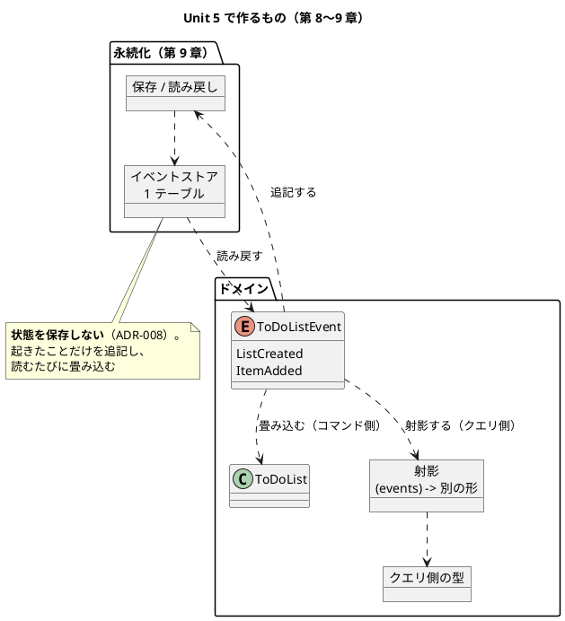
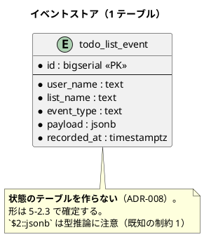

# Unit 5 の Bolt 計画（イテレーション 5）- Zettai 連載（Rust 版）

## 概要

| 項目 | 内容 |
|------|------|
| **イテレーション** | 5（Rust 版） |
| **Unit** | Unit 5 射影と永続化 |
| **期間** | 2 週間 |
| **Bolt 数** | 2（Bolt 5-1 第 8 章 / Bolt 5-2 第 9 章） |
| **局面** | **中盤（インサイドアウト）**。[開発戦略](development_strategy.md) |
| **人の検証負荷** | 13 ポイント（第 8 章 4 / 第 9 章 9） |
| **承認ゲート** | **2 箇所**（Unit 4 の 1 箇所から戻す） |
| **リリース** | **v0.2.0**（Phase 2 完了） |

### 承認ゲートの運用形態

**本 Unit のゲートは「同期停止」で運用します。**

> **本節は人だけが書き換えます。** AI は書き換えません。運用形態を変えるなら人が本節を書き換えてから実行し、AI は切り替えを求められたら書き換えずに判断を仰ぎます。

| # | ゲート | ステップ | 添えるもの |
| :--- | :--- | :--- | :--- |
| 1 | **DB を `just check` と CI に含めるか** | 5-2.2 | 選択肢 3 つ、`just check` の秒数・CI の秒数（実測）・**docker が要る場面**・落ちたときに何が分かるか |
| 2 | **段階の切り方を見直すか** | 5-2.1 | 選択肢 3 つ、4 つめを切った直後の秒数（初回・定常を分けて）・メンバー数・過去章の記事が落ちる件数 |

**箇所を 1 から 2 に戻します。** [リリース計画](release_plan-rust.md) のエントロピー評価が Unit 5 を「中（2 箇所）」としており、**Unit 4 で減らす側でも評価どおりに動いた**ので、評価を信じます（Unit 4 Try 4）。

### 目標

**2 箇所のうち 1 箇所以上が同期停止すること**（50% 以上）。

---

## Unit 4 からの持ち込み

| # | 持ち込み | 出典 | 消化する条件とステップ |
| :--- | :--- | :--- | :--- |
| 1 | **ゲートを 2 箇所に戻す** | 終了報告 1 / Try 4 | 本計画のゲート節 |
| 2 | **`just check` が段階 5 つで上限に当たる見込み** | 終了報告 2 / Try 5 | **4 つめの段階を切った直後** = 5-2.1（ゲート 2） |
| 3 | `Display` が要るかの再判断 | 終了報告 3 | **`postgres` のエラーをログに出したくなったとき** = 5-2.4。要らなければ第 12 章へ送る |
| 4 | 外部クレートのエラーを包む形 | 終了報告 4 | **`postgres` のエラーが境界を越えるとき** = 5-2.3 |
| 5 | **取り消し操作で成果を消さない** | 終了報告 5 / Try 1・2 | 常時。**実験の前に commit する** |
| 6 | `parity` 検査をさらに広げるか | 終了報告 6 | **`justfile` か workflow を触るとき** = 5-2.2（ゲート 1 が DB を足すなら両方に効く） |

### Unit 4 のふりかえり Try

| # | Try | この計画での反映 |
| :--- | :--- | :--- |
| 1 | **取り消し操作の前に `git status` が clean かを確かめる** | 常時。**`checkout` / `restore` / `stash drop` / `reset` のすべてに適用する** |
| 2 | **実験でファイルを書き換える前に commit する** | スパイクと計測の前に必ず |
| 3 | **型を通すために意味の無い値を詰めない** | 5-2.3。**詰めたくなったら引数が足りない合図** |
| 4 | ゲートを 2 箇所に戻す | 本計画のゲート節 |
| 5 | **段階を切った直後に初回と定常を分けて測る** | 5-2.1（ゲート 2） |

---

## 2 対象から踏襲すること（判断として書く）

| # | 踏襲するもの | 出典 | 選ばない場合の代替 | なぜ踏襲するか |
| :--- | :--- | :--- | :--- | :--- |
| 1 | 第 8 章で射影と CQRS、第 9 章で永続化 | Kotlin 版・なでしこ3 版 | 順序を入れ替える | **章の位置を対象間で比べられることが比較コンテンツの前提** |
| 2 | **永続化先は PostgreSQL** | [ADR-009](../adr/ADR-009-integration-test-database.md)・[ADR-024](../adr/ADR-024-no-async.md) | ファイル（なでしこ3 版） | **Unit 1 のスパイクで、同期の `postgres` クレートで書けることを実機で確かめてある**。Kotlin 版と同題材になり、比較が効く |
| 3 | イベントストアは 1 テーブル、状態を保存しない | [ADR-008](../adr/ADR-008-event-store-single-table.md) | 状態を持つテーブルも作る | 2 対象と同じ。**第 5 章の畳み込みがそのまま効く** |
| 4 | ローカルと CI で接続先の形を揃える | [ADR-009](../adr/ADR-009-integration-test-database.md) | 環境ごとに分岐する | テスト側に分岐を入れないため |
| 5 | 3 経路目（永続化を通すシナリオ）を足す | [ADR-020](../adr/ADR-020-third-route.md) | 2 経路のまま | なでしこ3 版で**経路固有の欠陥**を実際に捕まえた |
| 6 | モナドを自前で書かない | — | **踏襲を前提にしない。** `Result` に `and_then` があるので、第 7 章と同じ形で判断する（DoD の「既製品を先に調べる」） |

---

## ゴール

> 射影で CQRS に到達し、同期の `postgres` クレートで永続化する（第 8〜9 章）。**確認したい仮説**: 外部クレートのエラーが境界を越えるとき、[ADR-031](../adr/ADR-031-own-error-enum.md) の自前 `enum` が持ちこたえる。

### Unit 完了時の達成状態

- 射影ができ、**コマンド側とクエリ側が分かれている**
- イベントが PostgreSQL に保存され、**読み戻して同じ状態になる**
- モナド則が性質テストで確かめられ、**検出率が測られている**（計算と実測の両方）
- 受け入れシナリオが **3 経路**で green
- 第 8〜9 章が公開されている（9 / 13 章）
- **Release v0.2.0 が達成されている**

### 成功基準

| # | 基準 | 判定方法 | 具体例 |
| :--- | :--- | :--- | :--- |
| 1 | 射影が作れる | `just test` | イベントの並びから別の形を作る |
| 2 | コマンド側とクエリ側が分かれている | コンパイル | 型が違う |
| 3 | イベントが保存され、読み戻せる | 結合テスト | 保存 → 読み戻し → 同じ状態 |
| 4 | モナド則が通り、**検出率に計算と実測の両方がある** | `just test` | 左恒等・右恒等・結合律 |
| 5 | 受け入れシナリオが 3 経路で green | `just test` | ドメイン直接・HTTP 経由・DB 経由 |
| 6 | 記事検査 6 本が 0 件 | `ops/scripts/article/*.py` | 第 8・9 章を含めて違反 0 |
| 7 | **ゲートの 50% 以上が同期停止した** | 実績を数える | 2 箇所中 1 箇所以上 |
| 8 | `just check` が 20 秒以内 | 3 回測る | **ゲート 1・2 の決定による。超えるなら根拠を書く** |
| 9 | **2 対象に無い内容が各章 1 つ以上ある** | 人が読む | — |

---

## 節名の読み替え

| 章・節 | マインドマップ | 読み替え後 | 理由 |
| :--- | :--- | :--- | :--- |
| 第 9 章 第 3 節 | Kotlinでデータベースに接続する | **Rust でデータベースに接続する** | 言語名がそのまま入っている |

**第 9 章第 2 節「PostgreSQLと結合テスト」は読み替えません。** Rust 版も PostgreSQL を使うためです（なでしこ3 版だけがファイルに読み替えました）。

**第 8 章に読み替えはありません。**

読み替えは 5-2.6 で `draft.md` に登録します。**登録しないと `check_sections.py` が落ちます**（第 7 章で実際に落ちました）。

---

## スパイクで確かめる項目

| # | 確かめること | 成立しなかったときの代替 | 対応するゲート |
| :--- | :--- | :--- | :--- |
| 1 | 4 つめの段階を切った直後の `just check`（**初回と定常を分けて**） | 段階の切り方を見直す | 2 |
| 2 | DB を含めたときの `just check` と CI の秒数 | DB のテストを別ジョブに分ける | 1 |
| 3 | `postgres` のエラーを [ADR-031](../adr/ADR-031-own-error-enum.md) の `enum` に包めるか。`Display` が要るか | 境界で変換する | — |
| 4 | `cargo test` の並列実行で、テストごとに接続先（スキーマまたはテーブル）を分ける手段 | 直列に走らせる（`--test-threads=1`） | — |

**スパイク 4 はなでしこ3 版 Unit 7 の学びです。** 記録先を 1 つに決め打ちして、並列に走るテストが同じ場所に書き、件数が混ざりました。**Unit 1 で `unique_path` を作ってありますが、DB では別の手が要ります。**

**Unit 4 Try 2 に従い、スパイクの前に commit します。**

---

## 局面とアプローチ

**中盤（インサイドアウト）です。** 第 8 章はドメインの内側（射影）から、第 9 章は契約（ポート）から書きます。

第 9 章は Unit 4 と同じ形です。**実装より先に契約を変え、落ちた箇所を波及の一覧として記録します**（Unit 4 Keep 5）。

---

## Unit 5 の満足条件

### ユーザーストーリー

#### US-008: 第 8 章を公開する

> **読者**として、**同じイベントから別の形を作る（射影）**ことで、クエリ側をどう分離するかを知りたい。**CQRS が型でどう表れるか**を見るため。

| # | 受入条件 | 具体例 |
| :--- | :--- | :--- |
| 1 | イベントから別の形が作れる | リストの一覧、件数など |
| 2 | 射影の `map` がファンクタ則を満たす | 第 7 章と同じ形 |
| 3 | コマンド側とクエリ側が型で分かれている | 混ぜるとコンパイルが止まる |
| 4 | **2 対象に無い内容が 1 つ以上ある** | 型が CQRS の境界をどこまで守るか |

#### US-009: 第 9 章を公開する

> **読者**として、**同期のクレートで永続化を書くとどうなるか**を知りたい。**async を採らなかった判断（[ADR-024](../adr/ADR-024-no-async.md)）が第 9 章で持ちこたえるか**を見るため。

| # | 受入条件 | 具体例 |
| :--- | :--- | :--- |
| 1 | イベントが PostgreSQL に保存される | 1 テーブル、状態を保存しない |
| 2 | 読み戻して同じ状態になる | 保存 → 読み戻し → 畳み込み |
| 3 | モナド則が性質テストで通る | 左恒等・右恒等・結合律 |
| 4 | **検出率に計算と実測の両方が添えてある** | Unit 4 Keep 4 |
| 5 | 受け入れシナリオが 3 経路で green | [ADR-020](../adr/ADR-020-third-route.md) |
| 6 | **2 対象に無い内容が 1 つ以上ある** | **async を採らなかった判断が持ちこたえたか**。外部クレートのエラーの包み方 |

### NFR 定義（Unit 5 固有）

| # | 項目 | 目標 | 測り方 |
| :--- | :--- | :--- | :--- |
| 1 | `just check`（devShell 内） | **20 秒以内**。**ゲート 1・2 の決定による** | 3 回測る。**初回と定常を分ける** |
| 2 | `just check`（devShell 外） | 同上 | 同上 |
| 3 | CI の所要時間 | **10 分以内** | GitHub Actions の実測 |
| 4 | カバレッジ（行） | **90% 以上** | `just cov` |
| 5 | 依存クレート数 | `postgres` の分だけ増える。**数字を記録する** | `cargo tree` |

---

## エントロピー評価

| 軸 | 水準 | 根拠 | 対処 |
| :--- | :--- | :--- | :--- |
| 意図の曖昧さ | LOW | 第 8・9 章の主題は 2 対象で確定済み | — |
| 構造的不確実性 | MED | **DB を検査に含めるかで、検査の形が変わる** | スパイク 2 → ゲート 1 |
| 検証の不確実性 | MED | 結合テストが並列実行で混ざる恐れ | スパイク 4 |
| リスク | MED | **段階が 4 つになり、上限に当たる見込み** | スパイク 1 → ゲート 2 |
| 未解決の仮定 | MED | 外部クレートのエラーが境界を越える。**[ADR-031](../adr/ADR-031-own-error-enum.md) が持ちこたえるか未知** | スパイク 3 |

**[リリース計画](release_plan-rust.md) の評価（中・2 箇所）と一致しています。**

---

## Bolt 5-1: 射影と CQRS（第 8 章）

### Bolt ゴール

> 同じイベントから別の形を作り、コマンド側とクエリ側を分ける。**確認したい仮説**: 型が CQRS の境界を守り、2 対象が約束で守ったものを肩代わりする。

### ステップ計画

- [x] **5-1.0 スパイクと ADR の棚卸し**
  - **前提**: Unit 4 の段階 3 が green で、**作業ツリーが clean**（Try 1・2）
  - Kotlin 版の [ADR-008](../adr/ADR-008-event-store-single-table.md)〜[ADR-012](../adr/ADR-012-own-json-converter.md) の移植要否を判断する
  - **実績（2026-09-29）**: 棚卸しの結果

| Kotlin 版の ADR | 本 Unit での扱い |
| :--- | :--- |
| [008](../adr/ADR-008-event-store-single-table.md) イベントストア 1 テーブル | **踏襲する**（踏襲 3） |
| [009](../adr/ADR-009-integration-test-database.md) 結合テストの DB | **ゲート 1 で判断する**（Rust 版の CI は 17 秒で、足す代償が違う） |
| [010](../adr/ADR-010-own-template.md) テンプレート | **Unit 6（第 11 章）へ送る** |
| [011](../adr/ADR-011-transaction-boundary.md) トランザクションの境界 | **Unit 6（第 10 章）へ送る** |
| [012](../adr/ADR-012-own-json-converter.md) JSON の変換 | **本 Unit で要る**（`payload` が `jsonb`）。5-2.3 で判断する |

  - スパイク 3: `postgres::Error` は `impl From` 1 つで包める。ただし **`Display` が `"db error"` としか出さない**。`source()` を辿る関数を書いた
  - スパイク 4: **スキーマごと分ける。** テーブル名だけでは `CREATE TABLE` が競る。3 テストの並列で件数が混ざらないことを確認
- [x] **5-1.1 射影を作る（Red → Green）**
  - **前提**: 5-1.0 で移植の要否が決まっていること
  - イベントの畳み込み先をもう 1 つ作る。**単体の Red を先に立てる**（Unit 3 Try 4）
- [x] **5-1.2 射影の `map` とファンクタ則**
  - **前提**: 5-1.1 が green であること
  - 第 7 章と同じ形。**見逃しのある壊し方を先に設計してから計算する**（Unit 4 Keep 4）
  - **実績（2026-09-29）**: 検出 61 / 200（期待値 50・σ 6.12 で **1.8σ 上**）。偏りを疑い、**種を 20 通り変えて平均 50.1** を確認。生成器ではなくこの種の揺れだった
- [x] **5-1.3 コマンド側とクエリ側を分ける**
  - **前提**: 5-1.2 が green であること
  - **混ぜたらコンパイルが止まることを、わざと書いて確かめる**
  - **実績**: 止まった（E0308）。`spikes/cqrs-boundary/` に残した
- [x] **5-1.4 2 経路の受け入れシナリオが green のままであることを確かめる**
  - **前提**: 5-1.3 が済んでいること
- [x] **5-1.5 第 8 章の骨子と執筆**
  - **前提**: 5-1.4 が green であること
  - 完了判定: **2 対象に無い内容が 1 つ以上ある**
- [x] **5-1.6 サイト反映**
  - **前提**: 5-1.5 が書けていること

---

## Bolt 5-2: PostgreSQL 永続化とモナド（第 9 章）

### Bolt ゴール

> イベントを PostgreSQL に保存して読み戻す。**確認したい仮説**: async を採らなかった判断が第 9 章で持ちこたえ、外部クレートのエラーが自前の `enum` に収まる。

### ステップ計画

- [x] **5-2.1 4 つめの段階を切り、段階の切り方を見直すか決める**（持ち込み 2。スパイク 1）
  - **前提**: Bolt 5-1 が green で、**作業ツリーが clean**
  - [ADR-029](../adr/ADR-029-cutting-a-step.md) の 7 手順で切る。**初回と定常を分けて 3 回測る**（Try 5）
  - 案 A: このまま切り続ける／案 B: 古い段階を workspace から外す（コードは残す）／案 C: 段階の粒度を 4 章から 6 章に広げる
  - **★人の確認が必要（ゲート 2）**
  - 添えるもの: 3 案それぞれの秒数（初回・定常）・メンバー数・過去章の記事が落ちる件数
  - **実績（2026-09-29。ゲート 2 は同期停止した）**: 人は「**A このまま切り続ける**」を選択

| | A（採用） | B 古い段階を外す | C 粒度を 6 章に広げる |
| :--- | :--- | :--- | :--- |
| メンバー | 8 | 4 | 6 |
| 初回（外） | 32.01 秒 | 17.60 秒 | — |
| 定常（外） | **13.13〜15.50 秒** | 9.14〜13.29 秒 | 6.37〜8.50 秒 |
| 定常（内） | **5.76〜6.67 秒** | — | 5.33〜6.89 秒 |
| **過去段階が壊れたら気づくか** | **気づく** | **気づかない** | 気づく |

  - **B の代償を実測した。** `zettai-step1-domain` にわざと通らない関数を足すと、A は `error[E0308]` で止まり、**B はエラー 0 件**だった
  - **速さのために失うのが「記事とコードの一致」**で、それは本連載の成果物そのもの
  - **第 10 章（段階 5 つ）で上限に当たる見込み。** そのとき改めて判断する（Unit 6 へ送る）
- [x] **5-2.2 DB を検査に含めるかを決める**（スパイク 2。持ち込み 6）
  - **前提**: 5-2.1 で段階の形が決まっていること
  - 案 A: `just check` と CI の両方に含める（Kotlin 版と同じ。[ADR-009](../adr/ADR-009-integration-test-database.md)）／案 B: CI だけ／案 C: 別ジョブに分ける
  - **★人の確認が必要（ゲート 1）**
  - 添えるもの: それぞれの `just check` と CI の秒数（実測）・**docker が要る場面**・落ちたときに何が分かるか
  - **`justfile` と workflow の両方を触るなら `parity` 検査も直す**（持ち込み 6）
  - **実績（2026-09-29。ゲート 1 は同期停止した）**: 人は「**C 別ジョブに分ける**」を選択
  - **CI の代償は使い捨てのブランチで実測した**（Unit 2 と同じ手。ブランチは削除済み）

| 測ったもの | 結果 |
| :--- | :--- |
| CI のサービスコンテナ（同じワークフローで並走） | **DB 無し 3 秒 / DB 有り 25 秒（+22 秒）** |
| `postgres` の依存 | 7 → **67 クレート** |
| 依存の初回ビルド | **+95.47 秒**（一度きり） |
| `just check` 定常（外） | 7.48〜12.86 秒（**足す前と同じ**） |
| DB を使うテストの実行 | **0.37〜0.43 秒** |
| `docker compose up --wait` | 3.29 秒 |

  - **per-run のコストはほとんど無い。** 重いのは CI のサービスコンテナ（+22 秒）とローカルの docker 要求の 2 つ
  - **別ジョブなら並走するので総時間は +0 秒。** 書いている間は DB 無しで `just check` が回る
  - [ADR-009](../adr/ADR-009-integration-test-database.md)（Kotlin 版は `check` に含める）とは**揃えない**。Rust 版の `check` は 26 秒で、Kotlin 版の 95 秒とは事情が違う
- [ ] **5-2.3 永続化のポートの契約を決め、先に変える（Red）**（持ち込み 4。Try 3）
  - **前提**: 5-2.2 で検査の形が決まっていること
  - 保存と読み出しの関数の形、失敗の理由、1 行の形式を提示する
  - **`postgres` のエラーを [ADR-031](../adr/ADR-031-own-error-enum.md) の `enum` に包む形を決める**
  - **落ちる箇所を波及の一覧として記録する**（Unit 4 Keep 5）
  - **型を通すために意味の無い値を詰めない**（Try 3）
- [ ] **5-2.4 PostgreSQL 永続化を実装する（Green）**（持ち込み 3）
  - **前提**: 5-2.3 で落ちる箇所が出そろっていること
  - 1 テーブル、状態を保存しない（[ADR-008](../adr/ADR-008-event-store-single-table.md)）
  - **テストごとに書き込み先を分ける**（スパイク 4）
  - **`Display` が要るかをここで判断する。** 要らなければ第 12 章へ送る
- [ ] **5-2.5 モナド則を性質テストで確かめ、検出率を測る**（踏襲 6）
  - **前提**: 5-2.4 が green であること
  - **`and_then` は言語にある。** 既製品を調べる手順は「言語が与えたものを確かめる」に読み替える
  - 左恒等・右恒等・結合律。**見逃しのある壊し方を先に設計してから計算する**
- [ ] **5-2.6 設計ドキュメント・節名の読み替え・ADR**
  - **前提**: 5-2.5 が green であること
  - `draft.md` に第 9 章第 3 節の読み替えを登録する
  - `data-model.md` にテーブルの定義、`domain-model.md` の Rust 差分に永続化の型を追記
  - ADR: 永続化の形（[ADR-008](../adr/ADR-008-event-store-single-table.md) の移植可否）・DB を検査に含めるか（ゲート 1）
  - **新規 ADR を作るので `okf:check` の WARN も見る**
- [ ] **5-2.7 3 経路目を足す**（踏襲 5）
  - **前提**: 5-2.4 が green であること
  - 永続化を通すシナリオ。**片方だけ落ちたら経路固有の欠陥**
- [ ] **5-2.8 第 9 章の骨子と執筆**
  - **前提**: 5-2.7 が green であること
  - 完了判定: **2 対象に無い内容が 1 つ以上ある**。**async を採らなかった判断が持ちこたえたかを書く**
- [ ] **5-2.9 サイト反映と OKF 適用**
  - **前提**: 5-2.8 が書けていること
  - 記事検査 6 本が 0 件。`gulp okf:check` が **ERROR 0、WARN も見る**
- [ ] **5-2.10 Release v0.2.0 と Bolt 終了報告・ふりかえり**
  - **前提**: DoD がすべて埋まっていること
  - push して CI の green を確かめ、**v0.2.0 の条件を判定する**
  - **ゲートの同期停止率を数える。** Unit 6 のゲート密度をここで決める（計画は「密（3 箇所）」）

---

## 設計

### Unit 5 のドメインモデル（第 8〜9 章のスコープ）

### ER 図（第 9 章のスコープ）

### 状態遷移図

**本 Unit では掲載しません。** 第 6 章（Unit 4）で掲載済みで、この Unit で遷移は変わりません。

### 画面遷移図

**本 Unit では掲載しません。** 遷移が生まれるのは第 11 章からです。

### ユーザーマニュアル

**本 Unit では作りません。** 本連載の成果物は記事であり、利用者向けマニュアルを持ちません（3 対象で共通）。

### ADR

| ADR | 内容 | ステップ |
| :--- | :--- | :--- |
| ADR-032（予定） | 永続化の形（[ADR-008](../adr/ADR-008-event-store-single-table.md) の移植可否と、`postgres` のエラーの包み方） | 5-2.3・5-2.6 |
| ADR-033（予定） | DB を検査に含めるか（ゲート 1） | 5-2.2・5-2.6 |
| ADR-029 への追記（かも） | 段階の切り方を変えるなら（ゲート 2） | 5-2.1 |

---

## リスクと対策

| リスク | 影響 | 対策 | 検知 |
| :--- | :--- | :--- | :--- |
| **`just check` が上限を超える** | **高** | **段階 5 つで当たる見込み。** ゲート 2 で 3 案を測ってから決める。超えるなら根拠を書く | 5-2.1 |
| **DB を含めると検査が遅くなる** | 高 | ゲート 1 で実測してから決める。**Rust 版の売りは CI 17 秒**なので、失うものを数字で見る | 5-2.2 |
| 結合テストが並列実行で混ざる | 中 | **スパイク 4 で先に手を決める。** なでしこ3 版 Unit 7 で実際に混ざった | 5-2.4 |
| **async を採らなかった判断が崩れる** | **高** | **Unit 1 のスパイクで実機確認済み**（[ADR-024](../adr/ADR-024-no-async.md)）。崩れたら**崩れたことを第 9 章の主題にする** | 5-2.4 |
| 外部クレートのエラーが `enum` に収まらない | 中 | スパイク 3。収まらないなら境界で変換する | 5-2.3 |
| 第 8・9 章が 2 対象の焼き直しになる | 中 | 受入条件で「2 対象に無い内容を 1 つ以上」を要求する | 5-1.5・5-2.8 |
| 取り消し操作で成果を消す | 中 | **2 Unit 続けて起きた。** 実験の前に commit する（Try 1・2） | 常時 |

---

## Deployment Unit としての完了条件

### Definition of Done

- [ ] 射影ができ、コマンド側とクエリ側が型で分かれている
- [ ] イベントが PostgreSQL に保存され、読み戻して同じ状態になる
- [ ] モナド則が性質テストで通り、**検出率に計算と実測の両方が添えてある**
- [ ] 受け入れシナリオが **3 経路**で green
- [ ] **4 つめの段階が切られ、秒数が初回・定常を分けて記録されている**
- [ ] `just check` が **20 秒以内**（超えるなら根拠が ADR にある）
- [ ] カバレッジ（行）が **90% 以上**
- [ ] CI が green（`Rust Zettai` と `parity`）
- [ ] 第 8〜9 章が公開され、**それぞれ 2 対象に無い内容が 1 つ以上ある**
- [ ] 節名の読み替えが `draft.md` に登録されている
- [ ] ADR 2 件
- [ ] 記事検査 6 本が違反 0 件
- [ ] `gulp okf:check` が **ERROR 0、WARN も確認した**
- [ ] `README.md` の「既知の制約」「設計に効くもの」「clippy に押されたもの」が更新されている
- [ ] Bolt 終了報告とふりかえりがあり、**ゲートの同期停止率を数えた**
- [ ] **Release v0.2.0 が達成されている**
- [ ] ユーザーマニュアル: **対象外**

### Release v0.2.0 の条件

| 条件 | 判定 |
| :--- | :--- |
| 第 4〜9 章が公開されている | 記事 6 本 |
| 代数構造 3 つ（モノイド・ファンクタ・モナド）が性質テストで確かめられている | **検出率も測る** |
| 受け入れシナリオが 3 経路で green | ドメイン直接・HTTP 経由・DB 経由 |
| CI が green | — |

### 全 Bolt 共通のゲート項目（DoD）

| 項目 | 本 Unit での扱い |
| :--- | :--- |
| **既製品を先に調べたか** | モナド（`and_then` は言語にある）。**「言語が与えたものを確かめる」に読み替える** |
| 記事のコード例が実装からの転記か | `check_article_code.py` が green |
| つまずき節があるか | 第 8・9 章に **2 対象に無い** Rust 固有の内容が 1 つ以上 |
| 既知の制約の一覧が更新されているか | `apps/rust/zettai/README.md`。**`$2::jsonb` の件（制約 1）がここで初めて本番で効く** |
| 性質テストのしきい値に根拠があるか | 5-1.2・5-2.5。**計算値と実測値の両方** |
| 記事の全文検証 | **ゲートではなく DoD** |

### デモ項目

| # | デモ | 確認すること |
| :--- | :--- | :--- |
| 1 | 射影を作る | 同じイベントから別の形が出る |
| 2 | コマンド側の型をクエリ側に渡す | **コンパイルが止まる** |
| 3 | 項目を足してプロセスを再起動する | **消えていない** |
| 4 | モナド則を壊す | 性質テストが検出する（検出数を見る） |
| 5 | 受け入れシナリオを走らせる | 3 経路とも green |
| 6 | `just check` を devShell の内外で測る | ゲートの決定による上限内 |

---

## 指標（Bolt 終了報告へ引き継ぐ）

| 指標 | 計画 |
| :--- | :--- |
| ステップ | **17**（Bolt 5-1: 7 / Bolt 5-2: 10） |
| 承認ゲート | **2 箇所**（同期停止）。**目標は 1 箇所以上が実際に停止すること** |
| 検証負荷 | 13 |
| 変更依頼数 | ゲートで「やり直し」と判断された回数 |
| 人が修正を入れた箇所数 | 記録する |
| 公開する章 | 2（第 8〜9 章。累計 9 / 13） |
| ADR | 2 新設 |
| 段階 | 4 つめを切る（切り方はゲート 2） |
| リリース | **v0.2.0** |

---

## 更新履歴

| 日付 | 更新内容 | 更新者 |
|------|---------|--------|
| 2026-09-29 | 初版作成。Unit 4 の持ち込み 6 件と Try 5 件を反映。**ゲートを 1 箇所から 2 箇所に戻した**（リリース計画の評価どおり。Unit 4 で減らす側でも評価が当たったため）。Release v0.2.0 の判定を 5-2.10 に置いた | claude-code/claude-opus-5 |

---

## 関連ドキュメント

- [リリース計画（Rust 版）](release_plan-rust.md) / [開発戦略](development_strategy.md)
- [Unit 4 の Bolt 計画](iteration_plan-rust-4.md) / [Bolt 終了報告](bolt_report-rust-4.md) / [ふりかえり](retrospective-rust-4.md)
- [執筆計画](../article/outline.md) / [章構成マインドマップ](../article/draft.md)
- [ドメインモデル設計](../design/domain-model.md) / [データモデル設計](../design/data-model.md)
- [ADR-008 イベントストア](../adr/ADR-008-event-store-single-table.md) / [ADR-009 結合テストの DB](../adr/ADR-009-integration-test-database.md) / [ADR-024 async を採らない](../adr/ADR-024-no-async.md) / [ADR-029 段階を切る手順](../adr/ADR-029-cutting-a-step.md) / [ADR-031 失敗の enum](../adr/ADR-031-own-error-enum.md)
- [Kotlin 版 Unit 5 の Bolt 計画](iteration_plan-5.md) / [なでしこ3 版 Unit 5 の Bolt 計画](iteration_plan-nadesiko-5.md)
