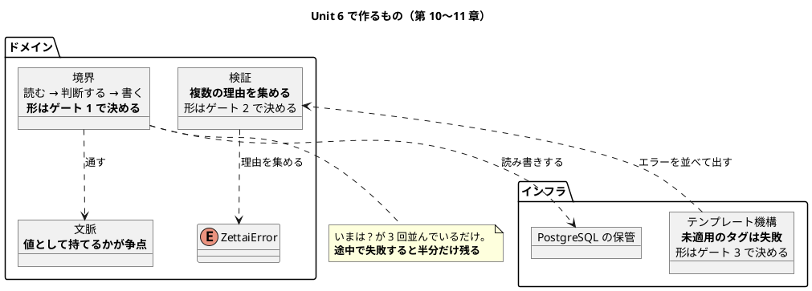
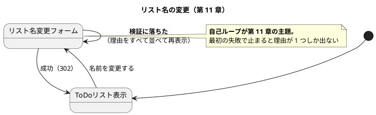

# Unit 6 の Bolt 計画（イテレーション 6）- Zettai 連載（Rust 版）

## 概要

| 項目 | 内容 |
|------|------|
| **イテレーション** | 6（Rust 版） |
| **Unit** | Unit 6 境界とバリデーション |
| **期間** | 2 週間 |
| **Bolt 数** | 2（Bolt 6-1 第 10 章 / Bolt 6-2 第 11 章） |
| **局面** | **終盤（アウトサイドイン）**。[開発戦略](development_strategy.md) |
| **人の検証負荷** | 11 ポイント（第 10 章 7 / 第 11 章 4） |
| **承認ゲート** | **3 箇所**（Unit 5 の 2 箇所から増やす） |

### 承認ゲートの運用形態

**本 Unit のゲートは「同期停止」で運用します。**

> **本節は人だけが書き換えます。** AI は書き換えません。運用形態を変えるなら人が本節を書き換えてから実行し、AI は切り替えを求められたら書き換えずに判断を仰ぎます。

| # | ゲート | ステップ | 添えるもの |
| :--- | :--- | :--- | :--- |
| 1 | **文脈とトランザクションの境界をどう表すか** | 6-1.2 | 3 案 × **ドメインのライフタイム注釈の数**・書き換え件数・`&dyn` が保てるか・**わざと途中で失敗させて 1 件も残らないか** |
| 2 | **複数のエラーをどの型で集めるか** | 6-2.3 | 3 案 × 書き換え件数・`?` が使えるか・HTTP の `match` が止まるか |
| 3 | **テンプレート機構に既製品を入れるか** | 6-2.5 | `askama` / `tera` / `minijinja` / 自前 × 依存数・ビルド時間の増分・**未適用のタグを検出できるか** |

**箇所を 2 から 3 に増やします。** [リリース計画](release_plan-rust.md) のエントロピー評価が Unit 6 を「密（3 箇所）」としており、[開発戦略](development_strategy.md) も「**ゲート密度は局面ではなく制約（所有権）の効き方で決める**」として Unit 3 と Unit 6 を密にしています。**評価は Unit 4（減らす側）でも Unit 5（戻す側）でも当たりました。**

### 目標

**3 箇所のうち 2 箇所以上が同期停止すること**（50% 以上）。

---

## 段階を切ることはゲートにしません

[ADR-029](../adr/ADR-029-cutting-a-step.md) の追記どおりです。**第 10 章はポートの契約を変える**ので、基準（章がコードの形を変えるとき）で答えが決まり、選択肢が立ちません。**DoD の項目**にします（6-1.3 で切り、秒数を初回・定常に分けて記録）。

**ただし上限に当たる見込みです。** 4 段階の時点で `just check` は devShell の外で定常 13.13〜15.50 秒。5 段階目で 20 秒を超えたら、**根拠と対処を ADR に書きます**（Unit 5 の持ち込み 2）。

---

## Unit 5 からの持ち込み

**送り先を条件で書きます**（Unit 2 Try 2）。

| # | 持ち込み | 出典 | 消化する条件とステップ |
| :--- | :--- | :--- | :--- |
| 1 | **ゲートを 3 箇所にする** | 終了報告 1 / Try 4 | 本計画のゲート節 |
| 2 | **`just check` が段階 5 つで上限に当たる** | 終了報告 2 / Try 5 | **5 つめの段階を切った直後** = 6-1.3。超えたら ADR に書く |
| 3 | トランザクションの境界 | 終了報告 3 | **第 10 章の主題そのもの** = ゲート 1 |
| 4 | テンプレート機構 | 終了報告 4 | **第 11 章で画面にエラーを出すとき** = ゲート 3 |
| 5 | **自前の JSON を続けるか** | 終了報告 5 | **第 12 章でログの JSON が要るとき。本 Unit では JSON を増やさない**ので Unit 7 へ送る |
| 6 | **依存を足すと `check` も遅くなる** | 終了報告 6 | ゲート 3（既製品を入れるなら）。**フィーチャで隠せるのはテストの実行だけ** |
| 7 | `parity` 検査はジョブの順序に依存する | 終了報告 7 | **`justfile` か workflow を触るとき。触らなければ Unit 7 へ送る** |

### Unit 5 のふりかえり Try

| # | Try | この計画での反映 |
| :--- | :--- | :--- |
| 1 | **`just check` は終了コードで判断する** | 常時。`grep` で絞った出力を見て「通った」と判断しない。**Unit 5 でこれを破って落ちたままコミットした** |
| 2 | **往復テストは相手が返した形でも書く** | 6-2.2。**`tiny_http` が実際に渡す POST のボディ**で 1 件書く。自分が組み立てた文字列だけで往復させない |
| 3 | **依存を足すときは検査が何秒遅くなるかを見積もる** | ゲート 3 |
| 4 | ゲートを 3 箇所にする | 本計画のゲート節 |
| 5 | **段階を切った直後に初回と定常を分けて測る** | 6-1.3。**Unit の末にもう一度測る**（なでしこ3 版は段階の中のファイル増を見落として再超過した） |

---

## 2 対象から踏襲すること（判断として書く）

| # | 踏襲するもの | 出典 | 選ばない場合の代替 | なぜ踏襲するか |
| :--- | :--- | :--- | :--- | :--- |
| 1 | 第 10 章で境界、第 11 章でバリデーション | Kotlin 版・なでしこ3 版 | 順序を入れ替える | **章の位置を対象間で比べられることが比較コンテンツの前提** |
| 2 | **境界は「コマンド 1 つの処理」** | [ADR-011](../adr/ADR-011-transaction-boundary.md) 決定 1 | HTTP リクエスト単位 | 3 対象で共通。**コマンドが業務上の 1 つの意図**だから |
| 3 | URL 規約 `/todo/{user}/{listname}/rename` | [UI 設計](../design/ui_design.md) | REST 風 | 3 対象で揃える |
| 4 | **`/rename` 以外への POST を受け入れシナリオに入れる** | なでしこ3 版 Unit 6 | 入れない | **なでしこ3 版は経路固有の欠陥を実際に捕まえた**（`/rename` で終わらない POST も名前変更として処理していた） |
| 5 | テンプレートを自前で書く | [ADR-010](../adr/ADR-010-own-template.md)・[ADR-022](../adr/ADR-022-template-with-unfilled-check.md) | 既製品 | **踏襲を前提にしない。** Kotlin 版の理由（既製品は例外ベースで `Outcome` に乗らない）が Rust では成り立たない。ゲート 3 で測り直す |
| 6 | **文脈を不透明な型にする** | [ADR-011](../adr/ADR-011-transaction-boundary.md) 決定 2 | 文脈に動詞を持たせる | **踏襲できない見込み。** 理由はゲート 1 の節に書く |

---

## ゴール

> 文脈とトランザクションの境界をライフタイムのもとで表し、複数のエラーを集約する型を自前で作る（第 10〜11 章）。**確認したい仮説**: 制約が設計を押す現象は、型の側の制約でも起きる。**押された先が正しい形になる。**

### Unit 完了時の達成状態

- **「読む → 判断する → 書く」が 1 つのトランザクションになっている**。途中で失敗したら 1 件も残らない
- リスト名の変更が**画面からできる**
- **複数のエラーがまとめて返る**。アプリカティブ則が性質テストで確かめられている
- HTML がテンプレート機構で組まれ、**値が無害化されている**
- 第 10〜11 章が公開されている（11 / 13 章）

### 成功基準

| # | 基準 | 判定方法 | 具体例 |
| :--- | :--- | :--- | :--- |
| 1 | **途中で失敗したら 1 件も残らない** | `just test-db` | `append` の 2 件目で落とし、`count(*) = 0` |
| 2 | ドメインが `postgres` を知らない | `Cargo.toml` | **依存 0 のまま**（[ADR-027](../adr/ADR-027-crate-boundary.md)） |
| 3 | 画面からリスト名を変えられる | `just test-db` | `/todo/uberto/book/rename` に POST |
| 4 | **`/rename` 以外への POST が名前変更にならない** | 受け入れシナリオ | 踏襲 4 |
| 5 | **複数のエラーがまとめて返る** | `just test` | **利用者名が空 かつ 新しい名前が 41 文字**で理由が 2 つ |
| 6 | アプリカティブ則が通り、**検出率に計算と実測の両方がある** | `just test` | モナドとの差も数字で示す |
| 7 | **未適用のタグが残ったら失敗になる** | `just test` | テンプレート |
| 8 | 値が無害化されている | `just test` | `<script>` が `&lt;script&gt;` になる |
| 9 | 記事検査 6 本が 0 件 | `ops/scripts/article/*.py` | 第 10・11 章を含めて違反 0 |
| 10 | **ゲートの 50% 以上が同期停止した** | 実績を数える | 3 箇所中 2 箇所以上 |
| 11 | `just check` の秒数が記録されている | 3 回測る | **超えたら根拠が ADR にある** |
| 12 | **2 対象に無い内容が各章 1 つ以上ある** | 人が読む | — |

---

## 節名の読み替え

**第 10 章・第 11 章に読み替えはありません。**

なでしこ3 版は第 10 章の第 1 節（モナドでデータベースにアクセスする）と第 5 節（データベースに対する射影のクエリ）を「保管」に読み替えました。DB を使わないためです。**Rust 版は PostgreSQL を使うので、マインドマップのままです。**

`check_sections.py` がこれを検査します。

---

## スパイクで確かめる項目

| # | 確かめること | 成立しなかったときの代替 | 対応するゲート |
| :--- | :--- | :--- | :--- |
| 1 | **3 案 + 落ちる 1 形**を、ロールバックのテストが green になるところまで書く | 書けた案だけに絞る。**どれも書けないなら「書けないこと」を章の主題にする** | 1 |
| 2 | ドメインのライフタイム注釈の数を案ごとに数える | — | 1 |
| 3 | `tiny_http` が渡す POST のボディの**実物**と、302 リダイレクトの書き方 | — | — |
| 4 | `askama` / `tera` / `minijinja` の依存数・ビルド時間・**未適用タグの扱い** | 自前で書く | 3 |

**スパイク 1 は [ADR-030](../adr/ADR-030-functional-di-shape.md) と同じ深さで書きます。** あのときは「第 4 章だけを見たら 3 案とも通り、第 5 章の畳み込みで 2 案が落ちた」ので、**今回もロールバックが green になるところまで**書いてから比べます。

**スパイクの前に commit します**（Unit 4 Try 2）。

---

## 局面とアプローチ

**終盤（アウトサイドイン）です。** Unit 5（中盤・インサイドアウト）から切り替わります。

第 10 章も第 11 章も、**受け入れシナリオを先に Red にしてから内側を作ります**。

1. 業務の言葉でシナリオを書く（Red）
2. 外側（HTTP・保管）から通す
3. ドメインの形を決める

**第 10 章だけは例外です。** 「途中で失敗したら残らない」は業務の言葉で書けますが、**書けるかどうかが設計に依存する**ので、スパイクを先に置きます。

---

## Unit 6 の満足条件

### ユーザーストーリー

#### US-010: 第 10 章を公開する

> **読者**として、**トランザクションの境界を所有権のある言語でどう表すか**を知りたい。**文脈を値として持てない言語で、境界をどう示すか**を見るため。

| # | 受入条件 | 具体例 |
| :--- | :--- | :--- |
| 1 | 「読む → 判断する → 書く」が 1 つの単位になっている | 途中で失敗したら 1 件も残らない |
| 2 | ドメインが `postgres` を知らない | `Cargo.toml` の依存が 0 |
| 3 | 3 経路が引き続き green | ドメイン直接・HTTP 経由・保管経由 |
| 4 | **2 対象に無い内容が 1 つ以上ある** | **[ADR-011](../adr/ADR-011-transaction-boundary.md) の決定 2 が移植できたか**。できないならその理由 |

#### US-011: 第 11 章を公開する

> **読者**として、**複数のエラーをまとめて返す型**と、**未適用のタグを失敗にするテンプレート**を知りたい。**言語が与えるものが多い側で、それでも自前で作るものは何か**を見るため。

| # | 受入条件 | 具体例 |
| :--- | :--- | :--- |
| 1 | 画面からリスト名を変えられる | `GET` でフォーム、`POST` で変更 |
| 2 | **複数のエラーがまとめて返る** | **利用者名が空 かつ 新しい名前が 41 文字**のとき、理由が 2 つ |
| 3 | アプリカティブ則が性質テストで通る | 4 つの性質 |
| 4 | **アプリカティブとモナドの差が数字で示されている** | モナドが理由を落とす率 |
| 5 | 未適用のタグが残ったら失敗になる | テンプレート |
| 6 | 値が無害化されている | `<script>` |
| 7 | **2 対象に無い内容が 1 つ以上ある** | 既製品の判断が 2 対象と変わったこと |

**受入条件 2 の具体例を実物で書きます。** なでしこ3 版は「空でない・40 文字以内。両方だめなら両方返す」と書きましたが、**空文字は 40 文字以内なので同時にはだめになりません**。検証の単位を置き直す手戻りが出ました。

```text
利用者名 = ""                                   → 空である
新しいリスト名 = "あ" × 41                      → 40 文字を超える
→ 理由が 2 つ返る
```

### NFR 定義（Unit 6 固有）

| # | 項目 | 目標 | 測り方 |
| :--- | :--- | :--- | :--- |
| 1 | `just check`（devShell 内） | **20 秒以内** | **終了コードで判断する**（Try 1）。3 回測る |
| 2 | `just check`（devShell 外） | **20 秒以内。超えたら根拠を ADR に書く** | 同上。**初回と定常を分ける。Unit の頭と末の 2 回測る** |
| 3 | カバレッジ（行） | **90% 以上** | `just cov` |
| 4 | 依存クレート数 | **増やすならゲート 3 で数字を添える** | `cargo tree` |
| 5 | CI | 10 分以内 | GitHub Actions |

---

## エントロピー評価

| 軸 | 水準 | 根拠 | 対処 |
| :--- | :--- | :--- | :--- |
| 意図の曖昧さ | MED | 第 10 章の「文脈」が Rust で何になるかが未確定 | スパイク 1 → ゲート 1 |
| 構造的不確実性 | **HIGH** | **ポートの契約が変わる。残り 3 章の署名を縛る** | スパイク 1・2 → ゲート 1 |
| 検証の不確実性 | LOW | 性質テストの仕組みは Unit 3〜5 で確立済み | — |
| リスク | MED | **ライフタイムが境界を書けなくする**（リスク台帳） | スパイク 1。書けないなら章の主題にする |
| 未解決の仮定 | MED | 「押された先が正しい」が 5 件目まで積めるか | 6-1.7・6-2.8 で記録 |

**[リリース計画](release_plan-rust.md) の評価（意図 MED / 構造 HIGH / 検証 LOW / リスク MED / 仮定 MED、密 3 箇所）と一致しています。**

---

## Bolt 6-1: トランザクションの境界（第 10 章）

### Bolt ゴール

> 「読む → 判断する → 書く」を 1 つのトランザクションにする。**確認したい仮説**: 文脈を値として持てないが、区間として貸せる。押された先が正しい形になる。

### ステップ計画

- [ ] **6-1.0 スパイク**: `spikes/tx-shapes/` に **3 案 + 落ちる 1 形**を書く
  - **前提**: Unit 5 の段階 4 が green で、**作業ツリーが clean**（Try 1・2）
  - **ロールバックのテストが green になるところまで**書く（[ADR-030](../adr/ADR-030-functional-di-shape.md) と同じ深さ）
  - 落ちた案は**エラーコードごと記録する**
- [ ] **6-1.1 受け入れシナリオを Red にする**
  - **前提**: 6-1.0 で書ける形が分かっていること
  - 「途中で失敗したら 1 件も残らない」を業務の言葉で書く
- [ ] **6-1.2 文脈とトランザクションの境界を決める**（持ち込み 3。スパイク 1・2）
  - **前提**: 6-1.0 の 3 案が同じ深さまで書けていること
  - 案 A スコープ貸し／案 B 引数で回す／案 C 遅延 `HubAction`
  - **★人の確認が必要（ゲート 1）**
  - 添えるもの: **ドメインのライフタイム注釈の数**・書き換え件数・`&dyn` が保てるか・**ロールバックのテストが green か**
  - **この決定が残り 3 章のポートの署名を縛る**
- [ ] **6-1.3 5 つめの段階を切る**（持ち込み 2。Try 5）
  - **前提**: 6-1.2 で形が決まっていること（形が変わると切る単位も変わる）
  - [ADR-029](../adr/ADR-029-cutting-a-step.md) の 7 手順。**初回と定常を分けて 3 回測る**
  - **20 秒を超えたら根拠と対処を ADR に書く**
- [ ] **6-1.4 境界を実装する（Green）**
  - **前提**: 6-1.3 で `zettai-step5-*` が green であること
  - **単体の Red を先に立てる**（Unit 3 Try 4）
  - **型を通すために意味の無い値を詰めない**（Unit 4 Try 3）
- [ ] **6-1.5 「1 件も残らない」を確かめる**
  - **前提**: 6-1.4 が green であること
  - `append` の 2 件目で落とす注入を入れ、`count(*) = 0` を確かめる
  - **これが red なら、その案は成立していない**
- [ ] **6-1.6 射影のクエリを保管から引く**
  - **前提**: 6-1.5 が green であること
  - 第 8 章の射影を、保管を通して引く経路にする
- [ ] **6-1.7 第 10 章の骨子と執筆**
  - **前提**: 6-1.6 が green であること
  - **主張はテストで確かめてから書く**
  - 押された箇所を `README.md` の「設計に効くもの」に足す
  - 完了判定: **2 対象に無い内容が 1 つ以上ある**
- [ ] **6-1.8 ADR とサイト反映**
  - **前提**: 6-1.7 が書けていること
  - **ADR-034**（トランザクションの境界。[ADR-011](../adr/ADR-011-transaction-boundary.md) の Rust 版）。**決定 2 が移植できたかを書く**
  - [ADR-032](../adr/ADR-032-postgres-event-store.md) の「解かないこと: トランザクションの境界」を閉じる
  - 案 A を採るなら [ADR-030](../adr/ADR-030-functional-di-shape.md) に `&dyn Fn` の追補
  - **`architecture_backend.md` に「Rust 版での差分」節を新設**（Unit 2 でやり残していた。ポートの型が変わるいまが場所）
  - **新規 ADR を作るので `okf:check` の WARN も見る**

---

## Bolt 6-2: バリデーションとテンプレート（第 11 章）

### Bolt ゴール

> 複数のエラーをまとめて返し、画面に出す。**確認したい仮説**: 言語が与えるものが多い側でも、自前で作るものは残る。

### ステップ計画

- [ ] **6-2.1 受け入れシナリオを Red にする**
  - **前提**: Bolt 6-1 が green であること
  - 「名前を変えられる」「**`/rename` 以外への POST は名前変更にならない**」（踏襲 4）
- [ ] **6-2.2 フォームと 302 をスパイクで確かめる**（Try 2。スパイク 3）
  - **前提**: 6-2.1 が Red であること
  - **`tiny_http` が渡す POST のボディの実物**で往復を書く。自分が組み立てた文字列だけで確かめない
  - 302 リダイレクトの書き方。**`curl -L` は 302 のあとに POST を再送する**（なでしこ3 版で踏んだ）
- [ ] **6-2.3 複数のエラーをどの型で集めるかを決める**
  - **前提**: 6-2.2 でフォームの値が取れること
  - 案 A `ZettaiError` に `Multiple(Vec<..>)` を足す／案 B 別の型 `Validated<T>` を作る／案 C `Result<T, Vec<ZettaiError>>`
  - **★人の確認が必要（ゲート 2）**
  - 添えるもの: 書き換え件数・`?` が使えるか・**HTTP の `match` が止まるか**
- [ ] **6-2.4 検証を実装し、アプリカティブ則を確かめる（Red → Green）**
  - **前提**: 6-2.3 で型が決まっていること
  - **単体の Red を先に立てる**
  - **見逃しのある壊し方を先に設計してから計算する**（Unit 4 Keep 4）
  - **アプリカティブとモナドの差を数字で示す**（なでしこ3 版は 115 / 200 と 69 / 69 まで出した）
- [ ] **6-2.5 テンプレート機構に既製品を入れるかを決める**（持ち込み 4・6。スパイク 4）
  - **前提**: 6-2.4 が green で、画面に出すエラーが揃っていること
  - `askama` / `tera` / `minijinja` / 自前
  - **★人の確認が必要（ゲート 3）**
  - 添えるもの: 依存数・**ビルド時間の増分（`check` も遅くなる。持ち込み 6）**・**未適用のタグを検出できるか**
  - **[ADR-010](../adr/ADR-010-own-template.md) の理由はそのまま使えない。** `askama` はコンパイル時に型で防ぐ
- [ ] **6-2.6 テンプレート機構を実装する**
  - **前提**: 6-2.5 で決まっていること
  - **未適用のタグが残ったら失敗**（[ADR-022](../adr/ADR-022-template-with-unfilled-check.md) の踏襲）
  - **値を無害化する。** いまの `render` はエスケープしていない
- [ ] **6-2.7 画面を組む**
  - **前提**: 6-2.6 が green であること
  - フォームと、**エラーをすべて並べた再表示**
- [ ] **6-2.8 第 11 章の骨子と執筆**
  - **前提**: 6-2.7 が green であること
  - 完了判定: **2 対象に無い内容が 1 つ以上ある**
- [ ] **6-2.9 設計ドキュメントと ADR**
  - **前提**: 6-2.8 が書けていること
  - **ADR-035**（複数のエラーを集める型）・**ADR-036**（テンプレート機構）
  - **`ui_design.md` に Rust の記述を新設**（フォーム・テンプレート・エスケープ）
  - `domain-model.md` の Rust 差分に検証の型を追記
- [ ] **6-2.10 サイト反映と OKF 適用**
  - **前提**: 6-2.9 が済んでいること
  - 記事検査 6 本が 0 件。`gulp okf:check` が **ERROR 0、WARN も見る**
  - **`just check` を Unit の末にもう一度測る**（Try 5。なでしこ3 版は再超過した）
- [ ] **6-2.11 Bolt 終了報告とふりかえり**
  - **前提**: DoD がすべて埋まっていること
  - **ゲートの同期停止率を数える。** Unit 7 のゲート密度をここで決める（計画は「疎（1 箇所）」）

---

## 設計

### Unit 6 のドメインモデル（第 10〜11 章のスコープ）



### 画面遷移図（第 11 章のスコープ）



### ER 図

**本 Unit では掲載しません。** テーブルは第 9 章（Unit 5）で確定し、この Unit で変わりません。[データモデル設計](../design/data-model.md) にあります。

### 状態遷移図

**本 Unit では掲載しません。** 第 6 章（Unit 4）で掲載済みで、遷移は変わりません。

### ユーザーマニュアル

**本 Unit では作りません。** 本連載の成果物は記事であり、利用者向けマニュアルを持ちません（3 対象で共通）。

### ADR

| ADR | 内容 | ステップ |
| :--- | :--- | :--- |
| ADR-034（予定） | トランザクションの境界（[ADR-011](../adr/ADR-011-transaction-boundary.md) の Rust 版） | 6-1.2・6-1.8 |
| ADR-035（予定） | 複数のエラーを集める型 | 6-2.3・6-2.9 |
| ADR-036（予定） | テンプレート機構（[ADR-010](../adr/ADR-010-own-template.md) の Rust 版） | 6-2.5・6-2.9 |
| ADR-030 への追補 | 案 A を採るなら `&dyn Fn` を足すか | 6-1.8 |
| ADR-032 への追記 | 「解かないこと: トランザクションの境界」を閉じる | 6-1.8 |
| ADR-029 への追記（かも） | `just check` が上限を超えたら | 6-1.3 |

---

## リスクと対策

| リスク | 影響 | 対策 | 検知 |
| :--- | :--- | :--- | :--- |
| **ライフタイムが境界を書けなくする** | **高** | スパイク 1 で 3 案を**ロールバックが green になるまで**書く。**どれも書けないなら「書けないこと」を章の主題にする**（リスク台帳） | 6-1.0 |
| **[ADR-011](../adr/ADR-011-transaction-boundary.md) の決定 2 が移植できない** | 中 | **移植できない見込み。** `dyn Any` が `'static` を要求する。**代わりに何が得られたか**を書く | 6-1.2 |
| **`just check` が上限を超える** | 中 | 段階 5 つで当たる見込み。**超えたら根拠と対処を ADR に書く**。devShell の内は余裕がある | 6-1.3 |
| **受入条件の具体例が実物と合わない** | 中 | **なでしこ3 版が踏んだ。** 「両方だめな入力」を計画に実物で書いた（上記） | 6-2.4 |
| `/rename` 以外への POST が名前変更になる | 中 | **なでしこ3 版で実際に起きた。** 受け入れシナリオに入れる（踏襲 4） | 6-2.1 |
| 既製品を入れて `check` が遅くなる | 中 | ゲート 3 で**ビルド時間の増分**を測る。**フィーチャで隠せるのはテストの実行だけ**（持ち込み 6） | 6-2.5 |
| 第 10・11 章が 2 対象の焼き直しになる | 中 | 受入条件で「2 対象に無い内容を 1 つ以上」を要求する | 6-1.7・6-2.8 |
| 落ちている検査を通ったことにする | 中 | **Unit 5 で実際にやった。** `just check` は**終了コードで**判断する（Try 1） | 常時 |

---

## Deployment Unit としての完了条件

### Definition of Done

- [ ] 「読む → 判断する → 書く」が 1 つの単位になり、**途中で失敗したら 1 件も残らない**
- [ ] ドメインのクレートが **`postgres` を知らない**（依存 0）
- [ ] 画面からリスト名を変えられる。**`/rename` 以外への POST は名前変更にならない**
- [ ] **複数のエラーがまとめて返る**（利用者名が空 かつ 新しい名前が 41 文字 → 理由 2 つ）
- [ ] アプリカティブ則が通り、**検出率に計算と実測の両方がある**。**モナドとの差も数字で示した**
- [ ] **未適用のタグが残ったら失敗**になる。**値が無害化されている**
- [ ] **5 つめの段階が切られ、秒数が初回・定常を分けて記録されている**。**Unit の末にもう一度測った**
- [ ] `just check` が **20 秒以内**（超えるなら根拠が ADR にある）。**終了コードで判断した**
- [ ] カバレッジ（行）が **90% 以上**
- [ ] CI が green（`Rust Zettai` の 3 ジョブ）
- [ ] 第 10〜11 章が公開され、**それぞれ 2 対象に無い内容が 1 つ以上ある**
- [ ] ADR 3 件 + 追補・追記
- [ ] **`architecture_backend.md` と `ui_design.md` に Rust の節がある**（Unit 2 でやり残していた）
- [ ] 記事検査 6 本が違反 0 件
- [ ] `gulp okf:check` が **ERROR 0、WARN も確認した**
- [ ] `README.md` の「既知の制約」「設計に効くもの」「clippy に押されたもの」が更新されている
- [ ] 受け入れシナリオが **3 経路**で green
- [ ] Bolt 終了報告とふりかえりがあり、**ゲートの同期停止率を数えた**
- [ ] ユーザーマニュアル: **対象外**

### 全 Bolt 共通のゲート項目（DoD）

| 項目 | 本 Unit での扱い |
| :--- | :--- |
| **既製品を先に調べたか** | テンプレート機構（6-2.5。ゲート 3）。**入れない判断も記録する** |
| 記事のコード例が実装からの転記か | `check_article_code.py` が green |
| つまずき節があるか | 第 10・11 章に **2 対象に無い** Rust 固有の内容が 1 つ以上 |
| 既知の制約の一覧が更新されているか | `apps/rust/zettai/README.md` |
| 性質テストのしきい値に根拠があるか | 6-2.4。**計算値と実測値の両方** |
| 記事の全文検証 | **ゲートではなく DoD** |

### デモ項目

| # | デモ | 確認すること |
| :--- | :--- | :--- |
| 1 | 項目を足す途中で失敗させる | **1 件も残らない** |
| 2 | 画面からリスト名を変える | 変わる |
| 3 | 利用者名を空、新しい名前を 41 文字にして送る | **理由が 2 つ並ぶ** |
| 4 | テンプレートに渡す値を 1 つ抜く | **失敗になる**（`{{...}}` が画面に出ない） |
| 5 | リスト名に `<script>` を入れる | エスケープされる |
| 6 | `just check` を devShell の内外で測る | 記録された値の範囲内 |

---

## 指標（Bolt 終了報告へ引き継ぐ）

| 指標 | 計画 |
| :--- | :--- |
| ステップ | **20**（Bolt 6-1: 9 / Bolt 6-2: 11） |
| 承認ゲート | **3 箇所**（同期停止）。**目標は 2 箇所以上が実際に停止すること** |
| 検証負荷 | 11 |
| 変更依頼数 | ゲートで「やり直し」と判断された回数 |
| 人が修正を入れた箇所数 | 記録する |
| 公開する章 | 2（第 10〜11 章。累計 11 / 13） |
| ADR | 3 新設 + 追補・追記 |
| 段階 | 5 つめを切る |
| `just check` | **20 秒以内。超えたら根拠を ADR に書く** |

---

## 更新履歴

| 日付 | 更新内容 | 更新者 |
|------|---------|--------|
| 2026-09-29 | 初版作成。Unit 5 の持ち込み 7 件と Try 5 件を反映。**ゲートを 2 箇所から 3 箇所に増やした**（エントロピー評価が密。減らす側・戻す側とも評価が当たったため）。段階を切ることは [ADR-029](../adr/ADR-029-cutting-a-step.md) の追記どおり DoD に置いた。**なでしこ3 版が踏んだ「受入条件の具体例が実物と合わない」を、計画の時点で実物を書いて防いだ** | claude-code/claude-opus-5 |

---

## 関連ドキュメント

- [リリース計画（Rust 版）](release_plan-rust.md) / [開発戦略](development_strategy.md)
- [Unit 5 の Bolt 計画](iteration_plan-rust-5.md) / [Bolt 終了報告](bolt_report-rust-5.md) / [ふりかえり](retrospective-rust-5.md)
- [執筆計画](../article/outline.md) / [章構成マインドマップ](../article/draft.md)
- [ドメインモデル設計](../design/domain-model.md) / [バックエンドアーキテクチャ設計](../design/architecture_backend.md) / [UI 設計](../design/ui_design.md)
- [ADR-010 テンプレート機構](../adr/ADR-010-own-template.md) / [ADR-011 トランザクションの境界](../adr/ADR-011-transaction-boundary.md) / [ADR-022 テンプレートの埋めそこね](../adr/ADR-022-template-with-unfilled-check.md) / [ADR-027 クレート境界](../adr/ADR-027-crate-boundary.md) / [ADR-029 段階を切る手順](../adr/ADR-029-cutting-a-step.md) / [ADR-030 関数型 DI の形](../adr/ADR-030-functional-di-shape.md) / [ADR-032 イベントストア](../adr/ADR-032-postgres-event-store.md)
- [Kotlin 版 Unit 6 の Bolt 計画](iteration_plan-6.md) / [なでしこ3 版 Unit 6 の Bolt 計画](iteration_plan-nadesiko-6.md)
