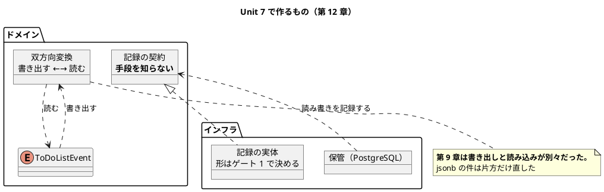

# Unit 7 の Bolt 計画（イテレーション 7）- Zettai 連載（Rust 版）

## 概要

| 項目 | 内容 |
|------|------|
| **イテレーション** | 7（Rust 版。**最終**） |
| **Unit** | Unit 7 監視と 3 言語の総括 |
| **期間** | 2 週間 |
| **Bolt 数** | 2（Bolt 7-1 第 12 章 / Bolt 7-2 第 13 章） |
| **局面** | **終盤（アウトサイドイン）**。[開発戦略](development_strategy.md) |
| **人の検証負荷** | 6 ポイント（第 12 章 4 / 第 13 章 2）。**3 対象を通して最も軽い Unit** |
| **承認ゲート** | **1 箇所**（Unit 6 の 3 箇所から減らす） |
| **リリース** | **v1.0.0（連載の完結）** |

### 承認ゲートの運用形態

**本 Unit のゲートは「同期停止」で運用します。**

> **本節は人だけが書き換えます。** AI は書き換えません。運用形態を変えるなら人が本節を書き換えてから実行し、AI は切り替えを求められたら書き換えずに判断を仰ぎます。

| # | ゲート | ステップ | 添えるもの |
| :--- | :--- | :--- | :--- |
| 1 | **第 12 章で既製品を入れるか**（`serde_json` と `tracing`） | 7-1.3 | それぞれ 依存数・ビルド時間の増分・**`just check` の秒数**・**要求を既定で満たすか** |

**箇所を 3 から 1 に減らします。** [リリース計画](release_plan-rust.md) のエントロピー評価が Unit 7 を 5 軸すべて LOW（疎）としており、**評価は Unit 4（減らす側）・Unit 5（戻す側）・Unit 6（増やす側）の 3 回続けて当たっています**（Unit 6 Try 5）。

### 目標

**1 箇所が同期停止すること**（100%）。

### このゲートが重い理由

**第 11 章で `tera` を入れました。** 3 対象を通して初めて既製品に寄せた判断です。

第 12 章の JSON は、**第 9 章で自前にした判断の続き**です（[ADR-032](../adr/ADR-032-postgres-event-store.md) の「解かないこと」）。あのとき「1 件の代償では判断が決まらない。第 12 章で測り直す」と書きました。**自前のパーサが 3 か所に増えていたら判断を変える**とも書いています。

**`tera` の前例があるので、基準が変わったかを確かめる必要があります。**

---

## Unit 6 からの持ち込み

| # | 持ち込み | 出典 | 消化する条件とステップ |
| :--- | :--- | :--- | :--- |
| 1 | **ゲートを 1 箇所に減らす** | 終了報告 1 / Try 5 | 本計画のゲート節 |
| 2 | **`just check` の余裕が 4 秒を切った** | 終了報告 2 | **段階 6 つめを切るなら切る前に見積もる。** 7-1.2 で判断する |
| 3 | **自前の JSON を続けるか** | 終了報告 3 | ゲート 1 |
| 4 | **第 13 章で「同じ要求に 3 通りの答え」を並べる** | 終了報告 4 | 7-2.2 |
| 5 | **扱わなかったことを明示する** | 終了報告 5 | 7-2.5。Kotlin 版は 5 件挙げた |
| 6 | **`parity` 検査をジョブの setup まで広げる** | 終了報告 6 / Try 1 | **7-1.1。Unit 5 から送り続けている。ここで消化する** |

### Unit 6 のふりかえり Try

| # | Try | この計画での反映 |
| :--- | :--- | :--- |
| 1 | **`parity` 検査をジョブの setup まで広げる** | 7-1.1。**Unit 6 で実際に CI が落ちた**（道具の入れ忘れ） |
| 2 | **具体例は「どの経路で作れるか」まで書く** | 受入条件の例に**経路名を添える**（下記） |
| 3 | **既製品を入れたら「効いているか」のテストを先に書く** | ゲート 1 で入れると決めたら、**入れた理由をそのまま確かめるテスト**を先に書く |
| 4 | **秒数は 5 回測る** | 7-1.2・7-2.6。**Unit 3 と Unit 6 の 2 回とも 3 回目までが高かった** |
| 5 | ゲートを 1 箇所に減らす | 本計画のゲート節 |

---

## 2 対象から踏襲すること（判断として書く）

| # | 踏襲するもの | 出典 | 選ばない場合の代替 | なぜ踏襲するか |
| :--- | :--- | :--- | :--- | :--- |
| 1 | 第 12 章で監視、第 13 章で総括 | Kotlin 版・なでしこ3 版 | 順序を入れ替える | **章の位置を対象間で比べられることが比較コンテンツの前提** |
| 2 | **ドメインは記録の手段を知らない** | [ADR-021](../adr/ADR-021-context-as-path.md) | ドメインから直接ログを出す | 3 対象で共通。**Rust ではクレート境界が守る**（[ADR-027](../adr/ADR-027-crate-boundary.md)） |
| 3 | **双方向変換（プロファンクタ）を書く** | [ADR-012](../adr/ADR-012-own-json-converter.md)・[ADR-023](../adr/ADR-023-builtin-json-with-converter.md) | 書き出しと読み込みを別々のまま | **第 9 章の自前 JSON は、書き出しと読み込みが別々**。第 11 章の `jsonb` の件は**片方だけ直した**結果 |
| 4 | **`comparison/index.md` を全 13 章・3 列で埋める** | なでしこ3 版 Unit 7 | Phase 単位のまま | **3 点目が入って初めて「言語がどこまで与えるか」の比較になる** |
| 5 | **扱わなかったことを明示する** | Kotlin 版第 13 章（5 件） | 書かない | **連載の範囲を誠実に示す** |
| 6 | JSON を自前で書き続ける | [ADR-032](../adr/ADR-032-postgres-event-store.md) | `serde_json` を入れる | **踏襲を前提にしない。** ゲート 1 で測り直す |

---

## ゴール

> 構造化ログと双方向変換を書き、第 13 章で 3 言語を対比する（第 12〜13 章）。**確認したい仮説**: 「言語が与えるほど設計は楽になるのか」に、3 点で答えが出せる。

### Unit 完了時の達成状態

- 構造化ログが出て、**ドメインは記録の手段を知らない**
- 書き出しと読み込みが**1 つの双方向変換**になっている
- プロファンクタ則が性質テストで確かめられ、**検出率が測られている**
- 第 12〜13 章が公開されている（**13 / 13 章**）
- **`comparison/index.md` が 3 列で全 13 章を覆っている**
- **Release v1.0.0 が達成されている**

### 成功基準

| # | 基準 | 判定方法 | 具体例 |
| :--- | :--- | :--- | :--- |
| 1 | 構造化ログが出る | `just test` | 保管の読み書きが記録される |
| 2 | ドメインが記録の手段を知らない | `Cargo.toml` | **依存 0 のまま** |
| 3 | 往復で同じ値に戻る | 性質テスト | 書き出す → 読む → 同じ |
| 4 | プロファンクタ則が通り、**検出率に計算と実測の両方がある** | `just test` | — |
| 5 | **`parity` 検査がジョブの setup も見る** | わざと道具を外して落とす | 持ち込み 6 |
| 6 | 記事検査 6 本が 0 件 | `ops/scripts/article/*.py` | 全 13 章 |
| 7 | **ゲート 1 箇所が同期停止した** | 実績を数える | 1 / 1 |
| 8 | `just check` が 20 秒以内 | **5 回測る** | Try 4 |
| 9 | **`comparison/index.md` が 3 列・全 13 章** | 人が読む | 踏襲 4 |
| 10 | **Release v1.0.0** | CI の 3 ワークフローが green | — |

---

## 節名の読み替え

**第 12 章・第 13 章に読み替えはありません。**

なでしこ3 版は第 12 章第 5 節（データベース呼び出しのロギング）を「保管の読み書きのロギング」に読み替えました。DB を使わないためです。**Rust 版は PostgreSQL を使うので、マインドマップのままです。**

---

## スパイクで確かめる項目

| # | 確かめること | 成立しなかったときの代替 | 対応するゲート |
| :--- | :--- | :--- | :--- |
| 1 | `serde_json` / `serde`(derive) / `tracing` の依存数・ビルド時間・**`just check` の増分** | 自前で書く | 1 |
| 2 | **自前のパーサが何か所に増えたか**を数える | — | 1 |
| 3 | `tracing` が要求（構造化された記録・出力先の差し替え）を既定で満たすか | 自前で書く | 1 |
| 4 | **`parity` 検査をジョブの setup まで広げられるか**（YAML の構造を読む） | 検査を広げず、DoD の項目にする | — |

**スパイク 2 は判断の条件そのものです。** [ADR-032](../adr/ADR-032-postgres-event-store.md) にこう書きました。

> 自前のパーサが 3 か所に増えていたら判断を変えます。

**数えてから測ります。**

---

## 局面とアプローチ

**終盤（アウトサイドイン）です。** 第 12 章は「何を記録したいか」を業務の言葉で先に書き、内側へ降ります。

**第 13 章はコードをほとんど書きません。** 12 章で積み上げたものを整理し、3 言語を並べます。

---

## Unit 7 の満足条件

### ユーザーストーリー

#### US-012: 第 12 章を公開する

> **読者**として、**記録と変換を関数型でどう扱うか**を知りたい。**第 9 章で自前にした JSON の判断が、3 章あとに耐えたか**を見るため。

| # | 受入条件 | 具体例（**作れる経路**） |
| :--- | :--- | :--- |
| 1 | 保管の読み書きが記録される | **保管経由の経路**でイベントを追記すると記録が出る |
| 2 | ドメインが記録の手段を知らない | `Cargo.toml` の依存が 0 |
| 3 | 書き出しと読み込みが 1 つになっている | **ドメイン直接の経路**で往復させて同じ値 |
| 4 | プロファンクタ則が通る | 同上 |
| 5 | **2 対象に無い内容が 1 つ以上ある** | **既製品の判断が第 11 章で変わったこと**への答え |

**受入条件に経路名を添えました**（Unit 6 Try 2）。第 11 章で「利用者名が空」が HTTP 経路では作れず手戻りしました。

#### US-013: 第 13 章を公開する

> **読者**として、**3 言語を並べたときに何が見えるか**を知りたい。**「言語が与えるほど設計は楽になるのか」**に答えを出すため。

| # | 受入条件 | 具体例 |
| :--- | :--- | :--- |
| 1 | 3 言語を対比している | Kotlin・なでしこ3・Rust |
| 2 | **同じ要求に 3 通りの答えが出た例**が並んでいる | 文脈・テンプレート・受け入れテストの入口 |
| 3 | 代数構造の一覧がある | モノイド・ファンクタ・モナド・アプリカティブ・プロファンクタ |
| 4 | **扱わなかったことが明示されている** | Kotlin 版は 5 件 |
| 5 | **承認ゲートの実践結果が書かれている** | 3 対象で 56 箇所中 16 回（見込み） |
| 6 | `comparison/index.md` が **3 列で全 13 章**を覆う | 踏襲 4 |

### NFR 定義（Unit 7 固有）

| # | 項目 | 目標 | 測り方 |
| :--- | :--- | :--- | :--- |
| 1 | `just check`（devShell 内） | **20 秒以内** | **5 回測る**（Try 4）。終了コードで判断する |
| 2 | `just check`（devShell 外） | **20 秒以内。余裕が 4 秒を切っている** | 同上。**既製品を入れるなら増分を見積もってから** |
| 3 | カバレッジ（行） | **90% 以上** | `just cov`（DB のジョブ） |
| 4 | CI | 10 分以内 | 3 ジョブ並走 |
| 5 | 依存クレート数 | **増やすならゲート 1 で数字を添える** | `cargo tree` |

---

## エントロピー評価

| 軸 | 水準 | 根拠 | 対処 |
| :--- | :--- | :--- | :--- |
| 意図の曖昧さ | LOW | 第 12・13 章の主題は 2 対象で確定済み | — |
| 構造的不確実性 | LOW | ドメインの形は Unit 6 で確定。**第 13 章はコードを書かない** | — |
| 検証の不確実性 | LOW | 性質テストの仕組みは Unit 3〜6 で確立済み | — |
| リスク | LOW | **後戻りの効かない判断が無い。** 既製品は入れなければ現状維持 | — |
| 未解決の仮定 | LOW | 「押された先が正しい」は 7 件目まで積んである | — |

**5 軸すべて LOW です。** [リリース計画](release_plan-rust.md) の評価と一致し、ゲートは 1 箇所です。

**ただし記事のリスクは残ります。** 第 13 章は 3 言語を並べる章で、**2 対象の焼き直しでは成立しません**。

---

## Bolt 7-1: 監視と双方向変換（第 12 章）

### Bolt ゴール

> 構造化ログを出し、書き出しと読み込みを 1 つにする。**確認したい仮説**: 第 9 章で自前にした判断は、3 章あとに測り直しても同じ結論になる（あるいは変わる）。

### ステップ計画

- [ ] **7-1.0 スパイクと持ち込みの棚卸し**
  - **前提**: Unit 6 の段階 5 が green で、**作業ツリーが clean**
  - **自前のパーサが何か所に増えたかを数える**（スパイク 2）。[ADR-032](../adr/ADR-032-postgres-event-store.md) の判断条件
  - `serde_json` / `tracing` の依存数・ビルド時間を測る（スパイク 1・3）
- [ ] **7-1.1 `parity` 検査をジョブの setup まで広げる**（持ち込み 6。Try 1）
  - **前提**: 7-1.0 が済んでいること
  - **Unit 5 から送り続けている。ここで消化する**
  - **わざと道具を外して落ちることを確かめる**（Unit 6 で実際に CI が落ちた）
- [ ] **7-1.2 段階を切るかを判断する**（持ち込み 2）
  - **前提**: 7-1.1 が green であること
  - 第 12 章はポートの形を変えるか。**変えないなら切らない**（[ADR-029](../adr/ADR-029-cutting-a-step.md) の基準）
  - 切るなら**先に見積もり、切った直後に 5 回測る**（Try 4）
- [ ] **7-1.3 第 12 章で既製品を入れるかを決める**（持ち込み 3。スパイク 1・2・3）
  - **前提**: 7-1.0 で数字が揃っていること
  - `serde_json` / `serde`(derive) / `tracing` / 自前
  - **★人の確認が必要（ゲート 1）**
  - 添えるもの: 依存数・ビルド時間の増分・**`just check` の秒数**・**要求を既定で満たすか**・**自前のパーサの箇所数**
  - **`tera` を入れた前例があるので、基準が変わったかを確かめる**
- [ ] **7-1.4 何を記録したいかを業務の言葉で書く（Red）**
  - **前提**: 7-1.3 で形が決まっていること
  - 「誰のどのリストに何件追記したか」。**単体の Red を先に立てる**
- [ ] **7-1.5 構造化ログを実装する（Green）**
  - **前提**: 7-1.4 が Red であること
  - **ドメインは記録の手段を知らない**（踏襲 2）。出力先を差し替えられる
  - **入れた既製品があれば、入れた理由をそのまま確かめるテストを先に書く**（Try 3）
- [ ] **7-1.6 双方向変換の契約を決める（Red → Green）**（踏襲 3）
  - **前提**: 7-1.5 が green であること
  - **第 9 章の自前 JSON は書き出しと読み込みが別々**。`jsonb` の件は片方だけ直した
  - 往復の性質テストを書く
- [ ] **7-1.7 プロファンクタ則と検出率**
  - **前提**: 7-1.6 が green であること
  - **見逃しのある壊し方を先に設計してから計算する**
  - **計算値と実測値の両方を書く**
- [ ] **7-1.8 保管の読み書きをログに出す**
  - **前提**: 7-1.7 が green であること
  - **境界を越えない。** クレートの依存で確かめる
- [ ] **7-1.9 第 12 章の骨子と執筆**
  - **前提**: 7-1.8 が green であること
  - 完了判定: **2 対象に無い内容が 1 つ以上ある**
- [ ] **7-1.10 設計ドキュメント・ADR・サイト反映**
  - **前提**: 7-1.9 が書けていること
  - ADR: 第 12 章の既製品（ゲート 1 の決定。**入れない判断も残す**）
  - [ADR-032](../adr/ADR-032-postgres-event-store.md) の「解かないこと: 自前の JSON を続けるか」を閉じる
  - **新規 ADR を作るので `okf:check` の WARN も見る**

---

## Bolt 7-2: 3 言語の総括（第 13 章）

### Bolt ゴール

> 13 章で積み上げたものを整理し、3 言語を並べる。**確認したい仮説**: 「言語が与えるほど設計は楽になるのか」に、3 点あるから答えが出せる。

### ステップ計画

- [ ] **7-2.1 設計判断の棚卸し**
  - **前提**: Bolt 7-1 が green であること
  - **Rust 版の ADR**（024〜036 + 本 Unit）、既知の制約、設計に効いたもの、clippy に押されたもの、検出率を測った構造を数え直す
- [ ] **7-2.2 「同じ要求に 3 通りの答え」を並べる**（持ち込み 4）
  - **前提**: 7-2.1 で数が揃っていること
  - 文脈（値／パス／区間）・テンプレート（自作／自作／**既製品**）・受け入れテストの入口・性質テスト
- [ ] **7-2.3 `comparison/index.md` を 3 列で全 13 章に広げる**（踏襲 4）
  - **前提**: 7-2.2 が済んでいること
  - Phase 3 の節に Rust の列を足し、**「これから増える比較」を空にする**
- [ ] **7-2.4 承認ゲートの実践結果をまとめる**
  - **前提**: 7-2.1 が済んでいること
  - **3 対象の累計**。Kotlin + なでしこ3 が 41 箇所中 1 回、Rust が 15 箇所中 15 回（見込み）
  - **何が違ったか**（選択肢と数字を添える規約）
- [ ] **7-2.5 第 13 章の骨子と執筆**
  - **前提**: 7-2.4 まで揃っていること
  - **扱わなかったことを明示する**（持ち込み 5）
  - 完了判定: **3 言語を対比している**
- [ ] **7-2.6 サイト反映と OKF 適用**
  - **前提**: 7-2.5 が書けていること
  - 記事検査 6 本が 0 件。`gulp okf:check` が **ERROR 0、WARN も見る**
  - **`just check` を 5 回測る**（Try 4）
- [ ] **7-2.7 Release v1.0.0**
  - **前提**: DoD がすべて埋まっていること
  - push して **CI の 3 ワークフローが green** であることを確かめる
- [ ] **7-2.8 Bolt 終了報告・ふりかえり・リリース完了報告**
  - **前提**: 7-2.7 が green であること
  - **連載の完結**として [リリース完了報告書](release_report-1.0.0.md) に相当するものを Rust 版でも作る

---

## 設計

### Unit 7 で作るもの（第 12 章のスコープ）

### ER 図・状態遷移図・画面遷移図

**本 Unit では掲載しません。** どれも既存の設計ドキュメントにあり、この Unit で変わりません。

### ユーザーマニュアル

**本 Unit では作りません。** 本連載の成果物は記事であり、利用者向けマニュアルを持ちません（3 対象で共通）。

### ADR

| ADR | 内容 | ステップ |
| :--- | :--- | :--- |
| ADR-037（予定） | 第 12 章の既製品（ゲート 1。**入れない判断も残す**） | 7-1.3・7-1.10 |
| ADR-032 への追記 | 「解かないこと: 自前の JSON を続けるか」を閉じる | 7-1.10 |

---

## リスクと対策

| リスク | 影響 | 対策 | 検知 |
| :--- | :--- | :--- | :--- |
| **第 13 章が 2 対象の焼き直しになる** | **高** | **本 Unit で最大のリスク。** 3 言語を並べる章なので、**3 点あることでしか言えないこと**を書く。無ければ未完了 | 7-2.5 |
| **既製品を入れて `just check` が上限を超える** | 中 | **余裕が 4 秒を切っている。** ゲート 1 で増分を測ってから決める（持ち込み 2） | 7-1.3 |
| 自前の JSON の判断が宙に浮く | 中 | **数えてから測る**（スパイク 2）。[ADR-032](../adr/ADR-032-postgres-event-store.md) の条件どおりに判断する | 7-1.0 |
| `parity` 検査を広げられない | 低 | **広げられないなら DoD の項目にする。** 送り続けるのはやめる | 7-1.1 |
| 測り始めの値を定常と取り違える | 中 | **5 回測る**（Try 4）。Unit 3・Unit 6 で 2 回起きた | 計測のたび |
| ゲートを減らして止まらない | 低 | **止まらなければ評価が甘かったということ。** 最終 Unit なので次に活かす先が無い。**リリース完了報告に書く** | 7-2.8 |

---

## Deployment Unit としての完了条件

### Definition of Done

- [ ] 構造化ログが出て、**ドメインは記録の手段を知らない**（依存 0）
- [ ] 書き出しと読み込みが**1 つの双方向変換**になっている
- [ ] プロファンクタ則が通り、**検出率に計算と実測の両方がある**
- [ ] **`parity` 検査がジョブの setup も見る**（わざと外して落ちることを確認）
- [ ] `just check` が **20 秒以内**（**5 回測る**。終了コードで判断する）
- [ ] カバレッジ（行）が **90% 以上**
- [ ] CI が green（`Rust Zettai` の 3 ジョブ）
- [ ] 第 12〜13 章が公開され、**第 12 章に 2 対象に無い内容が 1 つ以上ある**
- [ ] **第 13 章が 3 言語を対比している**
- [ ] **扱わなかったことが明示されている**
- [ ] **`comparison/index.md` が 3 列で全 13 章を覆い、「これから増える比較」が空**
- [ ] ADR 1 件 + ADR-032 への追記
- [ ] 記事検査 6 本が違反 0 件
- [ ] `gulp okf:check` が **ERROR 0、WARN も確認した**
- [ ] `README.md` の一覧が更新されている
- [ ] **Release v1.0.0 が達成されている**
- [ ] Bolt 終了報告・ふりかえり・**リリース完了報告**がある
- [ ] ユーザーマニュアル: **対象外**

### Release v1.0.0 の条件

| 条件 | 判定 |
| :--- | :--- |
| 全 13 章が公開されている | 記事 13 本 + 索引 |
| 第 13 章が 3 言語を対比している | Kotlin・なでしこ3・Rust |
| `comparison/index.md` が 3 列で全 13 章を覆う | — |
| CI が green | 3 ワークフローとも |

### 全 Bolt 共通のゲート項目（DoD）

| 項目 | 本 Unit での扱い |
| :--- | :--- |
| **既製品を先に調べたか** | `serde_json` と `tracing`（7-1.3。ゲート 1）。**入れない判断も記録する** |
| 記事のコード例が実装からの転記か | `check_article_code.py` が green |
| つまずき節があるか | 第 12 章に **2 対象に無い** Rust 固有の内容が 1 つ以上 |
| 既知の制約の一覧が更新されているか | `apps/rust/zettai/README.md` |
| 性質テストのしきい値に根拠があるか | 7-1.7。**計算値と実測値の両方** |
| 記事の全文検証 | **ゲートではなく DoD** |

### デモ項目

| # | デモ | 確認すること |
| :--- | :--- | :--- |
| 1 | 項目を足して記録を見る | 誰のどのリストに何件追記したかが出る |
| 2 | 記録の出力先を差し替える | ドメインを変えずに差し替わる |
| 3 | イベントを往復させる | 同じ値に戻る |
| 4 | プロファンクタ則を壊す | 性質テストが検出する |
| 5 | CI の道具をわざと外す | **`parity` 検査が止める** |
| 6 | `comparison/index.md` を開く | **3 列で全 13 章** |

---

## 指標（Bolt 終了報告へ引き継ぐ）

| 指標 | 計画 |
| :--- | :--- |
| ステップ | **19**（Bolt 7-1: 11 / Bolt 7-2: 8） |
| 承認ゲート | **1 箇所**（同期停止）。**3 箇所から減らす** |
| 検証負荷 | 6 |
| 変更依頼数 | ゲートで「やり直し」と判断された回数 |
| 人が修正を入れた箇所数 | 記録する |
| 公開する章 | 2（第 12〜13 章。**累計 13 / 13**） |
| ADR | 1 新設 + 1 追記 |
| `just check` | 20 秒以内（**5 回測る**） |
| リリース | **v1.0.0（連載の完結）** |

---

## 更新履歴

| 日付 | 更新内容 | 更新者 |
|------|---------|--------|
| 2026-09-29 | 初版作成。Unit 6 の持ち込み 6 件と Try 5 件を反映。**ゲートを 3 箇所から 1 箇所に減らした**（5 軸 LOW。評価が 3 回続けて当たっている）。**Unit 5 から送り続けている `parity` 検査の拡張を 7-1.1 で消化する**。受入条件の具体例に**経路名を添えた**（Unit 6 Try 2） | claude-code/claude-opus-5 |

---

## 関連ドキュメント

- [リリース計画（Rust 版）](release_plan-rust.md) / [開発戦略](development_strategy.md)
- [Unit 6 の Bolt 計画](iteration_plan-rust-6.md) / [Bolt 終了報告](bolt_report-rust-6.md) / [ふりかえり](retrospective-rust-6.md)
- [執筆計画](../article/outline.md) / [章構成マインドマップ](../article/draft.md) / [横断比較](../article/zettai/comparison/index.md)
- [ADR-012 JSON の変換](../adr/ADR-012-own-json-converter.md) / [ADR-023 組み込みの JSON](../adr/ADR-023-builtin-json-with-converter.md) / [ADR-029 段階を切る手順](../adr/ADR-029-cutting-a-step.md) / [ADR-032 イベントストア](../adr/ADR-032-postgres-event-store.md) / [ADR-036 tera を入れる](../adr/ADR-036-tera.md)
- [リリース完了報告書（Kotlin 版）](release_report-1.0.0.md) / [同（なでしこ3 版）](release_report-nadesiko-1.0.0.md)
- [Kotlin 版 Unit 7 の Bolt 計画](iteration_plan-7.md) / [なでしこ3 版 Unit 7 の Bolt 計画](iteration_plan-nadesiko-7.md)
