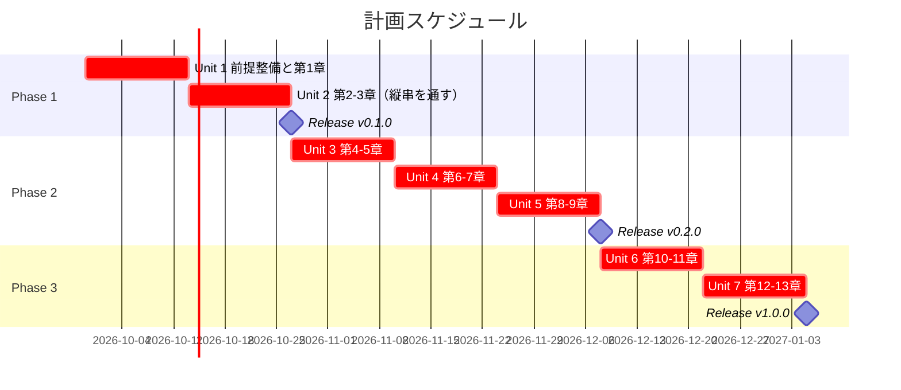
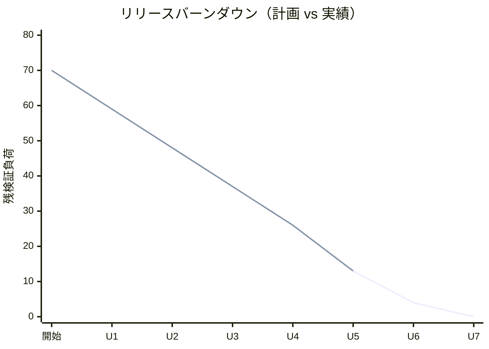

# リリース計画 - Zettai 連載（なでしこ3 版）

## 概要

本ドキュメントは、連載シリーズ **Zettai — 関数型プログラミングで作る変更を楽に安全にできるソフトウェア** の **なでしこ3 版**（シリーズ 2 言語目）のリリース計画を定義します。

章構成と執筆規約の一次情報は [執筆計画](../article/outline.md) の「なでしこ3 追加執筆計画」節と [章構成マインドマップ](../article/draft.md) です。本ドキュメントはそれを AI-DLC の **Intent → Unit → Bolt** の言葉に写し、なでしこ3 版の進行と進捗の Single Source of Truth とします。1 言語目の [Kotlin 版リリース計画](release_plan.md) は完結済みで、本計画とは独立に進みます。

本計画は [リリース・イテレーション計画ガイド（AI-DLC 版）](../reference/リリース・イテレーション計画ガイド_AI-DLC版.md) に準拠する **Level 1 計画** です。見積もりは 5 軸のエントロピー評価で行い、進捗は完了 Unit 数・承認ゲート通過数・変更依頼数・リードタイムで測り、イテレーションは Unit（週単位）と Bolt（時間〜日単位）の 2 階層に分けます。

### プロジェクト情報

| 項目 | 内容 |
|------|------|
| **プロジェクト名** | Zettai 連載（なでしこ3 版） |
| **目的** | 型システムを持たない日本語プログラミング言語で同じ 13 章を辿り、「型で保証していたもの」が言語から消えたときに何が残るかを示す |
| **対象ユーザー** | Kotlin 版の読者に加え、動的型付け言語で関数型の設計を実践したい開発者、日本語プログラミングに関心のある開発者 |
| **開発チーム** | 1 名（執筆・実装兼任） |
| **成果物** | 記事 `docs/article/zettai/nadesiko/chapter01.md` 〜 `chapter13.md`、サンプル実装 `apps/nadesiko/zettai/` |
| **処理系** | cnako3（npm パッケージ `nadesiko3` 3.8.7、Node 実装） |

---

## 満足条件

### Intent

> オブジェクト指向から関数型への設計移行を、型システムを持たない日本語プログラミング言語で辿り直し、設計が言語機能ではなく約束とテストで支えられることを、動くサンプル実装つきの全 13 章として公開する。

### ビジネス価値

| 価値 | 測定基準 |
| :--- | :--- |
| 読者が動的型付け言語でも関数型の設計を実践できる | 各章の到達点が動くコードで示され、読者が手元で再現できる（再現手順の記述漏れ 0 件） |
| 「型で保証する」と「約束とテストで保証する」の違いが言語化される | Phase 1 完了時に `docs/article/zettai/comparison/` を新設し、章を閉じるたびに比較の観点が 1 つ増える |
| 2 言語目で執筆と実装の型が固まる | Unit あたりの変更依頼数が Kotlin 版の同じ Unit 以下に収まる |

### スコープ

全 13 章を 3 フェーズに分けて段階的に公開します。章の番号・タイトル・焦点は Kotlin 版と一致させ、差し替えるのは実現手段だけです。

各章は「実装 → 記事執筆 → サイト反映 → コミット」を 1 Bolt として完結させ、記事のコード例は必ず `apps/nadesiko/zettai/` の動作確認済み実装から転記します。

| フェーズ | 内容 | ストーリー数 |
|---------|------|---------------|
| Phase 1 土台とウォーキングスケルトン | 前提整備と第 1〜3 章。実行環境とテスト基盤の自作・HTTP の縦串・ドメインとインフラの分離 | 4 |
| Phase 2 ドメインをイベントと関数で表す | 第 4〜9 章。関数型 DI・イベント・コマンド・結果辞書・射影・ファイル永続化 | 6 |
| Phase 3 モナドから関数型アーキテクチャへ | 第 10〜13 章。文脈を運ぶ関数・バリデーション・監視・設計の総括 | 4 |
| **合計** | | **14** |

### スコープ外

- Kotlin 版と同じく、認証・認可、HTML エスケープ、CSRF 対策、スナップショットは扱いません（教材であることを各章の索引に明示します）
- PostgreSQL への永続化は扱いません。nadesiko3 に DB プラグインが無いため、第 9 章は追記型イベントログのファイル永続化に置き換えます
- 横断比較コンテンツ `comparison/` は Phase 1 完了時に新設します。それ以前は作りません

### スケジュール

- **開発期間**: 2026-09-29 〜 2027-01-04（14 週間）
- **イテレーション**: 2 週間 × 7 イテレーション
- **リリース**: フェーズ完了ごとに 3 回（v0.1.0 / v0.2.0 / v1.0.0。Kotlin 版とは独立に採番）

### リソース

- **開発者**: 1 名
- **想定稼働時間**: 10 時間/週

---

## Unit 分解

Intent を 7 つの Unit に分解します。**1 Unit = 1 イテレーション = 章 2 本（Unit 1 のみ前提整備 + 章 1 本）** とし、Unit の完了が「サイトに章が公開され、対応する実装が `make check` green で動く」状態（Deployment Unit）に一致するようにしています。章の割り当ては Kotlin 版と同一にして、対象をまたいで章の位置を比べられるようにします。

| Unit | 内容 | 章 | ストーリー | 検証負荷 | Bolt 数 |
| :--- | :--- | :--- | :--- | :--- | :--- |
| Unit 1 | 実行環境・テスト基盤と第 1 章 | 前提整備・1 | US-000, US-001 | 11 | 2 |
| Unit 2 | ウォーキングスケルトンとドメイン分離 | 2〜3 | US-002, US-003 | 11 | 2 |
| Unit 3 | 関数型 DI とイベント | 4〜5 | US-004, US-005 | 11 | 2 |
| Unit 4 | コマンドとエラーハンドリング | 6〜7 | US-006, US-007 | 11 | 2 |
| Unit 5 | 射影と永続化 | 8〜9 | US-008, US-009 | 13 | 2 |
| Unit 6 | 文脈の受け渡しとバリデーション | 10〜11 | US-010, US-011 | 9 | 2 |
| Unit 7 | 監視とアーキテクチャ総括 | 12〜13 | US-012, US-013 | 4 | 2 |
| **合計** | | **13 章** | **14 ストーリー** | **70** | **14** |

### Kotlin 版との検証負荷の差

合計は Kotlin 版の 75 に対して **70**（−5）です。構成と検査の仕組みが 1 言語目で固まったぶん下がる章と、型が無いぶん上がる章を相殺しています。

| Unit | 章 | なでしこ3 | Kotlin | 差 | 理由 |
| :--- | :--- | :--- | :--- | :--- | :--- |
| Unit 1 | 前提整備・1 | 11 | 8 | **+3** | Nix 環境・テストヘルパ・テストランナーをすべて自作する |
| Unit 2 | 2〜3 | 11 | 13 | −2 | 縦串の構成と受け入れテストの入口は Kotlin 版で確立済み |
| Unit 3 | 4〜5 | 11 | 13 | −2 | 同上 |
| Unit 4 | 6〜7 | 11 | 10 | **+1** | 第 7 章の結果辞書は型で守れないため契約テストの検証が要る |
| Unit 5 | 8〜9 | 13 | 13 | ±0 | 第 9 章の永続化を置き換えるぶん新しい設計判断が発生する |
| Unit 6 | 10〜11 | 9 | 10 | −1 | 文脈を運ぶ関数は Kotlin 版の `ContextReader` の構造をなぞれる |
| Unit 7 | 12〜13 | 4 | 8 | **−4** | 第 13 章は Kotlin 版との対比があるぶん書きやすい |
| **合計** | | **70** | **75** | **−5** | |

### 依存 DAG

```plantuml
@startuml
title Unit の依存関係（なでしこ3 版）

object "Unit 1
実行環境・テスト基盤・第1章" as u1
object "Unit 2
第2-3章" as u2
object "Unit 3
第4-5章" as u3
object "Unit 4
第6-7章" as u4
object "Unit 5
第8-9章" as u5
object "Unit 6
第10-11章" as u6
object "Unit 7
第12-13章" as u7

u1 --> u2 : テストヘルパとランナー
u2 --> u3 : 受け入れテストの入口
u3 --> u4 : ドメインとイベント
u4 --> u5 : コマンドと結果辞書
u5 --> u6 : 永続化と射影
u6 --> u7 : 文脈とバリデーション

note bottom
  Kotlin 版と同じくチェーン状で、並列に回せる Unit は無い。
  ただし各 Unit は Kotlin 版の同じ章を参照できるため、
  構造的不確実性は 1 言語目より低い
end note
@enduml
```

### エントロピー評価

各 Unit について 5 軸で AI の自律度を評価します。HIGH が多い Unit ほど承認ゲートを密にします。

| Unit | 意図の曖昧さ | 構造的不確実性 | 検証の不確実性 | リスク | 未解決の仮定 | ゲート密度 |
| :--- | :--- | :--- | :--- | :--- | :--- | :--- |
| Unit 1 | LOW | **HIGH** | **HIGH** | MED | **HIGH** | 密（各ステップ） |
| Unit 2 | LOW | MED | MED | MED | MED | 密（縦串の品質と HTTP プラグインの挙動を見る） |
| Unit 3 | LOW | MED | MED | LOW | MED | 密（4 箇所に絞る） |
| Unit 4 | LOW | MED | MED | MED | LOW | 密（5 箇所。契約が変わる箇所が 2 つ） |
| Unit 5 | LOW | MED | MED | MED | MED | 中（Bolt 末と永続化の設計判断時） |
| Unit 6 | MED | **HIGH** | MED | MED | MED | 密（4 箇所。何を文脈と呼ぶかが未確定） |
| Unit 7 | MED | LOW | LOW | LOW | LOW | 疎（実装追加が最小） |

Kotlin 版との違いは 2 つです。

- **Unit 1 が最も重い Unit** です。Kotlin 版は Gradle と JUnit が最初から揃っていましたが、なでしこ3 にはテストフレームワークが存在せず、検証関数・型比較・結果集計・テストランナーをすべて自作します。cnako3 に lint / format があるかも未確認で、未解決の仮定が HIGH です
- **Unit 5 のリスクが HIGH から MED に下がります**。PostgreSQL の導入と結合テストの不安定さが無くなり、ファイル永続化に置き換わるためです。代わりに「置き換えた設計が第 9 章の主題（モナド則）を保てるか」という構造的不確実性が残ります

### スコープ・深さ・テスト戦略

| Unit | スコープ | 深さ | テスト戦略 | 理由 |
| :--- | :--- | :--- | :--- | :--- |
| Unit 1 | 実装中心 | Standard | Minimal | 基盤 Unit。本番機能を持たず、テスト対象のコンポーネントがまだ無い |
| Unit 2 | 全ステージ | Standard | Standard | ウォーキングスケルトンと受け入れテストの入口。以降の全 Unit がここに依存する |
| Unit 3〜6 | 全ステージ | Standard | Standard | 本番機能に相当する。Standard 未満にしない |
| Unit 7 | 設計中心 | Standard | Standard | 第 13 章は実装追加が最小で、総括と Kotlin 版との対比が主 |

型検査が無いぶん、Standard の中身は Kotlin 版より重くなります。具体的には、辞書の契約（キーの有無と値の型）を確かめる**契約テスト**を、その辞書を返す関数ごとに 1 本置きます。

### 優先順位マトリックス

Unit の順序は章順に固定されるため、優先順位は「各ストーリーの作り込みの深さをどこから削るか」の判断に使います。軸は Kotlin 版と同じ 4 つ（BV・C・KA・RR）です。

### Phase 1: 土台とウォーキングスケルトン（イテレーション 1-2）

| ID | ユーザーストーリー | 検証負荷 | BV | C | KA | RR | 優先度 |
|----|-------------------|----|----|---|----|----|--------|
| US-000 | 読者が手元で再現できるよう、なでしこ3 の実行環境・テストヘルパ・テストランナー・サンプル実装の雛形を用意する | 8 | 中 | 高 | 低 | 高 | 必須 |
| US-001 | 第 1 章「新しいアプリケーションを準備する」を公開する | 3 | 高 | 低 | 低 | 中 | 必須 |
| US-002 | 第 2 章「関数を使って HTTP を扱う」を公開する（ウォーキングスケルトン） | 6 | 高 | 中 | 中 | 高 | 必須 |
| US-003 | 第 3 章「ドメインの定義とテスト」を公開する | 5 | 高 | 中 | 中 | 高 | 必須 |
| **合計** | | **22** | | | | | |

### Phase 2: ドメインをイベントと関数で表す（イテレーション 3-5）

| ID | ユーザーストーリー | 検証負荷 | BV | C | KA | RR | 優先度 |
|----|-------------------|----|----|---|----|----|--------|
| US-004 | 第 4 章「ドメインとアダプタのモデリング」を公開する | 5 | 高 | 中 | 中 | 中 | 必須 |
| US-005 | 第 5 章「イベントで状態を変更する」を公開する | 6 | 高 | 中 | 高 | 中 | 必須 |
| US-006 | 第 6 章「コマンドを実行してイベントを生成する」を公開する | 5 | 高 | 中 | 中 | 中 | 必須 |
| US-007 | 第 7 章「関数型手法によるエラーハンドリング」を公開する | 6 | 高 | 中 | 高 | 高 | 必須 |
| US-008 | 第 8 章「ファンクタを使ってイベントを射影する」を公開する | 5 | 高 | 中 | 高 | 中 | 必須 |
| US-009 | 第 9 章「モナドによる安全なデータ永続化」を公開する | 8 | 高 | 高 | 高 | 高 | 必須 |
| **合計** | | **35** | | | | | |

### Phase 3: モナドから関数型アーキテクチャへ（イテレーション 6-7）

| ID | ユーザーストーリー | 検証負荷 | BV | C | KA | RR | 優先度 |
|----|-------------------|----|----|---|----|----|--------|
| US-010 | 第 10 章「コンテキストを読み込み、コマンドを処理する」を公開する | 5 | 中 | 中 | 高 | 中 | 必須 |
| US-011 | 第 11 章「アプリカティブによるデータバリデーション」を公開する | 4 | 中 | 中 | 高 | 低 | 必須 |
| US-012 | 第 12 章「監視と関数型 JSON」を公開する | 2 | 中 | 低 | 中 | 低 | 中 |
| US-013 | 第 13 章「関数型アーキテクチャの設計」を公開する | 2 | 高 | 低 | 中 | 低 | 必須 |
| **合計** | | **13** | | | | | |

### 全体サマリー

| フェーズ | 検証負荷 | イテレーション（Unit） |
|---------|-------------------|---------------|
| Phase 1 | 22 | Unit 1-2 |
| Phase 2 | 35 | Unit 3-5 |
| Phase 3 | 13 | Unit 6-7 |
| **合計** | **70** | 7 Unit / 14 Bolt |

---

## 進捗の測り方

### 一次指標

| 指標 | 意味 | 目標 |
| :--- | :--- | :--- |
| 完了 Unit 数 | Deployment Unit として検証済みの Unit 数。**部分完了は 0** | 1 Unit / イテレーション（計 7） |
| 承認ゲート通過数 | 人が検証して承認したステップ数 | Unit 1 は 10 箇所。以降は評価に応じて減らす |
| 変更依頼数 | AI の成果物に人が修正を求めた回数 | **Kotlin 版の同じ Unit 以下**（1 言語目のガードレールが効いているかの検証） |
| **人が検証に使った時間** | 承認ゲートでの検証に人が費やした実時間。Kotlin 版でリードタイムが全 Unit「1 日」になり見積もりに使えなかったため、本リリースから主指標にする（[Unit 7 のふりかえり](retrospective-7.md) Try 6） | Unit ごとに計測し、検証負荷ポイントの妥当性を検証する |
| リードタイム | Unit 着手から Deployment Unit 完成まで | 10 営業日 / Unit（**参考値**。AI の実装速度に支配されるため見積もりには再利用しない） |

### 検証負荷ポイントの扱い

各ストーリーに付けた数値は、**人が検証に費やす時間の相対的な大きさ**です。AI が実装する量ではありません。

- Kotlin 版の実績（全 Unit リードタイム 1 日・ゲート通過 47 / 47・変更依頼 2 件）を基準にした推測値です
- Unit 2 の完了時点で 2 Unit 分の実績が揃うので、そこで以降の Unit の評価と割り当てを再調整します。Kotlin 版（Unit 3 時点）より早く見直すのは、言語基盤の自作という未知が Unit 1 に集中しているためです。**ゲート密度の見直しも Unit 2 完了時に行います**（Unit 1 でゲートが同期的に機能せず、判断の材料が得られなかったため）
- 「実装は終わったが記事が書けていない」状態を完了に数えません。記事を公開し、[シリーズ索引](../article/zettai/index.md) の全章構成表と進捗管理表を更新した時点で Unit 完了とします

---

## 段階的リリース戦略

### リリーススケジュール



実績スケジュールはイテレーション完了ごとに追記します。

### リリース内容

#### Release v0.1.0（Phase 1 完了）: 動く縦串と再現できる環境 — **達成（2026-09-28）**

**目標**: 読者が自分の手元で `nix develop .#nadesiko` から環境を作り、簡易 HTTP サーバで ToDo リストが表示されるところまで到達できる。あわせて `comparison/` を新設し、最初の比較観点（テスト基盤の自作）を置く。

| 条件 | 状態 |
| :--- | :--- |
| 実行環境が再現できる（`nix develop .#nadesiko` → `make check`） | 達成 |
| ウォーキングスケルトンが通っている | 達成（第 2 章） |
| 受け入れテストの入口ができている（2 経路） | 達成（第 3 章） |
| 第 1〜3 章が公開されている | 達成 |
| CI が green | **達成**（`Nadesiko3 Zettai` / `Kotlin Zettai` / `Deploy MkDocs` すべて success） |
| `comparison/` の新設 | 達成（Unit 2） |

CI の確認だけが Unit 2・3 を通じて保留でした。**Unit 4 の着手時に push して green を確認し、v0.1.0 を達成しました。** 本リポジトリはタグや CHANGELOG を使わず、リリースの記録は本計画と報告書で行います（Kotlin 版と同じ運用）。

#### Release v0.2.0（Phase 2 完了）: 型を使わずにドメインを組み立てる — **達成（2026-09-29）**

**目標**: イベント・コマンド・結果辞書・射影・ファイル永続化までを、辞書のキーの約束と契約テストで組み立てきる。

| 条件 | 状態 |
| :--- | :--- |
| 第 4〜9 章が公開されている | 達成 |
| 関数型 DI・イベント・コマンド・結果辞書・射影・永続化が揃っている | 達成 |
| 3 経路の受け入れシナリオが green | 達成 |
| 代数構造 3 つ（モノイド・ファンクタ・モナド）を性質テストで確かめた | 達成 |
| CI が green | **達成**（`Nadesiko3 Zettai` / `Kotlin Zettai` / `Deploy MkDocs` すべて success） |

**Phase 2 が完了しました。** 全 13 章のうち 9 章を公開し、代数構造 3 つ（モノイド・ファンクタ・モナド）を性質テストで確かめています。残るは Phase 3（第 10〜13 章）です。

#### Release v1.0.0（Phase 3 完了）: 約束とテストで支える関数型アーキテクチャ

**目標**: 全 13 章を公開し、第 13 章で Kotlin 版と対比して「型で保証する」と「約束とテストで保証する」の違いを言語化する。

---

## バッファ戦略

### スコープバッファ

| フェーズ | 検証負荷 | バッファ（30%） | 実効 |
|---------|---------|-----------------|---------|
| Phase 1 | 22 | 7 | 29 |
| Phase 2 | 35 | 11 | 46 |
| Phase 3 | 13 | 4 | 17 |

Unit を削るバッファは持てません（依存がチェーン状）。代わりに **各章の作り込みの深さを 1 段階下げる**ことをバッファとして使います。長い完成コードを `<details>` に退避し、本文を差分だけに絞ります。

**テスト戦略は Standard 未満にしません**（Unit 1 を除く）。とくに契約テストは削りません。型検査が無い本対象では、契約テストが Kotlin 版のコンパイラに相当する唯一の網だからです。

### 検証バッファ

- **予備イテレーション**: 1 イテレーション（2 週間）を Unit 7 の後ろに確保
- **全体バッファ**: 約 14%（14 週間に対して 2 週間）
- **集中時間の確保**: Unit 1 は承認ゲートが密になります。2 時間以上の連続した集中時間を先に確保します

### バッファ消費ルール

1. スコープバッファを先に消費する（記事の作り込みの深さを下げる）
2. 低優先度ストーリー（US-012 第 12 章）の深さを下げる
3. 検証バッファ（予備イテレーション）は最後の手段とする

---

## Unit ごとの Bolt 計画概要

各 Unit は 2 つの Bolt（章 1 本ずつ。Unit 1 のみ前提整備 + 章 1 本）で構成します。Bolt ゴールには必ず「確認したい仮説」を含めます。

### Unit 1（Week 1-2）

**ゴール**: なでしこ3 の実行環境とテスト基盤を自作し、第 1 章を公開する。**確認したい仮説**: テストフレームワークの無い言語でも、検証関数とランナーを 1 日で自作すれば TDD が回る。

**主なステップ**:

- [ ] `ops/nix/environments/nadesiko/shell.nix` を新設（既存 `node/shell.nix` を雛形に Node 20 と npm を載せる）
- [ ] `flake.nix` の `devShells` に `nadesiko` を登録し、`nix flake show` で認識されることを確認
- [ ] `apps/nadesiko/zettai/` に雛形を作成（`package.json` で cnako3 3.8.7 を固定、`Makefile`、`src/`、`test/`、`doctest/`）
- [ ] `test/helper.nako3` に検証関数を実装（値の比較の前に `変数型確認` 同士を比較し、`=` が型を区別しないことによる見逃しを防ぐ）
- [ ] `Makefile` にテストランナーを実装（`test/*_test.nako3` を順に実行し、終了コードで集計）
- [ ] cnako3 の lint / format の有無を実機確認し、無ければ「入れない」判断を ADR に記録する
- [ ] 最小の検証 1 本が `make check` で通ることを確認
- [ ] 第 1 章の実装（雛形と関数型ユニットテスト 1 本）と記事執筆

**検証負荷**: 11　**Bolt**: 2

### Unit 2（Week 3-4）

**ゴール**: 簡易 HTTP サーバで ToDo リストを表示する縦串を通し、受け入れテストをドメインから駆動できる形に整えて第 2〜3 章を公開する。**確認したい仮説**: 簡易 HTTP サーバのプラグインで Zettai のルーティングとフォーム POST が過不足なく書ける。

**主なステップ**:

- [ ] 第 2 章の実装（『簡易HTTPサーバ受信時』とハンドラ関数の合成によるウォーキングスケルトン）と記事執筆
- [ ] `.github/workflows/nadesiko-zettai.yml` を新設（第 2 章の実装が入った直後）
- [ ] `ops/scripts/article/check_article_code.py` に `apps/**/*.nako3` と `nako3` を追加し、記事・実装同期検査を効かせる
- [ ] 第 3 章の実装（高階関数による受け入れテストの抽象化、ドメインと HTTP アダプタのファイル分離）と記事執筆
- [ ] `docs/article/zettai/comparison/` を新設し、最初の比較観点を置く
- [ ] Release v0.1.0

**検証負荷**: 11　**Bolt**: 2

### Unit 3（Week 5-6）

**ゴール**: 関数値を辞書に詰めた依存性注入でアダプタを差し替え可能にし、状態変更をイベントの畳み込みとして表す（第 4〜5 章）。**確認したい仮説**: 取り込みの向きだけで依存の方向を表せる。

**検証負荷**: 11　**Bolt**: 2

### Unit 4（Week 7-8）

**ゴール**: コマンドからイベントを生成する関数型ステートマシンを書き、例外をやめて結果辞書で失敗を運ぶ（第 6〜7 章）。**確認したい仮説**: 辞書のキーの約束と契約テストで、`Outcome` と同じ安全さに実用上到達できる。

**検証負荷**: 11　**Bolt**: 2

### Unit 5（Week 9-10）

**ゴール**: 射影でクエリ側を分離し、追記型イベントログへの永続化を結果連鎖で組み立てる（第 8〜9 章）。**確認したい仮説**: 永続化先を DB からファイルに替えても、第 9 章の主題（モナド則）は保てる。

**検証負荷**: 13　**Bolt**: 2

### Unit 6（Week 11-12）

**ゴール**: 文脈を受け取る関数でコマンド処理をまとめ、複数のエラーを集約する検証を合成する（第 10〜11 章）。**確認したい仮説**: 関数値を一旦変数に受ける制約が、設計の説明の邪魔にならない。

**検証負荷**: 9　**Bolt**: 2

### Unit 7（Week 13-14）

**ゴール**: 構造化ログと辞書 ⇄ JSON の双方向変換を扱い、設計を総括して Kotlin 版と対比する（第 12〜13 章）。**確認したい仮説**: 2 言語を並べたとき、各章が言語機能の説明ではなく設計の説明だったと言える。

**検証負荷**: 4　**Bolt**: 2

各 Unit の詳細な Bolt 計画は、着手時に `opening-iteration` で `iteration_plan-nadesiko-N.md` として作成します。

---

## リスク管理

### 技術リスク

| リスク | 影響度 | 発生確率 | 対策 | 検知タイミング |
|--------|--------|----------|------|----------------|
| 型システム・ユーザー定義型が無く、代数的データ型と `Outcome` の型安全が成立しない | 高 | **確定** | 辞書のキーを契約とし、契約テストと `変数型確認` による厳密比較で担保する。第 13 章で Kotlin 版と対比して「何が失われ、何が残ったか」を主題にする | 計画時点で確定。第 7 章で顕在化 |
| テストフレームワークが存在せず、前提整備が想定より伸びる | 高 | 中 | 参考連載 `references/getting-started-tdd/apps/nadesiko/` の `test/helper.nako3` と `Makefile` を手本にする。自作が半日で終わらなければ、検証の粒度を下げてまず 1 本通す | Unit 1 / Bolt 1-1 |
| cnako3 の簡易 HTTP サーバが Zettai のルーティングやフォーム POST に足りない | 高 | 低 | Unit 2 の最初に最小のルーティング 2 本と POST 1 本で実機確認する。足りなければ第 2 章の到達点を「GET のみの縦串」に下げ、POST を第 6 章に回す | Unit 2 / Bolt 2-1 の冒頭 |
| DB プラグインが無く、第 9 章の主題（モナド則）を保てない | 中 | 中 | 追記型イベントログのファイル永続化に置き換える。イベントソーシングとは相性がよく、`結果連鎖` の連鎖はむしろ書きやすい。置き換えの判断は ADR に残す | Unit 5 / Bolt 5-2 |
| cnako3 に lint / format が無く、静的解析の扱いが決まらない | 低 | 中 | Unit 1 で実機確認し、無ければ「入れない」判断を ADR に記録する（Kotlin 版 ADR-004 と同じ形） | Unit 1 |
| カバレッジを計測できず、Kotlin 版の kover 80% 下限に相当する定量ゲートが無い | 中 | **確定** | `doctest/` の受け入れシナリオで代替し、Unit ごとにシナリオ数を記録する | 計画時点で確定 |
| パーサの罠（辞書からの取り出しと即時呼び出し、ひらがなを含む識別子、`空` の実体が空文字列、型を区別しない `=`）で実装が止まる | 中 | 高 | 参考連載 07・10・11・12 章の実例を各章の「つまずき」節として先回りで書く。詰まったら回避策ごと記事の材料にする | 全 Unit |

### スケジュールリスク

| リスク | 影響度 | 発生確率 | 対策 |
|--------|--------|----------|------|
| Unit 1 に未知が集中しており、ここで崩れると全体が押す | 高 | 中 | Unit 2 完了時点（Kotlin 版より 1 Unit 早い）で実績を反映して再評価する。乖離が 30% を超えたら Unit の割り当てを組み替える |
| 2 言語目なので手が早く進み、記事の説明が Kotlin 版の焼き直しになる | 中 | 中 | 各章に「なでしこ3 でのつまずき」節を必ず置き、Kotlin 版に無い内容を 1 つ以上含める。無ければその章は未完了と判断する |
| 実装が終わったのに記事執筆が積み残る | 高 | 中 | 記事公開とシリーズ索引の更新までを完了の定義に含める。実装と記事はコミットを分ける（`feat(nadesiko): ...` と `docs(nadesiko): ...`） |
| 1 名体制のため、稼働が落ちるとそのまま遅延になる | 中 | 中 | 予備イテレーション 1 回を確保する。持続可能なペースを崩してまで詰め込まない |

---

## 承認ゲートの方針

Kotlin 版の実績（Unit 3 以降は変更依頼 0 件）を踏まえ、ゲート密度は Unit 1 で密、Unit 2 以降は Bolt 末のみに緩めます。ただし本対象では、型検査が無いことを補うために次の項目を**全 Bolt 共通のゲート項目**に加えます。

| 全 Bolt 共通のゲート項目 | 確認すること |
| :--- | :--- |
| 契約テストがあるか | 辞書を返す関数ごとに、キーの有無と値の型を確かめるテストが 1 本あるか |
| 厳密比較になっているか | 値の比較の前に `変数型確認` 同士を比較しているか（`=` は型を区別しない） |
| 記事のコード例が実装からの転記か | `check_article_code.py` が green か。逐語でないブロックに `<!-- code-check: ignore 理由 -->` があるか |
| つまずき節があるか | その章に、なでしこ3 固有の制約とその回避策が書かれているか |

---

## 進捗管理

### メトリクス

| メトリクス | 目標 |
|-----------|------|
| 完了 Unit 数 | 1 Unit / イテレーション（計 7） |
| 承認ゲート通過数 | Unit 1 は 10。以降はエントロピー評価に応じて減らす |
| 変更依頼数 | Kotlin 版の同じ Unit 以下 |
| 人が検証に使った時間 | Unit ごとに計測（主指標） |
| リードタイム | 10 営業日 / Unit（参考値） |
| 受け入れシナリオ数 | Unit ごとに増加（カバレッジ計測の代替） |
| 公開済みの章 | 13 / 13（リリース時） |
| 記事とサンプル実装の一致 | 100%（`check_article_code.py` が green） |

### 進捗状況

| Unit | 計画検証負荷 | ゲート通過数 | 変更依頼数 | 人の検証時間 | 状態 |
|------|---------|---------|--------|------|------|
| Unit 1 | 11 | 0 / 10 | 未確定 | 未計測 | **完了** |
| Unit 2 | 11 | 0 / 11 | 未確定 | 未計測 | **完了** |
| Unit 3 | 11 | 0 / 4 | 未確定 | 未計測 | **完了** |
| Unit 4 | 11 | 0 / 5 | 未確定 | 未計測 | **完了** |
| Unit 5 | 13 | 0 / 4 | 未確定 | 未計測 | **完了** |
| Unit 6 | 9 | - | - | - | 計画済み（[Bolt 計画](iteration_plan-nadesiko-6.md)） |
| Unit 7 | 4 | - | - | - | 未着手 |
| **合計** | **70** | **0 / 34** | **-** | **-** | 完了 Unit 数 **5 / 7** |

### バーンダウンチャート



実績の折れ線は Unit 完了ごとに追記します。一次指標は完了 Unit 数で、バーンダウンは補助指標です。

---

## 次のステップ

1. [開発戦略](development_strategy.md) に「なでしこ3 版の局面別アプローチ」を追記した（局面割り当ては Kotlin 版と同一、契約テストを全 Bolt 共通のゲート項目に設定、ゲート密度の見直しを Unit 1 完了時に前倒し）
2. [Unit 1 の Bolt 計画](iteration_plan-nadesiko-1.md) を作成した（21 ステップ・承認ゲート 10 箇所）
3. Unit 1 を完了した（[Bolt 終了報告](bolt_report-nadesiko-1.md) / [ふりかえり](retrospective-nadesiko-1.md)）。第 1 章を公開し、実行環境とテスト基盤を自作した
4. Unit 2 を完了した（[Bolt 終了報告](bolt_report-nadesiko-2.md) / [ふりかえり](retrospective-nadesiko-2.md)）。第 2〜3 章を公開し、記事に対する 3 つの検査を入れた
5. [Unit 3 の Bolt 計画](iteration_plan-nadesiko-3.md) を作成した（18 ステップ・承認ゲート 4 箇所）。ゲートを 11 から 4 に絞り、運用形態の切り替えを人の作業と定めた
6. Unit 3 を完了した（[Bolt 終了報告](bolt_report-nadesiko-3.md) / [ふりかえり](retrospective-nadesiko-3.md)）。第 4〜5 章を公開し、合成がモノイドであることを性質テストで示した
7. [Unit 4 の Bolt 計画](iteration_plan-nadesiko-4.md) を作成した（17 ステップ・承認ゲート 5 箇所）。Kotlin 版 ADR 12 件を 1 件ずつ見て移植漏れ 3 件を特定した
8. **Release v0.1.0 を達成した（2026-09-28）。** push して CI の green を確認した
9. Unit 4 を完了した（[Bolt 終了報告](bolt_report-nadesiko-4.md) / [ふりかえり](retrospective-nadesiko-4.md)）。第 6〜7 章を公開し、Kotlin 版 ADR の移植漏れ 3 件を回収した
10. [Unit 5 の Bolt 計画](iteration_plan-nadesiko-5.md) を作成した（17 ステップ・承認ゲート 4 箇所）。Kotlin 版 ADR 008〜012 の移植要否を着手前に判断し、第 9 章の節名の読み替え 3 件とモナドの題材の差分を計画に入れた
11. Unit 5 を完了した（[Bolt 終了報告](bolt_report-nadesiko-5.md) / [ふりかえり](retrospective-nadesiko-5.md)）。第 8〜9 章を公開した
12. **Release v0.2.0 を達成した（2026-09-29）。** push して CI の green を確認し、Phase 2 を完了した
5. `syncing-github-project` で **Unit を Milestone、Bolt のステップを Issue** として同期する

---

## 更新履歴

| 日付 | 更新内容 | 更新者 |
|------|---------|--------|
| 2026-09-28 | Unit 3 の着手前に、Level 1 のエントロピー評価を Bolt 計画の実態に合わせて更新（構造的不確実性と未解決の仮定を LOW から MED へ）。型の無い言語でハブと状態変換をどう表すかが未確定で、再帰・関数合成・乱数の 3 件が未確認のため | claude-code/claude-opus-5 |
| 2026-09-29 | Unit 6 の着手前に、Level 1 のエントロピー評価を Bolt 計画の実態に合わせて更新（意図の曖昧さ・構造的不確実性・リスク・未解決の仮定を上げた）。**持ち回る文脈が無い言語で `ContextReader` の章を書く**という難所で、何を文脈と呼ぶかが決まっていないため | claude-code/claude-opus-5 |
| 2026-09-29 | **Release v0.2.0 達成。** CI（`Nadesiko3 Zettai`・`Kotlin Zettai`・`Deploy MkDocs`）が すべて success であることを確認し、Phase 2 の条件を満たした | claude-code/claude-opus-5 |
| 2026-09-28 | Unit 5 完了を反映。進捗状況とバーンダウンに実績を記録。Release v0.2.0 は CI の確認待ち。Unit 6 のゲート密度は「密・4 箇所」を維持 | claude-code/claude-opus-5 |
| 2026-09-28 | Unit 5 の着手前の検証で、第 9 章のモナドの題材が設計（`ContextReader`）と実態（`結果連鎖`）でずれることを検出。文脈を持ち回らないファイル永続化では `ContextReader` が成立しないため、題材を差し替えて `ContextReader` 相当は第 10 章に送る判断を計画に記録 | claude-code/claude-opus-5 |
| 2026-09-28 | Unit 4 完了を反映。進捗状況とバーンダウンに実績を記録。Unit 5 のゲート密度は「密・4 箇所」（Unit 4 の 5 から戻す） | claude-code/claude-opus-5 |
| 2026-09-28 | **Release v0.1.0 達成。** CI（`Nadesiko3 Zettai`・`Kotlin Zettai`・`Deploy MkDocs`）が すべて success であることを確認し、Phase 1 の条件を満たした | claude-code/claude-opus-5 |
| 2026-09-28 | Unit 4 の着手前に、Level 1 のエントロピー評価を Bolt 計画の実態に合わせて更新（構造的不確実性・リスクを LOW から MED へ）。第 7 章でポートの契約が変わり、型が無いぶん波及が静かなため | claude-code/claude-opus-5 |
| 2026-09-28 | Unit 3 完了を反映。進捗状況とバーンダウンに実績を記録。Unit 4 のゲート密度は「密・4 箇所」を維持する判断を記録 | claude-code/claude-opus-5 |
| 2026-09-28 | Unit 2 完了を反映。進捗状況とバーンダウンに実績を記録。ゲート密度は「密」を維持する判断を記録（見直しの前提である実績が 2 Unit 続けて得られていないため） | claude-code/claude-opus-5 |
| 2026-09-28 | Unit 1 完了を反映。進捗状況とバーンダウンに実績を記録。承認ゲートが同期的に機能しなかったことを実績として残した | claude-code/claude-opus-5 |
| 2026-09-28 | Unit 1 の Bolt 計画を作成。[Unit 7 のふりかえり](retrospective-7.md) Try 6 を反映し、主指標をリードタイムから「人が検証に使った時間」に変更（リードタイムは参考値に降格） | claude-code/claude-opus-5 |
| 2026-09-28 | [開発戦略](development_strategy.md) への局面別アプローチ追記にあわせ、Unit 5 のゲート密度を「密」から「中」に修正（ファイル永続化への置き換えでリスクが MED に下がったため） | claude-code/claude-opus-5 |
| 2026-09-28 | 初版作成。シリーズ 2 言語目としてなでしこ3 版を 7 Unit・14 ストーリー・14 Bolt に分解し、処理系に cnako3 を採用。型・テストフレームワーク・DB プラグインの不在をリスク台帳に登録し、契約テストを全 Bolt 共通の承認ゲート項目に追加 | claude-code/claude-opus-5 |
