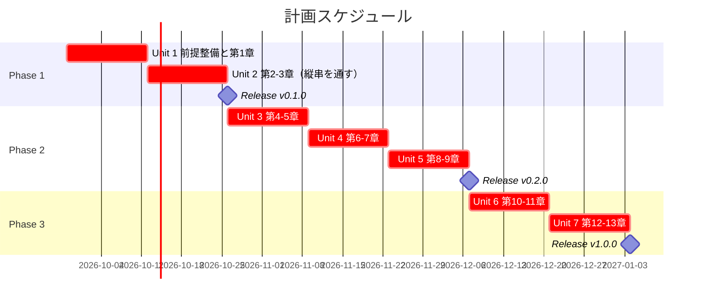
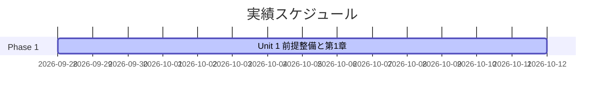
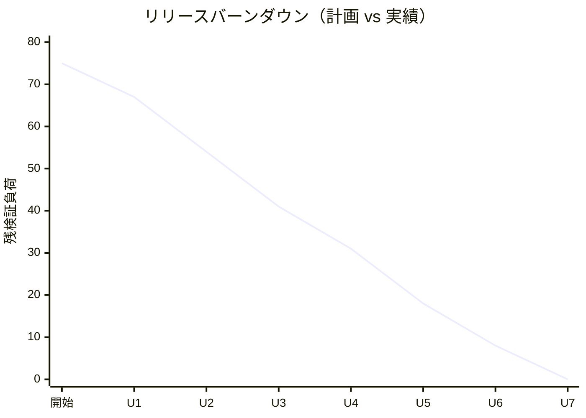

# リリース計画 - Zettai 連載（Kotlin 版）

## 概要

本ドキュメントは、連載シリーズ **Zettai — 関数型プログラミングで作る変更を楽に安全にできるソフトウェア** の Kotlin 版のリリース計画を定義します。

執筆計画（章構成・参照元モジュールの対応・執筆規約）の一次情報は [執筆計画](../article/outline.md) と [章構成マインドマップ](../article/draft.md) です。本ドキュメントはそれを AI-DLC の **Intent → Unit → Bolt** の言葉に写し、進捗管理の Single Source of Truth とします。

本計画は [リリース・イテレーション計画ガイド（AI-DLC 版）](../reference/リリース・イテレーション計画ガイド_AI-DLC版.md) に準拠する **Level 1 計画** です。XP 版との違いは次の 3 点です。

- 見積もりはストーリーポイントの絶対値ではなく、**5 軸のエントロピー評価**（AI がどれだけ自律的に進められるか）で行う。ポイントを付ける場合は「AI が生成する量」ではなく「**人が検証する負荷**」を表す
- 進捗はベロシティではなく **完了 Unit 数・承認ゲート通過数・変更依頼数・リードタイム**で測る
- イテレーションは **Unit**（週単位）と **Bolt**（時間〜日単位）の 2 階層に分かれる。1 イテレーション = 1 Unit = 2 Bolt（章 1 本ずつ）とする

### プロジェクト情報

| 項目 | 内容 |
|------|------|
| **プロジェクト名** | Zettai 連載（Kotlin 版） |
| **目的** | ToDo リストアプリケーション Zettai を TDD で一から作りながら、オブジェクト指向から関数型へ設計を移す過程を、動くサンプル実装つきの全 13 章の連載として公開する |
| **対象ユーザー** | オブジェクト指向での開発経験があり、関数型の設計手法を実務に持ち込みたい開発者 |
| **開発チーム** | 1 名（執筆・実装兼任） |
| **成果物** | 記事 `docs/article/zettai/kotlin/chapter01.md` 〜 `chapter13.md`、サンプル実装 `apps/kotlin/zettai/` |

---

## 満足条件

### Intent

> オブジェクト指向から関数型への設計移行を TDD で辿る過程を、読者が手元で再現できる動くサンプル実装つきの全 13 章の連載として公開する。

### ビジネス価値

| 価値 | 測定基準 |
| :--- | :--- |
| 読者が関数型の設計手法を実務に持ち込める | 各章の到達点が動くコードで示され、読者が手元で再現できる（再現手順の記述漏れ 0 件） |
| 執筆者自身の設計判断が言語化され蓄積される | 章ごとに ADR が残り、第 13 章の総括と整合している |
| AI と人の分業パターンが確立される | Unit ごとの承認ゲート通過数と変更依頼数が記録され、変更依頼が後半の Unit で減っている |

### スコープ

全 13 章を 3 フェーズに分けて段階的に公開します。フェーズの区切りは [章構成マインドマップ](../article/draft.md) のテーマの切れ目と、イテレーションの境界が一致する位置に置きます。

各章は「実装 → 記事執筆 → サイト反映 → コミット」を 1 Bolt として完結させ、記事のコード例は必ず `apps/kotlin/zettai/` の動作確認済み実装から転記します。

| フェーズ | 内容 | ストーリー数 |
|---------|------|---------------|
| Phase 1 土台とウォーキングスケルトン | 前提整備と第 1〜3 章。実行環境・HTTP の縦串・ドメインとインフラの分離 | 4 |
| Phase 2 ドメインをイベントと関数で表す | 第 4〜9 章。関数型 DI・イベント・コマンド・`Outcome`・射影・永続化 | 6 |
| Phase 3 モナドから関数型アーキテクチャへ | 第 10〜13 章。`ContextReader`・バリデーション・監視・設計の総括 | 4 |
| **合計** | | **14** |

### スケジュール

- **開発期間**: 2026-09-28 〜 2027-01-03（14 週間）
- **イテレーション**: 2 週間 × 7 イテレーション
- **リリース**: フェーズ完了ごとに 3 回（v0.1.0 / v0.2.0 / v1.0.0）

### リソース

- **開発者**: 1 名
- **想定稼働時間**: 10 時間/週

---

## Unit 分解

Intent を 7 つの Unit に分解します。Unit は疎結合・高凝集な作業単位で、独立して検証・公開できることが条件です。本プロジェクトでは **1 Unit = 1 イテレーション = 章 2 本（Unit 1 のみ前提整備 + 章 1 本）** とし、Unit の完了が「サイトに章が公開され、対応する実装が `./gradlew check` green で動く」状態（Deployment Unit）に一致するようにしています。

| Unit | 内容 | 章 | ストーリー | 検証負荷 | Bolt 数 |
| :--- | :--- | :--- | :--- | :--- | :--- |
| Unit 1 | 実行環境と第 1 章 | 前提整備・1 | US-000, US-001 | 8 | 2 |
| Unit 2 | ウォーキングスケルトンとドメイン分離 | 2〜3 | US-002, US-003 | 13 | 2 |
| Unit 3 | 関数型 DI とイベント | 4〜5 | US-004, US-005 | 13 | 2 |
| Unit 4 | コマンドとエラーハンドリング | 6〜7 | US-006, US-007 | 10 | 2 |
| Unit 5 | 射影と永続化 | 8〜9 | US-008, US-009 | 13 | 2 |
| Unit 6 | 文脈の受け渡しとバリデーション | 10〜11 | US-010, US-011 | 10 | 2 |
| Unit 7 | 監視とアーキテクチャ総括 | 12〜13 | US-012, US-013 | 8 | 2 |
| **合計** | | **13 章** | **14 ストーリー** | **75** | **14** |

### 依存 DAG

```plantuml
@startuml
title Unit の依存関係

object "Unit 1
実行環境・第1章" as u1
object "Unit 2
第2-3章" as u2
object "Unit 3
第4-5章" as u3
object "Unit 4
第6-7章" as u4
object "Unit 5
第8-9章" as u5
object "Unit 6
第10-11章" as u6
object "Unit 7
第12-13章" as u7

u1 --> u2 : ビルド基盤
u2 --> u3 : 受け入れテストの入口
（DDT / Pesticide）
u3 --> u4 : ドメインとイベント
u4 --> u5 : コマンドと Outcome
u5 --> u6 : 永続化と射影
u6 --> u7 : 文脈とバリデーション

note bottom
  依存はチェーン状で、並列に回せる Unit は無い。
  原著の章立てが設計の到達順序を固定しているため、
  並列化ではなく 1 Unit のリードタイム短縮で速度を出す
end note
@enduml
```

並列 Unit が作れないのは題材の制約です。無理に並列化すると、後の章で前提が変わったときに書き直しが連鎖します。

### エントロピー評価

各 Unit について、[リリース・イテレーション計画ガイド（AI-DLC 版）](../reference/リリース・イテレーション計画ガイド_AI-DLC版.md) の 5 軸で AI の自律度を評価します。HIGH が多い Unit ほど承認ゲートを密にします。

| Unit | 意図の曖昧さ | 構造的不確実性 | 検証の不確実性 | リスク | 未解決の仮定 | ゲート密度 |
| :--- | :--- | :--- | :--- | :--- | :--- | :--- |
| Unit 1 | LOW | MED | MED | MED | **HIGH** | 密（各ステップ） |
| Unit 2 | LOW | MED | MED | LOW | MED | 密（スケルトンの品質を見る） |
| Unit 3 | LOW | LOW | LOW | LOW | LOW | Unit 1-2 の実績で決める |
| Unit 4 | LOW | LOW | MED | LOW | LOW | 同上 |
| Unit 5 | LOW | MED | **HIGH** | **HIGH** | MED | 密（DB・結合テスト） |
| Unit 6 | MED | LOW | MED | LOW | LOW | 同上 |
| Unit 7 | MED | LOW | MED | LOW | LOW | 疎（実装追加が最小） |

評価の根拠と対応は各 Unit の Bolt 計画に書きます。Unit 1 の評価は [Unit 1 の Bolt 計画](iteration_plan-1.md) を参照。

Unit 5 が最も重い Unit です。PostgreSQL の導入（確認必須のデータベース変更）と結合テストの安定性という、検証の不確実性とリスクの両方が HIGH になります。Unit 3-4 のゲートを疎にできた場合でも、Unit 5 では必ず密に戻します。

### スコープ・深さ・テスト戦略

| Unit | スコープ | 深さ | テスト戦略 | 理由 |
| :--- | :--- | :--- | :--- | :--- |
| Unit 1 | 実装中心 | Standard | Minimal | 基盤 Unit。本番機能を持たず、テスト対象のコンポーネントがまだ無い |
| Unit 2 | 全ステージ | Standard | Standard | ウォーキングスケルトンと受け入れテストの入口。以降の全 Unit がここに依存する |
| Unit 3〜6 | 全ステージ | Standard | Standard | 本番機能に相当する。Standard 未満にしない |
| Unit 7 | 設計中心 | Standard | Standard | 第 13 章は実装追加が最小で、総括と ADR 整合が主 |

### 優先順位マトリックス

Unit の順序は章順に固定されるため、優先順位は「どの Unit を落とすか」ではなく「各ストーリーの作り込みの深さをどこから削るか」の判断に使います。4 軸で評価します。

1. **金銭価値（BV）**: 読者に届く価値。連載は前の章を前提にするため、章順がそのまま BV の順序になります
2. **コスト（C）**: 実装と執筆の工数
3. **知識習得（KA）**: 扱う関数型概念の難度。モナド・アプリカティブ・プロファンクタを扱う章を高くします
4. **リスク軽減（RR）**: 後続の章をブロックする不確実性をどれだけ潰せるか

### Phase 1: 土台とウォーキングスケルトン（イテレーション 1-2）

| ID | ユーザーストーリー | 検証負荷 | BV | C | KA | RR | 優先度 |
|----|-------------------|----|----|---|----|----|--------|
| US-000 | 読者が手元で再現できるよう、Kotlin の実行環境とサンプル実装の雛形を用意する | 5 | 中 | 中 | 低 | 高 | 必須 |
| US-001 | 第 1 章「新しいアプリケーションを準備する」を公開する | 3 | 高 | 低 | 低 | 中 | 必須 |
| US-002 | 第 2 章「関数を使って HTTP を扱う」を公開する（ウォーキングスケルトン） | 8 | 高 | 高 | 中 | 高 | 必須 |
| US-003 | 第 3 章「ドメインの定義とテスト」を公開する | 5 | 高 | 中 | 中 | 高 | 必須 |
| **合計** | | **21** | | | | | |

### Phase 2: ドメインをイベントと関数で表す（イテレーション 3-5）

| ID | ユーザーストーリー | 検証負荷 | BV | C | KA | RR | 優先度 |
|----|-------------------|----|----|---|----|----|--------|
| US-004 | 第 4 章「ドメインとアダプタのモデリング」を公開する | 5 | 高 | 中 | 中 | 中 | 必須 |
| US-005 | 第 5 章「イベントで状態を変更する」を公開する | 8 | 高 | 高 | 高 | 中 | 必須 |
| US-006 | 第 6 章「コマンドを実行してイベントを生成する」を公開する | 5 | 高 | 中 | 中 | 中 | 必須 |
| US-007 | 第 7 章「関数型手法によるエラーハンドリング」を公開する | 5 | 高 | 中 | 高 | 中 | 必須 |
| US-008 | 第 8 章「ファンクタを使ってイベントを射影する」を公開する | 5 | 高 | 中 | 高 | 中 | 必須 |
| US-009 | 第 9 章「モナドによる安全なデータ永続化」を公開する | 8 | 高 | 高 | 高 | 高 | 必須 |
| **合計** | | **36** | | | | | |

### Phase 3: モナドから関数型アーキテクチャへ（イテレーション 6-7）

| ID | ユーザーストーリー | 検証負荷 | BV | C | KA | RR | 優先度 |
|----|-------------------|----|----|---|----|----|--------|
| US-010 | 第 10 章「コンテキストを読み込み、コマンドを処理する」を公開する | 5 | 中 | 中 | 高 | 中 | 必須 |
| US-011 | 第 11 章「アプリカティブによるデータバリデーション」を公開する | 5 | 中 | 中 | 高 | 低 | 必須 |
| US-012 | 第 12 章「監視と関数型 JSON」を公開する | 5 | 中 | 中 | 高 | 低 | 中 |
| US-013 | 第 13 章「関数型アーキテクチャの設計」を公開する | 3 | 高 | 低 | 中 | 低 | 必須 |
| **合計** | | **18** | | | | | |

### 全体サマリー

| フェーズ | 検証負荷 | イテレーション（Unit） |
|---------|-------------------|---------------|
| Phase 1 | 21 | Unit 1-2 |
| Phase 2 | 36 | Unit 3-5 |
| Phase 3 | 18 | Unit 6-7 |
| **合計** | **75** | 7 Unit / 14 Bolt |

---

## 進捗の測り方

AI-DLC ではベロシティを **完了 Unit 数** と **承認ゲート通過数** に置き換えます。AI が難易度の境界を薄めるため、生成量の積算では進捗を表せないからです。

### 一次指標

| 指標 | 意味 | 目標 |
| :--- | :--- | :--- |
| 完了 Unit 数 | Deployment Unit として検証済みの Unit 数。**部分完了は 0** | 1 Unit / イテレーション（計 7） |
| 承認ゲート通過数 | 人が検証して承認したステップ数。人の検証負荷を表す | Unit 1 は 8 箇所。以降は評価に応じて減らす |
| 変更依頼数 | AI の成果物に人が修正を求めた回数 | Unit が進むごとに減る（ガードレールの蓄積） |
| リードタイム | Unit 着手から Deployment Unit 完成まで | 10 営業日 / Unit |

### 検証負荷ポイントの扱い

各ストーリーに付けた数値（US-000 なら 5）は、**人が検証に費やす時間の相対的な大きさ**です。AI が実装する量ではありません。エントロピー評価の HIGH が多いストーリーほど大きくなります。

- **推測値です。** 過去の実績がないため、章のボリュームと関数型概念の難度から見積もっています
- Unit 3 の完了時点で 3 Unit 分の実績（ゲート通過数・変更依頼数・リードタイム）が揃うので、そこで以降の Unit の評価と割り当てを再調整します
- 進捗の遅れだけでは再評価しません。遅れの原因が「承認ゲートに立ち会う時間が取れない」ことなら、評価ではなく集中時間の確保を見直します
- 「実装は終わったが記事が書けていない」状態を完了に数えません。記事を公開し、[シリーズ索引](../article/zettai/index.md) の進捗管理表を更新した時点で Unit 完了とします

---

## 段階的リリース戦略

### リリーススケジュール

#### 計画スケジュール



#### 実績スケジュール

イテレーション完了ごとに追記します。



### リリース内容

#### Release v0.1.0（Phase 1 完了）: 動く縦串と再現できる環境

**目標**: 読者が自分の手元で環境を作り、HTTP で ToDo リストが表示されるところまで到達できる。

**含まれる機能**:

- Nix devShell `kotlin`（JDK 21 / Gradle）と `apps/kotlin/zettai/` の Gradle マルチプロジェクト
- http4k による ToDo リスト表示（ウォーキングスケルトン）
- 高階関数で抽象化した受け入れテストと、ドメイン／インフラの分離
- 第 1〜3 章の記事公開と CI（`.github/workflows/kotlin-zettai.yml`）

**リリース条件**:

- [ ] `./gradlew check` が通る
- [ ] 受け入れテスト（DDT）がパス
- [ ] CI が GitHub Actions で緑
- [ ] 記事のコード例がすべて `apps/kotlin/zettai/` の実装と一致している
- [ ] `mkdocs.yml` の nav と [シリーズ索引](../article/zettai/index.md) の進捗管理表が第 3 章まで更新済み

#### Release v0.2.0（Phase 2 完了）: イベントと永続化

**目標**: 状態変更をイベントの畳み込みとして表し、`Outcome` で失敗を型に載せ、PostgreSQL への永続化までを読者が追える。

**含まれる機能**:

- 関数型の依存性注入（`ToDoListHub`、`Fetcher`）
- `events/` の畳み込みとモノイド、コマンドからイベントを生成する関数型ステートマシン
- `Outcome` によるエラーハンドリングとファンクタ
- 射影によるクエリ側の分離（CQRS）
- PostgreSQL への永続化とモナド、結合テスト
- 第 4〜9 章の記事公開

**リリース条件**:

- [ ] 全テストがパス（PostgreSQL 結合テストを含む）
- [ ] `docker-compose.yml` の PostgreSQL サービス追加が承認済み
- [ ] CI で結合テストが安定して通る
- [ ] 第 9 章までの記事公開とサイト反映

#### Release v1.0.0（Phase 3 完了）: 関数型アーキテクチャの総括

**目標**: `ContextReader`・アプリカティブ・監視まで到達し、全 13 章の設計判断を関数型アーキテクチャとして総括する。

**含まれる機能**:

- `ContextReader` によるトランザクション文脈のコマンド処理への受け渡し
- `Validation` によるアプリカティブなバリデーションとテンプレートエンジン
- 構造化ロギングと Kondor による関数型 JSON、プロファンクタ
- 第 10〜13 章の記事公開と、シリーズ全体の総括

**リリース条件**:

- [ ] 全 13 章が公開済み（[シリーズ索引](../article/zettai/index.md) の「公開済みの章」が 13 / 13）
- [ ] 全テストがパス
- [ ] リリース完了報告書を作成済み

---

## バッファ戦略

### スコープバッファ

| フェーズ | 検証負荷 | バッファ（30%） | 実効 |
|---------|---------|-----------------|---------|
| Phase 1 | 21 | 6 | 27 |
| Phase 2 | 36 | 11 | 47 |
| Phase 3 | 18 | 5 | 23 |

Unit を削るバッファは持てません（依存がチェーン状で、削ると後続が成立しない）。代わりに **各 Unit の深さを 1 段階下げる**ことをバッファとして使います。具体的には、章の記事から「長い完成コード」を `<details>` に退避し、本文を差分だけに絞ります。

ただし**テスト戦略は Standard 未満にしません**（Unit 1 を除く。Unit 1 は本番機能を持たない基盤 Unit のため Minimal）。テストを削ると、記事のコード例が動作確認済みであるという本プロジェクトの前提が崩れます。

### 検証バッファ

AI の生成時間ではなく、**人の検証時間**がボトルネックです。

- **予備イテレーション**: 1 イテレーション（2 週間）を Unit 7 の後ろに確保
- **全体バッファ**: 約 14%（14 週間に対して 2 週間）
- **集中時間の確保**: エントロピー評価が HIGH の軸を持つ Unit（Unit 1・Unit 5）では承認ゲートが密になります。該当 Unit の Bolt 計画で、2 時間以上の連続した集中時間を先に確保します

### バッファ消費ルール

1. スコープバッファを先に消費する（記事の作り込みの深さを下げる）
2. 低優先度ストーリー（US-012 第 12 章）の深さを下げる
3. 検証バッファ（予備イテレーション）は最後の手段とする

章そのものを削ることはしません。連載は章の連続性が価値なので、削るのは各章の作り込みの深さです。

---

## Unit ごとの Bolt 計画概要

各 Unit は 2 つの Bolt（章 1 本ずつ。Unit 1 のみ前提整備 + 章 1 本）で構成します。Bolt ゴールには必ず「確認したい仮説」を含めます。

### Unit 1（Week 1-2）

**ゴール**: 読者が手元で再現できる実行環境とサンプル実装の雛形を作り、第 1 章を公開する。

**主なステップ**:

- [ ] `ops/nix/environments/kotlin/shell.nix` を新設（既存 `java/shell.nix` を雛形に `kotlin`・JDK 21・Gradle を載せる）
- [ ] `flake.nix` の `devShells` に `kotlin` を登録し、`nix flake show` で認識されることを確認
- [ ] `apps/kotlin/zettai/` に Gradle マルチプロジェクトの雛形を作成（`gradle/libs.versions.toml` でバージョンを集中管理）
- [ ] 最小のテスト 1 本が `./gradlew check` で通ることを確認
- [ ] 第 1 章の実装（プロジェクト雛形と関数型ユニットテスト 1 本）と記事執筆

**検証負荷**: 8　**Bolt**: 2

詳細は [Unit 1 の Bolt 計画](iteration_plan-1.md) を参照。

### Unit 2（Week 3-4）

**ゴール**: http4k で ToDo リストを表示する縦串を通し、受け入れテストをドメインから駆動できる形に整えて第 2〜3 章を公開する。

**主なステップ**:

- [ ] 第 2 章の実装（http4k で ToDo リストを表示するウォーキングスケルトン）と記事執筆
- [ ] `.github/workflows/kotlin-zettai.yml` を新設（第 2 章の実装が入った直後）
- [ ] 第 3 章の実装（高階関数による受け入れテストの抽象化、DDT / Pesticide の導入）と記事執筆
- [ ] Release v0.1.0

**検証負荷**: 13　**Bolt**: 2

詳細は `iteration_plan-2.md`（Unit 2 の Bolt 計画。未作成）を参照。

### Unit 3（Week 5-6）

**ゴール**: 関数型の依存性注入でアダプタを差し替え可能にし、状態変更をイベントの畳み込みとして表す（第 4〜5 章）。

**主なステップ**:

- [ ] 第 4 章の実装（`ToDoListHub`、`Fetcher` による関数型 DI）と記事執筆
- [ ] 第 5 章の実装（`events/` の畳み込みとモノイド）と記事執筆
- [ ] エントロピー評価の再調整（3 Unit 分のゲート通過数・変更依頼数・リードタイムの実績を反映）

**検証負荷**: 13　**Bolt**: 2

詳細は `iteration_plan-3.md`（Unit 3 の Bolt 計画。未作成）を参照。

### Unit 4（Week 7-8）

**ゴール**: コマンドからイベントを生成する関数型ステートマシンを書き、失敗を `Outcome` で型に載せる（第 6〜7 章）。

**主なステップ**:

- [ ] 第 6 章の実装（`commands/` と関数型ステートマシン）と記事執筆
- [ ] 第 7 章の実装（`fp/Outcome` とファンクタ）と記事執筆

**検証負荷**: 10　**Bolt**: 2

詳細は `iteration_plan-4.md`（Unit 4 の Bolt 計画。未作成）を参照。

### Unit 5（Week 9-10）

**ゴール**: 射影でクエリ側を分離して CQRS に到達し、PostgreSQL への永続化をモナドで安全に組み立てる（第 8〜9 章）。

**主なステップ**:

- [ ] 第 8 章の実装（`queries/` による射影と CQRS）と記事執筆
- [ ] `docker-compose.yml` に PostgreSQL サービスを追加（**確認必須**：起動・停止が必要なら `operating-script` スキルで正式な Gulp タスクとして追加する）
- [ ] 第 9 章の実装（PostgreSQL 結合テストとモナド則）と記事執筆
- [ ] Release v0.2.0

**検証負荷**: 13　**Bolt**: 2

詳細は `iteration_plan-5.md`（Unit 5 の Bolt 計画。未作成）を参照。

### Unit 6（Week 11-12）

**ゴール**: `ContextReader` でトランザクション文脈をコマンド処理に渡し、アプリカティブでバリデーションを合成する（第 10〜11 章）。

**主なステップ**:

- [ ] 第 10 章の実装（`fp/ContextReader` によるコマンド処理）と記事執筆
- [ ] 第 11 章の実装（`fp/Validation` とテンプレートエンジン）と記事執筆

**検証負荷**: 10　**Bolt**: 2

詳細は `iteration_plan-6.md`（Unit 6 の Bolt 計画。未作成）を参照。

### Unit 7（Week 13-14）

**ゴール**: 監視と関数型 JSON を扱い、全 13 章の設計判断を関数型アーキテクチャとして総括する。

**主なステップ**:

- [ ] 第 12 章の実装（`logger/`、Kondor による JSON、プロファンクタ）と記事執筆
- [ ] 第 13 章の執筆（アーキテクチャの総括。実装追加は最小）
- [ ] リリース完了報告書の作成
- [ ] Release v1.0.0

**検証負荷**: 8　**Bolt**: 2

詳細は `iteration_plan-7.md`（Unit 7 の Bolt 計画。未作成）を参照。

---

## リスク管理

### 技術リスク

| リスク | 影響度 | 発生確率 | 対策 |
|--------|--------|----------|------|
| 原著は Kotlin 1.8.20 / `jvmToolchain(11)` だが自作実装は Kotlin 2.x / JDK 21 を採用するため、API や挙動が異なり実装がブロックされる | 中 | 高 | 差異が出た箇所は該当章に注記して吸収する。ブロックが解けない場合はその章だけツールチェーンを落とし、理由を記事に明記する |
| 参照元 `references/fotf/settings.gradle` が存在しない `twowords` モジュールを include しており、そのままではビルドできない | 低 | 高 | 参照元は読むだけとし、ビルドは `apps/kotlin/zettai/` でのみ行う。この方針は [執筆計画](../article/outline.md) に明記済み |
| 第 9 章以降の PostgreSQL 依存で CI の実行時間が伸び、結合テストが不安定になる | 中 | 中 | 結合テストを Gradle のタスク分離で単体テストと切り離し、CI ではサービスコンテナを使う。不安定なテストは即座に原因を特定し、リトライで隠さない |
| モナド・アプリカティブ・プロファンクタを扱う章（7・9・11・12 章）で、実装は動くが説明が書けない | 高 | 中 | 実装より先に「その概念が何を解決するか」を 1 段落書き、書けなければ実装に戻る。KA が高い章は検証負荷を大きく見積もっている |

### スケジュールリスク

| リスク | 影響度 | 発生確率 | 対策 |
|--------|--------|----------|------|
| 初期のエントロピー評価と検証負荷が推測値であり、実績と大きく乖離する | 高 | 高 | Unit 3 完了時点で 3 Unit 分の実績（ゲート通過数・変更依頼数・リードタイム）を反映して再評価する。乖離が 30% を超えたら Unit の割り当てを組み替える |
| 章ごとのボリューム差（第 2・5・9 章が重い）が Unit をまたいで崩れる | 中 | 中 | 重い章は軽い章と組み合わせ、Unit あたりの検証負荷を平準化する（Unit 2・3・5 が 13）。超過時はスコープバッファ（記事の作り込みの深さ）から消費する |
| 実装が終わったのに記事執筆が積み残り、「完了したつもり」になる | 高 | 中 | 記事公開とシリーズ索引の更新までを完了の定義に含める。実装と記事はコミットを分ける（`feat(kotlin): ...` と `docs(kotlin): ...`）ので、片方だけのコミットが残っていれば未完了と判断する |
| 1 名体制のため、稼働が落ちるとそのまま遅延になる | 中 | 中 | 予備イテレーション 1 回を確保する。持続可能なペースを崩してまで詰め込まない |

---

## 進捗管理

### メトリクス

| メトリクス | 目標 |
|-----------|------|
| 完了 Unit 数 | 1 Unit / イテレーション（計 7） |
| 承認ゲート通過数 | Unit 1 は 8。以降はエントロピー評価に応じて減らす |
| 変更依頼数 | Unit が進むごとに減少（ガードレールの蓄積） |
| リードタイム | 10 営業日 / Unit |
| テストカバレッジ | 80% 以上（Unit 2 以降。Unit 1 は計測対象外） |
| 公開済みの章 | 13 / 13（リリース時） |
| 記事とサンプル実装の一致 | 100%（記事のコード例はすべて動作確認済み実装から転記） |

### 進捗状況

| Unit | 計画検証負荷 | ゲート通過数 | 変更依頼数 | リードタイム | 状態 |
|------|---------|---------|--------|------|------|
| Unit 1 | 8 | 8 / 8 | 1 | 1 日 | **完了** |
| Unit 2 | 13 | 11 / 11 | 1 | 1 日 | **完了** |
| Unit 3 | 13 | - | - | - | 未着手 |
| Unit 4 | 10 | - | - | - | 未着手 |
| Unit 5 | 13 | - | - | - | 未着手 |
| Unit 6 | 10 | - | - | - | 未着手 |
| Unit 7 | 8 | - | - | - | 未着手 |
| **合計** | **75** | **19** | **2** | **-** | 完了 Unit 数 **2 / 7** |

### バーンダウンチャート



実績の折れ線は Unit 完了ごとに追記します。あわせて Unit 単位の完了状況（完了 Unit 数 / 全 Unit 数）を一次指標として見ます。バーンダウンは補助指標です。検証負荷ポイントは人の検証時間の相対値であり、残ポイントが減っても「Unit が Deployment Unit になっていない」なら進捗は 0 です。

---

## 次のステップ

1. [開発戦略](development_strategy.md) を策定した（局面別 TDD アプローチ・ウォーキングスケルトン・ゲート密度の方針）
2. [Unit 1 の Bolt 計画](iteration_plan-1.md) を作成した（エントロピー評価・Bolt 1-1 / 1-2 のステップ計画・承認ゲート 8 箇所）
3. `validating-iteration-plan` と `validating-design` で計画と設計の整合性を検証する
4. `syncing-github-project` で **Unit を Milestone、Bolt のステップを Issue** として同期する（AI-DLC 版の読み替え）
5. 原著コンパニオンコードは `references/fotf/` に移し、`.gitignore` で git 管理外としました（OKF バンドルの外に出すため）。参照が必要な場合はローカルに展開します

---

## 更新履歴

| 日付 | 更新内容 | 更新者 |
|------|---------|--------|
| 2026-09-26 | 初版作成。執筆計画の全 13 章を 14 ストーリーに分解し、1 イテレーション 2 章の 7 イテレーション・3 フェーズ構成で計画 | claude-code/claude-opus-5 |
| 2026-09-26 | AI-DLC 準拠に改訂。Intent・ビジネス価値・Unit 分解（7 Unit）・依存 DAG・5 軸のエントロピー評価・スコープと深さとテスト戦略の選択を追加し、ベロシティを完了 Unit 数・承認ゲート通過数・変更依頼数・リードタイムに置き換え、バッファをスコープバッファ／検証バッファに整理 | claude-code/claude-opus-5 |
